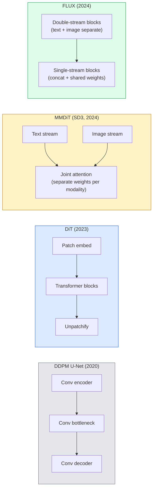

# Transformadores de difusión y flujo rectificado . Transformador de difusión y flujo completo .

> La U-Net no es el secreto de la difusión. reemplázala con un transformador, cambia el horario de ruido por un flujo en línea recta, y de repente tienes SD3, FLUX, y cada modelo de texto a imagen de 2026.

> **【中文解读】**U-Net no es el secreto del modelo de difusión. Con Transformer sustituir U-Net, con direct line stream (Flow rectificado) sustituir la regulación del ruido, ya obtuvimos SD3、FLUX etc.

> **【拓展：DiT 是 2024-2026 的趋势】**Transfusión Transformer (DiT) 将 Transformer的可扩展性带入扩散模型──Sora(视频生成)、Stable Diffusion 3、FLUX 都采用DiT 架构──Relicted Flow 将扩散过程简化为直线插值,训练和推理更高效──

**Type:** Learn + Build | **类型:** 学习 + 动手
**Languages:** Python | **语言:** Python
**Prerequisites:** Phase 4 Lesson 10 (Diffusion DDPM), Phase 4 Lesson 14 (ViT), Phase 7 Lesson 02 (Self-Attention) | **前置知识:** Phase 4 Lesson 10（扩散 DDPM），Phase 4 Lesson 14（ViT），Phase 7 Lesson 02（自注意力）
**Time:** ~75 minutes | **时间:** ~75 分钟

## Objetivos de aprendizaje

- Rastrear la evolución desde la DDPM de U-Net (lección 10) hasta el Transformador de Difusión (DiT), MMDiT (SD3) y el DiT de un solo + doble flujo (FLUX)
- Explica el flujo rectificado: por qué una trayectoria en línea recta entre el ruido y los datos permite que los modelos muestren en 20 pasos en lugar de 1000
- Implementar un pequeño bloque de DiT y un bucle de entrenamiento de flujo rectificado, ambos por debajo de 100 líneas
- Distinguir las variantes de modelos (SD3, FLUX.1-dev, FLUX.1-schnell, Z-Image, Qwen-Image) por arquitectura, número de parámetros y licencia

> **【中文解读】**El objetivo de aprendizaje enumera las capacidades centrales que debe dominarse después de completar la clase.


## El problema es la introducción del problema

La lección 10 construyó un DDPM con un denoizador U-Net. Esa receta dominó 2020-2023: U-Net + programa beta + pérdida de predicción de ruido.

> Se construyó un dispositivo de ruido con U-Net. Ese programa en el año 2020-2023 fue el principal: U-Net + beta 调度 + 噪音预测损失.

Cada modelo de texto a imagen de 2026 ha pasado por delante. Estable Diffusion 3, FLUX, SD4, Z-Image, Qwen-Image, Hunyuan-Image  ninguno utiliza una U-Net. Utilizan Transformadores de Diffusión (DiT). SD3 y FLUX también intercambian el horario de ruido DDPM por flujo rectificado, lo que endereza el camino del ruido a los datos y permite inferencia de 1-4 pasos con consistencia o variantes destiladas.

> Cada modelo de texto hasta imágenes más avanzado de 2026 ya lo ha superado. La difusión estable 3、FLUX、SD4、Z-Image、Qwen-Image、Hunyuan-Image no utiliza U-Net. Utilizan el Transformer DiT (DiT)。SD3 y FLUX. También utilizan el flujo completo para reemplazar la modulación de ruido DDPM, que se desplazará de la ruta del ruido a la información, y se realizará a través de la concordancia o la variación de vapor en 1 a 4 pasos.

El cambio es importante porque es la razón por la que la generación de imágenes basada en difusión se hizo controlable, precisa de inmediato (renderización de texto resuelta SD3/SD4) y rápida de producción.

> Este cambio es importante, ya que se basa en la generación de imágenes de difusión que se vuelve controlable 提示精确 (SD3/SD4 解决文本染) y la causa de la producción rápida ⋅ comprender DiT + 整流就是理解2026年的生成图像技术──

## El concepto central.

> **【中文解读】**Este capítulo presenta los conceptos y teorías básicos. La comprensión de estos conceptos es el prerrequisito de la realización posterior de la actividad, y también el conocimiento de los puntos de alta frecuencia de la entrevista y la práctica de la ingeniería.


### De U-Net a transformador



- **DiT**(Peebles & Xie, 2023)  reemplazar la U-Net con un transformador similar a ViT en parches latentes.
  En inglés:**DiT**(Peebles & Xie,2023) User类 ViT 的变压器 替换 U-Net 处理潜变量补丁──通过自适应层归归一化(AdaLN) realizar la condicionamiento──
- **MMDiT**(SD3, Esser et al., 2024)  dos flujos con pesos separados para tokens de texto e imagen que comparten una atención conjunta.
  En inglés:**MMDiT**(SD3,Esser et al., 2024)  dos ramas separadas tienen el derecho de procesar el texto y los tokens de imágenes, compartiendo la atención conjunta
- **FLUX**(Black Forest Labs, 2024)  los primeros bloques N de doble corriente como SD3, los bloques posteriores concatenan y comparten pesos (circuito único) para la eficiencia en mayor profundidad.
  En inglés:**FLUX**(Black Forest Labs, 2024) 前 N 个块像 SD3 一样双流,后续块拼接并共享权重(单流) para mejorar la eficiencia de la capa profunda。
- **Z-Image**(2025)  una DiT eficiente de un solo flujo a 6B parámetros que desafía "escala a toda costa".
  En inglés:**Z-Image**(2025) 60 mil millones de paramètres de alta eficiencia en el flujo único de DiT, desafiando la idea de "no contar con el coste de expansión".

### Flujo rectificado en un párrafo

DDPM define el proceso de avance como un SDE ruidoso donde `x_t`El inverso aprendido es una segunda SDE, resuelta por 1000 pequeños pasos.

> DDPM definirá el proceso de avanzada como ruido con micro-cuaducción de la SDE, entre ellos:`x_t`逐渐被损坏──学习到的反向是第二个SDE,通过1000小步求解──

El flujo rectificado define un **straight-line**Interpolación entre datos limpios y ruido puro:

> Toda la corriente define entre datos netos y ruido puro**直线**插值:

```
x_t = (1 - t) * x_0 + t * epsilon,     t in [0, 1]
```

Entrenar una red para predecir la velocidad .`v_theta(x_t, t) = epsilon - x_0` la dirección hacia adelante a lo largo de la trayectoria recta desde datos limpios hasta ruido (`dx_t/dt`En el proceso de muestreo, se integra esta velocidad hacia atrás para pasar del ruido hacia los datos.

> 训练网络预测速度   entrenamiento de la red`v_theta(x_t, t) = epsilon - x_0` desde datos de calidad hasta ruido en la dirección del frente`dx_t/dt`)¬, por ejemplo, la velocidad de la acumulación inversa del ruido hacia los datos¬, se acerca más a la línea recta, por lo que la cantidad de pasos de acumulación requeridos en la toma de datos es reducida en gran medida¬¬¬.

SD3 llama esto .**Rectified Flow Matching**. FLUX, Z-Image y la mayoría de los modelos 2026 utilizan el mismo objetivo. Inferencia típica: 20-30 pasos de Euler (determinista) vs 50+ pasos de DDIM en el antiguo régimen DDPM. Las variantes destiladas / turbo / rápidas / LCM lo reducen a 1-4 pasos.

> SD3 se llamará**整流流匹配** FLUX、Z-Image 和 la mayoría de los modelos de 2026 años utilizan el mismo objetivo── típico teoría:20-30 步 Euler(determinación) vs 旧 DDPM 方案的 50+ 步 DDIM──蒸/turbo/schnell/LCM 变体降至1-4 步──

### Condicionamiento de la AdaLN

Condición de los DTs en el paso de tiempo y clase/texto**adaptive layer norm**: predicción `scale`y `shift`Es mucho más limpio que la modulación estilo FiLM en U-Nets y el predeterminado en todos los modernos DiT.

> DiT                                                                                                                                                                                                                                                                                                                                                                                                                                                                                                                            **自适应层归一化**Para el tiempo y las categorías / textos para condicionar: desde condiciones de velocidad de pronóstico`scale`Y `shift`En la actualidad, el sistema de control de datos de la red de Internet (FiLM) es el modelo de control de datos de cada red de Internet.

```
cond -> MLP -> (scale, shift, gate)
norm(x) * (1 + scale) + shift, then residual add * gate
```

### Códigos de texto en SD3 y FLUX

- **SD3**utiliza tres codificadores de texto: dos modelos CLIP + T5-XXL. Los incorporados se concatenan y se alimentan a la corriente de imágenes como condicionamiento de texto.
- **FLUX**utiliza un CLIP-L + T5-XXL.
- **Qwen-Image / Z-Image**Las variantes utilizan sus propios codificadores de texto internos alineados con sus LLM básicos.

El codificador de texto es una gran parte de por qué SD3/FLUX razona acerca de las instrucciones mucho mejor que SD1.5. T5-XXL solo es 4.7B parámetros.

### Las orientaciones sin clasificador siguen vigentes

El flujo rectificado cambia el muestreo, no el acondicionamiento. La guía sin clasificador (dibujo de texto con probabilidad del 10% durante el entrenamiento, mezcla predicciones condicionales e incondicionales a la inferencia) funciona de manera idéntica con el flujo rectificado. La mayoría de los modelos 2026 utilizan una escala de guía de 3.5-5  menor que la 7.5 de SD1.5, ya que los modelos de flujo rectificado siguen las instrucciones más estrictamente por defecto.

### Constancia, Turbo, Schnell, LCM

Cuatro nombres para la misma idea: destilar un modelo lento de muchos pasos en un modelo rápido de pocos pasos.

- **LCM (Latent Consistency Model)** entrenar a un estudiante que predica el final `x_0`de cualquier intermediario `x_t`en un solo paso.
- **SDXL Turbo / FLUX schnell** Modelos de 1 a 4 pasos entrenados con destilación de difusión adversaria.
- **SD Turbo** Modelos de consistencia de estilo OpenAI adaptados a la difusión latente.

La producción de cualquier nuevo modelo de buques tiene un punto de control de "capacidad completa" y una variante "turbo / rápido". Schnell ("rápido" en alemán, convención de Black Forest Labs) se ejecuta en 1-4 pasos y se ajusta a las tuberías en tiempo real.

### Paisaje modelo en 2026

| Model | Size | Architecture | License |
|-------|------|--------------|---------|
| Stable Diffusion 3 Medium | 2B | MMDiT | SAI Community |
| Stable Diffusion 3.5 Large | 8B | MMDiT | SAI Community |
| FLUX.1-dev | 12B | Double + Single Stream DiT | non-commercial |
| FLUX.1-schnell | 12B | same, distilled | Apache 2.0 |
| FLUX.2 | — | iterated FLUX.1 | mixed |
| Z-Image | 6B | S3-DiT (Scalable Single-Stream) | permissive |
| Qwen-Image | ~20B | DiT + Qwen text tower | Apache 2.0 |
| Hunyuan-Image-3.0 | ~80B | DiT | research |
| SD4 Turbo | 3B | DiT + distillation | SAI Commercial |

FLUX.1-schnell es el código abierto por defecto de 2026. Z-Image es el líder de eficiencia. FLUX.2 y SD4 son los consejos de calidad actuales.

### Por qué este cambio de fase importa

DDPM + U-Net funcionó.**better, faster, and scales more cleanly**. La transición es paralela a la de los RNN a los transformadores en la PNL: ambas arquitecturas resolvieron el mismo problema, pero los transformadores se escalaron y ahora dominan. Cada artículo de 2026 sobre generación de imágenes, videos o 3D utiliza un denoizador en forma de DiT y generalmente un objetivo de flujo rectificado.

> DDPM + U-Net 可行──DiT + 整流流**更好、更快、扩展更干净** Este cambio es similar al de la NLP en la transición de RNN a Transformer: dos tipos de arquitectura resuelven el mismo problema, pero Transformer más equipada con expansibilidad y finalmente dominar.

> **【拓展：工业部署中的视觉系统】**En la implementación industrial real, los modelos de visión necesitan considerar la posibilidad de retraso, el tamaño del modelo, la adaptación de los dispositivos de borde, etc. TensorRT, ONNX Runtime, OpenVINO son herramientas de aceleración de la teoría de uso habitual.

> **【拓展：数据标注与质量】**视觉任务的效果高度依赖标签数据质量──标签工作室、CVAT es la principal herramienta de marcado──在工业场景中,主动学习(Active Learning) puede reducir el costo de marcado: modelo a un requerimiento de muestras indeterminadas, marcación automática de muestras de determinación──


## Construye y realiza.

> **【中文解读】**Este capítulo a través del código de la implementación de algoritmos centrales de cero. Este método "desde cero" puede ayudar a entender el principio detrás del marco, no se encuentra en la caja negra cuando se encuentran problemas.

```figure
cv3-rectified-flow
```

## Construye el mismo

### Paso 1: Bloqueo de DiT con AdaLN

```python
import torch
import torch.nn as nn


class AdaLNZero(nn.Module):
    """
    Adaptive LayerNorm with a gate. Predicts (scale, shift, gate) from the conditioning.
    Init such that the whole block starts as identity ("zero init").
    """

    def __init__(self, dim, cond_dim):
        super().__init__()
        self.norm = nn.LayerNorm(dim, elementwise_affine=False)
        self.mlp = nn.Linear(cond_dim, dim * 3)
        nn.init.zeros_(self.mlp.weight)
        nn.init.zeros_(self.mlp.bias)

    def forward(self, x, cond):
        scale, shift, gate = self.mlp(cond).chunk(3, dim=-1)
        h = self.norm(x) * (1 + scale.unsqueeze(1)) + shift.unsqueeze(1)
        return h, gate.unsqueeze(1)


class DiTBlock(nn.Module):
    def __init__(self, dim=192, heads=3, mlp_ratio=4, cond_dim=192):
        super().__init__()
        self.adaln1 = AdaLNZero(dim, cond_dim)
        self.attn = nn.MultiheadAttention(dim, heads, batch_first=True)
        self.adaln2 = AdaLNZero(dim, cond_dim)
        self.mlp = nn.Sequential(
            nn.Linear(dim, dim * mlp_ratio),
            nn.GELU(),
            nn.Linear(dim * mlp_ratio, dim),
        )

    def forward(self, x, cond):
        h, gate1 = self.adaln1(x, cond)
        a, _ = self.attn(h, h, h, need_weights=False)
        x = x + gate1 * a
        h, gate2 = self.adaln2(x, cond)
        x = x + gate2 * self.mlp(h)
        return x
```

`AdaLNZero`El entrenamiento empuja el bloque de la identidad; esto estabiliza dramáticamente los modelos de difusión de transformadores profundos.

### Paso 2: Una pequeña dieta

```python
def timestep_embedding(t, dim):
    import math
    half = dim // 2
    freqs = torch.exp(-math.log(10000) * torch.arange(half, device=t.device) / half)
    args = t[:, None].float() * freqs[None]
    return torch.cat([args.sin(), args.cos()], dim=-1)


class TinyDiT(nn.Module):
    def __init__(self, image_size=16, patch_size=2, in_channels=3, dim=96, depth=4, heads=3):
        super().__init__()
        self.patch_size = patch_size
        self.num_patches = (image_size // patch_size) ** 2
        self.patch = nn.Conv2d(in_channels, dim, kernel_size=patch_size, stride=patch_size)
        self.pos = nn.Parameter(torch.zeros(1, self.num_patches, dim))
        self.time_mlp = nn.Sequential(
            nn.Linear(dim, dim * 2),
            nn.SiLU(),
            nn.Linear(dim * 2, dim),
        )
        self.blocks = nn.ModuleList([DiTBlock(dim, heads, cond_dim=dim) for _ in range(depth)])
        self.norm_out = nn.LayerNorm(dim, elementwise_affine=False)
        self.head = nn.Linear(dim, patch_size * patch_size * in_channels)

    def forward(self, x, t):
        n = x.size(0)
        x = self.patch(x)
        x = x.flatten(2).transpose(1, 2) + self.pos
        t_emb = self.time_mlp(timestep_embedding(t, self.pos.size(-1)))
        for blk in self.blocks:
            x = blk(x, t_emb)
        x = self.norm_out(x)
        x = self.head(x)
        return self._unpatchify(x, n)

    def _unpatchify(self, x, n):
        p = self.patch_size
        h = w = int(self.num_patches ** 0.5)
        x = x.view(n, h, w, p, p, -1).permute(0, 5, 1, 3, 2, 4).reshape(n, -1, h * p, w * p)
        return x
```

### Paso 3: Entrenamiento de flujo rectificado

```python
import torch.nn.functional as F

def rectified_flow_train_step(model, x0, optimizer, device):
    model.train()
    x0 = x0.to(device)
    n = x0.size(0)
    t = torch.rand(n, device=device)
    epsilon = torch.randn_like(x0)
    x_t = (1 - t[:, None, None, None]) * x0 + t[:, None, None, None] * epsilon

    target_velocity = epsilon - x0
    pred_velocity = model(x_t, t)

    loss = F.mse_loss(pred_velocity, target_velocity)
    optimizer.zero_grad()
    loss.backward()
    optimizer.step()
    return loss.item()
```

Comparar con la pérdida de predicción del ruido de DDPM (lección 10): la misma estructura, diferente objetivo.`epsilon`, predicimos el**velocity** `epsilon - x_0`, que apunta desde los datos al ruido a lo largo de la interpolación en línea recta.

### Paso 4: Muestra de Euler

El método de Euler es el más simple y, para un modelo de flujo rectificado bien entrenado, casi tan preciso como los solventes de orden superior a más de 20 pasos.

```python
@torch.no_grad()
def rectified_flow_sample(model, shape, steps=20, device="cpu"):
    model.eval()
    x = torch.randn(shape, device=device)
    dt = 1.0 / steps
    t = torch.ones(shape[0], device=device)
    for _ in range(steps):
        v = model(x, t)
        x = x - dt * v
        t = t - dt
    return x
```

En un modelo entrenado se producen muestras comparables a las de 1000 pasos.

### Paso 5: Prueba de humo de extremo a extremo

```python
import numpy as np

def synthetic_blobs(num=200, size=16, seed=0):
    rng = np.random.default_rng(seed)
    out = np.zeros((num, 3, size, size), dtype=np.float32)
    yy, xx = np.meshgrid(np.arange(size), np.arange(size), indexing="ij")
    for i in range(num):
        cx, cy = rng.uniform(4, size - 4, size=2)
        r = rng.uniform(2, 4)
        mask = (xx - cx) ** 2 + (yy - cy) ** 2 < r ** 2
        colour = rng.uniform(-1, 1, size=3)
        for c in range(3):
            out[i, c][mask] = colour[c]
    return torch.from_numpy(out)
```

> **【中文解读】**Este capítulo muestra cómo utilizar un marco maduro (como PyTorch、HuggingFace, etc.) para aplicar rápidamente esta tecnología. En los proyectos reales, se realiza con prioridad el uso de un marco experimentado, se pueden reducir errores y mejorar la eficiencia de desarrollo.


Entrenamiento a `TinyDiT`Después de 500 pasos, las salidas muestran que deben parecer manchas de color débiles.


> **【拓展：视觉模型的持续学习】**En el entorno de producción, el modelo visual necesita adaptarse continuamente a nuevos datos. Esto es especialmente importante en la conducción automotriz y el control de calidad industrial.

## Usalo con el marco de ejecución

Para la generación de imágenes reales con FLUX / SD3 / Z-Image, `diffusers`los buques que tengan una API unificada:

```python
from diffusers import FluxPipeline, StableDiffusion3Pipeline
import torch

pipe = FluxPipeline.from_pretrained(
    "black-forest-labs/FLUX.1-schnell",
    torch_dtype=torch.bfloat16,
).to("cuda")

out = pipe(
    prompt="a golden retriever surfing a tsunami, hyperrealistic, studio lighting",
    guidance_scale=0.0,           # schnell was trained without CFG
    num_inference_steps=4,
    max_sequence_length=256,
).images[0]
out.save("surf.png")
```

Tres líneas.`FLUX.1-schnell`En cuatro pasos. Cambiar el modelo de identificación por `black-forest-labs/FLUX.1-dev`para una calidad superior a 20-30 pasos con CFG.

Para SD3:

> **【中文解读】**Este capítulo se centra en cómo se puede implementar el modelo como producto disponible. Desde el modelo original hasta el sistema de producción, se deben considerar múltiples dimensiones de optimización de rendimiento, tratamiento de errores, control, etc.


```python
pipe = StableDiffusion3Pipeline.from_pretrained(
    "stabilityai/stable-diffusion-3.5-large",
    torch_dtype=torch.bfloat16,
).to("cuda")
out = pipe(prompt, guidance_scale=3.5, num_inference_steps=28).images[0]
```


## Envíe el producto .

> **【中文解读】**Practice los temas de fácil/medio/duro  3 difficulty to pass in  Recomenda al menos completar los temas de grado medio  Grado duro  para la preparación de la entrevista


Esta lección produce:

- `outputs/prompt-dit-model-picker.md` elige entre SD3, FLUX.1-dev, FLUX.1-schnell, Z-Image, SD4 Turbo dada la calidad, latencia y restricciones de licencia.
- `outputs/skill-rectified-flow-trainer.md` escribe un ciclo de entrenamiento completo para el flujo rectificado con muestreo AdaLN DiT y Euler.

## Los ejercicios.

1. **(Easy)**Entrenar el TinyDiT de arriba en el conjunto de datos de manchas sintéticas durante 500 pasos. Comparar las muestras producidas con 10, 20 y 50 pasos de Euler.
2. **(Medium)**Añadir el condicionamiento de texto mediante la concatenado de una clase aprendida incorporada a la hora de incorporar (10 manchas "clases" por color).
3. **(Hard)**Calcule la distancia Fréchet (FID proxy) entre las muestras generadas a partir de las versiones de flujo rectificado y DDPM de la misma red de tamaño entrenada en los mismos datos para el mismo número de pasos.

> **【中文解读】**En el lenguaje de los términos "Lo que la gente dice" vs "Lo que realmente significa" se distingue entre el lenguaje diario y la definición técnica de significado.


## Términos clave .

| Term | What people say | What it actually means |
|------|----------------|----------------------|
| DiT | "Diffusion transformer" | Transformer that replaces the U-Net as the diffusion denoiser; operates on patchified latents |
| AdaLN | "Adaptive layer norm" | Timestep/text conditioning via learned scale, shift, gate applied after LayerNorm; standard in every modern DiT |
| MMDiT | "Multi-modal DiT (SD3)" | Separate weight streams for text and image tokens that share a joint self-attention |
| Single-stream / double-stream | "FLUX trick" | First N blocks double-stream (separate weights per modality), later blocks single-stream (concat + shared weights) for efficiency |
| Rectified flow | "Straight-line noise-to-data" | Linear interpolation between data and noise; network predicts velocity; fewer ODE steps needed at inference |
| Velocity target | "epsilon - x_0" | The regression target in rectified flow; points from clean data to noise |
| CFG guidance | "classifier-free guidance" | Mix conditional and unconditional predictions; still used in rectified-flow models |
| Schnell / turbo / LCM | "1-4 step distillation" | Small-step variants distilled from full-quality models; production real-time |

> **【中文解读】**延伸阅读 proporciona un alto nivel de recursos para el aprendizaje profundo. Estos artículos y cursos son los referentes clásicos en el campo, adecuados para los lectores que necesitan una comprensión profunda.


## Más Leer más Leer más

- [Scalable Diffusion Models with Transformers (Peebles & Xie, 2023)](https://arxiv.org/abs/2212.09748) el papel de DiT
- [Scaling Rectified Flow Transformers (Esser et al., SD3 paper)](https://arxiv.org/abs/2403.03206) MMDiT y flujo rectificado a escala
- [FLUX.1 model card and technical report (Black Forest Labs)](https://huggingface.co/black-forest-labs/FLUX.1-dev) Detalles de doble + de corriente única
- [Z-Image: Efficient Image Generation Foundation Model (2025)](https://arxiv.org/html/2511.22699v1) DiT de corriente única en 6B
- [Elucidating the Design Space of Diffusion (Karras et al., 2022)](https://arxiv.org/abs/2206.00364) la referencia para cada tradeoff de diseño de difusión
- [Latent Consistency Models (Luo et al., 2023)](https://arxiv.org/abs/2310.04378) cómo LCM- LoRA le da una inferencia de 4 pasos
