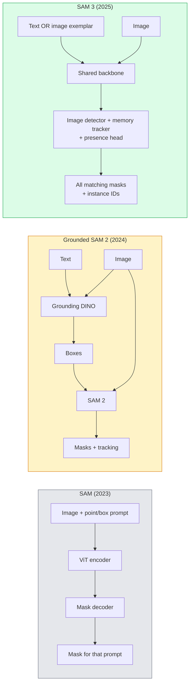

# SAM 3 y segmentación de vocabulario abierto.

> Dale a un modelo un mensaje de texto y una imagen y obtenga máscaras para cada objeto que coincida.

> **【中文解读】**给模型一个文本提示和一个图像,就能得到所有匹配对象的分割掩码──SAM 3(Segmento Cualquier cosa Modelo 3) convertirá este proceso en una sola y única forma de propagación──开放词汇分分突破传统分化模型只能识别训练类的限制──

> **【拓展：SAM 的革命性影响】**SAM 系列模型(Meta 发布) es un "modelo básico" del campo de la división, puede ser utilizado para la distribución de cualquier objeto.

**Type:** Use + Build | **类型:** 应用 + 动手
**Languages:** Python | **语言:** Python
**Prerequisites:** Phase 4 Lesson 07 (U-Net), Phase 4 Lesson 08 (Mask R-CNN), Phase 4 Lesson 18 (CLIP) | **前置知识:** Phase 4 Lesson 07（U-Net），Phase 4 Lesson 08（Mask R-CNN），Phase 4 Lesson 18（CLIP）
**Time:** ~60 minutes | **时间:** ~60 分钟

## Objetivos de aprendizaje

- Distinguir entre SAM (solo las instrucciones visuales), SAM / SAM 2 (detector + SAM) y SAM 3 (instrucciones de texto nativo a través de la segmentación de conceptos de prueba)
- Explica la arquitectura SAM 3: espina dorsal compartida + detector de imágenes + rastreador de vídeo basado en memoria + cabeza de presencia + diseño de detector- rastreador desconectado
- Usar el abrazo facial `transformers`Integración SAM 3 para la detección, segmentación y seguimiento de vídeo mediante texto
- Elija entre SAM 3, SAM de tierra 2, YOLO-World y SAM-MI en función de la latencia, la complejidad del concepto y el objetivo de implementación

> **【中文解读】**El objetivo de aprendizaje enumera las capacidades centrales que debe dominarse después de completar la clase.


## El problema es la introducción del problema

El SAM 2023 era un modelo de solo visual-impresión: se hace clic en un punto o dibujar una caja y devuelve una máscara. Para "dame todas las naranjas en esta foto" se necesitaba un detector (Grounding DINO) para producir cajas, luego SAM para segmentar cada una. SAM en tierra convirtió esto en una tubería, pero era una cascada de dos modelos congelados con una inevitable acumulación de errores.

> SAM de 2023 es un modelo de sólo la muestra visual: usted hace clic en un punto o dibujar un cuadro, que devuelve un asfalto. Para "deme esta foto en todos los suyos", usted necesita un detector para producir un cuadro, y luego usar SAM para dividir cada uno.

SAM 3 (Meta, noviembre 2025, ICLR 2026) derrumbó la cascada. acepta una frase de nombre corto o un ejemplar de imagen como un prompt y devuelve todas las máscaras y ID de instancia correspondientes en un solo pase hacia adelante.**Promptable Concept Segmentation (PCS)**Combinado con la actualización de Object Multiplex de marzo de 2026 (SAM 3.1), rastrea múltiples instancias del mismo concepto a través de vídeo de manera eficiente.

> SAM 3(Meta,2025年11月,ICLR 2026) se dobló el nivel de unidad.**可提示概念分割（PCS）**◊结合 2026 年 3 月的 Object Multiplex 更新(SAM 3.1), puede ser eficaz en el vídeo para seguir el mismo concepto en varios ejemplos。

Esta lección trata sobre el cambio estructural que representa. Seg 2D, detección y conexión a tierra de imágenes de texto se han fusionado en un modelo. La pregunta de producción ya no es "qué tubería encadenar juntos" sino "qué modelo de aplicación maneja mi caso de uso de extremo a extremo".

> Este curso habla de la transformación estructural que representa esto. La base de la división, la investigación y el texto-imagen se han unido en un modelo. La cuestión de producción no es más "qué flujos de agua he conectado juntos", sino "qué modelo de sugerencia puede tratar de un lado a otro mis casos de uso".

## El concepto central.

> **【中文解读】**Este capítulo presenta los conceptos y teorías básicos. La comprensión de estos conceptos es el prerrequisito de la realización posterior de la actividad, y también el conocimiento de los puntos de alta frecuencia de la entrevista y la práctica de la ingeniería.


### Las tres generaciones



### Segmentación de conceptos rápida

Un "concept prompt" es una frase de nombre corto (`"yellow school bus"`¿ Qué ?`"striped red umbrella"`¿ Qué ?`"hand holding a mug"`El modelo devuelve máscaras de segmentación para cada instancia de la imagen que coincida con el concepto, más un ID de instancia único por coincidencia.

> "提示概念词" es una palabra abreviada en el nombre de短语或图像示例──模型返回图像中匹配的概念所有实例的分割掩码,加上每个匹配的唯一实例ID──

Esto difiere del SAM visual-prompt clásico en tres maneras:

> Esto es diferente a lo que es el SAM visual con tres diferencias:

1. No se requiere una solicitud por instancia  una solicitud de texto devuelve todas las coincidencias.
   No es necesario que cada ejemplo de la información sea un ejemplo de la información.
2. El concepto de vocabulario abierto puede ser cualquier cosa descriptible en lenguaje natural.
   El concepto de "concepto libre" puede ser cualquier cosa que pueda describirse en el lenguaje natural.
3. Retorna múltiples instancias a la vez en lugar de una máscara por pedido.
   Traducción: Una vez vuelve a muchos ejemplos, en lugar de cada sugerencia un escondido.

### Las piezas arquitectónicas clave

- **Shared backbone** un solo ViT procesa la imagen. tanto la cabeza del detector como el rastreador basado en la memoria se leen de ella.
  En inglés:**共享骨干** Un solo ViT  procesamiento de imágenes  inspección de cabeza y el seguimiento basado en la memoria 
- **Presence head** predice si el concepto está presente en la imagen en absoluto. Decupla "¿está esto aquí?" de "dónde está?".
  En inglés:**存在性头** Prevé concepto ¿existe en la imagen?将" esto aquí? " y "¿está en dónde?"
- **Decoupled detector-tracker** La detección a nivel de imagen y el seguimiento a nivel de vídeo tienen cabezas separadas para que no interfieran.
  En inglés:**解耦的检测器-跟踪器** Imagen y videos de la categoría de seguimiento tienen cabezas independientes, interrumpense entre sí.
- **Memory bank** almacena las características por instancia en los marcos para el seguimiento de vídeo (el mismo mecanismo SAM 2 utilizado).
  En inglés:**记忆库**                                                                                                                                                                                                                                                              

### Formación a escala

SAM 3 fue entrenado en **4 million unique concepts**La nueva tecnología de la información de la información de la información de la información de la información de la información de la información de la información de la información de la información de la información de la información de la información de la información de la información de la información de la información de la información de la información de la información de la información de la información de la información de la información de la información de la información de la información de la información de la información de la información de la información de la información de la información de la información de la información de la información de la información de la información de la información de la información de la información de la información de la información de la información de la información de la información de la información de la información de la información de la información de la información de la información de la información de la información de la información de la información de la información de la información de la información de la información de la información de la información de la información de la información de la información de la información de la información de la información de la información de la información de la información de la información de la información de la información de la información de la información de la información de la información de la información de la información de la información de la información de la información de la información de la información de la información de la información de la información de la información de la información de la información de la información de la información de la información de la información de la información de la información de la información de la información de la información de la información de la información de la información de la información de la información de la información de la información de la información de la información de la información de la información de la información de la información de la información de la información de la información de la información de la información de la información de la información de la información de la información de la información de la información de la información de la información de la información de la información de la información de la información de la información de la información de la información de la información de la información de la información de la información de la información de la información de la información de la información de la información de la información de la información de la cuyo.**SA-CO benchmark**El SAM 3 alcanza el 75-80% del rendimiento humano en SA-CO y duplica los sistemas existentes en PCS de imagen + vídeo.

### SAM 3.1 Objeto múltiple

Actualización de marzo de 2026: **Object Multiplex**Introduce un mecanismo de memoria compartida para el seguimiento conjunto de muchas instancias del mismo concepto a la vez. Anteriormente, el seguimiento de N instancias significaba N bancos de memoria separados. Multiplex se desmorona en una memoria compartida con consultas por instancia. Resultado: seguimiento de múltiples objetos sustancialmente más rápido sin sacrificar la precisión.

### Donde la SAM de tierra todavía importa en 2026

- Cuando se necesita un detector específico de vocabulario abierto para intercambiarlo (DINO-X, Florence-2).
- Cuando la licencia SAM 3 (guarded en HF) es un bloqueador.
- Cuando necesitas más control sobre el umbral del detector que SAM 3 expone.
- Para la investigación/ablación del componente del detector.

Para la mayoría de los trabajos de producción, SAM 3 es la respuesta más simple.

### YOLO-World vs SAM 3

- **YOLO-World** Detector de vocabulario abierto (sin máscaras). En tiempo real. Mejor cuando necesitas cajas a alta velocidad.
  En inglés:**YOLO-World**仅开放词汇检测器 (仅开放词汇检测器) 无掩码) 实时――需要高fps 框时的最佳选择──
- **SAM 3** Segmentación completa + seguimiento.
  En inglés:**SAM 3** completa división + 跟踪──更慢但输出更丰富──

Producción dividida: YOLO-World para tuberías de detección rápida (navegación robótica, paneles de control rápidos), SAM 3 para cualquier cosa que necesite máscaras o seguimiento.

> Productos de producción: YOLO-World utiliza para la rápida prueba de flujo de agua, la navegación de los ordenadores, la velocidad de los instrumentos, la SAM 3 utiliza para el oculto o el seguimiento de las situaciones.

### Eficiencia de SAM-MI

SAM-MI (2025-2026) aborda el cuello de botella del decodificador SAM.

- **Sparse point prompting** utiliza algunos puntos bien elegidos en lugar de pedidos densos; reduce las llamadas del decodificador en un 96%.
- **Shallow mask aggregation** fusiona las predicciones de máscaras en una máscara más nítida.
- **Decoupled mask injection** El decodificador recibe características de máscara precomputadas en lugar de volver a ejecutarse.

Resultado: ~ 1,6x de aceleración sobre el SAM de base en los puntos de referencia de vocabulario abierto.

### Formatos de salida para los tres modelos

Todos devuelven la misma estructura general (cajas + etiquetas + puntuaciones + máscaras + ID), lo que es útil  su tubería río abajo no tiene que ramificar en el modelo que se ejecutó.

> **【拓展：工业部署中的视觉系统】**En la implementación industrial real, los modelos de visión necesitan considerar la posibilidad de retraso, el tamaño del modelo, la adaptación de los dispositivos de borde, etc. TensorRT, ONNX Runtime, OpenVINO son herramientas de aceleración de la teoría de uso habitual.

> **【拓展：数据标注与质量】**视觉任务的效果高度依赖标签数据质量──标签工作室、CVAT es la principal herramienta de marcado──在工业场景中,主动学习(Active Learning) puede reducir el costo de marcado: modelo a un requerimiento de muestras indeterminadas, marcación automática de muestras de determinación──


## Construye y realiza.

> **【中文解读】**Este capítulo a través del código de la implementación de algoritmos centrales de cero. Este método "desde cero" puede ayudar a entender el principio detrás del marco, no se encuentra en la caja negra cuando se encuentran problemas.

```figure
cv3-open-vocab
```

## Construye el mismo

### Paso 1: Construcción rápida

Construir un ayudante que convierta una oración de usuario en una lista de instrucciones de concepto SAM 3. Este es el límite donde "lo que el usuario ha escrito" se encuentra con "lo que el modelo consume".

```python
def split_concepts(sentence):
    """
    Heuristic splitter for multi-concept prompts.
    Returns list of short noun phrases.
    """
    for sep in [",", ";", "and", "or", "&"]:
        if sep in sentence:
            parts = [p.strip() for p in sentence.replace("and ", ",").split(",")]
            return [p for p in parts if p]
    return [sentence.strip()]

print(split_concepts("cats, dogs and balloons"))
```

SAM 3 acepta un concepto por pase avanzado; para consultas de conceptos múltiples, bucle o lote.

### Paso 2: ayudantes de postprocesamiento

Convierta las salidas de SAM 3 en una lista limpia de detecciones que coincidan con nuestro contrato de tubería de la Lección 16.

```python
from dataclasses import dataclass
from typing import List

@dataclass
class ConceptDetection:
    concept: str
    instance_id: int
    box: tuple          # (x1, y1, x2, y2)
    score: float
    mask_rle: str       # run-length encoded


def rle_encode(binary_mask):
    flat = binary_mask.flatten().astype("uint8")
    runs = []
    prev, count = flat[0], 0
    for v in flat:
        if v == prev:
            count += 1
        else:
            runs.append((int(prev), count))
            prev, count = v, 1
    runs.append((int(prev), count))
    return ";".join(f"{v}x{c}" for v, c in runs)
```

RLE mantiene las cargas útiles de respuesta pequeñas incluso para muchas máscaras de alta resolución.

### Paso 3: Interfaz de segmentación de vocabulario abierto unificado

Envuelve cualquier backend que tengas (SAM 3, SAM 2, YOLO-World + SAM 2) detrás de un solo método.

```python
from abc import ABC, abstractmethod
import numpy as np

class OpenVocabSeg(ABC):
    @abstractmethod
    def detect(self, image: np.ndarray, concept: str) -> List[ConceptDetection]:
        ...


class StubOpenVocabSeg(OpenVocabSeg):
    """
    Deterministic stub used for pipeline testing when real models are not loaded.
    """
    def detect(self, image, concept):
        h, w = image.shape[:2]
        return [
            ConceptDetection(
                concept=concept,
                instance_id=0,
                box=(w * 0.2, h * 0.3, w * 0.5, h * 0.8),
                score=0.89,
                mask_rle="0x100;1x50;0x200",
            ),
            ConceptDetection(
                concept=concept,
                instance_id=1,
                box=(w * 0.55, h * 0.25, w * 0.85, h * 0.75),
                score=0.74,
                mask_rle="0x80;1x40;0x220",
            ),
        ]
```

La verdadera .`SAM3OpenVocabSeg`la subclase se envuelve `transformers.Sam3Model`y `Sam3Processor`¿ Qué ?

### Paso 4: Uso de SAM 3 para abrazar la cara (referencia)

Para el modelo real, el `transformers`integración:

```python
from transformers import Sam3Processor, Sam3Model
import torch

processor = Sam3Processor.from_pretrained("facebook/sam3")
model = Sam3Model.from_pretrained("facebook/sam3").eval()

inputs = processor(images=pil_image, return_tensors="pt")
inputs = processor.set_text_prompt(inputs, "yellow school bus")

with torch.no_grad():
    outputs = model(**inputs)

masks = processor.post_process_masks(
    outputs.masks, inputs.original_sizes, inputs.reshaped_input_sizes
)
boxes = outputs.boxes
scores = outputs.scores
```

Una llamada, todos los partidos regresan en una sola llamada.

### Paso 5: Medir lo que el SAM 2 de tierra te dio gratis

Un punto de referencia honesto: ¿qué sucede cuando reemplazas el SAM 2 con SAM 3 en una tubería real?

- Latencia: SAM 3 guarda un pase hacia adelante (sin detector separado), pero el modelo en sí es más pesado; generalmente net-neutral o un ligero aceleramiento.
- Precisión: SAM 3 es sustancialmente mejor en conceptos raros o de composición ("paraguas rojo rayado").
- Flexibilidad: SAM 2 con tierra permite intercambiar detectores (DINO-X, Florence-2, DINO 1.5); SAM 3 es monolitico.

Conclusión: SAM 3 es el predeterminado para 2026 seg de vocabulario abierto. SAM 2 con base en tierra es todavía la respuesta correcta cuando necesitas flexibilidad de detector o diferentes términos de licencia.

> **【中文解读】**Este capítulo muestra cómo utilizar un marco maduro (como PyTorch、HuggingFace, etc.) para aplicar rápidamente esta tecnología. En los proyectos reales, se realiza con prioridad el uso de un marco experimentado, se pueden reducir errores y mejorar la eficiencia de desarrollo.


> **【拓展：视觉模型的持续学习】**En el entorno de producción, el modelo visual necesita adaptarse continuamente a nuevos datos. Esto es especialmente importante en la conducción automotriz y el control de calidad industrial.

## Usalo con el marco de ejecución

Modelos de despliegue de la producción:

- **Real-time annotation** SAM 3 + CVAT etiqueta como texto de la función de la solicitud. Anotadores seleccionar un nombre de etiqueta; SAM 3 pre-etiqueta cada caso correspondiente. Revisión y corrección.
- **Video analytics** SAM 3.1 Objeto múltiple para el seguimiento de múltiples objetos; marcos de alimentación al rastreador basado en memoria.
- **Robotics** SAM 3 para la manipulación de vocabulario abierto ("recoger la taza roja"); se ejecuta como un programa de planificación primitiva.
- **Medical imaging** SAM 3 ajustado a los conceptos médicos; requiere una solicitud de acceso en HF.

> **【中文解读】**Este capítulo se centra en cómo se puede implementar el modelo como producto disponible. Desde el modelo original hasta el sistema de producción, se deben considerar múltiples dimensiones de optimización de rendimiento, tratamiento de errores, control, etc.


Ultralytics incluye SAM 3 en su paquete Python:

```python
from ultralytics import SAM

model = SAM("sam3.pt")
results = model(image_path, prompts="yellow school bus")
```

La misma interfaz que YOLO y SAM 2.


## Envíe el producto .

> **【中文解读】**Practice los temas de fácil/medio/duro  3 difficulty to pass in  Recomenda al menos completar los temas de grado medio  Grado duro  para la preparación de la entrevista


Esta lección produce:

- `outputs/prompt-open-vocab-stack-picker.md` un prompt que selecciona SAM 3 / SAM 2 / YOLO-World / SAM-MI basado en la latencia, la complejidad del concepto y la licencia.
- `outputs/skill-concept-prompt-designer.md` una habilidad que convierte las declaraciones del usuario en instrucciones de concepto SAM 3 bien formadas (dividir, desambiguación, fallbacks).

## Los ejercicios.

1. **(Easy)**Ejecutar SAM 3 en 10 imágenes con las instrucciones de concepto que elija. Comparar con SAM 2 + Grounding DINO 1.5 en las mismas imágenes. Informar qué conceptos cada modelo se perdió.
2. **(Medium)**Construir una interfaz de usuario "clic-to-incluir / click-to-exclure" en la parte superior de SAM 3: un mensaje de texto devuelve instancias candidatas; los clics del usuario mantienen cuáles cuentan como positivas.
3. **(Hard)**Ajuste el SAM 3 en un conjunto de conceptos personalizados (por ejemplo, 5 tipos de componentes electrónicos) con 20 imágenes etiquetadas cada una. Comparar con el SAM 3 de tiro cero en el mismo conjunto de pruebas; medir la mejora de la UIE de la máscara.

> **【中文解读】**En el lenguaje de los términos "Lo que la gente dice" vs "Lo que realmente significa" se distingue entre el lenguaje diario y la definición técnica de significado.


## Términos clave .

| Term | What people say | What it actually means |
|------|----------------|----------------------|
| Open-vocabulary segmentation | "Segment by text" | Produce masks for objects described in natural language, not a fixed label set |
| PCS | "Promptable Concept Segmentation" | SAM 3's core task — given a noun-phrase or image exemplar, segment all matching instances |
| Concept prompt | "The text input" | Short noun phrase or image exemplar; not a full sentence |
| Presence head | "Is it here?" | SAM 3 module that decides whether the concept exists in the image before localisation |
| SA-CO | "SAM 3 benchmark" | 270K-concept open-vocabulary segmentation benchmark; 50x larger than prior open-vocab benchmarks |
| Object Multiplex | "SAM 3.1 update" | Shared-memory multi-object tracking; fast joint tracking of many instances |
| Grounded SAM 2 | "Modular pipeline" | Detector + SAM 2 cascade; still relevant when detector swap matters |
| SAM-MI | "Efficient SAM variant" | Mask Injection for 1.6x speedup over Grounded-SAM |

> **【中文解读】**延伸阅读 proporciona un alto nivel de recursos para el aprendizaje profundo. Estos artículos y cursos son los referentes clásicos en el campo, adecuados para los lectores que necesitan una comprensión profunda.


## Más Leer más Leer más

- [SAM 3: Segment Anything with Concepts (arXiv 2511.16719)](https://arxiv.org/abs/2511.16719)
- [SAM 3.1 Object Multiplex (Meta AI, March 2026)](https://ai.meta.com/blog/segment-anything-model-3/)
- [SAM 3 model page on Hugging Face](https://huggingface.co/facebook/sam3)
- [Grounded SAM 2 tutorial (PyImageSearch)](https://pyimagesearch.com/2026/01/19/grounded-sam-2-from-open-set-detection-to-segmentation-and-tracking/)
- [Ultralytics SAM 3 docs](https://docs.ultralytics.com/models/sam-3/)
- [SAM3-I: Instruction-aware SAM (arXiv 2512.04585)](https://arxiv.org/abs/2512.04585)
