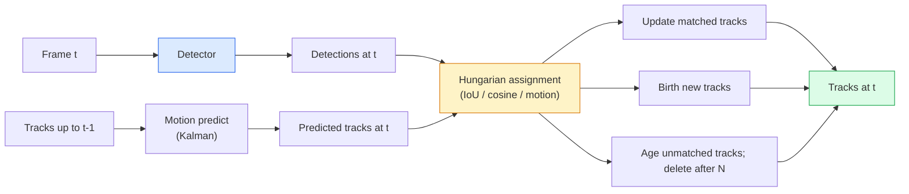

# Seguimiento de múltiples objetos y memoria de vídeo .

> Detectar cada marco, combinar las detecciones de este marco con las de la última imagen por identificación.

> **【中文解读】**Seguir = 检测 + 关联── cada 检测目标, luego se evaluarán los resultados de los controles actuales con los anteriores 匹配──多目标跟踪(MOT) es la tecnología central de la comprensión de vídeos, necesita para tratar la ocultación, desaparición, reaparición, etc. situaciones complejas──

> **【拓展：MOT 的应用】**Más objetivos de seguimiento en seguridad de control (ByteTrack, SORT, DeepSORT)

**Type:** Build | **类型:** 动手
**Languages:** Python | **语言:** Python
**Prerequisites:** Phase 4 Lesson 06 (YOLO Detection), Phase 4 Lesson 08 (Mask R-CNN), Phase 4 Lesson 24 (SAM 3) | **前置知识:** Phase 4 Lesson 06（YOLO 检测），Phase 4 Lesson 08（Mask R-CNN），Phase 4 Lesson 24（SAM 3）
**Time:** ~60 minutes | **时间:** ~60 分钟

## Objetivos de aprendizaje

- Distinguir el seguimiento por detección del seguimiento basado en consultas y nombrar las familias de algoritmos (SORT, DeepSORT, ByteTrack, BoT-SORT, SAM 2 tracker de memoria, SAM 3.1 Object Multiplex)
- Implementar IoU + asignación húngara desde cero para el seguimiento clásico por detección
- Explica el banco de memoria de SAM 2 y por qué maneja mejor la oclusión que la asociación basada en IoU
- Lea las tres métricas de seguimiento (MOTA, IDF1, HOTA) y elija cuál es importante para un caso de uso determinado

> **【中文解读】**El objetivo de aprendizaje enumera las capacidades centrales que debe dominarse después de completar la clase.


## El problema es la introducción del problema

Un detector le dice dónde están los objetos en un solo marco.`t`es el mismo objeto que una detección en el marco `t-1`Sin eso, no puedes contar los objetos que cruzan una línea, seguir una bola a través de una oclusión, o saber "el coche número 4 ha estado en el carril durante 8 segundos".

> El detector te dice la posición del objeto en el solo.`t`¿Cuál de los controles y la segunda?`t-1`¿Cuál de los controles es el mismo objeto? Sin él, no puedes calcular la cantidad de objetos que cruzan la línea, rastrear a la bola oculta, o saber que el coche número 4 ya ha estado en la carretera durante 8 segundos.

El seguimiento es esencial para todos los productos que se encuentran en el video: análisis deportivo, vigilancia, conducción autónoma, análisis de vídeo médico, monitoreo de la vida silvestre, conteo de marcas de palabras. Los componentes básicos se comparten: un detector por marco, un modelo de movimiento (filtro Kalman o algo más rico), un paso de asociación (algoritmo húngaro sobre IoU / cosino / características aprendidas) y un ciclo de vida de la pista (nacimiento, actualización, muerte).

> Seguir es fundamental para cada producto de la película: análisis de la física, control, conducción automática, análisis de la medicina, control de animales salvajes, registro de marcas.

2026 trajo dos nuevos patrones: **SAM 2 memory-based tracking**(Memoria de características en lugar de asociación de modelos de movimiento) y **SAM 3.1 Object Multiplex**Esta lección va por la pila clásica primero, luego el enfoque basado en la memoria.

> El año 2026 trae dos nuevos modelos:**SAM 2 基于记忆的跟踪**(特征记忆替代运动模型关联) y **SAM 3.1 Object Multiplex**(Muchos ejemplos del mismo concepto de memoria compartida) ∼本课先走经典,然后走基于记忆的方法──

## El concepto central.

> **【中文解读】**Este capítulo presenta los conceptos y teorías básicos. La comprensión de estos conceptos es el prerrequisito de la realización posterior de la actividad, y también el conocimiento de los puntos de alta frecuencia de la entrevista y la práctica de la ingeniería.


### Seguimiento por detección



Cada rastreador que encontrarás en 2026 es una variación de este bucle.

> Cada rastreador que encuentres en 2026 es una variación de este ciclo.

- **SORT**(2016): Filtro Kalman + IoU húngaro. Simple, rápido, sin modelo de apariencia.
  En inglés:**SORT**(2016): Karlmann 波器 + IoU 匈牙利算法──简单、快速、无外观模型──
- **DeepSORT**(2017): SORT + una función de apariencia basada en CNN por pista (embedado ReID).
  En inglés:**DeepSORT**(2017):SORT + Cada trayectoria de CNN 外观特征(ReID 嵌入)
- **ByteTrack**(2021): asocia las detecciones de baja confianza como una segunda etapa; no se necesitan características de apariencia, pero el máximo rendimiento en MOT17.
  En inglés:**ByteTrack**(2021):将低信度检测作为第二阶段关联; no se requiere de características externas pero se ha mostrado mejor en el MOT17
- **BoT-SORT**(2022): Byte + compensación de movimiento de la cámara + ReID.
  En inglés:**BoT-SORT**(2022):Byte + 相机运动补偿 + ReID──
- **StrongSORT / OC-SORT**Descendientes de ByteTrack con mejor movimiento y apariencia.
  En inglés:**StrongSORT / OC-SORT**ByteTrack 后代,改进了运动和外观模型──

### Filtro de Kalman en un párrafo

Un filtro Kalman mantiene un estado por pista .`(x, y, w, h, dx, dy, dw, dh)`con una covarianza.**predict**el estado usando un modelo de velocidad constante, entonces **update**La actualización confía más en la detección cuando la incertidumbre de predicción es alta. Esto da trayectorias suaves y la capacidad de continuar una pista a través de una oclusión corta (1-5 cuadros).

> Carman 波器 维护每个轨迹的状态 `(x, y, w, h, dx, dy, dw, dh)`Y la diferencia de la velocidad de cada uno**预测** estado, reutilización de la correspondencia**更新**△ Prevé incertidumbre △ Alta actualización △ Más confianza △ Esto produce una trayectoria plana,并能穿过短暂遮1-5 ) Continuar el seguimiento △

Cada rastreador clásico utiliza un filtro Kalman en el paso de predicción de movimiento.

> Cada rastreador clásico en el movimiento utiliza el mecanismo de control de velocidad.

### El algoritmo húngaro

Dado un `M x N`La matriz de costos (tracks x detections), encontrar la asignación uno a uno que minimice el costo total.`1 - IoU(track_bbox, detection_bbox)`El tiempo de ejecución es O(((M+N) ^3); para M, N hasta ~1000 es lo suficientemente rápido en Python a través de `scipy.optimize.linear_sum_assignment`¿ Qué ?

>                                                                                                                                                                                                                                                                                                                                                                                                                                                                                                                              `M x N`La distribución de los precios de la empresa es de la misma manera que la distribución de los precios de la empresa.`1 - IoU(轨迹框, 检测框)`Otras características de la forma de los cuerpos negativos.`scipy.optimize.linear_sum_assignment`¡Es muy rápido!

### La idea clave de ByteTrack

Los rastreadores estándar permiten detectar detecciones de baja confianza (< 0,5).**second-stage candidates**Después de combinar las pistas con las detecciones de alta confianza, las pistas sin igual tratan de combinar las detecciones de baja confianza con un umbral de UIO ligeramente más flexible.

> 标准跟踪器丢弃低置信度检测(< 0.5)。ByteTrack los guardará para**第二阶段候选**Después de la inspección de alta confianza, los trayectos no coincidentes intentaron adaptarse a la prueba de baja confianza de la UIO con un valor de probabilidad más flexible.

### SAM 2 seguimiento basado en la memoria

SAM 2 maneja el vídeo manteniendo un **memory bank**En un marco, se da un prompt (clic, caja, texto) que codifica la instancia en memoria. En los cuadros posteriores, la memoria se atende cruzado contra las características del nuevo marco, y el decodificador produce una máscara para la misma instancia en el nuevo marco.

No hay filtro Kalman, no hay tarea húngara, la asociación está implícita en la operación de memoria-atención.

Los pros:
- Robusto a grandes oclusiones (la memoria lleva la identidad de la instancia a través de muchos marcos).
- Vocabulario abierto cuando se combina con las instrucciones de texto de SAM 3.
- Funciona sin un modelo de movimiento separado.

Las ventajas:
- Más lento que ByteTrack para el seguimiento de muchos objetos.
- El banco de memoria crece; limita la ventana de contexto.

### SAM 3.1 Objeto múltiple

El rastreo anterior de SAM 2 / SAM 3 mantiene un banco de memoria separado por instancia. Para 50 objetos, 50 bancos de memoria. Object Multiplex (marzo 2026) los desintegra en una memoria compartida con **per-instance query tokens**Las escalas de costes son sublinearias en un número de casos.

Multiplex es el nuevo estándar para el seguimiento de multitudes en 2026: multitudes de conciertos, trabajadores de almacenes, cruces de tráfico.

### Tres métricas que hay que saber

- **MOTA (Multi-Object Tracking Accuracy)** 1 - (interruptores FN + FP + ID) / GT. Peso por tipo de error; una única métrica que combina fallos de detección y asociación.
  En inglés:**MOTA（多目标跟踪精度）**1 - (FN + FP + ID 切换) / GT── según el tipo de error de aumento de poder;将检测和关联失败混混的单一标标──
- **IDF1 (ID F1)** medio armónico de precisión de identificación y recuerdo. Se centra específicamente en la forma en que cada pista de verdad de tierra mantiene su identificación a lo largo del tiempo.
  En inglés:**IDF1（ID F1）**Id precisión y tasa de retorno 调和平均──专注衡量每一个真实轨迹随时间保持ID 的一致性──对ID 切换敏感任务优于MOTA──
- **HOTA (Higher Order Tracking Accuracy)** se descompone en precisión de detección (DetA) y precisión de asociación (AssA).
  En inglés:**HOTA（高阶跟踪精度）** descomponerse para la precisión de análisis  DetA) y关联精度 AssA) ・ los estándares comunitarios desde el año 2020; más completo。

Para la vigilancia (quién es quién): IDF1 es lo que se informa. para el análisis deportivo (pases de contabilidad): HOTA. para la comparación académica general: HOTA.

> 监控(谁是谁): informe IDF1──运动分析(计数传球):HOTA──一般学术比较:HOTA──

> **【拓展：工业部署中的视觉系统】**En la implementación industrial real, los modelos de visión necesitan considerar la posibilidad de retraso, el tamaño del modelo, la adaptación de los dispositivos de borde, etc. TensorRT, ONNX Runtime, OpenVINO son herramientas de aceleración de la teoría de uso habitual.

> **【拓展：数据标注与质量】**视觉任务的效果高度依赖标签数据质量──标签工作室、CVAT es la principal herramienta de marcado──在工业场景中,主动学习(Active Learning) puede reducir el costo de marcado: modelo a un requerimiento de muestras indeterminadas, marcación automática de muestras de determinación──


## Construye y realiza.

> **【中文解读】**Este capítulo a través del código de la implementación de algoritmos centrales de cero. Este método "desde cero" puede ayudar a entender el principio detrás del marco, no se encuentra en la caja negra cuando se encuentran problemas.

```figure
cv3-track-assoc
```

## Construye el mismo

### Paso 1: Matriz de costes basada en la UIE

```python
import numpy as np


def bbox_iou(a, b):
    """
    a, b: (N, 4) arrays of [x1, y1, x2, y2].
    Returns (N_a, N_b) IoU matrix.
    """
    ax1, ay1, ax2, ay2 = a[:, 0], a[:, 1], a[:, 2], a[:, 3]
    bx1, by1, bx2, by2 = b[:, 0], b[:, 1], b[:, 2], b[:, 3]
    inter_x1 = np.maximum(ax1[:, None], bx1[None, :])
    inter_y1 = np.maximum(ay1[:, None], by1[None, :])
    inter_x2 = np.minimum(ax2[:, None], bx2[None, :])
    inter_y2 = np.minimum(ay2[:, None], by2[None, :])
    inter = np.clip(inter_x2 - inter_x1, 0, None) * np.clip(inter_y2 - inter_y1, 0, None)
    area_a = (ax2 - ax1) * (ay2 - ay1)
    area_b = (bx2 - bx1) * (by2 - by1)
    union = area_a[:, None] + area_b[None, :] - inter
    return inter / np.clip(union, 1e-8, None)
```

### Paso 2: Seguimiento de estilo SORT mínimo

Calman de velocidad constante fija omitido para la brevedad  utilizamos una simple asociación IoU aquí; en la producción la predicción Kalman es esencial.`sort`El paquete Python proporciona la versión completa.

```python
from scipy.optimize import linear_sum_assignment


class Track:
    def __init__(self, tid, bbox, frame):
        self.id = tid
        self.bbox = bbox
        self.last_frame = frame
        self.hits = 1

    def update(self, bbox, frame):
        self.bbox = bbox
        self.last_frame = frame
        self.hits += 1


class SimpleTracker:
    def __init__(self, iou_threshold=0.3, max_age=5):
        self.tracks = []
        self.next_id = 1
        self.iou_threshold = iou_threshold
        self.max_age = max_age

    def step(self, detections, frame):
        if not self.tracks:
            for d in detections:
                self.tracks.append(Track(self.next_id, d, frame))
                self.next_id += 1
            return [(t.id, t.bbox) for t in self.tracks]

        track_boxes = np.array([t.bbox for t in self.tracks])
        det_boxes = np.array(detections) if len(detections) else np.empty((0, 4))

        iou = bbox_iou(track_boxes, det_boxes) if len(det_boxes) else np.zeros((len(track_boxes), 0))
        cost = 1 - iou
        cost[iou < self.iou_threshold] = 1e6

        matched_track = set()
        matched_det = set()
        if cost.size > 0:
            row, col = linear_sum_assignment(cost)
            for r, c in zip(row, col):
                if cost[r, c] < 1.0:
                    self.tracks[r].update(det_boxes[c], frame)
                    matched_track.add(r); matched_det.add(c)

        for i, d in enumerate(det_boxes):
            if i not in matched_det:
                self.tracks.append(Track(self.next_id, d, frame))
                self.next_id += 1

        self.tracks = [t for t in self.tracks if frame - t.last_frame <= self.max_age]
        return [(t.id, t.bbox) for t in self.tracks]
```

60 líneas. Toma detecciones por fotograma, devuelve ID de pista por fotograma. Los sistemas reales añaden la predicción de Kalman, el segundo paso de ByteTrack y las características de apariencia.

### Paso 3: Prueba de trayectoria sintética

```python
def synthetic_frames(num_frames=20, num_objects=3, H=240, W=320, seed=0):
    rng = np.random.default_rng(seed)
    starts = rng.uniform(20, 200, size=(num_objects, 2))
    velocities = rng.uniform(-5, 5, size=(num_objects, 2))
    frames = []
    for f in range(num_frames):
        dets = []
        for i in range(num_objects):
            cx, cy = starts[i] + f * velocities[i]
            dets.append([cx - 10, cy - 10, cx + 10, cy + 10])
        frames.append(dets)
    return frames


tracker = SimpleTracker()
for f, dets in enumerate(synthetic_frames()):
    tracks = tracker.step(dets, f)
```

Tres objetos que se mueven en líneas rectas deben mantener sus identidades en los 20 cuadros.

### Paso 4: Metrica de interruptor de identificación

```python
def count_id_switches(tracks_per_frame, gt_per_frame):
    """
    tracks_per_frame:  list of list of (track_id, bbox)
    gt_per_frame:      list of list of (gt_id, bbox)
    Returns number of ID switches.
    """
    prev_assignment = {}
    switches = 0
    for tracks, gts in zip(tracks_per_frame, gt_per_frame):
        if not tracks or not gts:
            continue
        t_boxes = np.array([b for _, b in tracks])
        g_boxes = np.array([b for _, b in gts])
        iou = bbox_iou(g_boxes, t_boxes)
        for g_idx, (gt_id, _) in enumerate(gts):
            j = iou[g_idx].argmax()
            if iou[g_idx, j] > 0.5:
                t_id = tracks[j][0]
                if gt_id in prev_assignment and prev_assignment[gt_id] != t_id:
                    switches += 1
                prev_assignment[gt_id] = t_id
    return switches
```

Esta es una métrica simplificada IDF1 adyacente: cuenta cuántas veces un objeto de verdad de tierra cambia su ID de pista predicha asignada.`py-motmetrics`y `TrackEval`¿ Qué ?

> **【中文解读】**Este capítulo muestra cómo utilizar un marco maduro (como PyTorch、HuggingFace, etc.) para aplicar rápidamente esta tecnología. En los proyectos reales, se realiza con prioridad el uso de un marco experimentado, se pueden reducir errores y mejorar la eficiencia de desarrollo.


> **【拓展：视觉模型的持续学习】**En el entorno de producción, el modelo visual necesita adaptarse continuamente a nuevos datos. Esto es especialmente importante en la conducción automotriz y el control de calidad industrial.

## Usalo con el marco de ejecución

Traqueadores de producción en 2026:

- `ultralytics` YOLOv8 + ByteTrack / BoT-SORT incorporado. `results = model.track(source, tracker="bytetrack.yaml")`- El defecto.
- `supervision`(Roboflow)  Envase de ByteTrack más utilidades de anotación.
- SAM 2 / SAM 3.1  Seguimiento basado en la memoria a través de `processor.track()`¿ Qué ?
- Estaca personalizada: detector (YOLOv8 / RT-DETR) + `sort-tracker`- ¿ Qué ?`OC-SORT`- ¿ Qué ?`StrongSORT`¿ Qué ?

La selección:

- Pedestres / coches / cajas a 30+ fps: **ByteTrack with ultralytics**¿ Qué ?
- Muchas instancias de una clase en una multitud:**SAM 3.1 Object Multiplex**¿ Qué ?
- Oclusiones pesadas con aspecto identificable: **DeepSORT / StrongSORT**(Figuración de ReID).
- Deportes / interacciones complejas: **BoT-SORT**o los rastreadores aprendidos (MOTRv3).

> **【中文解读】**Este capítulo se centra en cómo se puede implementar el modelo como producto disponible. Desde el modelo original hasta el sistema de producción, se deben considerar múltiples dimensiones de optimización de rendimiento, tratamiento de errores, control, etc.


## Envíe el producto .

> **【中文解读】**Practice los temas de fácil/medio/duro  3 difficulty to pass in  Recomenda al menos completar los temas de grado medio  Grado duro  para la preparación de la entrevista


Esta lección produce:

- `outputs/prompt-tracker-picker.md` selecciona SORT / ByteTrack / BoT-SORT / SAM 2 / SAM 3.1 dado tipo de escena, patrones de oclusión y presupuesto de latencia.
- `outputs/skill-mot-evaluator.md` escribe un arnés de evaluación completo para MOTA / IDF1 / HOTA contra las pistas de la verdad en tierra.

## Los ejercicios.

1. **(Easy)**Ejecutar el rastreador sintético arriba con 3, 10 y 30 objetos. Informar el número de interruptores de ID en cada caso. Identificar dónde la simple asociación solo IoU comienza a fallar.
2. **(Medium)**Añadir un paso de Kalman de velocidad constante antes de la asociación. Muestre que las oclusiones cortas (2-3 cuadros) ya no causan interruptores de identificación.
3. **(Hard)**Integrar el rastreador basado en memoria de SAM 2 (via `transformers`Se ejecuta SimpleTracker y SAM 2 en un clip de 30 segundos de una multitud y se compara el número de interruptores de identificación, etiquetando manualmente las identificaciones de la verdad de fondo para 5 personas destacadas.

> **【中文解读】**En el lenguaje de los términos "Lo que la gente dice" vs "Lo que realmente significa" se distingue entre el lenguaje diario y la definición técnica de significado.


## Términos clave .

| Term | What people say | What it actually means |
|------|----------------|----------------------|
| Tracking-by-detection | "Detect then associate" | Per-frame detector + Hungarian assignment on IoU / appearance |
| Kalman filter | "Motion predict" | Linear dynamics + covariance for smooth track predictions and occlusion handling |
| Hungarian algorithm | "Optimal assignment" | Solves the minimum-cost bipartite matching problem; `scipy.optimize.linear_sum_assignment` |
| ByteTrack | "Low-confidence second pass" | Re-match unmatched tracks to low-confidence detections to recover short occlusions |
| DeepSORT | "SORT + appearance" | Adds a ReID feature for cross-frame matching; better for ID preservation |
| Memory bank | "SAM 2 trick" | Per-instance spatio-temporal features stored across frames; cross-attention replaces explicit association |
| Object Multiplex | "SAM 3.1 shared memory" | Single shared memory with per-instance queries for fast many-object tracking |
| HOTA | "Modern tracking metric" | Decomposes into detection and association accuracy; community standard |

> **【中文解读】**延伸阅读 proporciona un alto nivel de recursos para el aprendizaje profundo. Estos artículos y cursos son los referentes clásicos en el campo, adecuados para los lectores que necesitan una comprensión profunda.


## Más Leer más Leer más

- [SORT (Bewley et al., 2016)](https://arxiv.org/abs/1602.00763) el papel mínimo de seguimiento por detección
- [DeepSORT (Wojke et al., 2017)](https://arxiv.org/abs/1703.07402) añade la característica de apariencia
- [ByteTrack (Zhang et al., 2022)](https://arxiv.org/abs/2110.06864) Bajo nivel de confianza en el segundo paso
- [BoT-SORT (Aharon et al., 2022)](https://arxiv.org/abs/2206.14651) Compensación de movimiento de la cámara
- [HOTA (Luiten et al., 2020)](https://arxiv.org/abs/2009.07736) Metrica de seguimiento descompuesta
- [SAM 2 video segmentation (Meta, 2024)](https://ai.meta.com/sam2/) rastreador basado en la memoria
- [SAM 3.1 Object Multiplex (Meta, March 2026)](https://ai.meta.com/blog/segment-anything-model-3/)
