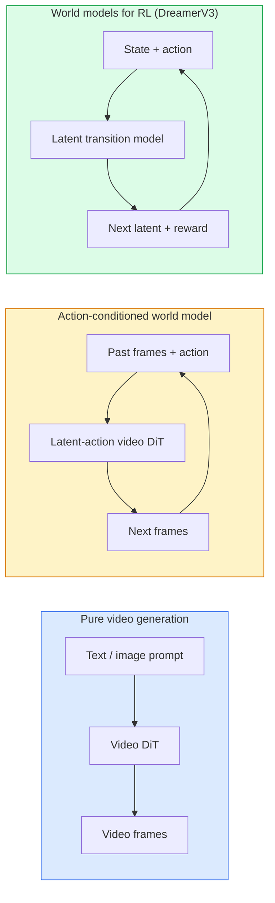

# Modelos mundiales y difusión de video

> Un modelo de video que predice los próximos segundos de una escena es un simulador de mundo, condiciona esa predicción sobre acciones y tienes un motor de juego aprendido.

> **【中文解读】**能够预测场景接下来的几秒的视频模型就是一个世界模拟器――将预测条件化为动作,就得到了一个学习的游戏引擎――世界模型是AI的前沿方向让AI理解物理世界的动态规律――

> **【拓展：世界模型的前沿】**Sora(OpenAI) y Genie(DeepMind) es el representante del modelo mundial. El modelo mundial se puede utilizar para conducir automáticamente en la simulación de la realidad.

**Type:** Learn + Build | **类型:** 学习 + 动手
**Languages:** Python | **语言:** Python
**Prerequisites:** Phase 4 Lesson 10 (Diffusion), Phase 4 Lesson 12 (Video Understanding), Phase 4 Lesson 23 (DiT + Rectified Flow) | **前置知识:** Phase 4 Lesson 10（扩散模型），Phase 4 Lesson 12（视频理解），Phase 4 Lesson 23（DiT + 整流流）
**Time:** ~75 minutes | **时间:** ~75 分钟

## Objetivos de aprendizaje

- Explica la diferencia entre un modelo de generación de video puro (Sora 2) y un modelo de mundo con condiciones de acción (Genie 3, DreamerV3)
- Describa un video DiT: parches espacio-temporales, codificación de posición en 3D, atención conjunta en tokens (T, H, W)
- Trazar cómo un modelo mundial se conecta a la robótica: VLM planea → el modelo de video simula → la dinámica inversa emite acciones
- Elija entre Sora 2, Genie 3, Runway GWM-1 Worlds, Wan-Video y HunyuanVideo para un caso de uso determinado (vídeo creativo, sim interactivo, síntesis de conducción autónoma)

> **【中文解读】**El objetivo de aprendizaje enumera las capacidades centrales que debe dominarse después de completar la clase.


## El problema es la introducción del problema

La generación de video y el modelado mundial convergieron en 2026. Un modelo que puede generar un minuto coherente de video ha aprendido, en cierto sentido, cómo se mueve el mundo: permanencia de objetos, gravedad, causalidad, estilo. Si condicionas esa predicción sobre acciones (caminar a la izquierda, abrir la puerta), el modelo de video se convierte en un simulador que se puede aprender que puede reemplazar un motor de juego, un simulador de conducción, o un entorno robótico.

> 视频生成和世界建模于 2026年融合了── un modelo de vídeo que puede generar un minuto连贯视频 en algún sentido aprendió cómo se mueve el mundo: durabilidad de los objetos, gravedad, relaciones de causalidad, estilo── si en la predicción se hace funcionar como condición ((( hacia la izquierda, hacia la puerta), el modelo de vídeo se convierte en un simulador que se puede aprender, puede sustituir el motor de juego, el simulador de conducción o el ambiente de los robots──

Las apuestas son concretas. Genie 3 genera entornos jugables a partir de una sola imagen. La pista GWM-1 Worlds sintetiza infinitas escenas explorables. Sora 2 produce videos de minutos de duración con audio sincronizado y física modelada. NVIDIA Cosmos-Drive, Wayve Gaia-2 y Tesla DrivingWorld generan un video de conducción realista para datos de entrenamiento de vehículos autónomos. El paradigma del modelo mundial está tomando silenciosamente el sim-to-real para la robótica.

> 利害关系是具体的──Genie 3 de un solo张图像生成可玩环境──Runway GWM-1 Worlds 合成无限可探索场景──Sora 2 生成带同步音频和物理建模的分钟级视频──NVIDIA Cosmos-Drive、Wayve Gaia-2 和 Tesla DrivingWorld 为自动驾驶训练数据生成真实驾驶视频──世界模型范式然接管机器人的真实驾驶视频──

Esta lección es la lección de "la imagen general" para la Fase 4. Conecta la generación de imágenes, la comprensión de video y el razonamiento agente con el patrón arquitectónico hacia el que se está moviendo la investigación dominante.

> Este curso es el curso de la cuarta fase de "total vista" (en inglés "total view") que se centra en la generación de imágenes, la comprensión de vídeos y la conexión de la lógica de los cuerpos inteligentes a la investigación de la estructura en curso.

## El concepto central.

> **【中文解读】**Este capítulo presenta los conceptos y teorías básicos. La comprensión de estos conceptos es el prerrequisito de la realización posterior de la actividad, y también el conocimiento de los puntos de alta frecuencia de la entrevista y la práctica de la ingeniería.


### Tres familias de modelos mundiales



- **Sora 2**Es la generación de video condicionada a las instrucciones. No hay interfaz de acción. No se puede "dirigir" en medio de la implementación.
  En inglés:**Sora 2**Es un video generado en forma pura, condicionado a la información.
- **Genie 3**¿ Qué ?**GWM-1 Worlds**¿ Qué ?**Mirage / Magica**En el video observado, se pueden invertir acciones latentes, luego condicionar las predicciones de los fotogramas futuros sobre las acciones.
  En inglés:**Genie 3**¿Qué es esto?**GWM-1 Worlds**¿Qué es esto?**Mirage / Magica**Es un modelo mundial de movimiento condicionado. Desde el video observado, se deduce el movimiento potencial, y luego se utiliza el movimiento condicionado para el futuro.
- **DreamerV3**y la familia clásica de modelos mundiales RL predicen en un espacio latente con acondicionamiento de acción explícito, entrenados en una señal de recompensa.
  En inglés:**DreamerV3**Y clásico RL Mundial modelo familia en el espacio intimo predicción, con condiciones de movimiento evidente, entrenamiento en señal de recompensa.

### Arquitectura de vídeo

```
Video latent:          (C, T, H, W)
Patchify (spatial):    grid of P_h x P_w patches per frame
Patchify (temporal):   group P_t frames into a temporal patch
Resulting tokens:      (T / P_t) * (H / P_h) * (W / P_w) tokens
```

La codificación posicional es 3D: una incorporación rotativa o aprendida por (t, h, w) coordenadas.

- **Full joint** todos los tokens atender a todos los tokens. O ((N ^ 2) con N tokens. Prohibido para videos largos.
  En inglés:**全联合** todos los tokens 注意所有 token。O(N^2)。对长视频不可行。
- **Divided** atención temporal alterna (la misma posición espacial, a lo largo del tiempo: `(H*W) * T^2`) y la atención espacial (el mismo paso de tiempo, a través del espacio: `T * (H*W)^2`Se utiliza por TimeSformer y la mayoría de los videos.
  En inglés:**分离**交替时间注意力(同空间位置,跨时间) 和空间注意力(同时间步,跨空间) ――TimeSformer 和大多数视频 DiT 使用──
- **Window** ventanas locales en (t, h, w). Usado por Video Swin.
  En inglés:**窗口**(t, h, w) 中的局部窗口──Video Swin 使用──

Cada modelo de difusión de vídeo 2026 utiliza uno de estos tres patrones más el acondicionamiento AdaLN (lección 23) y el flujo rectificado.

> Cada modelo de difusión de vídeo de 2026 utiliza uno de estos tres modelos, además de AdaLN  condicionamiento (§ 23 课) y total流.

### Condicionamiento de las acciones: modelos de acción latente

El genio aprende una**latent action**El decodificador del modelo luego condiciona la acción latente inferida  no en teclas de teclado explícitas. En la inferencia, un usuario puede especificar una acción latente (o muestra una de una anterior nueva) y el modelo genera el siguiente marco consistente con esa acción.

Sora omite la interfaz de acción por completo. Su decodificador predice los próximos tokens del espacio-tiempo de los tokens del espacio-tiempo pasado.

### Plausibilidad física

El lanzamiento de Sora 2 para 2026 se anuncia explícitamente **physical plausibility**El modelo mejora visiblemente en objetos caídos, personajes chocando y fallos en el propósito (un salto perdido) frente a Sora 1.

La plausibilidad sigue siendo el modo de fracaso dominante. Los videos 2024-2025 de personas comiendo espaguetis o bebiendo de copas revelaron la falta de representación de objetos persistente del modelo. Los modelos 2026 (Sora 2, Runway Gen-5, HunyuanVideo) reducen pero no eliminan estos.

### Modelos mundiales de conducción autónoma

Los modelos de conducción de mundo generan escenas de carretera realistas condicionadas a trayectorias, cajas de límite o mapas de navegación.

- **Cosmos-Drive-Dreams**(NVIDIA)  genera minutos de vídeo de conducción para el entrenamiento RL.
- **Gaia-2**(Wayve)  Síntesis de escenarios condicionada por trayectoria para la evaluación de políticas.
- **DrivingWorld**Simula el clima, la hora del día y las condiciones del tráfico.
- **Vista**(ByteDance)  Síntesis de escena de conducción reactiva.

Reemplazan la costosa recopilación de datos del mundo real para casos de esquina  paseos peatonales por las calles de noche, intersecciones heladas, tipos de vehículos inusuales  que de otro modo requerirían millones de kilómetros de conducción.

> Se sustituyen por costosos datos del mundo real para tratar las situaciones de borde: las personas que pasan por las calles por las noches, las calles congeladas, los tipos de vehículos inusuales, o se necesitan millones de millas de conducción.

### Estaca de robótica: VLM + modelo de vídeo + dinámica inversa

El nuevo ciclo de robótica de tres componentes:

> El nuevo ciclo de los tres componentes del sistema de máquinas:

1. **VLM**analiza el objetivo ("recabar la copa roja"), planea una secuencia de acción de alto nivel.
   En inglés:**VLM**解析目标 (("拿起红色杯子"),规划高层动作序列──
2. **Video generation model**simula cómo se vería ejecutando cada acción  predice observaciones N marcos hacia adelante.
   En inglés:**视频生成模型**模拟执行每动作后样子预测 N 后的观测──
3. **Inverse dynamics model**extrae los comandos motores concretos que producirían esas observaciones.
   En inglés:**逆动力学模型**提取产生这些观测的具体电机指令──

Esto reemplaza la formación de la recompensa y el RL pesado en muestras. El modelo mundial hace la imaginación; la dinámica inversa cierra el bucle en la activación.

> Esto sustituye a la RL de forma de recompensa y de muestreo intenso. El modelo mundial es responsable de la imaginación; inverso de la movilidad se cierra al ejecutar.

### Evaluación

- **Visual quality** FVD (Distancia de vídeo de Frechet), estudios de usuarios.
  En inglés:**视觉质量**FVD(Fréchet 视频距离) 、 usuario研究。
- **Prompt alignment** CLIPScore por marco, evaluación al estilo VQA.
  En inglés:**提示对齐** Cada uno de los CLIPScore, VQA 风格评估──
- **Physical plausibility** calificación manual en una suite de benchmarks (el benchmark interno de Sora 2, VBench).
  En inglés:**物理合理性**在基准套件上人工评分(Sora 2 内部基准、VBench)
- **Controllability**(para modelos interactivos del mundo)  acción → consistencia de observación; ¿puedes volver a un estado anterior?
  En inglés:**可控性**¿Cómo se puede volver al estado anterior?

### Paisaje modelo en 2026

| Model | Use | Parameters | Output | License |
|-------|-----|------------|--------|---------|
| Sora 2 | text-to-video, audio | — | 1-min 1080p + audio | API only |
| Runway Gen-5 | text/image-to-video | — | 10s clips | API |
| Runway GWM-1 Worlds | interactive world | — | infinite 3D rollout | API |
| Genie 3 | interactive world from image | 11B+ | playable frames | research preview |
| Wan-Video 2.1 | open text-to-video | 14B | high-quality clips | non-commercial |
| HunyuanVideo | open text-to-video | 13B | 10s clips | permissive |
| Cosmos / Cosmos-Drive | autonomous driving sim | 7-14B | driving scenes | NVIDIA open |
| Magica / Mirage 2 | AI-native game engine | — | modifiable worlds | product |

> **【中文解读】**Este capítulo a través del código de la implementación de algoritmos centrales de cero. Este método "desde cero" puede ayudar a entender el principio detrás del marco, no se encuentra en la caja negra cuando se encuentran problemas.

> **【拓展：工业部署中的视觉系统】**En la implementación industrial real, los modelos de visión necesitan considerar la posibilidad de retraso, el tamaño del modelo, la adaptación de los dispositivos de borde, etc. TensorRT, ONNX Runtime, OpenVINO son herramientas de aceleración de la teoría de uso habitual.

> **【拓展：数据标注与质量】**视觉任务的效果高度依赖标签数据质量──标签工作室、CVAT es la principal herramienta de marcado──在工业场景中,主动学习(Active Learning) puede reducir el costo de marcado: modelo a un requerimiento de muestras indeterminadas, marcación automática de muestras de determinación──


## Construye y realiza.
```figure
v4-world-rollout
```

## Construye el mismo

### Paso 1: 3D parche para el vídeo

```python
import torch
import torch.nn as nn


class VideoPatch3D(nn.Module):
    def __init__(self, in_channels=4, dim=64, patch_t=2, patch_h=2, patch_w=2):
        super().__init__()
        self.proj = nn.Conv3d(
            in_channels, dim,
            kernel_size=(patch_t, patch_h, patch_w),
            stride=(patch_t, patch_h, patch_w),
        )
        self.patch_t = patch_t
        self.patch_h = patch_h
        self.patch_w = patch_w

    def forward(self, x):
        # x: (N, C, T, H, W)
        x = self.proj(x)
        n, c, t, h, w = x.shape
        tokens = x.reshape(n, c, t * h * w).transpose(1, 2)
        return tokens, (t, h, w)
```

Un conv de 3D con paso igual al núcleo actúa como el patchador espacio-temporal. `(T, H, W) -> (T/2, H/2, W/2)`la cuadrícula de tokens.

### Paso 2: codificación de posición rotativa en 3D

Embedings de posición rotaria (RoPE) aplicados por separado a lo largo de `t`¿ Qué ?`h`¿ Qué ?`w`Eje:

```python
def rope_3d(tokens, t_dim, h_dim, w_dim, grid):
    """
    tokens: (N, T*H*W, D)
    grid: (T, H, W) sizes
    t_dim + h_dim + w_dim == D
    """
    T, H, W = grid
    n, seq, d = tokens.shape
    if t_dim + h_dim + w_dim != d:
        raise ValueError(f"t_dim+h_dim+w_dim ({t_dim}+{h_dim}+{w_dim}) must equal D={d}")
    assert seq == T * H * W
    t_idx = torch.arange(T, device=tokens.device).repeat_interleave(H * W)
    h_idx = torch.arange(H, device=tokens.device).repeat_interleave(W).repeat(T)
    w_idx = torch.arange(W, device=tokens.device).repeat(T * H)
    # Simplified: just scale channels by frequencies. Real RoPE rotates pairs.
    freqs_t = torch.exp(-torch.log(torch.tensor(10000.0)) * torch.arange(t_dim // 2, device=tokens.device) / (t_dim // 2))
    freqs_h = torch.exp(-torch.log(torch.tensor(10000.0)) * torch.arange(h_dim // 2, device=tokens.device) / (h_dim // 2))
    freqs_w = torch.exp(-torch.log(torch.tensor(10000.0)) * torch.arange(w_dim // 2, device=tokens.device) / (w_dim // 2))
    emb_t = torch.cat([torch.sin(t_idx[:, None] * freqs_t), torch.cos(t_idx[:, None] * freqs_t)], dim=-1)
    emb_h = torch.cat([torch.sin(h_idx[:, None] * freqs_h), torch.cos(h_idx[:, None] * freqs_h)], dim=-1)
    emb_w = torch.cat([torch.sin(w_idx[:, None] * freqs_w), torch.cos(w_idx[:, None] * freqs_w)], dim=-1)
    return tokens + torch.cat([emb_t, emb_h, emb_w], dim=-1)
```

Forma aditiva simplificada: el RoPE real gira canales emparejados en frecuencias; la información de posición es la misma.

### Paso 3: Bloqueo de atención dividido

```python
class DividedAttentionBlock(nn.Module):
    def __init__(self, dim=64, heads=2):
        super().__init__()
        self.time_attn = nn.MultiheadAttention(dim, heads, batch_first=True)
        self.space_attn = nn.MultiheadAttention(dim, heads, batch_first=True)
        self.ln1 = nn.LayerNorm(dim)
        self.ln2 = nn.LayerNorm(dim)
        self.ln3 = nn.LayerNorm(dim)
        self.mlp = nn.Sequential(nn.Linear(dim, 4 * dim), nn.GELU(), nn.Linear(4 * dim, dim))

    def forward(self, x, grid):
        T, H, W = grid
        n, seq, d = x.shape
        # time attention: same (h, w), across t
        xt = x.view(n, T, H * W, d).permute(0, 2, 1, 3).reshape(n * H * W, T, d)
        a, _ = self.time_attn(self.ln1(xt), self.ln1(xt), self.ln1(xt), need_weights=False)
        xt = (xt + a).reshape(n, H * W, T, d).permute(0, 2, 1, 3).reshape(n, seq, d)
        # space attention: same t, across (h, w)
        xs = xt.view(n, T, H * W, d).reshape(n * T, H * W, d)
        a, _ = self.space_attn(self.ln2(xs), self.ln2(xs), self.ln2(xs), need_weights=False)
        xs = (xs + a).reshape(n, T, H * W, d).reshape(n, seq, d)
        xs = xs + self.mlp(self.ln3(xs))
        return xs
```

La atención temporal se concentra en cada posición espacial a través del tiempo; la atención espacial se concentra en cada marco a través de las posiciones. Dos operaciones O(T^2 + (HW) ^2) en lugar de una O((THW) ^2).

### Paso 4: Compón un pequeño video

```python
class TinyVideoDiT(nn.Module):
    def __init__(self, in_channels=4, dim=64, depth=2, heads=2):
        super().__init__()
        self.patch = VideoPatch3D(in_channels=in_channels, dim=dim, patch_t=2, patch_h=2, patch_w=2)
        self.blocks = nn.ModuleList([DividedAttentionBlock(dim, heads) for _ in range(depth)])
        self.out = nn.Linear(dim, in_channels * 2 * 2 * 2)

    def forward(self, x):
        tokens, grid = self.patch(x)
        for blk in self.blocks:
            tokens = blk(tokens, grid)
        return self.out(tokens), grid
```

No es un generador de vídeo que funcione; es una demostración estructural que da forma a cada pieza correctamente.

### Paso 5: Compruebe las formas

```python
vid = torch.randn(1, 4, 8, 16, 16)  # (N, C, T, H, W)
model = TinyVideoDiT()
out, grid = model(vid)
print(f"input  {tuple(vid.shape)}")
print(f"tokens grid {grid}")
print(f"output {tuple(out.shape)}")
```

Esperar .`grid = (4, 8, 8)`y `out = (1, 256, 32)`Después de la parcheada, la cabeza luego proyecta a parches espaciotemporales por token, listos para ser desparcheados de nuevo en un video.

> **【中文解读】**Este capítulo muestra cómo utilizar un marco maduro (como PyTorch、HuggingFace, etc.) para aplicar rápidamente esta tecnología. En los proyectos reales, se realiza con prioridad el uso de un marco experimentado, se pueden reducir errores y mejorar la eficiencia de desarrollo.


> **【拓展：视觉模型的持续学习】**En el entorno de producción, el modelo visual necesita adaptarse continuamente a nuevos datos. Esto es especialmente importante en la conducción automotriz y el control de calidad industrial.

## Usalo con el marco de ejecución

Modelos de acceso a la producción para 2026:

- **Sora 2 API**(OpenAI)  texto a video, audio sincronizado. Precios premium.
- **Runway Gen-5 / GWM-1**(Runway)  Imagen a video, mundos interactivos.
- **Wan-Video 2.1 / HunyuanVideo** auto-host de código abierto.
- **Cosmos / Cosmos-Drive**Simulación de conducción de pesos abiertos.
- **Genie 3** Previsión de la investigación, solicitud de acceso.

Para construir una demostración interactiva de un modelo mundial: comience con Wan-Video para la calidad, capa en un adaptador de acción latente para la interactividad. Para la simulación de conducción autónoma: Cosmos-Drive es la referencia abierta 2026 .

Para la robótica, la pila en el medio silvestre:

> **【中文解读】**Este capítulo se centra en cómo se puede implementar el modelo como producto disponible. Desde el modelo original hasta el sistema de producción, se deben considerar múltiples dimensiones de optimización de rendimiento, tratamiento de errores, control, etc.


1. Objetivo de lenguaje -> VLM (Qwen3-VL) -> plan de alto nivel.
2. Plan -> modelo de vídeo de acción latente -> despliegue imaginado.
3. Rollout -> modelo de dinámica inversa -> acciones de bajo nivel.
4. Acciones ejecutadas -> observación devuelta al paso 1.


## Envíe el producto .

> **【中文解读】**Practice los temas de fácil/medio/duro  3 difficulty to pass in  Recomenda al menos completar los temas de grado medio  Grado duro  para la preparación de la entrevista


Esta lección produce:

- `outputs/prompt-video-model-picker.md` elige entre Sora 2 / Runway / Wan / HunyuanVideo / Cosmos dada tarea, licencia y latencia.
- `outputs/skill-physical-plausibility-checks.md` una habilidad que define las comprobaciones automatizadas (permanencia de objeto, gravedad, continuidad) para ejecutar en cualquier video generado antes de su envío.

## Los ejercicios.

1. **(Easy)**Calcule el recuento de tokens para un video de 5 segundos en 360p en parche-t=2, parche-h=8, parche-w=8. Razón sobre la memoria para la atención en este tamaño.
2. **(Medium)**Cambiar el bloque de atención dividido por encima para un bloque de atención conjunto completo y medir la forma y el número de parámetros. Explique por qué la atención dividida es necesaria para los modelos de video reales.
3. **(Hard)**Construir un modelo de video latente mínimo: tomar un conjunto de datos de (frame_t, action_t, frame_{t+1}) triples (cualquier juego 2D simple), entrenar un pequeño video DiT condicionado a embebedidos de acción, y mostrar que diferentes acciones producen diferentes cuadros siguientes.

> **【中文解读】**En el lenguaje de los términos "Lo que la gente dice" vs "Lo que realmente significa" se distingue entre el lenguaje diario y la definición técnica de significado.


## Términos clave .

| Term | What people say | What it actually means |
|------|----------------|----------------------|
| World model | "Learned simulator" | A model that predicts future observations given state and action |
| Video DiT | "Spacetime transformer" | Diffusion transformer with 3D patchification and divided attention |
| Latent action | "Inferred control" | Discrete or continuous action latent inferred from frame pairs; used to condition next-frame generation |
| Divided attention | "Time then space" | Two attention operations per block — across time then across space — to keep O(N^2) manageable |
| Object permanence | "Things stay real" | Scene property that video models must learn; classic failure mode on food, glassware |
| FVD | "Fréchet Video Distance" | Video equivalent of FID; primary visual quality metric |
| Inverse dynamics model | "Observations to actions" | Given (state, next state), output the action that connects them; closes robotics loop |
| Cosmos-Drive | "NVIDIA driving sim" | Open-weights autonomous-driving world model for RL and evaluation |

> **【中文解读】**延伸阅读 proporciona un alto nivel de recursos para el aprendizaje profundo. Estos artículos y cursos son los referentes clásicos en el campo, adecuados para los lectores que necesitan una comprensión profunda.


## Más Leer más Leer más

- [Sora technical report (OpenAI)](https://openai.com/index/video-generation-models-as-world-simulators/)
- [Genie: Generative Interactive Environments (Bruce et al., 2024)](https://arxiv.org/abs/2402.15391) Modelos de mundo de acción latente
- [TimeSformer (Bertasius et al., 2021)](https://arxiv.org/abs/2102.05095) la atención dividida para los transformadores de vídeo
- [DreamerV3 (Hafner et al., 2023)](https://arxiv.org/abs/2301.04104) modelos mundiales para RL
- [Cosmos-Drive-Dreams (NVIDIA, 2025)](https://research.nvidia.com/labs/toronto-ai/cosmos-drive-dreams/) modelo mundial de conducción
- [Top 10 Video Generation Models 2026 (DataCamp)](https://www.datacamp.com/blog/top-video-generation-models)
- [From Video Generation to World Model — survey repo](https://github.com/ziqihuangg/Awesome-From-Video-Generation-to-World-Model/)
