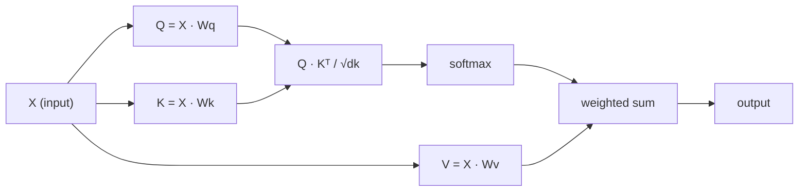

# La autoatención desde cero
# Desde la atención desde la realidad

> La atención es una tabla de búsqueda donde cada palabra pregunta "¿quién me importa?" y aprende la respuesta.

> La atención es una tabla de búsqueda, cada palabra está en la pregunta "¿Quién es importante para mí?"

> **【中文解读】**La autoatención es el núcleo del transformador: Q*K^T  calcular cada token a la atención de otros tokens ⋅ comprender Q/K/V es la base de la comprensión de GPT/BERT ⋅

**Type:** Build | **类型:** 动手
**Language:**¿ Qué pasa ?**语言:**Python
**Prerequisites:** Phase 3 (Deep Learning Core), Phase 5 Lesson 10 (Sequence-to-Sequence) | **前置知识:** 阶段 3（深度学习基础），阶段 5 第 10 课（序列到序列）
**Time:** ~90 minutes | **时间:** ~90 分钟

## Objetivos de aprendizaje

- Implementar la autoatención de producto punto escalada desde cero utilizando únicamente NumPy, incluidas las proyecciones de consulta/clave/valor y la suma ponderada por softmax
   sólo utilizar NumPy desde el cero para lograr la reducción de puntos de concentración de la atención, incluyendo la consulta/key/valor proyección y softmax + derecho a la demanda y
- Construye una capa de atención multi-cabeza que divide cabezas, calcula la atención paralela y concatenar los resultados
  Construir varias capas de atención, lograr la división de la cabeza 并行注意計算和結果拼接
- Trazar cómo la matriz de atención capta las relaciones de tokens y explicar por qué la escalación por sqrt(d_k) evita la saturación de softmax
  追踪注意力矩阵 cómo capturar los tokens 关系,并解释为什么除以 sqrt(d_k) 能防止软max 和
- Aplicar el enmascaramiento causal para convertir la atención bidireccional en la atención autoregresista (estilo de decodificador)
  应用因果掩码将双向注意力转换为自归归 (de vuelta) 解码器风格) 注意力

## El problema es la introducción del problema

RNNs procesan secuencias de un token a la vez. Para el momento en que alcanzas el token 50, la información del token 1 ha sido comprimida a través de 50 pasos de compresión. Las dependencias de largo alcance se aplastan en un estado oculto de tamaño fijo  un cuello de botella que ninguna cantidad de LSTM gateing resuelve completamente.

> RNN token por token procesamiento de secuencias ⋅ Cuando llegues a los 50 tokens ⋅ cuando llegas a los 50 tokens, la información de los 1 tokens ya se ha comprimido 50 veces ⋅ la larga dependencia de la información se ha comprimido en un estado oculto de tamaño fijo ⋅ es el botellón de LSTM ⋅ control no se puede resolver completamente ⋅

El documento de atención Bahdanau de 2014 mostró la solución: deja que el decodificador mire hacia atrás en cada posición del codificador y decida cuáles son importantes para el paso actual. Pero todavía estaba conectado a un RNN. El artículo de 2017 "Attención es todo lo que necesitas" hizo una pregunta más aguda: ¿qué pasa si la atención es el único mecanismo?

> El artículo de atención de Bahdanau de 2014 muestra un método de modificación: hacer que el descifrador recuebe cada posición del codificador, y decidir qué son los pasos actuales importantes. Pero todavía se encuentra en el artículo de 2017 "La atención es todo lo que necesitas". El artículo planteó una pregunta más aguda: ¿Si la atención es el único mecanismo?

La autoatención permite que cada posición de una secuencia atenda a cada otra posición en un solo paso paralelo.

> Desde la atención hacer que cada posición en la secuencia se concentra en todas las demás posiciones en un solo paso paralelos.

> **【中文解读】**La revolución del RNN consiste en: abandonar completamente el ciclo, solo con un mecanismo de atención.

## El concepto central.

### La Analogía de búsqueda de base de datos

Piensa en la atención como una búsqueda de base de datos suave:

> Se puede utilizar para la búsqueda de datos.

```
Traditional database:
  Query: "capital of France"  -->  exact match  -->  "Paris"

Attention:
  Query: "capital of France"  -->  similarity to ALL keys  -->  weighted blend of ALL values
```

Cada token genera tres vectores:
- **Query (Q)**"¿Qué estoy buscando?"
  **查询 (Query, Q)**"¿Qué estoy buscando?"
- **Key (K)**"¿Qué tengo?"
  **键 (Key, K)**"¿Qué es lo que contiene?"
- **Value (V)**: "¿Qué información puedo proporcionar si se selecciona?"
  **值 (Value, V)**"Si fuese elegido, ¿qué información le daría?"

El producto de puntos entre una consulta y todas las teclas produce puntajes de atención. puntaje alto significa "esta clave coincide con mi consulta".

> 查询与所有键的点积产生注意分数――高分 significa "este clave se ajusta a mi consulta"―― estos puntos se suman a la cantidad de valores.

> **【中文解读】**La clasificación de datos de la atención es la mejor manera de entender Q/K/V. Q es "me encuentro en lo que", K es "qué tengo", V es "mi contenido real" Q y K es un punto de medida de la correspondencia, de la flexibilidad de la flexibilidad de la flexibilidad, y después de la flexibilidad de la flexibilidad, el proceso es un pequeño "soft search" de la flexibilidad de la flexibilidad.

> **【拓展：注意力机制在真实系统中的应用】**GPT 系列 utiliza因果自注意力(cada token sólo puede ver el token anterior);BERT utiliza dobles hacia sí mismo atención(cada token 能看到所有代币);交叉注意力(Cross-Attention)则在T5、Stable Diffusion等模型中连接编码器和编码器──理解Q/K/V是理解所有这些变体的基础──

### Q, K, V Computación

Cada embedding de token se proyecta a través de tres matrices de peso aprendidas:

> Cada token se proyecta a través de tres matrices de peso:

```
Input embeddings (sequence of n tokens, each d-dimensional):

  X = [x1, x2, x3, ..., xn]       shape: (n, d)

Three weight matrices:

  Wq  shape: (d, dk)
  Wk  shape: (d, dk)
  Wv  shape: (d, dv)

Projections:

  Q = X @ Wq    shape: (n, dk)      each token's query
  K = X @ Wk    shape: (n, dk)      each token's key
  V = X @ Wv    shape: (n, dv)      each token's value
```

Visualmente, por una señal:

> 直观地看, para un símbolo:

```
             Wq
  x_i ------[*]------> q_i    "What am I looking for?"
       |
       |     Wk
       +----[*]------> k_i    "What do I contain?"
       |
       |     Wv
       +----[*]------> v_i    "What do I offer?"
```

### La Matriz de Atención

Una vez que tienes Q, K, V para todos los tokens, las puntuaciones de atención forman una matriz:

> Una vez que tienes todos los tokens de Q K V, el número de puntos de atención forma una matriz:

```
Scores = Q @ K^T    shape: (n, n)

              k1    k2    k3    k4    k5
        +-----+-----+-----+-----+-----+
   q1   | 2.1 | 0.3 | 0.1 | 0.8 | 0.2 |   <- how much q1 attends to each key
        +-----+-----+-----+-----+-----+
   q2   | 0.4 | 1.9 | 0.7 | 0.1 | 0.3 |
        +-----+-----+-----+-----+-----+
   q3   | 0.2 | 0.6 | 2.3 | 0.5 | 0.1 |
        +-----+-----+-----+-----+-----+
   q4   | 0.9 | 0.1 | 0.4 | 1.7 | 0.6 |
        +-----+-----+-----+-----+-----+
   q5   | 0.1 | 0.3 | 0.2 | 0.5 | 2.0 |
        +-----+-----+-----+-----+-----+

Each row: one token's attention over the entire sequence
```

### ¿Por qué escalar? ¿Por qué reducir?
Observe una consulta a la vez barrida las teclas: cada fila marca cada token, softmax convierte las puntuaciones en pesas, y el vector de contexto es la mezcla ponderada de valores.

```figure
attention-matrix
```

### ¿Por qué la escala?

Los productos de puntos crecen con la dimensión dk. Si dk = 64, los productos de puntos pueden estar en el rango de decenas, empujando la softmax a regiones donde los gradientes desaparecen.

> Por lo tanto, el punto de concentración es el punto de concentración de la superficie de la superficie.

```
Scaled scores = (Q @ K^T) / sqrt(dk)
```

Esto mantiene los valores en un rango en el que softmax produce gradientes útiles.

> Esto permite que el valor se mantenga en el límite de la suavidad máxima que puede generar una escala útil.

> **【中文解读】**缩放因子 1/sqrt(dk) es un detalle clave pero fácilmente ignorado. Cuando la dimensión dk es mayor, el valor del punto se vuelve muy grande, lo que provoca una entrada de la suavidad en la zona 和区 (en el extremo de la zona) y la salida de la temperatura (en la zona) se aproxima a una temperatura de un solo cuadro.

### Softmax convierte las puntuaciones en pesas . Softmax convertirá el porcentaje en peso .

Softmax convierte las puntuaciones en bruto en una distribución de probabilidades en cada fila:

> Softmax convertirá el número original en distribución de probabilidad por línea:

```
Raw scores for q1:   [2.1, 0.3, 0.1, 0.8, 0.2]
                            |
                         softmax
                            |
Attention weights:   [0.52, 0.09, 0.07, 0.14, 0.08]   (sums to ~1.0)
```

Ahora cada token tiene un conjunto de pesas que dicen cuánto atender a cada otro token.

> Ahora cada token tiene un grupo de peso, que muestra el grado de atención que tiene por el otro token.

> **【拓展：注意力矩阵的可解释性】**Notación de la matriz (N×N) es un instrumento importante de la investigación de la transformación explicable. A través de la observación de la observación de la observación, se puede encontrar un modelo aprendido de la lenguaje de los modelos: ¿qué símbolos tienen una fuerte relación entre ellos? Por ejemplo, el "it" se concentra en su nombre de referencia.

### La suma ponderada de valores y el valor de la suma de valores

La salida final para cada token es una suma ponderada de todos los vectores de valor:

> La salida final de cada token es el aumento de todos los valores de los valores:

```
output_i = sum( attention_weight[i][j] * v_j  for all j )

For token 1:
  output_1 = 0.52 * v1 + 0.09 * v2 + 0.07 * v3 + 0.14 * v4 + 0.08 * v5
```

### Todo el oleoducto .



Formula en una línea:

> Una línea de fórmula:

```
Attention(Q, K, V) = softmax( Q @ K^T / sqrt(dk) ) @ V
```

## Construye y realiza.
```figure
softmax-attention-scaling
```

## Construye el mismo

### Paso 1: Softmax desde cero. Paso 1: Implementar Softmax desde cero.

Softmax convierte logits en probabilidades.

> Softmax se convertirá en probabilidad.

```python
import numpy as np

def softmax(x):
    shifted = x - np.max(x, axis=-1, keepdims=True)
    exp_x = np.exp(shifted)
    return exp_x / np.sum(exp_x, axis=-1, keepdims=True)

logits = np.array([2.0, 1.0, 0.1])
print(f"logits:  {logits}")
print(f"softmax: {softmax(logits)}")
print(f"sum:     {softmax(logits).sum():.4f}")
```

### Paso 2: Escalado punto-producto atención. Paso 2: reducción de punto-acumulación de atención.

La función central toma las matrices Q, K, V y devuelve la salida de atención más la matriz de peso.

> 核心函数──接收 Q、K、V 矩阵, regresar a la atención de salida y el peso de la矩阵──

```python
def scaled_dot_product_attention(Q, K, V):
    dk = Q.shape[-1]
    scores = Q @ K.T / np.sqrt(dk)
    weights = softmax(scores)
    output = weights @ V
    return output, weights
```

### Paso 3: clase de autoatención con proyecciones aprendidas. Paso 3: Lerne proyectar.

Un módulo de autoatención completo con matrices de peso Wq, Wk, Wv iniciadas con escalación similar a Xavier.

> Un módulo de autoatención completo, que contiene Wq、Wk、Wv 权重矩阵, utilizando el Xavier 式缩放初始化.

```python
class SelfAttention:
    def __init__(self, d_model, dk, dv, seed=42):
        rng = np.random.default_rng(seed)
        scale = np.sqrt(2.0 / (d_model + dk))
        self.Wq = rng.normal(0, scale, (d_model, dk))
        self.Wk = rng.normal(0, scale, (d_model, dk))
        scale_v = np.sqrt(2.0 / (d_model + dv))
        self.Wv = rng.normal(0, scale_v, (d_model, dv))
        self.dk = dk

    def forward(self, X):
        Q = X @ self.Wq
        K = X @ self.Wk
        V = X @ self.Wv
        output, weights = scaled_dot_product_attention(Q, K, V)
        return output, weights
```

### Paso 4: ejecuta en una frase. Paso 4: ejecuta en una frase.

Crear falsas incrustaciones para una oración y ver los pesos de atención.

> Para una frase crear falsos emplazamientos, observar el poder de la atención.

```python
sentence = ["The", "cat", "sat", "on", "the", "mat"]
n_tokens = len(sentence)
d_model = 8
dk = 4
dv = 4

rng = np.random.default_rng(42)
X = rng.normal(0, 1, (n_tokens, d_model))

attn = SelfAttention(d_model, dk, dv, seed=42)
output, weights = attn.forward(X)

print("Attention weights (each row: where that token looks):\n")
print(f"{'':>6}", end="")
for token in sentence:
    print(f"{token:>6}", end="")
print()

for i, token in enumerate(sentence):
    print(f"{token:>6}", end="")
    for j in range(n_tokens):
        w = weights[i][j]
        print(f"{w:6.3f}", end="")
    print()
```

### Paso 5: Visualizar la atención con el mapa de calor ASCII  Paso 5: utilizar ASCII 热力图可视化注意力

Mapa de los pesos de atención a los personajes para una visión rápida.

> La atención se vuelve a reflejar en los caracteres para que se vean rápidamente.

```python
def ascii_heatmap(weights, tokens, chars=" ░▒▓█"):
    n = len(tokens)
    print(f"\n{'':>6}", end="")
    for t in tokens:
        print(f"{t:>6}", end="")
    print()

    for i in range(n):
        print(f"{tokens[i]:>6}", end="")
        for j in range(n):
            level = int(weights[i][j] * (len(chars) - 1) / weights.max())
            level = min(level, len(chars) - 1)
            print(f"{'  ' + chars[level] + '   '}", end="")
        print()

ascii_heatmap(weights, sentence)
```

## Usalo con el marco de ejecución

El de PyTorch.`nn.MultiheadAttention`hace exactamente lo que construimos, más la división multi-cabeza y la proyección de salida:

> PyTorch de `nn.MultiheadAttention`completamente logrado nuestro contenido de construcción, además de múltiples divisiones y proyecciones de salida:

```python
import torch
import torch.nn as nn

d_model = 8
n_heads = 2
seq_len = 6

mha = nn.MultiheadAttention(embed_dim=d_model, num_heads=n_heads, batch_first=True)

X_torch = torch.randn(1, seq_len, d_model)

output, attn_weights = mha(X_torch, X_torch, X_torch)

print(f"Input shape:            {X_torch.shape}")
print(f"Output shape:           {output.shape}")
print(f"Attention weight shape: {attn_weights.shape}")
print(f"\nAttn weights (averaged over heads):")
print(attn_weights[0].detach().numpy().round(3))
```

La diferencia clave: la atención multi-cabeza ejecuta múltiples funciones de atención en paralelo, cada una con sus propias proyecciones Q, K, V de tamaño dk = d_modelo / n_cabezas, luego concatena los resultados. Esto permite que el modelo atienda a diferentes tipos de relación simultáneamente.

> 关键区别:多头注意力并行运行多头注意力函数, cada uno tiene su propio Q、K、V 投影,大小为 dk = d_model / n_heads, luego拼接结果──这让模型能同时关注不同类型的关系──

> **【中文解读】**PyTorch de `nn.MultiheadAttention`Envuelve toda la lógica que realizamos desde cero, además de la división y la producción de proyecciones. La ventaja de la atención múltiple es que el modelo se centra simultáneamente en diferentes tipos de relaciones.

> **【拓展：多头注意力的生物学类比】**La atención múltiple puede ser comparada con el detector de múltiples características de la corteza visual. Como los diferentes neuronas de la región V1 pueden detectar diferentes bordes, direcciones y colores, la atención múltiple puede aprender a captar diferentes tipos de tokens 间关系.

## Envíe el producto .

Esta lección produce:
- `outputs/prompt-attention-explainer.md` una invitación para explicar la atención a través de la analogía de búsqueda de la base de datos

> 本课产生:
> - `outputs/prompt-attention-explainer.md`                                                                                                                                                                                                                                                              

## Los ejercicios.

1. Modificar`scaled_dot_product_attention`para aceptar una matriz de máscara opcional que establece ciertas posiciones a infinito negativo antes de softmax (es así como funciona el enmascaramiento causal/decodificador)
   修改                                                                                                                                                                                                                                                                                                                                                                                                                                                                                                                           `scaled_dot_product_attention`Para aceptar la matriz de ocultamiento opcional, en softmax, algunos lugares se establecerán como negativos infinitos.

2. Implemente la atención multi-cabeza desde cero: divide Q, K, V en `n_heads`trozos, ejecutar la atención en cada uno, concatena, y proyectar a través de una matriz de peso final Wo
   Desde el punto de vista de la realización de múltiples actividades:`n_heads`块,分别运行注意力,拼接,并通过最终权重矩阵 Wo 投影

3. Tomar dos oraciones diferentes de la misma longitud, alimentarlas a través de la misma instancia de autoatención, y comparar sus patrones de atención. ¿Qué cambia? ¿Qué permanece igual?
   Toma dos oraciones de la misma longitud, a través del mismo ejemplo de Autoatención, compara su modelo de atención. ¿Qué ha cambiado? ¿Qué no ha cambiado?

## Términos clave .

| Term | What people say / 人们怎么说 | What it actually means / 实际含义 |
|------|------------------------------|----------------------------------|
| Query (Q) | "The question vector" / "问题向量" | A learned projection of the input that represents what information this token is looking for. 输入的学习投影，表示这个 token 在寻找什么信息。 |
| Key (K) | "The label vector" / "标签向量" | A learned projection that represents what information this token contains, matched against queries. 学习投影，表示这个 token 包含什么信息，与查询匹配。 |
| Value (V) | "The content vector" / "内容向量" | A learned projection carrying the actual information that gets aggregated based on attention scores. 学习投影，携带根据注意力分数聚合的实际信息。 |
| Scaled dot-product attention | "The attention formula" / "注意力公式" | softmax(QK^T / sqrt(dk)) @ V — scaling prevents softmax saturation in high dimensions. softmax(QK^T / sqrt(dk)) @ V — 缩放防止高维时 softmax 饱和。 |
| Self-attention | "The token looks at itself and others" / "token 看自己和其他 token" | Attention where Q, K, V all come from the same sequence, letting every position attend to every other position. Q、K、V 都来自同一序列的注意力，让每个位置关注所有其他位置。 |
| Attention weights | "How much focus" / "多少关注" | A probability distribution over positions, produced by softmax over scaled dot products. 位置上的概率分布，由缩放点积上的 softmax 产生。 |
| Multi-head attention | "Parallel attention" / "并行注意力" | Running multiple attention functions with different projections, then concatenating results for richer representations. 使用不同投影运行多个注意力函数，然后拼接结果以获得更丰富的表示。 |

## Más Leer más Leer más

- [Attention Is All You Need (Vaswani et al., 2017)](https://arxiv.org/abs/1706.03762) el papel transformador original
  Vaswani 等人(2017)  原始 Transformer 论文

- [The Illustrated Transformer (Jay Alammar)](https://jalammar.github.io/illustrated-transformer/) mejor paseo visual de la arquitectura completa
  Jay Alammar's Visibilización Transformer  最佳完整架构可视化讲解

- [The Annotated Transformer (Harvard NLP)](https://nlp.seas.harvard.edu/annotated-transformer/) implementación línea por línea de PyTorch con explicaciones
  Harvard NLP 注释版 Transformer  逐行 PyTorch 实现与解释

> **【拓展：Flash Attention 与注意力优化】**标准自注意的 O(N^2) 内存开销是长序列处理的瓶──Flash Attention(2022) a través de la estrategia de cálculo de bloques y de recalculación, en caso de no cambiar los resultados matemáticos, la complejidad de la memoria se reducirá a O(N)── esto es esencial en la aplicación real de la ventana de 128K de GPT-4 y otras.
