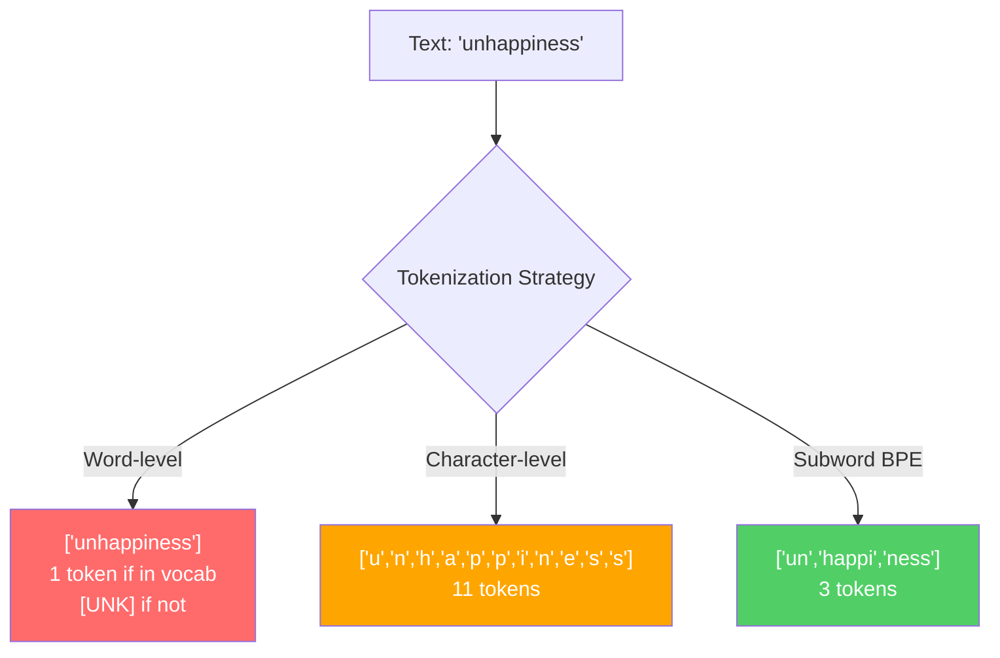
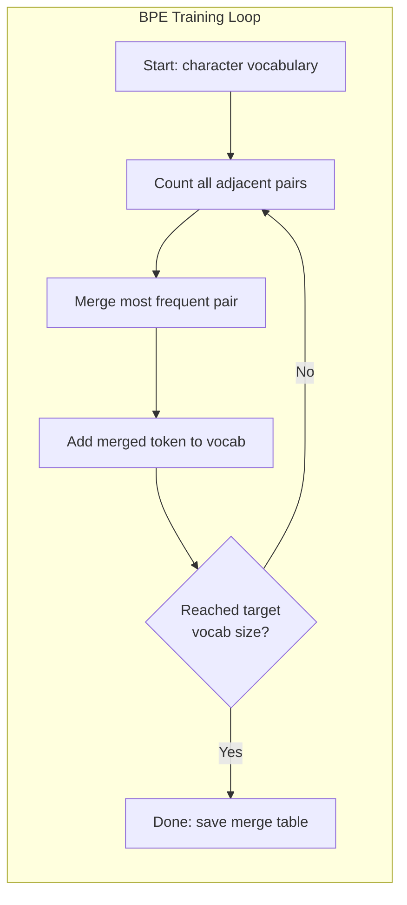
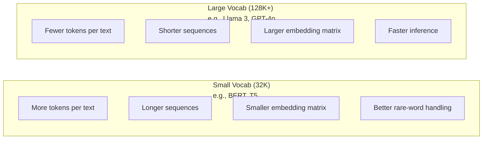

# Los tokenizers: BPE, WordPiece, SentencePiece  分词器: BPE, WordPiece, SentencePiece

> El LLM no lee inglés, lee números enteros, el tokenizer decide si esos números enteros tienen significado o lo desperdician.

> **【中文解读】**LLM 不读英文,它读整数──分词器决定这些整数是有意义还是浪费──子词分词(subword tokenization) entre los grados de palabras y los grados de caracteres encuentra el equilibrio:

> **【拓展：BPE→GPT系列】**Todos los modelos de OpenAI(GPT-2、GPT-3、GPT-4) utilizan BPE 分词器──tiktoken es la serie de GPT 分词器库──分词质量 directamente afecta a la tasa de utilización de la ventana de abajo"por desgracia" 拆分4 token vs 1 token, equivale a la reducción de la ventana de arriba abajo 75%──

**Type:** Build
**Languages:** Python
**Prerequisites:** Phase 05 (NLP Foundations)
**Time:** ~90 minutes

## Objetivos de aprendizaje

- Implemente los algoritmos de tokenización BPE, WordPiece y Unigram desde cero y compare sus estrategias de fusión
  Desde la implementación de BPE, WordPiece y Unigram 分词算法, comparar las estrategias de combinación de ellos
- Explicar cómo el tamaño del vocabulario afecta la eficiencia del modelo: demasiado pequeño crea secuencias largas, desechos demasiado grandes incorporan parámetros
  解释词表大小 cómo afecta la eficiencia del modelo: demasiado pequeño para producir una larga secuencia, demasiado grande para el gasto de los parámetros
- Analiza los artefactos de tokenization en diferentes idiomas y códigos, identificando dónde se descomponen los tokenizers específicos
  Análisis de las situaciones de frontera entre los distintos idiomas y los códigos, para encontrar puntos de falla de un determinado instrumento de expresión
- Utilice las bibliotecas de tokens y frases para tokenizar el texto e inspeccionar las identidades de tokens resultantes
  Utiliza tiktoken 和 sentencepiece 库分词文本并检查生成的代币ID

> **【中文解读】**El objetivo del estudio del capítulo es desarrollar cuatro dimensiones de los componentes de los componentes de los componentes de los componentes de los componentes de los componentes de los componentes de los componentes de los componentes de los componentes de los componentes de los componentes de los componentes de los componentes de los componentes de los componentes de los componentes de los componentes de los componentes de los componentes de los componentes de los componentes de los componentes de los componentes de los componentes de los componentes de los componentes de los componentes de los componentes de los componentes de los componentes de los componentes de los componentes de los componentes de los componentes de los componentes de los componentes de los componentes de los componentes de los componentes de los componentes de los componentes de los componentes de los componentes de los componentes de los componentes de los componentes de los componentes de los componentes de los componentes de los componentes de los componentes de los componentes de los componentes de los componentes de los componentes de los componentes de los componentes de los componentes de los componentes de los componentes de los componentes de los componentes de los componentes de los componentes de los componentes de los componentes de los componentes de los componentes de los componentes de los componentes de los componentes de los componentes de los componentes de los componentes de los componentes de los componentes de los componentes de los componentes de los componentes de los componentes de los componentes de los componentes de los componentes de los componentes de los componentes de los componentes de los componentes de los componentes de los componentes de los componentes de los componentes de los componentes de los componentes de los componentes de los componentes de los componentes de los componentes de los componentes de los componentes de los componentes de los componentes de los componentes de los componentes de los componentes de los componentes de los componentes de los componentes de los componentes de los componentes de los componentes de los componentes de los componentes de los componentes de los componentes de los componentes de los componentes de los componentes de los componentes de los componentes de los componentes de los componentes de los componentes de los componentes de los componentes de los componentes de los componentes de los componentes de los componentes de los componentes de los componentes de los componentes de los componentes de los componentes de los componentes de los componentes de los componentes de los componentes de los componentes de los componentes de los componentes de los componentes de los componentes de los componentes de los componentes de los componentes de los componentes de los componentes de los componentes de los componentes de los componentes de los componentes de los componentes de los componentes de los componentes de los componentes de los componentes de los componentes de los componentes de los componentes de los componentes de los componentes de los componentes de los componentes de los componentes de los componentes

## El problema es la introducción del problema

Su LLM no lee inglés, no lee ningún idioma, lee números.

> Su LLM no se lee en inglés.

La brecha entre "Hello, mundo!" y [15496, 11, 995, 0] es el tokenizer. Cada palabra, cada espacio, cada marca de puntuación debe convertirse en un número entero antes de que un modelo pueda procesarlo. Esta conversión no es neutral.

> "Hola, mundo!" y el puente entre [15496, 11, 995, 0] es un instrumento de expresión. Cada palabra, cada espacio, cada símbolo de punto debe ser transformado en un número entero, el modelo puede tratarlo.

Si se equivocan, su modelo desperdicia la capacidad de codificar palabras comunes con múltiples tokens. "Desafortunadamente" se convierte en cuatro tokens en lugar de uno. Su ventana de contexto de 128K se redujo un 75% para el texto pesado en palabras de múltiples sílabas. Si lo haces bien, la misma ventana de contexto tiene el doble de significado. La diferencia entre "este modelo maneja el código bien" y "este modelo se ahoga en Python" a menudo se reduce a cómo se entrenó el tokenizer.

> Ha hecho un error, tu modelo perderá la capacidad de usar varios tokens 编码常见词语──"Desafortunadamente" se convierte en cuatro tokens y no en uno──tu 128K de la ventana de texto superior a la de la de la de la de la de la de la de la de la de la de la de la de la de la de la de la de la de la de la de la de la de la de la de la de la de la de la de la de la de la de la de la de la de la de la de la de la de la de la de la de la de la de la de la de la de la de la de la de la de la de la de la de la de la de la de la de la de la de la de la de la de la de la de la de la de la de la de la de la de la de la de la de la de la de la de la de la de la de la de la de la de la de la de la de la de la de la de la de la de la de la de la de la de la de la de la de la de la de la de la de la de la de la de la de la de la de la de la de la de la de la de la de la de la de la de la de la de la de la de la de la de la de la de la de la de la de la de la de la de la de la de la de la de la de la de la de la de la de la de la de la de la de la de la de la de la de la de la de la de la de la de la de la de la de la de la de la de la de la de la de la de la de la de la de la de la de la de la de la de la de la de la de la de la de la de la de la de la de la de la de la de la de la de la de la de la de la de la de la de la de la de la de la de la de la de la de la de la de de la de la de la de la de la de la de la de la de la de la de de la de la de de la de de de de de de de la de la de de de de la de la de de de la de la de la de la de de de de la de

Cada llamada de API que realice a GPT-4 o Claude tiene un precio por token. Cada token que su modelo genera costará calcular. Cuanto menos tokens se requieren para representar una salida, más rápido será la inferencia de extremo a extremo.

> Cada vez que utilizas GPT-4 o la API de Claude, todo es según el token 计费的―― cada token generado por tu modelo, todo es consumido 计力―― significa que un token de salida es necesario 越少,端到端推理就越快──分词不是预处理──它是架构──

> **【中文解读】**分词 no es un simple paso de preprocesamiento, sino parte de la estructura del modelo. Por cada vez que se utiliza la API GPT-4, cada token se genera y consume.

> **【拓展：API 定价与分词效率】**GPT-4o                                                                                                                                                                                                                                                                                                                                                                                                                                                                                                                          $5/M input tokens、$15/M tokens de salida. En el mismo chino, GPT-2 分词器可能消耗500 tokens, GPT-4o o200k_base 分词器 sólo necesita alrededor de 200 tokens, el costo difiere 2,5 veces.

> ¿ Qué es esto ?**【前置】**学本节前Permanecer primero: 1) Fase 05 (NLP Fundamentos)  Comprender el texto de la forma en que se muestra la forma en que se inserta la información; 2) Python 字典/Counter与贪心算法实现模式; 3) UTF-8 编码、Unicode 码点 (codepoint) 字节的关系; 4) 概率论基础频率统计与互信息──不熟悉这些会难理解 BPE 的合并据判──

## El concepto central.

### Tres enfoques que fracasaron (y uno que ganó)

Hay tres maneras obvias de convertir texto en números. Dos de ellas no funcionan a escala.

> Hay tres métodos obvios para convertir el texto en números. Dos de ellos no pueden funcionar en escenarios a gran escala.

**Word-level tokenization**El "gato" se divide en espacios y puntuación. "El gato se sentó" se convierte en ["El", "gato", "sat"]. Simple. Pero ¿qué pasa con "tokenization"? O "GPT-4o"? O una palabra compuesta alemana como "Geschwindigkeitsbegrenzung"?`[UNK]`El inglés solo tiene más de un millón de formas de palabras. Añade código, URL, notación científica y otras 100 lenguas y necesitas un vocabulario infinito.

> **词级分词**按空格和标点拆分──"El gato se sentó" 变成 ["El", "el gato", "sat"]── es muy simple── pero "tokenization" 呢?"GPT-4o" 呢?或德语复合词 "Geschwindigkeitsbegrenzung" 呢?词级分词需要一个巨大的词表来覆盖每种语言的每种词──遗漏一个词就会出现可怕的`[UNK]`En el inglés solo hay más de un millón de palabras en forma, además de código, URL, ciencias y otras 100 lenguas, necesitas un número de palabras infinito.

**Character-level tokenization**"Hello" se convierte en ["h", "e", "l", "l", "o"]. El vocabulario es pequeño (algunas cientos de caracteres). Ningún símbolo desconocido nunca. Pero las secuencias se vuelven extremadamente largas. Una oración que sería de 10 símbolos de nivel de palabras se convierte en 50 símbolos de nivel de caracteres. El modelo debe aprender que "t", "h", "e" juntos significan "el" -- la capacidad de atención que quema sobre algo que un humano aprende a los tres años.

> **字符级分词**走向另一个极端──"hola" 变成 ["h", "e", "l", "l", "o"]──词表很小(几百个字符)──永远不会出现未知符号──但序列变得极长──一个10个词级符号的句子变成50个字符级符号──模型必须学会"t",、"h"、"e"组合起来是"把注意容量浪费在人类三岁就学会的事物上──

**Subword tokenization**Las palabras comunes permanecen completas: "el" es un símbolo. Las palabras raras se descomponen en piezas significativas: "insufetibilidad" se vuelve ["un", "happy", "ness"]. El vocabulario se mantiene manejable (30K a 128K tokens). Las secuencias se mantienen cortas. Los tokens desconocidos desaparecen esencialmente porque cualquier palabra se puede construir de piezas de subpalabra.

> **子词分词**找到了最佳平衡点──常见词保持完整:"el" es un token──罕见词分解为有意义的片段:"malheur" 变成 ["un", "happy", "ness"]──词表保持在可控范围(30K到128K 个 token)──序列保持简短──未知 token 基本消失,因为任何词都可以由子词片段构建──

> **【中文解读】**词级分词 (词级分词) es el problema de la palabra "t" + "h" + "e" 组合为"the",浪费注意力容量"",子词分词在两者之间取得平衡:常见词保持完整,罕见词分为有意义的片段。

> ¿ Qué es esto ?**【类比】**分词器像"乐高积木分类工厂":常见词("the") hacer en un todo bloque de grandes积木 directa us,罕见词("infelicidad") desglosar en "un"+"happy"+"ness" 三块标准小积木拼起来──词级是只卖整块定制积木(漏货就崩),字符级是只卖单个原点(拼一句话要100个)──BPE es "高频组合自动包包成块",自适应找到成本与表达力的平衡点──

Cada LLM moderno utiliza tokenización de palabras. GPT-2, GPT-4, BERT, Llama 3, Claude. Todos ellos. La pregunta es qué algoritmo.

> Cada uno de los LLM modernos utiliza un pequeño número de palabras.



### BPE: codificación de pares de byte

BPE es un codicioso algoritmo de compresión reutilizado para tokenizar.

> BPE es un algoritmo de compresión de la palabra que se utiliza de nuevo. Su idea es simple hasta que se puede escribir en una tarjeta de índice.

Comience con caracteres individuales, cuenta cada par adyacente en el cuerpo de entrenamiento, fusiona el par más frecuente en un nuevo token, repita hasta que alcances el tamaño de tu vocabulario objetivo.

> Desde un solo carácter comienza― estadística entrenamiento de los lenguajes de todos los caracteres vecinos para la frecuencia de aparición― será la frecuencia más alta de la combinación para el nuevo token― repetir hasta alcanzar el objetivo 词表大小―.
```figure
tokenizer-bpe
```

Aquí está BPE corriendo en un pequeño corpus con las palabras "bajo", "bajo", y "más nuevo":

```
Corpus (with word frequencies):
  "lower"  x5
  "lowest" x2
  "newest" x6

Step 0 -- Start with characters:
  l o w e r       (x5)
  l o w e s t     (x2)
  n e w e s t     (x6)

Step 1 -- Count adjacent pairs:
  (e,s): 8    (s,t): 8    (l,o): 7    (o,w): 7
  (w,e): 13   (e,r): 5    (n,e): 6    ...

Step 2 -- Merge most frequent pair (w,e) -> "we":
  l o we r        (x5)
  l o we s t      (x2)
  n e we s t      (x6)

Step 3 -- Recount and merge (e,s) -> "es":
  l o we r        (x5)
  l o we s t      (x2)    <- 'es' only forms from 'e'+'s', not 'we'+'s'
  n e we s t      (x6)    <- wait, the 'e' before 'we' and 's' after 'we'

Actually tracking this precisely:
  After "we" merge, remaining pairs:
  (l,o): 7   (o,we): 7   (we,r): 5   (we,s): 8
  (s,t): 8   (n,e): 6    (e,we): 6

Step 3 -- Merge (we,s) -> "wes" or (s,t) -> "st" (tied at 8, pick first):
  Merge (we,s) -> "wes":
  l o we r        (x5)
  l o wes t       (x2)
  n e wes t       (x6)

Step 4 -- Merge (wes,t) -> "west":
  l o we r        (x5)
  l o west        (x2)
  n e west        (x6)

...continue until target vocab size reached.
```

Para codificar un nuevo texto, aplicar fusiones en el orden en que se aprendieron. El cuerpo de entrenamiento determina qué fusiones existen, y esa elección moldea permanentemente lo que el modelo ve.

> 合并表就是分词器──编码新文本时,按学习顺序应用合并──训练语料决定了哪些合并存在,这个选择永久塑造了模型看到的内容──

> **【中文解读】**El ciclo de entrenamiento central de BPE: comienza con un solo carácter, estadística de la frecuencia de aparición de todos los caracteres vecinos, se va a repetir hasta alcanzar el objetivo de la palabra. La tabla de combinación es la misma.

> **【拓展：BPE 的压缩原理】**BPE fue originalmente un algoritmo de compresión de datos general de 1994。Sennrich 等人 en 2016 lo introdujo en el campo de la PNL。 En el entorno de producción, Tiktoken en Rust realizó BPE, con una velocidad de codificación de hasta millones de tokens por segundo。GPT-4 cl100k_base 编码器 ha entrenado alrededor de 100.000 veces en cientos de GB de textos。

> ️ **【易错点】**Handwriting BPE 三个常见 bug:(1) **忘了每次合并后重新计数** directamente en el par inicial cuenta 上循环, lo que lleva a que "nosotros" 后还在旧频次选 (e,s), resultado 合并表全是噪音;(2) **合并顺序错乱** codificar cuando debe ser entrenado cuando aprender a fusionar el rango  estrictamente de baja a alta aplicación, primero combinar "th" y volver a combinar "the",颠倒会得到完全不同的代币;(3) **未做预分词（pre-tokenization）** directamente en todo el lenguaje hacer BPE, aparecerá "e c" (la "gato" en el medio de la palabra translativa), entrenar para hacer un símbolo de palabra translativa sin sentido──修复: utilizar el GPT-2 de la norma anterior de la palabra translativa, cada uno de los segmentos independientes hacer BPE──



### BPE de nivel byte (GPT-2, GPT-3, GPT-4)

El BPE estándar opera en caracteres Unicode. El BPE de nivel de byte opera en bytes crudos (0-255). Esto le da un vocabulario base de exactamente 256, maneja cualquier lenguaje o codificación, y nunca produce un token desconocido.

> 标准 BPE 操作 Unicode 字符──字节级 BPE 操作原始字节(0-255)。 Esto te da una buena 256 个基础词表, capaz de procesar cualquier lenguaje o código, nunca se producirá un token desconocido。

GPT-2 introdujo este enfoque. El vocabulario base cubre todos los bytes posibles. BPE se integra sobre eso. La biblioteca de tiktoken de OpenAI implementa BPE a nivel de byte con estos tamaños de vocabulario:

> GPT-2 introdujo este método. La base de palabras se basa en la creación de un código de código de código de código de código de código de código de código de código de código de código de código de código de código de código de código de código de código de código de código de código de código de código de código de código de código de código de código de código de código de código de código de código de código de código de código de código de código de código de código de código de código de código de código de código de código de código de código de código de código de código de código de código de código de código de código de código de código de código de código de código de código de código de código de código de código de código de código de código de código de código de código de código de código de código de código de código de código de código de código de código de código de código de código de código de código de código de código de código de código de código de código de código de código de código de código de código de código de código de código de código de código de código de código de código de código de código de código de código de código de código de código de código de código de código de código de código de código de código de código de código de código de código de código de código de código de código de código de código de código de código de código de código de código de código de código de código de código de código de código de código de código de código de código de código de código de código de código de código de código de código de código de código de código de código de código de código de código de código de código de código de código de código de código de código de código de código de código de código de código de código de código de código de código de código de código de código de código de código de código de código de código de código de código de código de código de código de código de código de código de código de código de código de código de código de código de código de código de código de código de código de código de código de código de código de código de código de código de código de código de código de código de código de código de código de código de código de código de código de código de código de código de código de código de código de código de código de código de código de código de código de código de código de código de código de código de código de código de código de código de código de código de código de código de código de código

> **【中文解读】**字节级 BPE(Byte-level BPE) es la clave de la introducción de GPT-2 创新── tradicional BPE 操作 Unicode 字符, mientras que字节级 BPE 直接操作原始字节(0-255), basa词表恰好 256 个, teoricamente se puede procesar cualquier lenguaje o código, nunca aparecerá [UNK] token── esto es por qué la serie de modelos GPT 模型能处理代码、emoji、多语言混合文本而不会"卡住"──

> ¿ Qué es esto ?**【困惑】**P: ¿Por qué es tan importante la combinación de BPE? ¿Cómo se puede "modificar" un buen separador de palabras? A: ¿Por qué es tan importante la combinación de palabras? A: ¿Por qué es tan importante la combinación de palabras? A: ¿Por qué es importante que el BPE se compone de forma tan compleja?**不要修改合并表**, debido a que se incorpora el modelo 矩阵强绑定改一个代码的代码, el modelo emitirá un código desordenado―. Necesita cambiar el lenguaje de la palabra 只有重训分词器 +重训模型嵌入──.

- GPT-2: 50,257 tokens
- GPT-3.5/GPT-4: ~100,256 tokens (codigo de base cl100k)
- GPT-4o: 200 019 tokens (codificación base o200k)

### El proyecto de ley de la UE

WordPiece se parece a BPE pero se fusiona de manera diferente. En lugar de frecuencia bruta, maximiza la probabilidad de los datos de entrenamiento:

> WordPiece se parece a BPE, pero la forma de seleccionar un conjunto es diferente. No utiliza la frecuencia original, sino que maximiza la forma de entrenamiento de datos.

```
BPE merge criterion:      count(A, B)
WordPiece merge criterion: count(AB) / (count(A) * count(B))
```

BPE pregunta: "¿Qué pareja aparece más a menudo?" WordPiece pregunta: "¿Qué pareja aparece juntos más a menudo de lo que se espera por casualidad?" Esta sutil diferencia produce diferentes vocabularios. WordPiece favorece las fusiones donde la coincidencia es sorprendente, no sólo frecuente.

> BPE 问:"WordPiece 问:"Which对出现最频繁?"WordPiece 问:"Which对出现的频率超出随机预期?"Este pequeño cambio genera diferentes palabras.

WordPiece también utiliza un prefijo "##" para las subpalas de continuación:

> WordPiece también usa "##" 前标记续接子词:

```
"unhappiness" -> ["un", "##happi", "##ness"]
"embedding"   -> ["em", "##bed", "##ding"]
```

El prefijo "##" le dice que esta pieza continúa un token anterior. BERT utiliza WordPiece con un vocabulario de 30,522 tokens. Cada variante de BERT - DistilBERT, el tokenizer de RoBERTa es en realidad BPE, pero BERT en sí mismo es WordPiece.

> "##" Pre dirte este episodioContinuoPreviousUn token──BERT Utiliza WordPiece, palabra cuadro es de 30,522 个 token── cada BERT 变体DistilBERT, ROBERTa's分词器 es en realidad BPE, pero BERT es WordPiece──

### La frasePiece (Llama, T5)

SentencePiece trata la entrada como un flujo crudo de caracteres Unicode, incluyendo espacio blanco. No hay paso de pre-tokenización. No hay reglas específicas del idioma sobre los límites de palabras. Esto lo hace genuinamente agnóstico del idioma - funciona en chino, japonés, tailandés y otros idiomas donde los espacios no separan palabras.

> SentencePiece se introducirá como un código Unicode original, incluyendo el espacio. No hay reglas de idiomas específicos en el límite de palabras. Esto hace que realmente se haya convertido en un idioma.

SentencePiece admite dos algoritmos:

> SentenciaPiece 支持两种算法:

- **BPE mode**: la misma lógica de fusión que la BPE estándar, aplicada a las secuencias de caracteres en bruto
  En inglés:**BPE 模式**: Conjunto de lógica similar al estándar BPE, se utiliza para la secuencia de caracteres originales
- **Unigram mode**El inverso de BPE - podar en lugar de fusionarse.
  En inglés:**Unigram 模式**Desde el principio, la eliminación de los símbolos en general parece afectar al mínimo.

Llama 2 utiliza SentencePiece BPE con un vocabulario de 32.000 tokens. T5 utiliza SentencePiece Unigram con 32.000 tokens. Nota: Llama 3 cambió a un tokenizer BPE basado en byte-level basado en tiktoken con 128.256 tokens.

> Llama 2 utiliza SentencePiece BPE,词表为32,000 个代币──T5 使用 SentencePiece Unigram,词表为32,000 个代币──注意:Llama 3 切换到了基于tiktoken的字节级 BPE 分词器,词表为128,256 个代币──

> **【中文解读】**La particularidad de SentencePiece es que la introducción de los caracteres Unicode original (incluyendo el espacio) no hace ningún pre-parente de ningún idioma. Esto hace que la versión de la versión de la versión de la versión de la versión de la versión de la versión de la versión de la versión de la versión de la versión de la versión de la versión de la versión de la versión de la versión de la versión de la versión de la versión de la versión de la versión de la versión de la versión de la versión de la versión de la versión de la versión de la versión de la versión de la versión de la versión de la versión de la versión de la versión de la versión de la versión de la versión de la versión de la versión de la versión de la versión de la versión de la versión de la versión de la versión de la versión de la versión de la versión de la versión de la versión de la versión de la versión de la versión de la versión de la versión de la versión de la versión de la versión de la versión de la versión de la versión de la versión de la versión de la versión de la versión de la versión de la versión de la versión de la versión de la versión de la versión de la versión de la versión de la versión de la versión de la versión de la versión de la versión de la versión de la versión de la versión de la versión de la versión de la versión de la versión de la versión de la versión de la versión de la versión de la versión de la versión de la versión de la versión de la versión de la versión de la versión de la versión de la versión de la versión de la versión de la versión de la versión de la versión de la versión de la versión de la versión de la versión de la versión de la versión de la versión de la versión de la versión de la versión de la versión de la versión de la versión de la versión de la versión de la versión de la versión de la versión de la versión de la versión de la versión de la versión de la versión de la versión de la versión de la versión de la versión de la versión de la versión de la versión de la versión de la versión de la versión de la versión de la versión de la versión de la versión de la versión de la versión de la versión de la versión de la versión de la versión de la versión de la versión de la versión de la versión de la versión de la versión de la versión de la versión de la versión de la versión de la

> **【拓展：SentencePiece 在开源模型中的地位】**Google T5(110 millones de参数)、Llama 2(7B-70B)、Mistral 7B 等开源模型都使用SentencePiece。 Su ventaja es que tiene un lenguaje inexento con un separador de palabras que puede procesar más de 100 idiomas sin necesidad de ninguna lengua específica pre-procesamiento de reglas。Unigram 模式 también tiene una ventaja única: puede producir varios candidatos de palabras y su probabilidad, para el entrenamiento de modelos de robots。

### Compromiso de tamaño del vocabulario

Esta es una verdadera decisión de ingeniería con consecuencias medibles.

> Es una decisión de ingeniería real que tiene resultados medibles.



Para un vocabulario de 128K con embebidos de 4.096 dimensiones, la matriz de embebido sola es de 128.000 x 4.096 = 524 millones de parámetros. Para un vocabulario de 32K, es de 131 millones de parámetros. Eso es una diferencia de parámetros de 400M de la elección del tokenizer sola.

> 具体数字──对于128K词表和4,096维嵌入,仅嵌矩阵就就有128,000 x 4,096 = 5,24亿参数──对于32K词表,则是1.31亿参数──仅分词器选择就带来了400亿参数的差异──

Pero los vocabularios más grandes comprimen el texto de manera más agresiva. El mismo párrafo en inglés que toma 100 tokens con un vocabulario de 32K podría tomar 70 tokens con un vocabulario de 128K. Eso significa 30% menos pasees adelante durante la generación. Para un modelo que atiende millones de solicitudes, eso es una reducción directa en el costo de cálculo.

> Pero un mayor cuadro de palabras más activamente comprimido texto. El mismo pasaje en inglés con 32K cuadrados puede requerir 100 tokens, con 128K cuadrados puede requerir sólo 70 tokens. Esto significa una reducción del 30% en la generación de tiempo de transmisión.

La tendencia es clara: el tamaño del vocabulario está creciendo. GPT-2 utilizó 50.257. GPT-4 utiliza ~100K. Llama 3 utiliza 128K. GPT-4o utiliza 200K.

> 趋势很明确:词表大小在增长──GPT-2 用 50,257──GPT-4 用约100K──Llama 3 用 128K──GPT-4o 用 200K──

| Model | Vocab Size | Tokenizer Type | Avg Tokens per English Word |
|-------|-----------|----------------|---------------------------|
| BERT | 30,522 | WordPiece | ~1.4 |
| GPT-2 | 50,257 | Byte-level BPE | ~1.3 |
| Llama 2 | 32,000 | SentencePiece BPE | ~1.4 |
| GPT-4 | ~100,256 | Byte-level BPE | ~1.2 |
| Llama 3 | 128,256 | Byte-level BPE (tiktoken) | ~1.1 |
| GPT-4o | 200,019 | Byte-level BPE | ~1.0 |

### El impuesto multilingüe

Los tokenizadores entrenados principalmente en inglés son brutales con otros idiomas. El texto coreano en el tokenizer de GPT-2 promedia 2-3 tokens por palabra. El chino puede ser peor. Esto significa que un usuario coreano tiene efectivamente una ventana de contexto que es la mitad del tamaño de un usuario inglés, pagando el mismo precio por una menor densidad de información.

> La media de palabras en el GPT-2 es de 2-3 tokens. Esto significa que sólo la mitad de los usuarios de inglés pagan el mismo precio, pero la densidad de información es menor.

Es por eso que Llama 3 cuadruplicó su vocabulario de 32K a 128K. Más tokens dedicados a escritos no ingleses significa una compresión más justa entre idiomas.

> Es por eso que Llama 3 ampliará el rango de palabras de 32K a 128K. Para el texto no inglés se distribuyen más tokens, lo que significa una compresión más equitativa de las lenguas transversales.

> **【中文解读】**多语言税 (多语言税) es el problema de equidad más fácil de ignorar en el diseño de los grupos de palabras. Por ejemplo, el GPT-2 分词器, el chino chino necesita de 2-3 tokens, el chino chino podría ser peor. Esto significa que el usuario de la página web de Corea del Sur solo paga la mitad del precio, pero la densidad de información obtenida es menor.

> **【拓展：多语言分词的实际影响】**En el cl100k_base de GPT-3.5 de los parófugos, un segmento de 1000 palabras de chino necesita aproximadamente ~ 1500 tokens, mientras que la cantidad de información inglesa sólo puede necesitar ~ 500 tokens. Esto significa que la API de los usuarios de chino se ha convertido en 3 veces el de los usuarios de inglés.

## Construye y realiza.
```figure
tokenizer-tradeoff
```

## Construye el mismo

### Paso 1: Tokenizaje de nivel de caracteres

Comience en la base. Un tokenizer de nivel de caracteres mapea cada carácter a su punto de código Unicode. No se necesita entrenamiento. No hay tokens desconocidos. Sólo un mapeo directo.

> Desde la base comienza. Cada caracter se proyecta en su Unicode.

```python
class CharTokenizer:
    def encode(self, text):
        return [ord(c) for c in text]

    def decode(self, tokens):
        return "".join(chr(t) for t in tokens)
```

"hola" se convierte en [104, 101, 108, 108, 111]. Cada personaje es su propio símbolo. Esta es la línea de base en la que mejoramos.

> "Hola" se transforma en [104, 101, 108, 108, 111]. Cada caracter es su propio símbolo.

### Paso 2: Tokenizaje BPE desde cero

La implementación real. Entrenamos en bytes crudos (como GPT-2), contamos pares, fusionamos los más frecuentes, y registramos cada fusión en orden.

> En el caso de los escritores, el texto de la serie se basa en el texto de la serie de palabras de la serie de palabras de la serie de palabras de la serie de palabras de la serie de palabras de la serie de palabras de la serie de palabras de la serie de palabras de la serie de palabras de la serie de palabras de la serie de palabras de la serie de palabras de la serie de palabras de la serie de palabras de la serie de palabras de la serie de palabras de la serie de palabras de la serie de palabras de la serie de palabras de la serie de palabras de la serie de palabras de la serie de palabras de la serie de palabras de la serie de palabras de la serie de palabras de la serie de palabras de la serie de palabras de la serie de palabras de la serie de palabras de la serie de palabras de los números de la serie de palabras de la serie de palabras de la serie de palabras de la serie de palabras de la serie de ejemplares de la serie de ejemplares de ejemplares de la serie de palabras de la serie de ejemplares de ejemplares de la serie de ejemplares de la serie de palabras de la serie de la serie de ejemplares de ejemplares de la serie de ejemplares de la serie de ejemplares de ejemplares de la serie de ejemplares de la serie de ejemplares de la serie de ejemplares de ejemplares de la serie de ejemplares de ejemplares de ejemplares de ejemplares de ejemplares de ejemplares de ejemplares de ejemplares de ejemplares de ejemplares de ejemplares de ejemplares de ejemplares de ejemplares de ejemplares de ejemplares de ejemplares de ejemplares de ejemplares de ejemplares de ejemplares de ejemplares de ejemplares de ejemplares de ejemplares de ejemplares de ejemplares de ejemplares de ejemplares de ejemplares de ejemplares de ejemplares de ejemplares de ejemplares de ejemplares de ejemplares de ejemplares de ejemplares de ejemplares de ejemplares de ejemplares de ejemplares de ejemplares de ejemplares de ejemplares de ejemplares de ejemplares de ejemplares de ejemplares de ejemplares de ejemplares de ejemplares de ejemplares de

```python
from collections import Counter

class BPETokenizer:
    def __init__(self):
        self.merges = {}
        self.vocab = {}

    def _get_pairs(self, tokens):
        pairs = Counter()
        for i in range(len(tokens) - 1):
            pairs[(tokens[i], tokens[i + 1])] += 1
        return pairs

    def _merge_pair(self, tokens, pair, new_token):
        merged = []
        i = 0
        while i < len(tokens):
            if i < len(tokens) - 1 and tokens[i] == pair[0] and tokens[i + 1] == pair[1]:
                merged.append(new_token)
                i += 2
            else:
                merged.append(tokens[i])
                i += 1
        return merged

    def train(self, text, num_merges):
        tokens = list(text.encode("utf-8"))
        self.vocab = {i: bytes([i]) for i in range(256)}

        for i in range(num_merges):
            pairs = self._get_pairs(tokens)
            if not pairs:
                break
            best_pair = max(pairs, key=pairs.get)
            new_token = 256 + i
            tokens = self._merge_pair(tokens, best_pair, new_token)
            self.merges[best_pair] = new_token
            self.vocab[new_token] = self.vocab[best_pair[0]] + self.vocab[best_pair[1]]

        return self

    def encode(self, text):
        tokens = list(text.encode("utf-8"))
        for pair, new_token in self.merges.items():
            tokens = self._merge_pair(tokens, pair, new_token)
        return tokens

    def decode(self, tokens):
        byte_sequence = b"".join(self.vocab[t] for t in tokens)
        return byte_sequence.decode("utf-8", errors="replace")
```

El bucle de entrenamiento es el núcleo de BPE: contar pares, fusionar el ganador, repetir.`num_merges`En las rondas, el vocabulario crece de 256 (byte base) a 256 + num_merges.

> El ciclo de entrenamiento es el núcleo de BPE: estadística a menudo, con el resultado de la combinación, repetitividad, reducción de la combinación de puntos.`num_merges`轮后,词表 de 256(基础字节) crece hasta 256 + números_mergen¬¬¬¬¬¬¬¬¬¬¬¬¬¬¬¬¬¬¬

El codificación aplica fusiones en el orden exacto en que se aprendieron. Esto importa. Si la fusión 1 creó "th" y la fusión 5 creó "the", el codificación debe aplicar la fusión 1 primero para que "the" pueda formarse a partir de "th" + "e" en la fusión 5.

> 编码按学习的确顺序应用合并──这很重要── si la combinación 1 创建 "th", la combinación 5 创建 "the", el编码必须先应用合并 1, de modo que "the" 才能在合并 5 中由"th" + "e" 形成──

La decodificación es lo contrario: buscar cada ID de token en el vocabulario, concatenar los bytes, decodificar a UTF-8.

> 解码是逆过程: 在词表中查找每个代币 ID,拼接字节,解码为 UTF-8──

### Paso 3: Encodizar y Decodificar viaje de ida y vuelta

```python
corpus = (
    "The cat sat on the mat. The cat ate the rat. "
    "The dog sat on the log. The dog ate the frog. "
    "Natural language processing is the study of how computers "
    "understand and generate human language. "
    "Tokenization is the first step in any NLP pipeline."
)

tokenizer = BPETokenizer()
tokenizer.train(corpus, num_merges=40)

test_sentences = [
    "The cat sat on the mat.",
    "Natural language processing",
    "tokenization pipeline",
    "unhappiness",
]

for sentence in test_sentences:
    encoded = tokenizer.encode(sentence)
    decoded = tokenizer.decode(encoded)
    raw_bytes = len(sentence.encode("utf-8"))
    ratio = len(encoded) / raw_bytes
    print(f"'{sentence}'")
    print(f"  Tokens: {len(encoded)} (from {raw_bytes} bytes) -- ratio: {ratio:.2f}")
    print(f"  Roundtrip: {'PASS' if decoded == sentence else 'FAIL'}")
```

La relación de compresión le dice cuán eficaz es el tokenizer. Una relación de 0,50 significa que el tokenizer comprimió el texto a la mitad de los tokens que los bytes crudos. Más bajo es mejor. En el cuerpo de entrenamiento, la proporción será buena. En textos fuera de distribución como "insatisfacción" (que no aparece en el corpus), la proporción será peor - el tokenizer vuelve a codificar a nivel de caracteres para patrones invisibles.

> 压缩比告诉你分词器的效率──比率0.50 significa que el texto se comprimirá a la mitad del número de caracteres originales──越低越好── en el lenguaje de entrenamiento, el porcentaje será bueno── en el texto distribuido como "insatisfacción" ((no aparece en el lenguaje) , el porcentaje será más diferente分词器对未见模式回到退字级编码──

### Paso 4: Compare con el tiktoken

```python
import tiktoken

enc = tiktoken.get_encoding("cl100k_base")

texts = [
    "The cat sat on the mat.",
    "unhappiness",
    "Hello, world!",
    "def fibonacci(n): return n if n < 2 else fibonacci(n-1) + fibonacci(n-2)",
    "Geschwindigkeitsbegrenzung",
]

for text in texts:
    our_tokens = tokenizer.encode(text)
    tiktoken_tokens = enc.encode(text)
    tiktoken_pieces = [enc.decode([t]) for t in tiktoken_tokens]
    print(f"'{text}'")
    print(f"  Our BPE:   {len(our_tokens)} tokens")
    print(f"  tiktoken:  {len(tiktoken_tokens)} tokens -> {tiktoken_pieces}")
```

Tiktoken utiliza el mismo algoritmo pero se entrenó en cientos de gigabytes de texto con 100.000 fusiones. El algoritmo es idéntico. La diferencia es los datos de entrenamiento y el número de fusiones. Su tokenizer entrenado en un párrafo con 40 fusiones no puede competir con las fusiones de tiktoken de 100K en un corpus masivo. Pero el mecanismo es el mismo.

> Tiktoken utiliza el mismo algoritmo, pero en 100 GB de texto se ha entrenado 100.000 veces combinar. El algoritmo es exactamente igual. La diferencia es en el número de veces combinar datos y combinar.

### Paso 5: Análisis del vocabulario

```python
def analyze_vocabulary(tokenizer, test_texts):
    total_tokens = 0
    total_chars = 0
    token_usage = Counter()

    for text in test_texts:
        encoded = tokenizer.encode(text)
        total_tokens += len(encoded)
        total_chars += len(text)
        for t in encoded:
            token_usage[t] += 1

    print(f"Vocabulary size: {len(tokenizer.vocab)}")
    print(f"Total tokens across all texts: {total_tokens}")
    print(f"Total characters: {total_chars}")
    print(f"Avg tokens per character: {total_tokens / total_chars:.2f}")

    print(f"\nMost used tokens:")
    for token_id, count in token_usage.most_common(10):
        token_bytes = tokenizer.vocab[token_id]
        display = token_bytes.decode("utf-8", errors="replace")
        print(f"  Token {token_id:4d}: '{display}' (used {count} times)")

    unused = [t for t in tokenizer.vocab if t not in token_usage]
    print(f"\nUnused tokens: {len(unused)} out of {len(tokenizer.vocab)}")
```

Esto revela la distribución Zipf en su vocabulario. Algunos tokens dominan (espacios, "el", "e"). La mayoría de los tokens son raramente utilizados. Los tokenizadores de producción optimizan para esta distribución - patrones comunes obtienen IDs de tokens cortos, patrones raros obtienen representaciones más largas.

> **【中文解读】**El análisis de la palabra muestra que la mayoría de los tokens se utilizan poco o menos. La mayoría de los tokens se utilizan poco o menos.

> **【拓展：生产环境的词表优化】**GPT-4o tiene 200 019 tokens, pero los 1000 tokens más comunes cubren la frecuencia de aparición del texto inglés diario de aproximadamente el 80% de la GPT-4o. En la implementación de LLM, la incorporación de la matriz se determina directamente por la palabra: 128 K 词表 x 4096 维 = 5.24 millones de parámetros, solo la incorporación ocupa aproximadamente 2 GB de almacenamiento.

## Usalo con el marco de ejecución

Su BPE de arañazo funciona.

> Su BPE se puede lograr ya ha funcionado. Ahora veamos cómo es el instrumento de producción.

### Tiktoken (OpenAI)

```python
import tiktoken

enc = tiktoken.get_encoding("cl100k_base")

text = "Tokenizers convert text to integers"
tokens = enc.encode(text)
print(f"Tokens: {tokens}")
print(f"Pieces: {[enc.decode([t]) for t in tokens]}")
print(f"Roundtrip: {enc.decode(tokens)}")
```

Tiktoken está escrito en Rust con enlaces de Python. codifica millones de tokens por segundo. El mismo algoritmo BPE, implementación de fuerza industrial.

> Tiktoken Used Rust 编写并提供 Python 绑定──每秒编码数百万代币──同样 BPE 算法,工业级实现──

### Embracing Face tokenizers

```python
from tokenizers import Tokenizer
from tokenizers.models import BPE
from tokenizers.trainers import BpeTrainer
from tokenizers.pre_tokenizers import ByteLevel

tokenizer = Tokenizer(BPE())
tokenizer.pre_tokenizer = ByteLevel()

trainer = BpeTrainer(vocab_size=1000, special_tokens=["<pad>", "<eos>", "<unk>"])
tokenizer.train(["corpus.txt"], trainer)

output = tokenizer.encode("The cat sat on the mat.")
print(f"Tokens: {output.tokens}")
print(f"IDs: {output.ids}")
```

La biblioteca de tokenizers de Hugging Face también es Rust bajo el capó. Entrena BPE en corpora a escala de gigabyte en segundos. Esto es lo que usas cuando entrenas tu propio modelo.

> Embracing Face Tokenizers 库底层也是Rust. Puede entrenar BPE en unos segundos en el lenguaje de nivel GB.

### Cargando el Tokenizer de Llama

```python
from transformers import AutoTokenizer

tokenizer = AutoTokenizer.from_pretrained("meta-llama/Llama-3.1-8B")

text = "Tokenizers are the unsung heroes of LLMs"
tokens = tokenizer.encode(text)
print(f"Token IDs: {tokens}")
print(f"Tokens: {tokenizer.convert_ids_to_tokens(tokens)}")
print(f"Vocab size: {tokenizer.vocab_size}")

multilingual = ["Hello world", "Hola mundo", "Bonjour le monde"]
for text in multilingual:
    ids = tokenizer.encode(text)
    print(f"'{text}' -> {len(ids)} tokens")
```

El vocabulario de 128K de Llama 3 comprime texto no inglés significativamente mejor que el vocabulario de 50K de GPT-2. Puedes verificar esto tú mismo - codificar la misma oración en varios idiomas y contar los tokens.

> La versión de 128K de palabras de Llama 3 se reduce a un texto no inglés en comparación con la versión de 50K de GPT-2 en un formato de 128.

## Envíe el producto .

Esta lección produce`outputs/prompt-tokenizer-analyzer.md`-- una solicitud reutilizable que analiza la eficiencia de tokenización para cualquier combinación de texto y modelo.

> 本课产 出  `outputs/prompt-tokenizer-analyzer.md` Un prompt replicable, analiza la eficiencia de las palabras de cualquier texto y el conjunto de modelos.

## Los ejercicios.

1. Modifique el tokenizer BPE para imprimir el vocabulario en cada paso de fusión. Observe cómo "t" + "h" se convierte en "th", luego "th" + "e" se convierte en "the".
   En el caso de los "t" + "h" 如何变成"th", luego "th" + "e" 如何变成"the"──追踪常见英文词汇如何被逐步组装──

2. Añadir fichas especiales (`<pad>`¿ Qué ?`<eos>`¿ Qué ?`<unk>`) al tokenizador BPE. Asesíñales las identidades 0, 1, 2 y cambia todas las demás tokens en consecuencia. Implemente un paso de pre-tokenización que se divide en espacio blanco antes de ejecutar BPE.
   Se puede decir que el nombre de la palabra es "BPE".`<pad>`¿Qué es esto?`<eos>`¿Qué es esto?`<unk>`)── distribuir ID 0、1、2 并相应移动其他代币── lograr un paso pre分词步骤 en el funcionamiento de BPE

3. Implemente el criterio de fusión de WordPiece (ratio de probabilidad en lugar de frecuencia). Entrenar tanto BPE como WordPiece en el mismo corpus con el mismo número de fusiones. Compara los vocabularios resultantes - ¿cuál produce subpalabras más significativas lingüísticamente?
   En el mismo lenguaje, el mismo número de veces se combina con el mismo número de palabras. ¿Cuál es el subpacho que tiene más significado lingüístico?

4. Construye un índice de eficiencia de tokenizaje multilingüe. Tome 10 oraciones en inglés, español, chino, coreano y árabe. Tokenize cada una con un token (cl100k_base) y mide los tokens promedio por carácter. Cuantifique el "impuesto multilingüe" para cada idioma.
   La traducción de la palabra en inglés es: construir un grupo de palabras en varios idiomas.

5. Entrenar su tokenizer BPE en un corpus más grande (descargar un artículo de Wikipedia). Aúna el número de fusiones para lograr una relación de compresión dentro del 10% de los tokens en ese mismo texto. Esto le obliga a entender la relación entre el tamaño del corpus, el conteo de fusiones y la calidad de compresión.
   China: Traducción: en mayor contenido de texto entrenar BPE 分词器 (BPE)  (en inglés)  (en inglés)  (en inglés)  (en inglés)  (en inglés)  (en inglés)  (en inglés)  (en inglés)  (en inglés)  (en inglés)  (en inglés)  (en inglés)  (en inglés)  (en inglés)  (en inglés)  (en inglés)  (en inglés)  (en inglés)  (en inglés)  (en inglés)  (en inglés)  (en inglés)  (en inglés)  (en inglés)  (en inglés)  (en inglés)  (en inglés)  (en inglés)  (en inglés)  (en inglés)  (en inglés)  (en inglés)  (en inglés)  (en inglés)  (en inglés)  (en inglés)  (en inglés)  (en inglés)  (en chino)  (en chino)  (en chino:  (en chino)  (en chino:  (en)  (en)  (en chino:  (en)  (en)  (en chino:  (en)  (en)  (en)  (en)

## Términos clave .

| Term | What people say | What it actually means | 中文释义 |
|------|----------------|----------------------|---------|
| Token | "A word" | A unit in the model's vocabulary -- could be a character, subword, word, or multi-word chunk | 词元，模型词表中的基本单元 |
| BPE | "Some compression thing" | Byte Pair Encoding -- iteratively merge the most frequent adjacent pair of tokens until the target vocabulary size is reached | 字节对编码，贪心合并最高频相邻对 |
| WordPiece | "BERT's tokenizer" | Like BPE but merges maximize the likelihood ratio count(AB)/(count(A)*count(B)) instead of raw frequency | 基于似然比的子词分词，BERT 使用 |
| SentencePiece | "A tokenizer library" | A language-agnostic tokenizer that operates on raw Unicode without pre-tokenization, supporting BPE and Unigram algorithms | 语言无关的分词库，支持 BPE/Unigram |
| Vocabulary size | "How many words it knows" | The total number of unique tokens: GPT-2 has 50,257, BERT has 30,522, Llama 3 has 128,256 | 词表大小，直接影响嵌入矩阵参数量 |
| Fertility | "Not a tokenizer term" | Average number of tokens per word -- measures tokenizer efficiency across languages (1.0 is perfect, 3.0 means the model works three times harder) | 生育率，每词平均 token 数，衡量分词效率 |
| Byte-level BPE | "GPT's tokenizer" | BPE operating on raw bytes (0-255) instead of Unicode characters, guaranteeing no unknown tokens for any input | 字节级 BPE，基础词表恰好 256 个字节 |
| Merge table | "The tokenizer file" | Ordered list of pair merges learned during training -- this IS the tokenizer, and order matters | 合并表，训练学到的有序合并规则 |
| Pre-tokenization | "Splitting on spaces" | Rules applied before subword tokenization: whitespace splitting, digit separation, punctuation handling | 预分词，子词分词前的规则化拆分 |
| Compression ratio | "How efficient the tokenizer is" | Tokens produced divided by input bytes -- lower means better compression and faster inference | 压缩比，token 数/输入字节数，越低越好 |

## Más Leer más Leer más

- [Sennrich et al., 2016 -- "Neural Machine Translation of Rare Words with Subword Units"](https://arxiv.org/abs/1508.07909)-- el documento que introdujo BPE para la PNL, convirtiendo un algoritmo de compresión de 1994 en la base de la tokenización moderna
- [Kudo & Richardson, 2018 -- "SentencePiece: A simple and language independent subword tokenizer"](https://arxiv.org/abs/1808.06226)-- Tokenización lingüística-agnóstica que hizo prácticos los modelos multilingües
- [OpenAI tiktoken repository](https://github.com/openai/tiktoken)-- Implementación de BPE de producción en Rust con enlaces de Python, utilizado por GPT-3.5/4/4o
- [Hugging Face Tokenizers documentation](https://huggingface.co/docs/tokenizers)-- formación de tokenizadores de grado de producción con rendimiento Rust
