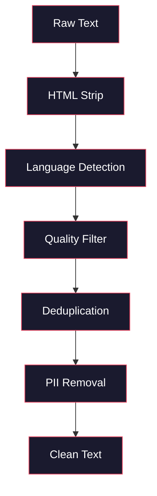
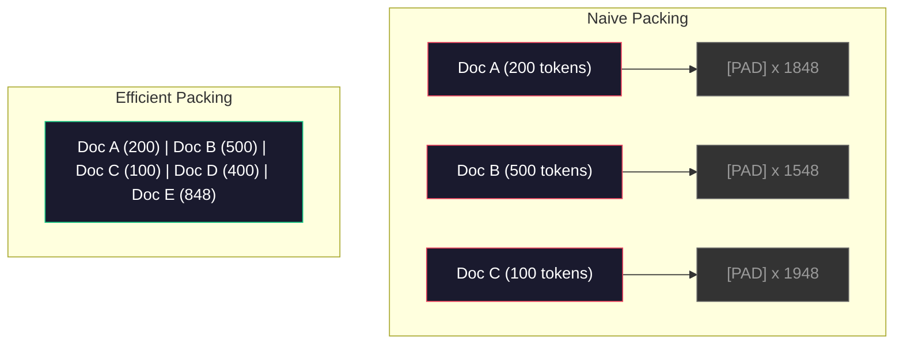

# Pipelines de datos para el Pre-entrenamiento

> El modelo es un espejo que refleja los datos que le das, le das basura, refleja basura con fluidez perfecta.

> **【中文解读】**El modelo es un espejo de superficie, que refleja fielmente los datos que le proporcionas.

> **【拓展：数据质量→GPT-4/Claude】**GPT-4 y Claude de alta calidad de salida provienen de datos de la línea de tubería de datos de diseño preciso. Los datos de preparación de Llama 3 contienen 15T de tokens, a través de un rigor de peso y calidad.

**Type:** Build
**Languages:** Python
**Prerequisites:** Phase 10, Lessons 01-02 (Tokenizers, Building a Tokenizer)
**Time:** ~90 minutes

## Objetivos de aprendizaje

- Construir una tubería de datos de transmisión que tokeniza, trozos, mezcla y lotes de terabytes de texto sin cargarlo todo en la memoria
  Construir un flujo de datos de tuberculosis, en el texto de la clase TB, realizar la separación de palabras, bloques, desorden y procesamiento en lote, sin necesidad de cargar todo en memoria
- Implementar filtros de calidad de datos (desduplicación, detección de lenguaje, filtración de contenido) utilizados en tuberías reales de pre-entrenamiento
  实现真实预训管线中使用的数据质量过器(去重、语言检测、内容过)
- Crear secuencias de entrenamiento de longitud fija con máscaras de atención adecuadas y manejo de los límites de los documentos
  Crear una serie de entrenamientos de longitud fija con un enfoque correcto de ocultamiento y procesamiento de los límites de archivos
- Descarga de la línea de perfil para garantizar que el cargador de datos siga el ritmo de entrenamiento de la GPU
  Análisis de la capacidad de transmisión de datos, asegurarse de que la velocidad de carga de datos sigue a la velocidad de entrenamiento de la GPU

> **【中文解读】**Este curso se centra en el hecho de que el proceso de gestión de datos de la LLLM es un factor decisivo en la calidad de la LLLM.

## El problema es la introducción del problema

Tienes un tokenizer, ahora necesitas datos.

> Tienes un par de palabras. Ahora necesitas datos.

No un conjunto de datos. No un archivo CSV. Terabytes de texto, limpiados, deduplicados, filtrados por calidad, tokenizados en secuencias de longitud fija, y servidos en lotes aleatorios lo suficientemente rápido como para que su grupo de 8 GPU nunca espere al siguiente lote.

> No es un conjunto de datos, no es un archivo CSV, el número de TB de textos ha pasado por la limpieza, el despecho, la calidad, la calidad, la calidad, la calidad, la calidad, la calidad, la calidad, la calidad, la calidad, la calidad, la calidad, la calidad, la calidad, la calidad, la calidad, la calidad, la calidad, la calidad, la calidad, la calidad, la calidad, la calidad, la calidad, la calidad, la calidad, la calidad, la calidad, la calidad, la calidad, la calidad, la calidad, la calidad, la calidad, la calidad, la calidad, la calidad, la calidad, la calidad y la calidad de los datos.

La mayoría de la gente piensa que entrenar un LLM es sobre la arquitectura del modelo. No lo es. Llama 3 usó 15.6 billones de tokens. GPT-3 usó 300 mil millones. DeepSeek-V2 usó 8.1 billones. La arquitectura en los tres es aproximadamente la misma: bloques de transformador apilados con capas de atención y retroalimentación. La diferencia en la calidad de salida proviene en gran parte de los datos.

> La mayoría de las personas piensan que entrenar LLM es sobre la estructura del modelo. No es de. Llama 3 utilizó 15.6 millones de tokens. GPT-3 utilizó 3.000 millones. DeepSeek-V2 utilizó 8.1 millones. La estructura de los tres es casi la misma: los bloques de transformador de la pila, que contienen la atención y la primera capa. La gran mayoría de las diferencias de calidad de salida provienen de datos.

El artículo de Chinchilla de DeepMind hizo esto con precisión. Para un presupuesto informático determinado, existe una relación óptima de parámetros del modelo con tokens de formación. Chinchilla mostró que la mayoría de los modelos en 2022 estaban dramáticamente poco capacitados -- tenían demasiados parámetros para la cantidad de datos que veían. Un modelo de parámetro 70B entrenado en 1,4 billones de tokens (Chinchilla-óptimo) superó a un modelo 280B entrenado en 300 mil millones de tokens (Gopher).

> El artículo de Chinchilla de DeepMind lo explica con precisión. En cuanto a un presupuesto de cálculo determinado, existe la mejor proporción entre los parámetros de modelo y los tokens de entrenamiento. Chinchilla muestra que la mayoría de los modelos de 2022 no están entrenados seriamente.

Su línea de datos determina si su modelo aprende el lenguaje o aprende el ruido.

> Tu sistema de datos determina si tu modelo de aprendizaje es lenguaje o ruido.

> **【中文解读】**Chinchilla 论文(DeepMind 2022) prueba: en el presupuesto de cálculo fijo, el modelo de números y de entrenamiento de tokens debe aumentar en proporción.

> **【拓展：数据混合比的工程经验】**Los datos de formación de GPT-4 se encuentran en un gran número de códigos (la capacidad de razonamiento) y de la literatura académica (la exactitud de los hechos) en la proporción de: aproximadamente 50% DATA de páginas web DATA 25% Código  13% Libros y artículos  8% 數學  4% 多语言网页──

> ¿ Qué es esto ?**【前置】**学本节前Permanecer primero:(1) Fase 10·01 和 02(分词器)  comprensión de los tokens y los字节流;(2) Fase 10·01  mencionado ley de escalación de Chinchilla comprensión de la mejor proporción de los parametros y los números de los tokens;(3) Python 生成器 / `IterableDataset`- ¿ Qué ?`datasets.stream`流式处理范式;(4) MinHash + LSH 近似去重算法(不熟请先看Llama 3 / RefinedWeb 论文的相关章节)

## El concepto central.

### De dónde provienen los datos

Cada modelo de lenguaje grande se entrena en una mezcla de fuentes. La composición exacta es un secreto muy bien guardado para la mayoría de los laboratorios, pero sabemos lo suficiente para entender las categorías.

> Cada modelo de lenguaje grande está entrenado en fuentes de datos mixtas. La mayoría de los laboratorios tienen un secreto de composición exacto, pero sabemos lo suficiente como para entender las categorías.

| Source | Size | Quality | Used By |
|--------|------|---------|---------|
| Common Crawl | ~250 TB raw | Low (needs heavy filtering) | GPT-3, Llama, most open models |
| Wikipedia | ~20 GB | High | Every major LLM |
| GitHub code | ~1 TB+ | Medium (lots of duplicates, dead code) | StarCoder, CodeLlama, DeepSeek-Coder |
| Books (BookCorpus, Pile) | ~100 GB | High | GPT-2, GPT-3, early models |
| Academic papers (arXiv, S2ORC) | ~100 GB | High for STEM | Llama, Galactica |
| StackOverflow, Reddit | ~100 GB | Medium | Llama, Falcon |
| Curated web (C4, RefinedWeb) | ~5 TB | Medium-High (pre-filtered) | T5, Falcon |

Llama 3 reveló su mezcla de datos: aproximadamente el 50% de datos web, el 25% de código, el 13% de libros y documentos académicos, el 8% de datos matemáticos y el 4% de datos web multilingües.

> Llama 3 ha abierto su distribución de datos: aproximadamente el 50%  网页数据,25% 代码,33% 书籍和学术论文,8% 数学数据和4% 多语言网页数据── un total de 15.6亿代币, provenientes de más de 5 TB de fuentes de datos del texto original.

La proporción importa tanto como el tamaño total. Demasiados datos web y el modelo se convierte en un loro Reddit. Demasiado poco código y no puede programar. Demasiado poco matemáticas y no logra razonar.

> Por ejemplo, es igual de importante que el tamaño total. El modelo se convierte en Reddit. El código es demasiado pequeño, no se programa.

### Limpieza de datos

Los datos de la web son sucios.

> Un típico rastreo común 转储 contiene:

- Etiquetas HTML y JavaScript
  China 标签和 JavaScript
- Cabezas de calderas, piezas, menús de navegación
  Chino: 模板页眉、页脚、导航菜单
- Páginas duplicadas (exactas y casi duplicadas)
  Traducción:La página de la página de la página de la página de la página de la página de la página de la página de la página de la página de la página de la página de la página de la página de la página de la página de la página de la página de la página de la página de la página de la página de la página de la página de la página de la página de la página de la página de la página de la página de la página de la página de la página de la página de la página de la página de la página de la página de la página de la página de la página de la página de la página de la página de la página de la página de la página de la página de la página de la página de la página de la página de la página de la página de la página de la página de la página de la página de la página de la página de la página de la página de la página de la página de la página de la página de la página de la página de la página de la página de la página de la página de la página de la página de la página de la página de la página de la página de la página de la página de la página de la página de la página de la página de la página de la página de la página de la página de la página de la página de la página de la página de la página de la página de la página de la página de la página de la página de la página de la página de la página de la página de la página de la página de la página de la página de la página de la página de la página de la página de la página de la página de la página de la página de la página de la página de la página de la página de la página de la página de la página de la página de la página de la página de la página de la página de la página de la página de la página de la página de la página de la página de la página de la página de la página de la página de la página de la página de la página de la página de la página de la página de la página de la página de la página de la de la página de la página de la página de la de la página de la de la de la de la de la de la de la de la de la de la de la de la de la de la de la de la de la de la de la de la de la de la de la de la de la de la de la de la de
- Spam generado por máquina
  En español traducción: contenido de basura generado por máquinas
- Información de identificación personal (PII)
  En inglés, el nombre de la persona que se encuentra en el idioma oficial es el idioma oficial.
- Texto de baja calidad (listas de palabras clave, spam de SEO)
  En inglés, el nombre de la palabra "search" se refiere a la palabra "search".
- Contenido no textual codificado como texto
  En inglés, traducción de la lengua inglesa:

La limpieza de esto no es opcional. Es la diferencia entre un modelo que genera párrafos coherentes y uno que saca etiquetas HTML mezcladas con listas de productos.

> Limpiar no es opcional. Esta es la diferencia entre el modelo de generación de segmentos continuos y el modelo de salida de etiquetas HTML mixtas y la lista de productos.

> ¿ Qué es esto ?**【类比】**Se trata de un sistema de gestión de agua que se utiliza para la producción de agua y agua en el agua. Se utiliza para la producción de agua y agua en el agua en el agua. Se utiliza para la producción de agua y agua en el agua en el agua.



Cada paso elimina una categoría de ruido:

> Cada paso elimina un tipo de ruido:

**HTML stripping:**Elimina todo el marcador. Guarde sólo el contenido de texto visible.`trafilatura`o `readability`extraer contenido de artículo mientras descartes navegación, anuncios y placa de calderas.

> **HTML 剥离：**移除所有标记──只保留可见文本内容──`trafilatura`O `readability`Esperamos que se haga un trabajo de trabajo y que se haga un trabajo de trabajo.

**Language detection:**Utilice el modelo de identificación de idioma de fastText (lid.176.bin) para clasificar cada documento. Filtra a sus idiomas objetivo. Un documento clasificado como inglés con menos de 0,8 confianza probablemente no sea inglés limpio.

> **语言检测：**Utiliza fastText's language identification model (FASTTEXT's language identification model) (lid.176.bin) para cada artículo en el archivo de la clase.

**Quality filtering:**Aquí es donde se vuelve interesante. RefinedWeb (el conjunto de datos detrás de Falcon) utiliza un filtro basado en la perplejidad: entrenar un pequeño modelo de lenguaje en Wikipedia, luego calificar cada documento. Alta perplejidad significa que el documento es diferente a Wikipedia - probablemente spam, listas de palabras clave o contenido generado por máquina. Se eliminan los documentos con perplejidad por encima de un umbral.

> **质量过滤：**Esta es la parte interesante. RefinedWeb (en inglés: RefinedWeb) utiliza filtros basados en la confusión: entrenar un pequeño modelo de lenguaje en Wikipedia, luego evaluar cada artículo de archivo.

**Deduplication:**El único paso de limpieza más impactante. Common Crawl contiene un enorme número de páginas duplicadas - disclaimer legal, avisos de cookies, términos de servicio.

> **去重：**影响最大的清洗步骤──Common Crawl 包含大量重复页面法律声明、cookie 通知、服务条款──在重复数据上训练浪费算力,也可能导致模型逐字记忆和复述特定段落──

**PII removal:**Nombres, direcciones de correo electrónico, números de teléfono, números de seguridad social, detección basada en Regex para PII estructurados, modelos NER para nombres en contexto.

> **PII 移除：**姓名、电子邮件地址、电话号码、社会安全号码──结构化 PII 用正则检测,上下文中的姓名用 NER 模型──

> **【中文解读】**El análisis de datos es el más importante de los preparativos. El análisis de datos de la página web original está lleno de ruidos: HTML 标签,导航菜单,机器生成的SEO 垃圾,个人隐私信息(PII) ❏ 清洗管线依次执行:HTML 剥离 → 语言检测 → 质量过 → 去重 → PII 移除.

> **【拓展：去重的工程影响】**El informe de Llama  equipo ha eliminado aproximadamente el 38% de los datos de páginas web. En el rastreo común, más de un tercio de las páginas son repetidas o casi repetidas. El entrenamiento en datos repetidos no solo pierde la capacidad de cálculo, sino que también conduce a un modelo de memoria por letra en un determinado segmento, aumentando el riesgo de divulgación de privacidad.

> ️ **【易错点】**¿Qué es eso ?**整库加载进内存** El`datasets.load_dataset("common_crawl", split="train")`默认会实例化                                                                                                                                                                                                                                                                                                                                                                                                                                                                                                                       `streaming=True`O `IterableDataset`•(2) **去重时把"高密度优质内容"误删**文档 A 包含整篇 Wikipedia(5KB),文档 B 是只引用一句话的博客(500 字),MinHash 误判为高相似度──修复:在围 之前对每篇文档归归一化长度,或对小文档用更保守的值;(3) **打包（pack）跨文档 attention 漏 mask**把3 篇短文拼拼进2048 token Pero no se añadió máscara de límite de documentos, 1 末尾的代币 会"看到" 2 开头的代币,造成跨文档污染;修复:使用 FlashAttention 的 `varlen`接口或 bloque diagonal máscara de atención;(4) **配比（mix）在 epoch 间漂移**shuffle 时按"文档级"而不是"token 级"采样,结果小文档被过度采样、大文档缺采样──

### Deduplicación con MinHash

La deduplicación exacta es fácil: hash cada documento, eliminar duplicados. Pero los duplicados cercanos son el verdadero problema. Dos copias del mismo artículo de noticias con anuncios ligeramente diferentes alrededor de él son duplicados cercanos. El contenido es 95% idéntico, pero byte-for-byte difieren.

> 精确去重很简单: para cada artículo, se elimina la repetición. Pero la repetición aproximada es el verdadero problema.

MinHash + Hashing sensitivo a la localidad (LSH) resuelve esto de manera eficiente.

> MinHash + 局部敏感哈希(LSH) 高效地 resolveron este problema.


La idea:

> 核心思想:

1. **Shingling:**Convertir cada documento en un conjunto de n-gramos (por ejemplo, 5 gramos de palabras o caracteres). "el zorro marrón rápido" con la barandillas de 3 palabras se convierte en {"el zorro marrón rápido", "zorro marrón rápido"}.
   En inglés:**Shingling：**将每篇文档转换为一组 n-gram 集合(如5词或5字符的n-gram) ――"la zorra marrón rápida" 用3词 shingle 变为 {"la zorra marrón rápida", "zorra marrón rápida"}。

2. **MinHash:**Para cada conjunto de barandas de documento, computa los valores de hash k. Cada valor de hash es el hash mínimo en todos los barandas de un hash diferente. Esto crea una "firma" de tamaño fijo que se aproxima a la similitud de Jaccard entre cualquier dos documentos.
   En inglés:**MinHash：**Para cada documento de baranda 集合计算 k 个哈希值──每哈希值是所有 baranda 在不同哈希函数下最小哈希── esto crea una "firma" de tamaño fijo, casi similar a cualquier dos documentos Jaccard similitud──

3. **LSH:**Grupar documentos en cubos basados en bandas de su firma MinHash. Los documentos en el mismo cubo son candidatos casi duplicados. Esto evita comparar cada par - sólo comparas candidatos.
   En inglés:**LSH：**Según MinHash                                                                                                                                                                                                                                                                                                                                                                                                                                                                                                                          

4. **Verify:**Para cada par candidato, calcular la similitud exacta de Jaccard. Retire una copia si la similitud excede un umbral (normalmente 0,8).
   En inglés:**验证：**Para cada candidato, calcular la similaridad de Jaccard exacta. Si la similaridad supera el valor, se elimina una copia.

El equipo de Llama informó que eliminó aproximadamente el 38% de sus datos web a través de la deduplicación.

> El informe de Llama 团队 aprobó la re-migración de aproximadamente el 38% de los datos de las páginas web. Esto no es un pequeño número.

### Envasado de secuencias

Su modelo espera secuencias de entrada de longitud fija. sus documentos son de longitud variable. algunos son 50 tokens. algunos son 50.000 tokens.

> Su modelo espera fijar la secuencia de entrada de longitud. Su archivo tiene una longitud no una. Algunos tienen 50 tokens. Algunos tienen 50.000 tokens.

Abordaje ingenuo: empate cada documento a la longitud máxima de la secuencia. Esto desperdicia una enorme computación en tokens de empate que no contribuyen nada al aprendizaje.

> 朴素方法:将每篇文档填充至最大序列长度──这浪费大量算力在贡献为零的填充代币上──

Mejor enfoque: empaque varios documentos en una sola secuencia, separados por tokens de final de secuencia. Una secuencia de 2048 tokens puede contener tres documentos cortos concatenados con tokens [EOS] entre ellos.

> Mejor método:将多篇文档打包到单个序列中, con el secuencia terminar el token 分隔──. Un 2048 token de un secuencia puede contener tres artículos cortos, en el medio con el token [EOS] 连接──.

> ¿ Qué es esto ?**【困惑】**P: 既然包装 会跨文档污染,为什么不直接使用填充?多浪费点算力换正确性不是更稳定吗? A: 因为预训算力极其昂贵Llama 3 训练成本估计10亿美元.`cu_seqlens`O atención de bloque-diagonal) hacer la consulta final de la 1a pregunta no se encuentra en la 2a pregunta. Esto es un costo de la construcción.



La máscara de atención debe estar configurada correctamente. Los tokens del documento A no deben atender a los tokens del documento B dentro de la misma secuencia empaquetada. Esto requiere una máscara de atención de diagonal de bloque.

> Nota de seguridad debe ser correctamente configurada. Nota de seguridad A no debe ser observada en el mismo orden de datos. Nota de seguridad B.

Los documentos largos se truncan o se dividen en trozos en los límites de la secuencia. El punto de división es importante: dividir a mitad de la oración obliga al modelo a ver pensamientos incompletos. Algunas tuberías alinean las divisiones a los límites del párrafo o la oración cuando sea posible.

> 长文档在序列边界处被切断或分分成块──分分点很重要:在句子中分分迫使模型看到不完整的思想──一些管线在可能时将分分点对齐到段落或句子边界──

> **【中文解读】**序列打包(Sequence Packing) es un método simple de llenar un archivo de forma fija. PAD 填充会浪费大量算力──高效方法将多个短文档用 [EOS] 分隔拼接进同一序列, pero necesita bloquear la atención en un ángulo.

> **【拓展：Chinchilla 定律与过度训练】**Chinchilla 定律 considera que los parámetros y los tokens de entrenamiento del modelo se incrementan en un número de dimensiones. Pero el modelo 70B de Llama 3 se entrenan en tokens de 15T (~1.4T), es una estrategia "de la mejor manera de pensar" que el costo de entrenamiento de los modelos es una sola vez, pero el costo de los servicios de los modelos más pequeños es reducido permanentemente. Este tipo de entrenamiento excesivo se ha convertido en el estándar de la industria desde 2024.

### La ley de escala de Chinchilla

Para un presupuesto de cálculo fijo C (medido en FLOP), el tamaño óptimo del modelo N y el tamaño del conjunto de datos D son los siguientes:

> 对于固定的计算预算 C(以 FLOPs 衡量),最优模型大小 N 和数据集大小 D 遵循:

```
N_opt ~ C^0.5
D_opt ~ C^0.5
```

En la práctica, esto significa que debe escalar el tamaño del modelo y el tamaño del conjunto de datos aproximadamente de manera igual. Un modelo con 10 veces más parámetros necesita aproximadamente 10 veces más tokens de entrenamiento para alcanzar la misma pérdida.

> En la práctica, esto significa que debes ampliar el tamaño del modelo en gran medida y el tamaño del conjunto de datos en gran medida.

| Model | Parameters | Training Tokens | Chinchilla-Optimal? |
|-------|-----------|----------------|-------------------|
| GPT-3 | 175B | 300B | No (undertrained 3-4x) |
| Chinchilla | 70B | 1.4T | Yes (by design) |
| Llama 2 | 70B | 2T | Overtrained (intentionally) |
| Llama 3 | 70B | 15T | Heavily overtrained |

Llama 3 viola deliberadamente la ley de Chinchilla. Meta encontró que la sobreentrenamiento en más datos - mucho más allá de la relación computacional-óptima - produce mejores modelos para la inferencia. El costo adicional de la formación se paga una vez, pero el modelo más pequeño es más barato para servir para siempre. A veces se le llama el enfoque de escalación "inferencia-óptima", y se ha convertido en el estándar de la industria desde 2024.

> Llama 3 por su propia voluntad violaron la ley de Chinchilla. La meta se encontró que con más datos sobreentrenamiento lejos sobre el cálculo la mejor proporción puede producir mejores modelos de efecto de la racionalización. El costo de la racionalización adicional sólo se paga una vez, pero los modelos más pequeños son permanentemente más económicos en el servicio.

## Construye y realiza.
```figure
l5-data-pipeline
```

## Construye el mismo

### Paso 1: Limpiar el texto

Descargar HTML, normalizar el espacio en blanco, eliminar el contenido no textual. Usaremos un texto de dominio público (Proyecto Gutenberg) como nuestro pequeño corpus.

> 剥离 HTML、归一化空白、移除文本内容──我们将使用公共领域文本 (古堡计划) como pequeño语料──

```python
import re

def clean_text(text):
    text = re.sub(r"<[^>]+>", "", text)
    text = re.sub(r"http\S+", "", text)
    text = re.sub(r"[^\x20-\x7E\n]", "", text)
    text = re.sub(r"\n{3,}", "\n\n", text)
    text = re.sub(r" {2,}", " ", text)
    return text.strip()

def quality_filter(text, min_words=50, max_ratio_caps=0.3, max_ratio_special=0.1):
    words = text.split()
    if len(words) < min_words:
        return False
    caps_ratio = sum(1 for w in words if w.isupper()) / len(words)
    if caps_ratio > max_ratio_caps:
        return False
    special_chars = sum(1 for c in text if not c.isalnum() and not c.isspace())
    if special_chars / max(len(text), 1) > max_ratio_special:
        return False
    return True
```

El filtro de calidad capta spam de SEO (Todos los CAPS), ruido generado por máquina (alta proporción de caracteres especiales) y páginas de contenido (demasiado cortas).

> 质量过器捕获 SEO 垃圾(全大写) 机器生成的噪音(高特殊字符比例) 和存根页面(太短) ⋅ solo estos tres controles pueden eliminar una gran cantidad de basura de la web ⋅

### Paso 2: Desduplicación de MinHash

Implementar MinHash desde cero. No se requieren bibliotecas externas.`hashlib`¿ Qué ?

> Desde el 0 de la implementación de MinHash.`hashlib`¿Qué es eso?

```python
import hashlib
from collections import defaultdict

def get_shingles(text, k=5):
    words = text.lower().split()
    if len(words) < k:
        return set()
    return {" ".join(words[i:i+k]) for i in range(len(words) - k + 1)}

def minhash_signature(shingles, num_hashes=128):
    signature = []
    for i in range(num_hashes):
        min_hash = float("inf")
        for shingle in shingles:
            h = int(hashlib.sha256(f"{i}:{shingle}".encode()).hexdigest(), 16)
            min_hash = min(min_hash, h)
        signature.append(min_hash)
    return signature

def lsh_buckets(signature, bands=16):
    rows_per_band = len(signature) // bands
    buckets = []
    for b in range(bands):
        start = b * rows_per_band
        band_data = tuple(signature[start:start + rows_per_band])
        bucket_hash = hashlib.md5(str(band_data).encode()).hexdigest()
        buckets.append((b, bucket_hash))
    return buckets

def deduplicate(documents, threshold=0.8, num_hashes=128, bands=16):
    signatures = []
    shingle_sets = []
    for doc in documents:
        shingles = get_shingles(doc)
        shingle_sets.append(shingles)
        signatures.append(minhash_signature(shingles, num_hashes))

    bucket_map = defaultdict(list)
    for doc_idx, sig in enumerate(signatures):
        for band_id, bucket_hash in lsh_buckets(sig, bands):
            bucket_map[(band_id, bucket_hash)].append(doc_idx)

    duplicate_pairs = set()
    for bucket_docs in bucket_map.values():
        if len(bucket_docs) < 2:
            continue
        for i in range(len(bucket_docs)):
            for j in range(i + 1, len(bucket_docs)):
                duplicate_pairs.add((bucket_docs[i], bucket_docs[j]))

    removed = set()
    for i, j in duplicate_pairs:
        if i in removed or j in removed:
            continue
        s1, s2 = shingle_sets[i], shingle_sets[j]
        if not s1 or not s2:
            continue
        jaccard = len(s1 & s2) / len(s1 | s2)
        if jaccard >= threshold:
            removed.add(j)

    return [doc for idx, doc in enumerate(documents) if idx not in removed], len(removed)
```

El `num_hashes=128`y `bands=16`Los parámetros controlan el tradeoff de recuperación de precisión. Más hashes dan estimaciones de similitud más precisas. Más bandas aumentan la recuperación (captura más duplicados) a costa de más falsos positivos. Estos valores funcionan bien para el texto web típico.

> `num_hashes=128`Y `bands=16`参数控制精度-召回率的权衡──更多哈希值给出更准确的相似度估计──更多条带增加召回率(捕获更多重复),代价是更多误报──这些值对典型网页文本效果良好──

### Paso 3: Tokeniza y empaque las secuencias

Tome el texto limpio, deduplicado, lo tokenize, y empaque en secuencias de longitud fija para entrenamiento.

> 取清洗、去重后的文本,分词,打包为固定长度序列用于训练──

```python
def tokenize_corpus(documents, tokenizer):
    all_tokens = []
    for doc in documents:
        tokens = tokenizer.encode(doc)
        all_tokens.extend(tokens)
        all_tokens.append(tokenizer.eos_id)
    return all_tokens

def pack_sequences(token_ids, seq_length, pad_id=0):
    sequences = []
    attention_masks = []
    for i in range(0, len(token_ids), seq_length):
        seq = token_ids[i:i + seq_length]
        mask = [1] * len(seq)
        if len(seq) < seq_length:
            pad_count = seq_length - len(seq)
            seq = seq + [pad_id] * pad_count
            mask = mask + [0] * pad_count
        sequences.append(seq)
        attention_masks.append(mask)
    return sequences, attention_masks
```

### Paso 4: DataLoader para la formación

Produce lotes aleatorios de secuencias empaquetadas. Esto es lo que el ciclo de entrenamiento consume.

> Se trata de un ciclo de formación de datos de consumo.

```python
import random

class PreTrainingDataLoader:
    def __init__(self, sequences, attention_masks, batch_size, shuffle=True):
        self.sequences = sequences
        self.attention_masks = attention_masks
        self.batch_size = batch_size
        self.shuffle = shuffle

    def __len__(self):
        return (len(self.sequences) + self.batch_size - 1) // self.batch_size

    def __iter__(self):
        indices = list(range(len(self.sequences)))
        if self.shuffle:
            random.shuffle(indices)
        for start in range(0, len(indices), self.batch_size):
            batch_idx = indices[start:start + self.batch_size]
            batch_seqs = [self.sequences[i] for i in batch_idx]
            batch_masks = [self.attention_masks[i] for i in batch_idx]
            yield batch_seqs, batch_masks
```

### Paso 5: Estadísticas de conjunto de datos

Computa los números que importan: tokens totales, tokens únicos, ratio de compresión, distribución de longitud del documento.

> 计算关键指标:总代币 数、唯一代币 数、压缩比、文档长度分布──

```python
from collections import Counter

def compute_statistics(documents, token_ids, sequences, tokenizer_vocab_size):
    total_chars = sum(len(d) for d in documents)
    total_tokens = len(token_ids)
    unique_tokens = len(set(token_ids))
    compression_ratio = total_chars / total_tokens

    doc_lengths = [len(d.split()) for d in documents]
    avg_doc_length = sum(doc_lengths) / max(len(doc_lengths), 1)
    max_doc_length = max(doc_lengths) if doc_lengths else 0
    min_doc_length = min(doc_lengths) if doc_lengths else 0

    token_counts = Counter(token_ids)
    top_tokens = token_counts.most_common(10)

    non_pad_tokens = sum(sum(1 for t in seq if t != 0) for seq in sequences)
    total_positions = sum(len(seq) for seq in sequences)
    utilization = non_pad_tokens / max(total_positions, 1)

    stats = {
        "total_documents": len(documents),
        "total_characters": total_chars,
        "total_tokens": total_tokens,
        "unique_tokens": unique_tokens,
        "vocab_utilization": unique_tokens / tokenizer_vocab_size,
        "compression_ratio": compression_ratio,
        "avg_doc_length_words": avg_doc_length,
        "max_doc_length_words": max_doc_length,
        "min_doc_length_words": min_doc_length,
        "num_sequences": len(sequences),
        "sequence_utilization": utilization,
        "top_10_tokens": top_tokens,
    }
    return stats
```

La relación de compresión le dice cuán eficiente es el tokenizer en este corpus. El texto en inglés generalmente se comprime a aproximadamente 3-4 caracteres por token. Si ves 1,5 caracteres por token, tu tokenizer se divide demasiado agresivamente. Si ves 8+, ha aprendido fusiones muy específicas de dominio.

> 压缩比告诉你分词器在此语料上的效率──英文文本通常缩写到每个代币约3~4字符──如果你看到每一个代币1.5字符,说明分词器分分离过激进──如果你看到8+,说明它学到了非常特定领域的合并──

La utilización de secuencias le dice cuánto de sus secuencias empaquetadas son datos reales frente a relleno. por debajo del 90% significa que su empaquetado es ineficiente - usted está desperdiciando computación en tokens de relleno.

> La tasa de utilización de los conjuntos te dice cuánto de los conjuntos de conjuntos es verdadero datos frente a los de llenado.

## Usalo con el marco de ejecución

### Comparar con los conjuntos de datos HuggingFace

Cargue el mismo corpus a través de la biblioteca de conjuntos de datos de HuggingFace y compare la velocidad de la tubería.

> 通过 HuggingFace的数据集 库加载相同语料并比较管线速度──

```python
from datasets import load_dataset
from transformers import AutoTokenizer

ds = load_dataset("wikitext", "wikitext-2-raw-v1", split="train")
tokenizer = AutoTokenizer.from_pretrained("meta-llama/Meta-Llama-3-8B")

import time

start = time.time()
tokenized = ds.map(
    lambda x: tokenizer(x["text"], truncation=True, max_length=2048),
    batched=True,
    num_proc=4,
)
hf_time = time.time() - start
total_tokens = sum(len(t) for t in tokenized["input_ids"])
print(f"HuggingFace: {total_tokens:,} tokens in {hf_time:.2f}s ({total_tokens/hf_time:,.0f} tokens/sec)")
```

La tubería HuggingFace utiliza tokenizers de Rust bajo el capó y procesamiento paralelo en 4 núcleos. Su tubería de Python pura será 10-50 veces más lenta. Esa brecha es por qué los equipos de producción usan tokenizers compilados. El algoritmo es el mismo. El lenguaje de implementación es la diferencia.

> HuggingFace 管线底层使用 Rust 分词器和 4 核并行处理。 tu pura Python 管线会慢10-50 veces── ése es el motivo por el que el equipo de producción usa la misma estructura.

## Envíe el producto .

Esta lección produce una invitación para validar y desactivar la calidad de los datos en las líneas de formación de LLM.`outputs/prompt-data-quality-checker.md`¿ Qué ?

> Este curso se ha publicado para la prueba y la regulación de la calidad de datos del LLM                                                                                                                                                                                                                                                                                                                                                                                                                                                                                                          `outputs/prompt-data-quality-checker.md`¿Qué es eso?

## Los ejercicios.

1. **Easy:**Añadir detección de lenguaje a la tubería de limpieza mediante un simple análisis heurístico (análisis de conjuntos de caracteres).
2. **Medium:**Implemente la deduplicación exacta utilizando hashes SHA-256 junto con la deduplicación cercana MinHash. Compara el número de duplicados capturados por cada método en un corpus raspado por la red.
3. **Hard:**Construye un filtro de calidad basado en la perplejidad. Entrenar un pequeño modelo de lenguaje de bigram en el texto de Wikipedia, calificar cada documento por perplejidad y eliminar el 20% inferior.

## Términos clave .

| Term | What people say | What it actually means | 中文释义 |
|------|----------------|----------------------|---------|
| Common Crawl | "The internet" | A non-profit that crawls the web monthly -- ~250TB raw, the starting point for most LLM training data | 通用爬虫，LLM 训练数据的起点 |
| MinHash | "Some hashing trick" | A technique to estimate Jaccard similarity between sets using fixed-size signatures -- enables near-duplicate detection at scale | 最小哈希，近似重复检测的核心技术 |
| LSH | "Locality-Sensitive Hashing" | A method to group similar items into the same bucket -- reduces pairwise comparisons from O(n^2) to near-linear | 局部敏感哈希，将 O(n^2) 降为近似线性 |
| Sequence packing | "Concatenating documents" | Fitting multiple documents into fixed-length sequences with proper attention masks -- eliminates padding waste | 序列打包，消除填充浪费 |
| Chinchilla scaling | "Train on more data" | For a fixed compute budget, optimal performance requires scaling model size and training tokens roughly equally | Chinchilla 缩放定律，参数和数据应等比增长 |
| Fertility | "Tokens per word" | Average number of tokens per word -- 1.3 for English in GPT-4, higher for non-Latin scripts | 生育率，每词 token 数 |
| Data mixing | "Choosing training data" | The ratio of code vs text vs math vs multilingual data -- no formula, requires experimentation | 数据混合比，需实验确定 |
| Perplexity filter | "Quality scoring" | Use a small language model to score documents -- high perplexity means the text is unlike clean reference data | 困惑度过滤，低质量文档评分高 |
| Deduplication | "Removing copies" | Eliminating exact and near-duplicate documents -- typically removes 30-40% of raw web data | 去重，通常移除 30-40% 网页数据 |
| Attention mask | "Which tokens to look at" | A binary mask that prevents attention across document boundaries in packed sequences | 注意力掩码，阻止跨文档注意力 |

## Más Leer más Leer más

- [Hoffmann et al., 2022 -- Training Compute-Optimal Large Language Models (Chinchilla)](https://arxiv.org/abs/2203.15556)-- el documento que cambió la forma en que pensamos sobre la escala de datos
- [Penedo et al., 2023 -- The RefinedWeb Dataset for Falcon LLM](https://arxiv.org/abs/2306.01116)-- Cómo filtrar Common Crawl a alta calidad
- [Touvron et al., 2023 -- Llama 2: Open Foundation and Fine-Tuned Chat Models](https://arxiv.org/abs/2307.09288)-- detalles de la línea de datos para Llama 2
- [Lee et al., 2022 -- Deduplicating Training Data Makes Language Models Better](https://arxiv.org/abs/2107.06499)- ¿Por qué la deduplicación importa más de lo que piensas?
- [Broder, 1997 -- On the Resemblance and Containment of Documents](https://ieeexplore.ieee.org/document/666900)-- el papel original de MinHash
- [Meta, 2024 -- Llama 3 Technical Report](https://arxiv.org/abs/2407.21783)-- 15,6T tokens, ratio de mezcla de datos, filtración de la tubería
