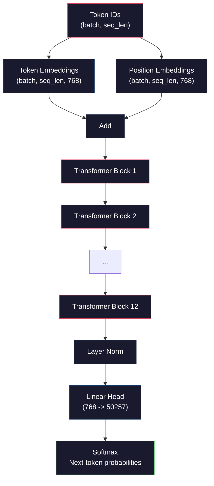
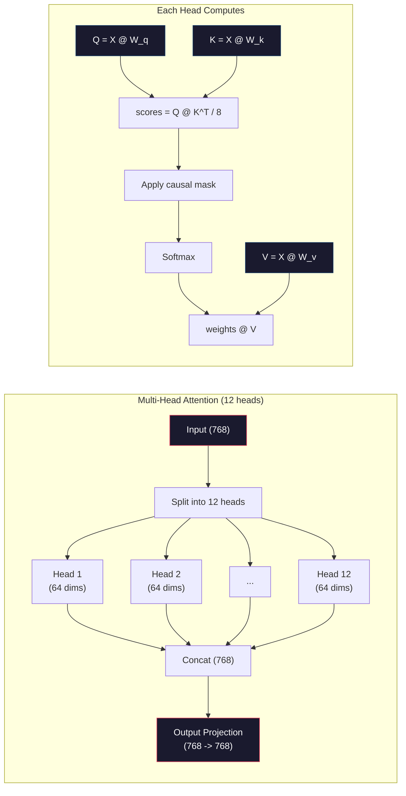
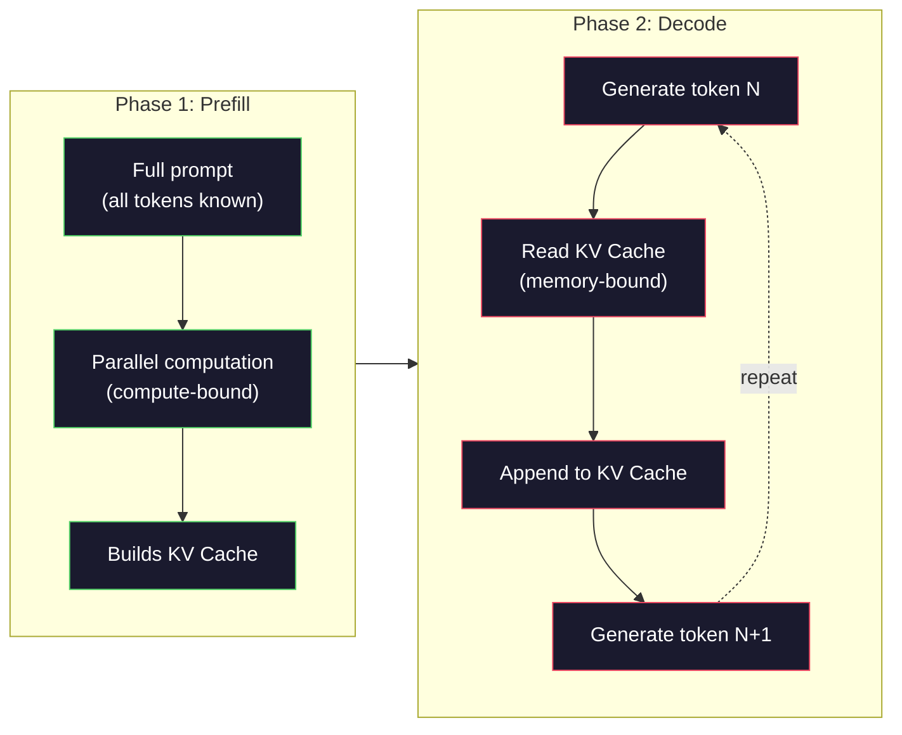

# Pre-entrenamiento de un Mini GPT (124M Parámetros) 预训迷你 GPT(1.24 亿参数)

> GPT-2 Small tiene 124 millones de parámetros. Son 12 capas de transformador, 12 cabezas de atención y 768 embebedidos dimensiones. Puedes entrenarlo desde cero en una sola GPU en unas horas. La mayoría de la gente nunca hace esto. Utilizan puntos de control pre-entrenados. Pero si no entrenas uno tú mismo, no entiendes realmente lo que está sucediendo dentro del modelo en el que estás construyendo productos.

> **【中文解读】**GPT-2 Small tiene 1.24 millones de parámetros: 12 niveles Transformer  12 个注意头、 768 维嵌入── un solo GPU 几小时即可从头训练──理解预训练是理解大模型的第一步──

> **【拓展：大模型三阶段】**La formación de los estudiantes de la escuela de la escuela de la escuela de la escuela de la escuela de la escuela de la escuela de la escuela de la escuela de la escuela de la escuela de la escuela de la escuela de la escuela de la escuela de la escuela de la escuela de la escuela de la escuela de la escuela de la escuela de la escuela de la escuela de la escuela de la escuela de la escuela de la escuela de la escuela de la escuela de la escuela de la escuela de la escuela de la escuela de la escuela de la escuela de la escuela de la escuela de la escuela de la escuela de la escuela de la escuela de la escuela de la escuela de la escuela de la escuela de la escuela de la escuela de la escuela de la escuela de la escuela de la escuela de la escuela de la escuela de la escuela de la escuela de la escuela de la escuela de la escuela de la escuela de la escuela de la escuela de la escuela de la escuela de la escuela de la escuela de la escuela de la escuela de la escuela de la escuela de la escuela de la escuela de la escuela de la escuela de la escuela de la escuela de la escuela de la escuela de la escuela de la escuela de la escuela de la escuela de la escuela de la escuela de la escuela de la escuela de la escuela de la escuela de la escuela de la escuela de la escuela de la escuela de la escuela de la escuela de la escuela de la escuela de la escuela de la escuela de la escuela de la escuela de la escuela de la escuela de la escuela de la escuela de la escuela de la escuela de la escuela de la escuela de la escuela de la escuela de la escuela de la escuela de la escuela de la escuela de la escuela de la escuela de la escuela de la escuela de la escuela de la escuela de la escuela de la escuela de la escuela de la escuela de la escuela de la escuela de la escuela de la escuela de la escuela de la escuela de la escuela de la escuela de la escuela de la escuela de la escuela de la escuela de la escuela de la escuela de la escuela de la escuela de la escuela de la escuela de la escuela de la escuela de la escuela de la escuela de la escuela de la escuela de la escuela de la escuela de la escuela de la escuela de la escuela de la escuela de la escuela de la escuela de la escuela de la escuela de la escuela de la escuela de la escuela de la escuela de la escuela de la escuela de la escuela de la escuela de la escuela de la escuela de la escuela de

> ¿ Qué es esto ?**【前置】**学本节前Permanecer primero:(1) Fase 10·01-03(分词器、数据管线) 理解代币 ID 序列如何输入模型;(2) Transformer 架构(Fase 05)自我注意、LayerNorm、FFN;(3) numpy 矩阵运算、反向传播手算(Fase 03 微积分与链式法则);(4) 交叉损失函数的梯度推导──本课**用 numpy 实现**, dejar de depender de PyTorch Autograd, para poder escribir por sí mismo`backward()`¿Qué es eso?

**Type:** Build
**Languages:** Python (with numpy)
**Prerequisites:** Phase 10, Lessons 01-03 (Tokenizers, Building a Tokenizer, Data Pipelines)
**Time:** ~120 minutes

## Objetivos de aprendizaje

- Implementar la arquitectura completa de GPT-2 (124M parámetros) desde cero: embeddings de tokens, embeddings posicionales, bloques de transformadores y la cabeza de modelo de lenguaje
  Desde zero implementar completo GPT-2 架构(124M 参数):token 嵌入、位置嵌入、Transformer 块和语言模型头
- Entrenar un modelo GPT en un corpus de texto utilizando predicción de tokens siguientes con pérdida de entropía cruzada
  Uso de token 预测和交叉损失在文本语料上训练 GPT 模型
- Implementar la generación de texto autoregresista con muestreo de temperatura y filtración top-k/top-p
  实现带温度采样和 top-k/top-p 过的自归文本生成
- Monitorear las curvas de pérdida de formación y validar que el modelo aprenda patrones de lenguaje coherentes
  monitorear entrenamiento de la pérdida de curvatura, el modelo de prueba ha aprendido un lenguaje continuo

> **【中文解读】**Este curso utiliza pura numpy desde el zero para implementar GPT-2 Small(124M 参数) ⋅ verás cómo 1.24 mil millones de parámetros pasan por un ciclo de entrenamiento de transmisión hacia adelante ̊ pérdida de cálculo ̊ transmisión hacia atrás ̊ cambio de peso ̊ actualización para predecir el siguiente token ⋅ esto no es PyTorch 黑盒 cada rectangular multiplicado es visible ⋅

## El problema es la introducción del problema

Ya sabes lo que es un transformador, has leído los diagramas, puedes recitar "la atención es todo lo que necesitas" y dibujar cajas etiquetadas "Multi-Head Attention" en un tablero blanco.

> Usted sabe lo que es un transformador. Usted ha visto la tabla. Usted puede recitar "la atención es todo lo que necesita" y dibujar en un cuadro con un sello de "Multi-Head Attention".

Nada de eso significa que entiendas lo que sucede cuando un modelo genera texto.

> Esto no significa que entiendas lo que ocurrió cuando el modelo generó el texto.

Hay 124.438.272 parámetros en GPT-2 Small (con gravedad de unión). Cada uno de ellos fue configurado ejecutando un ciclo de entrenamiento: pase hacia adelante, pérdida de cálculo, pase hacia atrás, actualización de pesas. Doce bloques de transformador. Doce cabezas de atención por bloque. Un espacio de incorporación de 768 dimensiones. Un vocabulario de 50.257 tokens. Cada vez que el modelo genera un token, los 124 millones de parámetros participan en una cadena de multiplicación de matriz única que toma una secuencia de ID de token y produce una distribución de probabilidad sobre el siguiente token.

> GPT-2 Small tiene 124,438,272 个参数 (incluyendo el peso compartido) ⋅ cada parámetro está formado por un ciclo de entrenamiento: previo a la transmisión ⋅ cálculo de pérdida ⋅ reverso a la transmisión ⋅ actualización del peso ⋅ 12 bloques de transformador, cada bloque 12 个注意力头,768 维嵌入空间,50,257 词表── por cada token generado, todos los 1.24 mil millones de parámetros participan en una cadena de cuadros de rectangulares, convertirán el ID de los secuencias de tokens en la siguiente distribución de los tokens ⋅

Si nunca lo has construido tú mismo, estás trabajando con una caja negra. Puedes usar la API. Puedes ajustar. Pero cuando algo sale mal - cuando el modelo alucina, cuando se repite, cuando se niega a seguir las instrucciones - no tienes un modelo mental para *por qué*.

> Si nunca has construido este modelo a mano, estás usando una caja negra. Puedes modificar la API, puedes modificarla. Pero cuando el modelo se da la sensación de que se repite o se niega a seguir las instrucciones, no sabes por qué.

Esta lección construye GPT-2 Small desde cero. No en PyTorch. En numpy. Cada multiplicación de matriz es visible. Cada gradiente es calculado por su código. Verá exactamente cómo 124 millones de números conspiran para predecir la próxima palabra.

> Este curso se desarrolla desde cero en la construcción de GPT-2 Small── no se utiliza PyTorch── con numpy── cada matriz se multiplica en cada escala.

> Este curso se desarrolla desde cero en la construcción de GPT-2 Small── no se utiliza PyTorch── con numpy── cada matriz se multiplica en cada escala.

## El concepto central.

### La arquitectura del GPT

Aquí está el gráfico completo de cálculo de las identidades de tokens a las probabilidades de tokens siguientes:

> A continuación se muestra el gráfico completo de la probabilidad de un token desde el ID del token hasta el siguiente token:

1. Se entran los tokens. Forma: (batch_size, seq_len).
2. Identificación de identificación de un vector de 768 dimensiones.
3. Cada posición (0, 1, 2, ...) se hace con un vector de 768 dimensiones.
4. Añadir embeddings de tokens + posiciones de embeddings.
5. Pasa por 12 bloques de transformadores.
6. La normalización de la capa final.
7. Proyección lineal al tamaño del vocabulario.
8. Softmax para obtener probabilidades.

No hay convulsiones, no hay recurrencias, sólo incorporaciones, atención, redes de retroalimentación y normas de capas apiladas 12 veces.

> Es todo el modelo. No hay un ciclo. Sólo la inserción.

> ¿ Qué es esto ?**【类比】**GPT 像一台"流水线打字机": papel带送进代币ID → 印章 1(tōken embedding)盖出 768 维向量 → 印章 2(posición embedding) 叠加位置 → 12 道工人(Transformer block) Layer modificación de este向量 → 末端喷墨头(LM head) 喷概率分布在 50257 个候选词上 → 选最高概率的词输出 → 把新词同时再送回纸带开头,循环──一切秘都在那12 道工人头上如何"修改"向量而自我注意就是工人只用12眼眼注意) 的看序列里其他代币能力──



### El bloque de transformador

Cada uno de los 12 bloques sigue el mismo patrón. Arquitectura pre-norma (GPT-2 utiliza pre-norma, no post-norma como el transformador original):

> Cada uno de los 12 bloques sigue el mismo modelo.

1. La capaNorm
2. Atención personal de varias cabezas
3. Conexión residual (agrega entrada hacia atrás)
4. La capaNorm
5. Red de transmisión de datos (MLP)
6. Conexión residual (agrega entrada hacia atrás)

Las conexiones residuales son críticas. Sin ellas, los gradientes desaparecen cuando alcanzan el bloque 1 durante la propagación posterior. Con ellos, los gradientes pueden fluir directamente desde la pérdida a cualquier capa a través del camino "salto".

> El residuo de conexión es clave. Sin ellos, la gradiencia se propaga en sentido contrario hasta el 1er bloque cuando desaparece. Si las tienes, la gradiencia puede pasar por el camino de "salto" directamente desde el perdedor hasta cualquier nivel.

> **【中文解读】**El núcleo de la estructura de GPT es la acumulación de los bloques de transformador. Cada bloque contiene:LayerNorm → 多头自注意力 →残差连接 → LayerNorm → 前网络(MLP)→残差连接──GPT-2 使用 pre-norm(先归化再注意力),而非原始Transformer的后-norm──残差连接是关键没有它,梯度在12层反向传播后会消失,无法训练深层网络──

> **【拓展：GPT 系列的架构演进】**GPT-2 Pequeño(124M,12 层 768 维)→ GPT-2 Medio(355M,24 层 1024 维)→ GPT-2 Grande(774M,36 层 1280 维)→ GPT-2 XL(1.5B,48 层 1600 维)→ GPT-3(175B,96 层 12288 维)─Arquitectura básica es la misma, sólo las capas y dimensiones continúan expandiéndose―GPT-4 de los detalles de los componentes no se han abierto, pero se ha utilizado aproximadamente 120 层 y MoE((mixture expert) Arquitectura―

### Atención: El mecanismo central

La autoatención permite que cada token mire cada token anterior y decida cuánto asistir a cada uno.

> Desde la atención hacer cada token  ver cada token anterior,并 decidir sobre cada token  dar mucha atención―:

Para cada posición de token, calcular tres vectores de la entrada:
- **Query (Q)**"¿Qué estoy buscando?"
  En inglés:**查询（Q）**"¿Qué estoy buscando?"
- **Key (K)**"¿Qué tengo?"
  En inglés:**键（K）**"¿Qué es lo que contiene?"
- **Value (V)**"¿Qué información llevo?"
  En inglés:**值（V）**"¿Qué información llevo consigo?"

```
Q = input @ W_q    (768 -> 768)
K = input @ W_k    (768 -> 768)
V = input @ W_v    (768 -> 768)

attention_scores = Q @ K^T / sqrt(d_k)
attention_scores = mask(attention_scores)   # causal mask: -inf for future positions
attention_weights = softmax(attention_scores)
output = attention_weights @ V
```

La máscara causal es lo que hace que el GPT sea autorregresor. La posición 5 puede atender las posiciones 0-5 pero no 6, 7, 8, etc. Esto evita que el modelo "trampa" mirando futuros tokens durante el entrenamiento.

> El factor de ocultación hace que el GPT se convierta en un modelo de auto-regreso. La posición 5 puede observar la posición 0-5 pero no puede notar la posición 6、7、8 etc. Esto evita que el modelo en el entrenamiento a través de ver el futuro token para venir a "hacer engaños".

**Multi-head attention**El espacio de 768 dimensiones se divide en 12 cabezas de 64 dimensiones cada una. Cada cabeza aprende un patrón de atención diferente. Una cabeza puede rastrear relaciones sintácticas (acuerdo entre sujeto y verbo).

> **多头注意力**Se puede encontrar una línea de trabajo en el espacio de 768 维空间 separada en 12 维 64 维的头──每个头学习不同的注意力模式──一个头可能追踪句法关系(主谓一致)──另一个可能追踪语义相似性(同义词)──另一个可能追踪位置邻近性(相邻词)── todas las 12 头的输出被拼接并投影回 768 维──



La división por sqrt(d_k) -- sqrt(64) = 8 -- es escalar. Sin ella, los productos de puntos crecen para vectores de alta dimensión, empujando la softmax a regiones donde los gradientes son casi cero. Esta fue una de las ideas clave en el documento original "Attención es todo lo que necesitas".

> Además de en el cuadro (d_k) sqrt(64) = 8 es reducido. Sin él, el punto de acumulación en el alto nivel de velocidad se vuelve muy grande, lo que hará que la suavidad se eleve a la escala de la región de cero.

### KV Cache: Por qué la inferencia es rápida

Durante el entrenamiento, procesas toda la secuencia a la vez. Durante la inferencia, generas un token a la vez. Sin optimización, generar un token N requiere recomputar la atención para todos los tokens anteriores N-1.

> 训练时,你一次处理整个序列──推理时,你个别生成代币──没有优化的话,生成代币 N 需要为所有N-1 个前代币重新计算注意力──这是每个生成代币的O(N^2),或长度N 的序列总共O(N^3)。

KV Cache resuelve esto. Después de calcular K y V para cada token, almacenalos. Al generar el token N + 1, sólo necesita calcular Q para el nuevo token y buscar el caché K y V de todos los tokens anteriores. Esto reduce el costo por token de O(N) a O(1) para el cálculo de K y V. El cálculo de la puntuación de atención sigue siendo O(N) porque se atienden a todas las posiciones anteriores, pero se evitan multiplicidades redundantes de matriz en la entrada.

> KV 缓存 resolver el problema.  calcular cada token de K 和 V 后存储它们.  Generar los tokens N+1.  Cuando se necesita calcular los nuevos tokens de Q y no encontrar todos los tokens anteriores 缓存 de K 和 V.  Esto va a hacer que K 和 V 计算的每一个 token 成本从 O(N) 降到 O(1)                                                                                                                                                                                                                  

Para GPT-2 con 12 capas y 12 capas, el caché KV almacena 2 (K + V) x 12 capas x 12 capas x 64 dims = 18.432 valores por token. Para una secuencia de 1024 tokens, es aproximadamente 75 MB en FP32. Para Llama 3 405B con 128 capas, el caché KV para una sola secuencia puede superar los 10 GB. Esta es la razón por la cual la inferencia de contexto largo está limitada a la memoria.

> 对于12层12头的GPT-2,KV 缓存每 token 存储2(K + V) x 12层 x 12头 x 64维 = 18,432 个值。对于1024 token序列,在FP32中约为75MB──对于128层的Llama 3 405B,单序列的KV 缓存可超过10GB──这就是为什么长上下文推理是内存受限的──

### Preempleo vs decodificación: dos fases de inferencia

Cuando envías una solicitud a un LLM, la inferencia se produce en dos fases distintas.

> Cuando se envía a la LLM, la recomendación se realiza en dos etapas diferentes.

**Prefill**procesan todo su prompt en paralelo. Todos los tokens son conocidos, por lo que el modelo puede calcular la atención para todas las posiciones simultáneamente. Esta fase está limitada a la computación - la GPU está haciendo multiplicidades de matriz a todo rendimiento. Para un prompt de 1000 tokens en un A100, el preempleo toma aproximadamente 20-50 ms.

> **预填充（Prefill）**Y la línea de procesamiento de todo el prompt. Todos los tokens  ya se conocen, por lo que el modelo puede calcular simultáneamente la atención de todas las posiciones  Esta etapa es de tipo de cálculo intenso GPU con una cuota de total throughput hacer la matriz multiplicada  En A100  procesar 1000 tokens , preemplaje toma aproximadamente 20-50ms 

**Decode**genera tokens uno a la vez. Cada nuevo token depende de todos los tokens anteriores. Esta fase está ligada a la memoria -- el cuello de botella es la lectura de los pesos del modelo y la caché KV de la memoria de la GPU, no la matemática de la matriz en sí. Los núcleos de computación de la GPU están en su mayoría inactivos esperando las lecturas de memoria. Para GPT-2, cada paso de decodificación toma aproximadamente el mismo tiempo independientemente de cuántos FLOPs requieran las matmuls, porque el ancho de banda de memoria es la restricción.

> **解码（Decode）**个别生成代币――每个新代币依赖所有之前的代币―― esta etapa es de 瓶 de entrevistas de archivos intensivos es de GPUs en el almacenamiento interno para leer el modelo de peso y KV 缓存, y no el cálculo de la matriz en sí misma―GPUs en el núcleo de cálculo de la mayor parte del tiempo en espera de la lectura de la memoria ⋅ GPT-2, cada paso de resolución del tiempo es casi igual, independientemente de cuánta FLOP requiere la matriz, ya que el ancho de memoria es limitado―

Esta distinción es importante para los sistemas de producción. Preemplaza escalas de rendimiento con computación GPU (más FLOPS = preemplazo más rápido). Decodifica escalas de rendimiento con ancho de banda de memoria (memoria más rápida = decodificación más rápida). Es por eso que el H100 de NVIDIA se centró en mejoras en ancho de banda de memoria en comparación con el A100 - acelera directamente la generación de tokens.

> Esta diferencia es importante para el sistema de producción. La relación entre la capacidad de carga y la capacidad de cálculo de la GPU es importante. Esto es por lo que NVIDIA H100 se centra en la mejora de la capacidad de carga y el tamaño de la memoria.



### El ciclo de entrenamiento

El entrenamiento de un LLM es predicción de la próxima ficha. Dadas las fichas [0, 1, 2, ..., N-1], predica fichas [1, 2, 3, ..., N]. La función de pérdida es la entropía cruzada entre la distribución de probabilidad prevista del modelo y la ficha siguiente real.

> 訓練 LLM 就是下一代币 预测──给定代币 [0, 1, 2, ..., N-1],预测代币 [1, 2, 3, ..., N]──损失函数是模型预测的概率分布与实际下一代币 之间交叉──

Un paso de entrenamiento:

> Un paso de entrenamiento:

1. **Forward pass**Recurrir al lote a través de los 12 bloques. Obtener logits (puntos pre-softmax) para cada posición.
2. **Compute loss**: Entropia cruzada entre logits y tokens objetivo (la entrada desplazada por una posición).
3. **Backward pass**: Calcule los gradientes de todos los parámetros 124M mediante la propagación hacia atrás.
4. **Optimizer step**GPT-2 utiliza a Adam para el calentamiento del ritmo de aprendizaje y la descomposición cosina.

El horario de tasa de aprendizaje es más importante de lo que se podría esperar. GPT-2 se calienta de 0 a la tasa de aprendizaje máxima durante los primeros 2.000 pasos, luego se descompone siguiendo una curva cosina. Comenzando con una tasa de aprendizaje alta hace que el modelo diverja. Mantener una tasa alta constante causa oscilación en el entrenamiento posterior. El patrón de calentamiento-descomposición se utiliza por cada LLM principal.

> La modulación de la tasa de aprendizaje es más importante de lo que se imagina. GPT-2 en los primeros 2.000 pasos de 0 预热到峰值学习率, luego se desacelera en función de la curva de los cuerpos.

### GPT-2 pequeño: los números

| Component | Shape | Parameters |
|-----------|-------|------------|
| Token embeddings | (50257, 768) | 38,597,376 |
| Position embeddings | (1024, 768) | 786,432 |
| Per-block attention (W_q, W_k, W_v, W_out) | 4 x (768, 768) | 2,359,296 |
| Per-block FFN (up + down) | (768, 3072) + (3072, 768) | 4,718,592 |
| Per-block LayerNorms (2x) | 2 x 768 x 2 | 3,072 |
| Final LayerNorm | 768 x 2 | 1,536 |
| **Total per block** | | **7,080,960** |
| **Total (12 blocks)** | | **85,054,464 + 39,383,808 = 124,438,272** |

La proyección de salida (cabeza de logits) comparte pesos con la matriz de incorporación de tokens. Esto se llama atado de peso - reduce el conteo de parámetros en 38M y mejora el rendimiento porque obliga al modelo a usar el mismo espacio de representación para la entrada y salida.

> **【中文解读】**GPT-2 distribución de parámetros:token 嵌入层占 38.6M(50257 x 768),12 个变压器块各占 7.1M,最终 LayerNorm 只有 1.5K;;权重共享(权重绑定) 让输出投影层复用代币 嵌入矩阵,减少38M 参数的同时还提升了性能因为输入和输出被强制使用相同表示空间──

## Construye y realiza.

### Paso 1: Incorporar una capa

Las incorporaciones de tokens mapean cada una de las 50.257 tokens posibles a un vector de 768 dimensiones.

> Token 嵌入将 50,257 个可能的代币分映到一个768 维向量──位置嵌入 添加每个代币 在序列中位置的信息──两者相加──

```python
import numpy as np

class Embedding:
    def __init__(self, vocab_size, embed_dim, max_seq_len):
        self.token_embed = np.random.randn(vocab_size, embed_dim) * 0.02
        self.pos_embed = np.random.randn(max_seq_len, embed_dim) * 0.02

    def forward(self, token_ids):
        seq_len = token_ids.shape[-1]
        tok_emb = self.token_embed[token_ids]
        pos_emb = self.pos_embed[:seq_len]
        return tok_emb + pos_emb
```

La desviación estándar de 0.02 para la inicialización proviene del papel GPT-2. demasiado grande y los pasos iniciales hacia adelante producen valores extremos que desestabilizan el entrenamiento. demasiado pequeño y las salidas iniciales son casi idénticas para todas las entradas, haciendo inútiles las señales de gradiente tempranas.

> La inicialización de los valores de diferencia estándares proviene de la GPT-2 论文──太大则初始前向传播产生极端值,破坏训练稳定性──太小则所有输入的初始输出几乎相同,使早期梯度信号无用──

### Paso 2: Autoatención con máscara causal

La máscara causal establece posiciones futuras a infinito negativo antes de softmax, asegurando que cada posición sólo puede atender a sí misma y a posiciones anteriores.

> Preparación de la atención. Preparación de la atención. Preparación de la atención. Preparación de la atención.

```python
def attention(Q, K, V, mask=None):
    d_k = Q.shape[-1]
    scores = Q @ K.transpose(0, -1, -2 if Q.ndim == 4 else 1) / np.sqrt(d_k)
    if mask is not None:
        scores = scores + mask
    weights = np.exp(scores - scores.max(axis=-1, keepdims=True))
    weights = weights / weights.sum(axis=-1, keepdims=True)
    return weights @ V
```

La implementación de softmax restará el máximo antes de exponenciar. Sin esto, exp(large_number) se sobreflage a infinito. Este es un truco de estabilidad numérica que no cambia la salida porque softmax(x - c) = softmax(x) para cualquier constante c.

> softmax 实现在取指数前减去最大值──没有这个,exp(large_number) 会溢出到无穷大──这是一个数值稳定性技巧,不改变输出,因为对任意常数 c,softmax(x - c) = softmax(x)──

### Paso 3: Atención por múltiples cabezas

Divide la entrada 768-dimensional en 12 cabezas de 64 dimensiones cada una. Cada cabeza calcula la atención de forma independiente. Concaten los resultados y proyectar de nuevo a 768 dimensiones.

> Se puede calcular el resultado de la composición de la composición de la composición de la composición de la composición de la composición de la composición de la composición de la composición de la composición de la composición de la composición de la composición de la composición de la composición de la composición de la composición de la composición de la composición de la composición de la composición de la composición de la composición de la composición de la composición de la composición de la composición de la composición de la composición de la composición de la composición de la composición de la composición de la composición de la composición de la composición de la composición de la composición de la composición de la composición.

```python
class MultiHeadAttention:
    def __init__(self, embed_dim, num_heads):
        self.num_heads = num_heads
        self.head_dim = embed_dim // num_heads
        self.W_q = np.random.randn(embed_dim, embed_dim) * 0.02
        self.W_k = np.random.randn(embed_dim, embed_dim) * 0.02
        self.W_v = np.random.randn(embed_dim, embed_dim) * 0.02
        self.W_out = np.random.randn(embed_dim, embed_dim) * 0.02

    def forward(self, x, mask=None):
        batch, seq_len, d = x.shape
        Q = (x @ self.W_q).reshape(batch, seq_len, self.num_heads, self.head_dim).transpose(0, 2, 1, 3)
        K = (x @ self.W_k).reshape(batch, seq_len, self.num_heads, self.head_dim).transpose(0, 2, 1, 3)
        V = (x @ self.W_v).reshape(batch, seq_len, self.num_heads, self.head_dim).transpose(0, 2, 1, 3)

        scores = Q @ K.transpose(0, 1, 3, 2) / np.sqrt(self.head_dim)
        if mask is not None:
            scores = scores + mask
        weights = np.exp(scores - scores.max(axis=-1, keepdims=True))
        weights = weights / weights.sum(axis=-1, keepdims=True)
        attn_out = weights @ V

        attn_out = attn_out.transpose(0, 2, 1, 3).reshape(batch, seq_len, d)
        return attn_out @ self.W_out
```

La danza de remodelación-transposición-reforma es la parte más confusa de la atención multi-cabeza. Esto es lo que sucede: el tensor (batch, seq_len, 768) se convierte en (batch, seq_len, 12, 64), luego (batch, 12, seq_len, 64). Ahora cada una de las 12 cabezas tiene su propia (seq_len, 64) matriz para dirigir la atención. Después de la atención, invertimos el proceso: (batch, 12, seq_len, 64) se convierte en (batch, seq_len, 12, 64) se convierte en (batch, seq_len, 768).

> La operación de reshape-transpose-reshape es la parte más desconcertante de la atención de muchos.

### Paso 4: Bloqueo de transformador

Un bloque completo de transformador: LayerNorm, atención multi-cabeza con residual, LayerNorm, feedforward con residual.

> Un transformador completo 块:LayerNorm、带残差的多头注意力、LayerNorm、带残差的前网络──

```python
class LayerNorm:
    def __init__(self, dim, eps=1e-5):
        self.gamma = np.ones(dim)
        self.beta = np.zeros(dim)
        self.eps = eps

    def forward(self, x):
        mean = x.mean(axis=-1, keepdims=True)
        var = x.var(axis=-1, keepdims=True)
        return self.gamma * (x - mean) / np.sqrt(var + self.eps) + self.beta


class FeedForward:
    def __init__(self, embed_dim, ff_dim):
        self.W1 = np.random.randn(embed_dim, ff_dim) * 0.02
        self.b1 = np.zeros(ff_dim)
        self.W2 = np.random.randn(ff_dim, embed_dim) * 0.02
        self.b2 = np.zeros(embed_dim)

    def forward(self, x):
        h = x @ self.W1 + self.b1
        h = np.maximum(0, h)  # GELU approximation: ReLU for simplicity
        return h @ self.W2 + self.b2


class TransformerBlock:
    def __init__(self, embed_dim, num_heads, ff_dim):
        self.ln1 = LayerNorm(embed_dim)
        self.attn = MultiHeadAttention(embed_dim, num_heads)
        self.ln2 = LayerNorm(embed_dim)
        self.ffn = FeedForward(embed_dim, ff_dim)

    def forward(self, x, mask=None):
        x = x + self.attn.forward(self.ln1.forward(x), mask)
        x = x + self.ffn.forward(self.ln2.forward(x))
        return x
```

La red de retroalimentación expande la entrada de 768 dimensiones a 3,072 dimensiones (4x), aplica una no linearidad, luego proyecta de nuevo a 768. Este patrón de contracción de expansión le da al modelo una representación interna "más amplia" para trabajar en cada posición. GPT-2 utiliza la activación GELU, pero usamos ReLU aquí por simplicidad - la diferencia es menor para entender la arquitectura.

> La red anterior se ampliará a 768 dimensiones de entrada hasta 3,072 dimensiones, aplicándose a la no lineal, y luego proyectándose a 768. Este modelo de expansión-encogida proporciona un "más amplio" de la forma interna de trabajar en cada posición.

### Paso 5: Modelo completo de GPT

Coloque 12 bloques de transformador. Añade la capa de incorporación en la parte delantera y la proyección de salida en la parte posterior.

> 堆叠 12 变压器 块──前面加嵌层,后面加输出投影──

```python
class MiniGPT:
    def __init__(self, vocab_size=50257, embed_dim=768, num_heads=12,
                 num_layers=12, max_seq_len=1024, ff_dim=3072):
        self.embedding = Embedding(vocab_size, embed_dim, max_seq_len)
        self.blocks = [
            TransformerBlock(embed_dim, num_heads, ff_dim)
            for _ in range(num_layers)
        ]
        self.ln_f = LayerNorm(embed_dim)
        self.vocab_size = vocab_size
        self.embed_dim = embed_dim

    def forward(self, token_ids):
        seq_len = token_ids.shape[-1]
        mask = np.triu(np.full((seq_len, seq_len), -1e9), k=1)

        x = self.embedding.forward(token_ids)
        for block in self.blocks:
            x = block.forward(x, mask)
        x = self.ln_f.forward(x)

        logits = x @ self.embedding.token_embed.T
        return logits

    def count_parameters(self):
        total = 0
        total += self.embedding.token_embed.size
        total += self.embedding.pos_embed.size
        for block in self.blocks:
            total += block.attn.W_q.size + block.attn.W_k.size
            total += block.attn.W_v.size + block.attn.W_out.size
            total += block.ffn.W1.size + block.ffn.b1.size
            total += block.ffn.W2.size + block.ffn.b2.size
            total += block.ln1.gamma.size + block.ln1.beta.size
            total += block.ln2.gamma.size + block.ln2.beta.size
        total += self.ln_f.gamma.size + self.ln_f.beta.size
        return total
```

Observe el peso de la unión: `logits = x @ self.embedding.token_embed.T`La proyección de salida reutiliza la matriz de embebido de tokens (transpuesta). Esto no es solo un truco de ahorro de parámetros. Significa que el modelo utiliza el mismo espacio vectorial para entender los tokens (embeddings) y predecirlos (salida).

> Nota de participación:`logits = x @ self.embedding.token_embed.T`△输出投影复用代币 嵌入矩阵(转置) ・・・ Esto no es sólo una técnica de ahorro de parámetros― significa que el modelo utiliza el mismo espacio de velocidad para entender los tokens ̇嵌入) y预测 token ̇输出) ・・・

### Paso 6: Circuito de entrenamiento

Para una carrera de entrenamiento real en parámetros 124M, necesitaría una GPU y PyTorch. Este ciclo de entrenamiento demuestra la mecánica de un modelo pequeño que funciona en pura numpy. Usamos un modelo pequeño (4 capas, 4 cabezas, 128 dims) para hacerlo manejable.

> Para el funcionamiento real de los parámetros 124M, necesitas GPU y PyTorch. Este ciclo de entrenamiento se realiza en un pequeño modelo de funcionamiento puro numpy. Usamos un modelo de tipo pequeño.

```python
def cross_entropy_loss(logits, targets):
    batch, seq_len, vocab_size = logits.shape
    logits_flat = logits.reshape(-1, vocab_size)
    targets_flat = targets.reshape(-1)

    max_logits = logits_flat.max(axis=-1, keepdims=True)
    log_softmax = logits_flat - max_logits - np.log(
        np.exp(logits_flat - max_logits).sum(axis=-1, keepdims=True)
    )

    loss = -log_softmax[np.arange(len(targets_flat)), targets_flat].mean()
    return loss


def train_mini_gpt(text, vocab_size=256, embed_dim=128, num_heads=4,
                   num_layers=4, seq_len=64, num_steps=200, lr=3e-4):
    tokens = np.array(list(text.encode("utf-8")[:2048]))
    model = MiniGPT(
        vocab_size=vocab_size, embed_dim=embed_dim, num_heads=num_heads,
        num_layers=num_layers, max_seq_len=seq_len, ff_dim=embed_dim * 4
    )

    print(f"Model parameters: {model.count_parameters():,}")
    print(f"Training tokens: {len(tokens):,}")
    print(f"Config: {num_layers} layers, {num_heads} heads, {embed_dim} dims")
    print()

    for step in range(num_steps):
        start_idx = np.random.randint(0, max(1, len(tokens) - seq_len - 1))
        batch_tokens = tokens[start_idx:start_idx + seq_len + 1]

        input_ids = batch_tokens[:-1].reshape(1, -1)
        target_ids = batch_tokens[1:].reshape(1, -1)

        logits = model.forward(input_ids)
        loss = cross_entropy_loss(logits, target_ids)

        if step % 20 == 0:
            print(f"Step {step:4d} | Loss: {loss:.4f}")

    return model
```

La pérdida comienza cerca de ln(vocab_size) - para un vocabulario de nivel de byte de 256 tokens, es decir ln(256) = 5.55. Un modelo aleatorio asigna la misma probabilidad a cada token.

> 损失初始接近 ln(vocab_size) 对于 256 代币的字节级词表,即 ln(256) = 5.55。随机模型给每个代币 分配等概率──随着训练进行,损失下降,因为模型学会预测常见模式:"t" 后面是"th",句号后面是空格等──

En la producción, se utilizaría el optimizador Adam con acumulación de gradientes, calentamiento de la tasa de aprendizaje y recorte de gradientes.

> En la producción, se utiliza el sistema de Adam  optimizador de la combinación de gradiente acumulación                                                                                                                                                                                                                                                                                                                                                                                                                                                                                                        

### Paso 7: Generación de textos

La generación utiliza el modelo entrenado para predecir un token a la vez.

> El modelo de desarrollo de un buen entrenamiento es un buen modelo de pronóstico de cada uno de los ejemplos.

```python
def generate(model, prompt_tokens, max_new_tokens=100, temperature=0.8):
    tokens = list(prompt_tokens)
    seq_len = model.embedding.pos_embed.shape[0]

    for _ in range(max_new_tokens):
        context = np.array(tokens[-seq_len:]).reshape(1, -1)
        logits = model.forward(context)
        next_logits = logits[0, -1, :]

        next_logits = next_logits / temperature
        probs = np.exp(next_logits - next_logits.max())
        probs = probs / probs.sum()

        next_token = np.random.choice(len(probs), p=probs)
        tokens.append(next_token)

    return tokens
```

La temperatura controla la aleatoriedad. La temperatura 1.0 utiliza la distribución bruta. La temperatura 0.5 la agudiza (más determinista - el modelo elige sus mejores opciones con más frecuencia). La temperatura 1.5 la aplania (más aleatorias - los tokens de baja probabilidad tienen una mayor oportunidad). La temperatura 0.0 es codificación codificada (siempre elige el token de mayor probabilidad).

> 温度控制随机性──温度 1.0 使用原始分布──温度 0.5 使其更尖(更确定性模型更频繁地选择顶部候选人)──温度 1.5 使其更平坦(更随机低概率代币 获得更大的机会)──温度 0.0 是贪心解码(始终选择最高概率代币)──

El `tokens[-seq_len:]`La ventana es necesaria porque el modelo tiene una longitud máxima de contexto (1024 para GPT-2). Una vez que lo superes, debe soltar los tokens más antiguos. Esta es la "ventana de contexto" de la que todos hablan.

> `tokens[-seq_len:]`La ventana es necesaria, porque el modelo tiene la mayor longitud de la siguiente página.

## Usalo con el marco de ejecución
```figure
sampling-decoder
```

## Usalo

### Formación completa y demostración de generación

```python
corpus = """The transformer architecture has revolutionized natural language processing.
Attention mechanisms allow the model to focus on relevant parts of the input.
Self-attention computes relationships between all pairs of positions in a sequence.
Multi-head attention splits the representation into multiple subspaces.
Each attention head can learn different types of relationships.
The feedforward network provides nonlinear transformations at each position.
Residual connections enable gradient flow through deep networks.
Layer normalization stabilizes training by normalizing activations.
Position embeddings give the model information about token ordering.
The causal mask ensures autoregressive generation during training.
Pre-training on large text corpora teaches the model general language understanding.
Fine-tuning adapts the pre-trained model to specific downstream tasks."""

model = train_mini_gpt(corpus, num_steps=200)

prompt = list("The transformer".encode("utf-8"))
output_tokens = generate(model, prompt, max_new_tokens=100, temperature=0.8)
generated_text = bytes(output_tokens).decode("utf-8", errors="replace")
print(f"\nGenerated: {generated_text}")
```

En un corpus pequeño con un modelo pequeño, el texto generado será semicoherente en el mejor de los casos. Aprenderá algunos patrones de nivel de byte del texto de entrenamiento, pero no puede generalizar la forma en que GPT-2 hace con 40 GB de datos de entrenamiento y la arquitectura completa de parámetros 124M. El punto no es la calidad de salida. El punto es que puedes rastrear cada paso: búsqueda de incorporación, cálculo de atención, transformación de retroalimentación, proyección logit, softmax y muestreo. Cada operación es visible.

> En los pequeños lenguajes y modelos, el texto generado se carga de su cantidad de medio continuidad. Se aprende de los textos de entrenamiento a algunos tipos de caracteres, pero no puede generalizarse como GPT-2 en 40GB de datos de entrenamiento y una arquitectura de parámetros completa de 124M. La clave no es en la calidad de salida. La clave es que se puede rastrear cada paso: inserción en busca de atención, cálculo, previo cambio, lógica, proyección, máxima y muestreo. Cada operación es visible.

## Envíe el producto .

Esta lección produce`outputs/prompt-gpt-architecture-analyzer.md`-- un prompt que analiza las opciones de arquitectura en cualquier modelo de estilo GPT. Le da una tarjeta modelo o un informe técnico y desglosan la asignación de parámetros, el diseño de atención y las decisiones de escala.

> 本课产 出  `outputs/prompt-gpt-architecture-analyzer.md` Un análisis arbitrario GPT 风格模型架构选择的提示──输入模型卡或技术报告, que desglosará la distribución de los parámetros、 atención diseño y reducción de decisiones──

## Los ejercicios.

1. Modificar el modelo para utilizar 24 capas y 16 cabezas en lugar de 12/12. Cuente los parámetros. ¿Cómo se compara el duplicado de profundidad con el duplicado de ancho (dimensión de incorporación)?

2. Implemente la función de activación GELU (GELU(x) = x * 0.5 * (1 + erf(x / sqrt(2)))) y reemplace la ReLU en la red de retroalimentación.

3. Añadir una caché KV a la función de generación. Almacenar los tensores K y V para cada capa después del primer paso hacia adelante, y reutilizarlos para los tokens posteriores. Medir la velocidad: generar 200 tokens con y sin la caché y comparar el tiempo del reloj de pared.

4. Implemente el muestreo de top-k (sólo considere los tokens de mayor probabilidad k) y el muestreo de top-p (muestreo de núcleo: considere el conjunto más pequeño de tokens cuya probabilidad acumulada excede p). Compara la calidad de salida a temperatura 0,8 con top-k=50 vs top-p=0,95.

5. Construye un tractor de curva de pérdida de entrenamiento. Entrenar el modelo para 1000 pasos y la pérdida de gráfico vs paso. Identifique las tres fases: descenso inicial rápido (aprendizaje de bytes comunes), fase media más lenta (patrones de byte de aprendizaje) y planalto (overfitting en el corpus pequeño). La forma de esta curva es la misma si usted está entrenando un modelo de 128 dimensiones o GPT-4.

## Términos clave .

| Term | What people say | What it actually means | 中文释义 |
|------|----------------|----------------------|---------|
| Autoregressive | "It generates one word at a time" | Each output token is conditioned on all previous tokens -- the model predicts P(token_n \| token_0, ..., token_{n-1}) | 自回归，逐 token 生成，每个 token 依赖之前所有 token |
| Causal mask | "It can't see the future" | An upper-triangular matrix of -infinity values that prevents attention to future positions during training | 因果掩码，防止看到未来位置 |
| Multi-head attention | "Multiple attention patterns" | Splitting Q, K, V into parallel heads (e.g., 12 heads of 64 dims each for GPT-2) so each head can learn different relationship types | 多头注意力，并行学习不同关系类型 |
| KV Cache | "Caching for speed" | Storing computed Key and Value tensors from previous tokens to avoid redundant computation during autoregressive generation | KV 缓存，避免重复计算已生成 token 的 K/V |
| Prefill | "Processing the prompt" | The first inference phase where all prompt tokens are processed in parallel -- compute-bound on GPU FLOPS | 预填充阶段，并行处理 prompt，计算密集 |
| Decode | "Generating tokens" | The second inference phase where tokens are generated one at a time -- memory-bound on GPU bandwidth | 解码阶段，逐 token 生成，访存密集 |
| Weight tying | "Sharing embeddings" | Using the same matrix for input token embeddings and the output projection head -- saves 38M params in GPT-2 | 权重共享，输入输出共用嵌入矩阵 |
| Residual connection | "Skip connection" | Adding the input directly to the output of a sublayer (x + sublayer(x)) -- enables gradient flow in deep networks | 残差连接，使深层网络梯度流通 |
| Layer normalization | "Normalizing activations" | Normalizing across the feature dimension to mean 0 and variance 1, with learnable scale and bias parameters | 层归一化，特征维度归一化 |
| Cross-entropy loss | "How wrong the predictions are" | -log(probability assigned to the correct next token), averaged over all positions -- the standard LLM training objective | 交叉熵损失，LLM 训练的标准目标函数 |

## Más Leer más Leer más

- [Radford et al., 2019 -- "Language Models are Unsupervised Multitask Learners" (GPT-2)](https://cdn.openai.com/better-language-models/language_models_are_unsupervised_multitask_learners.pdf)-- el papel GPT-2 que introdujo la familia de parámetros 124M a 1.5B
- [Vaswani et al., 2017 -- "Attention Is All You Need"](https://arxiv.org/abs/1706.03762)-- el papel original transformador con la atención de producto punto escalado y atención multi-cabeza
- [Llama 3 Technical Report](https://arxiv.org/abs/2407.21783)-- cómo Meta escalaba la arquitectura GPT a 405B parámetros con GPUs 16K
- [Pope et al., 2022 -- "Efficiently Scaling Transformer Inference"](https://arxiv.org/abs/2211.05102)-- el documento que formalizó preempleo vs decodificación y KV cache análisis
