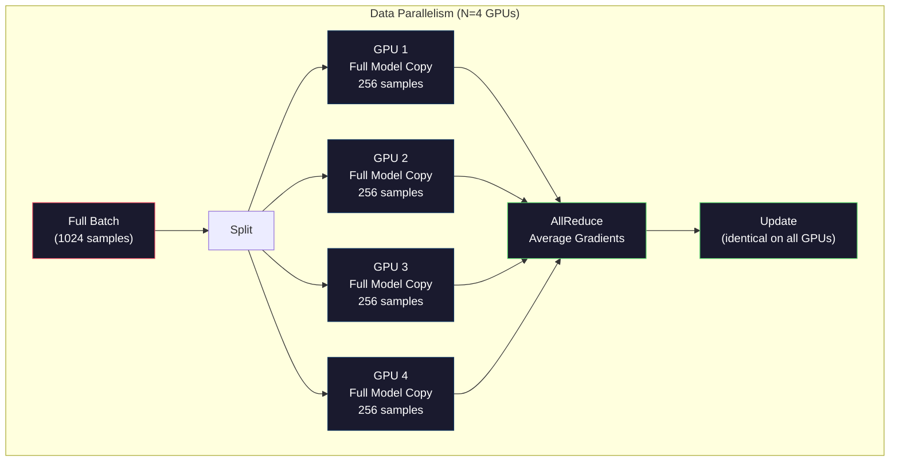
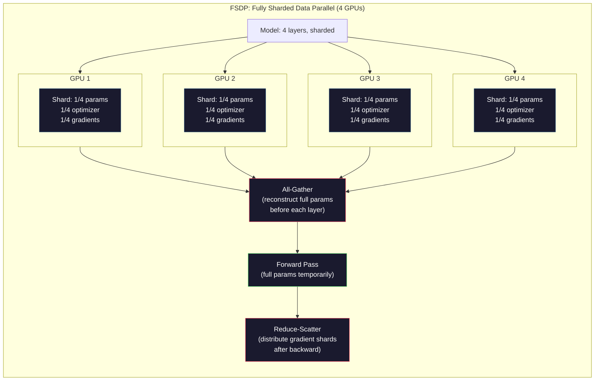
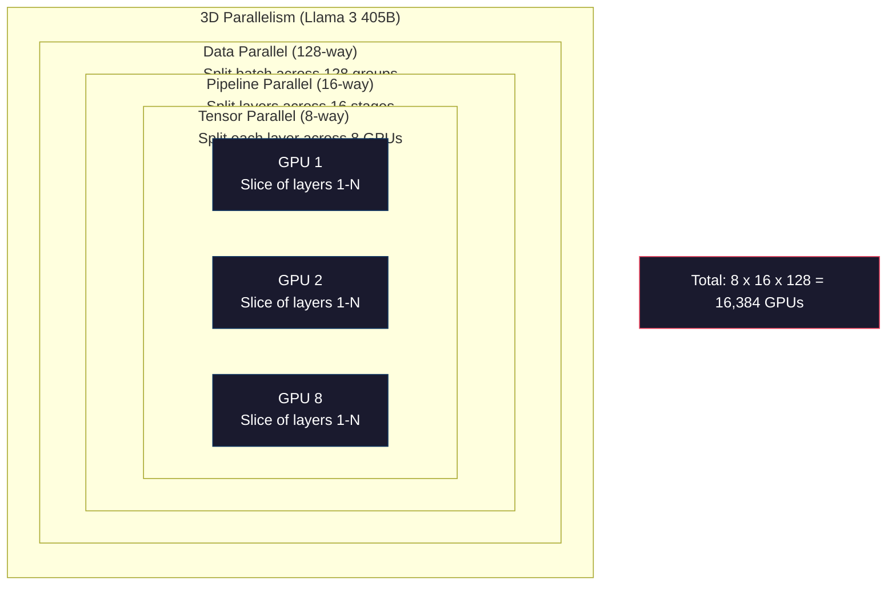

# Escalado: Entrenamiento distribuido, FSDP, DeepSpeed.

> El modelo 124M se entrenó en una GPU. Ahora prueba 7 mil millones de parámetros. El modelo no encaja en la memoria. Los datos tardan semanas en una sola máquina. El entrenamiento distribuido no es opcional a escala. Es el único camino hacia adelante.

> **【中文解读】**1.24 millones de modelos se entrenan en una sola GPU. Pero los modelos de 70 millones de parámetros no entran en forma, y la formación de datos en una sola máquina requiere varias semanas.

> **【拓展：DeepSeek-V3的2048卡训练】**DeepSeek-V3 utiliza 2048 张 H800 GPU  entrenamiento, adopta DualPipe 流水线并行 + MoE 专家并行── comprensión de la formación distribuida es la base de la comprensión de cómo se entrenan los grandes modelos de la vanguardia─

> ¿ Qué es esto ?**【前置】**学本节前请先掌握:Fase 10·04(Pre-Training Mini GPT)单 GPU 训练基础;PyTorch DDP 概念;多 GPU 通信(NCCL、AllReduce)。本节是Fase 10·19(DualPipe) y Fase 10·20(DeepSeek-V3 Walkthrough) 的前置──

**Type:** Build
**Languages:** Python
**Prerequisites:** Phase 10, Lesson 04 (Pre-Training a Mini GPT)
**Time:** ~120 minutes

> ¿ Qué es esto ?**【类比】**Distribución de entrenamiento = 多人合作搬大箱子──**数据并行**(DP) = 4 个人 cada uno se mueve a una misma pequeña caja de datos, resultados TodosReduce la media)**张量并行**(TP) = 4 personas juntos llevan un gran cuadro de cuatro esquinas (TTP)**流水线并行**(PP) = 4 个人流水线,第 1 人搬一层传给第二 人(模型按层切分)**FSDP**= DP + 把模型切片分分到各卡,用时再聚聚合 (省显存) ―― producción escena general 3 组合 (用3D paralelismo) 』

> ️ **【易错点】**3 个坑: 1)**batch size 设错**单卡 bs=8,4 卡应该 bs=32(4×8)而非 bs=8; con tamaño de lote efectivo 计算 lr―(2) **AllReduce 瓶颈**卡间通信比GPU 计算慢10倍,bs 太小会让GPU等通信;bs 至少32+才划算──(3) **没设 seed** Cada vez que se inicia diferente, el resultado es irreproducible;`torch.manual_seed(42) + torch.cuda.manual_seed_all(42)`¿Qué es eso?

## Objetivos de aprendizaje

- Explicar los tres tipos de paralelismo (datos, tensores, tuberías) y cuándo cada uno es necesario en función del modelo y del tamaño del grupo
  解释三种并行类型(数据并行、张量并行、流水线并行) y sus escenarios de aplicación
- Implementar entrenamiento paralelo de datos utilizando PyTorch DDP con sincronización de gradientes en múltiples GPUs
  Utiliza PyTorch DDP  Implementar múltiples GPU datos y hacer entrenamiento y gradiente
- Calcular el presupuesto de memoria para un tamaño determinado del modelo (pesos + estados de optimización + gradientes + activaciones) para determinar el hardware mínimo
  计算给定模型大小的显存预算(权重 + 优化器状态 + 梯度 + 激活值), determinar la necesidad mínima de hardware
- Configurar las etapas de FSDP o DeepSpeed ZeRO para fragmentar los estados del modelo en GPUs y modelos de ajuste que superen la memoria de un solo GPU
  Configurar FSDP o fase de ZeRO de velocidad profunda para el estado del modelo de fragmento, para que el modelo de supercarga de un solo cartón pueda ser entrenado

> **【中文解读】**Este curso se centra en el núcleo de la formación de LLM:显存──7B 模型在FP16 下仅权重就需要14GB,加上亚当 优化器状态(28GB) 和梯度(14GB),总数56GB还没有算激活值──你将学习三种并行策略(数据并行、张量并行、流水线并行) 以及FSDP/ZeRO 分片技术来突破单卡显存限制──

## El problema es la introducción del problema

Un modelo de parámetro 7B en FP16 necesita 14 GB sólo para los pesos. Adam optimizador almacena dos copias adicionales de cada parámetro (estimaciones del primer y segundo momento). Eso es otro 28 GB. Gradientes durante la retropropagación añaden 14 GB más.

> El modelo de 7B 参数在FP16 下仅权重就需要14GB──Adam 优化器为每参数额外存储两副副副本(一阶和二阶矩估算), también necesita 28GB──反向传播的梯度再加14GB──在存储任何激活值之前, usted ya ha alcanzado 56GB──

Un NVIDIA A100 tiene 80 GB de memoria.

> NVIDIA A100 tiene 80 GB de almacenamiento.

56 GB de 80 GB consumidos. Eso deja 24 GB para las activaciones -- los valores intermedios calculados durante el pase hacia adelante que deben mantenerse vivos para la propagación hacia atrás. Para una secuencia de 2048 tokens con un modelo 4096 dimensiones, las activaciones de una sola capa utilizan alrededor de 64 MB. Con 32 capas, necesitas 2 GB por muestra. Un tamaño de lote de 8 necesita 16 GB. Tienes 24 GB. Un tamaño de lote de 12 explotó.

> El 80GB se ha consumido 56GB. El 24GB restante se utiliza para el valor de activación  previo a la difusión  en el cálculo de la mediación, debe ser conservado en la difusión de la difusión  para la secuencia de tokens 2048 y el modelo de dimensiones 4096, el valor de activación de una sola capa es de aproximadamente 64MB.

Ahora prueba los parámetros 70B. Peso solo: 140 GB en FP16. No encaja en una GPU. Necesitas al menos 2 A100s (2 x 80 GB = 160 GB) sólo para sostener los pesos. Agregue estados y gradientes de optimización y necesitarás mucho más: 3+ GPUs mínimo, y realísticamente 8-16 dependiendo de la estrategia de fragmentación.

> Ahora prueba 70B 参数。 sólo peso:FP16 下 140GB。 dejar no entrar en una GPU。 al menos 2 张 A100(2 x 80GB = 160GB) para poder bajar el peso。

El Llama 3 405B fue entrenado en 16.384 GPUs NVIDIA H100.$100 million in compute. DeepSeek V3 trained a comparable model for roughly $5,6 millones de personas por ser inteligentes con la arquitectura (Mixture of Experts significa que sólo una fracción de parámetros se activan por token) y la eficiencia de la formación.

> Llama 3 405B en 16.384 张 NVIDIA H100 GPU en el entrenamiento, el costo de cálculo se estima en aproximadamente 1 mil millones de dólares.

Esta lección cubre las cuatro estrategias que hacen posible el entrenamiento a gran escala: paralelismo de datos, paralelismo tensor, paralelismo de tuberías y paralelismo de datos completamente fragmentados. Simula cada uno en Python puro para entender la mecánica antes de tocar un marco de entrenamiento distribuido.

> Este curso abarca cuatro estrategias de capacitación a gran escala: datos y movimientos, cantidades y movimientos, flujos y movimientos de datos completos.

## El concepto central.

### Por qué se requiere la distribución

Aquí está la matemática de la memoria para modelos reales. Cada número se calcula, no se estima.

> Estas son las cifras de cálculo matemático de los modelos reales. Cada número es calculado, no una estimación.

| Model | Params | Weights (FP16) | Adam States | Gradients (FP16) | Total (no activations) |
|-------|--------|----------------|-------------|------------------|----------------------|
| GPT-2 Small | 124M | 248 MB | 992 MB | 248 MB | 1.5 GB |
| Llama 3 8B | 8B | 16 GB | 64 GB | 16 GB | 96 GB |
| Llama 3 70B | 70B | 140 GB | 560 GB | 140 GB | 840 GB |
| Llama 3 405B | 405B | 810 GB | 3,240 GB | 810 GB | 4,860 GB |

La columna "Estados de Adam" es el asesino. Adam almacena una media en ejecución (m) y una varianza en ejecución (v) para cada parámetro, tanto en FP32. Para un modelo 70B, es 70B x 4 bytes x 2 = 560GB. El optimizador solo necesita siete A100.

> "Adán  estado"列是致命的──Adán para cada parámetro de almacenamiento un ejecutivo promedio(m) y un ejecutivo diferencial(v), son FP32──Para el modelo 70B, es decir, 70B x 4 字节 x 2 = 560GB── sólo se necesita un optimizador en 7张 A100──

Un H100 tiene 80 GB. Llama 3 405B necesita al menos 61 H100s para mantener los pesos, el optimizador y los gradientes. Agregar activaciones y el número crece aún más. Meta usó 16.384 GPUs no porque querían - porque tenían que hacerlo.

> 单张H100 有80GB──Llama 3 405B 至少需要61张H100来放置权重、优化器和梯度──加上激活值数字更大──Meta Utiliza 16,384张GPU 不是因为他们想而是因为他们必须──

> **【中文解读】**显存预算是LLM 训练的第一道关卡──以 Llama 3 70B为例:FP16 权重140GB + Adam 优化器状态 560GB + 梯度 140GB = 840GB(没有激活值)──单张H100 只有80GB,至少需要11张GPU才能放下这些状态──Llama 3 405B 的总需求高达4,860GB──Adam 优化器是显存杀手它为每个参数存储两个 FP32 的动量估计节m(和 v),参数 x 8 字 x 2──

> **【拓展：Llama 3 的 16384 GPU 训练】**Llama 3 405B en 16,384 张 H100 GPU en el entrenamiento, utilizó 3D并行(data并行 + 张量并行 + 流水线并行) ⋅ entrenamiento costo total estimado de aproximadamente 1 mil millones de dólares.

### Paralelamente de datos

La estrategia distribuida más simple. Copie todo el modelo a N GPUs. Divida cada lote de entrenamiento en N partes iguales. Cada GPU ejecuta un pase hacia adelante y hacia atrás en su fragmento de datos. Después del pase hacia atrás, promedia los gradientes en todas las GPUs. Cada GPU actualiza su copia de los pesos con los mismos gradientes promedio, manteniendo todas las copias en sincronía.

> La estrategia más simple de distribución es: reducir el modelo completo a N 张 GPU. Dividir cada entrenamiento en N 等份.

**The good:**Escalación de rendimiento lineal. N GPUs procesan N veces más datos por paso. La comunicación se limita a la media de gradientes, que se superpone con el cálculo.

> **优点：**吞吐量线性扩展──N 张 GPU Cada paso procesa N 倍的数据──通信仅限于梯度平均,可与计算重叠──

**The bad:**Cada GPU tiene una copia completa del modelo, estados de optimización y gradientes. Para un modelo 70B, cada GPU necesita 840 GB. El paralelismo de datos no reduce nada la memoria por GPU.

> **缺点：**Cada GPU  tiene un modelo                                                                                                                                                                                                                                                            

**The math:**Tamaño de lote efectivo = por_gpu_batch_size x N. Para N=64 GPUs con un lote por GPU de 16, el lote efectivo es de 1.024. Llama 3 utilizó un tamaño de lote efectivo de 16 millones de tokens por paso.

> **数学：**Para N = 64 张 GPU, por GPU 批量 16,有效批量为 1,024──Llama 3 使用每步16000000代币的有效批量──



### Paralelas tensoras

Se dividen capas individuales entre las GPU. Una sola multiplicación de matriz se divide entre las GPU, cada computadora parte del resultado.

> Se divide una sola capa en varias GPUs. Una vez se distribuye la matriz multiplicada en varias GPUs.

Considere una matriz de peso de forma (8192, 8192) en una capa de retroalimentación. Con un paralelismo tensor de 4 vías, cada GPU tiene un fragmento (8192, 2048). Cada GPU multiplica la entrada por su fragmento, produciendo un resultado parcial. Los resultados parciales se combinan (a través de todo-reducir o todo-recolectar) para producir la salida completa.

> 考虑前层中形状为 (8192, 8192) 的权重矩阵──使用4路张量并行,每张GPU 持有 (8192, 2048) 的分片──每张GPU 将输入乘以其分片,产生部分结果──部分结果通过全归约或全收集组合为完整输出──

**The good:**Reducir la memoria por GPU para los pesos del modelo. Un modelo 70B dividido en 8 GPU significa que cada GPU tiene pesos de ~ 8.75B parámetros.

> **优点：** Reducir el peso del modelo por GPU 显存──70B 模型 分割到8 张 GPU significa que cada GPU 持有约8.75B 参数权──

**The bad:**Requiere una comunicación rápida entre GPUs después de cada capa. El todo-reducir después de cada matmul agrega latencia. Esto funciona bien con NVLink (900 GB / s entre GPUs en el mismo nodo) pero mal entre nodos conectados por InfiniBand (400 Gb / s, aproximadamente 50 GB / s). El paralelismo de tensor casi siempre se limita a dentro de un solo nodo (8 GPUs).

> **缺点：**Cada nivel necesita GPU 间通信── cada matriz multiplicada por tiempo. El total de la red de conexión aumenta con el tiempo. Esto es muy bueno en NVLink, pero en InfiniBand, 400 Gb/s, aproximadamente 50 GB/s, el tamaño de la conexión es casi siempre limitado a un solo punto.

**Real usage:**Megatron-LM fue pionero en el paralelismo tensorial. Llama 3 405B utiliza el paralelismo tensorial de 8 vías dentro de cada nodo.

> **实际使用：**Megatron-LM  pioneira propuso la cantidad de piezas de piezas de piezas de piezas de piezas de piezas de piezas de piezas de piezas de piezas de piezas de piezas de piezas de piezas de piezas de piezas de piezas de piezas de piezas de piezas de piezas de piezas de piezas de piezas de piezas de piezas de piezas de piezas de piezas de piezas de piezas de piezas de piezas de piezas de piezas de piezas de piezas de piezas de piezas de piezas de piezas de piezas de piezas de piezas de piezas de piezas de piezas de piezas de piezas de piezas de piezas de piezas de piezas de piezas de piezas de piezas de piezas de piezas de piezas de piezas de piezas de piezas de piezas de piezas de piezas de piezas de piezas de piezas de piezas de piezas de piezas de piezas de piezas de piezas de piezas de piezas de piezas de piezas de piezas de piezas de piezas de piezas de piezas de piezas de piezas de piezas de piezas de piezas de piezas de piezas de piezas de piezas de piezas de piezas de piezas de piezas de piezas de piezas de piezas de piezas de piezas de piezas de piezas de piezas de piezas de piezas de piezas de piezas de piezas de piezas de piezas de piezas de piezas de piezas de piezas de piezas de piezas de piezas de piezas de piezas de piezas de piezas de piezas de piezas de piezas de piezas de piezas de piezas de piezas de piezas de piezas de piezas de piezas de piezas de piezas de piezas de piezas de piezas de piezas de piezas de piezas de piezas de piezas de piezas de piezas de piezas de piezas de piezas de piezas de piezas de piezas de piezas de piezas de piezas de piezas de piezas de piezas de piezas de piezas de piezas de piezas de piezas de piezas de piezas de piezas de pie

> **【中文解读】**张量并行 (tensor paralelismo) se dividirá la matriz de un solo nivel en múltiples GPUs. Por ejemplo, una (8192, 8192) de la matriz de peso está en 4 路并行 (también llamada GPU), pero la falta es que cada nivel necesita almacenamiento (8192, 2048) de comunicación, por lo que casi se limita a la conexión de NVLink 单节内 (también llamada GPU) ↓ ↓ ↓ ↓ ↓ ↓ ↓ ↓ ↓ ↓ ↓ ↓ ↓ ↓ ↓ ↓ ↓ ↓ ↓ ↓ ↓ ↓ ↓ ↓ ↓ ↓ ↓ ↓ ↓ ↓ ↓ ↓ ↓ ↓ ↓ ↓ ↓ ↓ ↓ ↓ ↓ ↓ ↓ ↓ ↓ ↓ ↓ ↓ ↓ ↓ ↓ ↓ ↓ ↓ ↓ ↓ ↓ ↓ ↓ ↓ ↓ ↓ ↓ ↓ ↓ ↓ ↓ ↓ ↓ ↓ ↓ ↓ ↓ ↓ ↓ ↓ ↓ ↓ ↓ ↓ ↓ ↓ ↓ ↓ ↓ ↓ ↓ ↓ ↓ ↓ ↓ ↓ ↓ ↓ ↓ ↓ ↓ ↓ ↓ ↓ ↓ ↓ ↓ ↓ ↓ ↓ ↓ ↓ ↓ ↓ ↓ ↓ ↓ ↓ ↓ ↓ ↓ ↓ ↓ ↓ ↓ ↓ ↓ ↓ ↓ ↓ ↓ ↓ ↓ ↓ ↓ ↓ ↓ ↓ ↓ ↓ ↓ ↓ ↓ ↓ ↓ ↓ ↓ ↓ ↓ ↓ ↓ ↓ ↓ ↓ ↓ ↓ ↓ ↓ ↓ ↓ ↓ ↓ ↓ ↓ ↓ ↓ ↓ ↓ ↓ ↓ ↓ ↓ ↓ ↓ ↓ ↓ ↓ ↓ ↓ ↓ ↓ ↓ ↓ ↓ ↓ ↓ ↓ ↓ ↓ ↓ ↓ ↓ ↓ ↓ ↓ ↓ ↓ ↓ ↓ ↓ ↓ ↓ ↓ ↓ ↓ ↓ ↓ ↓ ↓ ↓ ↓

> **【拓展：流水线并行的气泡问题】**流水线并行将模型按层分分分到不同 GPUs (como GPU1 跑 1-8层, GPU2 跑 9-16层) 但会产生"气泡"GPU空等.

### Paralelamente de las tuberías

Divide el modelo por capas. GPU 1 ejecuta capas 1-8. GPU 2 ejecuta capas 9-16. GPU 3 ejecuta capas 17-24. GPU 4 ejecuta capas 25-32. Los datos fluyen a través del tubo: GPU 1 calcula sus capas y envía activaciones a GPU 2, que calcula sus capas y envía a GPU 3, y así sucesivamente.

> 按层拆分模型──GPU 1 跑 1-8层──GPU 2 跑 9-16层──GPU 3 跑 17-24层──GPU 4 跑 25-32层──数据流过流水线:GPU 1 计算其层并将激活值发送给 GPU 2,GPU 2 计算其层并发送给 GPU 3,以此类推──

**The good:**La comunicación mínima entre las GPUs, solo las activaciones en los límites de capas, que son pequeñas en comparación con los gradientes o pesos. Funciona a través de los nodos porque los requisitos de ancho de banda son bajos.

> **优点：**La GPU 间通信最小 sólo tiene un valor de activación de la capa límite, muy pequeño en comparación con la gradiente o el peso.

**The bad:**Cuando la GPU 4 está calculando el paso hacia adelante en micro-batch 1, las GPU 1, 2 y 3 están inactivas (ya han reenviado su parte). Durante el paso hacia atrás, el patrón se invierte.

> **缺点：**流水线气泡── Cuando la GPU 4 en el cálculo de la primera generación de la pequeña batida 1, la GPU 1、2、3 空(han completado su propia parte)──反向传播时模式相反──朴素流水线下, N 个阶段 GPU utilization rate is only 1/N──

**GPipe and PipeDream**Resolver el problema de la burbuja dividiendo el lote en micro-parches. GPU 1 comienza en micro-parches 2 tan pronto como termina de reenviar el micro-parche 1. Esto superpone el cálculo a través de las etapas de la tubería. Con micro-parches M y N etapas, la fracción de burbuja cae a (N-1) / M. Utilice M=16 micro-parches con N=4 etapas y la burbuja es 3/16 = 18.75% tiempo inactivo.

> **GPipe 和 PipeDream**通過將批次分分成微批次來解決氣泡問題──GPU 1 一完成微批次 1 的前向传播就開始微批次 2──這在流水线阶段间重叠计算──M 个微批次和N 个阶段,氣泡比例降至 (N-1) /M──使用M=16 个微批次和N=4 个阶段,氣泡为3/16 = 18.75% 空时间──

### FSDP: Datos totalmente fragmentados paralelamente

FSDP combina la escalabilidad del paralelismo de datos con la eficiencia de la memoria del sharding. En lugar de que cada GPU tenga una copia completa del modelo, cada GPU tiene solo 1/N de los parámetros, gradientes y estados de optimizador.

> FSDP combina la expansibilidad y la eficiencia de almacenamiento de las piezas de la parrilla de datos. Cada GPU no posee una copia completa del modelo, sino que solo posee un parámetro, gradiente y estado de optimizador de 1/N.

Antes de que una capa pase hacia adelante, el FSDP ejecuta un **all-gather**Para recopilar los parámetros completos de todas las GPU en la memoria de cada GPU. Después del pase hacia adelante, cada GPU descarta los parámetros no locales. Durante el regreso, el conjunto se ejecuta nuevamente para reconstruir los parámetros para el cálculo de gradientes.**reduce-scatter**distribuye los fragmentos de gradientes para que cada GPU sólo almacene 1/N de los gradientes.

> Antes de la transmisión de un nivel, FSDP ejecuta la operación de recopilación completa desde todas las GPUs  recopilar los parámetros completos hasta el almacenamiento de cada GPU. Después de la transmisión anterior, cada GPU deja los parámetros no locales.

**The math for a 70B model on 8 GPUs:**

| Component | Without FSDP | With FSDP |
|-----------|-------------|-----------|
| Weights (FP16) | 140 GB per GPU | 17.5 GB per GPU |
| Adam States (FP32) | 560 GB per GPU | 70 GB per GPU |
| Gradients (FP16) | 140 GB per GPU | 17.5 GB per GPU |
| **Total** | **840 GB per GPU** | **105 GB per GPU** |

Sin FSDP, no se puede instalar un modelo 70B en una sola GPU de 80 GB. Con FSDP en 8 GPU, cada GPU utiliza 105 GB - espera, eso todavía no encaja. Necesitas al menos 16 GPU para llegar a menos de 80 GB por GPU, o se combina FSDP con control de activación (recomputo de activaciones durante retroactivación en lugar de almacenarlas).

> 没有FSDP,70B 模型不能放入单张80GB GPU──使用FSDP在8张 GPU上,每张 GPU使用105GB等等,还是放不下──你需要至少16张 GPU 才能降至每卡80GB以下,或将FSDP与激活检查点结合(反向传播时重新计算激活值而不是存储它们)──

El costo de comunicación es mayor que el paralelismo de datos de vainilla debido a la recolección de todo antes de cada capa. Pero los ahorros de memoria hacen posibles las carreras de entrenamiento previamente imposibles.

>  El coste de la comunicación es mayor que el de la corriente de datos ordinaria, ya que cada nivel necesita una recopilación completa antes.

> **【中文解读】**FSDP(completamente distribuido de datos) es la combinación de datos y distribuciones de datos. Cada GPU sólo almacena los parámetros 1/N de la gradiencia y el estado de la optimizadora.

> **【拓展：DeepSpeed ZeRO 的三个阶段】**ZeRO Etapa 1 分片优化器状态(省 4x 显存),Etapia 2 加上梯度分片(省 8x),Etapia 3 加上参数分片(省 N 倍,N 为 GPU 数) ・FSDP 本质上是 ZeRO Etapa 3 的 PyTorch 原生实现──Llama 3 405B 的 16,384 GPU 训练使用了FSDP + 张量并行 + 流水线并行的3D组合──



### Profundidad de la velocidad

El ZeRO de DeepSpeed (Zero Redundancy Optimizer) es conceptualmente idéntico al FSDP pero fue desarrollado de forma independiente por Microsoft.

> ZeRO de DeepSpeed (零冗余优化器) es conceptualmente similar al FSDP, pero desarrollado por Microsoft independientemente.

| Stage | Shards | Memory Savings | Communication |
|-------|--------|---------------|---------------|
| ZeRO-1 | Optimizer states only | ~4x reduction | Same as data parallel |
| ZeRO-2 | + Gradients | ~8x reduction | Slightly more |
| ZeRO-3 | + Parameters | ~Nx reduction (N GPUs) | All-gather per layer |

ZeRO-3 es equivalente a FSDP. El nombre es diferente, el mecanismo es el mismo. PyTorch agregó FSDP como una implementación nativa después de que DeepSpeed probara el concepto.

> ZeRO-3 es igual a FSDP. El nombre es diferente, el mecanismo es el mismo.

DeepSpeed también introdujo ZeRO-Offload (estados de optimización de descarga en la RAM de la CPU, que es más barato y más grande) y ZeRO-Infinity (carga en SSD NVMe). Estas velocidades de cálculo de la capacidad de memoria - las operaciones descargadas son más lentas pero liberan memoria de la GPU.

> DeepSpeed también introdujo ZeRO-Offload (la mejor versión de un dispositivo optimizado) para descargarse en la memoria de CPU, más barato e incluso más grande) y ZeRO-Infinity (la descarga en el SSD NVMe) (la descarga en la memoria de un dispositivo de almacenamiento de memoria de memoria de memoria de memoria de memoria de memoria de memoria de memoria de memoria de memoria de memoria de memoria de memoria de memoria de memoria de memoria de memoria de memoria de memoria de memoria de memoria de memoria de memoria de memoria de memoria de memoria de memoria de memoria de memoria de memoria de memoria de memoria de memoria de memoria de memoria de memoria de memoria de memoria de memoria de memoria de memoria de memoria de memoria de memoria de memoria de memoria de memoria de memoria de memoria de memoria de memoria de memoria de memoria de memoria de memoria de memoria de memoria de memoria de memoria de memoria de memoria de memoria de memoria de memoria de memoria de memoria de memoria de memoria de memoria de memoria de memoria de memoria de memoria de memoria de memoria de memoria de memoria de memoria de memoria de memoria de memoria de memoria de memoria de memoria de memoria de memoria de memoria de memoria de memoria de memoria de memoria de memoria de memoria de memoria de memoria de memoria de memoria de memoria de memoria de memoria de memoria de memoria de memoria de memoria de memoria de memoria de memoria de memoria de memoria de memoria de memoria de memoria de memoria de memoria de memoria de memoria de memoria de memoria de memoria de memoria de memoria de memoria de memoria de memoria de memoria de memoria de memoria de memoria de memoria de memoria de memoria de memoria de memoria de memoria de memoria de memoria de memoria de memoria de memoria de memoria de memoria de memoria de memoria de memoria de memoria de memoria de memoria de memoria de memoria de memoria de memoria de memoria de memoria de memoria de memoria de memoria de memoria de memoria de memoria de memoria de memoria de memoria de memoria de memoria de memoria de memoria de memoria de memoria de memoria de memoria de memoria de memoria de memoria de memoria de memoria de memoria de memoria de memoria de memoria de memoria de memoria de memoria de memoria de memoria de memoria de memoria de memoria de memoria de memoria de memoria de memoria de memoria de memoria de memoria de memoria de memoria de memoria de memoria de memoria de memoria de memoria de memoria de memoria de memoria de memoria de memoria de memoria de memoria de memoria de memoria de memoria de memoria de memoria de memoria de memoria de memoria de memoria de memoria de memoria de memoria de

### Formación de precisión mixta

El entrenamiento moderno utiliza múltiples formatos de puntos flotantes simultáneamente:

> 现代训练同时使用多种浮点格式:

- **Forward pass**La memoria de los matmuls es dos veces más rápida en los núcleos tensores.
- **Master weights**: FP32 (32 bits). Mantido por el optimizador para la precisión numérica durante las actualizaciones de peso.
- **Loss scaling**: Multiplicar la pérdida por una constante grande antes de pasar hacia atrás para evitar que los gradientes FP16 fluyan hacia abajo a cero. Dividir por la misma constante antes del paso de optimización.

BF16 (Brain Float 16) tiene el mismo rango de exponentes que FP32 (8 bits de exponente) pero con una precisión reducida (7 bits de mantissa frente a FP32's 23). Rara vez necesita escala de pérdida porque puede representar el mismo rango de valores. FP16 tiene 5 bits de exponente y 10 bits de mantissa - puede representar valores de grano fino pero sobreflui/bajo a magnitudes extremas.

Los TPU de Google utilizan BF16 nativo. Los A100 y H100 de NVIDIA admiten tanto FP16 como BF16. La industria se ha mudado en gran medida a BF16 porque elimina los dolores de cabeza de pérdida.

> **【中文解读】**混合精度训练是现代 LLM 训练的标准做法:前向传播用 BF16(16 位),优化器维护 FP32 主权重(32 位),损失缩放防止梯度下溢──BF16 tiene el mismo índice de alcance que FP32 八位), pero la precisión disminuye(7位尾数 vs 23 位), casi no necesita pérdida de tamaño reducción──业界 ya ha pasado de FP16 a BF16 全面显度──混合精为 7B 模型节省约28GB ∼

> **【拓展：3D 并行与 MoE 的经济性】**Llama 3 405B utiliza 3D y línea:节点间数据并行 + 节点内 8 路张量并行 + 节点流水线并行。DeepSeek-V3 则使用 MoE(混合专家) arquitectura reducción de costos por primera vez hacia la difusión sólo activa alrededor de 37B 参数(总参数 671B), el costo de entrenamiento es de sólo alrededor de 560 millones de dólares, es 1/18 de Llama 3

**Memory comparison for a 7B model:**

| Precision | Weights | Optimizer | Gradients | Total |
|-----------|---------|-----------|-----------|-------|
| FP32 everywhere | 28 GB | 56 GB | 28 GB | 112 GB |
| Mixed (BF16 + FP32 master) | 14 GB | 56 GB | 14 GB | 84 GB |

La precisión mixta ahorra 28 GB en este modelo. Los estados de optimización permanecen en FP32 sin importar - aquí es donde la mayor parte de la memoria va.

### Megatron-LM y paralelismo 3D

La formación a gran escala combina los tres paralelismos:

- **Data parallelism**en grupos de nodos (tamaño de lote de escala)
- **Tensor parallelism**dentro de un nodo (capas divididas en 8 GPU)
- **Pipeline parallelism**en los nodos (grupos de capas divididos en máquinas)

Llama 3 405B en 16.384 H100s:
- Paralelo de tensores de 8 vías dentro de cada nodo (8 GPU por nodo)
- Paralelo de 16 vías de tuberías entre los nodos (16 etapas de tuberías)
- Paralelo de datos de 128 vías en la dimensión restante (16,384 / 8 / 16 = 128)

Esta descomposición 3D (8 x 16 x 128 = 16,384) es la forma en que se escala a miles de GPUs. Cada GPU ve un fragmento de datos diferente (paralelo de datos), contiene una rebanada de cada capa (paralelo de tensor) y calcula un conjunto diferente de capas (paralelo de tubería).

> Este tipo de 3D de división ((8 x 16 x 128 = 16,384) es el modo en que se expande a miles de GPUs. Cada GPU ve diferentes fragmentos de datos.

DeepSeek V3 adoptó un enfoque diferente. Su arquitectura de Mixture of Experts activa solo 37B de 671B parámetros por token. Esto significa que cada GPU solo necesita calcular (y almacenar activaciones para) los parámetros activos.$5.6M vs Meta's estimated $100 millones.

> DeepSeek V3  adoptó diferentes métodos. Su arquitectura especializada mixta para cada token sólo activa 671B parámetros 37B  Esto significa que cada GPU sólo necesita calcular                                                                                                                                                                                                                                          



## Construye y realiza.
```figure
paged-kv-cache
```

## Construye el mismo

### Paso 1: Simulación de la paralela de datos

Divide un lote entre GPUs simuladas. Cada GPU calcula un pase hacia adelante en su fragmento.

> Se dividirá el lote en GPUs simuladas.

```python
import numpy as np

def simulate_data_parallelism(data, num_gpus, model_fn):
    batch_size = len(data)
    shard_size = batch_size // num_gpus
    remainder = batch_size % num_gpus

    gpu_losses = []
    gpu_gradients = []

    offset = 0
    for gpu_id in range(num_gpus):
        extra = 1 if gpu_id < remainder else 0
        shard = data[offset:offset + shard_size + extra]
        offset += shard_size + extra

        loss, grad = model_fn(shard)
        gpu_losses.append(loss)
        gpu_gradients.append(grad)

    avg_loss = np.mean(gpu_losses)
    avg_gradient = np.mean(gpu_gradients, axis=0)

    return avg_loss, avg_gradient
```

La operación de reducción total (gradientes promedio) es la única comunicación en el paralelismo de datos. En la práctica, esto utiliza la biblioteca NCCL en las GPU de NVIDIA, que implementa el anillo todo-reducir: cada GPU envía 1/N de sus gradientes a su vecino, recibe 1/N del otro vecino, y después de N-1 pasos cada GPU tiene el promedio completo. Volumen total de comunicación: 2 x gradiente_tamaño x (N-1)/N, cerca de 2 veces el tamaño del gradiente para N grande.

> La operación de red de datos es la única comunicación en la línea de datos. En la práctica, esta se utiliza NCCL 库 de GPU NVIDIA, logró una red de red de red: cada GPU enviará 1/N de la red de red a su vecino, recibiendo 1/N de otro vecino, N-1 步后每张 GPU都有完整的平均值.

### Paso 2: Simula el paralelismo de tensión

Divide una matriz de peso entre las GPUs. Cada GPU calcula una multiplicación parcial de matriz. Combine los resultados.

> Se puede calcular el peso de la matriz en un número de GPUs.

```python
def simulate_tensor_parallelism(input_data, weight_matrix, num_gpus):
    d_in, d_out = weight_matrix.shape
    assert d_out % num_gpus == 0, f"d_out {d_out} not divisible by num_gpus {num_gpus}"
    shard_size = d_out // num_gpus

    partial_results = []
    for gpu_id in range(num_gpus):
        start = gpu_id * shard_size
        end = start + shard_size
        weight_shard = weight_matrix[:, start:end]

        partial = input_data @ weight_shard
        partial_results.append(partial)

    full_output = np.concatenate(partial_results, axis=-1)

    direct_output = input_data @ weight_matrix
    error = np.abs(full_output - direct_output).max()

    return full_output, error
```

El error debe ser exactamente cero (o epsilon de máquina). El paralelismo de tensores es matemáticamente exacto - produce el mismo resultado que calcular el matmul completo en una GPU. La división está a lo largo de la dimensión de salida, por lo que cada GPU produce un pedazo diferente de columnas, y la concatenation reconstruye el resultado completo.

> 误差应恰好为零(或机器epsilon) ――张量并行在数学上是精确的它产生与在一张GPU上计算完整矩阵乘法相同的结果──分拆沿输出维度进行,每张GPU 产生不同的列块,拼接重建完整结果──

Para las capas lineares paralelas de columna (dividir la dimensión de salida), se concatenan. Para las capas lineares (dividir la dimensión de entrada), se suma. En un transformador FFN, la primera linear (expandir) utiliza la columna paralela y la segunda linear (contrato) usa la línea paralela. Esto evita una reducción total entre las dos capas.

> 对于行并行线性层(拆分输出维度),你拼接──对于行并行(拆分输入维度),你求和──En el transformador FFN, la primera línea 扩展) utiliza la línea并行, la segunda línea 收缩) utiliza la行并行── esto evita la regroupment entre las dos capas──

### Paso 3: Simula el paralelismo de las tuberías

Divide las capas de un modelo en GPU virtuales. Muestre el problema de burbuja donde las primeras etapas se sientan ociosas mientras las etapas posteriores computación.

> Desglosar la capa del modelo en GPU virtual para mostrar las burbujas de la fase inicial y la fase posterior del cálculo.

```python
def simulate_pipeline_parallelism(num_layers, num_stages, num_microbatches):
    layers_per_stage = num_layers // num_stages

    timeline = {}
    clock = 0

    for mb in range(num_microbatches):
        for stage in range(num_stages):
            start_time = max(
                timeline.get((stage, mb - 1, "fwd"), (0, 0))[1] if mb > 0 else 0,
                timeline.get((stage - 1, mb, "fwd"), (0, 0))[1] if stage > 0 else 0,
            )
            end_time = start_time + layers_per_stage
            timeline[(stage, mb, "fwd")] = (start_time, end_time)

    last_fwd_end = max(v[1] for v in timeline.values())

    for mb in range(num_microbatches - 1, -1, -1):
        for stage in range(num_stages - 1, -1, -1):
            deps = [last_fwd_end]
            if mb < num_microbatches - 1 and (stage, mb + 1, "bwd") in timeline:
                deps.append(timeline[(stage, mb + 1, "bwd")][1])
            if stage < num_stages - 1 and (stage + 1, mb, "bwd") in timeline:
                deps.append(timeline[(stage + 1, mb, "bwd")][1])
            start_time = max(deps)
            end_time = start_time + layers_per_stage
            timeline[(stage, mb, "bwd")] = (start_time, end_time)

    total_time = max(v[1] for v in timeline.values())
    compute_time = num_microbatches * num_stages * layers_per_stage * 2
    bubble_fraction = 1.0 - compute_time / (total_time * num_stages)

    return timeline, total_time, bubble_fraction
```

Con 4 etapas y 1 micro-batch, la fracción de burbujas es del 75% - tres de cada cuatro GPUs están inactivos en cualquier momento. Con 16 micro-batches, cae a aproximadamente el 19%. El costo de eliminar burbujas es memoria: debes almacenar las activaciones de todos los micro-batches en vuelo simultáneamente.

> 4 etapas y 1 micro-grupo, la proporción de burbujas es del 75%  Cuartos de cada GPU  16 micro-grupo                                                                                                                                                                                                                                              

### Paso 4: Calculador de memoria

Calcule los requisitos exactos de memoria para entrenar cualquier tamaño de modelo.

> 计算训练任意模型大小的精确显存需求──

```python
def memory_calculator(
    params_billions,
    precision_bytes=2,
    optimizer="adam",
    num_gpus=1,
    sharding="none",
    sequence_length=2048,
    batch_size_per_gpu=1,
    hidden_dim=None,
    num_layers=None,
):
    params = params_billions * 1e9

    weight_memory = params * precision_bytes

    if optimizer == "adam":
        optimizer_memory = params * 4 * 2
    elif optimizer == "sgd":
        optimizer_memory = params * 4
    else:
        optimizer_memory = 0

    gradient_memory = params * precision_bytes

    total_no_activation = weight_memory + optimizer_memory + gradient_memory

    if hidden_dim and num_layers:
        activation_per_layer = (
            sequence_length * batch_size_per_gpu * hidden_dim * precision_bytes * 4
        )
        activation_memory = activation_per_layer * num_layers
    else:
        activation_memory = params * precision_bytes * 0.5

    if sharding == "fsdp" or sharding == "zero3":
        weight_memory /= num_gpus
        optimizer_memory /= num_gpus
        gradient_memory /= num_gpus
    elif sharding == "zero2":
        optimizer_memory /= num_gpus
        gradient_memory /= num_gpus
    elif sharding == "zero1":
        optimizer_memory /= num_gpus

    per_gpu_total = weight_memory + optimizer_memory + gradient_memory + activation_memory

    return {
        "params_billions": params_billions,
        "weights_gb": weight_memory / 1e9,
        "optimizer_gb": optimizer_memory / 1e9,
        "gradients_gb": gradient_memory / 1e9,
        "activations_gb": activation_memory / 1e9,
        "per_gpu_total_gb": per_gpu_total / 1e9,
        "total_across_gpus_gb": per_gpu_total * num_gpus / 1e9,
        "fits_on_80gb": per_gpu_total / 1e9 <= 80,
        "num_gpus": num_gpus,
        "sharding": sharding,
    }
```

Esta calculadora responde a la pregunta que cada ingeniero de ML hace: "¿Cuántas GPU necesito?" Entra el tamaño del modelo y ve si encaja. Ajusta la estrategia de fragmentación hasta que el total por GPU caiga por debajo de 80 GB.

> Este calculador responde a cada pregunta del ingeniero de ML: "¿Cuánto GPU necesito?"

### Paso 5: Simulación de precisión mixta

Comparar el uso de memoria entre FP32, FP16 y entrenamiento de precisión mixta.

```python
def mixed_precision_comparison(params_billions):
    params = params_billions * 1e9

    fp32_weights = params * 4
    fp32_optimizer = params * 4 * 2
    fp32_gradients = params * 4
    fp32_total = fp32_weights + fp32_optimizer + fp32_gradients

    fp16_weights = params * 2
    fp16_master = params * 4
    fp16_optimizer = params * 4 * 2
    fp16_gradients = params * 2
    fp16_total = fp16_weights + fp16_master + fp16_optimizer + fp16_gradients

    mixed_weights = params * 2
    mixed_optimizer = params * 4 * 2
    mixed_gradients = params * 2
    mixed_total = mixed_weights + mixed_optimizer + mixed_gradients

    return {
        "fp32_total_gb": fp32_total / 1e9,
        "fp16_with_master_gb": fp16_total / 1e9,
        "mixed_bf16_gb": mixed_total / 1e9,
        "savings_vs_fp32": 1 - mixed_total / fp32_total,
    }
```

La mayor sorpresa para la mayoría de las personas: la precisión mixta no reduce a la mitad la memoria. Los estados del optimizador (m y v de Adam) permanecen en FP32 independientemente de la precisión. Para un modelo 7B, el entrenamiento de FP32 utiliza 112GB.

> Para la mayoría de las personas, la mayor sorpresa es que la precisión mezclada no se reducirá a la mitad en el estado de la máquina de optimización.

## Usalo con el marco de ejecución

### Ejecutar todas las simulaciones

```python
def run_all_demos():
    print("=" * 70)
    print("DATA PARALLELISM SIMULATION")
    print("=" * 70)

    np.random.seed(42)
    data = np.random.randn(64, 32)
    weight = np.random.randn(32, 16)

    def model_fn(batch):
        output = batch @ weight
        loss = np.mean(output ** 2)
        grad = 2 * batch.T @ (batch @ weight) / len(batch)
        return loss, grad

    for n_gpus in [1, 2, 4, 8]:
        loss, grad = simulate_data_parallelism(data, n_gpus, model_fn)
        print(f"  {n_gpus} GPUs: loss={loss:.4f}, grad_norm={np.linalg.norm(grad):.4f}")

    print()
    print("=" * 70)
    print("TENSOR PARALLELISM SIMULATION")
    print("=" * 70)

    x = np.random.randn(4, 8192)
    W = np.random.randn(8192, 8192)

    for n_gpus in [1, 2, 4, 8]:
        output, error = simulate_tensor_parallelism(x, W, n_gpus)
        print(f"  {n_gpus} GPUs: output_shape={output.shape}, max_error={error:.2e}")

    print()
    print("=" * 70)
    print("PIPELINE PARALLELISM SIMULATION")
    print("=" * 70)

    for n_mb in [1, 4, 8, 16, 32]:
        _, total_t, bubble = simulate_pipeline_parallelism(32, 4, n_mb)
        print(f"  {n_mb:2d} micro-batches: total_time={total_t:4d}, bubble={bubble:.1%}")

    print()
    print("=" * 70)
    print("MEMORY CALCULATOR")
    print("=" * 70)

    configs = [
        (7, "none", 1),
        (7, "fsdp", 8),
        (70, "none", 1),
        (70, "fsdp", 8),
        (70, "fsdp", 16),
        (405, "fsdp", 64),
        (405, "fsdp", 128),
    ]

    print(f"  {'Model':>8} {'Sharding':>8} {'GPUs':>5} {'Per-GPU':>10} {'Fits 80GB':>10}")
    print("  " + "-" * 50)
    for params, shard, gpus in configs:
        result = memory_calculator(params, num_gpus=gpus, sharding=shard)
        fits = "Yes" if result["fits_on_80gb"] else "No"
        print(f"  {params:>6}B {shard:>8} {gpus:>5} {result['per_gpu_total_gb']:>8.1f}GB {fits:>10}")

    print()
    print("=" * 70)
    print("MIXED PRECISION COMPARISON")
    print("=" * 70)

    for params_b in [7, 13, 70, 405]:
        result = mixed_precision_comparison(params_b)
        print(f"  {params_b}B: FP32={result['fp32_total_gb']:.0f}GB, "
              f"Mixed BF16={result['mixed_bf16_gb']:.0f}GB, "
              f"Savings={result['savings_vs_fp32']:.0%}")
```

## Envíe el producto .

Esta lección produce`outputs/prompt-distributed-training-planner.md`-- un prompt que toma un tamaño de modelo y hardware disponible, luego produce un plan de capacitación distribuido completo: estrategia de paralelismo, presupuesto de memoria, gastos generales de comunicación y rendimiento esperado.

## Los ejercicios.

1. Modifique la calculadora de memoria para incluir el control de activación. Con el control, solo almacene las activaciones en cada capa K-th (típica K = 1, lo que significa volver a calcular todo). Muestre la compensación de memoria-computación: ¿cuánto memoria ahorra el control y cuánto ralentiza el entrenamiento (aproximadamente 33% más de computación para el control completo)?

2. Extenda la simulación de paralelismo de tuberías para implementar el horario 1F1B (uno hacia adelante, uno hacia atrás) utilizado por PipeDream. Compara la fracción de burbuja con el horario ingenuo para 4 etapas y 8 micro-batches. El horario 1F1B debe tener una memoria de pico más pequeña porque comienza hacia atrás pasa antes.

3. Implemente un simulador de acumulación de gradientes. En lugar de reducir todos los gradientes después de cada micro lote, acumula los gradientes localmente para los pasos K, luego reduce todos. Muestre cómo esto reduce la comunicación por K veces pero produce los mismos gradientes finales (y por lo tanto el mismo entrenamiento).

4. Construir un estimador de costos. Dado el tamaño del modelo, el recuento de tokens objetivo, tipo de GPU (A100 en $2/hr, H100 at $El costo total de la formación en dólares se estima en el marco de la estrategia de paralelismo.$100M, DeepSeek V3 cost ~$5,6M.

5. Añadir ZeRO-Offload a la calculadora de memoria. Supongamos que la RAM de la CPU es de 512 GB por nodo y NVMe es de 2 TB. Muestre cómo descargar los estados de la optimizadora a la CPU permite que un modelo 70B se entrene en 4 GPU en lugar de 16, a un costo de 30-50% de pasos de optimización más lentos.

## Términos clave .

| Term | What people say | What it actually means | 中文释义 |
|------|----------------|----------------------|---------|
| Data parallelism | "Copy the model to every GPU" | Each GPU processes a different data shard; gradients are averaged via all-reduce after each step | 数据并行，每 GPU 处理不同数据分片，通过 all-reduce 平均梯度 |
| Tensor parallelism | "Split a layer across GPUs" | Partition weight matrices so each GPU computes part of the matmul; requires fast NVLink interconnect | 张量并行，拆分权重矩阵到多 GPU，需要 NVLink 互连 |
| Pipeline parallelism | "Split layers across GPUs" | Each GPU runs a different group of layers; data flows through the pipeline with micro-batches to reduce bubbles | 流水线并行，每 GPU 运行不同层组，用微批次减少气泡 |
| FSDP | "Shard everything" | Fully Sharded Data Parallel -- each GPU holds 1/N of weights, gradients, and optimizer states; all-gather before compute | 完全分片数据并行，每 GPU 持有 1/N 的参数/梯度/优化器状态 |
| ZeRO | "DeepSpeed's version of FSDP" | Zero Redundancy Optimizer with 3 stages: shard optimizer (Stage 1), + gradients (Stage 2), + parameters (Stage 3) | 零冗余优化器，三阶段分片：优化器→梯度→参数 |
| All-reduce | "Average across GPUs" | Collective operation where every GPU ends with the sum (or average) of all GPUs' inputs -- typically implemented as ring all-reduce | 全归约，所有 GPU 最终获得全局总和/均值 |
| All-gather | "Collect from all GPUs" | Collective operation where every GPU ends with the concatenation of all GPUs' data -- used in FSDP to reconstruct full parameters | 全收集，每 GPU 获得所有 GPU 数据的拼接 |
| Reduce-scatter | "Sum and distribute" | Collective operation that reduces (sums) data and scatters different chunks to different GPUs -- used in FSDP for gradient sharding | 归约散射，求和后分发不同块到不同 GPU |
| Mixed precision | "Train in half precision" | Use FP16/BF16 for forward/backward and FP32 for optimizer states -- saves ~25% memory, not 50%, because the optimizer dominates | 混合精度，前向/反向用 16 位，优化器用 32 位，省约 25% 显存 |
| Pipeline bubble | "Idle time in the pipeline" | Fraction of time GPUs sit idle waiting for data from the previous stage -- reduced by using more micro-batches | 流水线气泡，GPU 空闲等待前一阶段数据的比例 |

## Más Leer más Leer más

- [Rajbhandari et al., 2020 -- "ZeRO: Memory Optimizations Toward Training Trillion Parameter Models"](https://arxiv.org/abs/1910.02054)-- el documento de ZeRO de DeepSpeed que definió las tres etapas de fragmentación
- [Shoeybi et al., 2020 -- "Megatron-LM: Training Multi-Billion Parameter Language Models Using Model Parallelism"](https://arxiv.org/abs/1909.08053)-- El paralelismo tensor de NVIDIA para transformadores
- [Narayanan et al., 2021 -- "Efficient Large-Scale Language Model Training on GPU Clusters Using Megatron-LM"](https://arxiv.org/abs/2104.04473)-- Paralelamente 3D que combina datos, tensor y pipeline
- [Zhao et al., 2023 -- "PyTorch FSDP: Experiences on Scaling Fully Sharded Data Parallel"](https://arxiv.org/abs/2304.11277)-- La implementación de FSDP de PyTorch
- [Llama 3 Technical Report](https://arxiv.org/abs/2407.21783)-- 16.384 GPU entrenamiento con detalles de paralelismo 3D
- [DeepSeek-V3 Technical Report](https://arxiv.org/abs/2412.19437)-- cómo la arquitectura de la MoE reduce el costo de la formación en un orden de magnitud
