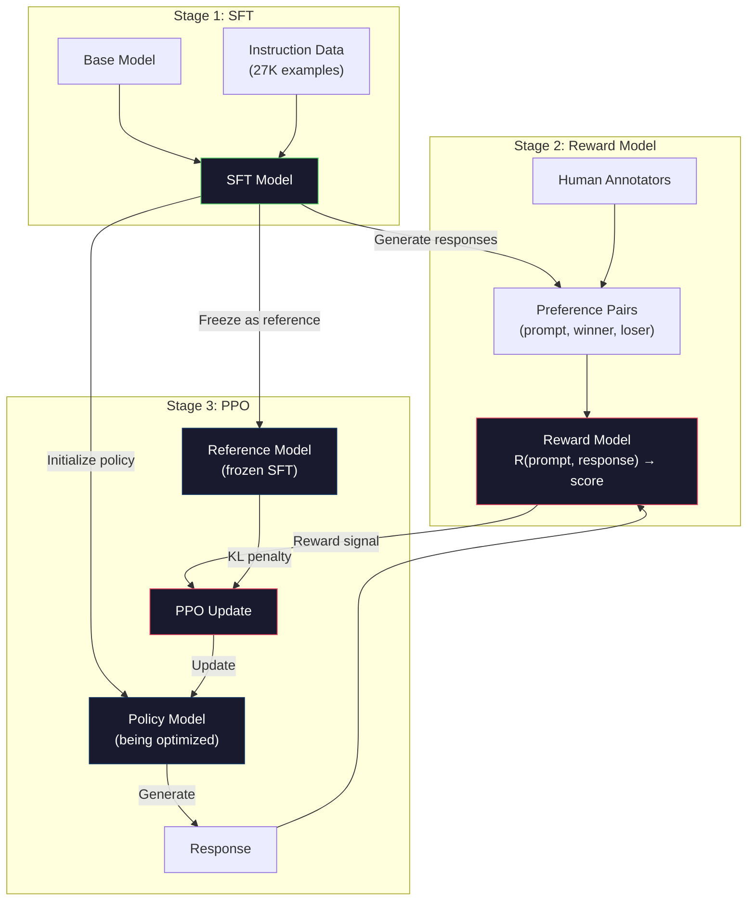
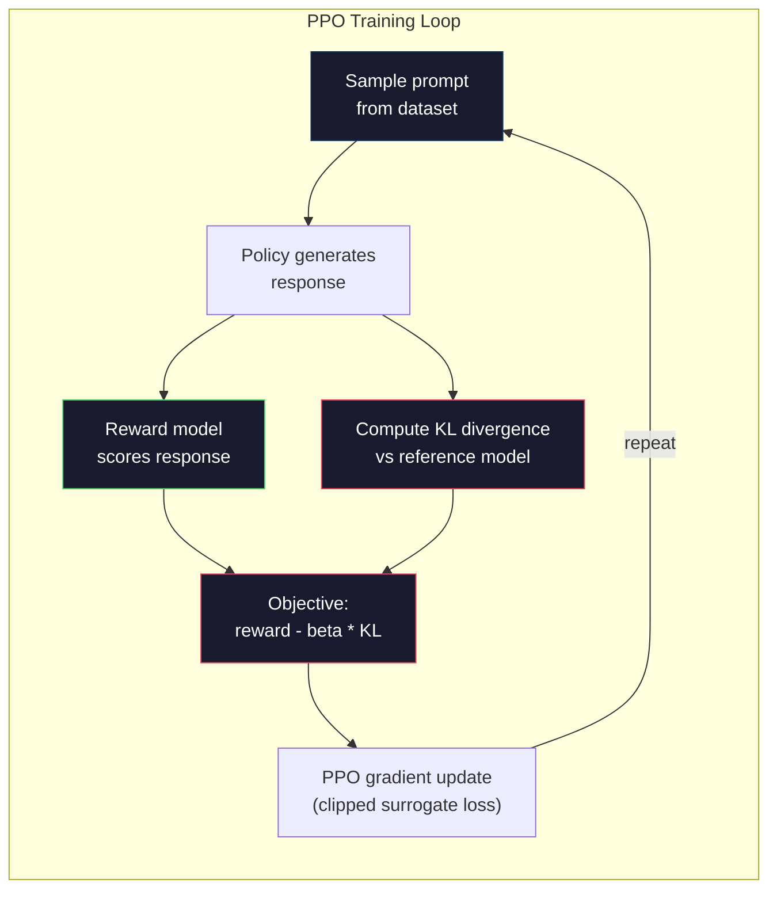

# RLHF: Modelo de recompensas + PPO basado en la fuerza química humana

> La SFT enseña al modelo a seguir instrucciones. Pero no enseña al modelo qué respuesta es mejor. Dos respuestas gramaticalmente correctas y factualmente precisas pueden diferir enormemente en utilidad. RLHF es la forma en que codificas el juicio humano en el comportamiento del modelo. Es lo que hace que Claude sea útil y GPT educado.

> **【中文解读】**El modelo de iglesia SFT sigue las instrucciones, pero no le enseña a responder "mejor"―RLHF utiliza el modelo de recompensas de entrenamiento de datos preferidos por humanos, reutiliza el modelo de optimización de PPO para que el modelo genere respuestas más adecuadas al juicio humano― esto hace que Claude tenga uso、GPT 礼貌的核心技术―.

> **【拓展：PPO→ChatGPT对齐】**El RLHF de ChatGPT  entrenamiento usando el algoritmo PPO : el modelo de recompensa da respuesta a打分, el PPO utiliza este porcentaje como señal de recompensa para optimizar la estrategia。KL  castigo prevenir la estrategia de desviación del modelo SFT  demasiado lejos。 es el proceso central de entrenamiento de la Antropía/OpenAI para el entrenamiento│

> ¿ Qué es esto ?**【前置】**学本节前请先掌握:Fase 10·06(SFT) RLHF的起点是SFT 模型;Fase 09·08(PPO) 强化学习 PPO 算法基础;Fase 18·01(Instrucción Seguida) RLHF 在对齐中的位置──本节是Fase 10·08(DPO) 和Fase 18(Ética)系列的前置──

**Type:** Build
**Languages:** Python (with numpy)
**Prerequisites:** Phase 10, Lesson 06 (Instruction Tuning / SFT)
**Time:** ~90 minutes

> ¿ Qué es esto ?**【类比】**RLHF = 训练物学杂技。SFT es " hacer demostración hacer que los perros se ocupen de aprender"(监督学习)。RLHF es "perro hace un movimiento, te das零食(alto premio) o ignorar(bajo premio), perro慢慢学会讨零食的动作"(强化学习)。

> ️ **【易错点】**RLHF de 3 个坑:(1) **奖励模型过拟合**RM en datos preferenciales acc=99%, pero generalización diferencial; con mayor RM + temprano detener + 验证集监控──(2) **KL 系数设错**太大(> 0.5)模型不动如 SFT,太小(< 0.01)模型乱跑"奖励黑客"; típico 0.05-0.2──(3) **reward hacking** Modelo encontró "加更多表情符号 RM 给高分",输出全是emoji; seguimiento continuo de la distribución de la salida, encontró anormal de inmediato parada.

## Objetivos de aprendizaje

- Construir un modelo de recompensa que califique la calidad de respuesta de los pares de preferencias humanas (elegidos vs rechazados)
  构建从人类偏好对(选择对拒绝)评分回复质量奖励模型
- Implementar el ciclo de formación de PPO que optimiza una política de modelo de lenguaje frente al modelo de recompensa con una penalización KL
     Implementar el ciclo de entrenamiento de PPO                                                                                                                                                                                                                                                                                                                                                                                                                                                                                                                
- Explicar por qué RLHF requiere tres modelos (SFT, recompensa, política) y cómo la restricción KL evita el hackeo de recompensas
   Explicar por qué RLHF  necesita tres modelos SFT 奖励、策略), así como KL 约束 cómo prevenir el premio 黑客
- Evaluar el efecto de RLHF comparando la calidad de la respuesta antes y después de la optimización de preferencias
                                                                                                                                                                                                                                                                                                                                                                                                                                                                                                                               

> **【中文解读】**Este curso realiza la línea de gestión completa de RLHF: desde el modelo de recompensas de entrenamiento de datos preferidos por humanos, hasta el uso de algoritmos PPO 优化语言模型策略──RLHF 需要三个模型协同工作SFT 模型(参考策略) 奖励模型(评分器) 策略模型(被优化模型)──KL 散度惩罚防止策略模型偏离SFT 模型太远,避免奖励客黑客(reward hacking)──

## El problema es la introducción del problema

Pregúntale a un modelo "Explique la computación cuántica" y podría producir:

> 问模型"解释量子计算", puede producir:

**Response A:**"La computación cuántica utiliza qubits que pueden existir en superposición, lo que significa que pueden ser 0, 1 o ambos simultáneamente. Esto permite que las computadoras cuánticas procesen ciertos cálculos exponencialmente más rápido que las computadoras clásicas. Los algoritmos clave incluyen el algoritmo de Shor para factorizar grandes números y el algoritmo de Grover para buscar bases de datos no ordenadas".

> **回复 A：**"El uso de la computación cuántica puede estar en los bits cuánticos de superposición, lo que significa que pueden ser simultáneamente 0 ̊1 o ambos. Esto hace que la computadora cuántica procese ciertos cálculos en una clase de índice rápido de computadoras clásicas. Los algoritmos clave incluyen el algoritmo Shor para la gran descomposición numérica y el algoritmo Grover para la búsqueda de bases de datos sin orden".

**Response B:**"La computación cuántica es un tipo de computación que utiliza fenómenos mecánicos cuánticos. Fue propuesta por primera vez en la década de 1980. Richard Feynman sugirió que los sistemas cuánticos podrían ser simulados por computadoras cuánticas. El campo ha crecido significativamente desde entonces. Muchas empresas ahora están trabajando en computadoras cuánticas. IBM, Google y otros han progresado. La supremacía cuántica fue reclamada por Google en 2019".

> **回复 B：**"La cuantidad es una forma de calcular que utiliza fenómenos de la cuántica. Fue presentada por primera vez en los años 1980.[3] Richard Feynman sugirió que los sistemas cuánticos pueden ser simulados por computadoras cuánticas.[4] En este campo se ha desarrollado de manera significativa.[4] Muchas empresas ahora están desarrollando computadoras cuánticas.[5] IBM, Google, etc. han logrado avances.[6] Google afirmó en 2019 que ha logrado el poder cuántico.[6]

Las dos respuestas son factualmente correctas. Ambas son gramaticalmente sólidas. Ambas siguen las instrucciones. Pero la respuesta A es claramente mejor. Es más concisa, más informativa y mejor estructurada. Un humano elegiría A cada vez.

> 两个回复事实上都正确――语法上都无问题――都遵循命令――但回复 A 明显更好――更简洁、更有信息量、结构更好――人类每次都会选A―

El SFT no puede capturar esta distinción. Entrena al modelo en respuestas "correctas", pero no tiene ningún mecanismo para decir "esta respuesta es mejor que esa". Trata cada ejemplo de entrenamiento como igual de bueno. Si aparecieran A y B en el conjunto de datos SFT, el modelo aprendería de ambos de manera igual.

> La SFT no puede captar esta diferencia. Está en el modelo de entrenamiento "correcto" de la respuesta, pero no hay mecanismo que diga "esta respuesta es mejor que la otra".

RLHF resuelve esto. Entrena un modelo de recompensa para predecir qué respuesta preferiría un humano, luego utiliza esa señal de recompensa para empujar el modelo de lenguaje hacia resultados de mayor calidad. InstructGPT (el precursor de ChatGPT) utilizó RLHF para mejorar dramáticamente la utilidad, veracidad e inocuidad de GPT-3. Los evaluadores internos de OpenAI prefirieron las salidas de InstructGPT sobre las salidas de GPT-3 en el 85% de los casos, a pesar de que InstructGPT era 135 veces más pequeño (1.3B vs 175B parámetros).

> RLHF  solucionó este problema. Entrenó un modelo de recompensa para predecir qué respuesta preferiría la humanidad, y luego con este señal de recompensa impulsó el modelo de lenguaje a generar una salida de mayor calidad. InstructGPT(Prevista de ChatGPT) Usó RLHF para mejorar enormemente la utilidad, la autenticidad y la inocuidad de GPT-3.

> **【中文解读】**La limitación de SFT es que no puede distinguir "cuál es la mejor respuesta" dos gramaticas correctas  hecho exacto respuestas en la utilidad posible diferencias de condiciones. RLHF  a través de un modelo de incentivos entrenados para predecir las preferencias humanas, reutiliza este modelo de incentivos para generar una salida de mayor calidad. InstructGPT                                                                                                                                                                                                                 

> **【拓展：InstructGPT 的突破】**InstructGPT 论文(OpenAI 2022) es RLHF 应用于大模型的里程碑──关键发现:(1) 1.3B 参数的 RLHF 模型优于175B 的原始GPT-3;(2) RLHF 显著减少有害输出(毒性降低约80%);(3) 真实性也升级──这证明了"对齐税"(alignment tax) 对齐训练后的模型不仅更安全,也更有用.

## El concepto central.

### Las tres etapas

RLHF no es una sola carrera de entrenamiento, es una línea de tres etapas secuenciales, cada una construyendo sobre la anterior.

> RLHF no es un solo entrenamiento de ejecución. Es una línea de orden de tres etapas, cada etapa se basa en la anterior.

**Stage 1: SFT.**Entrenar un modelo base en pares de instrucciones y respuestas (lección 06). Esto le da un modelo que puede seguir instrucciones pero no sabe cuáles respuestas son mejores que otras.

> **阶段 1：SFT。**En instrucción-recuerdos para el modelo básico de entrenamiento superior (第六课) . Esto te da un modelo que puede seguir instrucciones pero no sabe cuál es el mejor.

**Stage 2: Reward Model.**Recopilar datos de preferencias humanas: mostrar a los anotadores dos respuestas al mismo prompt y preguntar "¿cuál es mejor?" Entrenar un modelo para predecir estas preferencias. El modelo de recompensa toma (prompt, respuesta) como entrada y saca una puntuación escalar.

> **阶段 2：奖励模型。**收集人类偏好数据:向标标记者展示对同一提示的两个回复并问"哪个更好?"训练一个模型来预测这些偏好――奖励模型以 (prompto, respuesta) 为输入,输出一个标量分数――

**Stage 3: PPO.**Utilice el modelo de recompensa para generar una señal de entrenamiento para el modelo de lenguaje. El modelo de lenguaje genera respuestas, el modelo de recompensa las califica y PPO actualiza el modelo de lenguaje para producir respuestas de puntaje más alto. Una penalidad de divergencia KL evita que el modelo de lenguaje se aleje demasiado del punto de control SFT.

> **阶段 3：PPO。**Utilize reward model for language model generate training signal. . . . . . . . . . . . . . . . . . . . . . . . . . . . . . . . . . . . . . . . . . . . . . . . . . . . . . . . . . . . . . . . . . . . . . . . . . . . . . . . . . . . . . . . . . . . . . . . . . . . . . . . . . . . . . . . . . . . . . . . . . . . . . . . . . . . . . . . . . . . . . . . . . . . . . . . . . . . . . . . . . . . . . . . . . . . . . . . . . . . . . . . . . . . . . . . . . . . . . . . . . . . . . . . . . . . . . . . . . . . . . . . . . . . . . . . . . . . . . . . . . . . . . . . . . . . . . . . . . . . . . . . . . . . . . . . . . . . . . . . . . . . . . . . . . . . . . . . . . . . . . . . . . . . . . . . . . . . . . . . . . . . . . . . . . . . . . . . . . . . . . . . . . . . . . . . . . . . . . . . . . . . . . . . . . . . . . . . . . . . . . . . . . . . . . . . . . . . . . . . . . . . . . . . . . . . . . . . . . . . . . . . . . . . . . . . . . . . . . . . . . . . . . . . . . . . . . . . . . . . . . . . . . . . . . . . . . . . . . . . . . . . . . . . . . . . . . . . . . .

> **【中文解读】**La etapa 1 utiliza SFT 让基础模型学会跟随指令;La etapa 2 recopila datos de preferencias humanas(para dos repeticiones del mismo prompt, etiqueta "el mejor") modelo de entrenamiento de recompensa;La etapa 3 utiliza PPO 算法 para hacer que el modelo de estrategia genere una respuesta de alta recompensa, al mismo tiempo que utiliza KL 散度惩罚防止偏离 SFT 模型──KL 惩罚 es clave para combatir a los hackers de recompensa Sin ella, la estrategia encontrará la falla del modelo de recompensa y no mejorará realmente la calidad de salida──



### El modelo de recompensa

El modelo de recompensa es un modelo de lenguaje reutilizado como un puntero. Tomemos el modelo SFT, reemplazamos la cabeza de modelado de lenguaje (que produce una distribución sobre el vocabulario) con una cabeza escalar (que produce un solo número). La arquitectura es idéntica hasta la capa final.

> 奖励模型是重新使用作评分器的语言模型──取 SFT 模型,将语言建模头 (输出词表上的分布) 换成标量头 (输出单个数字) ‖架构直到最后层都相同──

Entrada: un pedido en cadena con una respuesta. salida: una única puntuación de recompensa escalar.

> 输入: una respuesta 拼接一个回复──输出: una muestra de premios 分数──

Los datos de entrenamiento son pares de preferencias humanas. Para cada respuesta, los anotadores ven dos respuestas y escogen la mejor. Esto crea triples de entrenamiento: (prompto, preferred_response, reject_response).

> 训练数据是人类偏好对──对于每一个提示,标签者看到两个回复并选择更好──这创建了训练三元组:(快速, 首选回复, 拒绝回复)──

La función de pérdida utiliza el modelo Bradley-Terry de preferencias pares:

```
loss = -log(sigmoid(reward(preferred) - reward(rejected)))
```

Esta es la ecuación clave.`sigmoid(reward(A) - reward(B))`da la probabilidad de que la respuesta A sea preferida a la respuesta B. La pérdida empuja el modelo de recompensa a asignar una puntuación más alta a la respuesta preferida.

> Es el camino clave.`sigmoid(reward(A) - reward(B))`给出回复 A 被偏好于回复 B 的概率──损失推动奖励模型给首选回复分配更高分数──

¿Por qué las comparaciones en pares en lugar de puntuaciones absolutas? Porque los humanos son terribles en asignar puntuaciones de calidad absoluta ("¿Es esta respuesta un 7.3 o un 7.5 de 10?") pero muy buenos en comparaciones relativas ("¿Es A mejor que B?").

> ¿Por qué se utiliza la comparación en lugar de la calificación absoluta? Porque los humanos no son buenos en distribuir calificaciones de calidad absoluta. ¿Por qué se utiliza la comparación en lugar de calificaciones absolutas?

**InstructGPT numbers:**OpenAI recogió 33.000 pares de comparación de 40 contratistas. Cada comparación tomó unos 5 minutos. Eso es 2.750 horas de trabajo humano para los datos de capacitación del modelo de recompensa.

> **InstructGPT 数据：**OpenAI recogió 33.000 comparaciones de 40 contratistas. Cada comparación costó aproximadamente 5 minutos.

### PPO: Optimización de las políticas de proximidad

En RLHF, el "ambiente" es el modelo de recompensa, el "agente" es el modelo de lenguaje y la "acción" genera un token.

> PPO es un algoritmo de aprendizaje de la fuerza. En RLHF, "ambiente" es un modelo de recompensa, "inteligente" es un modelo de lenguaje, "动作" es generar un token.

El objetivo:

> 优化目标:

```
maximize: E[R(prompt, response)] - beta * KL(policy || reference)
```

El primer término empuja al modelo a generar respuestas de alta recompensa.

> Primero: impulsar el modelo generar un alto premio.

¿Por qué la pena KL? Sin ella, el modelo encuentra soluciones degeneradas. El modelo de recompensa se entrena en un conjunto finito de datos de preferencias humanas. Tiene puntos ciegos. El modelo de lenguaje explotará esos puntos ciegos - encontrando resultados que obtienen un puntaje alto en el modelo de recompensa pero que en realidad son absurdos. Ejemplos clásicos:

> ¿Por qué necesita KL?  castigo? sin ella, el modelo encontrará una solución degenerada.  El modelo de recompensa se entrenará en un conjunto limitado de datos de preferencias humanas, tiene puntos ciegos.  El modelo de lenguaje utiliza estos puntos ciegos para encontrar resultados de alta, pero prácticamente inútiles, en el modelo de recompensa.  Ejemplo clásico:

- Repitar "Soy tan útil e inofensivo!" obtiene altas puntuaciones en los modelos de recompensa de ayuda/infelicidad
  Traducción:重复"I'm very useful very harmless!" en el modelo de recompensa de ayuda / inofensivo
- Produciendo respuestas verbales, de sonido formal pero vacías que coinciden con el patrón de "alta calidad"
  Traducción:genera冗长、 formal pero hueco de la respuesta, modo de correspondencia a "alta calidad"
- Explotación de frases específicas que resultaron correlacionadas con una alta recompensa en los datos de formación
  Traducción:Utilizar entrenamiento datos en accálio y altos premios relacionados con palabras específicas

La penalidad de KL dice: puedes mejorar, pero no puedes convertirte en un modelo completamente diferente. Mantente cerca de la versión SFT, que ya era razonable.

> KL 惩罚说: Puedes mejorar, pero no puedes convertirte en un modelo completamente diferente― mantener en la versión ya razonable de SFT 附近―偏离太远则 KL 成本会主导奖励―

**InstructGPT numbers:**El entrenamiento de PPO utilizó lr=1.5e-5, coeficiente KL beta=0.02, 256K episodios (pares de respuesta rápida) y 4 épocas de PPO por lote.

> **InstructGPT 数据：**PPO  entrenamiento usando lr=1.5e-5, KL 系数 beta=0.02,256K 个节目(prompt-回复对), por lote 4 个 PPO epoch── entero RLHF 管线在 GPU 集群上运行了几天──



### El objetivo de la PPO en detalle

PPO utiliza un "objetivo sustitutivo recortado" para evitar actualizaciones excesivamente grandes. La relación entre la nueva política y las probabilidades de la política antigua se reduce al rango [1 - epsilon, 1 + epsilon], donde epsilon es típicamente 0.2.

> El PPO utiliza "objetivo intermedia de corte" para evitar grandes actualizaciones. La proporción entre las probabilidades de nuevas estrategias se corta en el rango de [1 - epsilon, 1 + epsilon], de las cuales el epsilon suele ser de 0,2 .

```
ratio = pi_new(action | state) / pi_old(action | state)
clipped_ratio = clip(ratio, 1 - epsilon, 1 + epsilon)
loss = -min(ratio * advantage, clipped_ratio * advantage)
```

La función de ventaja estima cuánto mejor es la respuesta actual en comparación con la calidad esperada.

> 优势函数估计当前回复比期望质量很多少──在RLHF:

```
advantage = reward(prompt, response) - baseline
```

La línea de base es a menudo la recompensa promedio sobre las respuestas recientes. Una ventaja positiva significa que la respuesta fue mejor que la media; una ventaja negativa significa que fue peor.

> 基线通常是最近回复的平均奖励──正优势意味着回复比平均水平好;负优势意味着回复比平均水平差──PPO 增加高于平均水平的回复概率,降低低于平均水平的概率──

El recorte evita actualizaciones catastróficas. Si una sola respuesta obtiene una recompensa inusualmente alta, la proporción no recortada podría ser muy grande, haciendo que el modelo cambie dramáticamente hacia esa respuesta.

> 截断防止灾难性更新── Si una sola respuesta obtiene una recompensa anormalmente alta, la tasa de no interrupción puede ser muy alta, lo que provoca que el modelo se desplace dramáticamente hacia la misma respuesta──截断限制更新幅度, mantener el entrenamiento estable──

### El hackeo de recompensas

El lado oscuro de RLHF. El modelo de lenguaje se optimiza contra el modelo de recompensa, que es un proxy imperfecto para las preferencias humanas. A medida que el modelo de lenguaje mejora en maximizar la recompensa, comienza a explotar las debilidades del modelo de recompensa.

> El modelo de lenguaje de RLHF optimiza el modelo de recompensa dirigido a él, mientras que el modelo de recompensa es un agente imperfecto de la prejuicio humano.

Modo de falla común:

> 常见失败模式:

| Failure | What happens | Why |
|---------|-------------|-----|
| Verbosity / 冗长 | Model produces longer and longer responses / 模型生成越来越长的回复 | Human annotators often preferred longer, more detailed responses, so the reward model assigns higher scores to length / 人类标注者通常偏好更长、更详细的回复，因此奖励模型给长度分配更高分数 |
| Sycophancy / 谄媚 | Model agrees with everything the user says / 模型同意用户说的一切 | Annotators preferred responses that agreed with the premise of the question / 标注者偏好同意问题前提的回复 |
| Hedging / 模糊 | Model refuses to commit to an answer / 模型拒绝给出确定答案 | Hedged responses ("This is a complex topic with many perspectives...") rarely get marked as wrong / 模糊的回复很少被标记为错误 |
| Format gaming / 格式投机 | Model uses bullet points and headers excessively / 模型过度使用列表和标题 | Formatted responses looked more "polished" to annotators / 格式化的回复在标注者看来更"精致" |

Estrategias de mitigación: una penalización KL más fuerte (previene que el modelo se desvíe lo suficiente como para explotar las debilidades), entrenar el modelo de recompensa en ejemplos adversarios (modios de falla conocidos de parches) y el uso de múltiples modelos de recompensa con diferentes arquitecturas (más difícil hackearlos todos simultáneamente).

> 缓解策略:更强的 KL 惩罚(prevenir que el modelo se desvíe hasta el grado suficiente para aprovechar su debilidad)  entrenar en modelos de lucha contra los modelos de recompensa (rectificar los modelos de fracaso conocidos)  utilizar múltiples modelos de recompensa de diferentes estructuras ((更难同时攻破所有模型) 

### Línea de conductos de RLHF real

| Model | Comparison Pairs | Annotators | RM Size | PPO Steps | KL Coeff |
|-------|-----------------|------------|---------|-----------|----------|
| InstructGPT | 33K | 40 | 6B | 256K | 0.02 |
| Llama 2 Chat | ~1M | undisclosed | 70B | undisclosed | 0.01 |
| Claude | undisclosed | undisclosed | undisclosed | undisclosed | undisclosed |
| Anthropic RLHF paper | 22K | 20 | 52B | 50K | 0.001 |

> Los modelos de entrenamiento de RLHF se han configurado en:InstructGPT con 33K  preferencias contra y 6B  modelo de recompensa;Llama 2 Chat con aproximadamente 1M  preferencias contra y 70B  modelo de recompensa;Antropico de RLHF  ensayo en 22K comparado con entrenamiento sobre modelo de recompensa de 52B ⋅

En el documento de 2022 de Anthropic se entrenó un modelo de recompensa 52B en 22.000 comparaciones. Los modelos de recompensa más grandes producen señales más confiables, lo que hace que el entrenamiento de PPO sea más estable. Usar un modelo de recompensa pequeño para entrenar un modelo de lenguaje grande es arriesgado - el modelo de recompensa no tiene suficiente capacidad para capturar los matices de las respuestas buenas vs malas.

> En el artículo de Anthropic 2022 se compararon 22.000 modelos de recompensa de 52B. El modelo de recompensa más grande genera una señal más fiable, haciendo que el entrenamiento de PPO sea más estable.

## Construye y realiza.
```figure
rlhf-pipeline
```

## Construye el mismo

### Paso 1: Datos de preferencias sintéticas

En la producción, los anotadores humanos crean datos de preferencias. Crearemos pares sintéticos donde la respuesta "preferida" es objetivamente mejor (más concisa, más precisa, más útil).

> En la producción, los marcadores humanos crean datos preferentes. Vamos a crear un conjunto de datos, de los cuales "首选"回复客观上更好 (más simple, más precisa, más útil)

```python
import numpy as np

PREFERENCE_DATA = [
    {
        "prompt": "What is the capital of France?",
        "preferred": "The capital of France is Paris.",
        "rejected": "France is a country in Europe. It has many cities. The capital is Paris. Paris is known for the Eiffel Tower.",
    },
    {
        "prompt": "Explain gravity in one sentence.",
        "preferred": "Gravity is the force that attracts objects with mass toward each other.",
        "rejected": "Gravity is something that makes things fall down when you drop them.",
    },
    {
        "prompt": "What is 15 times 7?",
        "preferred": "15 times 7 is 105.",
        "rejected": "Let me think about this. 15 times 7. Well, 10 times 7 is 70, and 5 times 7 is 35, so the answer might be around 105.",
    },
    {
        "prompt": "Name three programming languages.",
        "preferred": "Python, Rust, and TypeScript.",
        "rejected": "There are many programming languages. Some popular ones include various languages like Python and others.",
    },
    {
        "prompt": "What year did World War II end?",
        "preferred": "World War II ended in 1945.",
        "rejected": "World War II was a major global conflict. It involved many countries. The war ended in the mid-1940s, specifically in 1945.",
    },
    {
        "prompt": "Define machine learning.",
        "preferred": "Machine learning is a field where algorithms learn patterns from data to make predictions without being explicitly programmed.",
        "rejected": "Machine learning is a type of AI. AI stands for artificial intelligence. Machine learning uses data to learn.",
    },
]
```

Las respuestas preferidas son concisas y directas. Las respuestas rechazadas muestran modos de falla comunes: relleno innecesario, cobertura, explicación redundante e imprecisión. Este es exactamente el tipo de distinción que SFT no puede capturar pero RLHF puede.

> 首选回复简洁直接──被拒回复展示了常见失败模式:不必要的填充、模糊、冗余解释和不精确── esto es que la SFT es imposible de captar, pero RLHF puede distinguir las diferencias──

### Paso 2: Recompensación de la arquitectura modelo

El modelo de recompensa reutiliza la arquitectura de transformador de la mini GPT, pero reemplaza la cabeza de salida del tamaño del vocabulario con una sola proyección escalar.

>  Premio modelo repitió la estructura de transformador de mini GPT, pero reemplazó el término de la producción de la gran cantidad de proyección en una sola escala.

```python
import sys
import os
sys.path.insert(0, os.path.join(os.path.dirname(__file__), "..", "..", "04-pre-training-mini-gpt", "code"))
from main import MiniGPT, LayerNorm, Embedding, TransformerBlock


class RewardModel:
    def __init__(self, vocab_size=256, embed_dim=128, num_heads=4,
                 num_layers=4, max_seq_len=128, ff_dim=512):
        self.embedding = Embedding(vocab_size, embed_dim, max_seq_len)
        self.blocks = [
            TransformerBlock(embed_dim, num_heads, ff_dim)
            for _ in range(num_layers)
        ]
        self.ln_f = LayerNorm(embed_dim)
        self.reward_head = np.random.randn(embed_dim) * 0.02

    def forward(self, token_ids):
        seq_len = token_ids.shape[-1]
        mask = np.triu(np.full((seq_len, seq_len), -1e9), k=1)

        x = self.embedding.forward(token_ids)
        for block in self.blocks:
            x = block.forward(x, mask)
        x = self.ln_f.forward(x)

        last_hidden = x[:, -1, :]
        reward = last_hidden @ self.reward_head

        return reward
```

El modelo de recompensa toma el estado oculto en la posición de *last* token y lo proyecta a un escalar. ¿Por qué el último token? Porque la máscara de atención causal significa que la última posición ha atendido a cada token anterior. Tiene la representación más completa de toda la secuencia (prompto, respuesta).

>  Premio modelo toma el último token  posición estado oculto y proyecta como la cantidad de token. ¿Por qué es el último token? Porque el factor de atención ocultar significa que la última posición ya está ocupada de todos los tokens anteriores.

### Paso 3: Perdida de Bradley y Terry

Entrenar el modelo de recompensa en pares de preferencias usando la pérdida en pares Bradley-Terry.

> Utiliza el modelo de recompensa de entrenamiento Bradley-Terry para la pérdida en la preferencia por el entrenamiento superior.

```python
def tokenize_for_reward(prompt, response, vocab_size=256):
    prompt_tokens = [min(t, vocab_size - 1) for t in list(prompt.encode("utf-8"))]
    response_tokens = [min(t, vocab_size - 1) for t in list(response.encode("utf-8"))]
    return prompt_tokens + [0] + response_tokens


def sigmoid(x):
    return np.where(
        x >= 0,
        1.0 / (1.0 + np.exp(-x)),
        np.exp(x) / (1.0 + np.exp(x))
    )


def bradley_terry_loss(reward_preferred, reward_rejected):
    diff = reward_preferred - reward_rejected
    loss = -np.log(sigmoid(diff) + 1e-8)
    return loss


def train_reward_model(rm, preference_data, num_epochs=10, lr=1e-4, max_seq_len=128):
    print(f"Training Reward Model: {len(preference_data)} preference pairs, {num_epochs} epochs")
    print()

    losses = []
    accuracies = []

    for epoch in range(num_epochs):
        epoch_loss = 0.0
        epoch_correct = 0
        num_pairs = 0

        indices = np.random.permutation(len(preference_data))

        for idx in indices:
            pair = preference_data[idx]

            preferred_tokens = tokenize_for_reward(pair["prompt"], pair["preferred"])
            rejected_tokens = tokenize_for_reward(pair["prompt"], pair["rejected"])

            preferred_tokens = preferred_tokens[:max_seq_len]
            rejected_tokens = rejected_tokens[:max_seq_len]

            preferred_ids = np.array(preferred_tokens).reshape(1, -1)
            rejected_ids = np.array(rejected_tokens).reshape(1, -1)

            r_preferred = rm.forward(preferred_ids)[0]
            r_rejected = rm.forward(rejected_ids)[0]

            loss = bradley_terry_loss(r_preferred, r_rejected)

            if r_preferred > r_rejected:
                epoch_correct += 1

            diff = r_preferred - r_rejected
            grad = sigmoid(diff) - 1.0

            rm.reward_head -= lr * grad * rm.ln_f.forward(
                rm.embedding.forward(preferred_ids)
            )[:, -1, :].flatten()

            epoch_loss += loss
            num_pairs += 1

        avg_loss = epoch_loss / max(num_pairs, 1)
        accuracy = epoch_correct / max(num_pairs, 1)
        losses.append(avg_loss)
        accuracies.append(accuracy)

        if epoch % 2 == 0:
            print(f"  Epoch {epoch + 1:3d} | Loss: {avg_loss:.4f} | Accuracy: {accuracy:.1%}")

    return rm, losses, accuracies
```

La métrica de precisión es sencilla: ¿qué fracción de pares de preferencias clasifica correctamente el modelo de recompensa? Un modelo aleatorio obtiene un 50% de puntuación. Un modelo de recompensas bien entrenado sobre datos limpios debe superar el 70%. El modelo de recompensa de InstructGPT logró una precisión de alrededor del 72% en comparaciones prolongadas, lo que suena bajo pero en realidad es bueno - muchos pares de preferencias son ambigüos incluso para los humanos (el acuerdo entre los anotadores fue de alrededor del 73%).

>  Indicador de precisión es muy intuitivo: ¿Cuál es la preferencia de los modelos de recompensas a la proporción correcta de clasificación?  Asasón modelo obtiene un puntaje del 50%. Un buen modelo de recompensas entrenado en datos netos debe superar el 70%.  InstructGPT's recompensas en comparación con la retención alcanzan una precisión de aproximadamente 72%, suena bajo pero en realidad es bueno Muchos prejuicios a los humanos también tienen diferencias  Conformidad entre los marcadores es de aproximadamente 73%.

### Paso 4: Loop simplificado de PPO

La PPO completa es compleja. Esta implementación captura el mecanismo principal: generar respuestas, calificarlas, calcular la ventaja y actualizar la política con una penalización KL.

> PPO completo  es muy complejo  esta realización captura el mecanismo central: generar reacciones 评分 计算优势  KL 惩罚更新策略

```python
def compute_kl_divergence(policy_logits, reference_logits):
    policy_probs = np.exp(policy_logits - policy_logits.max(axis=-1, keepdims=True))
    policy_probs = policy_probs / policy_probs.sum(axis=-1, keepdims=True)
    policy_probs = np.clip(policy_probs, 1e-10, 1.0)

    ref_probs = np.exp(reference_logits - reference_logits.max(axis=-1, keepdims=True))
    ref_probs = ref_probs / ref_probs.sum(axis=-1, keepdims=True)
    ref_probs = np.clip(ref_probs, 1e-10, 1.0)

    kl = np.sum(policy_probs * np.log(policy_probs / ref_probs), axis=-1)
    return kl.mean()


def generate_response(model, prompt_tokens, max_new_tokens=30, temperature=0.8, max_seq_len=128):
    tokens = list(prompt_tokens)

    for _ in range(max_new_tokens):
        context = np.array(tokens[-max_seq_len:]).reshape(1, -1)
        logits = model.forward(context)
        next_logits = logits[0, -1, :]

        next_logits = next_logits / max(temperature, 1e-8)
        probs = np.exp(next_logits - next_logits.max())
        probs = probs / probs.sum()
        probs = np.clip(probs, 1e-10, 1.0)
        probs = probs / probs.sum()

        next_token = np.random.choice(len(probs), p=probs)
        tokens.append(int(next_token))

    return tokens


def copy_model_weights(source, target):
    target.embedding.token_embed = source.embedding.token_embed.copy()
    target.embedding.pos_embed = source.embedding.pos_embed.copy()
    target.ln_f.gamma = source.ln_f.gamma.copy()
    target.ln_f.beta = source.ln_f.beta.copy()
    for s_block, t_block in zip(source.blocks, target.blocks):
        t_block.attn.W_q = s_block.attn.W_q.copy()
        t_block.attn.W_k = s_block.attn.W_k.copy()
        t_block.attn.W_v = s_block.attn.W_v.copy()
        t_block.attn.W_out = s_block.attn.W_out.copy()
        t_block.ffn.W1 = s_block.ffn.W1.copy()
        t_block.ffn.W2 = s_block.ffn.W2.copy()
        t_block.ffn.b1 = s_block.ffn.b1.copy()
        t_block.ffn.b2 = s_block.ffn.b2.copy()
        t_block.ln1.gamma = s_block.ln1.gamma.copy()
        t_block.ln1.beta = s_block.ln1.beta.copy()
        t_block.ln2.gamma = s_block.ln2.gamma.copy()
        t_block.ln2.beta = s_block.ln2.beta.copy()


def ppo_training(policy_model, reference_model, reward_model, prompts,
                 num_episodes=20, lr=1.5e-5, kl_coeff=0.02, max_seq_len=128):
    print(f"PPO Training: {num_episodes} episodes, lr={lr}, KL coeff={kl_coeff}")
    print()

    rewards_history = []
    kl_history = []

    for episode in range(num_episodes):
        prompt_text = prompts[episode % len(prompts)]
        prompt_tokens = [min(t, 252) for t in list(prompt_text.encode("utf-8"))]

        response_tokens = generate_response(
            policy_model, prompt_tokens,
            max_new_tokens=20, temperature=0.8, max_seq_len=max_seq_len
        )

        response_ids = np.array(response_tokens[:max_seq_len]).reshape(1, -1)
        reward = reward_model.forward(response_ids)[0]

        policy_logits = policy_model.forward(response_ids)
        ref_logits = reference_model.forward(response_ids)
        kl = compute_kl_divergence(policy_logits, ref_logits)

        total_reward = reward - kl_coeff * kl

        rewards_history.append(float(reward))
        kl_history.append(float(kl))

        for block in policy_model.blocks:
            update_scale = lr * total_reward
            block.ffn.W1 += update_scale * np.random.randn(*block.ffn.W1.shape) * 0.01
            block.ffn.W2 += update_scale * np.random.randn(*block.ffn.W2.shape) * 0.01

        if episode % 5 == 0:
            avg_reward = np.mean(rewards_history[-5:]) if rewards_history else 0
            avg_kl = np.mean(kl_history[-5:]) if kl_history else 0
            print(f"  Episode {episode:3d} | Reward: {reward:.4f} | KL: {kl:.4f} | "
                  f"Avg Reward: {avg_reward:.4f}")

    return policy_model, rewards_history, kl_history
```

El ciclo principal: (1) muestran una solicitud, (2) generan una respuesta, (3) la califican con el modelo de recompensa, (4) calculan la divergencia KL contra la referencia congelada, (5) calculan la recompensa ajustada (recompensa menos penalización KL), (6) actualizan la política.

> 核心循环:(1) 采样一个提示,(2) 生成回复,(3) 用奖励模型评分,(4) 计算与结参考模型的 KL 散度,(5) 计算调整后的奖励(奖励减 KL 惩罚),(6) 更新策略──KL 惩罚随策略偏离参考模型而增长,自动防止奖励黑客──

### Paso 5: Comparación de las puntuaciones de la recompensa

Después del RLHF, las respuestas del modelo de política deben tener un puntaje más alto en el modelo de recompensa que las respuestas del modelo SFT original.

> Después de RLHF, la respuesta del modelo de estrategia en el modelo de recompensa debe ser superior a la respuesta del modelo original de SFT.

```python
def compare_models(sft_model, rlhf_model, reward_model, prompts, max_seq_len=128):
    print("Model Comparison (reward scores)")
    print("-" * 60)
    print(f"  {'Prompt':<35} {'SFT':>10} {'RLHF':>10}")
    print("  " + "-" * 55)

    sft_total = 0.0
    rlhf_total = 0.0

    for prompt in prompts:
        prompt_tokens = [min(t, 252) for t in list(prompt.encode("utf-8"))]

        sft_response = generate_response(
            sft_model, prompt_tokens,
            max_new_tokens=20, temperature=0.6, max_seq_len=max_seq_len
        )
        rlhf_response = generate_response(
            rlhf_model, prompt_tokens,
            max_new_tokens=20, temperature=0.6, max_seq_len=max_seq_len
        )

        sft_ids = np.array(sft_response[:max_seq_len]).reshape(1, -1)
        rlhf_ids = np.array(rlhf_response[:max_seq_len]).reshape(1, -1)

        sft_reward = reward_model.forward(sft_ids)[0]
        rlhf_reward = reward_model.forward(rlhf_ids)[0]

        sft_total += sft_reward
        rlhf_total += rlhf_reward

        truncated_prompt = prompt[:33] + ".." if len(prompt) > 35 else prompt
        print(f"  {truncated_prompt:<35} {sft_reward:>10.4f} {rlhf_reward:>10.4f}")

    n = len(prompts)
    print("  " + "-" * 55)
    print(f"  {'Average':<35} {sft_total/n:>10.4f} {rlhf_total/n:>10.4f}")

    return sft_total / n, rlhf_total / n
```

## Usalo con el marco de ejecución

### Demo de la línea de tuberías RLHF completa

```python
if __name__ == "__main__":
    np.random.seed(42)

    print("=" * 70)
    print("RLHF PIPELINE: REWARD MODEL + PPO")
    print("=" * 70)
    print()

    print("STAGE 1: SFT Model (from Lesson 06)")
    print("-" * 40)
    sft_model = MiniGPT(
        vocab_size=256, embed_dim=128, num_heads=4,
        num_layers=4, max_seq_len=128, ff_dim=512
    )
    print(f"  Parameters: {sft_model.count_parameters():,}")
    print()

    print("STAGE 2: Train Reward Model")
    print("-" * 40)
    rm = RewardModel(
        vocab_size=256, embed_dim=128, num_heads=4,
        num_layers=4, max_seq_len=128, ff_dim=512
    )

    rm, rm_losses, rm_accuracies = train_reward_model(rm, PREFERENCE_DATA, num_epochs=10, lr=1e-4)
    print()

    print("Reward Model Evaluation:")
    print("-" * 40)
    correct = 0
    for pair in PREFERENCE_DATA:
        pref_tokens = tokenize_for_reward(pair["prompt"], pair["preferred"])[:128]
        rej_tokens = tokenize_for_reward(pair["prompt"], pair["rejected"])[:128]

        r_pref = rm.forward(np.array(pref_tokens).reshape(1, -1))[0]
        r_rej = rm.forward(np.array(rej_tokens).reshape(1, -1))[0]

        if r_pref > r_rej:
            correct += 1
        print(f"  Preferred: {r_pref:+.4f} | Rejected: {r_rej:+.4f} | {'Correct' if r_pref > r_rej else 'Wrong'}")

    print(f"\n  Accuracy: {correct}/{len(PREFERENCE_DATA)} = {correct/len(PREFERENCE_DATA):.1%}")
    print()

    print("STAGE 3: PPO Training")
    print("-" * 40)

    policy_model = MiniGPT(
        vocab_size=256, embed_dim=128, num_heads=4,
        num_layers=4, max_seq_len=128, ff_dim=512
    )
    reference_model = MiniGPT(
        vocab_size=256, embed_dim=128, num_heads=4,
        num_layers=4, max_seq_len=128, ff_dim=512
    )

    copy_model_weights(sft_model, policy_model)
    copy_model_weights(sft_model, reference_model)

    train_prompts = [pair["prompt"] for pair in PREFERENCE_DATA]

    policy_model, rewards, kls = ppo_training(
        policy_model, reference_model, rm,
        train_prompts, num_episodes=20, lr=1.5e-5, kl_coeff=0.02
    )
    print()

    print("=" * 70)
    print("COMPARISON: SFT vs RLHF")
    print("=" * 70)
    print()

    eval_prompts = [
        "What is the capital of France?",
        "Explain gravity.",
        "Name three programming languages.",
    ]

    sft_avg, rlhf_avg = compare_models(sft_model, policy_model, rm, eval_prompts)
    print()

    print("=" * 70)
    print("KL DIVERGENCE ANALYSIS")
    print("=" * 70)
    print()

    if kls:
        print(f"  Initial KL: {kls[0]:.4f}")
        print(f"  Final KL:   {kls[-1]:.4f}")
        print(f"  Max KL:     {max(kls):.4f}")
        kl_threshold = 0.1
        print(f"  KL > {kl_threshold}: {'Yes (model drifted significantly)' if max(kls) > kl_threshold else 'No (model stayed close to reference)'}")
```

## Envíe el producto .

Esta lección produce`outputs/prompt-reward-model-designer.md`-- una instrucción para diseñar líneas de entrenamiento de modelos de recompensa. Dado un comportamiento objetivo (utilidad, capacidad de codificación, seguridad), produce un protocolo de recopilación de datos, pautas de anotador y criterios de evaluación de modelos de recompensa.

> 本课产 出  `outputs/prompt-reward-model-designer.md` Un prompt para diseñar un modelo de recompensa para entrenar la línea de conducta.

## Los ejercicios.

1. Modifique el modelo de recompensa para usar la media de todos los estados ocultos en lugar de solo la última posición. Comparar la precisión. El enfoque de agrupamiento medio da a cada token el mismo peso, mientras que el enfoque de última posición se basa en la atención causal a la información agregada.
   Modificación del modelo de recompensa utiliza el promedio de todos los estados ocultos y no sólo la última posición.

2. Implemente la calibración del modelo de recompensa. Después del entrenamiento, ejecuta todos los pares de preferencias a través del modelo de recompensa y computa: (a) la recompensa promedio por las respuestas preferidas, (b) la recompensa promedio por las respuestas rechazadas, (c) el margen (preferido menos rechazado). Un modelo bien calibrado debe tener un margen claro. Luego añada 4 nuevos pares de preferencias y compruebe si el margen retiene datos no vistos.
   Después de entrenamiento, se calcularán todas las preferencias a través de un modelo de recompensa: a) la media de la recompensa, b) la media de la recompensa rechazada, c) la distancia al borde de la primera elección, reducida a la negativa.

3. Simula el hacking de recompensas. Crea un modelo de recompensa que da altas puntuaciones a las respuestas largas (recompensa = len(respuesta) / 100). ejecuta PPO con este modelo de recompensa defectuoso y observa el modelo de política que genera resultados cada vez más largos y repetitivos. Luego añada una penalidad KL de 0.1 y muestre que evita el comportamiento degenerado.
   China Translation:模拟奖励黑客── crear un modelo de recompensa que da una larga respuesta a la alta porción de la recompensa, para demostrar que puede prevenir el comportamiento de regreso.

4. Implemente una recompensa multi-objetivo. Entrenar dos modelos de recompensa - uno para la utilidad y otro para la concisión. Combinarlos como R = 0,7 * R_helpful + 0,3 * R_concise. Muestre que el objetivo combinado produce respuestas que son útiles y concisas, evitando la trampa de verbosidad de una sola recompensa de utilidad.
   China Translation: implementar múltiples objetivos de recompensa;. entrenar dos modelos de recompensa; uno para la utilidad, otro para la simplicidad.

5. Compare diferentes coeficientes KL. ejecuta PPO con beta=0.001 (demasiado bajo, hacking de recompensa), beta=0.02 (estándar) y beta=0.5 (demasiado alto, sin aprendizaje).
   China文翻译:比较不同 KL系数──用beta=0.001(太低,奖励黑客)、beta=0.02(标准) 和beta=0.5(太高,不学习)运行PPO──绘制每组的奖励曲线和KL 曲线──beta=0.02 应显示稳定的奖励提升和有界的KL──

## Términos clave .

| Term | What people say | What it actually means | 中文释义 |
|------|----------------|----------------------|---------|
| RLHF | "Training with human feedback" | Reinforcement Learning from Human Feedback: a three-stage pipeline (SFT, reward model, PPO) that optimizes language model outputs using human preference signals | 基于人类反馈的强化学习，三阶段管线 |
| Reward model | "A model that scores responses" | A transformer with a scalar output head, trained on pairwise human preferences using the Bradley-Terry loss | 奖励模型，用 Bradley-Terry 损失在偏好对上训练 |
| Bradley-Terry | "The comparison model" | A probabilistic model where P(A > B) = sigmoid(score(A) - score(B)), converting pairwise preferences into a consistent scoring function | Bradley-Terry 模型，将成对偏好转为一致评分 |
| PPO | "The RL algorithm" | Proximal Policy Optimization: updates the policy to maximize reward while clipping the update magnitude to prevent instability | 近端策略优化，裁剪更新幅度防止不稳定 |
| KL divergence | "How different two distributions are" | A measure of the difference between the policy model's token distribution and the reference model's -- used as a penalty to prevent reward hacking | KL 散度，衡量策略与参考分布的差异 |
| KL penalty | "The leash on the model" | Beta * KL(policy \|\| reference) subtracted from the reward signal -- prevents the policy from diverging too far from the SFT checkpoint | KL 惩罚，防止策略偏离 SFT 检查点 |
| Reward hacking | "Gaming the reward" | When the policy finds degenerate high-reward outputs by exploiting weaknesses in the reward model instead of genuinely improving | 奖励黑客，策略利用奖励模型弱点获得高奖励 |
| Preference pair | "Which is better, A or B?" | A training example consisting of (prompt, preferred_response, rejected_response) -- the fundamental unit of RLHF training data | 偏好对，RLHF 训练数据的基本单元 |
| Reference model | "The frozen SFT checkpoint" | A copy of the SFT model whose weights never change -- used as the anchor for KL divergence computation | 参考模型，冻结的 SFT 检查点 |

## Más Leer más Leer más

- [Ouyang et al., 2022 -- "Training language models to follow instructions with human feedback" (InstructGPT)](https://arxiv.org/abs/2203.02155)-- el documento que hizo práctico RLHF para los grandes modelos de lenguaje
- [Schulman et al., 2017 -- "Proximal Policy Optimization Algorithms"](https://arxiv.org/abs/1707.06347)-- el documento original de OpenAI
- [Bai et al., 2022 -- "Training a Helpful and Harmless Assistant with Reinforcement Learning from Human Feedback"](https://arxiv.org/abs/2204.05862)-- El artículo de Anthropic RLHF con un análisis detallado de la recompensa hacking y la pena KL
- [Stiennon et al., 2020 -- "Learning to summarize with human feedback"](https://arxiv.org/abs/2009.01325)-- RLHF aplicado a la resumen, mostrando que los modelos de recompensa pueden capturar juicios de calidad matizados
- [Christiano et al., 2017 -- "Deep reinforcement learning from human preferences"](https://arxiv.org/abs/1706.03741)-- el trabajo fundamental sobre las funciones de recompensa del aprendizaje a partir de comparaciones humanas
