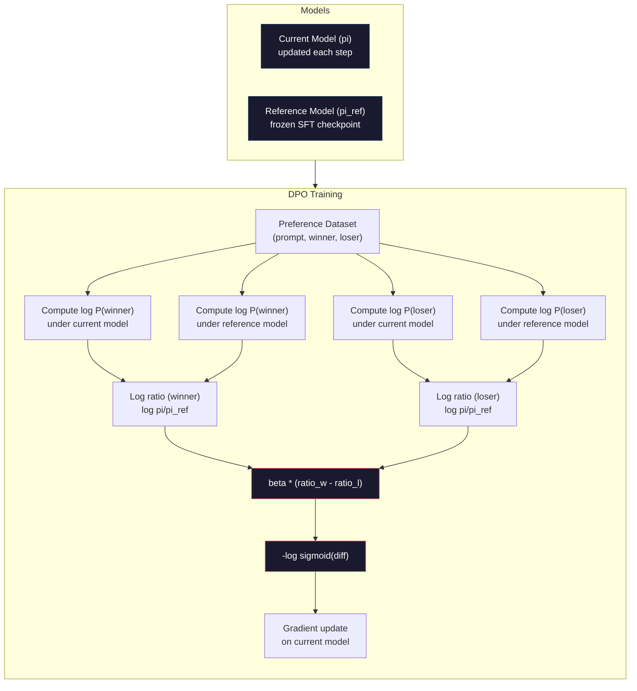

# Optimización directa de preferencias.

> RLHF funciona. También requiere entrenar tres modelos (SFT, modelo de recompensa, política), gestionar la inestabilidad de PPO y ajustar una penalización KL. DPO pregunta: ¿qué pasa si puedes saltarte todo eso? DPO optimiza directamente el modelo de lenguaje en pares de preferencias. No hay modelo de recompensa. No hay PPO. Un bucle de entrenamiento. Los mismos resultados.

> **【中文解读】**RLHF 需要训练三个模型(SFT、奖励模型、策略), también para tratar la inestabilidad de PPO──DPO 直接在偏好对上优化语言模型不需要奖励模型,不需要 PPO,一个训练循环,效果相当──

> **【拓展：DPO→简化对齐】**DPO es un programa de RLHF alternativo propuesto por Stanford en 2023, que se ha convertido en el primer método de muchos modelos de código abierto (como Zephyr、Tulu).

> ¿ Qué es esto ?**【前置】**学本节前请先掌握:Fase 10·07(RLHF) 理解RLHF 流程和它的问题(3 个模型 + PPO 不稳定);PyTorch 监督学习基础──DPO es el "RLHF sin RL" matemático de la elegancia matemática, entender por qué有效需要看原文推导──

**Type:** Build
**Languages:** Python (with numpy)
**Prerequisites:** Phase 10, Lesson 07 (RLHF)
**Time:** ~90 minutes

> ¿ Qué es esto ?**【类比】**DPO vs RLHF = 直接教育 vs 訓練動物。RLHF:先训一个"老师" (RM) dar a los estudiantes un partido, volver a usar PPO 让学生讨老师欢心3 个模型 + 复杂训练。DPO:直接给学生看"好答案"和"坏答案"对照,让它自己学1 个模型 + 简单交叉── matemática DPO demostró que "hacer clases en datos preferidos" es igual a "el mejor resultado de RLHF",省去了显式 RM──

> ️ **【易错点】**El DPO de 3 个坑:**偏好数据质量决定一切**DPO 不像RLHF有RM平滑噪声,标注错的偏好对直接学错;务必做标注质量控制──(2) DPO 不像RLHF 有RM平滑噪声,标注错的偏好对直接学错;务必做标注质量控制──(2) **β 系数设错**太大(> 0.5)模型不变,太小(< 0.05)模型偏离 SFT 太远; típico 0.1──(3) **没做 reference model**Pérdida de DPO 需要相对 SFT 模型的日志-prob 差分, olvidarcargar ref modelo 会训练崩;用 `AutoModelForCausalLM.from_pretrained(sft_path)`¿Qué es esto?

## Objetivos de aprendizaje

- Implementar una formación en DPO que optimice directamente un modelo de lenguaje en pares de preferencias sin un modelo de recompensa separado
   Implementar el entrenamiento de DPO, directamente en la preferencia a la optimización de modelos de lenguaje, sin necesidad de un modelo de recompensa individual
- Derivar la función de pérdida de DPO y explicar cómo representa implícitamente un modelo de recompensa a través de las probabilidades de registro de la póliza
  推导 DPO 损失函数, explicar cómo se muestra el modelo de recompensa en forma oculta de probabilidad de contraposición de números a través de estrategias
- Comparar DPO vs RLHF en términos de estabilidad de formación, coste de cálculo y número de modelos requeridos
  En cuanto a la estabilidad de entrenamiento, el coste de cálculo y la cantidad de modelos requeridos, comparación entre DPO y RLHF
- Ajustar el parámetro beta para controlar en qué medida la política entrenada difiere del modelo de referencia
  调节 beta 参数, control entrenamiento estrategia de orientación del modelo de referencia

> **【中文解读】**Este curso se desarrolla para implementar DPO (direct preference optimization), RLHF simplified alternative scheme (simplificación de la alternativa directa a la preferencia), y el enfoque central de DPO es: la función de recompensa más positiva puede derivarse de la matemática de probabilidad de los propios tokens del modelo de lenguaje, por lo que no se necesita un modelo de recompensa independiente.

## El problema es la introducción del problema

El modelo de recompensa y el modelo de política optimizado con PPO. El modelo de recompensa solo requería miles de pares de preferencias humanas y un ciclo de entrenamiento separado.

> En la séptima clase se construyó la línea de formación RLHF. En tres fases. Tres modelos.

En la práctica, el entrenamiento PPO es notoriamente inestable. Pequeños cambios de hiperparámetros hacen que el entrenamiento diverja. El modelo de recompensa es un proxy imperfecto para las preferencias humanas, y la política encuentra formas de explotar sus debilidades. La penalidad KL ayuda pero requiere su propio ajuste - demasiado bajo y se obtiene el hacking de recompensa, demasiado alto y el modelo apenas aprende.

> En la práctica, el entrenamiento de la OPP se llama inestable. Los cambios de superparámetros pequeños pueden provocar la difusión del entrenamiento. El modelo de recompensa es un agente imperfecto de la prejuicio humano.

Esta complejidad es la razón por la que la mayoría de los modelos de código abierto lucharon con RLHF durante años después de que se publicara InstructGPT.

> Esta complejidad es la razón por la cual la mayoría de los modelos de código abierto han sido difíciles de usar durante muchos años después de la publicación de InstructGPT.

En mayo de 2023, Rafael Rafailov, Archit Sharma y colegas de Stanford publicaron "Optimización de Preferencias Directas: Tu Modelo de Lenguaje es Secretamente un Modelo de Recompensa". La clave: no necesitas un modelo de recompensa separado. La función de recompensa óptima se determina matemáticamente por las probabilidades simbólicas del modelo de lenguaje. Puedes saltarte el modelo de recompensa por completo y optimizar el modelo de lenguaje directamente en pares de preferencias.

> En mayo de 2023, Rafael Rafailov, Archit Sharma y colegas de Stanford publicaron "Optimización de Preferencias Directas: tu Modelo de Lenguaje es Secretamente un Modelo de Recompensa"―.

DPO reduce el RLHF a un solo paso de aprendizaje supervisado. Un modelo. Una función de pérdida. Un bucle de entrenamiento. No hay aprendizaje de refuerzo. Zephyr-7B, uno de los primeros modelos en usar DPO a escala, coincidió o superó modelos entrenados con RLHF completo en varios puntos de referencia. Meta utilizó DPO como parte de la tubería de alineación de Llama 3.

> El DPO simplificará el RLHF en un solo paso de aprendizaje de supervisión. Un modelo. Una función de pérdida. Un ciclo de entrenamiento. No se necesita una fuerte química. Zephyr-7B es uno de los primeros modelos de DPO en uso masivo, en varios criterios de adaptación o superado el uso completo de RLHF.

> **【中文解读】**DPO resolvió los tres grandes puntos de dolor de RLHF: 1) no necesita un modelo de recompensa de entrenamiento individual; 2) no necesita tratar la inestabilidad y la superparámetro de PPO; 3) de tres modelos de tubería simplificado a un ciclo de entrenamiento único. Zephyr-7B fue uno de los primeros modelos de DPO en uso a gran escala, en muchos criterios de adaptación o superado el uso completo de RLHF  entrenamiento.

> **【拓展：DPO 在开源社区的普及】**DPO ha llegado a ser el primer método de selección de un modelo de código abierto. HuggingFace TRL 库原生支持 DPO,Zephyr,Tulu,OpenHermes 等已成为 el modelo de código abierto conocido.

## El concepto central.

### El punto clave

RLHF optimiza este objetivo:

> RLHF 优化这个目标:

donde R es el modelo de recompensa, pi es la política, pi_ref es el modelo de referencia y beta es el coeficiente KL.

> Entre ellos R es un modelo de recompensa, pi es una estrategia, pi_ref es un modelo de referencia, beta es un KL en números.

El documento del DPO mostró que este objetivo tiene una solución óptima en forma cerrada.

> El artículo del DPO muestra que este objetivo tiene la mejor solución de forma cerrada. Para cualquier función de recompensa R, la mejor estrategia es:

donde Z(x) es una constante normalizadora.

> Entre ellos Z(x) es el número habitual de la re-re-re-re-re-re-re-re-re-re-re-re-re-re-re-re-re-re-re-re-re-re-re-re-re-re-re-re-re-re-re-re-re-re-re-re-re-re-re-re-re-re-re-re-re-re-re-re-re-re-re-re-re-re-re-re-re-re-re-re-re-re-re-re-re-re-re-re-re-re-re-re-re-re-re-re-re-re-re-re-re-re-re-re-re-re-re-re-re-re-re-re-re-re-re-re-re-re-re-re-re-re-re-re-re-re-re-re-re-re-re-re-re-re-re-re-re-re-re-re-re-re-re-re-re-re-re-re-re-re-re-re-re-re-re-re-re-re-re-re-re-re-re-re-re-re-re-re-re-re-re-re-re-re-re-re-re-re-re-re-re-re-re-re-re-re-re-re-re-re-re-re-re-re-re-re-re-re-re-re-re-re-re-re-re-re-re-re-re-re-re-re-re-re-re-re-re-re-re-re-re-re-re-re-re-re-re-re-re-re-re-re-re-re-re-re-re-re-re-re-re-re-re-re-re-re-re-re-re-re-re-re-re-re-re-re-re-re-re-re-re-re-re-re-re-re-re-re-re-

Esta es la conclusión. La recompensa se expresa enteramente en términos de las probabilidades del modelo de política y las probabilidades del modelo de referencia. No es necesario entrenar un modelo de recompensa separado. La recompensa es *implicita* en la proporción de probabilidad.

> Esto es un avance. La probabilidad de recompensa es totalmente representada por la probabilidad del modelo estratégico y la probabilidad del modelo de referencia.

Sustituyendo esto en el modelo de preferencia Bradley-Terry:

> Lo sustituirán por el modelo preferido de Bradley-Terry:

Los términos Z(x) se cancelarán porque ambas respuestas se condicionan a la misma respuesta x. Lo que queda es una función de las probabilidades de registro del modelo de política y las probabilidades de registro del modelo de referencia en las respuestas preferidas y rechazadas.

> Z(x) 项消去了, porque dos repetidas son con el mismo prompt x 为条件――剩下的只是策略模型在对首选和拒回复的对数概率和参考模型的对数概率函数――

### La pérdida de DPO

```
L_DPO = -log(sigmoid(beta * (log pi(y_w|x)/pi_ref(y_w|x) - log pi(y_l|x)/pi_ref(y_l|x))))
```

Desempaquemos cada pieza.

> 让我们解析每个部分:

- **y_w**= respuesta preferida (ganadora)
- **y_l**= respuesta rechazada (perdida)
- **x**= rápido
- **pi**= modelo actual (estando capacitado)
- **pi_ref**= modelo de referencia (punto de control de FFT congelado)
- **beta**= parámetro de temperatura que controla la desviación de la referencia (normalmente de 0,1 a 0,5)

> **【中文解读】**El núcleo de la función de DPO 损失是"对数概率比对数概率比":beta * (log pi(y_w) /pi_ref(y_w) - log pi(y_l)/pi_ref(y_l))。 mide el modelo de estrategia en relación con el modelo de referencia preferido elegido 回复、更不偏好拒绝 回复的程度──beta 控制策略偏离参考模型的程度(类似于RLHF中的 KL系数), típico 0.1-0.5。

> **【拓展：DPO 的数学直觉】**El avance de DPO consiste en expresar la función de recompensa "ocultum" en el RLHF como modelo de estrategia y la probabilidad de modelo de referencia: R(x,y) = beta * log (pi) yx) / pi_ref (yx)) + const. Esto significa que no se necesita entrenamiento de forma clara de la función de recompensa.

La proporción `log pi(y|x) / pi_ref(y|x)`Cuando esta relación es positiva, el modelo actual asigna una probabilidad mayor a la respuesta y que la referencia. Cuando es negativa, el modelo actual asigna una probabilidad menor.

> Porcentaje`log pi(y|x) / pi_ref(y|x)`Es la probabilidad de que la proporción de números sea correcta, el modelo actual da respuesta y la distribución es más alta que la probabilidad de que se trate.

La pérdida de DPO empuja al modelo a aumentar la relación de probabilidad de registro para las respuestas preferidas y disminuirlo para las respuestas rechazadas. El parámetro beta controla cuán agresivamente el modelo puede desviarse de la referencia - la beta pequeña significa que se permiten grandes desviaciones, la beta grande mantiene al modelo cerca de la referencia.

> DPO  pérdida impulsar el modelo aumentar la probabilidad de la primera selección de respuesta a la probabilidad de la primera respuesta a la probabilidad de la negativa a la respuesta a la probabilidad de la respuesta a la probabilidad de la primera respuesta a la probabilidad de la respuesta a la probabilidad de la respuesta a la probabilidad de la primera respuesta a la probabilidad de la primera respuesta a la probabilidad de la primera respuesta a la probabilidad de la respuesta a la probabilidad de la primera respuesta a la primera respuesta a la primera respuesta a la probabilidad de la probabilidad de la respuesta a la primera respuesta a la primera respuesta a la primera respuesta a la primera respuesta a la primera respuesta a la respuesta a la primera respuesta a la respuesta a la respuesta a la respuesta a la probabilidad de la respuesta a la respuesta a la respuesta a la respuesta a la respuesta a la respuesta a la respuesta a la respuesta a la respuesta a la respuesta a la respuesta a la respuesta a la respuesta a la respuesta a la respuesta a la respuesta a la respuesta a la respuesta a la respuesta a la respuesta a la respuesta a la respuesta a la respuesta a la respuesta a la respuesta a la respuesta a la respuesta a la respuesta a la respuesta a la respuesta a la respuesta a la respuesta a la respuesta a la respuesta a la respuesta a la respuesta a la respuesta a la respuesta a la respuesta a la respuesta a la respuesta a la respuesta a la respuesta a la respuesta a la respuesta a la respuesta a la respuesta a la respuesta a la respuesta a la respuesta a la respuesta a la respuesta a la respuesta a la respuesta a la respuesta a la respuesta a la respuesta a la respuesta a la respuesta a la respuesta a la respuesta a la respuesta a la respuesta a la respuesta a la respuesta a la beta beta beta beta beta beta beta beta beta beta beta beta beta beta beta beta beta beta beta beta beta beta beta beta beta beta beta beta beta beta beta beta beta beta beta beta beta beta beta beta beta beta beta beta beta beta beta beta beta beta beta beta beta beta beta beta beta beta beta beta beta beta beta beta beta beta beta beta beta beta beta beta beta beta beta beta beta beta beta beta beta beta beta beta beta beta beta beta beta beta beta beta beta beta beta beta beta beta beta beta beta beta beta beta beta beta beta beta beta beta beta beta beta beta beta beta beta beta beta beta beta beta beta beta beta beta beta beta beta beta beta beta beta beta beta beta beta beta beta beta beta beta beta beta beta beta beta beta beta



### Por qué la DPO es más simple

| Aspect | RLHF (PPO) | DPO |
|--------|-----------|-----|
| Models to train | 3 (SFT + reward + policy) | 1 (policy only) |
| Training loops | 3 (SFT, RM training, PPO) | 2 (SFT, DPO) |
| Hyperparameters | lr, KL coeff, clip ratio, RM lr, epochs x3 | lr, beta, epochs |
| Reward model | Required (separate training) | Implicit in model probabilities |
| RL algorithm | PPO (complex, unstable) | Supervised learning (stable) |
| GPU memory | 3-4 models in memory during PPO | 2 models (current + reference) |
| Training stability | Sensitive to hyperparameters | Robust, similar to SFT |

DPO necesita dos modelos en la memoria durante el entrenamiento - el modelo actual y la referencia congelada. RLHF necesita tres o cuatro: la política, la referencia, el modelo de recompensa, y opcionalmente una función de valor de línea de base. Para un modelo 70B, cada copia toma 140 GB en FP16.

> El entrenamiento de DPO requiere de dos modelos en memoria Modelo actual y modelo de referencia de la conclusión RLHF requiere de tres o cuatro: estrategia, referencia, modelo de recompensa, así como de la función de valor selectiva. Para el modelo 70B, cada copia en FP16 subyace a 140GB.

### Cuando el DPO supera a la RLHF

**Small datasets.**Con 5.000-20.000 pares de preferencias, DPO a menudo coincide o supera RLHF. El modelo de recompensa en RLHF necesita suficientes datos para generalizar - con datos limitados, se sobrepasa y produce señales de recompensa poco confiables. DPO evita este problema al no necesitar un modelo de recompensa en absoluto.

> **小型数据集。**Hay 5.000-20.000 preferencias por el tiempo, el modelo de recompensas de DPO normalmente se ajusta o supera a RLHF.

**Limited compute.**DPO requiere aproximadamente un tercio del cálculo de RLHF completo (un bucle de entrenamiento en lugar de tres). Para equipos sin grandes grupos de GPU, esta es la opción práctica.

> **有限算力。**DPO aproximadamente sólo necesita un RLHF completo en tres partes de la cantidad de cálculo de un ciclo de entrenamiento y no tres).

**Rapid iteration.**¿Quieres probar 10 conjuntos de datos de preferencias diferentes para ver cuál produce el mejor modelo? DPO te permite ejecutar cada experimento en horas. RLHF requiere reentrenamiento del modelo de recompensa para cada conjunto de datos.

> **快速迭代。**¿Qué tipo de modelo es el mejor para cada ensayo? ¿Qué tipo de modelo es el mejor para cada ensayo?

### Cuando RLHF supera a DPO

**Large-scale training.**En la escala de GPT-4 o Claude, el modelo de recompensa separado de RLHF puede capturar señales de preferencia más matizadas.

> **大规模训练。**En la escala de GPT-4 o Claude, el modelo de recompensa independiente de RLHF puede capturar señales de preferencia más detalladas.

**Complex reward signals.**Cuando "mejor" implica múltiples dimensiones (utilidad, inofensividad, honestidad), un modelo de recompensa puede aprender este compromiso multi-objetivo. DPO trata a cada par de preferencias como una señal binaria - uno es mejor, otro es peor - sin modelar por qué.

> **复杂奖励信号。**Cuando "mejor" se refiere a varias dimensiones (utilidad, inocuidad, sinceridad), el modelo de recompensa puede aprender este tipo de peso multi-objetivos.

**Iterative alignment.**Las tuberías RLHF pueden generar nuevas respuestas con la política actual, tener humanos que evaluarlas y retomar el modelo de recompensa en un bucle en línea. DPO trabaja en un conjunto de datos fijo de pares de preferencias.

> **迭代对齐。**RLHF 管线 puede utilizar la estrategia actual para generar nuevos comentarios, hacer que los humanos evalúen y volver a entrenar en el ciclo en línea.

### Más allá de la DPO: KTO, ORPO, SimPO

DPO inspiró una familia de métodos de alineación simplificados.

> El DPO ha iniciado una serie de métodos simplificados para la preparación.

**KTO (Kahneman-Tversky Optimization, 2024):**Ni siquiera necesitas pares. KTO trabaja con retroalimentación sin parejas, simplemente etiquete cada respuesta como "buena" o "mala" sin compararla con otra alternativa. Esto simplifica dramáticamente la recopilación de datos. En lugar de mostrar a los anotadores dos respuestas y preguntar "¿cuál es mejor?", muestra una respuesta y pregunta "¿es esto bueno?" La función de pérdida aplica la aversión a las pérdidas de la teoría de perspectivas: las malas respuestas son penalizadas más que las buenas respuestas son recompensadas.

> **KTO（Kahneman-Tversky 优化，2024）：**Usted ni siquiera necesita pareja. KTO utiliza la función de pérdida de la función de la teoría de la perspectiva: el daño de la reacción es mayor que el beneficio de la reacción.

**ORPO (Odds Ratio Preference Optimization, 2024):**Combina SFT y alineación en un solo paso de entrenamiento. En lugar de hacer primero SFT y luego DPO, ORPO modifica la pérdida SFT para incluir una señal de preferencia. La pérdida tiene dos términos: una pérdida de predicción estándar de token siguiente en las respuestas preferidas, más un término de relación de probabilidades que aumenta la brecha entre las probabilidades de respuesta preferidas y rechazadas. Un bucle de entrenamiento en lugar de dos.

> **ORPO（赔率比偏好优化，2024）：**En un solo entrenamiento, se combina SFT y se compara. ORPO modifica SFT  perdida para incluir señales de preferencia, en lugar de hacer primero SFT y volver a hacer DPO.

**SimPO (Simple Preference Optimization, 2024):**Elimina el modelo de referencia por completo. En lugar de calcular las relaciones de probabilidad de registro contra una referencia congelada, SimPO utiliza la probabilidad de registro promedio de la respuesta (normalizada por longitud) como la recompensa implícita. Esto ahorra memoria (no se necesita modelo de referencia) y simplifica el entrenamiento. La normalización de longitud evita que el modelo favorezca respuestas más cortas.

> **SimPO（简单偏好优化，2024）：**完全消除参考模型──SimPO 使用回复的平均对数概率 (en términos de longitud) como recompensa oculta, en lugar de en términos de probabilidad de números (en términos de tiempo) 结的参考计算对数概率比──这节省了内存 (en términos de tiempo) 无需参考模型)并简化了训练──长度归化防止模型偏向更短的回复──

| Method | Year | Models in Memory | Needs Pairs? | Needs Reference? | Training Loops |
|--------|------|-----------------|-------------|-----------------|----------------|
| RLHF | 2022 | 3-4 | Yes (for RM) | Yes | 3 |
| DPO | 2023 | 2 | Yes | Yes | 2 |
| KTO | 2024 | 2 | No (unpaired) | Yes | 2 |
| ORPO | 2024 | 1 | Yes | No | 1 |
| SimPO | 2024 | 1 | Yes | No | 1 |

La tendencia es clara: cada método elimina una pieza más de complejidad. RLHF necesitaba un modelo de recompensa y PPO. DPO eliminó ambos. KTO eliminó los datos emparejados. ORPO eliminó la etapa separada de SFT. SimPO eliminó el modelo de referencia. El impuesto de alineación - el costo de cálculo y complejidad de pasar de un modelo base a un modelo alineado - sigue cayendo.

>  Tendencias muy claras: cada método elimina una complejidad―RLHF  necesita un modelo de recompensa y PPO―DPO  elimina dos dos dos―KTO  elimina un par de datos―ORPO  elimina una etapa individual de SFT―SIMPO  elimina un modelo de referencia― ✓ ✓ ✓ ✓ ✓ ✓ ✓ ✓ ✓ ✓ ✓ ✓ ✓ ✓ ✓ ✓ ✓ ✓ ✓ ✓ ✓ ✓ ✓ ✓ ✓ ✓ ✓ ✓ ✓ ✓ ✓ ✓ ✓ ✓ ✓ ✓ ✓ ✓ ✓ ✓ ✓ ✓ ✓ ✓ ✓ ✓ ✓ ✓ ✓ ✓ ✓ ✓ ✓ ✓ ✓ ✓ ✓ ✓ ✓ ✓ ✓ ✓ ✓ ✓ ✓ ✓ ✓ ✓ ✓ ✓ ✓ ✓ ✓ ✓ ✓ ✓ ✓ ✓ ✓ ✓ ✓ ✓ ✓ ✓ ✓ ✓ ✓ ✓ ✓ ✓ ✓ ✓ ✓ ✓ ✓ ✓ ✓ ✓ ✓ ✓ ✓ ✓ ✓ ✓ ✓ ✓ ✓ ✓ ✓ ✓ ✓ ✓ ✓ ✓ ✓ ✓ ✓ ✓ ✓ ✓ ✓ ✓ ✓ ✓ ✓ ✓ ✓ ✓ ✓ ✓ ✓ ✓ ✓ ✓ ✓ ✓ ✓ ✓ ✓ ✓ ✓ ✓ ✓ ✓ ✓ ✓ ✓ ✓ ✓ ✓ ✓ ✓ ✓ ✓ ✓ ✓ ✓ ✓ ✓ ✓ ✓ ✓ ✓ ✓ ✓ ✓ ✓ ✓ ✓ ✓ ✓ ✓ ✓ ✓ ✓ ✓ ✓ ✓ ✓ ✓ ✓ ✓ ✓ ✓ ✓ ✓ ✓ ✓ ✓ ✓ ✓ ✓ ✓ ✓ ✓ ✓ ✓ ✓ ✓ ✓ ✓ ✓ ✓ ✓ ✓ ✓ ✓ ✓ ✓ ✓ ✓ ✓ ✓ ✓ ✓ ✓ ✓ ✓ ✓ ✓ ✓ ✓

### En el caso de los Estados miembros, el DPO debe ser el único agente de seguridad.

**Zephyr-7B (HuggingFace, October 2023):**Mistral 7B base, SFT en UltraChat (200K ejemplos), luego DPO en UltraFeedback (60K pares de preferencias). Obtuvo un puntaje de 6.47 en MT-Bench - el modelo 7B más alto en ese momento. Para comparación, Llama 2 Chat 70B obtuvo un puntaje de 6.86, lo que significa que Zephyr obtuvo dentro del 6% de un modelo 10x su tamaño utilizando solo la alineación de DPO.

> **Zephyr-7B（HuggingFace，2023 年 10 月）：**Mistral 7B  base modelo, hacer SFT en UltraChat(200K muestreo) y luego en UltraFeedback(60K  preferencia contra) hacer DPO。MT-Bench obtenido 6.47 entonces el modelo 7B más alto。 En comparación, Llama 2 Chat 70B obtenido 6.86, significa Zephyr  sólo con DPO para la jeda alcanzó un nivel de 94% de su modelo mayor de 10 veces ‖

**Llama 3 (Meta, April 2024):**Se utiliza DPO después de las etapas iniciales de RLHF. La combinación sugiere que DPO y RLHF pueden ser complementarios - RLHF para la alineación amplia, DPO para el refinamiento dirigido.

> **Llama 3（Meta，2024 年 4 月）：**En la fase inicial de RLHF  después de utilizar DPO. Esta combinación indica que DPO y RLHF pueden complementarse RLHF.

**Neural Magic / nm-chat (2024):**Aplicó DPO a múltiples modelos de código abierto, mostrando consistentemente una mejora del 5-15% en los puntos de referencia de alineación en comparación con las líneas de base exclusivamente de SFT.

> **Neural Magic / nm-chat（2024）：**Se aplicará a múltiples modelos de código abierto, mostrando un aumento del 5-15% en comparación con la línea de base de SFT pura.

## Construye y realiza.
```figure
dpo-loss
```

## Construye el mismo

### Paso 1: Datos de preferencias

El mismo formato que RLHF - (pronto, preferido, rechazado) triples. DPO consume estos datos directamente sin un modelo de recompensa intermedio.

> 格式与 RLHF 相同(pronto, 首选, 被拒绝) 三元组──DPO 直接消费这些数据,无需中间的奖励模型──

```python
import numpy as np
import sys
import os
sys.path.insert(0, os.path.join(os.path.dirname(__file__), "..", "..", "04-pre-training-mini-gpt", "code"))
from main import MiniGPT, LayerNorm, Embedding, TransformerBlock

PREFERENCE_DATA = [
    {
        "prompt": "What is the capital of France?",
        "preferred": "The capital of France is Paris.",
        "rejected": "France is a country in Europe. It has many cities. The capital is Paris. Paris is known for the Eiffel Tower.",
    },
    {
        "prompt": "Explain gravity in one sentence.",
        "preferred": "Gravity is the force that attracts objects with mass toward each other.",
        "rejected": "Gravity is something that makes things fall down when you drop them.",
    },
    {
        "prompt": "What is 15 times 7?",
        "preferred": "15 times 7 is 105.",
        "rejected": "Let me think about this. 15 times 7. Well, 10 times 7 is 70, and 5 times 7 is 35, so the answer might be around 105.",
    },
    {
        "prompt": "Name three programming languages.",
        "preferred": "Python, Rust, and TypeScript.",
        "rejected": "There are many programming languages. Some popular ones include various languages like Python and others.",
    },
    {
        "prompt": "What year did World War II end?",
        "preferred": "World War II ended in 1945.",
        "rejected": "World War II was a major global conflict. It involved many countries. The war ended in the mid-1940s, specifically in 1945.",
    },
    {
        "prompt": "Define machine learning.",
        "preferred": "Machine learning is a field where algorithms learn patterns from data to make predictions without being explicitly programmed.",
        "rejected": "Machine learning is a type of AI. AI stands for artificial intelligence. Machine learning uses data to learn.",
    },
]
```

### Paso 2: Probabilidad de registro de secuencias

La pérdida de DPO requiere calcular la probabilidad total de registro de una respuesta dada a un prompt. Esto significa ejecutar el modelo en la secuencia completa (prompt + respuesta) y sumar las probabilidades de registro de cada token de respuesta.

> DPO 损失需要计算给定提示下回复的总对数概率── esto significa que en el modelo de ejecución en la secuencia completa, y que la probabilidad de par de cada token de respuesta es de suma suma.

```python
def tokenize_sequence(text, vocab_size=256):
    return [min(t, vocab_size - 1) for t in list(text.encode("utf-8"))]


def compute_sequence_log_prob(model, prompt_tokens, response_tokens, max_seq_len=128):
    full_sequence = prompt_tokens + response_tokens
    if len(full_sequence) > max_seq_len:
        full_sequence = full_sequence[:max_seq_len]

    if len(full_sequence) < 2:
        return 0.0

    input_ids = np.array(full_sequence[:-1]).reshape(1, -1)
    target_ids = np.array(full_sequence[1:])

    logits = model.forward(input_ids)
    logits = logits[0]

    max_logits = logits.max(axis=-1, keepdims=True)
    log_probs = logits - max_logits - np.log(
        np.exp(logits - max_logits).sum(axis=-1, keepdims=True)
    )

    prompt_len = len(prompt_tokens)
    response_start = max(0, prompt_len - 1)
    response_end = len(target_ids)

    if response_start >= response_end:
        return 0.0

    response_log_probs = log_probs[response_start:response_end, :]
    response_targets = target_ids[response_start:response_end]

    total_log_prob = 0.0
    for i, target in enumerate(response_targets):
        total_log_prob += response_log_probs[i, target]

    return total_log_prob
```

Esta función es el caballo de trabajo de DPO. Para cada par de preferencias, se ejecuta cuatro veces: modelo en respuesta preferida, modelo en respuesta rechazada, referencia en respuesta preferida, referencia en respuesta rechazada. Eso es 4 pases adelante por ejemplo de entrenamiento frente a la generación de RLHF + puntuación de recompensa + estimación de valor + actualización de PPO.

> Esta función es la principal fuerza de DPO. Para cada preferencia, se ejecuta cuatro veces: modelo en la primera selección de respuesta, modelo en el rechazo, referencia en la primera selección de respuesta, referencia en el rechazo.

### Paso 3: La pérdida de DPO

El núcleo del documento en código, una función, una pérdida, sin modelo de recompensa.

> 论文核心的代码实现――一函数――一损失――无需奖励模型――

```python
def sigmoid(x):
    return np.where(
        x >= 0,
        1.0 / (1.0 + np.exp(-x)),
        np.exp(x) / (1.0 + np.exp(x))
    )


def dpo_loss(policy_logprob_preferred, policy_logprob_rejected,
             ref_logprob_preferred, ref_logprob_rejected, beta=0.1):
    preferred_ratio = policy_logprob_preferred - ref_logprob_preferred
    rejected_ratio = policy_logprob_rejected - ref_logprob_rejected

    logit = beta * (preferred_ratio - rejected_ratio)

    loss = -np.log(sigmoid(logit) + 1e-8)

    preferred_reward = beta * preferred_ratio
    rejected_reward = beta * rejected_ratio

    return loss, {
        "preferred_ratio": float(preferred_ratio),
        "rejected_ratio": float(rejected_ratio),
        "logit": float(logit),
        "implicit_preferred_reward": float(preferred_reward),
        "implicit_rejected_reward": float(rejected_reward),
        "reward_margin": float(preferred_reward - rejected_reward),
    }
```

El `preferred_ratio`y `rejected_ratio`Cuando el modelo actual asigna una mayor probabilidad a la respuesta preferida (relativa a la referencia) y una menor probabilidad a la respuesta rechazada, la logit es positiva y la pérdida es baja.

> `preferred_ratio`Y `rejected_ratio`Es la probabilidad de que el modelo actual tenga una probabilidad de repetición más alta de la distribución de la primera opción en relación con el modelo de referencia y que se le impida una probabilidad de repetición más baja de la distribución de la segunda opción, logar por lo que es correcto y por lo que es de menor pérdida.

El `implicit_preferred_reward`y `implicit_rejected_reward`Se pueden extraer para verificar que la capacitación está funcionando - el margen entre las recompensas preferidas y rechazadas debe aumentar en comparación con la capacitación.

> `implicit_preferred_reward`Y `implicit_rejected_reward`Se puede extraer de ellos para comprobar si el entrenamiento es efectivo y la distancia entre la selección inicial y el rechazo de los premios debe aumentar durante el proceso de entrenamiento.

### Paso 4: Ciclo de formación de los DPO

Un ciclo de entrenamiento supervisado estándar, sin PPO, sin modelo de recompensa, sólo pasajes y actualizaciones de gradiente.

> 標準的监督学习训练循环──无需PPO──无需奖励模型──只有前向传播和梯度更新──

```python
def copy_model_weights(source, target):
    target.embedding.token_embed = source.embedding.token_embed.copy()
    target.embedding.pos_embed = source.embedding.pos_embed.copy()
    target.ln_f.gamma = source.ln_f.gamma.copy()
    target.ln_f.beta = source.ln_f.beta.copy()
    for s_block, t_block in zip(source.blocks, target.blocks):
        t_block.attn.W_q = s_block.attn.W_q.copy()
        t_block.attn.W_k = s_block.attn.W_k.copy()
        t_block.attn.W_v = s_block.attn.W_v.copy()
        t_block.attn.W_out = s_block.attn.W_out.copy()
        t_block.ffn.W1 = s_block.ffn.W1.copy()
        t_block.ffn.W2 = s_block.ffn.W2.copy()
        t_block.ffn.b1 = s_block.ffn.b1.copy()
        t_block.ffn.b2 = s_block.ffn.b2.copy()
        t_block.ln1.gamma = s_block.ln1.gamma.copy()
        t_block.ln1.beta = s_block.ln1.beta.copy()
        t_block.ln2.gamma = s_block.ln2.gamma.copy()
        t_block.ln2.beta = s_block.ln2.beta.copy()


def dpo_train(policy_model, reference_model, preference_data,
              num_epochs=5, lr=5e-6, beta=0.1, max_seq_len=128):
    print(f"DPO Training: {len(preference_data)} pairs, {num_epochs} epochs, "
          f"lr={lr}, beta={beta}")
    print()

    losses = []
    margins = []

    for epoch in range(num_epochs):
        epoch_loss = 0.0
        epoch_margin = 0.0
        num_examples = 0

        indices = np.random.permutation(len(preference_data))

        for idx in indices:
            pair = preference_data[idx]

            prompt_tokens = tokenize_sequence(pair["prompt"])
            preferred_tokens = tokenize_sequence(pair["preferred"])
            rejected_tokens = tokenize_sequence(pair["rejected"])

            pi_logprob_w = compute_sequence_log_prob(
                policy_model, prompt_tokens, preferred_tokens, max_seq_len
            )
            pi_logprob_l = compute_sequence_log_prob(
                policy_model, prompt_tokens, rejected_tokens, max_seq_len
            )
            ref_logprob_w = compute_sequence_log_prob(
                reference_model, prompt_tokens, preferred_tokens, max_seq_len
            )
            ref_logprob_l = compute_sequence_log_prob(
                reference_model, prompt_tokens, rejected_tokens, max_seq_len
            )

            loss, metrics = dpo_loss(
                pi_logprob_w, pi_logprob_l,
                ref_logprob_w, ref_logprob_l, beta
            )

            update_direction = 1.0 if metrics["logit"] < 0 else -0.1
            for block in policy_model.blocks:
                block.ffn.W1 += lr * update_direction * np.random.randn(*block.ffn.W1.shape) * 0.01
                block.ffn.W2 += lr * update_direction * np.random.randn(*block.ffn.W2.shape) * 0.01

            epoch_loss += loss
            epoch_margin += metrics["reward_margin"]
            num_examples += 1
            losses.append(float(loss))
            margins.append(metrics["reward_margin"])

        avg_loss = epoch_loss / max(num_examples, 1)
        avg_margin = epoch_margin / max(num_examples, 1)

        print(f"  Epoch {epoch + 1}/{num_epochs} | Loss: {avg_loss:.4f} | "
              f"Avg Margin: {avg_margin:.4f}")

    return policy_model, losses, margins
```

El ciclo de entrenamiento es refrescante en comparación con RLHF. Para cada par de preferencias: calcular cuatro probabilidades de registro (dos modelos, dos respuestas), conectarlas a la pérdida de DPO, calcular el gradiente, actualizar la política. No hay paso de generación. No hay inferencia de modelo de recompensa. No hay estimación de ventaja. No hay recortes.

> En comparación con RLHF, el ciclo de entrenamiento es fácilmente perceptible. Para cada preferencia: calcular cuatro probabilidades de probabilidad de números, dos modelos, dos repeticiones), ingresar a DPO  pérdida, escala de cálculo, estrategia de actualización.

### Paso 5: Comparación entre DPO y RLHF

Medir los márgenes implícitos de recompensa y los cambios de probabilidad de registro para comparar el DPO con el modelo RLHF de la lección 07.

>  Medir la distancia de recompensa oculta y la probabilidad de desviación de los números, comparar el DPO con el modelo RLHF de la séptima clase 

```python
def evaluate_preference_accuracy(model, reference_model, preference_data, beta=0.1, max_seq_len=128):
    correct = 0
    total = 0

    for pair in preference_data:
        prompt_tokens = tokenize_sequence(pair["prompt"])
        preferred_tokens = tokenize_sequence(pair["preferred"])
        rejected_tokens = tokenize_sequence(pair["rejected"])

        pi_w = compute_sequence_log_prob(model, prompt_tokens, preferred_tokens, max_seq_len)
        pi_l = compute_sequence_log_prob(model, prompt_tokens, rejected_tokens, max_seq_len)
        ref_w = compute_sequence_log_prob(reference_model, prompt_tokens, preferred_tokens, max_seq_len)
        ref_l = compute_sequence_log_prob(reference_model, prompt_tokens, rejected_tokens, max_seq_len)

        preferred_reward = beta * (pi_w - ref_w)
        rejected_reward = beta * (pi_l - ref_l)

        if preferred_reward > rejected_reward:
            correct += 1
        total += 1

    return correct / max(total, 1)


def analyze_implicit_rewards(model, reference_model, preference_data, beta=0.1, max_seq_len=128):
    print("Implicit Reward Analysis:")
    print("-" * 65)
    print(f"  {'Prompt':<30} {'Pref Reward':>12} {'Rej Reward':>12} {'Margin':>10}")
    print("  " + "-" * 60)

    for pair in preference_data:
        prompt_tokens = tokenize_sequence(pair["prompt"])
        preferred_tokens = tokenize_sequence(pair["preferred"])
        rejected_tokens = tokenize_sequence(pair["rejected"])

        pi_w = compute_sequence_log_prob(model, prompt_tokens, preferred_tokens, max_seq_len)
        pi_l = compute_sequence_log_prob(model, prompt_tokens, rejected_tokens, max_seq_len)
        ref_w = compute_sequence_log_prob(reference_model, prompt_tokens, preferred_tokens, max_seq_len)
        ref_l = compute_sequence_log_prob(reference_model, prompt_tokens, rejected_tokens, max_seq_len)

        pref_reward = beta * (pi_w - ref_w)
        rej_reward = beta * (pi_l - ref_l)
        margin = pref_reward - rej_reward

        truncated = pair["prompt"][:28] + ".." if len(pair["prompt"]) > 30 else pair["prompt"]
        print(f"  {truncated:<30} {pref_reward:>12.4f} {rej_reward:>12.4f} {margin:>10.4f}")

    print()
```

### Paso 6: Análisis de la sensibilidad beta

El parámetro beta es el equivalente de DPO al coeficiente KL en RLHF. Controla cuánto el modelo puede desviarse de la referencia.

> El beta parámetro es el equivalente en DPO a los parámetros de RLHF KL ∞. El modelo de control puede desviarse del modelo de referencia.

```python
def beta_sensitivity_analysis(sft_model, preference_data, betas, max_seq_len=128):
    print("Beta Sensitivity Analysis")
    print("-" * 60)
    print(f"  {'Beta':>8} {'Final Loss':>12} {'Final Margin':>14} {'Accuracy':>10}")
    print("  " + "-" * 55)

    results = []

    for beta in betas:
        policy = MiniGPT(
            vocab_size=256, embed_dim=128, num_heads=4,
            num_layers=4, max_seq_len=max_seq_len, ff_dim=512
        )
        reference = MiniGPT(
            vocab_size=256, embed_dim=128, num_heads=4,
            num_layers=4, max_seq_len=max_seq_len, ff_dim=512
        )
        copy_model_weights(sft_model, policy)
        copy_model_weights(sft_model, reference)

        policy, losses, margins_list = dpo_train(
            policy, reference, preference_data,
            num_epochs=3, lr=5e-6, beta=beta, max_seq_len=max_seq_len
        )

        accuracy = evaluate_preference_accuracy(
            policy, reference, preference_data, beta, max_seq_len
        )

        final_loss = losses[-1] if losses else 0
        final_margin = margins_list[-1] if margins_list else 0

        print(f"  {beta:>8.3f} {final_loss:>12.4f} {final_margin:>14.4f} {accuracy:>10.1%}")
        results.append({
            "beta": beta,
            "final_loss": final_loss,
            "final_margin": final_margin,
            "accuracy": accuracy,
        })

        print()

    return results
```

La pequeña beta (0.01) permite que el modelo se desvíe libremente de la referencia - aprendizaje rápido pero riesgo de soluciones degeneradas. La beta grande (1.0) mantiene el modelo cerca de la referencia - aprendizaje estable pero lento. El punto dulce para la mayoría de las aplicaciones es de 0,1 a 0,3.

> La mayoría de las aplicaciones tienen un valor óptimo de 0.1 a 0.3[6].

## Usalo con el marco de ejecución

### Demo de la línea de tuberías de la DPO

```python
if __name__ == "__main__":
    np.random.seed(42)

    print("=" * 70)
    print("DPO: DIRECT PREFERENCE OPTIMIZATION")
    print("=" * 70)
    print()

    print("STEP 1: Initialize SFT Model (from Lesson 06)")
    print("-" * 50)
    sft_model = MiniGPT(
        vocab_size=256, embed_dim=128, num_heads=4,
        num_layers=4, max_seq_len=128, ff_dim=512
    )
    print(f"  Parameters: {sft_model.count_parameters():,}")
    print()

    print("STEP 2: DPO Training")
    print("-" * 50)

    policy_model = MiniGPT(
        vocab_size=256, embed_dim=128, num_heads=4,
        num_layers=4, max_seq_len=128, ff_dim=512
    )
    reference_model = MiniGPT(
        vocab_size=256, embed_dim=128, num_heads=4,
        num_layers=4, max_seq_len=128, ff_dim=512
    )
    copy_model_weights(sft_model, policy_model)
    copy_model_weights(sft_model, reference_model)

    policy_model, losses, margins = dpo_train(
        policy_model, reference_model, PREFERENCE_DATA,
        num_epochs=5, lr=5e-6, beta=0.1
    )
    print()

    print("=" * 70)
    print("STEP 3: Evaluate")
    print("=" * 70)
    print()

    pre_accuracy = evaluate_preference_accuracy(
        sft_model, reference_model, PREFERENCE_DATA, beta=0.1
    )
    post_accuracy = evaluate_preference_accuracy(
        policy_model, reference_model, PREFERENCE_DATA, beta=0.1
    )

    print(f"  Preference accuracy (pre-DPO):  {pre_accuracy:.1%}")
    print(f"  Preference accuracy (post-DPO): {post_accuracy:.1%}")
    print()

    analyze_implicit_rewards(policy_model, reference_model, PREFERENCE_DATA, beta=0.1)

    print("=" * 70)
    print("STEP 4: Training Dynamics")
    print("=" * 70)
    print()

    if losses:
        print("  Loss curve:")
        window = max(1, len(losses) // 5)
        for i in range(0, len(losses), window):
            chunk = losses[i:i + window]
            avg = sum(chunk) / len(chunk)
            print(f"    Steps {i:3d}-{i + len(chunk) - 1:3d}: loss = {avg:.4f}")
        print()

    if margins:
        print("  Reward margin curve:")
        window = max(1, len(margins) // 5)
        for i in range(0, len(margins), window):
            chunk = margins[i:i + window]
            avg = sum(chunk) / len(chunk)
            print(f"    Steps {i:3d}-{i + len(chunk) - 1:3d}: margin = {avg:.4f}")
        print()

    print("=" * 70)
    print("STEP 5: Beta Sensitivity")
    print("=" * 70)
    print()

    beta_results = beta_sensitivity_analysis(
        sft_model, PREFERENCE_DATA, betas=[0.01, 0.1, 0.3, 1.0]
    )

    print("=" * 70)
    print("DPO vs RLHF COMPARISON")
    print("=" * 70)
    print()
    print("  DPO advantages:")
    print("    - 1 training loop (vs 3 for RLHF)")
    print("    - 2 models in memory (vs 3-4 for RLHF)")
    print("    - Supervised learning (vs RL, more stable)")
    print("    - No reward model to train or maintain")
    print()
    print("  RLHF advantages:")
    print("    - Separate reward model captures complex preferences")
    print("    - Online learning: generate, rate, retrain")
    print("    - Better for multi-objective alignment")
    print("    - Proven at largest scales (GPT-4, Claude)")
    print()
    print("  Practical guidance:")
    print("    - Start with DPO. It's simpler and often sufficient.")
    print("    - Switch to RLHF if DPO plateaus on your eval metrics.")
    print("    - Many production systems use both: RLHF first, DPO to refine.")
```

## Envíe el producto .

Esta lección produce`outputs/prompt-alignment-method-selector.md`- una solicitud que le ayuda a elegir el método de alineación adecuado (SFT, RLHF, DPO, KTO, ORPO, SimPO) para su caso de uso.

> 本课产 出  `outputs/prompt-alignment-method-selector.md` Una ayuda para que usted elija correctamente el método de preparación (SFT, RLHF, DPO, KTO, ORPO, SimPO) para el caso. De acuerdo con su disponibilidad de datos, presupuesto de cálculo y objetivos de preparación, se propone un método y un plan de entrenamiento.

## Los ejercicios.

1. Implemente KTO (Kahneman-Tversky Optimization). KTO no necesita pares, simplemente etiquete cada respuesta como "buena" o "mala". La pérdida para una buena respuesta es`-log(sigmoid(beta * log_ratio))`y por una mala respuesta es `-log(1 - sigmoid(beta * log_ratio))`con un multiplicador de aversión a la pérdida (normalmente 1,5x) en la pérdida de respuesta mala.
   China: KTO: KTO: KTO: KTO: KTO: KTO: KTO: KTO: KTO: KTO: KTO: KTO: KTO: KTO: KTO: KTO: KTO: KTO: KTO: KTO: KTO: KTO: KTO: KTO: KTO: KTO: KTO: KTO: KTO: KTO: KTO: KTO: KTO: KTO: KTO: KTO: KTO: KTO: KTO: KTO: KTO: KTO: KTO: KTO: KTO: KTO: KTO: KTO: KTO: KTO: KTO: KTO: KTO: KTO: KTO: KTO: KTO: KTO: KTO: KTO: KTO: KTO: KTO: KTO: KTO: KTO: KTO: KTO: KTO: KTO: KTO: KTO: KTO: KTO: KTO: KTO: KTO: KTO: KTO: KTO: KTO: KTO: KTO: KTO: KTO: KTO: KTO: KTO: KTO: KTO: KTO: KTO: KTO: KTO: KTO: KTO: KTO: KTO: KTO: KTO: KTO: KTO: KTO: KTO: KTO: KTO: KTO: KTO: KTO: KTO: KTO: KTO: KTO: KTO: KTO: KTO: KTO: KTO: KTO: KTO: KTO: KTO: KTO: KTO: KTO: KTO: KTO: KTO: KTO: KTO: KTO: KTO: KTO: KTO: KTO: KTO: KTO: KTO: KTO: KTO: KTO: KTO: KTO: KTO: KTO: KTO: KTO: KTO: KTO: KTO: KTO: KTO: KTO: KTO: KTO: KTO: KTO: KTO: KTO: KTO: KTO: KTO: KTO: KTO: KTO: KTO: KTO: KTO: KTO: K`-log(sigmoid(beta * log_ratio))`, mal recuperado de la pérdida es `-log(1 - sigmoid(beta * log_ratio))`,并对坏回复损失应用损失厌恶乘数 (normalmente 1,5 veces) ⋅ en el mismo dato de entrenamiento (), se seleccionará primero como "bueno", se rechazará como "malo"),并与DPO比较准确率──

2. Implemente DPO normalizado en longitud. En lugar de probabilidades de registro en bruto, divida por el número de tokens de respuesta: `normalized_logprob = total_logprob / num_tokens`• Esto evita que el modelo favorezca respuestas más cortas (que tienen un log-prob total más alto).
   En el caso de los números de probabilidad, el número de probabilidad de probabilidad de probabilidad de probabilidad de probabilidad de probabilidad de probabilidad de probabilidad de probabilidad de probabilidad de probabilidad de probabilidad de probabilidad de probabilidad de probabilidad de probabilidad de probabilidad de probabilidad de probabilidad de probabilidad de probabilidad de probabilidad de probabilidad de probabilidad de probabilidad de probabilidad de probabilidad de probabilidad de probabilidad de probabilidad de probabilidad de probabilidad de probabilidad de probabilidad de probabilidad de probabilidad de probabilidad de probabilidad de probabilidad de probabilidad de probabilidad de probabilidad de probabilidad de probabilidad de probabilidad de probabilidad de probabilidad de probabilidad de probabilidad de probabilidad de probabilidad de probabilidad de probabilidad de probabilidad de probabilidad de probabilidad de probabilidad de probabilidad de probabilidad de probabilidad de probabilidad de probabilidad de probabilidad de probabilidad de probabilidad de probabilidad de probabilidad de probabilidad de probabilidad de probabilidad de probabilidad de probabilidad de probabilidad de probabilidad de probabilidad de probabilidad de probabilidad de probabilidad de probabilidad de probabilidad de probabilidad de probabilidad de probabilidad de probabilidad de probabilidad de probabilidad de probabilidad de probabilidad de probabilidad de probabilidad de probabilidad de probabilidad de probabilidad de probabilidad de probabilidad de probabilidad de probabilidad de probabilidad de probabilidad de probabilidad de probabilidad de probabilidad de probabilidad de probabilidad de probabilidad de probabilidad de probabilidad de probabilidad de probabilidad de probabilidad de probabilidad de probabilidad de probabilidad de probabilidad de probabilidad de probabilidad de probabilidad de probabilidad de probabilidad de probabilidad de probabilidad de probabilidad de probabilidad de probabilidad de probabilidad de probabilidad de probabilidad de probabilidad de probabilidad de probabilidad de probabilidad de probabilidad de probabilidad de probabilidad de probabilidad de probabilidad de probabilidad de probabilidad de probabilidad de probabilidad de de de probabilidad de probabilidad de probabilidad de probabilidad de de de de de de de de probabilidad de de de de de probabilidad de probabilidad de de de de de de de de de probabilidad de de de de de probabilidad de de de de de de de de de de de de de de de de de de de de de de de de de de`normalized_logprob = total_logprob / num_tokens`◊ Esto evita que el modelo se incline hacia un retorno más corto ◊ ◊ ◊ ◊ ◊ ◊ ◊ ◊ ◊ ◊ ◊ ◊ ◊ ◊ ◊ ◊ ◊ ◊ ◊ ◊ ◊ ◊ ◊ ◊ ◊ ◊ ◊ ◊ ◊ ◊ ◊ ◊ ◊ ◊ ◊ ◊ ◊ ◊ ◊ ◊ ◊ ◊ ◊ ◊ ◊ ◊ ◊ ◊ ◊ ◊ ◊ ◊ ◊ ◊ ◊ ◊ ◊ ◊ ◊ ◊ ◊ ◊ ◊ ◊ ◊ ◊ ◊ ◊ ◊ ◊ ◊ ◊ ◊ ◊ ◊ ◊ ◊ ◊ ◊ ◊ ◊ ◊ ◊ ◊ ◊ ◊ ◊ ◊ ◊ ◊ ◊ ◊ ◊ ◊ ◊ ◊ ◊ ◊ ◊ ◊ ◊ ◊ ◊ ◊ ◊ ◊ ◊ ◊ ◊ ◊ ◊ ◊ ◊ ◊ ◊ ◊ ◊ ◊ ◊ ◊ ◊ ◊ ◊ ◊ ◊ ◊ ◊ ◊ ◊ ◊ ◊ ◊ ◊ ◊ ◊ ◊ ◊ ◊ ◊ ◊ ◊ ◊ ◊ ◊ ◊ ◊ ◊ ◊ ◊ ◊ ◊ ◊ ◊ ◊ ◊ ◊ ◊ ◊ ◊ ◊ ◊     ◊ ◊    ◊ ◊     ◊                                                                                                                                                      

3. Construir una pérdida combinada de estilo ORPO. Agregar una pérdida de predicción estándar de tokens siguientes en la respuesta preferida a la pérdida de DPO: `L = L_sft(preferred) + alpha * L_dpo`. Prueba los valores alfa de 0,1, 0,5 y 1.0. La pérdida combinada debe producir un modelo que siga instrucciones (del término SFT) y prefiera mejores respuestas (del término DPO), eliminando la necesidad de una etapa separada de SFT.
   En la versión japonesa, el primer símbolo de la prueba de la prueba de la prueba de la prueba de la prueba de la prueba de la prueba de prueba de la prueba de prueba de la prueba de prueba de prueba de prueba de prueba de prueba de prueba de prueba de prueba de prueba de prueba de prueba de prueba de prueba de prueba de prueba de prueba de prueba de prueba de prueba de prueba de prueba de prueba de prueba de prueba de prueba de prueba de prueba de prueba de prueba de prueba de prueba de prueba de prueba de prueba de prueba de prueba de prueba de prueba de prueba de prueba de prueba de prueba de prueba de prueba de prueba de prueba de prueba de prueba de prueba de prueba de prueba de prueba de prueba de prueba de prueba de prueba de prueba de prueba de prueba de prueba de prueba de prueba de prueba de prueba de prueba de prueba de prueba de prueba de prueba de prueba de prueba de prueba de prueba de prueba de prueba de prueba de prueba de prueba de prueba de prueba de prueba de prueba de prueba de prueba de prueba de prueba de prueba de prueba de prueba de prueba de prueba de prueba de prueba de prueba de prueba de prueba de prueba de prueba de prueba de prueba de prueba de prueba de prueba de prueba de prueba de prueba de prueba de prueba de prueba de prueba de prueba de prueba de prueba de prueba de prueba de prueba de prueba de prueba de prueba de prueba de prueba de prueba de prueba de prueba de prueba de prueba de prueba de prueba de prueba de prueba de prueba de prueba de prueba de prueba de prueba de prueba de prueba de prueba de prueba de prueba de prueba de prueba de prueba de prueba de prueba de prueba de prueba de prueba de prueba de prueba de prueba de prueba de prueba de prueba de prueba de prueba de prueba de prueba de prueba de prueba de prueba de prueba de prueba de prueba de prueba de prueba de prueba de prueba de prueba de prueba de prueba de prueba de prueba de prueba de prueba de prueba de prueba de prueba de prueba de prueba de prueba de prueba de prueba de prueba de prueba de prueba de prueba de prueba de prueba de prueba de prueba de prueba de prueba de prueba de prueba de prueba de prueba de prueba de prueba de prueba de prueba de prueba de prueba de prueba de prueba de prueba de prueba de prueba de prueba de prueba de prueba de prueba de prueba de prueba de prueba de prueba de prueba de prueba de prueba de prueba de prueba de prueba de prueba de prueba de prueba de prueba de prueba de prueba de prueba de prueba de prueba de prueba de prueba de prueba de`L = L_sft(preferred) + alpha * L_dpo` intentar alfa 值 0.1、0.5 和 1.0──组合损失应产生既能遵循指令 (), (), (), (), (), (), (), (), (), (), (), (), (), (), (), (), (), (), (), (), (), (), (), (), (), (), (), (), (), (), (), (), (), (), (), (), (), (), (), (), (), (), (), (), (), (), (), (), (), (), (), (), (), (), (), (), (), (), (), (), (), (), (), (), (), (), (), (), (), (), (), (), (), (), (), (), (), (), (), (), (), (), (), (), (), (), (), (), (), (), (), (), (), (), (), (), (), (), (), (), (), (), (), (), (), (), (), (), (), (), (), (), (), (), (), (), (), (), (), (), (), (), (), (), (f) y (f) (f) (f) (f) (f) (f) (f) (f) (f) (f) (f) (f) (f) (f) (f) (f) (f) (f) (f) (f) (f) (f) (f) (f) (f) (f) (f) (f) (f) (f) (f) (f) (f) (f) (f) (f) (f) (f) (f) (f) (f) (f) (f) (f) (f) (f) (f) (f) (f) (f) (f) (f) (f) (f) (f) (f) (f) (f) (f) (f) (f) (f) (f) (f) (f) (f) (f) (f) (f) (f) (f) (f) (f) (f) (f) (f) (f) (f

4. Implemente DPO iterativo. ejecuta DPO durante 3 épocas, luego genera nuevas respuestas del modelo entrenado, emparejalas con las respuestas preferidas originales como nuevos pares de preferencias y ejecuta DPO nuevamente. Dos rondas de este proceso de "auto-juego".
   China Translation: implementar la generación DPO── ejecutar DPO 3 épocas, luego generar nuevos retornos de los modelos después del entrenamiento, para que los comparen con los primeros primeros de la generación como nuevos retornos de preferencias, volver a ejecutar la DPO── dos ciclos de "auto contra" proceso── comparar la tasa de precisión de preferencias de la primera ronda y la segunda ronda, ver si la generación de la mejoría es útil──

5. Comparar el DPO con diferentes modelos de referencia. En lugar de utilizar el punto de control SFT como referencia, pruebe: (a) el modelo base (pre-SFT), (b) un punto de control de la época 1 del DPO, (c) un promedio móvil exponencial del modelo de política.
   China Translation: Comparar usando diferentes modelos de referencia DPO── no utilizar SFT 检查点作为参考,尝试:(a) 基础模型(SFT 前),(b) DPO 第 1 个时代的检查点,(c) 策略模型的指数移动平均──报告哪个参考产生最高偏好准确率和最稳定的训练曲线──

## Términos clave .

| Term | What people say | What it actually means | 中文释义 |
|------|----------------|----------------------|---------|
| DPO | "RLHF without RL" | Direct Preference Optimization: a supervised learning algorithm that optimizes the language model directly on preference pairs, bypassing the reward model and PPO | 直接偏好优化，无需奖励模型和 PPO 的对齐方法 |
| Implicit reward | "The reward is in the model" | The reward function is determined by the log-probability ratio between the policy and reference models -- no separate reward model needed | 隐式奖励，由策略与参考模型的概率比决定 |
| Beta (DPO) | "The temperature" | Controls how far the policy can deviate from the reference model -- small beta allows large deviations, large beta keeps the model close | Beta 参数，控制策略偏离参考模型的程度 |
| Log-probability ratio | "How much the model changed" | log pi(y\|x) - log pi_ref(y\|x) -- positive means the current model assigns higher probability than the reference | 对数概率比，衡量策略相对参考模型的概率变化 |
| Reference model | "The frozen checkpoint" | A copy of the SFT model whose weights never change -- serves as the anchor for computing probability ratios | 参考模型，冻结的 SFT 检查点 |
| KTO | "DPO without pairs" | Kahneman-Tversky Optimization: works with unpaired "good" or "bad" labels instead of requiring preference pairs | 无需偏好对的优化方法，只需"好/坏"标签 |
| ORPO | "One-step alignment" | Odds Ratio Preference Optimization: combines SFT and alignment into a single training loop by adding a preference term to the SFT loss | 一步对齐，将 SFT 和对齐合并为单一训练循环 |
| SimPO | "No reference needed" | Simple Preference Optimization: eliminates the reference model by using length-normalized average log-probability as the implicit reward | 无需参考模型，用长度归一化概率作隐式奖励 |
| Alignment tax | "The cost of making models safe" | The additional compute, data, and complexity required to go from a base model to an aligned model -- DPO reduces this significantly | 对齐税，从基础模型到对齐模型的额外成本 |

## Más Leer más Leer más

- [Rafailov et al., 2023 -- "Direct Preference Optimization: Your Language Model is Secretly a Reward Model"](https://arxiv.org/abs/2305.18290)-- el documento del DPO que simplificó la alineación de la RLHF al aprendizaje supervisado
- [Tunstall et al., 2023 -- "Zephyr: Direct Distillation of LM Alignment"](https://arxiv.org/abs/2310.16944)-- Zephyr-7B, muestra DPO en UltraFeedback coincide con RLHF en los puntos de referencia
- [Ethayarajh et al., 2024 -- "KTO: Model Alignment as Prospect Theoretic Optimization"](https://arxiv.org/abs/2402.01306)-- eliminar la necesidad de preferencias emparejadas
- [Hong et al., 2024 -- "ORPO: Monolithic Preference Optimization without Reference Model"](https://arxiv.org/abs/2403.07691)-- combinar FFT y alineación en un solo paso
- [Meng et al., 2024 -- "SimPO: Simple Preference Optimization with a Reference-Free Reward"](https://arxiv.org/abs/2405.14734)-- eliminar por completo el modelo de referencia
- [Llama 3 Technical Report](https://arxiv.org/abs/2407.21783)-- El tubo de alineación de Meta que combina RLHF y DPO
