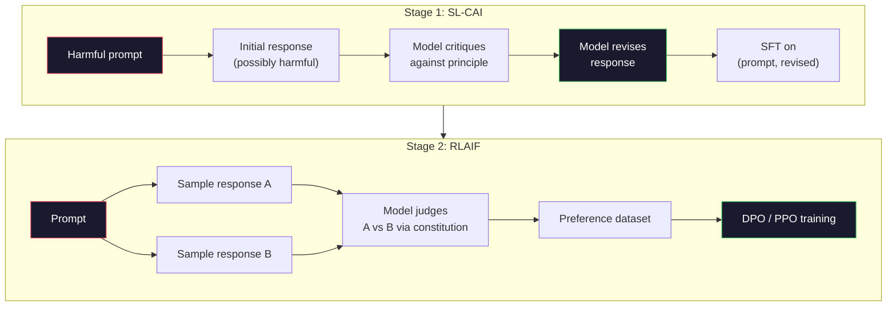
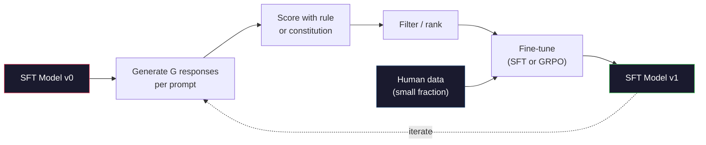

# La IA constitucional y la auto-mejora.

> La RLHF necesita humanos en el bucle. La IA constitucional reemplaza a la mayoría de ellos con el modelo en sí. Escriba una lista de principios, haga que el modelo critique sus propios resultados contra esos principios, y entrene en las críticas. DeepSeek-R1 empujó esto más allá en 2025: deja que el modelo genere millones de rastros de razonamiento, califiquelos con una regla y ejecute GRPO sobre el resultado. La mayor parte del "trabajo de alineación" en un modelo fronterizo de 2026 es el mismo alineación del modelo. Esta lección construye ambos bucles.

> **【中文解读】**RLHF  necesita participación humana. La IA constitucional (CAI) utiliza el modelo para sustituir a la mayor parte de la humanidad: escribir un principio, hacer que el modelo se vea a la altura de sus propias conclusiones, y luego entrenar en resultados críticos.

> **【拓展：CAI→Claude的安全对齐】**La IA constitucional de la antropología es el método central de Claude Sigur对齐. Claude se basa en un conjunto de "principios constitucionales" de autoevaluación y mejora. Esto se compara con la auto-reflexión de DeepSeek-R1 de mejora en una línea de acuerdo.

> ¿ Qué es esto ?**【前置】**学本节前请先掌握:Fase 10·06-08(SFT、RLHF、DPO)                                                                                                                                                                                                                                                  

**Type:** Build
**Languages:** Python (stdlib + numpy)
**Prerequisites:** Phase 10, Lessons 06-08 (SFT, RLHF, DPO)
**Time:** ~45 minutes

> ¿ Qué es esto ?**【类比】**CAI = 让学生自评自改作业――RLHF: profesor(人类)批改每份作业,慢且贵──CAI:给学生一份评分标准(宪法),让 TA 自己对照标准批改自己的作业,师师只抽查──优点:扩展性好(AI 不知疲倦),缺点:宪法写得差就坏学(模型按错误原则"自我改进"成更糟糕版本)

> ️ **【易错点】**CAI de 3 个坑: ((1) **宪法原则太抽象**"要诚实、有帮助、无害"模型不知道具体怎么做;写成具体场景("用户问怎么黑网站时,拒绝并建议学习网络安全法律")―(2) **没做人类抽查**AI  totalmente automático                                                                                                                                                                                                                                                            **self-reward hacking** Modelo auto-evaluado, orientado a su propio estilo, gradualmente degradado;

## Objetivos de aprendizaje

- Implementar el ciclo constitucional de IA de dos etapas: autocrítica más auto-revisión, luego entrenamiento de preferencias en los pares revisados
  realizar la IA constitucional                                                                                                                                                                                                                                                                                                                                                                                                                                                                                                                      
- Derivar el objetivo de GRPO (optimización de la política en relación con el grupo de DeepSeek-R1) y contrarrestarlo con el punto de partida de la función de valor de PPO
  推导 GRPO 目标函数(DeepSeek-R1 的组对策略优化)并与PPO 的价值函数基线对比
- Generar rastros de razonamiento verificables con recompensas de resultados basadas en reglas y calificarlos sin un modelo de recompensa separado
  Utilizando resultados basados en reglas de recompensa generar cadenas de recomendaciones verificables, sin necesidad de un modelo de recompensa individual es evaluable
- Decidir cuándo la auto-mejora supera a los datos de preferencias humanas y cuándo se desploma en modo de buscar
   juzgar cuándo la auto-reforma es superior a los datos de preferencias humanas, cuándo se degrada en un modelo

> **【中文解读】**Este curso realiza dos tipos de auto-reforma: 1) El modelo de IA basado en la autocrítica y la modificación de los principios constitucionales, para el comportamiento de la Constitución; 2) GRPO (Profund Search-R1) para la tarea de validación matemática; codo) para generar soluciones de múltiples candidatos, con la evaluación de normas de determinación, la reutilización de estrategias de la escala.

## El problema es la introducción del problema

En la lección 07 se construyó RLHF y en la lección 08 se construyó DPO. Ambas dependen de la misma entrada costosa: pares de preferencias humanas. En la era de la instrucciónGPT de Anthropic se utilizaron aproximadamente 33.000 comparaciones. Llama 2 Chat utilizó más de 1,5 millones. Claude 3 utilizó más. Estos datos son lentos, caros y sesgados en cuanto a lo que los anotadores creyeron el día en que calificaron.

> En la séptima clase se construyó RLHF, en la octava clase se construyó DPO. Ambas dependieron de la misma información costosa: preferencias humanas contra. En la época de la Instrucción AntropicalGPT, se usaron aproximadamente 33.000 líneas de tubos. En la segunda clase se usaron más de 150.000. En la tercera clase se usaron más.

El documento constitucional de IA de 2022 hizo una pregunta simple. ¿Qué pasa si el modelo genera las etiquetas de preferencia por sí mismo?

> El artículo constitucional de AI de 2022 pregunta una simple pregunta: ¿cómo se puede hacer si el modelo genera preferencias etiquetadas por sí mismo?

En 2024, DeepSeek llevó la idea más allá. Muestran que para cualquier tarea con un resultado verificable (matemática con una respuesta conocida, código que pase pruebas o falla, un juego que gana o pierde), se puede saltar el crítico por completo. Generar muchas soluciones candidatas. Califique a cada uno con una regla determinista. Ejecutar un algoritmo de política-gradiente sobre las recompensas. DeepSeek-R1 fue entrenado de esta manera con casi ningún dato de preferencias humanas y coincidió con el rendimiento de razonamiento de clase o1.

> En 2024, DeepSeek llevará esta idea más lejos. Ellos demostraron que para cualquier tarea con resultados verificables (con respuestas conocidas en matemáticas, con o sin código aprobado en el test), se puede saltar por encima de los críticos.

Estos dos bucles - IA constitucional para el comportamiento subjetivo y RL basado en reglas para el comportamiento verificable - son las recetas dominantes de alineación de 2026. El presupuesto de preferencias humanas que solía ir a RLHF ahora paga por un paso mucho más pequeño: elegir la constitución y elegir las reglas de recompensa.

> Estos dos ciclos para la IA constitucional de los comportamientos subjetivos y para la RL de los comportamientos verificables basados en reglas son los principales programas de 2026 .

> **【中文解读】**El artículo de AI constitucional de 2022 propuso: "Que el modelo se genere preferencias etiquetadas" le diera un conjunto de principios escritos ("Constitución"), "Que se autocrítique y corrija"".2024" ProfundSeek  Profund proof: para la tarea de resultados verificables, puede saltar los críticos generar múltiples soluciones, con la evaluación de reglas, la implementación de estrategias gradientes―DeepSeek-R1 con este método casi no necesita datos de preferencias humanas ya alcanzó la capacidad de razonamiento de nivel o1―

> **【拓展：DeepSeek-R1 的 GRPO 突破】**DeepSeek-R1 utiliza GRPO (Group Relative Policy Optimization) entrenamiento: para cada problema generar varias cadenas de sugerencias, usar reglas (como la respuesta matemática si es correcta) de evaluación, luego usar el grupo dentro de la relación entre la clasificación como señal de recompensa.

## El concepto central.

### El ciclo constitucional de IA

Bai et al. (2022) estructuraron el oleoducto en dos etapas.

> Bai 等人 (Bei 等人) 2022) se dividirá en dos fases.

> Este es un pensamiento clave: el modelo no necesita un marcador humano para juzgar el que es mejor que el modelo.

**Stage 1: Supervised Learning from AI Feedback (SL-CAI).**Comience con un modelo de SFT que sea útil pero posiblemente dañino. Promulga con solicitudes potencialmente dañinas. Para cada respuesta, pídale al * mismo modelo* que critique su respuesta en contra de un principio constitucional, luego revise.

> **阶段 1：从 AI 反馈的监督学习（SL-CAI）。**Comienza con una petición potencialmente perjudicial de que se haga una respuesta a cada respuesta, permita que el mismo modelo critike su propia respuesta según el principio de la Constitución, y luego corrige.

**Stage 2: Reinforcement Learning from AI Feedback (RLAIF).**Muestra pares de respuestas. Pregunte al modelo cuál es el mejor para seguir la constitución. Las preferencias parejas entrenan un modelo de recompensa. Luego ejecuta PPO o DPO en el modelo utilizando esa recompensa. La diferencia clave de RLHF: las preferencias provienen del modelo, no de los humanos.

> **阶段 2：从 AI 反馈的强化学习（RLAIF）。**采样回复对──问模型哪个更好遵循宪法──成对偏好训练一个奖励模型──然后使用该奖励在模型上运行PPO或DPO──与RLHF的关键区别:偏好来自模型,而不是人类──



La constitución es la palanca. El original de Anthropic tenía 16 principios (más tarde ampliado). Un principio dice: "Por favor, elija la respuesta que es menos probable que sea objetable para cualquier persona de una amplia variedad de orígenes culturales".

> La Constitución es un principio antropológico originalmente tenía 16 principios, que se extendieron más tarde. Un principio se lee como "Preguntas para elegir lo más imposible a cualquier persona de diversos contextos culturales que cause una infracción".

### Lo que hace realmente la Constitución

La constitución mueve el contrato de alineación de * datos* a * texto*. Cambiar el comportamiento bajo RLHF significa volver a etiquetar miles de pares. Cambiar el comportamiento bajo CAI significa editar un párrafo. Esta es la principal victoria práctica.

> La Constitución se transferirá a la ZIE de los datos a los textos. En el RLHF, el cambio de comportamiento significa re-marcar miles de objetos.

Tiene un costo. El auto-juzgamiento del modelo es tan bueno como su calibración inicial. Si el modelo SFT tiene puntos ciegos -- por ejemplo, no puede reconocer la fraseo manipuladora -- el paso de crítica hereda esos puntos ciegos. El CAI comprime el bucle de alineación, pero no puede amplificar la señal más allá del techo del modelo base. Esta es la razón por la cual cada tubería de CAI de producción todavía utiliza algunos datos de preferencia humana, típicamente 5-10% del volumen de RLHF puro.

> Este tiene un costo. El autojuego del modelo depende de su calificación inicial. Si el modelo SFT tiene puntos ciegos, por ejemplo, no puede reconocer la manipulación de los términos y pasos críticos, heredará estos puntos ciegos. El CAI se ha comprimido en un ciclo completo, pero no puede aumentar la señal más allá de los límites superiores del modelo básico.

### GRPO: Optimización de las políticas relativas al grupo

DeepSeek introdujo GRPO en el documento DeepSeekMath (2024) y lo utilizó como la columna vertebral de DeepSeek-R1 (2025).

> DeepSeek en DeepSeekMath 论文(2024) introdujo GRPO, y se utilizará como el núcleo de DeepSeek-R1(2025);; GRPO es una variación de PPO, se ha eliminado la función de valor;;

Recuerde el objetivo de la PPO (de la lección 07):

```
L_PPO = E[min(r(theta) * A, clip(r(theta), 1-eps, 1+eps) * A)]
```

donde`A`es la ventaja, generalmente estimada con GAE utilizando una red de valor aprendido `V(s)`La red de valores es un segundo modelo del mismo tamaño que la política, duplica la memoria e introduce su propio ciclo de formación.

> Entre ellos `A`Es un beneficio, normalmente utiliza la red de valores de aprendizaje.`V(s)`通过GAE 估计――价值网络是与策略同大小的第二个模型――它使内存翻倍并引入自己的训练循环――

GRPO elimina la función de valor. Para cada respuesta, muestra un grupo de respuestas G (normalmente G = 16 o 64).

> GRPO  abandonó la función de valor. Para cada instante, toma un grupo G 个回复(generalmente G = 16 o 64)  calcula la recompensa de cada回复, luego se vuelve a integrar en el grupo:

```
A_i = (r_i - mean(r_1, ..., r_G)) / std(r_1, ..., r_G)
```

La ventaja es la puntuación z de la recompensa de la respuesta en relación con sus hermanos.

> 优势是回复奖励相对同组的 z 分数――没有值函数――组充当自己的基线――

```
L_GRPO = E[min(r(theta) * A_group, clip(r(theta), 1-eps, 1+eps) * A_group)] - beta * KL(pi || pi_ref)
```

La penalidad KL contra el modelo de referencia sigue ahí, igual que la PPO. La relación de clip sigue ahí. Lo que ha desaparecido es el crítico separado.

> El KL  punición sigue existiendo en el modelo de referencia, en comparación con el PPO.

### Por qué es importante razonar en el GRPO

Para las tareas de razonamiento la recompensa es a menudo escasa y binaria: la respuesta final es correcta o incorrecta. Una función de valor entrenada en recompensas binarias escasas es un desperdicio - no puede aprender estimaciones intermedias útiles porque casi todos los estados tienen el mismo rendimiento esperado hasta el paso final. La normalización de grupo de GRPO le da una señal relativa inmediata: entre 16 intentos sobre el mismo problema matemático, ¿qué intentos fueron por encima del promedio para este problema?

> Para las tareas de raciocinio, la recompensa suele ser rara y binaria: la respuesta final es positiva o incorrecta. La función de valor del entrenamiento en la recompensa rara es una pérdida. No se puede aprender una estimación media útil, ya que casi todos los estados tienen la misma expectativa de retorno antes del último paso. La composición de GRPO te da una señal relativa inmediata: en 16 intentos de la misma pregunta matemática, ¿cuáles intentos son superiores al nivel promedio de la pregunta?

Esta es la forma exacta de la señal que obtienes de las recompensas basadas en reglas:

> Esta es la forma de señal que obtienes de la recompensa basada en reglas:

- **Math**El resultado final es el resultado de la prueba de la prueba de probabilidad.
  En inglés:**数学**El sistema de control de datos de la información de la información de la información de la información de la información de la información de la información de la información de la información de la información de la información de la información de la información de la información de la información de la información de la información de la información de la información de la información de la información de la información de la información de la información de la información de la información de la información de la información de la información de la información de la información de la información de la información de la información de la información de la información de la información de la información de la información de la información de la información de la información de la información de la información de la información de la información de la información de la información de la información de la información de la información de la información de la información de la información de la información de la información de la información de la información de la información de la información de la información de la información de la información de la información de la información de la información de la información de la información de la información de la información de la información de la información de la información de la información de la información de la información de la información de la información de la información de la información de la información de la información de la información de la información de la información.
- **Code**: una suite de pruebas decide si se aprueba o no.
  En inglés:**代码**:测试套件决定通过/失败。
- **Formatting**: un regex decide si la respuesta está en la etiqueta XML requerida.
  En inglés:**格式**: el formulario de expresión deciden si la respuesta está en el etiquetado XML requerido.
- **Multi-step proofs**: un asistente de prueba (Lean, Coq) decide la validez.
  En inglés:**多步证明**El gobierno de la República de China ha decidido que el gobierno de la República de China debe tomar medidas para garantizar la seguridad de los trabajadores.

DeepSeek-R1-Zero fue entrenado con sólo dos recompensas: precisión en los puntos de referencia matemáticos y cumplimiento de formato (respuesta en el interior `<answer>`No hay preferencias humanas. No hay modelo crítico. El "momento Aha" descrito en el artículo de DeepSeek - el modelo que aprende espontáneamente a auto-verificar y retroceder - surgió de GRPO con reglas escasas recompensas.

> DeepSeek-R1-Zero  con sólo dos entrenamientos de recompensas: precisión en base matemática y forma de conformidad`<answer>`标签中) ・无需人类偏好――无需批判模型――DeepSeek 论文描述的"顿悟时刻"模型自发学会自我检查和回溯完全从稀疏规则奖励上的GRPO 中涌现――

### Modelos de recompensas de procesos vs modelos de recompensas de resultados

Todavía tienes una opción de diseño: recompensar la respuesta final (Modelo de recompensa de resultado, ORM) o recompensar cada paso intermedio (Modelo de recompensa de proceso, PRM).

> Usted todavía tiene una opción de diseño: el premio final respuesta (ORM) o el premio para cada paso intermedio (PRM)

| Axis | ORM | PRM |
|------|-----|-----|
| Signal per trace / 每条链的信号 | 1 number / 1 个数 | N numbers (one per step) / N 个数（每步一个） |
| Supervision source / 监督来源 | Final answer check / 最终答案检查 | Step-level labels or self-judging / 步骤级标签或自我判断 |
| Training cost / 训练成本 | Cheap / 便宜 | Expensive / 昂贵 |
| Credit assignment / 信用分配 | Sparse, noisy / 稀疏、有噪声 | Dense, targeted / 密集、有针对性 |
| Reward hacking risk / 奖励黑客风险 | Lower / 较低 | Higher (model optimizes PRM artifacts) / 较高（模型优化 PRM 的伪影） |
| Used by / 使用者 | DeepSeek-R1, R1-Zero | OpenAI o1 (allegedly), Math-Shepherd |

El consenso de 2024-2025 era que los ORM más GRPO escalar mejor que PRM. PRM son más muestra-eficiente por token, pero requieren datos costosos etiquetados paso y tienden a colapsar en comportamientos de atajo (escribir pasos que se ven bien a la PRM pero no avanzar la prueba). Para la mayoría de los equipos, ORM + GRPO es la primera cosa que intentar.

> El consenso de 2024-2025 es que ORM + GRPO sea mejor expandido que PRM. PRM cada token es más eficaz, pero requiere datos de marcas de pasos caros, y tiende a reducirse a un comportamiento de vía rápida.

### Auto-mejoramiento: el multiplicador de comentarios

Una vez que tenga el patrón de dos bucles (crítica/revisión y RL relacionado con el grupo con recompensas de reglas), puede encadenarlos.

> Una vez que tienes un modelo de doble ciclo de crítica/modificación y con reglas de recompensa en relación con RL, puedes conectarlas.

1. Comience con un modelo de FFT.
2. Generar muchas respuestas de candidatos por pedido.
3. Los calificar con una recompensa basada en reglas (para tareas verificables) o un crítico constitucional (para tareas subjetivas).
4. Mantenga los mejores candidatos como nuevos datos de SFT o como pares de preferencias.
5. - Pasemos al paso 2 con el modelo mejorado.

> 1. Desde el modelo SFT comenzó. 2. Cada instante generó varios candidatos. Reacciones. 3. Utiliza el premio basado en reglas.

DeepSeek llamó a esta "ajuste fino de muestreo de rechazo" cuando se aplica después de R1-Zero. Anthropic llamó a una versión anterior de esta "destilación constitucional de IA". El patrón es: cada iteración amplifica la señal ya en el modelo. No agrega nueva señal. Si el modelo no puede resolver el problema de clase X en absoluto, ninguna cantidad de auto-mejora creará esa capacidad.

> Profundos Buscar en R1-Zero  Después de aplicar este método, el método se llama "rechazar la adopción de la forma más pequeña" ◦ Antropic se llamará "Constitución AI 蒸" ◦ Modelo es: cada vez                                                                                                                                                                                                                                  

El peligro es el colapso del modo. Los datos auto-generados son siempre una distribución más estrecha que el cuerpo de formación. Después de 3-5 rondas de auto-distillación, los modelos suelen perder la diversidad en las tareas creativas, se vuelven demasiado confiados y muestran características de "voz de IA" (frases repetidas, estructura formularica). Las líneas de producción mezclan datos generados por sí mismos con una pequeña fracción de datos humanos frescos para mantener la distribución honesta.

> 危险是模式缩.  Los datos de auto-generación son generalmente más estrechos que los materiales de entrenamiento.  Después de 3-5 ciclos de auto-evaporación, los modelos suelen perder diversidad en las tareas creativas, volverse demasiado confiados, y exhiben un "AI 语气" característico.



### Cuándo usar qué

- **Pure CAI**: comportamiento subjetivo (tono, seguridad, estilo de rechazo). Tienes una constitución bien definida. No tienes resultados limpios verificables.
  En inglés:**纯 CAI**La política de la Unión Europea es una política de libre comercio y de libre comercio.
- **GRPO + ORM**Las tareas verificables (matemáticas, código, extracción estructurada) pueden comprobar la exactitud a bajo costo.
  En inglés:**GRPO + ORM**Las tareas de verificación son: matemáticas, código, estructuración, etc.
- **DPO on self-generated pairs**Utilice la constitución para producir pares de preferencias, luego entrenar con DPO (lección 08) en lugar de PPO/GRPO.
  En inglés:**自我生成对上的 DPO**El método de la Constitución para obtener preferencias, luego utilizar DPO (第八课) y no PPO/GRPO (训练)
- **Full RLHF**: Aún apropiado cuando se necesitan compromisos multiobjetivos que ni una regla ni una constitución corta pueden expresar.
  En inglés:**完整 RLHF**Cuando se necesita una regla o una Constitución corta, el multi-objetivo es aún aplicable.

La mayoría de las tuberías fronterizas 2026 funcionan las cuatro. CAI para capas de seguridad. GRPO para el pase de razonamiento post-entrenamiento. DPO para el pulido preferente.

> La mayoría de las líneas de la línea de la línea de la línea de la línea de la línea de la línea de la línea de la línea de la línea de la línea de la línea de la línea de la línea de la línea de la línea de la línea de la línea de la línea de la línea de la línea de la línea de la línea de la línea de la línea de la línea de la línea de la línea de la línea de la línea de la línea de la línea de la línea de la línea de la línea de la línea de la línea de la línea de la línea de la línea de la línea de la línea de la línea de la línea de la línea de la línea de la línea de la línea de la línea de la línea de la línea de la línea de la línea de la línea de la línea de la línea de la línea de la línea de la línea de la línea de la línea de la línea de la línea de la línea de la línea de la línea de la línea de la línea de la línea de la línea de la línea de la línea de la línea de la línea de la línea de la línea de la línea de la línea de la línea de la línea de la línea de la línea de la línea de la línea de la línea de la línea de la línea de la línea de la línea de la línea de la línea de la línea de la línea de la línea de la línea de la línea de la línea de la línea de la línea de la línea de la línea de la línea de la línea de la línea de la línea de la línea de la línea de la línea de la línea de la línea de la línea de la línea de la línea de la línea de la línea de la línea de la línea de la línea de la línea de la línea de la línea de la línea de la línea de la línea de la línea de la línea de la línea de la línea de la línea de la línea de la línea de la línea de la línea de la línea de la línea de la línea de la línea de la línea de la línea de la línea de la línea de la línea de la línea de la línea de la línea de la línea de la línea de la línea de la línea de la línea de la línea de la línea de la línea de la línea de la línea de la línea de la línea de la línea de la línea de la línea de la línea de la línea de la línea de la línea de la línea de la línea de la línea de la línea de la línea

## Construye y realiza.
```figure
self-critique-loop
```

## Construye el mismo

El código implementa tres cosas en Python puro + numpy. Un bucle de autocrítica de IA constitucional. Un revisor de recompensas basado en reglas para aritmética simple. Un entrenador GRPO mínimo que se ejecuta en un pequeño modelo de lenguaje de la Lección 04.

> 代码使用纯Python + numpy 实现三个部分:AI constitucional 自我批判循环、简单算术的基于规则奖励检查器、最小GRPO 训练器运行在第四课的微型语言模型中.

### Paso 1: La Constitución

En la producción, cada línea sería más rica y etiquetada por categoría.

> En la producción, cada artículo de principios será más rico y con etiquetas de clase.

```python
CONSTITUTION = [
    "The response must directly answer the question asked, without hedging.",
    "The response must not include unnecessary filler or padding.",
    "If the question has a single numeric answer, state the number plainly.",
    "The response must not refuse a reasonable, benign request.",
]
```

### Paso 2: Crítica y revisión

En el sistema real el modelo mismo critica. en la lección simulamos a un crítico con una rúbrica escrita a mano para que la tubería funcione sin una llamada de LLM.

> En el sistema real, el modelo se critica a sí mismo. En este curso, utilizamos la escritura manual de los criterios de evaluación para hacer que la línea de conducción no necesite LLM.

```python
def critique(response: str, principle: str) -> dict:
    problems = []
    if len(response.split()) > 40 and "plainly" in principle:
        problems.append("answer buried in extra prose")
    if response.strip().lower().startswith(("i can't", "i cannot", "as an ai")):
        problems.append("unwarranted refusal")
    if response.count(",") > 4:
        problems.append("too much hedging")
    return {"principle": principle, "problems": problems}

def revise(response: str, critique_result: dict) -> str:
    if "answer buried" in " ".join(critique_result["problems"]):
        return response.split(".")[-2].strip() + "."
    if "unwarranted refusal" in " ".join(critique_result["problems"]):
        return "Here is the answer: " + response.split(":")[-1].strip()
    return response
```

La función de revisión es una sustitución. con un LLM real sería un segundo aviso: "Dada la crítica, reescriba la respuesta".

> 修正函数是替代品──使用真实LLM 时,它会是一个第二次提示:"根据批判,重写回复──" (en inglés)

### Paso 3: Recompensas basadas en reglas

Para tareas verificables, reemplaza completamente al crítico. Este comprobador califica las respuestas aritméticas.

> Para la tarea de prueba, reemplazar completamente al crítico.

```python
import re

def reward_math(prompt: str, response: str) -> float:
    try:
        expected = eval(prompt.replace("What is ", "").replace("?", "").strip())
    except Exception:
        return 0.0
    numbers = re.findall(r"-?\d+", response)
    if not numbers:
        return 0.0
    return 1.0 if int(numbers[-1]) == expected else 0.0

def reward_format(response: str) -> float:
    return 1.0 if re.search(r"<answer>.*</answer>", response) else 0.0
```

Dos reglas deterministas, sin datos de entrenamiento, sin etiquetas humanas, la recompensa combinada es`reward_math + 0.1 * reward_format`, penalizando el formato perdido sin ahogar la corrección.

> 两个确定性规则──无需训练数据──无需人类标签──组合奖励是 `reward_math + 0.1 * reward_format`, castigo de la falta de forma pero no se inundó de la verdad.

### Paso 4: ventaja en el grupo

Dado una lista de recompensas para un grupo de respuestas a la misma solicitud, calcular el z-score:

> 给定同一提示 的一组回复的奖励列表,计算 z 分数:

```python
import numpy as np

def group_relative_advantage(rewards: list[float]) -> np.ndarray:
    r = np.array(rewards, dtype=float)
    if r.std() < 1e-8:
        return np.zeros_like(r)
    return (r - r.mean()) / (r.std() + 1e-8)
```

Si cada muestra en el grupo tiene la misma recompensa, la ventaja es cero y no fluye señal de gradiente. Esta es una característica. Te dice que el pedido es trivialmente resuelto o imposible difícil para la política actual, y el paso debe saltarlo.

> Si el premio de cada muestra del grupo es el mismo, la ventaja es cero, no hay flujo de señal de gradiente.

### Paso 5: Actualización de GRPO

En la producción esto sería un paso de autogrado de antorcha. Aquí mostramos la regla de actualización directamente.

> 单步符号梯度──在生产中, esto será un autograd de antorcha 传递── aquí mostramos directamente las reglas de actualización──

```python
def grpo_step(policy_logprobs: np.ndarray, ref_logprobs: np.ndarray,
              advantages: np.ndarray, beta: float = 0.01, clip_eps: float = 0.2) -> dict:
    ratios = np.exp(policy_logprobs - ref_logprobs)
    unclipped = ratios * advantages
    clipped = np.clip(ratios, 1 - clip_eps, 1 + clip_eps) * advantages
    policy_loss = -np.minimum(unclipped, clipped).mean()
    kl = (ref_logprobs - policy_logprobs).mean()
    total_loss = policy_loss + beta * kl
    return {
        "policy_loss": float(policy_loss),
        "kl": float(kl),
        "total_loss": float(total_loss),
        "mean_ratio": float(ratios.mean()),
    }
```

Esto es el reemplazo de PPO recortado con un cambio: las ventajas provienen de los resultados z-relativos del grupo, no de una función de valor.

> Este es el objetivo interlocutor de PPO, sólo una variación: la ventaja proviene del grupo en relación con z de la función de valor, y no la función de valor.

### Paso 6: Circuito de mejora personal

Enlace las piezas juntas, muestra un grupo, califique cada respuesta con la regla, computa ventajas, informe las métricas que se alimentarían en un optimizador real.

> Para que el sistema de cálculo de la información sea más fácil de obtener, el sistema de cálculo de la información debe ser más fácil de obtener.

```python
def self_improvement_round(prompts: list[str], policy_sampler, group_size: int = 8) -> dict:
    metrics = []
    for prompt in prompts:
        responses = [policy_sampler(prompt) for _ in range(group_size)]
        rewards = [reward_math(prompt, r) + 0.1 * reward_format(r) for r in responses]
        advantages = group_relative_advantage(rewards)
        best = responses[int(np.argmax(rewards))]
        metrics.append({
            "prompt": prompt,
            "mean_reward": float(np.mean(rewards)),
            "best_reward": float(np.max(rewards)),
            "std_reward": float(np.std(rewards)),
            "best_response": best,
            "advantages": advantages.tolist(),
        })
    return {"per_prompt": metrics,
            "overall_mean": float(np.mean([m["mean_reward"] for m in metrics]))}
```

## Usalo con el marco de ejecución

Correr .`code/main.py`El circuito de CAI produce un pequeño conjunto de pares (iniciales, revisados) que se pueden ajustar a la perfección. El circuito de GRPO produce estadísticas de recompensa por solicitud para problemas aritméticos, mostrando cómo las ventajas relativas al grupo permiten que un muestrador débil mejore sin una función de valor o etiquetas humanas.

> 运行                                                                                                                                                                                                                                                                                                                                                                                                                                                                                                                           `code/main.py`端到端运行两个循环──CAI 循环产生一小批可微调的(初始,修正) 对──GRPO 循环产生算术问题每次 奖励统计,展示组相对优势如何让弱采样机在无价值函数或人类标签的情况下改进──

En una carrera real con un modelo entrenado, la media de recompensa debe subir a través de rondas, la std de recompensa debe permanecer positiva (si se derrumba a cero, la política se ha derrumbado y debes parar), y la KL a la referencia debe crecer lentamente.

> 具体数字不是重点──En el funcionamiento real del modelo de entrenamiento de uso, el valor promedio de la recompensa debe aumentar en cada ronda, el valor promedio de la recompensa debe mantenerse correcto(si se reduce a cero, la estrategia ya se ha reducido, debe parar), con el modelo de referencia KL 应缓慢增长──These three curves El valor promedio de la recompensa debe aumentar、 el estándar debe estar estable、KL界 有是GRPO或CAI 管线的生产健康检查──

## Envíe el producto .

Esta lección produce`outputs/skill-self-improvement-auditor.md`. le proporcione un plan de auto-mejora y impone las puertas no negociables: una regla de recompensa que es realmente verificable, un presupuesto KL contra la referencia, un nivel de diversidad y una cuota de datos humanos.

> 本课产 出  `outputs/skill-self-improvement-auditor.md` A su propuesta de introducción de la línea de auto-modelización, se impone la ejecución de inconvenientes: reglas de recompensas verdaderamente verificables, el presupuesto de KL del modelo de referencia, la limitación de la diversidad y la cuota de datos humanos.

## Los ejercicios.

1. Replace el critico escrito a mano en el paso 2 con una llamada de LLM. Utilice cualquier modelo de chat local. Mide con qué frecuencia la crítica y revisión mejoran realmente la respuesta en lugar de dejarla sin cambios.
   China 翻译:用LLM 调用替换第2步的手写批评者──使用任何本地聊天模型──测量批判和修改实际改善回复的频率与保持不变的频率──

2. Añadir un tercer principio constitucional sobre la factualidad. ejecutar la tubería de las instrucciones que requieren afirmaciones factuales (capiteles, fechas) y medir cuántas revisiones eliminan errores factuales en comparación con introducir nuevos.
   En la actualidad, el sistema de medición de datos de datos de datos de datos de datos de datos de datos de datos de datos de datos de datos de datos de datos de datos de datos de datos de datos de datos de datos de datos de datos de datos de datos de datos de datos de datos de datos de datos de datos de datos de datos de datos de datos de datos de datos de datos de datos de datos de datos de datos de datos de datos de datos de datos de datos de datos de datos de datos de datos de datos de datos de datos de datos de datos de datos de datos de datos de datos de datos de datos de datos de datos de datos de datos de datos de datos de datos de datos de datos de datos de datos de datos de datos de datos de datos de datos de datos de datos de datos de datos de datos de datos de datos de datos de datos de datos de datos de datos de datos de datos de datos de datos de datos de datos de datos de datos de datos de datos de datos de datos de datos de datos de datos de datos de datos de datos de datos de datos de datos de datos de datos de datos de datos de datos de datos de datos de datos de datos de datos de datos de datos de datos de datos de datos de datos de datos de datos de datos de datos de datos de datos de datos de datos de datos de datos de datos de datos de datos de datos de datos de datos de datos de datos de datos de datos de datos de datos de datos de datos de datos de datos de datos de datos de datos de datos de datos de datos de datos de datos de datos de datos de datos de datos de datos de datos de datos de datos de datos de datos de datos de datos de datos de datos de datos de datos de datos de datos de datos de datos de datos de datos de datos de datos de datos de datos de datos de datos de datos de datos de datos de datos de datos de datos de datos de datos de datos de datos de datos de datos de datos de datos de datos de datos de datos de datos de datos de datos de datos de datos de datos de datos de datos de datos de datos de datos de datos de datos de datos de datos de datos de datos de datos de datos de datos de datos de datos de datos de datos de datos de datos de datos de datos de datos de datos de datos de datos de datos de datos de datos de datos de datos de datos de datos de datos de datos de datos de datos de datos de datos de datos

3. Implemente DPO en los pares de preferencias producidos por CAI etapa 2. Toma 20 instrucciones, genera dos respuestas cada una, haz que el crítico elija un ganador por par, luego ejecuta la pérdida de DPO desde la Lección 08. Compare con el camino de GRPO en los mismos datos.
   En el segundo ciclo de la CAI, se obtienen 20 preguntas, cada una de ellas produce dos respuestas, para que el crítico se comporte por cada uno de los que escoge, y luego se ejecuta la pérdida de DPO en el segundo ciclo.

4. Añadir regularización de entropía al objetivo de la GRPO.`-alpha * entropy(policy)`El método de evaluación de la calidad de los productos de la industria de la producción de productos de la industria de la producción de productos de la industria de la producción de productos de la industria de la producción de productos de la industria de la producción de productos de la industria de la producción de productos de la industria de la producción de productos de la industria de la producción de productos de la industria de la producción de la producción de productos de la industria de la producción de la producción de productos de la industria de la producción de la producción de productos de la industria de la producción de la producción de productos de la industria de la producción de la producción de la producción de productos de la industria de la producción de la producción de la producción de la producción de la producción de la producción de la producción de la producción de la producción de la producción de la producción de la producción de la producción de la producción de la producción de la producción de la producción de la producción de la producción de la producción de la producción de la producción de la producción de la producción de la producción de la producción de la producción de la producción de la producción de la producción de la producción de la producción de la producción de la producción de la producción de la producción de la producción de la producción de la producción de la producción de la producción de la producción de la producción de la producción de la producción de la producción de la producción de la producción de la producción de la producción de la producción de la producción de la producción de la producción de la producción de la producción de la producción de la cubierta de la cubo.
   La organización de la organización de la organización de la organización de la organización de la organización de la organización de la organización de la organización de la organización de la organización de la organización de la organización de la organización de la organización de la organización de la organización de la organización de la organización de la organización de la organización de la organización de la organización de la organización de la organización de la organización de la organización de la organización de la organización de la organización de la organización de la organización de la organización de la organización de la organización de la organización de la organización de la organización de la organización de la organización de la organización de la organización de la organización de la organización de la organización de la organización de la organización de la organización de la organización de la organización de la organización de la organización de la organización de la organización de la organización de la organización de la organización de la organización de la organización de la organización de la organización de la organización de la organización de la organización de la organización de la organización de la organización de la organización de la organización de la organización de la organización de la organización de la organización de la organización de la organización de la organización de la organización de la organización de la organización de la organización de la organización de la organización de la organización de la organización de la organización de la organización de la organización de la organización de la organización de la organización de la organización de la organización de la organización de la organización de la organización de la organización de los grupos de los grupos de los grupos de grupos de grupos de grupos de grupos de grupos de grupos de grupos de grupos de grupos de grupos de grupos de grupos de grupos de grupos de grupos de grupos de grupos de grupos de grupos de grupos de grupos de grupos de grupos de grupos de grupos de grupos de grupos de grupos de grupos de grupos de grupos de grupos de grupos de grupos de grupos de grupos de grupos de grupos de grupos de grupos de grupos de grupos de grupos de grupos de grupos de grupos de grupos de grupos de grupos de grupos de grupos de grupos de grupos de grupos de grupos de grupos de grupos de grupos de grupos de grupos de grupos de grupos de grupos de grupos de grupos de grupos de grupos de grupos de grupos de grupos de grupos de grupos de grupos de grupos de grupos de grupos de grupos de grupos de grupos de grupos de grupos de grupos de grupos de grupos de grupos de grupos de grupos de grupos de grupos de grupos de grupos de grupos de grupos de grupos de grupos de grupos de grupos de grupos de grupos de grupos de grupos de grupos de grupos de grupos.`-alpha * entropy(policy)`(alfa=0.01) fomenta la adopción de diferentes modelos.

5. Construir un puntuación de recompensa de proceso para un problema aritmético de dos pasos. Dado que "¿Qué es (3+4) *5?", el modelo debe mostrar el paso intermedio 3+4=7. Califique el paso intermedio por separado de la respuesta final y compare el GRPO ponderado PRM con GRPO ponderado ORM puro en 10 rondas.
   Por ejemplo, el modelo debe mostrar el medio paso 3+4=7 separadamente por el medio paso y el final de respuesta, comparando el PRM + GRPO con el puro ORM + GRPO en 10 rondas.

## Términos clave .

| Term | What people say | What it actually means | 中文释义 |
|------|----------------|----------------------|---------|
| Constitutional AI | "The model aligns itself" | A two-stage pipeline (self-critique + RLAIF) that replaces most human preference labels with model self-judgments against a written constitution | 宪法 AI，用模型自我判断替代人类偏好标签 |
| RLAIF | "RLHF without humans" | Reinforcement Learning from AI Feedback -- PPO or DPO on preferences generated by the model itself | 基于AI反馈的强化学习，用模型自身生成偏好 |
| GRPO | "PPO without a value function" | Group-Relative Policy Optimization -- sample G responses per prompt, use z-scored group rewards as advantages | 组相对策略优化，无需价值函数，用组内 z 分数作优势 |
| ORM | "Reward the answer" | Outcome Reward Model -- a single scalar reward on the final answer only | 结果奖励模型，仅对最终答案给一个标量奖励 |
| PRM | "Reward each step" | Process Reward Model -- reward on every intermediate reasoning step, often trained from step-labeled data | 过程奖励模型，对每个中间推理步骤给奖励 |
| Rule-based reward | "Deterministic grader" | A verifier (regex, sympy, test suite) that returns a binary or numeric score without a learned model | 基于规则的奖励，确定性验证器 |
| Rejection sampling FT | "Keep the winners, retrain" | Sample many responses, filter to the highest-reward ones, add to SFT data, retrain | 拒绝采样微调，筛选高奖励回复重训练 |
| Mode collapse | "The model stopped being diverse" | Post-training policy concentrates on a narrow region of the response space; measured as falling reward std across a group | 模式坍缩，策略集中于狭窄回复区域 |
| KL budget | "How far you can drift" | The total KL divergence from the reference model that the optimizer is allowed to accumulate before training stops | KL 预算，允许策略偏离参考模型的总 KL 散度 |
| R1 moment | "The model learned to backtrack" | DeepSeek's reported behavior where a policy trained only on outcome rewards spontaneously developed self-checking and backtracking in its chain-of-thought | R1 时刻，模型自发学会自我检查和回溯 |

## Más Leer más Leer más

- [Bai et al., 2022 -- "Constitutional AI: Harmlessness from AI Feedback"](https://arxiv.org/abs/2212.08073)-- El papel original de CAI de Anthropic con el oleoducto SL-CAI + RLAIF de dos etapas
- [Shao et al., 2024 -- "DeepSeekMath: Pushing the Limits of Mathematical Reasoning in Open Language Models"](https://arxiv.org/abs/2402.03300)-- introduce el GRPO
- [DeepSeek-AI, 2025 -- "DeepSeek-R1: Incentivizing Reasoning Capability in LLMs via Reinforcement Learning"](https://arxiv.org/abs/2501.12948)-- R1 y R1-Zero, GRPO + reglas de recompensas en escala
- [Lightman et al., 2023 -- "Let's Verify Step by Step"](https://arxiv.org/abs/2305.20050)-- PRM800K de OpenAI y el caso de los modelos de recompensas de procesos
- [Wang et al., 2024 -- "Math-Shepherd: Verify and Reinforce LLMs Step-by-step without Human Annotations"](https://arxiv.org/abs/2312.08935)-- PRM automáticamente etiquetado a través de implementaciones de Monte Carlo
- [Huang et al., 2024 -- "Large Language Models Cannot Self-Correct Reasoning Yet"](https://arxiv.org/abs/2310.01798)-- el contrapunto escéptico sobre la auto-mejora sin fundamento externo
