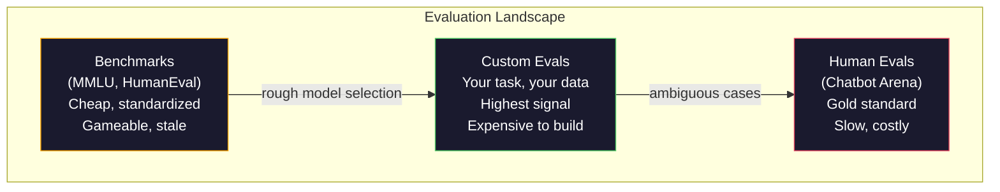
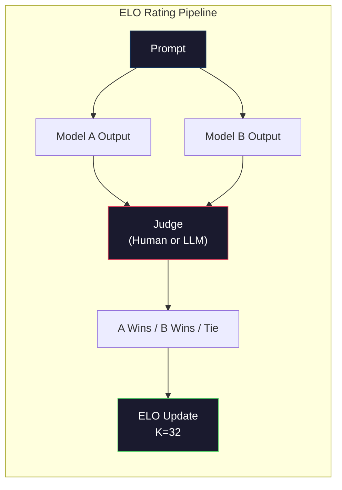

# Evaluación: índices de referencia, Evals, LM Harness.

> Ley de Goodhart: cuando una medida se convierte en un objetivo, deja de ser una buena medida. Cada juego de laboratorio fronterizo marca un punto de referencia. Las puntuaciones de MMLU aumentan mientras que los modelos aún no pueden contar confiablemente el número de R en "fresa". La única evaluación que importa es su evaluación - en su tarea, con sus datos.

> **【中文解读】**Cuando un indicador se convierte en un objetivo, ya no es un buen indicador.

> **【拓展：LLM评测→实际应用】**LLM 评测体系包括:MMLU 知识) 、HumanEval 代码) 、MATH  math) 、Arena  Prefiencias humanas) ⋅ pero en la aplicación real lo más importante es tu propia evaluación  en tu propia tarea y datos ⋅测试──

> ¿ Qué es esto ?**【前置】**学本节前请先掌握:Fase 10·01-05(LLM 基础);Fase 11·10(Evaluación)生产LLM 应用的评估──本节聚焦模型本身的评估──

> ¿ Qué es esto ?**【类比】**Referencia general: Referencia general: Referencia general: Referencia general: Referencia general: Referencia general: Referencia general: Referencia general: Referencia general: Referencia general: Referencia general: Referencia general: Referencia general: Referencia general: Referencia general: Referencia general: Referencia general: Referencia general: Referencia general: Referencia general: Referencia general: Referencia general: Referencia general: Referencia general: Referencia general: Referencia general: Referencia general: Referencia general: Referencia general: Referencia general: Referencia general: Referencia general: Referencia general: Referencia general: Referencia general: Referencia general: Referencia general: Referencia general: Referencia general: Referencia general: Referencia general: Referencia general: Referencia general: Referencia general: Referencia general: Referencia general: Referencia general: Referencia general: Referencia general: Referencia general: Referencia general: Referencia general: Referencia general: Referencia general: Referencia general: Referencia general: Referencia general: Referencia general: Referencia general: Referencia general: Referencia general: Referencia general: Referencia general: Referencia general: Referencia general: Referencia general: Referencia general: Referencia general: Referencia general: Referencia general: Referencia general: Referencia general: Reference to referencia general: Reference to reference to reference to reference to reference to reference to reference to reference to reference to reference to reference to reference to reference to reference to reference to reference to reference to reference to reference to reference to reference to reference to reference to reference to reference to reference to reference to reference to reference to reference to reference to reference to reference to reference to reference to reference to reference to reference to reference to reference to reference to reference to reference to reference to reference to reference to reference to reference to reference to reference to reference to to reference to reference to to reference to reference to reference to reference to reference to reference to reference to reference to reference to reference to reference to reference to reference to to reference to reference to to to to reference to reference

**Type:** Build
**Languages:** Python
**Prerequisites:** Phase 10, Lessons 01-05 (LLMs from Scratch)
**Time:** ~90 minutes

## Objetivos de aprendizaje

- Construir un arnés de evaluación personalizado que ejecute puntos de referencia de múltiples opciones y de límite abierto en comparación con un modelo de lenguaje
  Construir herramientas de evaluación de autodeterminación, para el modelo de lenguaje de la ejecución de múltiples opciones y pruebas abiertas de base
- Explicar por qué los valores de referencia estándar (MMLU, HumanEval) se saturan y no diferencian los modelos fronterizos
  解释为什么标准基准(MMLU、HumanEval) 会和且无法区分前沿模型
- Implementar evaluaciones específicas de tareas con métricas adecuadas: coincidencia exacta, F1, BLEU y puntuación LLM-as-judge
  实现带正确指标的任务特定评测:精确匹配、F1、BLEU 和 LLM-as-judge 评分
- Diseñar una suite de evaluación personalizada dirigida a su caso de uso específico en lugar de depender únicamente de tablas de clasificación públicas
  Designado para un conjunto de evaluación de autodefinición de un caso específico, y no solo en función de la clasificación pública

> **【中文解读】**Este curso se centra en la práctica de ingeniería de evaluación de LLM. El punto de vista central: public基准 (MMLU, HumanEval) ha sido comprimido y, en el modelo de vanguardia, el porcentaje de compresión se reduce a 3 分, la diferencia es el ruido estadístico y no la diferencia de capacidad real.

## El problema es la introducción del problema

MMLU fue publicado en 2020 con 15.908 preguntas en 57 temas. En tres años, los modelos fronterizos lo saturaron. GPT-4 obtuvo 86,4%. Claude 3 Opus obtuvo 86,8%. Llama 3 405B obtuvo 88,6%.

> MMLU  fue publicado en 2020, conteniendo 15.908 preguntas de 57 disciplinas. En tres años, el modelo de vanguardia se encuentra en el mismo. GPT-4 obtiene 86,4%, Claude 3 Opus obtiene 86,8%, Llama 3 405B obtiene 88,6%.

Mientras tanto, esos mismos modelos fallan en tareas que un niño de 10 años maneja sin pensar. Claude 3.5 Sonnet, con un puntaje del 88.7% en MMLU, inicialmente no podía contar las letras en "fresa" -- una tarea que requiere cero conocimiento del mundo y cero razonamiento, sólo la iteración a nivel de personajes. HumanEval prueba la generación de código con 164 problemas. Los modelos obtienen un puntaje de más del 90% mientras producen código que se estropea en los casos de borde que cualquier desarrollador junior atraparía.

> Al mismo tiempo, estos modelos fracasaron en la tarea que los niños de 10 años no pensaban que podían completar. Claude 3.5 Sonnet MMLU obtuvo un puntaje del 88.7%, pero inicialmente no podía contar "frutas" en algunas r Esta tarea no requería ningún conocimiento o raciocinio mundial, sólo requería un nivel de caracteres. HumanEval utilizó 164 problemas para generar código de prueba. El modelo obtuvo un puntaje del 90%+, pero todavía produjo cualquier desarrollador primario que pudiera capturar un código de colapso de bordes.

La brecha entre el rendimiento de los valores de referencia y la fiabilidad del mundo real es el problema central de la evaluación de los LLM. Los puntos de referencia le dicen cómo funciona un modelo en el punto de referencia. No te dicen casi nada sobre cómo ese modelo se desempeñará en tu tarea específica, con tus datos específicos, bajo tus modos de falla específicos. Si estás construyendo un bot de atención al cliente, MMLU es irrelevante. Si estás construyendo un asistente de código, HumanEval sólo cubre la generación a nivel de función, no dice nada sobre depurar, refactorar o explicar el código en archivos.

> 基准 基准 基准 基准 基准 基准 基准 基准 基准 基准 基准 基准 基准 基准 基准 基准 基准 基准 基准 基准 基准 基准 基准 基准 基准 基准 基准 基准 基准 基准 基准 基准 基准 基准 基准 基准 基准 基准 基准 基准 基准 基准 基准 基准 基准 基准 基准 基准 基准 基准 基准 基准 基准 基准 基准 基准 基准 基准 基准 基准 基准 基准 基准 基准 基准 基准 基准 基准 基准 基准 基准 基准 基准 基准 基准 基准 基准 基准 基准 基准 基准 基准 基准 基准 基准 基准 基准 基准 基准 基准 基准 基准 基准 基准 基准 基准 基准 基准 基准 基准 基准 基准 基准 基准 基准 基准 基准 基准 基准 基准 基准 基准 基准 基准 基准 基准 基准 基准 基准 基准 基准 基准 基准 基准 基准 基准 基准 基准 基准 基准 基准 基准 基准 基准 基准 基准 基准 基准 基准 基准 基准 基准 基准 基准 基准 基准 基准 基准 基准 基准 基准 基准 基准 基准 基准 基准 基准 基准 基准 基准 基准 基准 基准 基准 基准 基准 基准 基准 基准 基准

Necesitas evaluaciones personalizadas. No porque los puntos de referencia sean inútiles, son útiles para la selección aproximada de modelos, sino porque la evaluación final debe coincidir exactamente con las condiciones de implementación.

> Usted necesita autoevaluación. No es porque el base de datos no sea útil para la selección de modelos más o menos, sino porque la evaluación final debe adaptarse completamente a las condiciones de su implementación.

> **【中文解读】**基准分数与真世界可靠性之间的沟是LLM 评估的核心问题──GPT-4 MMLU 86.4%、Claude 3 Opus 86.8%、Llama 3 405B 88.6%3 分的差距是统计噪音──但这些模型在"Number strawberry 里有几个r" (en inglés: "Hay varias r") como una simple tarea todavía fracasa──基准 dice que el modelo se desempeña en基准, casi no dice nada sobre cómo se desempeñará en su tarea específica──

> **【拓展：Arena 评测与 Elo 评分】**Chatbot Arena(LMSYS) utiliza el índice de Elo 评分El usuario humano con dos modelos anónimos conversación并投票选择更好的回复── es el método de clasificación de modelos más fiable que se conoce actualmente──GPT-4o、Claude 3.5 Sonnet、Gemini 1.5 Pro en el índice de Elo de la Arena refleja más de forma real la experiencia de uso──

## El concepto central.

### El paisaje de Eval

Hay tres categorías de evaluación, cada una con un coste y una calidad de señal diferentes.

> Hay tres clases de evaluación, cada una con diferentes costes y calidad de señal.

**Benchmarks**Los modelos de evaluación de la calidad de la información de los usuarios son un conjunto de pruebas estandarizadas. MMLU, HumanEval, SWE-bench, MATH, ARC, HellaSwag. Se ejecuta un modelo contra el índice de referencia y se obtiene una puntuación. La ventaja: todos utilizan la misma prueba, por lo que se pueden comparar los modelos. La desventaja: los modelos y los datos de capacitación cada vez más contaminan estos índices de referencia. Los laboratorios entrenan en datos que incluyen preguntas de referencia. Las puntuaciones aumentan. La capacidad puede no.

> **基准**Es un conjunto de ensayos estandarizados. MMLU, HumanEval, SWE-bench, MATH, ARC, HellaSwag, U.S.A.E.E.E.E.E.E.E.E.E.E.E.E.E.E.E.E.E.E.E.E.E.E.E.E.E.E.E.E.E.E.E.E.E.E.E.E.E.E.E.E.E.E.E.E.E.E.E.E.E.E.E.E.E.E.E.E.E.E.E.E.E.E.E.E.E.E.E.E.E.E.E.E.E.E.E.E.E.E.E.E.E.E.E.E.E.E.E.E.E.E.E.E.E.E.E.E.E.E.E.E.E.E.E.E.E.E.E.E.E.E.E.E.E.E.E.E.E.E.E.E.E.E.E.E.E.E.E.E.E.E.E.E.E.E.E.E.E.E.E.E.E.E.E.E.E.E.E.E.E.E.E.E.E.E.E.E.E.E.E.E.E.E.E.E.E.E.E.E.E.E.E.E.E.E.E.E.E.E.E.E.E.E.E.E.E.E.E.E.E.E.E.E.E.E.E.E.E.E.E.E.E.E.E.E.E.E.E.E.E.E.E.E.E.E.E.E.E.E.E.E.E.E.E.E.E.E.E.E.E.E.E.E.E.E.

**Custom evals**Los datos de base de datos de SQL se evalúan en su esquema de base de datos. Estos son caros de crear pero son la única evaluación que predice el rendimiento de producción.

> **自定义评估**Es un conjunto de pruebas que usted construye para un caso específico. Usted define la entrada, la expectativa de salida y la función de evaluación.

**Human evals**El chatbot Arena ha recogido más de 2 millones de votos de preferencia humana en más de 100 modelos.$0.10-$Las medidas de seguridad deben ser adoptadas en el marco de la aplicación de la Directiva.

> **人工评估**Utilizable pay fee marcador basado en la utilidad, la exactitud, la fluidez y la seguridad de los modelos de evaluación de salida. Este es el estándar de oro de la tarea de evaluación automática de la falla de la apertura. Chatbot Arena  Recolectó más de 200 millones de votos de preferencias personales, que cubren más de 100 modelos.$0.10-$2.00) y velocidad (((cuantas horas hasta varios días)



### Por qué se rompen los índices de referencia

Tres mecanismos hacen que los puntajes de referencia dejen de reflejar la capacidad real.

> Tres mecanismos que hacen que el número de bases de datos deje de reflejar la capacidad real.

**Data contamination.**Los cuerpos de entrenamiento raspan Internet. Las preguntas de referencia se transmiten en línea. Los modelos ven las respuestas durante el entrenamiento. Esto no es engaño en el sentido tradicional - los laboratorios no incluyen intencionalmente datos de referencia. Pero el raspado a escala web hace casi imposible excluirlos.

> **数据污染。**                                                                                                                                                                                                                                                              

**Teaching to the test.**Los laboratorios optimizan las mezclas de entrenamiento para el rendimiento de referencia. Si el 5% de la mezcla de entrenamiento es una opción múltiple al estilo MMLU, el modelo aprende el formato y la distribución de la respuesta. MMLU es una opción múltiple de cuatro vías. Los modelos aprenden que la distribución de la respuesta es aproximadamente uniforme en A / B / C / D, lo que ayuda incluso cuando el modelo no conoce la respuesta.

> **应试训练。**实验室为基准性能优化训练混合――如果5%的训练混合是MMLU风格的多选题,模型就学会了形式和答案分布――MMLU es cuatro选一――模型学到答案分布大致均分布在A/B/C/D, esto incluso ayuda al modelo no saber la respuesta al adivinar――

**Saturation.**Cuando cada modelo fronterizo obtiene una puntuación del 85-90% en un índice de referencia, el índice de referencia deja de discriminar. El restante 10-15% de las preguntas pueden ser ambigüas, etiquetadas erróneamente o requerir conocimiento de dominio oscuro.

> **饱和。**Cuando el modelo de la primera línea obtiene un puntaje de 85-90% en el nivel de base, el nivel de base ya no tiene diferenciación. El resto del 10-15% de los problemas puede tener diferencias, señalar errores o necesitar conocimientos en el campo de la línea fría.

### Perplejidad: un examen médico rápido

La perplejidad mide lo sorprendente que es un modelo por una secuencia de tokens.

> En forma, es un índice medio negativo a la cantidad de similitudes:

```
PPL = exp(-1/N * sum(log P(token_i | context)))
```

Una perplejidad de 10 significa que el modelo es, en promedio, tan incierto como elegir uniformemente entre 10 opciones en cada posición de token. Bajo es mejor. GPT-2 obtiene una perplejidad de ~30 en WikiText-103. GPT-3 obtiene ~20. Llama 3 8B obtiene ~7.

> 困惑度 10 significa modelo de la incertidumbre de la posición en cada token 相当于在 10 个选项中均选择──越低越好──GPT-2 在 WikiText-103 上困惑度约30──GPT-3约20──Llama 3 8B约7──

La perplejidad es útil para comparar modelos en el mismo conjunto de pruebas, pero tiene puntos ciegos. Un modelo puede tener baja perplejidad al ser bueno en predecir patrones comunes mientras que es terrible en patrones raros pero importantes. Tampoco dice nada sobre la instrucción, el razonamiento o la exactitud de los hechos.

> La confusión es útil cuando se compara con un modelo en el mismo ensayo, pero tiene puntos ciegos. El modelo puede obtener una baja confusión al tener un buen modelo de predicción común, pero puede ser muy difícil en un modelo raro pero importante.

### Licenciatura en Derecho como juez

Utilice un modelo fuerte para evaluar la producción de un modelo más débil. La idea es simple: pídale a GPT-4o o Claude Sonnet que califique una respuesta en una escala de 1-5 para la corrección, la utilidad y la seguridad. Esto cuesta alrededor de $0.01 por juicio con GPT-4o-mini y se correlaciona sorprendentemente bien con los juicios humanos - alrededor del 80% de acuerdo en la mayoría de las tareas.

> Usar un modelo fuerte para evaluar la producción de un modelo débil. La idea es muy simple: hacer que GPT-4o o Claude Sonnet en la corrección, utilidad y seguridad con 1-5 puntos de evaluación. Usar GPT-4o-mini por cada juicio de aproximadamente $0.01, la correlación con el juicio humano es sorprendente.

El prompt de puntuación es más importante que el modelo. Un prompt vago ("Rate this response") produce puntuaciones ruidosas. Un prompt estructurado con una rúbrica ("Score 5 si la respuesta es factualmente correcta y cita una fuente, 4 si es correcta pero sin fuente, 3 si es parcialmente correcta...") produce puntuaciones consistentes y reproducibles.

> 评分快点比模型更重要──模糊的快点("给这个回复打分") produce杂的分数──带有评分标准的结构化快点("Si la respuesta es correcta y cita la fuente de 5 分, correcta pero sin fuente de 4 分,部分正确打 3 分...") produce coherente、可复制的分数──

Los modos de falla: los modelos de juez muestran sesgo de posición (prefieren la primera respuesta en comparaciones pares), sesgo de verbosidad (prefieren respuestas más largas) y auto-preferencia (GPT-4 tasa de GPT-4 de salida más alta que las salidas equivalentes Claude).

> 失败模式: evaluación modelo exhibir posición prejuicio (((en el proceso de comparación preferencia primera回复) 冗长偏见 (((prefianza más larga de la回复) y auto prefijo (((GPT-4 输出评分高于等价的Claude 输出) ◊ medidas de alivio:随机化顺序、按长度归结、使用与被评价模型不同的评审──

### Las calificaciones de ELO de las comparaciones de parejas

El enfoque de Chatbot Arena. Muestre dos respuestas a la misma solicitud de diferentes modelos. Un humano (o juez de LLM) elige la mejor. De miles de estas comparaciones, computa una calificación ELO para cada modelo - el mismo sistema utilizado en ajedrez.

> El método de Chatbot Arena. Muestra dos repeticiones de diferentes modelos para el mismo momento.

Las ventajas de ELO: el ranking relativo es más confiable que el puntuación absoluta, maneja las correcciones con gracia y converge con menos comparaciones que marcar cada salida de forma independiente. A principios de 2026, los rankings de Chatbot Arena muestran GPT-4o, Claude 3.5 Sonnet y Gemini 1.5 Pro dentro de 20 puntos ELO entre sí en la cima.

> ELO  ventajas: en comparación con el ranking es más fiable que el rating absoluto, el resultado es menor que el rating independiente. Hasta principios de 2026, Chatbot Arena  ranking muestra GPT-4o、Claude 3.5 Sonnet 和 Gemini 1.5 Pro en la parte superior de solo 20 ELO 分──



### Cuadro de Evaluación

**lm-evaluation-harness**(EleutherAI): el marco de evaluación estándar de código abierto. Soporta más de 200 puntos de referencia. ejecuta cualquier modelo de Hugging Face contra MMLU, HellaSwag, ARC, etc. con un solo comando.

> **lm-evaluation-harness**(EleutherAI): estándar open source evaluación marco. 支持 200+ 基准.

**RAGAS**El marco de evaluación específico para las tuberías RAG mide la fidelidad (¿correcta la respuesta al contexto recuperado?), la relevancia (¿el contexto recuperado es relevante para la pregunta?), y la corrección de la respuesta.

> **RAGAS**La respuesta es correcta y la respuesta es correcta.

**promptfoo**: evaluación basada en configuración para la ingeniería de prompto. Definir casos de prueba en YAML, ejecutar contra múltiples modelos, obtener un informe de aprobación/fallo. Útil para las instrucciones de prueba de regresión - asegúrese de que un cambio rápido no rompe los casos de prueba existentes.

> **promptfoo**En YAML se define el caso de prueba, para varios modelos de ejecución, obtener un informe de aprobación/fallo. Se utiliza para el caso de prueba de regreso rápido para asegurar que el cambio no destruya los casos de prueba existentes.

### Construir Evals personalizados

La única evaluación que importa para la producción.

> El único importante de los resultados de la producción:

1. **Define the task.**¿Qué debe hacer exactamente el modelo? Sea preciso. "Responda a las preguntas" es demasiado vaga. "Dado un correo electrónico de queja del cliente, extraer el nombre del producto, la categoría del problema y el sentimiento" es una tarea que puede evaluar.
   En inglés:**定义任务。**模型到底应该做什么? 应精确――" responder a la pregunta" demasiado模糊――"给定客户投诉邮件,提取产品名称、问题类别和情感" es una tarea que puede evaluarse―

2. **Create test cases.**Un mínimo de 50 para un eval de prototipo, 200+ para la producción. Cada caso de prueba es un par (entrada, expect_output). Incluye casos de borde: entradas vacías, entradas adversarias, entradas ambigüas, entradas en otros idiomas.
   En inglés:**创建测试用例。**El primer tipo de evaluación es de 50 ̊, producido en 200+ ̊. Cada prueba utiliza casos ̊ (entrada, espera y salida) ̊.

3. **Define scoring.**Aplicación exacta para resultados estructurados. BLEU/ROUGE para similitud de texto. LLM-as-judge para calidad abierta. F1 para tareas de extracción. Combine múltiples métricas con pesos.
   En inglés:**定义评分。**结构化输出用精确匹配──文本相似度用 BLEU/ROUGE──开放式质量用 LLM-as-judge──抽取任务用 F1──组合多个指标并加权──

4. **Automate.**Cada eval se ejecuta con un comando. No hay pasos manuales. Almacenar los resultados en un formato que permite la comparación a lo largo del tiempo.
   En inglés.**自动化。**Cada evaluación de un orden se ejecuta.

5. **Track over time.**Una puntuación de evaluación no tiene sentido en aislamiento. Necesitas la línea de tendencia. ¿La puntuación mejoró después del último cambio de aviso? ¿Regresó después de cambiar de modelo? Versión de su evaluación junto con sus instrucciones.
   En inglés:**追踪趋势。**¿Ha aumentado el número de puntos de cambio? ¿Ha retrocedido el modelo de cambio?

| Eval Type | Cost per judgment | Agreement with humans | Best for |
|-----------|------------------|----------------------|----------|
| Exact match / 精确匹配 | ~$0 | 100% (when applicable) / 100%（适用时） | Structured output, classification / 结构化输出、分类 |
| BLEU/ROUGE | ~$0 | ~60% | Translation, summarization / 翻译、摘要 |
| LLM-as-judge / LLM 评审 | ~$0.01 | ~80% | Open-ended generation / 开放式生成 |
| Human eval / 人工评估 | $0.10-$2.00 | N/A (is the ground truth) / N/A（即真实标准） | Ambiguous, high-stakes tasks / 有歧义、高风险任务 |

## Construye y realiza.
```figure
perplexity-loss
```

## Construye el mismo

### Paso 1: Un marco mínimo de igualdad

Definir las abstracciones centrales. Un caso eval tiene una entrada, una salida esperada y un dictado de metadatos opcionales. Un puntero toma una predicción y una referencia y devuelve una puntuación entre 0 y 1.

> 定义核心抽象──评测用例有输入、期望输出和可选的元数据字典──评分器接受预测和参考并返回 0 到 1 之间的分数──

```python
import json
from collections import Counter

class EvalCase:
    def __init__(self, input_text, expected, metadata=None):
        self.input_text = input_text
        self.expected = expected
        self.metadata = metadata or {}

class EvalSuite:
    def __init__(self, name, cases, scorers):
        self.name = name
        self.cases = cases
        self.scorers = scorers

    def run(self, model_fn):
        results = []
        for case in self.cases:
            prediction = model_fn(case.input_text)
            scores = {}
            for scorer_name, scorer_fn in self.scorers.items():
                scores[scorer_name] = scorer_fn(prediction, case.expected)
            results.append({
                "input": case.input_text,
                "expected": case.expected,
                "prediction": prediction,
                "scores": scores,
            })
        return results
```

### Paso 2: Puntuación de las funciones

Construye una coincidencia exacta, un token F1, y un puntero simulado de LLM como juez.

> 构建精确匹配、代币 F1 和模拟的 LLM-as-judge 评分器──

```python
def exact_match(prediction, expected):
    return 1.0 if prediction.strip().lower() == expected.strip().lower() else 0.0

def token_f1(prediction, expected):
    pred_tokens = set(prediction.lower().split())
    exp_tokens = set(expected.lower().split())
    if not pred_tokens or not exp_tokens:
        return 0.0
    common = pred_tokens & exp_tokens
    precision = len(common) / len(pred_tokens)
    recall = len(common) / len(exp_tokens)
    if precision + recall == 0:
        return 0.0
    return 2 * (precision * recall) / (precision + recall)

def llm_judge_simulated(prediction, expected):
    pred_words = set(prediction.lower().split())
    exp_words = set(expected.lower().split())
    if not exp_words:
        return 0.0
    overlap = len(pred_words & exp_words) / len(exp_words)
    length_penalty = min(1.0, len(prediction) / max(len(expected), 1))
    return round(overlap * 0.7 + length_penalty * 0.3, 3)
```

### Paso 3: Sistema de clasificación de ELO

Implemente comparaciones en pares con las actualizaciones de ELO. Este es exactamente el sistema que utiliza Chatbot Arena para clasificar los modelos.

> 实现带 ELO 更新的成对比较──这是Chatbot Arena con el sistema de clasificación del modelo──

```python
class ELOTracker:
    def __init__(self, k=32, initial_rating=1500):
        self.ratings = {}
        self.k = k
        self.initial_rating = initial_rating
        self.history = []

    def _ensure_player(self, name):
        if name not in self.ratings:
            self.ratings[name] = self.initial_rating

    def expected_score(self, rating_a, rating_b):
        return 1 / (1 + 10 ** ((rating_b - rating_a) / 400))

    def record_match(self, player_a, player_b, outcome):
        self._ensure_player(player_a)
        self._ensure_player(player_b)

        ea = self.expected_score(self.ratings[player_a], self.ratings[player_b])
        eb = 1 - ea

        if outcome == "a":
            sa, sb = 1.0, 0.0
        elif outcome == "b":
            sa, sb = 0.0, 1.0
        else:
            sa, sb = 0.5, 0.5

        self.ratings[player_a] += self.k * (sa - ea)
        self.ratings[player_b] += self.k * (sb - eb)

        self.history.append({
            "a": player_a, "b": player_b,
            "outcome": outcome,
            "rating_a": round(self.ratings[player_a], 1),
            "rating_b": round(self.ratings[player_b], 1),
        })

    def leaderboard(self):
        return sorted(self.ratings.items(), key=lambda x: -x[1])
```

### Paso 4: Calculo de la complejidad

Compute la perplejidad usando probabilidades de token. en la práctica obtendrías esto de las logits del modelo. aquí simulamos con una distribución de probabilidades.

> Utilizando el token  probabilidad calcular la confusión                                                                                                                                                                                                                                                                                                                                                                                                                                                                                                                  

```python
import numpy as np

def perplexity(log_probs):
    if not log_probs:
        return float("inf")
    avg_neg_log_prob = -np.mean(log_probs)
    return float(np.exp(avg_neg_log_prob))

def token_log_probs_simulated(text, model_quality=0.8):
    np.random.seed(hash(text) % 2**31)
    tokens = text.split()
    log_probs = []
    for i, token in enumerate(tokens):
        base_prob = model_quality
        if len(token) > 8:
            base_prob *= 0.6
        if i == 0:
            base_prob *= 0.7
        prob = np.clip(base_prob + np.random.normal(0, 0.1), 0.01, 0.99)
        log_probs.append(float(np.log(prob)))
    return log_probs
```

### Paso 5: Resultados agregados

Computa estadísticas de resumen en una carrera de evaluaciones: media, media, tasa de aprobación en un umbral y desgloses por métrica.

> 计算评测运行的汇总计: 平均值,中位数,值通过率, y por índice细分,

```python
def summarize_results(results, threshold=0.8):
    all_scores = {}
    for r in results:
        for metric, score in r["scores"].items():
            all_scores.setdefault(metric, []).append(score)

    summary = {}
    for metric, scores in all_scores.items():
        arr = np.array(scores)
        summary[metric] = {
            "mean": round(float(np.mean(arr)), 3),
            "median": round(float(np.median(arr)), 3),
            "std": round(float(np.std(arr)), 3),
            "min": round(float(np.min(arr)), 3),
            "max": round(float(np.max(arr)), 3),
            "pass_rate": round(float(np.mean(arr >= threshold)), 3),
            "n": len(scores),
        }
    return summary

def print_summary(summary, suite_name="Eval"):
    print(f"\n{'=' * 60}")
    print(f"  {suite_name} Summary")
    print(f"{'=' * 60}")
    for metric, stats in summary.items():
        print(f"\n  {metric}:")
        print(f"    Mean:      {stats['mean']:.3f}")
        print(f"    Median:    {stats['median']:.3f}")
        print(f"    Std:       {stats['std']:.3f}")
        print(f"    Range:     [{stats['min']:.3f}, {stats['max']:.3f}]")
        print(f"    Pass rate: {stats['pass_rate']:.1%} (threshold >= 0.8)")
        print(f"    N:         {stats['n']}")
```

### Paso 6: Cumple el oleoducto completo

Define una tarea, crea casos de prueba, simula dos modelos, ejecuta evaluaciones, computa ELO a partir de comparaciones pares e imprima el tablero de clasificación.

> Para definir las tareas, crear ejemplos de prueba, modelar dos modelos, ejecutar evaluaciones, hacer comparaciones con ELO y imprimir una lista de resultados.

```python
def demo_model_good(prompt):
    responses = {
        "What is the capital of France?": "Paris",
        "What is 2 + 2?": "4",
        "Who wrote Hamlet?": "William Shakespeare",
        "What language is PyTorch written in?": "Python and C++",
        "What is the boiling point of water?": "100 degrees Celsius",
    }
    return responses.get(prompt, "I don't know")

def demo_model_bad(prompt):
    responses = {
        "What is the capital of France?": "Paris is the capital city of France",
        "What is 2 + 2?": "The answer is four",
        "Who wrote Hamlet?": "Shakespeare",
        "What language is PyTorch written in?": "Python",
        "What is the boiling point of water?": "212 Fahrenheit",
    }
    return responses.get(prompt, "Unknown")

cases = [
    EvalCase("What is the capital of France?", "Paris"),
    EvalCase("What is 2 + 2?", "4"),
    EvalCase("Who wrote Hamlet?", "William Shakespeare"),
    EvalCase("What language is PyTorch written in?", "Python and C++"),
    EvalCase("What is the boiling point of water?", "100 degrees Celsius"),
]

suite = EvalSuite(
    name="General Knowledge",
    cases=cases,
    scorers={
        "exact_match": exact_match,
        "token_f1": token_f1,
        "llm_judge": llm_judge_simulated,
    },
)

results_good = suite.run(demo_model_good)
results_bad = suite.run(demo_model_bad)

print_summary(summarize_results(results_good), "Model A (concise)")
print_summary(summarize_results(results_bad), "Model B (verbose)")
```

El modelo "bueno" da respuestas exactas. El modelo "malo" da paráfrases verbales. La coincidencia exacta castiga severamente al modelo verbales. Token F1 y LLM como juez son más indulgentes. Esto ilustra por qué la elección métrica importa: el mismo modelo se ve grande o terrible dependiendo de cómo lo califiques.

> El modelo "bueno" da una respuesta precisa. El modelo "malo" da una respuesta precisa. El modelo "malo" da una respuesta rápida. El modelo "malo" da una respuesta rápida. El modelo "malo" da una respuesta rápida. El modelo "malo" da una respuesta rápida. El modelo "malo" da una respuesta rápida. El modelo "malo" da una respuesta rápida. El modelo "malo" da una respuesta rápida. El modelo "malo" da una respuesta rápida. El modelo "malo" da una respuesta rápida. El modelo "malo" da una respuesta rápida. El modelo "malo" da una respuesta rápida. El modelo "malo" da una respuesta rápida. El modelo "malo" da una respuesta rápida. El modelo "malo" da una respuesta rápida. El modelo "malo" da una respuesta rápida y dura. El modelo "malo" es muy difícil. El modelo "malo" es muy difícil de evaluar".

### Paso 7: Torneo ELO

Realice comparaciones en pares entre modelos en múltiples rondas.

> En la mayoría de los casos, el modelo de funcionamiento es un modelo de comparación entre modelos.

```python
elo = ELOTracker(k=32)

for case in cases:
    pred_a = demo_model_good(case.input_text)
    pred_b = demo_model_bad(case.input_text)

    score_a = token_f1(pred_a, case.expected)
    score_b = token_f1(pred_b, case.expected)

    if score_a > score_b:
        outcome = "a"
    elif score_b > score_a:
        outcome = "b"
    else:
        outcome = "tie"

    elo.record_match("model_a_concise", "model_b_verbose", outcome)

print("\nELO Leaderboard:")
for name, rating in elo.leaderboard():
    print(f"  {name}: {rating:.0f}")
```

### Paso 8: Comparancia de perplejidad

Comparar la perplejidad entre "modelos" de diferentes niveles de calidad.

> Confrontación de "modelo" de diferentes niveles de calidad:

```python
test_text = "The quick brown fox jumps over the lazy dog in the garden"

for quality, label in [(0.9, "Strong model"), (0.7, "Medium model"), (0.4, "Weak model")]:
    log_probs = token_log_probs_simulated(test_text, model_quality=quality)
    ppl = perplexity(log_probs)
    print(f"  {label} (quality={quality}): perplexity = {ppl:.2f}")
```

## Usalo con el marco de ejecución

### El uso de la tecnología de evaluación (EleutherAI)

La herramienta estándar para ejecutar valores de referencia en cualquier modelo.

> En cualquier modelo se ejecuta el instrumento estándar de base.

```python
# pip install lm-eval
# Command line:
# lm_eval --model hf --model_args pretrained=meta-llama/Llama-3.1-8B --tasks mmlu --batch_size 8

# Python API:
# import lm_eval
# results = lm_eval.simple_evaluate(
#     model="hf",
#     model_args="pretrained=meta-llama/Llama-3.1-8B",
#     tasks=["mmlu", "hellaswag", "arc_easy"],
#     batch_size=8,
# )
# print(results["results"])
```

### de inmediato

Evaluación basada en configuración para ingeniería rápida. Defina pruebas en YAML y ejecuta contra múltiples proveedores.

> 配置驱动的快点 工程评测── en YAML se define el test并对多供应商运行──

```yaml
# promptfoo.yaml
providers:
  - openai:gpt-4o-mini
  - anthropic:claude-3-haiku

prompts:
  - "Answer in one word: {{question}}"

tests:
  - vars:
      question: "What is the capital of France?"
    assert:
      - type: contains
        value: "Paris"
  - vars:
      question: "What is 2 + 2?"
    assert:
      - type: equals
        value: "4"
```

### RAGAS para la evaluación de RAG

```python
# pip install ragas
# from ragas import evaluate
# from ragas.metrics import faithfulness, answer_relevancy, context_precision
#
# result = evaluate(
#     dataset,
#     metrics=[faithfulness, answer_relevancy, context_precision],
# )
# print(result)
```

RAGAS mide lo que faltan las evaluaciones genéricas: si la respuesta del modelo se basa en el contexto recuperado, no solo si la respuesta es "correcta" en el abstracto.

> RAGAS Mesa general evaluación 遗漏的东西: ¿se basa la respuesta del modelo en la búsqueda de la siguiente, no sólo en la respuesta en sentido abstracto o "correcto"?""

## Envíe el producto .

Esta lección produce`outputs/prompt-eval-designer.md`-- una solicitud reutilizable que diseña conjuntos de evaluaciones personalizadas para cualquier tarea. Dale una descripción de tarea y genera casos de prueba, funciones de puntuación y una recomendación de umbral de paso / fracaso.

> 本课产 出  `outputs/prompt-eval-designer.md` Un prompt de repetición, para cualquier tarea diseño de auto-definición de evaluación de sujeto.

También produce `outputs/skill-llm-evaluation.md`-- un marco de decisión para elegir la estrategia de evaluación adecuada en función de su tipo de tarea, presupuesto y requisitos de latencia.

> También producido`outputs/skill-llm-evaluation.md` En base al tipo de tarea, el presupuesto y la demanda de retraso, elegir el marco de decisión de la estrategia de evaluación correcta.

## Los ejercicios.

1. Añadir un puntero de "constancia" que ejecuta la misma entrada a través del modelo 5 veces y mide la frecuencia con la que coinciden las salidas.
   China 翻译: 添加"一致性"评分器,将相同输入通过模型运行 5 次并测量输出匹配的频率──确定性输入上的不一致答案揭露脆弱的快点或高温度设置──

2. Extenda el rastreador ELO para soportar múltiples funciones de juez (combinación exacta, F1, LLM-as-judge) y ponga en peso. Compara cómo cambia el tablero de clasificación cuando ponga en peso la coincidencia exacta en comparación con la F1.
   El programa de evaluación de la evaluación de la evaluación de la evaluación de la evaluación de la evaluación de la evaluación de la evaluación de la evaluación de la evaluación de la evaluación de la evaluación de la evaluación de la evaluación de la evaluación de la evaluación de la evaluación de la evaluación de la evaluación de la evaluación de la evaluación de la evaluación de la evaluación de la evaluación de la evaluación de la evaluación de la evaluación de la evaluación de la evaluación de la evaluación de la evaluación de la evaluación de la evaluación de la evaluación de la evaluación de la evaluación de la evaluación de la evaluación de la evaluación de la evaluación de la evaluación de la evaluación de la evaluación de la evaluación de la evaluación de la evaluación de la evaluación de la evaluación de la evaluación de la evaluación de la evaluación de la evaluación de la evaluación de la evaluación de la evaluación de la evaluación de la evaluación de la evaluación de la evaluación de la evaluación de la evaluación de la evaluación de la evaluación de la evaluación de la evaluación de la evaluación de la evaluación de la evaluación de la evaluación de la evaluación de la evaluación de la evaluación de la evaluación de la evaluación de la evaluación de la evaluación de la evaluación de la evaluación de la evaluación de la evaluación de la evaluación de la evaluación de la evaluación de la evaluación de la evaluación de la evaluación de la evaluación de la evaluación de la evaluación de la evaluación de la evaluación de la evaluación de la evaluación de la evaluación de la evaluación de la evaluación de la evaluación de la evaluación de la evaluación de la evaluación de la evaluación de la evaluación de la evaluación de la evaluación de la evaluación de la evaluación de la evaluación de la evaluación de la evaluación de la evaluación de la evaluación de la evaluación de la evaluación de la evaluación de la evaluación de la evaluación de la evaluación de la evaluación de la evaluación de la evaluación de la evaluación de la evaluación de la evaluación de la evaluación de la evaluación de la evaluación de la evaluación de la evaluación de la evaluación de la evaluación de la evaluación de la evaluación de la evaluación de la evaluación de la evaluación de la evaluación de la evaluación de la evaluación de la evaluación de la evaluación de la evaluación de la evaluación de la evaluación de la evaluación de la evaluación de la evaluación de la evaluación de la evaluación de la evaluación de la evaluación de la evaluación de la evaluación de la evaluación de la evaluación de la evaluación de la evaluación de la evaluación de la evaluación de la evaluación de la evaluación de la evaluación de la evaluación de la evaluación de la evaluación de la evaluación de la evaluación de la evaluación de la evaluación de la evaluación de la

3. Construir una suite de eval para una tarea específica: clasificación de correo electrónico en 5 categorías. Crear 100 casos de prueba con ejemplos diversos, incluyendo casos de borde ( correos electrónicos que podrían pertenecer a múltiples categorías, correos electrónicos vacíos, correos electrónicos en otros idiomas). Medir cómo funcionan diferentes "modelos" (basado en reglas, coincidencia de palabras clave, LLM simulado).
   Se puede utilizar para crear 100 casos de prueba, incluyendo muchos ejemplos y situaciones de borde. Puede pertenecer a varios tipos de correo.

4. Implementar la detección de contaminación: dada una serie de preguntas de evaluación y un corpus de formación, comprobar qué porcentaje de preguntas de evaluación (o parafrases cercanas) aparecen en los datos de formación.
   Traducción: implementar el análisis de contaminación: dado un grupo de problemas de evaluación y el lenguaje de entrenamiento, examinar cuánto porcentaje de problemas de evaluación (en inglés) aparecen en los datos de entrenamiento.

5. Construir una herramienta de "modelo diferente". Dado los resultados de evaluación de dos versiones de modelo, resaltar qué casos de prueba específicos mejoraron, que regresaron y que se mantuvieron iguales. Este es el equivalente de evaluación de un código diferente - esencial para entender si un cambio ayudó o perjudicó.
   La versión de la versión de la versión de la versión de la versión de la versión de la versión de la versión de la versión de la versión de la versión de la versión de la versión de la versión de la versión de la versión de la versión de la versión de la versión de la versión de la versión de la versión de la versión de la versión de la versión de la versión de la versión de la versión de la versión de la versión de la versión de la versión de la versión de la versión de la versión de la versión de la versión de la versión de la versión de la versión de la versión de la versión de la versión de la versión de la versión de la versión de la versión de la versión de la versión de la versión de la versión de la versión de la versión de la versión de la versión de la versión de la versión de la versión de la versión de la versión de la versión de la versión de la versión de la versión de la versión de la versión de la versión de la versión de la versión de la versión de la versión de la versión de la versión de la versión de la versión de la versión de la versión de la versión de la versión de la versión de la versión de la versión de la versión de la versión de la versión de la versión de la versión de la versión de la versión de la versión de la versión de la versión de la versión de la versión de la versión de la versión de la versión de la versión de la versión de la versión de la versión de la versión de la versión de la versión de la versión de la versión de la versión de la versión de la versión de la versión de la versión de la versión de la versión de la versión de la versión de la versión de la versión de la versión de la versión de la versión de la versión de la versión de la versión de la versión de la versión de la versión de la versión de la versión de la versión de la versión de la versión de la versión de la versión de la versión de la versión de la versión de la versión de la versión de la versión de la versión de la versión de la versión de la versión de la versión de la versión de la versión de la versión de la versión de la versión de la versión de la versión de la versión de la versión de la versión de la versión de la versión de la versión de la versión de la versión de la versión de la versión de la versión de la versión de la versión de la versión de la versión de la versión de la versión de la versión de la versión de

## Términos clave .

| Term | What people say | What it actually means | 中文释义 |
|------|----------------|----------------------|---------|
| MMLU | "The benchmark" | Massive Multitask Language Understanding -- 15,908 multiple choice questions across 57 subjects, saturated above 88% by 2025 | 大规模多任务语言理解，57 科目 15908 题选择题 |
| HumanEval | "Code eval" | 164 Python function-completion problems from OpenAI, tests only isolated function generation | 代码评估，164 个 Python 函数补全题 |
| SWE-bench | "Real coding eval" | 2,294 GitHub issues from 12 Python repos, measures end-to-end bug fixing including test generation | 真实编码评估，2294 个 GitHub issue 端到端修复 |
| Perplexity | "How confused the model is" | exp(-avg(log P(token_i given context))) -- lower means the model assigns higher probability to the actual tokens | 困惑度，越低表示模型预测越准确 |
| ELO rating | "Chess ranking for models" | A relative skill rating computed from pairwise win/loss records, used by Chatbot Arena to rank 100+ models | Elo 等级分，来自成对比较的相对技能评分 |
| LLM-as-judge | "Using AI to grade AI" | A strong model scores a weaker model's outputs against a rubric, ~80% agreement with human judges at ~$0.01/judgment | LLM 评审，用强模型给弱模型打分，约 $0.01/次 |
| Data contamination | "The model saw the test" | Training data includes benchmark questions, inflating scores without improving real capability | 数据污染，训练数据包含基准题目 |
| Eval suite | "A bunch of tests" | A versioned collection of (input, expected_output, scorer) triples that measure a specific capability | 评测套件，版本化的测试集合 |
| Pass rate | "What percentage it gets right" | Fraction of eval cases scoring above a threshold -- more actionable than mean score because it measures reliability | 通过率，得分超过阈值的用例比例 |
| Chatbot Arena | "Model ranking website" | LMSYS platform with 2M+ human preference votes, producing the most trusted LLM leaderboard via ELO ratings | Chatbot Arena，200 万+人类偏好投票的模型排名平台 |

## Más Leer más Leer más

- [Hendrycks et al., 2021 -- "Measuring Massive Multitask Language Understanding"](https://arxiv.org/abs/2009.03300)-- el artículo de la MMLU, sigue siendo el referente de LLM más citado a pesar de su saturación
- [Chen et al., 2021 -- "Evaluating Large Language Models Trained on Code"](https://arxiv.org/abs/2107.03374)-- el documento de HumanEval de OpenAI, metodología de evaluación de generación de código establecida
- [Zheng et al., 2023 -- "Judging LLM-as-a-Judge"](https://arxiv.org/abs/2306.05685)-- análisis sistemático del uso de los LLM para evaluar los LLM, incluidos los hallazgos de sesgo de posición y sesgo de verbosidad
- [LMSYS Chatbot Arena](https://chat.lmsys.org/)-- plataforma de comparación de modelos de crowdsourcing con 2M+ votos, el ranking de LLM más confiable del mundo real
