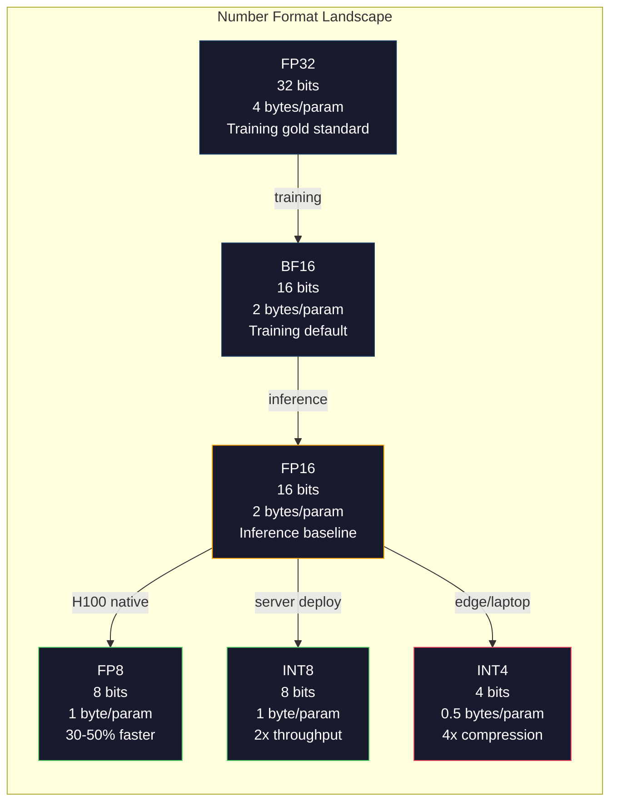
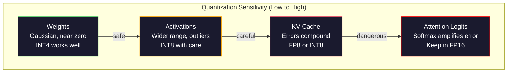
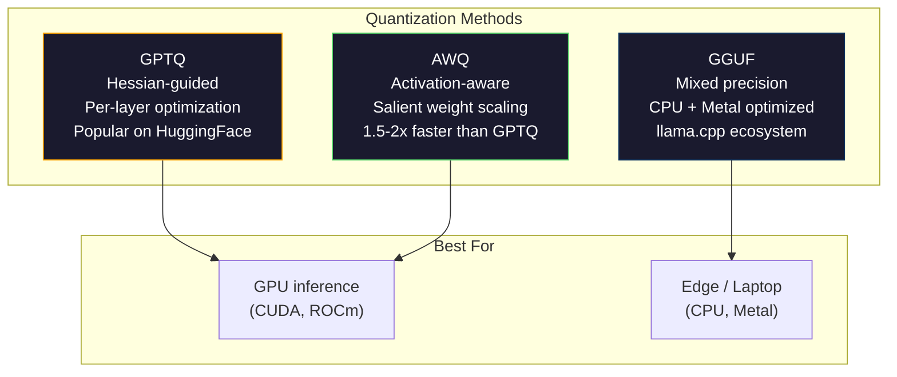

# Cuantización: hacer que los modelos se ajusten

> Un modelo 70B en FP16 necesita 140 GB. Dos A100 sólo para pesas. Cuantice a FP8: una GPU de 80 GB. INT4: un MacBook.

> **【中文解读】**Se necesita 140 GB de almacenamiento en FP16 (dos A100) ⋅ en FP8 sólo se necesita una GPU de 80 GB, en INT4 se puede ejecutar en MacBook ⋅ en la tecnología central de la precisión de almacenamiento y velocidad ⋅ en la cuantificación.

> **【拓展：量化→llama.cpp/GGUF】**llama.cpp y GGUF format para que el gran modelo pueda funcionar en hardware de nivel de consumo. GPTQ, AWQ, GGUF etc. método de cuantificación es el clave para implementar un modelo 70B+ en el dispositivo local.

> ¿ Qué es esto ?**【前置】**Estudiar en el campo de la matemática y la matemática.

> ¿ Qué es esto ?**【类比】**量化 = 压缩图片──原照片(FP16) por imagen 16 bits,肉眼分辨不出和 8 位(FP8) de diferencia, pero文件大小一半──再压到4位──INT4)

**Type:** Build
**Languages:** Python (with numpy)
**Prerequisites:** Phase 10, Lessons 01-10 (LLMs from Scratch)
**Time:** ~120 minutes

## Objetivos de aprendizaje

- Implementar la cuantificación simétrica y asimétrica desde el FP16 hasta el INT8 e INT4, incluida la escalación por tensor y por canal
   lograr la quantificación de los valores y valores de la FP16 a los valores y valores de la INT8 y de la INT4, incluidos los valores y los valores de la INT4
- Calcular el ahorro de memoria de la cuantización y determinar qué precisión se ajusta a la VRAM de una GPU dada
   calcular la cantidad de almacenamiento de datos, determinar la precisión de la GPU                                                                                                                                                                                                                                                                                                                                                                                                                                                                                                             
- Explicar la diferencia entre la cuantificación post-entrenamiento (PTQ) y la formación consciente de la cuantificación (QAT)
  解释训练后量化(PTQ) y la diferencia entre la formación cognitiva de la cuantía y la cuantía de la cuantía
- Aplicar GPTQ o AWQ para cuantificar un modelo real y medir el compromiso entre precisión y memoria en un índice de referencia
   aplicar GPTQ o AWQ quantificar el modelo real, y en base a la medida de la precisión-evidencia de peso

> **【中文解读】**Este curso realiza la técnica de la cuantificación con precisión de cambio de la apariencia y la velocidad― método central: la cuantificación/no-cuantificación─ por la cuantificación/conclusión de la vía, PTQ (en inglés)  (en inglés)  (en inglés)  (en inglés)  (en inglés)  (en inglés)  (en inglés)  (en inglés)  (en inglés)  (en inglés)  (en inglés)  (en inglés)  (en inglés)  (en inglés)  (en inglés)  (en inglés)  (en inglés)  (en inglés)  (en inglés)  (en inglés)  (en inglés)  (en inglés)  (en inglés)  (en inglés)  (en inglés)  (en inglés)  (en inglés)  (en inglés)  (en inglés)  (en inglés)  (en inglés)  (en inglés)  (en inglés)  (en inglés)  (en inglés)  (en inglés)  (en inglés)  (en inglés)  (en inglés)

## El problema es la introducción del problema

Llama 3 70B tiene 70 mil millones de parámetros. Cada parámetro es un número de punto flotante de 16 bits. Eso es 140 mil millones de bytes. 140 GB. Un solo A100 tiene 80 GB de VRAM. Ni siquiera se puede cargar los pesos, y mucho menos ejecutar inferencias, en una sola GPU. Se necesitan dos A100 a $ 2 / hora cada uno sólo para servir un modelo.

> Llama 3 70B tiene 700 mil millones de parámetros. Cada parámetro es un número de 16 bits de flows. Es decir, 1400 mil millones de parámetros.

Pero 16 bits por parámetro es un desperdicio. La mayoría de los pesos en un grupo de red neuronal cerca de cero. El rango dinámico completo de FP16 (de 0.000000059 a 65.504) es casi completamente desutilizado. Si medimos la distribución real de pesos en Llama 3 70B, el 95% de ellos caen entre -0.1 y +0.1.

> Pero cada parámetro 16 bits es un desperdicio. La mayoría de los pesos de la red neuronal se agrupan en la cercana cero. La gama completa de movimientos de FP16 es casi completamente inutilizada. Si se mide la distribución real del peso de Llama 3 70B, el 95% se encuentra entre -0.1 y +0.1 .

La cuantización reemplaza los números de alta precisión por números de menor precisión. FP16 a FP8 reduce la memoria a la mitad. FP16 a INT4 lo reduce a un cuarto. Ese modelo de 140 GB se convierte en 35 GB. Se ajusta a una GPU de consumo único. Empuje a la cuantización de 2 bits (agresiva, perdida, pero utilizable para algunas tareas) y el mismo modelo se ejecuta en una computadora portátil de 16 GB.

> Quantización con números de baja precisión sustituir a números de alta precisión。FP16 a FP8  Reducción de la mitad de la memoria pública。FP16 a INT4  Reducción a una cuarta parte。140GB  Modelo convertido en 35GB。

El costo es la precisión. Cada bit que eliminas destruye la información. La pregunta es cuánto precisión pierde y dónde. Un modelo INT4 bien cuantificado retiene el 95-99% de la calidad del original en la mayoría de los puntos de referencia. Una cuantización ingenua a INT4 puede destruir el modelo por completo. La diferencia es la técnica.

> El problema es cuánta precisión pierde usted y dónde pierde. El modelo INT4 bien calificado en la mayoría de los cimientos conserva el 95-99% de su calidad original.

Las cuantizaciones comunitarias de Llama 3 a INT4 con GPTQ muestran aproximadamente 1-2 puntos de perplejidad perdidos en WikiText. Mistral lanzó puntos de control FP8 de Mixtral 8x22B con cero pérdida de calidad medible en MMLU. El formato GGUF alimenta llama.cpp, ejecutando modelos 70B en MacBooks con chips de la serie M. La cuantización no es un hack. Es el camino de implementación estándar para cada modelo mayor que 7B.

> 社区GPTQ utilizará Llama 3 量化到INT4, en WikiText 仅损失约1-2 个困惑度点──Mistral 发布 Mixtral 8x22B  FP8 检查点,MMLU 上几乎零质量损失──GGUF 格式驱动 llama.cpp,运行在MacBook M 系列芯片上70B 模型──量化不是黑客──它是每一个超过7B 模型的标准部署路径──

> **【中文解读】**FP16 por parámetro 16 bits,70B  modelo necesita 140GB  pero el 95% del peso se concentra entre -0.1 a +0.1  con 16 bits para indicar que estos valores son demasiado desperdiciados                                                                                                                                                                                                                                      

> **【拓展：量化生态】**量化生态 ya está muy maduro:GPTQ(basado en la aproximación de la segunda etapa de información (Basear) 、AWQ(activar el poder de percepción (Pesoar) 权重化, proteger el peso saliente) 、GGUF(llama.cpp 量化格式,支持 2-8 bits 混合精度) ⋅llama.cpp 让70B 模型运行在 MacBook M 系列芯片上,催生本地大模型部署的生态(Ollama、LM Studio等) ⋅

## El concepto central.

### Formato de números: qué hace cada bit

Cada número de punto flotante tiene tres partes: signo, exponente y mantissa (también llamado significand). El signo es un bit. El exponente determina el rango (cuán grande o pequeño puede ser el número).

> Cada uno de los puntos de la lista tiene tres partes: símbolo, índice y número final (también llamado número válido).

```
FP32:  [1 sign] [8 exponent] [23 mantissa]  = 32 bits
FP16:  [1 sign] [5 exponent] [10 mantissa]  = 16 bits
BF16:  [1 sign] [8 exponent] [7  mantissa]  = 16 bits
FP8:   [1 sign] [4 exponent] [3  mantissa]  = 8  bits (E4M3)
FP8:   [1 sign] [5 exponent] [2  mantissa]  = 8  bits (E5M2)
INT8:  [1 sign] [7 value]                   = 8  bits (uniform steps)
INT4:  [1 sign] [3 value]                   = 4  bits (16 levels total)
```

**FP32**El entrenamiento se realizó exclusivamente en FP32. Todavía se aplica para la acumulación (sumas corrientes durante la multiplicación de matrices).

> **FP32**Es la máxima precisión. El número de puntos de 23 te da una precisión de 7 puntos.

**FP16**El exponente se reduce a 5 bits, reduciendo el rango dramáticamente (valor máximo ~65,504). Esto es bueno para pesas (que se agrupan cerca de cero) pero peligroso para las activaciones y gradientes que pueden aumentar durante el entrenamiento.

> **FP16**La reducción de la cantidad de peso a la mitad. La reducción de la cantidad de puntos de 10 a la media de 10 a la media de 5 puntos de precisión. La reducción de la cantidad de puntos de 5 puntos de precisión.

**BF16**(Brain Float 16) mantiene el exponente de 8 bits de FP32 pero reduce la mantissa a 7 bits. El mismo rango que el FP32, menos precisión que el FP16. Google lo diseñó específicamente para el aprendizaje profundo. La intuición: el rango es más importante que la precisión para las redes neuronales. Un gradiente de 10^-20 que se subfluye a cero en FP16 sobrevive en BF16. Un peso de 0.07342 que ronda a 0.0734 en BF16 es lo suficientemente cerca. Cada carrera de entrenamiento moderna utiliza BF16 o una mezcla de BF16/FP32.

> **BF16**(Brain Float 16) conserva el índice de 8 bits de FP32 pero el número de finales se reducirá a 7 bits. El alcance es inferior al FP32.

**FP8**Se utiliza para pesas y activaciones durante la inferencia. Se utiliza E5M2 (5 exponente, 2 mantissa) para gradientes durante el entrenamiento donde el rango importa más que la precisión. La inferencia FP8 en las GPU H100 logra una velocidad del 30-50% con una pérdida de calidad insignificante.

> **FP8**Hay dos tipos de variaciones: E4M3 (4, 3 尾数) para la evaluación del peso y la activación: E5M2 (5, 2 尾数) para la evaluación del grado de precisión: H100 GPU FP8  FP16 快 30-50%, pérdida de calidad puede ser ignorada:

**INT8**Es un formato de número entero. No hay exponente, no hay mantissa. Sólo 256 valores espaciados uniformemente de -128 a 127. Necesitas un factor de escala para mapear los pesos de puntos flotantes en este rango. La ventaja: la aritmética de números enteros es más rápida y más eficiente en energía que el punto flotante. La multiplicación de matriz INT8 en una A100 corre a 624 TOPS frente a 312 TFLOPS para FP16.

> **INT8**Es el formato de los números enteros. No hay índice, no hay número. Sólo 256 valores de intervalos de -128 a 127 puntos.

**INT4**El factor de escala es muy pesado. La calidad depende en su totalidad de cómo elija la escala y qué pesos cuantifica. Los métodos INT4 (GPTQ, AWQ) de última generación conservan el 95% de la calidad del modelo original.

> **INT4**Más adelante, sólo 16 个可能值, 缩放因子承担重任, 质量完全取决于你如何选择缩放比例和量化哪些权重, 最先进的 INT4 方法, GPTQ, AWQ, 保留原始模型 95%+ 的质量, 



### Cómo funciona la cuantificación

La operación del núcleo es simple. Tome un tensor de valores de puntos flotantes, encuentre un factor de escala, multiplica, redondea al número entero más cercano y almacena los números enteros más el factor de escala.

> 核心操作很简单──取一个浮点值张量,找到缩小因子,乘以它,四舍五进近整数,然后存储整数加缩因子──

**Quantize:**
```
scale = max(abs(tensor)) / max_int_value
quantized = round(tensor / scale)
```

**Dequantize:**
```
reconstructed = quantized * scale
```

Para el INT8 con un rango simétrico (de 127 a 127):
```
scale = max(abs(tensor)) / 127
quantized = clamp(round(tensor / scale), -128, 127)
```

El error es el error de redondeo. Cada valor puede ser desestimado por lo máximo `scale / 2`El error total en una capa depende de cuántos pesos tienes y cuán sensible es el modelo a las perturbaciones en esos pesos.

> 误差是四舍五进误差── cada valor es el más desviado `scale / 2` La diferencia total en la capa depende de cuánto peso tienes y de la sensibilidad del modelo a la perturbación de estos pesos.

**Per-tensor vs per-channel quantization.**El per-tensor utiliza un factor de escala para toda la matriz de peso. Simple pero pérdida: si una columna tiene valores grandes y otra tiene valores pequeños, los valores pequeños pierden la mayor parte de su precisión. Por canal se utiliza un factor de escala por canal de salida (por fila o columna de la matriz de peso). Más gastos generales (se almacenan factores de escala N en lugar de 1) pero de calidad dramáticamente mejor. Cada método de cuantificación de producción utiliza granularidad por canal o más fina.

> **逐张量 vs 逐通道量化。**张量对整重矩阵使用缩小因子――简单但有损: si una fila tiene un gran valor en otra fila tiene un pequeño valor, el pequeño valor perderá la mayor parte de la precisión― por vía para cada salida de la ruta ()  ()  ()  ()  ()  ()  ()  ()  ()  ()  () )  ()  ()  ()  ()  ()  () )  ()  ()  ()  ()  ()  ()  ()  ()  ()  ()  ()  ()  ()  ()  ()  ()  ()  ()  ()  ()  ()  ()  ()  ()  ()  ()  ()  ()  ()  ()  ()  ()  ()  ()  () )  ()  ()  ()  ()  ()  ()  ()  ()  ()  ()  ()  ()  ()  ()  ()  ()  ()  ()  ()  ()  ()  ()  () )  ( () )  ()  ()  ()  ()  ()  ()  ()  ()  ()  ()  () ) 

**Asymmetric quantization**añade una compensación de punto cero: `quantized = round(tensor / scale) + zero_point`. Esto maneja distribuciones que no están centradas en cero. Las activaciones de ReLU, por ejemplo, siempre son no negativas. La cuantización simétrica desperdicia la mitad del rango de números enteros en valores negativos que nunca aparecen. La cuantización asimétrica mapea el rango real [min, max] al rango completo de números enteros.

> **非对称量化**添加零点偏移:`quantized = round(tensor / scale) + zero_point`◊ Este tratamiento no se centra en la distribución de cero. Por ejemplo, ReLU  activación de valor total no negativo. ◊ la cuantificación de la cuantificación de la cuantificación de la mitad del rango de la cuantificación de la cuantificación de la cuantificación de la cuantificación de la cuantificación de la cuantificación de la mitad de la cuantificación de la cuantificación de la cuantificación de la cuantificación de la cuantificación de la cuantificación de la cuantificación de la cuantificación de la cuantificación de la cuantificación de la cuantificación de la cuantificación de la cuantificación de la cuantificación de la cuantificación de la cuantificación de la cuantificación de la cuantificación de la cuantificación de la cuantificación de la cuantificación de la cuantificación de la cuantificación de la cuantificación de la cuantificación de la cuantificación de la cuantificación de la cuantificación de la cuantificación de la cuantificación de la cuantificación de la cuantificación de la cuantificación de la cuantificación de la cuantificación de la cuantificación de la cuantificación de la cuantificación de la cuantificación de la cuantificación de la cuantificación de la cuantificación de la cuantificación de la cuantificación de la cuantificación de la cuantificación de la cuantificación de la cuantificación de la cuantificación de la cuantificación de la cuantificación de la cuantificación de la cuantificación de la cuantificación de la cuantificación de la cuantificación de la cuantificación de la cuantificación de la cuantificación de la cuantificación de la cuantificación de la cuantificación de la cuantificación de la cuantificación de la cuantificación de la cuantificación de la cuantificación de la cuantificación de la cuantificación de la cuantificación de la cuantificación de la cuantificación de la cuantificación de la cuantificación de la cuantificación de la cuantificación de la cuantificación de la cuantificación de la cuantificación de la cuantificación de la cuantificación de la cuantificación de la cuantificación de la cuantificación de la cuantificación de la

### Jerarquía de sensibilidad

No todo en un modelo tolera la cuantificación por igual.

> 模型中并非所有部分对量化宽容相同. Hay una estructura de nivel clara.

**Weights (most robust).**Los pesos de modelo cambian lentamente durante el entrenamiento y siguen una distribución Gaussiana centrada cerca de cero. Cuantizan bien. Los pesos INT8 con escalas por canal producen resultados casi sin pérdidas. INT4 requiere métodos más sofisticados pero funciona.

> **权重（最鲁棒）。**El peso del modelo cambia lentamente en el entrenamiento, siguiendo la distribución de alto centrada en cero. Estos cuantifican el efecto bueno.

**Activations (moderate sensitivity).**Las activaciones son los valores intermedios que fluyen a través de la red durante la inferencia. Tienen un rango dinámico más amplio que los pesos y contienen valores excepcionales. Una sola cabeza de atención puede producir valores de activación 100 veces mayores que la media. Estos valores son críticos para la calidad del modelo. Cuantificarlos ingenuamente destruye la información. Soluciones: mantener canales fuera de línea con mayor precisión (LLM.int8() y utilizar escalas de activación por token o por canal.

> **激活（中等敏感度）。**激活是推理时流经网络的中间值──它们 tienen un rango de actividad más amplio que el peso y contienen un valor de离群── un solo cabeza de atención puede producir un valor de activación de 100 veces mayor que el valor promedio── estos valores de离群 son vitales para la calidad del modelo──简单化会破坏信息── solución: mantener el camino de separación en una mayor precisión (LLM.int8()), utilizando un token o un canal de activación en una reducción.

**KV cache (high sensitivity).**El cache de valor clave almacena estados de atención para todos los tokens anteriores. En largos períodos de contexto, el cache KV domina la memoria. Para un modelo 70B en un contexto de 32K, el cache KV solo es de 40 GB en FP16. Cuantificar el cache KV a FP8 o INT8 ahorra una memoria masiva, pero cualquier error se compone en todos los cálculos de atención futuros.

> **KV 缓存（高敏感度）。**键值缓存存储所有前代币的注意状态――在长上下文长度下,KV 缓存主导内存――70B 模型在 32K 上下文下, solo KV 缓存就有40GB FP16――将 KV 缓存量化到FP8或INT8 节省大量内存, pero cualquier error se acumula en todos los cálculos de atención posteriores―― afectar la calidad con el aumento de la longitud de la secuencia――

**Attention logits (most sensitive).**El softmax en la atención es muy sensible a pequeños cambios en sus entradas. Un error de cuantificación de 0.01 en una lógica pre-softmax puede cambiar la distribución de la atención de manera significativa. La mayoría de los esquemas de cuantificación mantienen el cálculo de la atención en mayor precisión (FP16 o BF16) incluso cuando todo lo demás es cuantificado.

> **注意力 logits（最敏感）。**La máxima de la concentración de la concentración de la concentración de la concentración de la concentración de la concentración de la concentración de la concentración de la concentración de la concentración de la concentración de la concentración de la concentración de la concentración de la concentración de la concentración de la concentración de la concentración de la concentración de la concentración de la concentración de la concentración de la concentración de la concentración de la concentración de la concentración de la concentración de la concentración de la concentración de la concentración de la concentración de la concentración de la concentración de la concentración de la concentración de la concentración de la concentración de la concentración de la concentración de la concentración de la concentración de la concentración de la concentración de la concentración de la concentración de la concentración de la concentración de la concentración de la concentración de la concentración de la concentración de la concentración de la concentración de la concentración de la concentración de la concentración de la concentración de la concentración de la concentración de la concentración de la concentración de la concentración de la concentración de la concentración de la concentración de la concentración de la concentración de la concentración de la concentración de la concentración de la concentración de la concentración de la concentración de la concentración de la concentración de la concentración de la concentración de la concentración de la concentración de la concentración de la concentración de la concentración de la concentración de la concentración de la concentración de la concentración de la concentración de la concentración de la concentración de la concentración de la concentración de la concentración de la concentración de la concentración de la concentración de la concentración de la concentración de la concentración de la concentración de la concentración de la concentración de la concentración de la concentración de la concentración de la concentración de la concentración de la concentración de la concentración de la concentración de la concentración de la concentración de la concentración de la concentración de la concentración de la concentración de la concentración de la concentración de la concentración de la concentración de la concentración de la concentración de la concentración de la concentración de la concentración de la concentración de la concentración de la concentración de la concentración de la concentración de la concentración de la concentración de la concentración de la concentración de la concentración de la concentración de la concentración de la concentración de la concentración de la concentración de la concentración de la concentración de la concentración de la concentración de la concentración de la concentración de la concentración de la concentración de la concentración de la concentración de la concentración de la concentración de la concentración de la concentración de la concentración de la concentración de la concentración de la concentración de la concentración de la concentración de la concentración de la concentración de la concentración de la concentración de la concentración de la concentración de la concentración de la concentración de la concentración de la concentración de



### PTQ vs QAT

**Post-Training Quantization (PTQ)**El método de calibración de la calibración de la calibración se utiliza para minimizar el error de cuantificación.

> **训练后量化（PTQ）**量化已训练的模型──无需重训──取 FP16 权重,计算缩放因子,四舍五入,部署──快速(几分钟到几小时)且便宜──INT8 和 FP8 效果好──对INT4,朴素PTQ 经常失败,因为四舍五入误差累积──高级PTQ 方法(GPTQ、AWQ)使用校准数据最小化量化误差──

**Quantization-Aware Training (QAT)**Inserta operaciones de cuantificación falsas en el pase delantero durante el entrenamiento. El modelo aprende a colocar sus pesas donde los errores de redondeo son pequeños. Los gradientes fluyen a través de la cuantización falsa utilizando el estimador directo (STE): pretenda que la operación de redondeo tiene gradiente 1. El QAT produce modelos INT4 e INT2 mejores que el PTQ, pero requiere una formación completa. Google utilizó QAT para la eficiencia de la entrega de Géminis. Meta usó QAT para algunos objetivos de despliegue de Llama.

> **量化感知训练（QAT）**En el entrenamiento de la pre-orientación de la difusión de la inserción de la manipulación de la falsa cuantía. La academia de modelos pondrá el peso en la posición de cuatro esquemas de la diferencia.

| Aspect | PTQ | QAT |
|--------|-----|-----|
| Cost / 成本 | Minutes to hours / 几分钟到几小时 | Full training run / 完整训练运行 |
| Quality at INT8 / INT8 质量 | Excellent (< 0.1% loss) / 优秀（< 0.1% 损失） | Excellent / 优秀 |
| Quality at INT4 / INT4 质量 | Good with GPTQ/AWQ (1-3% loss) / 配合 GPTQ/AWQ 良好（1-3% 损失） | Better (< 1% loss) / 更好（< 1% 损失） |
| Quality at INT2 / INT2 质量 | Poor / 差 | Usable for some tasks / 某些任务可用 |
| Calibration data / 校准数据 | 128-1024 examples / 128-1024 样本 | Full training dataset / 完整训练数据集 |
| When to use / 使用时机 | Deployment, iteration / 部署、迭代 | Maximum quality at low bit-width / 低比特宽度的最大质量 |

### GPTQ, AWQ, GGUF

**GPTQ (GPT Quantization)**es un método de PTQ de una sola toma. Cuantifica los pesos una capa a la vez, utilizando un pequeño conjunto de datos de calibración (128 ejemplos es típico) para medir el Hessian (información de segundo orden sobre la sensibilidad de la salida a cada peso). Los pesos que el hesiano dice que son importantes se cuantizan con más cuidado. GPTQ fue el primer método para hacer que la cuantización INT4 sea práctica para los LLM. TheBloke on Hugging Face popularizó GPTQ al lanzar versiones cuantizadas de cientos de modelos.

> **GPTQ**Es un método de PTQ de una sola vez. Se utiliza un pequeño conjunto de datos de calificación de nivel de peso (normalmente 128 muestras) para medir la información de Hessian sobre la producción de una segunda etapa de sensibilidad a cada peso.

**AWQ (Activation-Aware Weight Quantization)**observa que una pequeña fracción de los pesos (alrededor del 1%) son de importancia desproporcionada porque se multiplican con grandes valores de activación. AWQ identifica estos pesos salientes utilizando datos de calibración y los escala antes de la cuantificación (entonces reduce las activaciones correspondientes). Esto mantiene los pesos importantes en un rango donde la cuantificación INT4 es precisa. AWQ suele coincidir o superar ligeramente la calidad de GPTQ mientras que es 1,5-2 veces más rápido para aplicar.

> **AWQ** observarse un pequeño peso de la parte de la activación (~1%) debido a que es muy importante con el valor de activación elevado a la de la gran cantidad de tiempo de tiempo de tiempo de tiempo de tiempo de tiempo de tiempo de tiempo de tiempo de tiempo de tiempo de tiempo de tiempo de tiempo de tiempo de tiempo de tiempo de tiempo de tiempo de tiempo de tiempo de tiempo de tiempo de tiempo de tiempo de tiempo de tiempo de tiempo de tiempo de tiempo de tiempo de tiempo de tiempo de tiempo de tiempo de tiempo de tiempo de tiempo de tiempo de tiempo de tiempo de tiempo de tiempo de tiempo de tiempo de tiempo de tiempo de tiempo de tiempo de tiempo de tiempo de tiempo de tiempo de tiempo de tiempo de tiempo de tiempo de tiempo de tiempo de tiempo de tiempo de tiempo de tiempo de tiempo de tiempo de tiempo de tiempo de tiempo de tiempo de tiempo de tiempo de tiempo de tiempo de tiempo de tiempo de tiempo de tiempo de tiempo de tiempo de tiempo de tiempo de tiempo de tiempo de tiempo de tiempo de tiempo de tiempo de tiempo de tiempo de tiempo de tiempo de tiempo de tiempo de tiempo de tiempo de tiempo de tiempo de tiempo de tiempo de tiempo de tiempo de tiempo de tiempo de tiempo de tiempo de tiempo de tiempo de tiempo de tiempo de tiempo de tiempo de tiempo de tiempo de tiempo de tiempo de tiempo de tiempo de tiempo de tiempo de tiempo de tiempo de tiempo de tiempo de tiempo de tiempo de tiempo de tiempo de tiempo de tiempo de tiempo de tiempo de tiempo de tiempo de tiempo de tiempo de tiempo de tiempo de tiempo de tiempo de tiempo de tiempo de tiempo de tiempo de tiempo de tiempo de tiempo de tiempo de tiempo de tiempo de tiempo de tiempo de tiempo de tiempo de tiempo de tiempo de tiempo de tiempo de tiempo de tiempo de tiempo de tiempo de tiempo de tiempo de tiempo de tiempo de tiempo de tiempo de tiempo de tiempo de tiempo de tiempo de tiempo de tiempo de tiempo de tiempo de tiempo de tiempo de tiempo de tiempo de tiempo de tiempo de tiempo de tiempo de tiempo de tiempo de tiempo de tiempo de tiempo de tiempo de tiempo de tiempo de tiempo de tiempo de tiempo de tiempo de tiempo de tiempo de tiempo de tiempo de tiempo de tiempo de tiempo de tiempo de tiempo de tiempo de tiempo de tiempo de tiempo de tiempo de tiempo de tiempo de tiempo de tiempo de tiempo de tiempo de tiempo de tiempo de tiempo de tiempo de tiempo de tiempo de tiempo de tiempo de tiempo de tiempo de tiempo de tiempo de tiempo de tiempo de tiempo de tiempo de tiempo de tiempo de tiempo de tiempo de tiempo de tiempo

**GGUF (GPT-Generated Unified Format)**es el formato de archivo utilizado por llama.cpp y su ecosistema. Apoya la cuantificación mixta: diferentes capas obtienen diferentes anchos de bits. Las primeras y últimas capas (capas de inserción y salida) se mantienen típicamente con mayor precisión. Las capas medias obtienen INT4 o INT3. Los archivos GGUF son autónomos: pesos, tokenizer, metadatos todos en un archivo. El formato está diseñado para la inferencia de CPU y Apple Silicon, donde cargar todo el modelo en memoria y ejecutar multiplicidades de matriz en la CPU o GPU Metal es el camino estándar. Q4_K_M es la variante de cuantización GGUF más popular, equilibrando calidad y tamaño.

> **GGUF**Es el formato de los archivos que llama.cpp  y su uso en el medio ambiente. Suele ser el formato de los archivos de la GGUF.



### Medición de la calidad

¿Cómo sabes si tu modelo cuantizado sigue siendo bueno?

> ¿Cómo juzgar que su modelo de cuantificación sigue siendo útil?

**Perplexity.**La métrica más común. Más bajo es mejor. Computa perplejidad en un conjunto de datos mantenido (WikiText-2 es estándar) tanto para el modelo original como cuantizado. El delta le dice cuánto información destruyó la cuantización. Reglas de pulgar: delta < 0.5 es excelente, 0.5-1.0 es bueno, 1.0-2.0 es aceptable para la mayoría de las tareas, > 2.0 significa que algo salió mal.

> **困惑度。**El índice de uso más frecuente: 越低越好. ̇ 在保留数据集 (((WikiText-2 是标准) ̇上计算原始和量化模型的困惑度. 差值告诉你量化破坏了多少信息. ̇ 经验法则:差值 < 0.5 优秀,0.5-1.0 良好,1.0-2.0 大多数任务可接受,> 2.0 说明有问题──

**Task-specific benchmarks.**ejecutar el modelo cuantizado en MMLU, HumanEval, GSM8K o su suite de evaluaciones personalizadas. Comparar con el original. La cuantización afecta a diferentes capacidades de manera desigual. Las tareas de matemáticas y código son más sensibles a la pérdida de precisión que el conocimiento general.

> **任务特定基准。**En MMLU、HumanEval、GSM8K o en su propio conjunto de evaluación, se ejecuta un modelo cuantitativo. Comparado con el modelo original, la cuantitativa no afecta a las diferentes capacidades.

**Output comparison.**Generar respuestas de ambos modelos sobre las mismas instrucciones y comparar. LLM-as-judge (Lección 10) funciona bien aquí. Calcule una tasa de ganancia: ¿en qué fracción de instrucciones coincide el modelo cuantizado o supera al original?

> **输出比较。**Desde dos modelos en el mismo momento arriba generación de la respuesta y comparación. LLM-as-judge (第十课) aquí es muy eficaz.

**Latency and throughput.**La cuantización existe para hacer que los modelos sean más rápidos y más baratos. Medir tokens por segundo, tiempo para el primer token y uso de memoria. Un modelo cuantizado que es más lento que el original es peor que inútil.

> **延迟和吞吐量。**El objetivo de la existencia cuantitativa es hacer que el modelo sea más rápido y más barato.

| Model | Format | Size | Perplexity (WikiText-2) | MMLU | Tokens/sec (A100) |
|-------|--------|------|------------------------|------|-------------------|
| Llama 3 70B | FP16 | 140GB | 3.12 | 79.5% | 38 |
| Llama 3 70B | FP8 | 70GB | 3.14 | 79.3% | 55 |
| Llama 3 70B | GPTQ INT4 | 35GB | 4.32 | 77.8% | 72 |
| Llama 3 70B | AWQ INT4 | 35GB | 4.18 | 78.1% | 75 |
| Llama 3 70B | GGUF Q4_K_M | 40GB | 4.25 | 77.9% | 28 (CPU) |

El patrón: FP8 es casi gratuito. INT4 cuesta 1-2 puntos MMLU pero duplica el rendimiento y las cuartas partes de memoria.

> 模式:FP8 几乎免费──INT4 代价 1-2  MMLU puntos pero el volumen de desglose se duplica、 la memoria se reduce a una cuarta parte― este peso vale para casi todas las implementaciones―

### Números reales

FP16 a FP8 en H100: 30-50% de aceleración de inferencia, < 0,1% de pérdida de calidad. Esta es la cuantización sin cerebro. Cada despliegue de H100 debe usarlo.

> H100 arriba FP16 hasta FP8:30-50%  推理加速,< 0.1% 质量损失──这是不用想的量化──每一个H100 部署都应使用──

FP16 a INT8 (LLM.int8()): 2 veces reducción de la memoria, < 0,5% pérdida de calidad. El enfoque de precisión mixta mantiene características excepcionales en FP16 mientras cuantifica todo lo demás a INT8.

> FP16 hasta INT8 ((LLM.int8()): 2 倍内存减少,< 0.5% 质量损失──混合精度方法保持离群特征在FP16而其他全部量化到INT8──

FP16 a INT4 (GPTQ/AWQ): 4 veces reducción de memoria, pérdida de calidad del 1-3% dependiendo del modelo y método.

> FP16 hasta INT4(GPTQ/AWQ):4 倍内存减少,1-3% 质量损失,取决于模型和方法──使70B 模型可在单张48GB GPU 上运行──

FP16 a INT4 (GGUF Q4_K_M): reducción de memoria 3,5 veces, pérdida de calidad del 1-2%. Optimizado para la inferencia de la CPU. Un modelo 70B en Q4_K_M es de aproximadamente 40 GB y se ejecuta a 10-15 tokens / segundo en un M3 Max con 64 GB.

> FP16 hasta INT4(GGUF Q4_K_M):3.5 倍内存减少,1-2% 质量损失──为CPU 推理优化──Q4_K_M 的70B 模型约40GB,在64GB M3 Max 上以 10-15 tokens/秒运行──

FP16 a INT2: 8 veces reducción de la memoria, pérdida de calidad del 5-15%. Sólo viable para tareas específicas estrechas donde se puede tolerar la degradación. Frontera de investigación, no lista para el uso general.

> FP16 hasta INT2:8 倍内存减少,5-15% 质量损失――仅适用于可容忍退化的特定狭任务――研究前沿,非通用生产就绪―― sólo se aplica a tareas específicas de tolerancia de la deformación.

## Construye y realiza.
```figure
quantization
```

## Construye el mismo

### Paso 1: Representaciones en formato de números

Construye la representación a nivel de bits de cada formato para ver exactamente qué signo, exponente y mantissa hacen.

> Construir cada tipo de forma de representación de los rango, ver claramente el símbolo, índice y número final que actúa.

```python
import numpy as np


def float_to_fp32_bits(value):
    bits = np.float32(value).view(np.uint32)
    sign = (bits >> 31) & 1
    exponent = (bits >> 23) & 0xFF
    mantissa = bits & 0x7FFFFF
    return {"sign": int(sign), "exponent": int(exponent), "mantissa": int(mantissa),
            "exponent_bits": format(int(exponent), '08b'),
            "mantissa_bits": format(int(mantissa), '023b'),
            "value": float(value),
            "actual_exponent": int(exponent) - 127}


def float_to_fp16_bits(value):
    fp16 = np.float16(value)
    bits = fp16.view(np.uint16)
    sign = (bits >> 15) & 1
    exponent = (bits >> 10) & 0x1F
    mantissa = bits & 0x3FF
    return {"sign": int(sign), "exponent": int(exponent), "mantissa": int(mantissa),
            "exponent_bits": format(int(exponent), '05b'),
            "mantissa_bits": format(int(mantissa), '010b'),
            "value": float(fp16),
            "actual_exponent": int(exponent) - 15}


def float_to_bf16_bits(value):
    fp32_bits = np.float32(value).view(np.uint32)
    bf16_bits = (fp32_bits >> 16).astype(np.uint16)
    sign = (bf16_bits >> 15) & 1
    exponent = (bf16_bits >> 7) & 0xFF
    mantissa = bf16_bits & 0x7F
    reconstructed = np.uint32(bf16_bits.astype(np.uint32) << 16).view(np.float32)
    return {"sign": int(sign), "exponent": int(exponent), "mantissa": int(mantissa),
            "exponent_bits": format(int(exponent), '08b'),
            "mantissa_bits": format(int(mantissa), '07b'),
            "value": float(reconstructed),
            "actual_exponent": int(exponent) - 127}


def simulate_fp8_e4m3(value):
    sign = 1 if value < 0 else 0
    abs_val = abs(value)
    max_val = 448.0
    abs_val = min(abs_val, max_val)
    if abs_val == 0:
        return {"sign": sign, "exponent": 0, "mantissa": 0, "value": 0.0,
                "exponent_bits": "0000", "mantissa_bits": "000"}
    exp = int(np.floor(np.log2(abs_val)))
    exp = max(-6, min(8, exp))
    mantissa_val = abs_val / (2.0 ** exp) - 1.0
    mantissa_quant = round(mantissa_val * 8) / 8
    mantissa_quant = max(0, min(0.875, mantissa_quant))
    reconstructed = (1.0 + mantissa_quant) * (2.0 ** exp)
    if sign:
        reconstructed = -reconstructed
    mantissa_int = int(round(mantissa_quant * 8))
    return {"sign": sign, "exponent": exp + 7, "mantissa": mantissa_int,
            "exponent_bits": format(exp + 7, '04b'),
            "mantissa_bits": format(mantissa_int, '03b'),
            "value": float(reconstructed),
            "actual_exponent": exp}


def display_format_comparison(value):
    fp32 = float_to_fp32_bits(value)
    fp16 = float_to_fp16_bits(value)
    bf16 = float_to_bf16_bits(value)
    fp8 = simulate_fp8_e4m3(value)

    print(f"\n  Value: {value}")
    print(f"  {'Format':<8} {'Stored Value':>14} {'Error':>12} {'Sign':>5} {'Exp Bits':>10} {'Man Bits':>25}")
    print(f"  {'-'*76}")
    print(f"  {'FP32':<8} {fp32['value']:>14.6f} {abs(fp32['value'] - value):>12.8f} {fp32['sign']:>5} {fp32['exponent_bits']:>10} {fp32['mantissa_bits']:>25}")
    print(f"  {'FP16':<8} {fp16['value']:>14.6f} {abs(fp16['value'] - value):>12.8f} {fp16['sign']:>5} {fp16['exponent_bits']:>10} {fp16['mantissa_bits']:>25}")
    print(f"  {'BF16':<8} {bf16['value']:>14.6f} {abs(bf16['value'] - value):>12.8f} {bf16['sign']:>5} {bf16['exponent_bits']:>10} {bf16['mantissa_bits']:>25}")
    print(f"  {'FP8e4m3':<8} {fp8['value']:>14.6f} {abs(fp8['value'] - value):>12.8f} {fp8['sign']:>5} {fp8['exponent_bits']:>10} {fp8['mantissa_bits']:>25}")
```

### Paso 2: Cuantización simétrica (por tensor y por canal)

Las operaciones de cuantización fundamentales. el per-tensor utiliza una escala para toda la matriz. el per-canale utiliza una escala por fila o columna.

> 基本量化操作──逐张量对整个矩阵使用一个缩小因子──逐通道对每行或每列使用一个缩小因子──

```python
def quantize_symmetric(tensor, num_bits=8):
    qmin = -(2 ** (num_bits - 1))
    qmax = 2 ** (num_bits - 1) - 1
    abs_max = np.max(np.abs(tensor))
    if abs_max == 0:
        return np.zeros_like(tensor, dtype=np.int32), 1.0
    scale = abs_max / qmax
    quantized = np.clip(np.round(tensor / scale), qmin, qmax).astype(np.int32)
    return quantized, float(scale)


def dequantize_symmetric(quantized, scale):
    return quantized.astype(np.float64) * scale


def quantize_per_channel(tensor, num_bits=8, axis=0):
    qmin = -(2 ** (num_bits - 1))
    qmax = 2 ** (num_bits - 1) - 1

    if axis == 0:
        abs_max = np.max(np.abs(tensor), axis=1, keepdims=True)
    else:
        abs_max = np.max(np.abs(tensor), axis=0, keepdims=True)

    abs_max = np.where(abs_max == 0, 1.0, abs_max)
    scales = abs_max / qmax
    quantized = np.clip(np.round(tensor / scales), qmin, qmax).astype(np.int32)
    return quantized, scales.squeeze()


def dequantize_per_channel(quantized, scales, axis=0):
    if axis == 0:
        return quantized.astype(np.float64) * scales.reshape(-1, 1)
    else:
        return quantized.astype(np.float64) * scales.reshape(1, -1)


def quantize_asymmetric(tensor, num_bits=8):
    qmin = 0
    qmax = 2 ** num_bits - 1
    t_min = np.min(tensor)
    t_max = np.max(tensor)
    if t_max == t_min:
        return np.zeros_like(tensor, dtype=np.int32), 1.0, 0
    scale = (t_max - t_min) / (qmax - qmin)
    zero_point = int(np.round(qmin - t_min / scale))
    zero_point = max(qmin, min(qmax, zero_point))
    quantized = np.clip(np.round(tensor / scale + zero_point), qmin, qmax).astype(np.int32)
    return quantized, float(scale), int(zero_point)


def dequantize_asymmetric(quantized, scale, zero_point):
    return (quantized.astype(np.float64) - zero_point) * scale
```

### Paso 3: Medida de la calidad

Medir la cantidad de información que destruye la cuantización. Erro cuadrado medio, relación señal-ruido y similitud cosina entre los tensores originales y reconstruidos.

> La medición cuantitativa ha destruido mucho información. La media de la diferencia entre la cantidad original y la cantidad de la reconstrucción de la cantidad de la cantidad de la cantidad de la cantidad de la cantidad de la cantidad de la cantidad de la cantidad de la cantidad de la cantidad de la cantidad de la cantidad de la cantidad de la cantidad de la cantidad de la cantidad de la cantidad de la cantidad de la cantidad de la cantidad de la cantidad de la cantidad de la cantidad de la cantidad de la cantidad de la cantidad de la cantidad de la cantidad de la cantidad de la cantidad de la cantidad de la cantidad de la cantidad de la cantidad de la cantidad de la cantidad de la cantidad de la cantidad de la cantidad de la cantidad de la cantidad de la cantidad de la cantidad de la cantidad de la cantidad de la cantidad de la cantidad de la cantidad de la cantidad de la cantidad de la cantidad de la cantidad de la cantidad de la cantidad de la cantidad de la cantidad de la cantidad de la cantidad de la cantidad de la cantidad de la cantidad de la cantidad de la cantidad de la cantidad de la cantidad de la cantidad de la cantidad de la cantidad de la cantidad de la cantidad de la cantidad de la cantidad de la cantidad de la cantidad de la cantidad de la cantidad de la cantidad de la cantidad de la cantidad de la cantidad de la cantidad de la cantidad de la cantidad de la cantidad de la cantidad de la cantidad de la cantidad de la cantidad de la cantidad de la cantidad de la cantidad de la cantidad de la cantidad de la cantidad de la cantidad de la cantidad de la cantidad de la cantidad de la cantidad de la cantidad de la cantidad de la cantidad de la cantidad de la cantidad de la cantidad de la cantidad de la cantidad de la cantidad de la cantidad de la cantidad de la cantidad de la cantidad de la cantidad de la que se construida.

```python
def quantization_error(original, reconstructed):
    diff = original - reconstructed
    mse = float(np.mean(diff ** 2))
    rmse = float(np.sqrt(mse))
    max_error = float(np.max(np.abs(diff)))
    signal_power = float(np.mean(original ** 2))
    snr_db = 10 * np.log10(signal_power / max(mse, 1e-20))

    orig_flat = original.flatten()
    recon_flat = reconstructed.flatten()
    norm_orig = np.linalg.norm(orig_flat)
    norm_recon = np.linalg.norm(recon_flat)
    if norm_orig == 0 or norm_recon == 0:
        cosine_sim = 0.0
    else:
        cosine_sim = float(np.dot(orig_flat, recon_flat) / (norm_orig * norm_recon))

    return {"mse": mse, "rmse": rmse, "max_error": max_error,
            "snr_db": float(snr_db), "cosine_similarity": cosine_sim}


def compare_quantization_methods(tensor, num_bits=8):
    q_pt, s_pt = quantize_symmetric(tensor, num_bits)
    recon_pt = dequantize_symmetric(q_pt, s_pt)
    err_pt = quantization_error(tensor, recon_pt)

    q_pc, s_pc = quantize_per_channel(tensor, num_bits, axis=0)
    recon_pc = dequantize_per_channel(q_pc, s_pc, axis=0)
    err_pc = quantization_error(tensor, recon_pc)

    q_asym, s_asym, zp = quantize_asymmetric(tensor, num_bits)
    recon_asym = dequantize_asymmetric(q_asym, s_asym, zp)
    err_asym = quantization_error(tensor, recon_asym)

    print(f"\n  Quantization Comparison ({num_bits}-bit, tensor shape {tensor.shape}):")
    print(f"  {'Method':<20} {'MSE':>12} {'SNR (dB)':>10} {'Cosine Sim':>12} {'Max Error':>12}")
    print(f"  {'-'*68}")
    print(f"  {'Per-tensor sym':<20} {err_pt['mse']:>12.8f} {err_pt['snr_db']:>10.2f} {err_pt['cosine_similarity']:>12.8f} {err_pt['max_error']:>12.8f}")
    print(f"  {'Per-channel sym':<20} {err_pc['mse']:>12.8f} {err_pc['snr_db']:>10.2f} {err_pc['cosine_similarity']:>12.8f} {err_pc['max_error']:>12.8f}")
    print(f"  {'Asymmetric':<20} {err_asym['mse']:>12.8f} {err_asym['snr_db']:>10.2f} {err_asym['cosine_similarity']:>12.8f} {err_asym['max_error']:>12.8f}")

    return {"per_tensor": err_pt, "per_channel": err_pc, "asymmetric": err_asym}
```

### Paso 4: barrido de un poco de ancho

Cuantifique el mismo tensor en diferentes anchos de bits (2, 3, 4, 8, 16) y mide la calidad en cada nivel. Esto muestra exactamente dónde está el acantilado de calidad.

> En diferentes niveles de amplitud (2,3,4,8,16) se mide la misma cantidad y se mide la calidad de cada nivel.

```python
def bit_width_sweep(tensor):
    print(f"\n  Bit-Width Sweep (tensor shape {tensor.shape}):")
    print(f"  {'Bits':>6} {'Levels':>8} {'MSE':>14} {'SNR (dB)':>10} {'Cosine Sim':>12} {'Compression':>12}")
    print(f"  {'-'*64}")

    results = []
    for bits in [2, 3, 4, 8, 16]:
        q, s = quantize_per_channel(tensor, bits, axis=0)
        recon = dequantize_per_channel(q, s, axis=0)
        err = quantization_error(tensor, recon)
        levels = 2 ** bits
        compression = 32.0 / bits

        print(f"  {bits:>6} {levels:>8} {err['mse']:>14.8f} {err['snr_db']:>10.2f} {err['cosine_similarity']:>12.8f} {compression:>11.1f}x")
        results.append({"bits": bits, "levels": levels, "error": err, "compression": compression})

    return results
```

### Paso 5: Experimento de sensibilidad

Simula la cuantificación de diferentes partes de un transformador y mide qué componentes son más sensibles. Esto demuestra la jerarquía de sensibilidad: pesos < activaciones < caché KV < atención.

> 模拟量化变压器的不同部分并测量哪些组件最敏感──这显示了敏感度层次:权重 < 激活 < KV 缓存 < 注意力──

```python
def simulate_transformer_layer(input_data, weights, kv_scale=1.0):
    hidden = input_data @ weights["qkv"]
    seq_len = hidden.shape[1]
    d_model = weights["qkv"].shape[1] // 3
    q, k, v = hidden[:, :, :d_model], hidden[:, :, d_model:2*d_model], hidden[:, :, 2*d_model:]

    attn_scores = (q @ k.transpose(0, 2, 1)) / np.sqrt(d_model) * kv_scale
    attn_max = np.max(attn_scores, axis=-1, keepdims=True)
    attn_exp = np.exp(attn_scores - attn_max)
    attn_weights = attn_exp / np.sum(attn_exp, axis=-1, keepdims=True)

    attn_output = attn_weights @ v
    output = attn_output @ weights["out"]
    return output, {"q": q, "k": k, "v": v, "attn_scores": attn_scores,
                    "attn_weights": attn_weights, "attn_output": attn_output}


def sensitivity_experiment(batch_size=2, seq_len=16, d_model=64, num_bits=8):
    np.random.seed(42)
    input_data = np.random.randn(batch_size, seq_len, d_model) * 0.1

    weights = {
        "qkv": np.random.randn(d_model, 3 * d_model) * (2.0 / d_model) ** 0.5,
        "out": np.random.randn(d_model, d_model) * (2.0 / d_model) ** 0.5,
    }

    baseline_output, baseline_internals = simulate_transformer_layer(input_data, weights)

    experiments = {}

    q_qkv, s_qkv = quantize_per_channel(weights["qkv"], num_bits, axis=0)
    q_out, s_out = quantize_per_channel(weights["out"], num_bits, axis=0)
    quantized_weights = {
        "qkv": dequantize_per_channel(q_qkv, s_qkv, axis=0),
        "out": dequantize_per_channel(q_out, s_out, axis=0),
    }
    weight_quant_output, _ = simulate_transformer_layer(input_data, quantized_weights)
    experiments["Weights only"] = quantization_error(baseline_output, weight_quant_output)

    _, fresh_internals = simulate_transformer_layer(input_data, weights)
    q_act, s_act = quantize_per_channel(
        fresh_internals["attn_output"].reshape(-1, d_model), num_bits, axis=0
    )
    quant_attn_out = dequantize_per_channel(q_act, s_act, axis=0).reshape(batch_size, seq_len, d_model)
    act_quant_output = quant_attn_out @ weights["out"]
    experiments["Activations only"] = quantization_error(baseline_output, act_quant_output)

    q_k, s_k = quantize_per_channel(fresh_internals["k"].reshape(-1, d_model), num_bits, axis=0)
    q_v, s_v = quantize_per_channel(fresh_internals["v"].reshape(-1, d_model), num_bits, axis=0)
    quant_k = dequantize_per_channel(q_k, s_k, axis=0).reshape(batch_size, seq_len, d_model)
    quant_v = dequantize_per_channel(q_v, s_v, axis=0).reshape(batch_size, seq_len, d_model)
    attn_scores_kv = (fresh_internals["q"] @ quant_k.transpose(0, 2, 1)) / np.sqrt(d_model)
    attn_max_kv = np.max(attn_scores_kv, axis=-1, keepdims=True)
    attn_exp_kv = np.exp(attn_scores_kv - attn_max_kv)
    attn_weights_kv = attn_exp_kv / np.sum(attn_exp_kv, axis=-1, keepdims=True)
    kv_quant_output = (attn_weights_kv @ quant_v) @ weights["out"]
    experiments["KV cache only"] = quantization_error(baseline_output, kv_quant_output)

    noise_scale = np.std(fresh_internals["attn_scores"]) * 0.05
    noisy_scores = fresh_internals["attn_scores"] + np.random.randn(*fresh_internals["attn_scores"].shape) * noise_scale
    noisy_max = np.max(noisy_scores, axis=-1, keepdims=True)
    noisy_exp = np.exp(noisy_scores - noisy_max)
    noisy_weights = noisy_exp / np.sum(noisy_exp, axis=-1, keepdims=True)
    attn_quant_output = (noisy_weights @ fresh_internals["v"]) @ weights["out"]
    experiments["Attention logits (5% noise)"] = quantization_error(baseline_output, attn_quant_output)

    print(f"\n  Sensitivity Experiment ({num_bits}-bit quantization):")
    print(f"  {'Component':<30} {'MSE':>14} {'SNR (dB)':>10} {'Cosine Sim':>12}")
    print(f"  {'-'*68}")
    for name, err in sorted(experiments.items(), key=lambda x: x[1]["mse"]):
        print(f"  {name:<30} {err['mse']:>14.8f} {err['snr_db']:>10.2f} {err['cosine_similarity']:>12.8f}")

    return experiments
```

### Paso 6: Simulación de la GPTQ

GPTQ cuantifica una columna a la vez, utilizando el Hessian para decidir cómo distribuir el error de redondeo. Esta es una versión simplificada que captura la idea principal: utilizar datos de calibración para medir la importancia del peso, luego cuantificar los pesos menos importantes de manera más agresiva.

```python
def simulated_gptq(weight_matrix, calibration_inputs, num_bits=4):
    n_in, n_out = weight_matrix.shape
    qmin = -(2 ** (num_bits - 1))
    qmax = 2 ** (num_bits - 1) - 1

    H = np.zeros((n_in, n_in))
    for x in calibration_inputs:
        x = x.reshape(-1, 1) if x.ndim == 1 else x
        for row in range(x.shape[0]):
            xi = x[row].reshape(-1, 1)
            H += xi @ xi.T
    H /= len(calibration_inputs)
    H += np.eye(n_in) * 1e-4

    weight_importance = np.diag(H)

    quantized = np.zeros_like(weight_matrix, dtype=np.int32)
    scales = np.zeros(n_out)
    errors = np.zeros(n_out)

    W = weight_matrix.copy()

    for col in range(n_out):
        w_col = W[:, col]
        abs_max = np.max(np.abs(w_col))
        if abs_max == 0:
            scales[col] = 1.0
            continue
        scale = abs_max / qmax
        scales[col] = scale

        q_col = np.clip(np.round(w_col / scale), qmin, qmax).astype(np.int32)
        quantized[:, col] = q_col

        quant_error = w_col - q_col * scale
        errors[col] = np.sqrt(np.mean(quant_error ** 2))

        if col < n_out - 1:
            importance_weights = weight_importance / (np.max(weight_importance) + 1e-10)
            for next_col in range(col + 1, min(col + 4, n_out)):
                compensation = quant_error * importance_weights * 0.1
                W[:, next_col] += compensation

    return quantized, scales, {"column_errors": errors,
                               "mean_error": float(np.mean(errors)),
                               "max_error": float(np.max(errors))}


def dequantize_gptq(quantized, scales):
    result = np.zeros_like(quantized, dtype=np.float64)
    for col in range(quantized.shape[1]):
        result[:, col] = quantized[:, col] * scales[col]
    return result
```

### Paso 7: Simulación de AWQ

AWQ identifica pesos salientes (aquellos que se multiplican con grandes activaciones) y los protege mediante la escalación antes de la cuantización.

```python
def simulated_awq(weight_matrix, calibration_inputs, num_bits=4, salient_fraction=0.01):
    n_in, n_out = weight_matrix.shape
    qmin = -(2 ** (num_bits - 1))
    qmax = 2 ** (num_bits - 1) - 1

    activation_magnitudes = np.zeros(n_in)
    for x in calibration_inputs:
        if x.ndim == 1:
            activation_magnitudes += np.abs(x)
        else:
            activation_magnitudes += np.mean(np.abs(x), axis=0)
    activation_magnitudes /= len(calibration_inputs)

    n_salient = max(1, int(n_in * salient_fraction))
    salient_indices = np.argsort(activation_magnitudes)[-n_salient:]

    scale_factors = np.ones(n_in)
    for idx in salient_indices:
        col_max = np.max(np.abs(weight_matrix[idx, :]))
        if col_max > 0:
            scale_factors[idx] = min(4.0, 1.0 / (col_max + 1e-8) * np.mean(np.abs(weight_matrix)))

    scaled_weights = weight_matrix * scale_factors.reshape(-1, 1)

    quantized, scales = quantize_per_channel(scaled_weights, num_bits, axis=0)
    dequantized = dequantize_per_channel(quantized, scales, axis=0)

    result = dequantized / scale_factors.reshape(-1, 1)

    err = quantization_error(weight_matrix, result)

    return result, {"salient_indices": salient_indices,
                    "scale_factors": scale_factors[salient_indices],
                    "error": err,
                    "n_salient": n_salient}
```

### Paso 8: Línea completa

Comparar la cuantificación ingenuo, por canal, GPTQ y AWQ en la misma matriz de peso.

```python
def full_quantization_comparison(d_in=256, d_out=512, num_bits=4, n_calibration=32):
    np.random.seed(42)

    weight = np.random.randn(d_in, d_out) * 0.02
    outlier_rows = np.random.choice(d_in, size=5, replace=False)
    weight[outlier_rows] *= 10

    calibration = [np.random.randn(8, d_in) * 0.1 for _ in range(n_calibration)]

    q_naive, s_naive = quantize_symmetric(weight, num_bits)
    recon_naive = dequantize_symmetric(q_naive, s_naive)
    err_naive = quantization_error(weight, recon_naive)

    q_pc, s_pc = quantize_per_channel(weight, num_bits, axis=0)
    recon_pc = dequantize_per_channel(q_pc, s_pc, axis=0)
    err_pc = quantization_error(weight, recon_pc)

    q_gptq, s_gptq, gptq_info = simulated_gptq(weight, calibration, num_bits)
    recon_gptq = dequantize_gptq(q_gptq, s_gptq)
    err_gptq = quantization_error(weight, recon_gptq)

    recon_awq, awq_info = simulated_awq(weight, calibration, num_bits)
    err_awq = awq_info["error"]

    print(f"\n  Full Quantization Comparison ({num_bits}-bit, {d_in}x{d_out} matrix)")
    print(f"  Matrix has {len(outlier_rows)} outlier rows (10x scale)")
    print()
    print(f"  {'Method':<20} {'MSE':>14} {'SNR (dB)':>10} {'Cosine Sim':>12}")
    print(f"  {'-'*58}")
    print(f"  {'Naive per-tensor':<20} {err_naive['mse']:>14.8f} {err_naive['snr_db']:>10.2f} {err_naive['cosine_similarity']:>12.8f}")
    print(f"  {'Per-channel':<20} {err_pc['mse']:>14.8f} {err_pc['snr_db']:>10.2f} {err_pc['cosine_similarity']:>12.8f}")
    print(f"  {'Simulated GPTQ':<20} {err_gptq['mse']:>14.8f} {err_gptq['snr_db']:>10.2f} {err_gptq['cosine_similarity']:>12.8f}")
    print(f"  {'Simulated AWQ':<20} {err_awq['mse']:>14.8f} {err_awq['snr_db']:>10.2f} {err_awq['cosine_similarity']:>12.8f}")

    test_input = np.random.randn(4, d_in) * 0.1
    baseline = test_input @ weight
    output_naive = test_input @ recon_naive
    output_pc = test_input @ recon_pc
    output_gptq = test_input @ recon_gptq
    output_awq = test_input @ recon_awq

    print(f"\n  End-to-End Output Error (matmul with test input):")
    print(f"  {'Method':<20} {'Output MSE':>14} {'Output Cosine':>14}")
    print(f"  {'-'*50}")
    for name, output in [("Naive", output_naive), ("Per-channel", output_pc),
                          ("GPTQ", output_gptq), ("AWQ", output_awq)]:
        out_err = quantization_error(baseline, output)
        print(f"  {name:<20} {out_err['mse']:>14.8f} {out_err['cosine_similarity']:>14.8f}")

    return {"naive": err_naive, "per_channel": err_pc, "gptq": err_gptq, "awq": err_awq}


def memory_calculator(num_params_billions, bits_per_param):
    bytes_per_param = bits_per_param / 8
    total_bytes = num_params_billions * 1e9 * bytes_per_param
    total_gb = total_bytes / (1024 ** 3)
    return total_gb


def print_memory_table():
    print("\n  Memory Requirements by Model and Precision:")
    print(f"  {'Model':<15} {'FP32':>8} {'FP16':>8} {'FP8':>8} {'INT8':>8} {'INT4':>8} {'INT2':>8}")
    print(f"  {'-'*64}")
    for name, params in [("7B", 7), ("13B", 13), ("34B", 34), ("70B", 70), ("405B", 405)]:
        fp32 = memory_calculator(params, 32)
        fp16 = memory_calculator(params, 16)
        fp8 = memory_calculator(params, 8)
        int8 = memory_calculator(params, 8)
        int4 = memory_calculator(params, 4)
        int2 = memory_calculator(params, 2)
        print(f"  {name:<15} {fp32:>7.1f}G {fp16:>7.1f}G {fp8:>7.1f}G {int8:>7.1f}G {int4:>7.1f}G {int2:>7.1f}G")


if __name__ == "__main__":
    np.random.seed(42)

    print("=" * 70)
    print("QUANTIZATION: MAKING MODELS FIT")
    print("=" * 70)

    print("\nSTEP 1: Number Format Comparison")
    print("-" * 50)
    for val in [0.1, 3.14159, -0.00073, 42.5, 0.0000012]:
        display_format_comparison(val)

    print("\n\nSTEP 2: Memory Requirements")
    print("-" * 50)
    print_memory_table()

    print("\n\nSTEP 3: Quantization Methods Comparison")
    print("-" * 50)
    weight_matrix = np.random.randn(128, 256) * 0.02
    weight_matrix[0] *= 15
    weight_matrix[42] *= 8
    compare_quantization_methods(weight_matrix, num_bits=8)
    compare_quantization_methods(weight_matrix, num_bits=4)

    print("\n\nSTEP 4: Bit-Width Sweep")
    print("-" * 50)
    sweep_tensor = np.random.randn(64, 128) * 0.05
    bit_width_sweep(sweep_tensor)

    print("\n\nSTEP 5: Sensitivity Experiment")
    print("-" * 50)
    print("\n  INT8:")
    sensitivity_experiment(num_bits=8)
    print("\n  INT4:")
    sensitivity_experiment(num_bits=4)

    print("\n\nSTEP 6: GPTQ vs AWQ vs Naive (INT4)")
    print("-" * 50)
    full_quantization_comparison(d_in=256, d_out=512, num_bits=4)

    print("\n\nSTEP 7: Distribution Analysis")
    print("-" * 50)
    np.random.seed(0)
    simulated_weights = np.random.randn(1000) * 0.02
    abs_vals = np.abs(simulated_weights)
    pct_in_range = np.mean(abs_vals < 0.1) * 100
    print(f"\n  Simulated weight distribution (1000 params, std=0.02):")
    print(f"  Weights in [-0.1, 0.1]: {pct_in_range:.1f}%")
    print(f"  Weights in [-0.05, 0.05]: {np.mean(abs_vals < 0.05) * 100:.1f}%")
    print(f"  Weights in [-0.01, 0.01]: {np.mean(abs_vals < 0.01) * 100:.1f}%")
    print(f"  Max absolute value: {np.max(abs_vals):.6f}")
    print(f"  Mean absolute value: {np.mean(abs_vals):.6f}")

    histogram = np.histogram(simulated_weights, bins=20)
    print(f"\n  Weight histogram:")
    max_count = max(histogram[0])
    for i in range(len(histogram[0])):
        bar_len = int(histogram[0][i] / max_count * 40)
        lo = histogram[1][i]
        hi = histogram[1][i + 1]
        print(f"  [{lo:>7.4f}, {hi:>7.4f}] {'#' * bar_len} ({histogram[0][i]})")

    print("\n\n" + "=" * 70)
    print("DONE")
    print("=" * 70)
```

## Usalo con el marco de ejecución

### Cuantización con AutoGPTQ

```python
# pip install auto-gptq transformers
# from auto_gptq import AutoGPTQForCausalLM, BaseQuantizeConfig
# from transformers import AutoTokenizer
#
# model_id = "meta-llama/Llama-3.1-8B"
# quantize_config = BaseQuantizeConfig(
#     bits=4,
#     group_size=128,
#     desc_act=False,
# )
#
# tokenizer = AutoTokenizer.from_pretrained(model_id)
# model = AutoGPTQForCausalLM.from_pretrained(model_id, quantize_config)
#
# calibration = [tokenizer(t, return_tensors="pt") for t in calibration_texts[:128]]
# model.quantize(calibration)
# model.save_quantized("llama-8b-gptq-int4")
```

### Cuantización con AutoAWQ

```python
# pip install autoawq
# from awq import AutoAWQForCausalLM
# from transformers import AutoTokenizer
#
# model_id = "meta-llama/Llama-3.1-8B"
# model = AutoAWQForCausalLM.from_pretrained(model_id)
# tokenizer = AutoTokenizer.from_pretrained(model_id)
#
# model.quantize(tokenizer, quant_config={"zero_point": True, "q_group_size": 128, "w_bit": 4})
# model.save_quantized("llama-8b-awq-int4")
```

### Convertir a GGUF

```bash
# pip install llama-cpp-python
# python convert_hf_to_gguf.py meta-llama/Llama-3.1-8B --outtype q4_k_m --outfile llama-8b-q4km.gguf
# llama-server -m llama-8b-q4km.gguf -c 4096 -ngl 99
```

### Servicio de modelos cuantizados

```python
# pip install vllm
# vllm serve model-awq --quantization awq --dtype half --max-model-len 8192
```

vLLM admite nativamente los modelos AWQ y GPTQ. Maneja la descuantificación durante la multiplicación de matrices y utiliza la atención pagada para la caché KV. Para FP8 en H100, añadir `--dtype float8_e4m3fn`¿ Qué ?

> vLLM originalmente apoya AWQ y GPTQ 模型── en el tiempo de la matriz multiplicada, se trata de la contratiempos, y se utiliza la sección de la página de atención de gestión KV 缓存── en el H100, se utiliza FP8 时, añadir `--dtype float8_e4m3fn`¿Qué es eso?

## Envíe el producto .

Esta lección produce`outputs/skill-quantization.md`, un marco de decisión para elegir la estrategia de cuantización correcta. Dado el tamaño de su modelo, el hardware objetivo y los requisitos de calidad, le dice qué formato, método y pasos de validación usar. Incluye cálculos de presupuesto de memoria, recomendaciones de precisión por componente y recetas de implementación para vLLM, llama.cpp y TensorRT-LLM.

> 本课产 出  `outputs/skill-quantization.md`, un marco de decisión para seleccionar correctamente la estrategia de cuantificación. En un modelo determinado, el tamaño, el hardware objetivo y los requisitos de calidad, se le dice qué tipo de formato, métodos y pasos de verificación utilizar.

## Los ejercicios.

1. Implemente la cuantización de grupos. En lugar de una escala por canal, use una escala por grupo de 128 pesos dentro de un canal. Esto es lo que GPTQ y AWQ realmente usan. Compara los tamaños de grupo de 32, 64, 128 y 256 en la misma matriz de peso. Los grupos más pequeños dan mejor calidad pero más gastos generales de almacenamiento para los factores de escala.
   En la actualidad, el grupo de los factores de reducción de peso de los componentes de la estructura de los componentes de la estructura de los componentes de la estructura de los componentes de la estructura de la estructura de los componentes de la estructura de la estructura de los componentes de la estructura de la estructura de los componentes de la estructura de los componentes de la estructura de la estructura de los componentes de la estructura de la estructura de los componentes de la estructura de la estructura de los componentes de la estructura de la estructura de los componentes de la estructura de la estructura de los componentes de la estructura de la estructura de los componentes de la estructura de la estructura de los componentes de la estructura de la estructura de los componentes de la estructura de la estructura de los componentes de la estructura de la estructura de los componentes de la estructura de los componentes de la estructura de la estructura de los componentes de la estructura de los componentes de la estructura de los componentes de la estructura de los componentes de la estructura de los componentes de la estructura de los componentes de la estructura de los componentes de la estructura de los componentes de la estructura de los componentes de la estructura de los componentes de la estructura de los componentes de la estructura de los componentes de la estructura de los componentes de la estructura de la estructura de los componentes de la estructura de la estructura de los componentes de la estructura de la estructura de los componentes de la estructura de la estructura de la estructura de los componentes de la estructura de la estructura de la estructura de la estructura de los componentes de la estructura de la estructura de la estructura de los componentes de la estructura de los componentes de la estructura de la estructura de la estructura de los componentes de la estructura de la estructura de la estructura de la estructura de los componentes de la estructura de la estructura de la estructura de la estructura de la estructura de la estructura de los componentes de la estructura de la estructura de la estructura de la estructura de la estructura de la estructura de la estructura de la estructura de los componentes de la estructura de la estructura de la estructura de la estructura de la estructura de la estructura de los componentes de la estructura de la estructura de la estructura de la estructura de la estructura de la estructura de la estructura de la estructura de los componentes de la estructura de los componentes de la estructura de la estructura de la estructura de la estructura de la estructura de la estructura de la estructura de la estructura de los componentes de la estructura de la estructura de la estructura de la estructura de la estructura de la estructura de la estructura de la estructura de la estructura de la estructura de la estructura de la estructura

2. Construir un cuantificador de precisión mixta. Cuantificar las primeras y últimas capas de una red de múltiples capas en INT8 mientras cuantifica las capas medias en INT4. Comparar la calidad de salida de extremo a extremo con la INT4 uniforme y la INT8 uniforme. Medir el ahorro de memoria en comparación con todo-INT8.
   La primera y última capa de la red de múltiples niveles se clasificará como INT8, la media se clasificará como INT4―― y la producción de datos de INT4 y INT8 se clasificará como INT8 en comparación con INT8.

3. Implementar el estimador directo (STE) para el entrenamiento consciente de cuantización. Insertar operaciones de cuantización/decuantización falsas en el paso hacia adelante de una red simple de dos capas entrenada en una tarea de regresión. Comparar la pérdida final entre un modelo entrenado normalmente (entonces PTQ a INT4) frente a un modelo entrenado con QAT desde el principio.
   China Translation: implementar la operación de la medición de la percepción cuantitativa en el entrenamiento de la máquina de estimación directa (STE) ⋅ en el entrenamiento de la tarea de regreso de la simple dos niveles de la red de la transmisión de la operación de la medición de la medición de la medición de la medición de la medición de la medición de la medición de la medición de la medición de la medición de la medición de la medición de la medición de la medición de la medición de la medición de la medición de la medición de la medición de la medición de la medición de la medición de la medición de la medición de la medición de la medición de la medición de la medición de la medición de la medición de la medición de la medición de la medición de la medición de la medición de la medición de la medición de la medición de la medición de la medición de la medición de la medición de la medición de la medición de la medición de la medición de la medición de la medición de la medición de la medición de la medición de la medición de la medición de la medición de la medición de la medición de la medición de la medición de la medición de la medición de la medición de la medición de la medición de la medición de la medición de la medición de la medición de la medición de la medición de la medición de la medición de la medición de la medición de la medición de la medición de la medición de la medición de la medición de la medición de la medición de la medición de la medición de la medición de la medición de la medición de la medición de la medición de la medición de la medición de la medición de la medición de la medición de la medición de la medición de la medición.

4. Construir un cuantificador de la información de extranjero inspirado en LLM.int8 . Determine los canales donde la magnitud de activación exceda 6 veces la media. Mantenga esos canales en FP16 y cuantice todo lo demás a INT8.

5. Implemente un panel de calidad de cuantificación. Dado una matriz de peso, computa y muestra: el histograma de distribución de peso, la distribución de errores de cuantificación, los factores de escala por canal, los canales cuantificados peor (error de reconstrucción más alto) y la similitud cosínica entre las salidas originales y cuantificadas en 100 entradas aleatorias. Identifique qué canales deben mantenerse con mayor precisión.

## Términos clave .

| Term | What people say | What it actually means | 中文释义 |
|------|----------------|----------------------|---------|
| FP16 | "Half precision" | 16-bit float with 5 exponent bits and 10 mantissa bits, max value 65,504, standard inference format | 半精度浮点，5 位指数 10 位尾数 |
| BF16 | "Brain float" | 16-bit float with 8 exponent bits (same range as FP32) and 7 mantissa bits, designed by Google for training | 脑浮点，8 位指数与 FP32 相同范围 |
| FP8 | "Eight-bit float" | Two variants: E4M3 (inference, more precision) and E5M2 (training, more range), native on H100 | 8 位浮点，E4M3 用于推理，E5M2 用于训练 |
| INT8 | "Eight-bit integer" | 256 uniformly spaced values from -128 to 127, needs a scale factor to map from floats | 8 位整数，-128 到 127 均匀分布 |
| INT4 | "Four-bit integer" | 16 levels total, requires sophisticated methods (GPTQ, AWQ) to maintain quality | 4 位整数，仅 16 个级别 |
| Per-channel quantization | "One scale per row" | Uses a separate scale factor for each output channel instead of one for the whole tensor, dramatically reduces error | 逐通道量化，每个输出通道独立缩放 |
| GPTQ | "The Hessian method" | Post-training quantization using second-order information to minimize output error, one layer at a time | 基于二阶信息的训练后量化 |
| AWQ | "Activation-aware" | Scales salient weights (those multiplied by large activations) before quantization to protect them | 激活感知量化，保护关键权重 |
| GGUF | "The llama.cpp format" | Self-contained model file with mixed-precision layers, optimized for CPU and Apple Silicon inference | llama.cpp 格式，CPU 和 Apple Silicon 优化 |
| PTQ | "Quantize after training" | Convert a trained model's weights to lower precision without retraining, fast but limited at extreme compression | 训练后量化，不重新训练直接转换精度 |
| QAT | "Quantize during training" | Insert fake quantization into the forward pass so the model learns to tolerate rounding, better at INT4/INT2 | 量化感知训练，前向传播中插入伪量化 |
| Calibration data | "The 128 examples" | A small dataset run through the model to compute activation statistics for setting scale factors | 校准数据，少量样本计算激活统计 |
| Scale factor | "The multiplier" | Converts between floating-point range and integer range: `float_val = int_val * scale` | 缩放因子，浮点与整数范围的转换乘数 |
| Perplexity delta | "How much worse" | Difference in perplexity between original and quantized model, < 0.5 is excellent, > 2.0 is a problem | 困惑度差值，衡量量化后的质量损失 |

## Más Leer más Leer más

- [Frantar et al., 2022 -- "GPTQ: Accurate Post-Training Quantization for Generative Pre-trained Transformers"](https://arxiv.org/abs/2210.17323)-- el documento que hizo que la cuantización de INT4 sea práctica para LLM utilizando el redondeo de peso guiado por Hessian
- [Lin et al., 2023 -- "AWQ: Activation-aware Weight Quantization for LLM Compression and Acceleration"](https://arxiv.org/abs/2306.00978)-- protege los pesos salientes mediante la escalación antes de la cuantificación, la coincidencia o la superada de GPTQ
- [Dettmers et al., 2022 -- "LLM.int8(): 8-bit Matrix Multiplication for Transformers at Scale"](https://arxiv.org/abs/2208.07339)-- INT8 de precisión mixta que mantiene características más extrañas en el FP16, permitiendo la inferencia INT8 sin pérdida de calidad
- [Xiao et al., 2023 -- "SmoothQuant: Accurate and Efficient Post-Training Quantization for Large Language Models"](https://arxiv.org/abs/2211.10438)-- la migración de la dificultad de cuantificación de las activaciones a los pesos para el despliegue de W8A8
- [Micikevicius et al., 2022 -- "FP8 Formats for Deep Learning"](https://arxiv.org/abs/2209.05433)-- el documento NVIDIA/ARM/Intel que define los formatos E4M3 y E5M2 ahora nativos en H100
