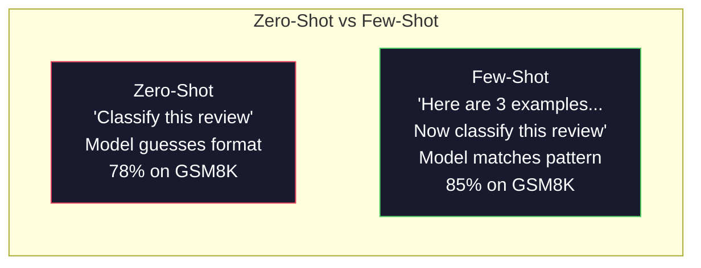
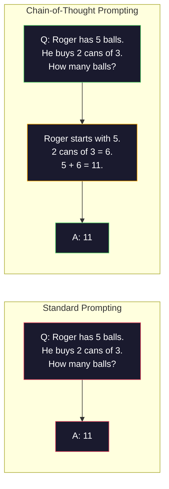
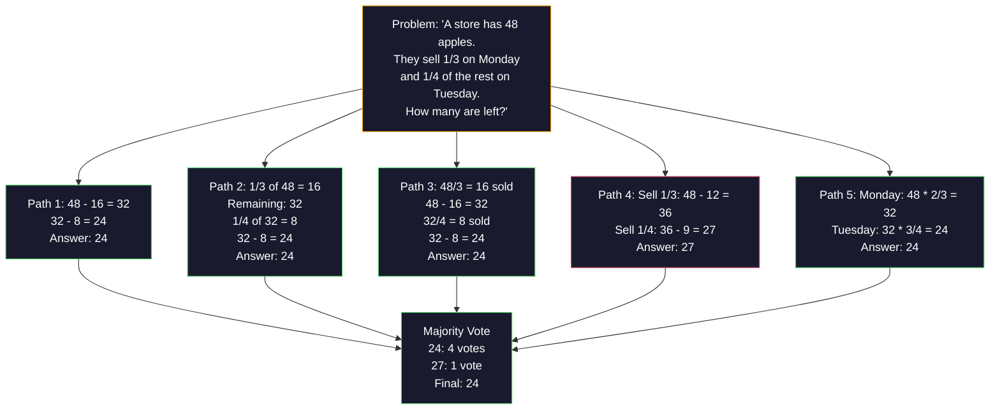
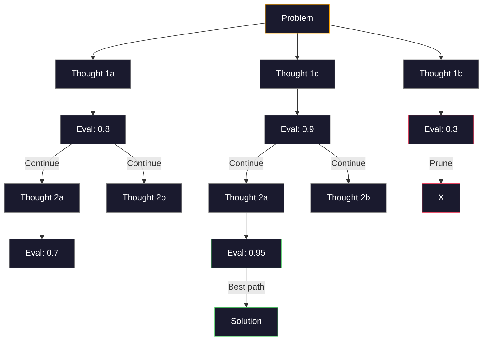

# Pocos disparos, cadena de pensamiento, árbol de pensamiento.

> El decir a un modelo qué hacer es incitarlo. Mostrarle cómo pensar es ingeniería. La brecha entre el 78% y el 91% de precisión en el mismo modelo, la misma tarea, los mismos datos no es un mejor modelo. Es una mejor estrategia de razonamiento.

> **【中文解读】**告诉模型"做什么" es una sugerencia, mostrar "cómo pensar" es un ingeniería.  El aumento de la precisión del 78% al 91% no se debe a un modelo mejor, sino a una estrategia de raciocinio mejor.  Menos ejemplos de pensamiento en cadena, autoconformidad de voto, etc.

> **【拓展：推理策略→AI Agent】**CoT/ToT/ReAct es la base de la idea moderna de Agente de IA.

> ¿ Qué es esto ?**【前置】**El programa de instrucción de la serie de instrucciones de la serie de instrucciones de la serie de instrucciones de la serie de instrucciones de la serie de instrucciones de la serie de instrucciones de la serie de instrucciones de la serie de instrucciones de la serie de instrucciones de la serie de instrucciones de la serie de instrucciones de la serie de instrucciones de la serie de instrucciones de la serie de instrucciones de la serie de instrucciones de la serie de instrucciones de la serie de instrucciones de la serie de instrucciones de la serie de instrucciones de la serie de instrucciones de la serie de instrucciones de la serie de instrucciones de la serie de instrucciones de la serie de instrucciones de la serie de instrucciones de la serie de instrucciones de la serie de instrucciones de la serie de instrucciones de la serie de instrucciones de la serie de instrucciones de la serie de instrucciones de la serie de instrucciones de la serie de instrucciones de la serie de instrucciones de la serie de instrucciones de la serie de instrucciones de la serie de instrucciones de la serie de instrucciones de la serie de instrucciones de la serie de instrucciones de la serie de instrucciones de la serie de instrucciones de la serie de instrucciones de la serie de instrucciones de la serie de instrucciones de la serie de instrucciones de la serie de instrucciones de la serie de instrucciones de la serie de instrucciones de la serie de instrucciones de la serie de instrucciones de la serie de instrucciones de la serie de instrucciones de la serie de instrucciones de la serie de instrucciones de la serie de instrucciones de la serie de instrucciones de la serie de los cuentan las instrucciones de los cuentan las instrucciones de los cuentan las instrucciones de los cuentan cuentan cuentan cuentan cuentan cuentan cuentan cuentan cuentan cuentan cuentan cuentan cuentan cuentan cuentan cuentan cuentan cuentan cuentan cuentan cuentan cuentan cuentan cuentan cuentan cuentan cuentan cuentan cuentan cuentan cuentan cuentan cuentan cuentan cuentan cuentan cuentan cuentan cuentan cuentan cuentan cuentan cuentan cuentan cuentan cuentan cuentan cuentan cuentan cuentan cuentan cuentan cuentan cuentan cuentan cuentan cuentan cuentan cuentan cuentan cuentan cuentan cuentan cuentan cuentan cuentan cuentan cuentan cu

**Type:** Build | **类型:** 构建
**Languages:** Python | **语言:** Python
**Prerequisites:** Lesson 11.01 (Prompt Engineering) | **前置知识:** Phase 11 · 01 (提示工程)
**Time:** ~45 minutes | **时间:** ~45 分钟

## Objetivos de aprendizaje

- Implemente la solicitud de pocas tomas seleccionando y formateando demostraciones de ejemplos que maximizan la precisión de la tarea
                                                                                                                                                                                                                                                                
- Aplicar el razonamiento de cadena de pensamiento (CoT) para mejorar la precisión en problemas de múltiples pasos como problemas de palabras matemáticas
  应用链式思维 (C) 推理 (CoT) para mejorar la precisión de los problemas de múltiples pasos (como los problemas de aplicación matemática)
- Construye un plan de pensamiento que explore múltiples caminos de razonamiento y seleccione el mejor
  构建思维树提示,探索多条推理路径并选择最佳路径
- Medir la mejora de precisión de la comparación entre cero disparos y pocos disparos y CoT en un punto de referencia estándar
  Aumento de la precisión de la medición de la base estándar de 0 muestras vs. muestras bajas vs. CoT

> **【中文解读】**Este curso tiene como objetivo: dominar un poco de tiempo en un instante y proporcionar ejemplos para guiar el proceso de salida y salida de ideas.


## El problema es la introducción del problema

Si usted crea una aplicación de matemáticas. Su mensaje dice: "Soluciona este problema de palabra". GPT-5 tiene la razón en el 94% del tiempo en GSM8K, el estándar de referencia de matemáticas de la escuela primaria. Usted piensa que ya alcanzó su punto máximo.

> Tu sugerencia es: "Resuelva este problema de aplicación". "La tasa de corrección en el GPT-5 en GSM8K es del 94%―"

Añadir cinco palabras -- "Pensemos paso a paso" -- y la precisión salta al 91%. Añadir algunos ejemplos de trabajo y llega al 95%. El mismo modelo. La misma temperatura. El mismo costo de API. La única diferencia es que le dio el papel de raspado al modelo.

> Además de cinco palabras, "pensemos paso a paso"  Precisión de la tasa de salto hasta el 91%  Además de algunos ejemplos ya resueltos alcanza el 95% 

Esto no es un hack. Es como funciona el razonamiento. Los humanos no resuelven problemas de múltiples pasos en un solo salto mental. Ni los transformadores. Cuando obligas a un modelo a generar tokens intermedios, esos tokens se convierten en parte del contexto del siguiente token. Cada paso de razonamiento alimenta al siguiente. El modelo calcula literalmente su camino a la respuesta.

> Esto no es un truco. Esta es la forma de trabajar de la hipótesis. La hipótesis de que el ser humano no completará una sola vez los problemas de varios pasos. El transformador también no. Cuando se obliga a un modelo a generar un token intermedio, estos tokens se convierten en parte de la siguiente secuencia de los tokens. Cada paso de la hipótesis proporciona información para el siguiente paso. El modelo realmente se encuentra en la forma de calcular para obtener la respuesta.

> ¿ Qué es esto ?**【类比】**No se utiliza CoT 像让人"心算 17 × 24" La mayoría de la gente calcula errores o se queda.

> ️ **【易错点】**Pocos disparos / CoT de 3 个坑:(1) **示例数量错误**0-shot CoT加 "Pensemos paso a paso" 就足, 再加 3-5 个少拍示例能再 2-5 点;**示例顺序敏感** Con los 3 ejemplos de A,B,C y C,B,A, la tasa de precisión varía entre el 5-10%; es necesario poner los "ejemplos más relevantes" en el último punto ((((3) **CoT 不适用于简单任务**¿Cuál es el problema de la teoría de la teoría de los nombres?

Pero "pensar paso a paso" es el principio, no el final. ¿Qué pasa si tomas una muestra de cinco caminos de razonamiento y tomas un voto mayoritario? ¿Qué pasa si dejas que el modelo explore un árbol de posibilidades, evalúe y poda ramas? ¿Qué pasa si mezclas el razonamiento con el uso de herramientas?

> Pero "pensar a pasos" es sólo el comienzo, no el final. Si se adoptan cinco rutas de reflexión y luego se realiza la mayoría de votos ¿cómo se va a hacer? Si se permite que un modelo explore un árbol de posibilidades, ¿cómo se evaluará y se cortará? ¿cómo se va a hacer si se sustituye la reflexión con el uso de herramientas?

## El concepto central.

> **【中文解读】**少样本学习 (少样本学习) y思维链 (Chain-of-Thought, CoT) son dos grandes técnicas centrales de la ingeniería rápida.

> **【拓展：CoT 的推理提升效果】**El artículo de Google 2022 demuestra que, en la tarea de la raciocinio matemática, CoT aumentará la precisión de PaLM 540B del 17% al 56%.

> ¿ Qué es esto ?**【困惑】**P: ¿Qué es esto? ¿Acaso también necesito escribir "pensar paso a paso"? A: No necesito, pero tengo premisas: 1) Usar para apoyar el modelo de teoría de la vida original Claude 4.5+、GPT-5、o3、DeepSeek-R1 etc; 2) 任务确实需要推理简单分类任务原生思考反而拖慢;;对老模型(GPT-4、Claude 3)`reasoning_effort`O `thinking`参数, usarlo; sinon usarlo rápido。


### Cero-Shot vs Pocos-Shot: Cuando los ejemplos superan las instrucciones

La llamada de tiro cero le da al modelo una tarea y nada más.

> 零样本提示只给模型一个任务,不加其他内容――少样本提示则先给模型一个任务,不加其他内容―― pocos样本提示则先给模型一个任务,不加其他内容――

Wei et al. (2022) midieron esto en 8 puntos de referencia. Para tareas simples como la clasificación de sentimiento, las tiradas cero y las tiradas pocas se realizan dentro del 2% de las demás. Para tareas complejas como la aritmética de múltiples pasos y el razonamiento simbólico, las tiradas pocas mejoraron la precisión en un 10-25%.

> Wei 等人 (WEB 2022) ha medido este punto en 8 criterios. En las tareas simples como emoción, la diferencia de rendimiento entre muestra cero y muestra pequeña es del 2% en el interior. En las tareas complejas como el cálculo de múltiples pasos y la hipótesis de símbolos, la tasa de precisión de muestra pequeña aumentará del 10 al 25%.

La intuición: los ejemplos son instrucciones comprimidas. En lugar de describir el formato de salida, lo muestras. En lugar de explicar el proceso de razonamiento, lo demuestras. El modelo de patrón coincide con los ejemplos de manera más confiable que interpreta instrucciones abstractas.

> 直觉: el ejemplo es una instrucción de compresión. Con su descripción de un formato de salida, no se puede mostrar directamente. Con su explicación del proceso de cálculo, no se puede demostrar directamente.



**When few-shot wins:**tareas sensibles al formato, clasificación, extracción estructurada, jerga específica de dominio, cualquier tarea en la que el modelo deba coincidir con un patrón específico.

> **少样本胜出的场景**: forma sensible de tareas, categorías, estrategias estructuradas, términos específicos de los ámbitos, cualquier modelo que necesite adaptarse a un modelo específico de tareas.

**When zero-shot wins:**Las preguntas simples y factuales, tareas creativas donde los ejemplos limitan la creatividad, tareas donde encontrar buenos ejemplos es más difícil que escribir buenas instrucciones.

> **零样本胜出的场景**: simple problema de hecho, ejemplos que limitan las tareas creativas creativas, buscar buenos ejemplos que escribir buenas instrucciones más difíciles de tareas.

### Selección de ejemplos: Batidas aleatorias similares

No todos los ejemplos son iguales. Elegir ejemplos similares a la entrada objetivo supera la selección aleatoria en 5-15% en las tareas de clasificación (Liu et al., 2022).

> No todos los ejemplos son los mismos. Los ejemplos similares a los objetivos de selección en las tareas de clasificación son de 5-15% más altos que los ejemplos de selección de elección.

1. **Semantic similarity**: escoger ejemplos más cercanos a la entrada en el espacio de incorporación
   **语义相似性**: seleccionar ejemplos de entrada más cercanos en el espacio de inserción
2. **Label diversity**: cubre todas las categorías de salida en sus ejemplos
   **标签多样性**: en ejemplos cubre todas las categorías de salida
3. **Difficulty matching**: coincide con el nivel de complejidad del problema objetivo
   **难度匹配**: Clasificación de complejidad de los problemas de la aplicación del objetivo

La cantidad óptima de ejemplos para la mayoría de las tareas es de 3-5. Bajo 3, el modelo no tiene suficiente señal para extraer el patrón.

> La mayoría de las tareas tienen un número de ejemplos óptimo de 3-5 ⋅ menos de 3, el modelo no tiene suficientes señales para obtener un modelo ⋅ más de 5, los beneficios marginal se reducen y se gastan en los tokens de la ventana siguiente ⋅ para varias categorías de etiquetas, cada etiqueta utiliza un ejemplo ⋅

### Cadena de pensamiento: dar modelos

La idea de la "cadena de pensamiento" (CoT) fue introducida por Wei et al. (2022) en Google Brain. La idea es simple: en lugar de pedirle al modelo la respuesta, pídale que muestre sus pasos de razonamiento primero.

> 链式思维(CoT)提示由Google Brain 的 Wei 等人(2022) introducción──idea es simple: no sólo requiere que el modelo dé una respuesta, sino que requiere que primero muestre los pasos de la idea──



Cada token generado por un transformador se convierte en contexto para el siguiente token. sin CoT, el modelo debe comprimir todo el razonamiento en el estado oculto de un solo paso hacia adelante.

> ¿Por qué esto es válido en el mecanismo?Con el transformador, cada token generado se convierte en el siguiente token. Sin CoT, el modelo debe comprimir todas las teorías hasta el estado oculto de transmisión en un solo momento.

**GSM8K benchmarks (grade-school math, 8.5K problems):**

| Model | Zero-Shot | Zero-Shot CoT | Few-Shot CoT |
|-------|-----------|---------------|--------------|
| GPT-4o | 78% | 91% | 95% |
| GPT-5 | 94% | 97% | 98% |
| o4-mini (reasoning) | 97% | — | — |
| Claude Opus 4.7 | 93% | 97% | 98% |
| Gemini 3 Pro | 92% | 96% | 98% |
| Llama 4 70B | 80% | 89% | 94% |
| DeepSeek-V3.1 | 89% | 94% | 96% |

**Note on reasoning models.**Los modelos como la serie o de OpenAI (o3, o4-mini) y DeepSeek-R1 ejecutan una cadena de pensamiento internamente antes de emitir su respuesta.

> **关于推理模型的说明。**Los modelos de este tipo, como los de OpenAI (o3、o4-mini) y DeepSeek-R1, se ejecutan en una cadena de pensamiento interna antes de la respuesta de salida.

Dos sabores de CoT:

> Dos formas de la CoT:

**Zero-shot CoT**Kojima et al. (2022) mostró que esta sola oración mejora la precisión en las tareas de aritmética, sentido común y razonamiento simbólico.

> **零样本 CoT**En el último capítulo, el texto se refiere a la "Pensación de paso a paso" (¡No necesitamos ejemplos!) (Kojima et al. en 2022) que indica que esta frase puede mejorar la precisión en las tareas de cálculo, la normalidad y la lógica de cálculo.

**Few-shot CoT**Es más eficaz que la CoT de tiro cero porque el modelo ve el formato exacto de razonamiento que usted espera.

> **少样本 CoT**El modelo es más eficaz que el modelo de la idea, ya que el modelo ve el formato de la idea exacto que usted espera.

**When CoT hurts**En el caso de las tareas de alto rendimiento y de baja complejidad, se considera un gasto perdido.

> **CoT 何时有害**La velocidad es más importante que la precisión. Cada consulta aumenta 50-200 tokens de la racionalización de la venta. Para tareas de alta capacidad de producción.

### Autoconsistencia: Muchos ejemplos, vota una vez

Wang et al. (2023) introdujo la autoconsistencia. La idea: un solo camino de CoT puede contener errores de razonamiento. Pero si muestra N caminos de razonamiento independientes (utilizando temperatura > 0) y toma el voto mayoritario en la respuesta final, los errores se anulan.

> Wang 等人(2023) introdujo la autoconsistencia―洞察:单条 CoT 路径可能包含推理错误―, pero si usted toma la muestra N 条独立的推理路径(Use temperatura > 0)并对最终答案进行多数投票,错误就会相互抵消―.



La autoconsistencia mejoró la precisión de GSM8K del 56,5% (Cot único) al 74,4% con N=40 en los experimentos originales PaLM 540B. En el caso de GPT-5, la mejora es pequeña (97% a 98%) porque la precisión de base ya está saturada. La técnica brilla más en modelos con una precisión de 60-85% de base de CoT -- el punto ideal donde los errores de un solo camino son frecuentes pero no sistemáticos. Para los modelos de razonamiento (series o, R1) la autoconsistencia se subsume por el muestreo interno incorporado.

> Desde la coexistencia en el PaLM 540B original, la tasa de precisión de GSM8K aumentará de 56.5% a 74.4% en el GPT-5 (en el caso de la GPT-5), mejorando muy poco, ya que la tasa de precisión de base ya se ha mantenido en el sistema.

El tradeoff: N muestras significa Nx el costo de API y la latencia. En la práctica, N=5 capta la mayor parte de los beneficios. N=3 es el mínimo para un voto significativo. N > 10 tiene rendimientos decrecientes para la mayoría de las tareas.

> 权衡:N 个样本意味着N 倍的API 成本和延迟――在实践中,N=5 捕获了大部分收益――N=3 es el requisito mínimo de voto significativo――N > 10 para la mayoría de las tareas de los beneficios marginales 减持――

### Árbol de pensamiento: exploración de ramas

Yao et al. (2023) introdujo el Árbol de Pensamiento (ToT). Cuando el CoT sigue un camino de razonamiento lineal, el ToT explora múltiples ramas y evalúa las que son más prometedoras antes de continuar.

> Yao 等人(2023) introdujo el pensamiento de la planta (T) ;;CoT  Along a linear                                                                                                                                                                                                                                                 



El TOT tiene tres componentes:

> Tiene tres componentes:

1. **Thought generation**: producen múltiples candidatos pasos siguientes
   **思维生成**: generar múltiples candidatos
2. **State evaluation**: calificar a cada candidato (puede utilizar el propio LLM como evaluador)
   **状态评估**Para cada candidato, puede utilizar el LLM como evaluador.
3. **Search algorithm**: BFS o DFS a través del árbol, poda ramas de puntaje bajo
   **搜索算法**Por medio de la BFS o DFS, cortar la sección de la sección

En el juego de 24 tareas (combinar 4 números usando la aritmética para hacer 24), GPT-4 con la solicitud estándar resuelve el 7,3% de los problemas. con CoT, el 4,0% (CoT realmente duele aquí porque el espacio de búsqueda es amplio). con ToT, el 74%.

> En el juego de 24 tareas, GPT-4 utiliza un estándar de sugerencias para resolver 7.3% de los problemas.

Cada nodo del árbol requiere una llamada de LLM. Un árbol con factor 3 de ramificación y profundidad 3 requiere hasta 39 llamadas de LLM. Utilice sólo para problemas donde el espacio de búsqueda es grande pero evaluable: planificación, resolución de rompecabezas, resolución creativa de problemas con restricciones.

> Para cada uno de los tramos de árboles, cada uno de ellos necesita una vez más de LLM. Un tramo de 3 tramos de 3 tramos de 3 tramos de 3 tramos de 3 tramos de 3 tramos de 3 tramos de 3 tramos de 3 tramos de 3 tramos de 3 tramos de 3 tramos de 3 tramos de 3 tramos de 3 tramos de 3 tramos de 3 tramos de 3 tramos de 3 tramos de 3 tramos de 3 tramos de 3 tramos de 3 tramos de 3 tramos de 3 tramos de 3 tramos de 3 tramos de 3 tramos de 3 tramos de 3 tramos de 3 tramos de 3 tramos de 3 tramos de 3 tramos de 3 tramos de 3 tramos de 3 tramos de 3 tramos de 3 tramos de 3 tramos de 3 tramos de 3 tramos de 3 tramos de 3 tramos de 3 tramos de 3 tramos de 3 tramos de 3 tramos de 3 tramos de 3 tramos de 3 tramos de 3 tramos de 3 tramos de 3 tramos de 3 tramos de 3 tramos de 3 tramos de 3 tramos de 3 tramos de 3 tramos de 3 tramos de 3 tramos de 3 tramos de 3 tramos de 3 tramos de 3 tramos de 3 tramos de 3 tramos de 3 tramos de 3 tramos de 3 tramos de 3 tramos de 3 tramos de 3 tramos de 3 tramos de 3 tramos de 3 tramos de 3 tramos de tramos de 3 tramos de tramos de 3 tramos de tramos de tramos de tramos de tramos de tramos de tramos de tramos de tramos de tramos de tramos de tramos de tramos de tramos de tramos de tramos de tramos de tramos de tramos de tramos de tramos de tramos de tramos de tramos de tramos de tramos de tramos de tramos de tramos de tramos de tramos de tramos de tramos de tramos de tramos de tramos de tramos de tramos de tramos de tramos de tramos de tramos de tramos de tramos de tramos de tramos de tramos de tramos de tramos de tramos de tramos de tramos de tramos de tr

### Reacción: Pensamiento + acción

Yao et al. (2022) combinó rastros de razonamiento con acciones. El modelo alterna entre el pensamiento (generar razonamiento) y la acción (llamando herramientas, búsqueda, computación).

> Yao 等人(2022) se va a pensar en el camino y el camino de la acción.

```mermaid
graph LR
    Q["Question:\nWhat is the\npopulation of the\ncountry where\nthe Eiffel Tower\nis located?"]
    T1["Thought: I need to\nfind which country\nhas the Eiffel Tower"]
    A1["Action: search\n'Eiffel Tower location'"]
    O1["Observation:\nParis, France"]
    T2["Thought: Now I need\nFrance's population"]
    A2["Action: search\n'France population 2024'"]
    O2["Observation:\n68.4 million"]
    T3["Thought: I have\nthe answer"]
    F["Answer:\n68.4 million"]

    Q --> T1 --> A1 --> O1 --> T2 --> A2 --> O2 --> T3 --> F

    style Q fill:#1a1a2e,stroke:#ffa500,color:#fff
    style T1 fill:#1a1a2e,stroke:#51cf66,color:#fff
    style A1 fill:#1a1a2e,stroke:#e94560,color:#fff
    style O1 fill:#1a1a2e,stroke:#808080,color:#fff
    style T2 fill:#1a1a2e,stroke:#51cf66,color:#fff
    style A2 fill:#1a1a2e,stroke:#e94560,color:#fff
    style O2 fill:#1a1a2e,stroke:#808080,color:#fff
    style T3 fill:#1a1a2e,stroke:#51cf66,color:#fff
    style F fill:#1a1a2e,stroke:#51cf66,color:#fff
```



ReAct supera a la CoT pura en tareas de conocimiento intenso porque puede fundamentar su razonamiento en datos reales. En HotpotQA (respuesta a preguntas de múltiples pasos), ReAct con GPT-4 logra un empate exacto del 35,1% frente al 29,4% para la CoT sola. El poder real es que los errores de razonamiento se corregen mediante observaciones - el modelo puede actualizar su plan a mediados de ejecución.

> ReAct es superior a la pure CoT en tareas de tipo intenso de conocimiento, ya que puede ser basado en datos reales. En HotpotQA, ReAct alcanza un porcentaje de compatibilidad exacta del 35,1% con GPT-4, mientras que la pure CoT es del 29,4%. La verdadera fuerza está en la hipótesis de errores que se pueden corregir a través de observaciones.

ReAct es la base de los agentes de IA modernos. Cada marco de agentes (LangChain, CrewAI, AutoGen) implementa alguna variante del bucle de Pensamiento-Acción-Observación.

> ReAct es la base de la moderna Agencia de IA. Cada Agente ha logrado una variante del ciclo de pensamiento-acción-observación.

### Prompting estructurado: etiquetas XML, delimitadores, encabezados

A medida que las instrucciones se complejan, la estructura evita que el modelo confunde las secciones.

>  Con la complejidad de las sugerencias, la estructura puede evitar que el modelo se mezcla en diferentes partes.

**XML tags**(Funciona mejor con Claude, sólido en todas partes):
```
<context>
You are reviewing a pull request.
The codebase uses TypeScript and React.
</context>

<task>
Review the following diff for bugs, security issues, and style violations.
</task>

<diff>
{diff_content}
</diff>

<output_format>
List each issue with: file, line, severity (critical/warning/info), description.
</output_format>
```

**Markdown headers**(universal):
```
## Role
Senior security engineer at a fintech company.

## Task
Analyze this API endpoint for vulnerabilities.

## Input
{api_code}

## Rules
- Focus on OWASP Top 10
- Rate each finding: critical, high, medium, low
- Include remediation steps
```

**Delimiters**(minimal pero eficaz):
```
---INPUT---
{user_text}
---END INPUT---

---INSTRUCTIONS---
Summarize the above in 3 bullet points.
---END INSTRUCTIONS---
```

### Enlace rápido: descomposición secuencial

Algunas tareas son demasiado complejas para un solo pedido. La cadena de pedido las divide en pasos, donde la salida de un pedido se convierte en la entrada del siguiente.

> Algunas tareas son demasiado complejas, no se pueden completar con una sola pista. La pista las dividirá en pasos, una salida de la pista se convertirá en la entrada de la siguiente pista.


La cadena de la velocidad de la señal de un solo momento por tres razones:

> 链式优于单提示 tiene tres razones:

1. **Each step is simpler**: el modelo maneja una tarea enfocada en lugar de hacer malabares con todo
   **每个步骤更简单**Modelo: procesar una tarea enfocada, en lugar de enfrentar todas las cosas al mismo tiempo
2. **Intermediate outputs are inspectable**: puede validar y corregir entre pasos
   **中间输出可检查**Puedes verificar y corregir entre pasos
3. **Different steps can use different models**: utilizar un modelo barato para extraer, un caro para razonar
   **不同步骤可以使用不同模型**: hacerse con modelos baratos, hacerse con modelos caros

### Comparación de rendimiento

| Technique | Best For | GSM8K Accuracy (GPT-5) | API Calls | Token Overhead | Complexity |
|-----------|----------|------------------------|-----------|----------------|------------|
| Zero-Shot | Simple tasks | 94% | 1 | None | Trivial |
| Few-Shot | Format matching | 96% | 1 | 200-500 tokens | Low |
| Zero-Shot CoT | Quick reasoning boost | 97% | 1 | 50-200 tokens | Trivial |
| Few-Shot CoT | Maximum single-call accuracy | 98% | 1 | 300-600 tokens | Low |
| Self-Consistency (N=5) | High-stakes reasoning | 98.5% | 5 | 5x token cost | Medium |
| Reasoning model (o4-mini) | Drop-in CoT replacement | 97% | 1 | hidden (2-10x internal) | Trivial |
| Tree-of-Thought | Search/planning problems | N/A (74% on Game of 24) | 10-40+ | 10-40x token cost | High |
| ReAct | Knowledge-grounded reasoning | N/A (35.1% on HotpotQA) | 3-10+ | Variable | High |
| Prompt Chaining | Complex multi-step tasks | 96% (pipeline) | 2-5 | 2-5x token cost | Medium |

La técnica correcta depende de tres factores: el requisito de precisión, el presupuesto de latencia y la tolerancia al costo.

> La técnica exacta depende de tres factores: la demanda de tasa de precisión, el presupuesto tardío y la tolerancia a los costes.

## Construye y realiza.
```figure
few-shot-curve
```

## Construye el mismo

Construiremos un solucionador de problemas matemáticos que combina la pregunta de pocos disparos, el razonamiento de cadena de pensamiento y la votación de autoconsistencia en una sola línea de tubería. Luego añadiremos el árbol de pensamiento para problemas difíciles.

> Construiremos un sistema de búsqueda de soluciones de problemas matemáticos, crearemos un pequeño ejemplar de sugerencias, de ideas en cadena y de ideas de autoconformidad, y formaremos una línea de votación.

La aplicación completa se realiza en `code/advanced_prompting.py`Aquí están los componentes clave.

>                                                                                                                                                                                                                                                                                                                                                                                                                                                                                                                              `code/advanced_prompting.py`En el siguiente cuadro se muestra el elemento clave.

### Paso 1: Ejemplo de la tienda de pocos disparos

El primer componente gestiona ejemplos de pocos disparos y selecciona los más relevantes para un problema determinado.

> Primero, el componente de gestión de ejemplos de pocos ejemplos, y el ejemplos más relacionados para determinar los problemas.

```python
GSM8K_EXAMPLES = [
    {
        "question": "Janet's ducks lay 16 eggs per day. She eats three for breakfast every morning and bakes muffins for her friends every day with four. She sells every egg at the farmers' market for $2. How much does she make every day at the farmers' market?",
        "reasoning": "Janet's ducks lay 16 eggs per day. She eats 3 and bakes 4, using 3 + 4 = 7 eggs. So she has 16 - 7 = 9 eggs left. She sells each for $2, so she makes 9 * 2 = $18 per day.",
        "answer": "18"
    },
    ...
]
```

Cada ejemplo tiene tres partes: la pregunta, la cadena de razonamiento y la respuesta final. La cadena de razonamiento es lo que transforma un ejemplo regular de pocos disparos en un ejemplo de pocos disparos de CoT.

> Cada ejemplo tiene tres partes: problema, cadena de sugerencias y respuesta final. La cadena de sugerencias es la clave para convertir un ejemplo de muestra ordinaria en un ejemplo de muestra de CoT.

### Paso 2: Construir una cadena de pensamiento

El constructor de preguntas conjunta un mensaje del sistema, ejemplos de pocos disparos con cadenas de razonamiento y la pregunta objetivo en una sola pregunta.

> 提示Constructor: 提示, con el sistema de mensajes 带推理链的少样本示例和目标问题组装成单个提示.

```python
def build_cot_prompt(question, examples, num_examples=3):
    system = (
        "You are a math problem solver. "
        "For each problem, show your step-by-step reasoning, "
        "then give the final numerical answer on the last line "
        "in the format: 'The answer is [number]'."
    )

    example_text = ""
    for ex in examples[:num_examples]:
        example_text += f"Q: {ex['question']}\n"
        example_text += f"A: {ex['reasoning']} The answer is {ex['answer']}.\n\n"

    user = f"{example_text}Q: {question}\nA:"
    return system, user
```

La restricción de formato ("La respuesta es [número]") es crítica.

> 格式约束 (("La respuesta es [número]") 至关重要──没有它,自一致性无法在不同样本之间提取和比较答案──

### Paso 3: Votación de autoconsistencia

Muestre N caminos de razonamiento y tomar la respuesta mayoritaria.

> 采样 N 条推理路径,取多数答案──

```python
def self_consistency_solve(question, examples, client, model, n_samples=5):
    system, user = build_cot_prompt(question, examples)

    answers = []
    reasonings = []
    for _ in range(n_samples):
        response = client.chat.completions.create(
            model=model,
            messages=[
                {"role": "system", "content": system},
                {"role": "user", "content": user}
            ],
            temperature=0.7
        )
        text = response.choices[0].message.content
        reasonings.append(text)
        answer = extract_answer(text)
        if answer is not None:
            answers.append(answer)

    vote_counts = Counter(answers)
    best_answer = vote_counts.most_common(1)[0][0] if vote_counts else None
    confidence = vote_counts[best_answer] / len(answers) if best_answer else 0

    return best_answer, confidence, reasonings, vote_counts
```

La temperatura 0,7 es importante. A temperatura 0,0, todas las muestras de N serían idénticas, derrotando el propósito. Necesitas suficiente aleatoriedad para diversas vías de razonamiento pero no tanto que el modelo produzca gibberish.

> La temperatura 0.7 es muy importante. En la temperatura 0.0 abajo, todos los modelos N se vuelven iguales, pierden sentido. Necesitas suficiente casualidad para producir una variedad de rutas de cálculo, pero no puede ser demasiado para que el modelo genere desorden.

### Paso 4: Resolver el árbol de pensamiento

Para los problemas en los que el razonamiento lineal falla, ToT explora múltiples enfoques y evalúa qué dirección es más prometedora.

> Para el problema del fracaso de la racionalización lineal, explorar diferentes métodos y evaluar en qué dirección hay mejores perspectivas.

```python
def tree_of_thought_solve(question, client, model, breadth=3, depth=3):
    thoughts = generate_initial_thoughts(question, client, model, breadth)
    scored = [(t, evaluate_thought(t, question, client, model)) for t in thoughts]
    scored.sort(key=lambda x: x[1], reverse=True)

    for current_depth in range(1, depth):
        next_thoughts = []
        for thought, score in scored[:2]:
            extensions = extend_thought(thought, question, client, model, breadth)
            for ext in extensions:
                ext_score = evaluate_thought(ext, question, client, model)
                next_thoughts.append((ext, ext_score))
        scored = sorted(next_thoughts, key=lambda x: x[1], reverse=True)

    best_thought = scored[0][0] if scored else ""
    return extract_answer(best_thought), best_thought
```

El evaluador es en sí mismo una convocatoria de LLM. Preguntas al modelo: "En una escala de 0.0 a 1.0, ¿qué tan prometedora es esta ruta de razonamiento para resolver el problema?" Esta es la idea clave de ToT - el modelo evalúa sus propias soluciones parciales.

> 评估器本身就是一个LLM调用――你问模型:"En el rango de 0.0 a 1.0, ¿cómo es la perspectiva de este camino de la solución del problema?"

### Paso 5: Línea completa

El oleoducto combina todas las técnicas con una estrategia de escalada.

> 流水线结合所有技术与升级策略──

```python
def solve_with_escalation(question, examples, client, model):
    system, user = build_cot_prompt(question, examples)
    single_response = call_llm(client, model, system, user, temperature=0.0)
    single_answer = extract_answer(single_response)

    sc_answer, confidence, _, _ = self_consistency_solve(
        question, examples, client, model, n_samples=5
    )

    if confidence >= 0.8:
        return sc_answer, "self_consistency", confidence

    tot_answer, _ = tree_of_thought_solve(question, client, model)
    return tot_answer, "tree_of_thought", None
```

La lógica de escalada: primero prueba barato (Cot único). Si la confianza en la autoconsistencia es inferior a 0.8 (menos de 4 de 5 muestras coinciden), escala a ToT. Esto equilibra el costo y la precisión - la mayoría de los problemas se resuelven a bajo costo, los problemas difíciles obtienen más computación.

> 升级逻辑:先尝试廉价的(单次Cot) ⋅ Si la autoconfianza de la conformidad es inferior a 0.8 ((5 ejemplares de menos de 4 coincidencias), entonces se eleva a ToT── esto equilibra el costo y la tasa de precisión La mayoría de los problemas se resuelven con bajo costo, dificultando obtener más recursos de cálculo──

## Usalo con el marco de ejecución

### Las instrucciones de pocos disparos basadas en plantillas

LangChain proporciona soporte incorporado para plantillas rápidas y análisis de salida que simplifican los patrones de pocos disparos y CoT:

> LangChain para simplificar los modelos y modelos de CoT

```python
from langchain_core.prompts import FewShotPromptTemplate, PromptTemplate
from langchain_openai import ChatOpenAI

example_prompt = PromptTemplate(
    input_variables=["question", "reasoning", "answer"],
    template="Q: {question}\nA: {reasoning} The answer is {answer}."
)

few_shot_prompt = FewShotPromptTemplate(
    examples=examples,
    example_prompt=example_prompt,
    suffix="Q: {input}\nA: Let's think step by step.",
    input_variables=["input"]
)

llm = ChatOpenAI(model="gpt-4o", temperature=0.7)
chain = few_shot_prompt | llm
result = chain.invoke({"input": "If a train travels 120 km in 2 hours..."})
```

LangChain también ha `ExampleSelector`clases para la selección de similitud semántica:

> La cadena de langos también está.`ExampleSelector`类用于语义相似性选择:

```python
from langchain_core.example_selectors import SemanticSimilarityExampleSelector
from langchain_openai import OpenAIEmbeddings

selector = SemanticSimilarityExampleSelector.from_examples(
    examples,
    OpenAIEmbeddings(),
    k=3
)
```

### Compilación de las instrucciones

DSPy trata las estrategias de solicitud como módulos optimizables. En lugar de elaborar instrucciones de CoT a mano, se define una firma y se permite a DSPy optimizar la solicitud:

> DSPy va a dar una sugerencia estratégica como un módulo de optimización.

```python
import dspy

dspy.configure(lm=dspy.LM("openai/gpt-4o", temperature=0.7))

class MathSolver(dspy.Module):
    def __init__(self):
        self.solve = dspy.ChainOfThought("question -> answer")

    def forward(self, question):
        return self.solve(question=question)

solver = MathSolver()
result = solver(question="Janet's ducks lay 16 eggs per day...")
```

Es un DSPy.`ChainOfThought`automáticamente añade rastros de razonamiento. `dspy.majority`Implementa la autoconsistencia:

> DSPy de `ChainOfThought`Automaticamente añadir a la trayectoria`dspy.majority`实现自一致性:

```python
result = dspy.majority(
    [solver(question=q) for _ in range(5)],
    field="answer"
)
```

### Comparación: desde el rascón versus los marcos

| Feature | From-Scratch (this lesson) | LangChain | DSPy |
|---------|--------------------------|-----------|------|
| Control over prompt format | Full | Template-based | Automatic |
| Self-consistency | Manual voting | Manual | Built-in (`dspy.majority`) |
| Example selection | Custom logic | `ExampleSelector` | `dspy.BootstrapFewShot` |
| Tree-of-Thought | Custom tree search | Community chains | Not built-in |
| Prompt optimization | Manual iteration | Manual | Automatic compilation |
| Best for | Learning, custom pipelines | Standard workflows | Research, optimization |

## Envíe el producto .

Esta lección produce dos artefactos.

> Este curso produce dos productos:

**1. Reasoning Chain Prompt**(El artículo`outputs/prompt-reasoning-chain.md`): una plantilla de respuesta rápida para CoT de pocos disparos con autoconsistencia.

> **1. 推理链提示**(El artículo`outputs/prompt-reasoning-chain.md`): un pequeño modelo de producción  CoT 配合自一致性提示模板──插入你的示例和问题领域即可使用──

**2. CoT Pattern Selection Skill**(El artículo`outputs/skill-cot-patterns.md`): un marco de decisión para elegir la técnica de razonamiento adecuada en función del tipo de tarea, los requisitos de precisión y las limitaciones de costes.

> **2. CoT 模式选择技能**(El artículo`outputs/skill-cot-patterns.md`): en función del tipo de tarea, la demanda y el coste de la precisión se puede elegir el marco de decisión de la técnica de la correcta evaluación.

## Los ejercicios.

1. **Measure the gap**Tome 10 problemas GSM8K. resuelva cada uno con cero disparos, pocos disparos, cero disparos CoT, y pocos disparos CoT. Registra la precisión para cada uno. ¿Qué técnica da el mayor aumento en su modelo?
   **测量差距**:Take 10 ways GSM8K 题目──用零样本、少样本、零样本 CoT 和少样本 CoT 分别求解──记录每种方法的准确率──哪种技术给你的模型带来最大提升?

2. **Example selection experiment**Para los mismos 10 problemas, comparar la selección aleatoria de ejemplos con ejemplos similares seleccionados a mano.
   **示例选择实验**Para los mismos 10 temas, comparar ejemplos similares de selección de ejemplos y selección manual.

3. **Self-consistency cost curve**Runs auto-consistencia con N=1, 3, 5, 7, 10 en 20 problemas GSM8K. Precisión de trama vs costo (tokens totales). ¿Dónde está la rodilla de la curva para su modelo?
   **自一致性成本曲线**En el tema de 20 W GSM8K, utiliza N=1、3、5、7、10 运行自一致性──绘制准确率 vs 成本(总代币) 图──¿Dónde está el punto de inflexión de tu modelo?

4. **Build a ReAct loop**Cuando el modelo genera una expresión matemática, ejecuta con Python `eval()`Medir si el razonamiento basado en herramientas supera la TCC pura.
   **构建 ReAct 循环**Cuando el modelo genera una expresión matemática, utiliza Python.`eval()`(en la caja) ejecutar y obtener resultados contra──.

5. **ToT for creative tasks**: Adapta el solucionador de árbol de pensamiento para una tarea de escritura creativa: "Escribe una historia de 6 palabras que sea divertida y triste". Utilice el LLM como evaluador. ¿La exploración ramificada produce mejores resultados creativos que la generación de una sola vez?
   **ToT 用于创意任务**¿Escribe una historia de seis palabras tanto interesantes como triste? ¿Usa el LLM como un instrumento de evaluación? ¿Explora si se produce una mejor producción de ideas que una sola generación?

## Términos clave .

| Term | What people say | What it actually means | 中文释义 |
|------|----------------|----------------------|---------|
| Few-shot prompting | "Give it some examples" / "给些示例" | Including input-output demonstrations in the prompt to anchor the model's output format and behavior | 少样本提示：在提示中包含输入/输出演示，锚定模型的输出格式和行为 |
| Chain-of-Thought | "Make it think step by step" / "让它一步步想" | Eliciting intermediate reasoning tokens that extend the model's effective computation before producing a final answer | 链式思维：引出中间推理 token，在产生最终答案之前扩展模型的有效计算 |
| Self-Consistency | "Run it multiple times" / "多跑几次" | Sampling N diverse reasoning paths at temperature > 0 and selecting the most common final answer by majority vote | 自一致性：在 temperature > 0 下采样 N 条多样推理路径，通过多数投票选择最常见的最终答案 |
| Tree-of-Thought | "Let it explore options" / "让它探索选项" | Structured search over reasoning branches where each partial solution is evaluated and only promising paths are expanded | 思维树：对推理分支进行结构化搜索，评估每个部分解，只扩展有前景的路径 |
| ReAct | "Thinking + tool use" / "思考+工具使用" | Interleaving reasoning traces with external actions (search, compute, API calls) in a Thought-Action-Observation loop | ReAct：在 Thought-Action-Observation 循环中交替推理轨迹与外部行动 |
| Prompt chaining | "Break it into steps" / "分成几步" | Decomposing a complex task into sequential prompts where each output feeds the next input | 提示链：将复杂任务分解为顺序提示，每个输出作为下一个输入 |
| Zero-shot CoT | "Just add 'think step by step'" / "加一句'一步步想'" | Appending a reasoning trigger phrase to a prompt without any examples, relying on the model's latent reasoning capability | 零样本 CoT：在提示末尾添加推理触发短语，不使用任何示例，依赖模型的潜在推理能力 |

## Más Leer más Leer más

- [Chain-of-Thought Prompting Elicits Reasoning in Large Language Models](https://arxiv.org/abs/2201.11903)- Wei et al. 2022. El documento original de CoT de Google Brain. Lea las secciones 2-3 para los resultados principales.
  Wei 等人 2022──Google Brain original CoT 论文──leer la sección 2-3 节获取核心结果──
- [Self-Consistency Improves Chain of Thought Reasoning in Language Models](https://arxiv.org/abs/2203.11171)- Wang et al. 2023. el documento de autoconsistencia. la tabla 1 tiene todos los números que necesita.
  Wang 等人 2023──自一致性论文──表 1 包含你需要的所有数据──
- [Tree of Thoughts: Deliberate Problem Solving with Large Language Models](https://arxiv.org/abs/2305.10601)El juego de 24 resultados en la sección 4 son el punto culminante.
  Yao 等人 2023──思维树论文──第4节的 24 juegos 结果是亮点──
- [ReAct: Synergizing Reasoning and Acting in Language Models](https://arxiv.org/abs/2210.03629)Yao et al. 2022. La base de los agentes de IA modernos. La sección 3 explica el ciclo de pensamiento-acción-observación.
  Yao 等人 2022。现代 AI Agent的基础──第 3 节解释了思维行动观察循环──
- [Large Language Models are Zero-Shot Reasoners](https://arxiv.org/abs/2205.11916)-- Kojima et al. 2022. El documento "Pensemos paso a paso". Sorprendentemente eficaz por lo simple que es.
  Kojima 等人 2022──"Pensemos paso a paso" 论文──如此简单却出奇地有效──
- [DSPy: Compiling Declarative Language Model Calls into Self-Improving Pipelines](https://arxiv.org/abs/2310.03714)-- Khattab et al. 2023. Trata de la solicitud como un problema de compilación. Lea si quiere ir más allá de la ingeniería manual de la solicitud.
  Khattab 等人 2023──将提示视为编译问题── Si piensas en más de un proyecto de sugerencias, vale la pena leer.
- [OpenAI — Reasoning models guide](https://platform.openai.com/docs/guides/reasoning)-- guía del proveedor sobre cuándo la cadena de pensamiento se convierte en un modo interno de "razón" por token, en comparación con un truco de nivel inmediato.
  OpenAI  sobre la orientación del modelo de la suposición: la cadena de pensamiento ¿Cuándo se convierte en un modelo de "suposición" interno –según los valores de los tokens – y no en técnicas de tipo de sugerencia 
- [Lightman et al., "Let's Verify Step by Step" (2023)](https://arxiv.org/abs/2305.20050)-- modelos de recompensas de proceso (PRM) que califican cada paso de una cadena; la señal de supervisión de razonamiento que logra recompensas solo por resultado.
  过程奖励模型 (PRM), evaluación de cada paso de la cadena; superando sólo los resultados de la recompensa 推理监督信号──
- [Snell et al., "Scaling LLM Test-Time Compute Optimally" (2024)](https://arxiv.org/abs/2408.03314)-- estudio sistemático de longitud de CoT, muestreo de autoconsistencia y MCTS; donde "pensar paso a paso" se hace cuando la precisión importa más que la latencia.
  En el estudio de los sistemas de la longitud de la CoT, de la autoconformidad y del MCTS, la dirección de desarrollo del "pensamiento a pasos a pasos" es más importante cuando la precisión es más importante que la demora.
