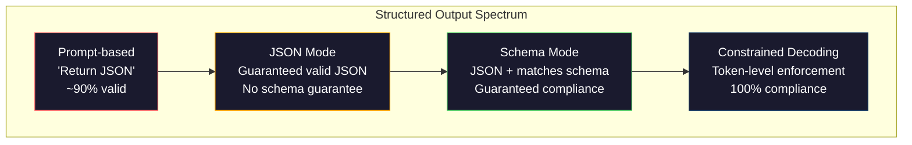
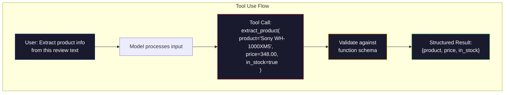

# Resultados estructurados: JSON, validación de esquema, decodificación restringida.

> Su LLM devuelve una cadena. Su aplicación necesita JSON. Esa brecha ha estrellado más sistemas de producción que cualquier alucinación de modelo. La salida estructurada es el puente entre el lenguaje natural y los datos tipados. Haga lo correcto y su LLM se convierte en una API confiable. Haga lo incorrecto y está analizando el texto libre con regex a las 3 am.

> **【中文解读】**LLM  retorna en la cadena, pero la aplicación requiere JSON. La producción estructurada es el puente entre el lenguaje natural y los datos de clasificación, es LLM desde el "Chatting Machine" evolucionó a la "API confiable" en la tecnología clave.

> **【拓展：结构化输出→AI应用开发】**结构化输出是函数调用、RAG管道、数据提取等 AI 应用的基础──OpenAI 的`response_format`、Uso de herramientas antropicas 、Instructor 库 son herramientas centrales de este campo ‖

> ¿ Qué es esto ?**【前置】**学本节前请先掌握:(1) Fase 10·01-05(LLM 基础)  comprensión de los tokens 生成;(2) JSON Schema 基础(`type`¿Qué es esto?`properties`¿Qué es esto?`required`);(3) Python `pydantic`¿ Qué es esto ?`dataclasses`本节使用Pydantic做验证──如果不懂JSON Schema,先看 jsonschema.org 的 5 分钟教程──

**Type:** Build | **类型:** 构建
**Languages:** Python | **语言:** Python
**Prerequisites:** Phase 10, Lessons 01-05 (LLMs from Scratch) | **前置知识:** Phase 10 · 01-05 (从零构建 LLM)
**Time:** ~90 minutes | **时间:** ~90 分钟
**Related:**La fase 5 · 20 (Outputs estructurados y decodificación restringida) abarca la teoría de nivel de decodificador (procesadores de logit FSM/CFG, esquemas, XGrammar).`response_format`, uso de herramientas antropológicas, Instructor)  leer la Fase 5 · 20 primero si quieres entender lo que está sucediendo debajo de la API. **相关:**Fase 5 · 20 (estructural de producción y restricción de la información) 讲解码器级理论(FSM/CFG logit 处理器、Outlines、XGrammar)`response_format`、Uso de herramientas antropicas 、Instructor) 想了解API 底下发生什么先读阶段 5 · 20。

## Objetivos de aprendizaje

- Implementar salidas con modo JSON y con restricciones de esquema utilizando los parámetros OpenAI y API Antropic
  Utiliza OpenAI y API Antropico 参数 para implementar JSON 模式 y Schema 约束输出
- Construir una capa de validación Pydantic que rechace las salidas de LLM malformadas y retempla con retroalimentación de errores
   Construir Pydantic 验证层, rechazar el formato erróneo de LLM 输出并通过错误反重试
- Explicar cómo la decodificación limitada obliga a validar JSON a nivel de token sin procesamiento posterior
  解释约束解码 cómo en token 级强制生成有效 JSON, no necesita procesamiento posterior
- Diseñar robustas instrucciones de extracción que conviertan de manera fiable el texto no estructurado en estructuras de datos tipografadas
  设计鲁棒的提取提示, fiable será el texto no estructurado convertido en una estructura de datos clasificada

> **【中文解读】**Este curso tiene como objetivo: hacer que el LLM 输出结构化数据(JSON、XML、表格)  Clásica técnica incluye la función de modificación  Modo JSON、约束解码── es el primer paso para elevar el LLM desde el chat tool a un componente de ingeniería.


## El problema es la introducción del problema

Le preguntas a un LLM: "Extrae el nombre del producto, el precio y la disponibilidad de este texto".

> Usted pregunta LLM:"De este párrafo del texto se extrae el nombre del producto, precio y estado de inventario.

Es una respuesta perfectamente correcta. También es completamente inútil para su aplicación.`{"product": "Sony WH-1000XM5", "price": 348.00, "in_stock": true}`Necesitas un objeto JSON con claves específicas, tipos específicos y restricciones de valor específicas. No necesitas una oración.

> Esta es una respuesta completamente correcta. Pero no es útil para tu aplicación.`{"product": "Sony WH-1000XM5", "price": 348.00, "in_stock": true}`◊ necesitas un objeto JSON con un tipo específico de clave, tipo específico y valor específico.

La solución ingenua: añadir "Responda en JSON" a su solicitud. Esto funciona el 90% del tiempo. El otro 10% del modelo envuelve el JSON en vallas de código de marca, o añade un preámbulo como "Aquí está el JSON:", o produce un JSON sintacticamente inválido porque cerró un bracket temprano. Su parser JSON se estrella. Su tubería se rompe. Añade el intento/excepto y un ciclo de retiro. El retraso a veces produce datos diferentes. Ahora tienes un problema de consistencia encima de un problema de análisis.

> Solución simple: añadir "con JSON 回复" en tu sugerencia. Esto es válido en el 90% de los casos. El resto del 10% del tiempo, el modelo pondrá el paquete JSON en un bloque de código de marcaje, o añadir "es JSON:" como un lenguaje de inicio, o porque el previo bloqueo genera un JSON ineficaz. Tu JSON 解析器 se ha desmoronado. Tu flujo de agua se ha roto.

Este no es un problema de ingeniería inmediata. Es un problema de decodificación. El modelo genera tokens de izquierda a derecha. En cada posición, elige el siguiente token más probable de un vocabulario de 100K + opciones. La mayoría de esas opciones producirían JSON inválido en cualquier posición dada. Si el modelo acaba de emitir `{"price":`, el siguiente símbolo debe ser un dígito, una cita (para la cadena), `null`¿ Qué ?`true`¿ Qué ?`false`Sin restricciones, el modelo podría elegir una palabra en inglés perfectamente razonable que sea catastróficamente incorrecta sintácticamente.

> Esto no es un problema de ingeniería de sugerencias. Este es un problema de código. El modelo genera un token de izquierda a derecha. En cada posición, se selecciona el siguiente token más probable de la lista de 100.000 opciones. La mayoría de las opciones en cualquier posición se generarán JSON sin efecto. Si el modelo acaba de emitir.`{"price":`, siguiente símbolo 必须是数字、引号(para usar en字符串) 、`null`¿Qué es esto?`true`¿Qué es esto?`false`O negativo número. Todo lo demás producirá inefficiencia JSON. Sin restricciones, el modelo puede elegir una palabra en inglés completamente razonable, pero en la gramática es un error catastrófico.

> ¿ Qué es esto ?**【类比】**No se puede hacer un seguimiento de la ley de lenguaje de los Estados Unidos. ¿No puede hacerse un seguimiento de la ley de lenguaje de los Estados Unidos? ¿No puede hacerse un seguimiento de la ley de lenguaje de los Estados Unidos? ¿No puede hacerse un seguimiento de la ley de lenguaje de los Estados Unidos?

> ️ **【易错点】**结构化输出 3 个坑: ) **Schema 字段过多** Más de 20 个字段模型记不住,会漏字段或填错;修复:拆成嵌套对象,每层不超过 5 个字段──(2) **要求 LLM 输出"创造性"字段但又强 Schema**por ejemplo, "Primir un título creativo"`title: str`, modelo fue diseñado 约束后变得保守;修复:用 `temperature=0.9`+ Esquema 中加 `min_length: 10`留余地──(3) **没用 Pydantic 验证** directamente `json.loads()`0001字符串里有数字("348") se transforma en str y no float; con Pydantic automático tipo de transformación forzada.

## El concepto central.

> **【中文解读】**结构化输出是让LLM 生成 JSON、XML等格式的可控输出──关键技术:函数调用(Función Llamando)让模型输出预定义的 JSON schema, JSON mode 强制模型生成合法 JSON,约束解码(constrin decoding) en token 级别保证输出格式──

> ¿ Qué es esto ?**【困惑】**P: OpenAI de`response_format={"type": "json_object"}`Y `response_format={"type": "json_schema", ...}`¿Qué diferencia? A: El primero es "modo JSON" Garantiza la salida legal de JSON, pero no garantiza el segmento.`json_schema`¿Cómo es?

> **【拓展：结构化输出的工程实践】**Las salidas estructuradas de OpenAI (OpenAI) (en 2024) garantizan que el modelo de salida sea ajustado a un esquema JSON, con una fiabilidad que se eleva del 90% al 100%.


### El espectro estructurado de producción

Hay cuatro niveles de control de salida estructurados, cada uno más fiable que el anterior.

>  Control estructurado de salida tiene cuatro grados, cada uno más fiable que el anterior.



**Prompt-based**("Responda en JSON válido"): no se ejecuta. El modelo generalmente cumple pero a veces no. Confiabilidad: ~90%. Modo de falla: vallas de marcado, texto de preámbulo, salida truncada, estructura incorrecta.

> **基于提示**("Utilando JSON válido"): no hay ejecución obligatoria. El modelo normalmente se cumple, pero a veces no.

**JSON mode**La API garantiza que la salida es válida JSON.`response_format: { type: "json_object" }`La salida analizará sin errores. Pero puede que no coincida con el esquema esperado - claves adicionales, tipos equivocados, campos faltantes.

> **JSON 模式**:API asegura que el resultado es válido JSON。OpenAI `response_format: { type: "json_object" }` Activar esta función―. . . . . . . . . . . . . .. .................................................................................................................................................................................................................................

**Schema mode**En 2026 todos los principales proveedores soportan esto nativamente: OpenAI's `response_format: { type: "json_schema", json_schema: {...} }`(también como `tool_choice="required"`), el uso de herramientas de Anthropic con `input_schema`, y de los Géminis.`response_schema`¿ Qué es eso ?`response_mime_type: "application/json"`La salida tiene las claves, tipos y restricciones exactas que especificaste.

> **Schema 模式**API  acepta JSON Schema 并保证输出匹配──2026年 每个主要供应商都原生支持:OpenAI 的 `response_format: { type: "json_schema" }`、Antropic 带 `input_schema`El uso de herramientas ≈ Gemini `response_schema`◊ ◊ ◊ ◊ ◊ ◊ ◊ ◊ ◊ ◊ ◊ ◊ ◊ ◊ ◊ ◊ ◊ ◊ ◊ ◊ ◊ ◊ ◊ ◊ ◊ ◊ ◊ ◊ ◊ ◊ ◊ ◊ ◊ ◊ ◊ ◊ ◊ ◊ ◊ ◊ ◊ ◊ ◊ ◊ ◊ ◊ ◊ ◊ ◊ ◊ ◊ ◊ ◊ ◊ ◊ ◊ ◊ ◊ ◊ ◊ ◊ ◊ ◊ ◊ ◊ ◊ ◊ ◊ ◊ ◊ ◊ ◊ ◊ ◊ ◊ ◊ ◊ ◊ ◊ ◊ ◊ ◊ ◊ ◊ ◊ ◊ ◊ ◊ ◊ ◊ ◊ ◊ ◊ ◊ ◊ ◊ ◊ ◊ ◊ ◊ ◊ ◊ ◊ ◊ ◊ ◊ ◊ ◊ ◊ ◊ ◊ ◊ ◊ ◊ ◊ ◊ ◊ ◊ ◊ ◊ ◊ ◊ ◊ ◊ ◊ ◊ ◊ ◊ ◊ ◊ ◊ ◊  ◊  ◊      ◊                                                                                                                                                                                                                                         

**Constrained decoding**En cada posición de token durante la generación, el decodificador enmascara todos los tokens que producirían una salida inválida. Si el esquema requiere un número y el modelo está a punto de emitir una letra, ese token se establece en probabilidad cero. El modelo solo puede producir tokens que conduzcan a una salida válida. Esto es lo que implementan el modo de salida estructurado de OpenAI y bibliotecas como Outlines y Guidance bajo el capó.

> **约束解码**: en cada token en el proceso de generación, el descifrador bloquea todos los tokens que producen una salida ineficaz. Si el esquema requiere números y el modelo está a punto de producir letras, la probabilidad de que el token se establezca como cero. El modelo sólo puede producir tokens que conduzcan a una salida efectiva.

### Esquema JSON: el lenguaje del contrato

JSON Schema es la forma en que se le dice al modelo (o capa de validación) qué forma debe tener la salida.

> JSON Schema es el modo en que el resultado debe tener una forma. Todos los sistemas de salida estructurados principales lo utilizan.

```json
{
  "type": "object",
  "properties": {
    "product": { "type": "string" },
    "price": { "type": "number", "minimum": 0 },
    "in_stock": { "type": "boolean" },
    "categories": {
      "type": "array",
      "items": { "type": "string" }
    }
  },
  "required": ["product", "price", "in_stock"]
}
```

Este esquema dice: la salida debe ser un objeto con una cadena `product`, un número no negativo `price`, un booleano `in_stock`, y una matriz opcional de cuerdas `categories`Cualquier salida que no coincida se rechaza.

> Este esquema explicando: la salida debe ser un objeto, contiene un símbolo`product`、 números no negativos `price`≈Bol valor `in_stock`和可选的字符串数组 `categories`Cualquier salida que no coincida será rechazada.

Los esquemas manejan los casos difíciles: objetos anidados, matrices con elementos tipados, enums (constrinir una cadena a valores específicos), coincidencia de patrones (regex en cadenas) y combinadores (oneOf, anyOf, allOf para salidas polimórficas).

> Esquema  tratamiento complejo:嵌套对象、带类型项的数组、枚举(将字符串约束为特定值) 模式匹配(字符串上的正则表达式) y组合器(oneOf、anyOf、allOf 用于多态输出) ⋅

### El patrón pidantico

En Python, no se escribe JSON Schema a mano. Se define un modelo Pydantic y se genera el esquema para usted.

> En Python, usted no necesita escribir JSON Schema. Usted define un modelo Pydantic, que le generará esquema.

```python
from pydantic import BaseModel

class Product(BaseModel):
    product: str
    price: float
    in_stock: bool
    categories: list[str] = []
```

Esto produce el mismo esquema JSON que anteriormente. La biblioteca Instructor (y el SDK de OpenAI) acepta los modelos Pydantic directamente: aprueba la clase de modelo, recupera una instancia validada. Si la salida del LLM no coincide, Instructor vuelve a intentar automáticamente.

> Esto generará el mismo esquema JSON que arriba. Instructor 库(和 OpenAI SDK) aceptará directamente Pydantic 模型:传入模型类,返回验证过的实例.

### Llamadas de funciones / uso de herramientas

Una interfaz alternativa para el mismo problema. En lugar de pedir al modelo que produzca JSON directamente, se definen "herramientas" (funciones) con parámetros mecanografiados. El modelo emite una llamada de función con argumentos estructurados. OpenAI llama a esto "llamada de función".

>  resolver el mismo problema ∞ no requiere que el modelo produzca directamente JSON, sino que define con el tipo de parámetros de "herramienta" (función) ∞.



El uso de herramientas es preferido cuando el modelo necesita elegir qué función llamar, no sólo rellenar parámetros. Si usted tiene 10 esquemas de extracción diferentes y el modelo debe elegir el correcto basado en la entrada, el uso de herramientas le da tanto la selección de esquema como la salida estructurada.

> Cuando el modelo necesita elegir cuál función debe utilizar y no sólo llenar los parámetros, la primera herramienta de selección debe ser utilizada. Si tienes 10 esquemas diferentes de extracción y el modelo debe basarse en la entrada y la elección correcta, la herramienta debe ser utilizada y también se puede proporcionar un esquema de selección y una salida estructurada.

### Los modos comunes de fracaso

Incluso con la aplicación de esquemas, las salidas estructuradas pueden fallar de maneras sutiles.

> Incluso si hay un esquema  obligatoriamente ejecutado, la salida estructurada también puede fracasar de manera delicada.

**Hallucinated values**El modelo produce un modelo de datos de datos inventados.`{"price": 299.99}`Cuando el texto dice $348. la validación del esquema no puede captar esto -- el tipo es correcto, el valor es incorrecto.

> **幻觉值**Por ejemplo, el modelo de producción de un modelo de producción de un modelo de producción de un modelo de producción de un modelo de producción de un modelo de producción de un modelo de producción de un modelo de producción de un modelo de producción de un modelo de producción de un modelo de producción de un modelo de producción de un modelo de producción de un modelo de producción de un modelo de producción de un modelo de producción de un modelo de producción de un modelo de producción de un modelo de producción de un modelo de producción de un modelo de producción de un modelo de producción de un modelo de producción de un modelo de producción de un modelo de producción de producción de un modelo de producción de un modelo de producción de producción de un modelo de producción de un modelo de producción de producción de un modelo de producción de producción de un modelo de producción de producción de un modelo de producción de producción de un modelo de producción de producción de un modelo de producción de producción de un modelo de producción de producción de un modelo de producción de producción de un modelo de producción de producción de un modelo de producción de producción de un modelo de producción de producción de un modelo de producción de producción de un modelo de producción de producción de producción de un modelo de producción de producción de producción de un modelo de producción de producción de producción de producción de un modelo de producción de producción de producción de producción de producción de un modelo de producción de producción de producción de producción de producción de un modelo de producción de producción de producción de producción de producción de producción de un modelo de producción de producción de producción de producción de producción de producción de producción de un modelo de producción de producción de producción de producción de producción de un modelo de producción de producción de producción de producción de producción de producción de producción de producción de un modelo de producción de producción de producción de producción de producción de producción de producción de producción de producción de producción de producción de producción de producción de producción de producción de un modelo de producción de producción de producción de producción de producción de producción de producción de producción de producción de producción de producción de producción de producción de producción de producción de producción de producción de producción de un de producción de producción de producción de producción de producción de producción de producción de producción de producción de producción de producción de producción de producción de producción de un de un de un de un de un de de de un de un de de de de porción de un de de un de porción de un de porción de porción de porción de porción de porción de porción de porción de porción de porción`{"price": 299.99}` Esquema 验证 no puede captar este problema  tipo correcto, valor erróneo 

**Enum confusion**: se limita un campo a `["in_stock", "out_of_stock", "preorder"]`. Las salidas del modelo `"available"`- semánticamente correcto, pero no en el conjunto permitido.

> **枚举混淆**¿Cómo es que lo haces ?`["in_stock", "out_of_stock", "preorder"]` Modelo de exportación`"available"`语义上正确, pero no permitido en el conjunto. Good约束解码可以防止这种情况.

**Nested object depth**En el caso de los sistemas de anidación, el modelo puede perder la pista de su estructura en cada nivel.

> **嵌套对象深度**Es un esquema de configuración de capa profunda que puede causar más errores.

**Array length**El modelo puede producir demasiados o muy pocos elementos en una matriz.`minItems`y `maxItems`pero no todos los proveedores los aplican a nivel de decodificación.

> **数组长度**Modelo puede producir demasiados o demasiados pocos elementos en el grupo.`minItems`Y `maxItems`, pero no todos los proveedores están en la categoría de decodificación obligatorios.

**Optional field omission**El modelo omite campos que son técnicamente opcionales pero semánticamente importantes para su caso de uso.`null`- Es decir, explícitamente.

> **可选字段遗漏**El modelo omite técnicas opcionales pero en sentido lingüístico es un importante segmento para su caso de uso. Incluso si los datos están faltando, también en el esquema se los establecerá para que se produzcan claramente los modelos obligatorios necesarios.`null`¿Qué es eso?

## Construye y realiza.
```figure
mx-schema-funnel
```

## Construye el mismo

### Paso 1: Validador de esquema JSON

Construir un validador desde cero que compruebe si un objeto de Python coincide con un esquema JSON. Esto es lo que se ejecuta en el lado de salida para verificar el cumplimiento.

> Desde el testador de construcción, comprobar si Python se ajusta al esquema JSON.

```python
import json

def validate_schema(data, schema):
    errors = []
    _validate(data, schema, "", errors)
    return errors

def _validate(data, schema, path, errors):
    schema_type = schema.get("type")

    if schema_type == "object":
        if not isinstance(data, dict):
            errors.append(f"{path}: expected object, got {type(data).__name__}")
            return
        for key in schema.get("required", []):
            if key not in data:
                errors.append(f"{path}.{key}: required field missing")
        properties = schema.get("properties", {})
        for key, value in data.items():
            if key in properties:
                _validate(value, properties[key], f"{path}.{key}", errors)

    elif schema_type == "array":
        if not isinstance(data, list):
            errors.append(f"{path}: expected array, got {type(data).__name__}")
            return
        min_items = schema.get("minItems", 0)
        max_items = schema.get("maxItems", float("inf"))
        if len(data) < min_items:
            errors.append(f"{path}: array has {len(data)} items, minimum is {min_items}")
        if len(data) > max_items:
            errors.append(f"{path}: array has {len(data)} items, maximum is {max_items}")
        items_schema = schema.get("items", {})
        for i, item in enumerate(data):
            _validate(item, items_schema, f"{path}[{i}]", errors)

    elif schema_type == "string":
        if not isinstance(data, str):
            errors.append(f"{path}: expected string, got {type(data).__name__}")
            return
        enum_values = schema.get("enum")
        if enum_values and data not in enum_values:
            errors.append(f"{path}: '{data}' not in allowed values {enum_values}")

    elif schema_type == "number":
        if not isinstance(data, (int, float)):
            errors.append(f"{path}: expected number, got {type(data).__name__}")
            return
        minimum = schema.get("minimum")
        maximum = schema.get("maximum")
        if minimum is not None and data < minimum:
            errors.append(f"{path}: {data} is less than minimum {minimum}")
        if maximum is not None and data > maximum:
            errors.append(f"{path}: {data} is greater than maximum {maximum}")

    elif schema_type == "boolean":
        if not isinstance(data, bool):
            errors.append(f"{path}: expected boolean, got {type(data).__name__}")

    elif schema_type == "integer":
        if not isinstance(data, int) or isinstance(data, bool):
            errors.append(f"{path}: expected integer, got {type(data).__name__}")
```

### Paso 2: Modelo de estilo pedántico a esquema

Construye un convertidor de clase a esquema mínimo. Define una clase Python y genere su esquema JSON automáticamente.

> 构建最小类到方案 转换器──定义Python 类,自动生成其JSON Schema──

```python
class SchemaField:
    def __init__(self, field_type, required=True, default=None, enum=None, minimum=None, maximum=None):
        self.field_type = field_type
        self.required = required
        self.default = default
        self.enum = enum
        self.minimum = minimum
        self.maximum = maximum

def python_type_to_schema(field):
    type_map = {
        str: "string",
        int: "integer",
        float: "number",
        bool: "boolean",
    }

    schema = {}

    if field.field_type in type_map:
        schema["type"] = type_map[field.field_type]
    elif field.field_type == list:
        schema["type"] = "array"
        schema["items"] = {"type": "string"}
    elif isinstance(field.field_type, dict):
        schema = field.field_type

    if field.enum:
        schema["enum"] = field.enum
    if field.minimum is not None:
        schema["minimum"] = field.minimum
    if field.maximum is not None:
        schema["maximum"] = field.maximum

    return schema

def model_to_schema(name, fields):
    properties = {}
    required = []

    for field_name, field in fields.items():
        properties[field_name] = python_type_to_schema(field)
        if field.required:
            required.append(field_name)

    return {
        "type": "object",
        "properties": properties,
        "required": required,
    }
```

### Paso 3: Filtro de tokens restringido

Simula la decodificación restringida. Dado una cadena JSON parcial y un esquema, determine qué categorías de tokens son válidas en la posición actual.

> 模拟约束解码──给定部分 JSON 字符串和方案, determinar qué tokens están en su posición actual 类别有效──

```python
def next_valid_tokens(partial_json, schema):
    stripped = partial_json.strip()

    if not stripped:
        return ["{"]

    try:
        json.loads(stripped)
        return ["<EOS>"]
    except json.JSONDecodeError:
        pass

    last_char = stripped[-1] if stripped else ""

    if last_char == "{":
        return ['"', "}"]
    elif last_char == '"':
        if stripped.endswith('":'):
            return ['"', "0-9", "true", "false", "null", "[", "{"]
        return ["a-z", '"']
    elif last_char == ":":
        return [" ", '"', "0-9", "true", "false", "null", "[", "{"]
    elif last_char == ",":
        return [" ", '"', "{", "["]
    elif last_char in "0123456789":
        return ["0-9", ".", ",", "}", "]"]
    elif last_char == "}":
        return [",", "}", "]", "<EOS>"]
    elif last_char == "]":
        return [",", "}", "<EOS>"]
    elif last_char == "[":
        return ['"', "0-9", "true", "false", "null", "{", "[", "]"]
    else:
        return ["any"]

def demonstrate_constrained_decoding():
    partial_states = [
        '',
        '{',
        '{"product"',
        '{"product":',
        '{"product": "Sony"',
        '{"product": "Sony",',
        '{"product": "Sony", "price":',
        '{"product": "Sony", "price": 348',
        '{"product": "Sony", "price": 348}',
    ]

    print(f"{'Partial JSON':<45} {'Valid Next Tokens'}")
    print("-" * 80)
    for state in partial_states:
        valid = next_valid_tokens(state, {})
        display = state if state else "(empty)"
        print(f"{display:<45} {valid}")
```

### Paso 4: oleoducto de extracción

Combine todo en una línea de extracción: defina un esquema, simula un LLM produciendo una salida estructurada, valida la salida y maneja los retemplajes.

> Para que el proceso de desarrollo de la tecnología sea un proceso de desarrollo de la tecnología, el proceso de desarrollo de la tecnología debe ser un proceso de desarrollo de la tecnología.

```python
def simulate_llm_extraction(text, schema, attempt=0):
    if "headphones" in text.lower() or "sony" in text.lower():
        if attempt == 0:
            return '{"product": "Sony WH-1000XM5", "price": 348.00, "in_stock": true, "categories": ["audio", "headphones"]}'
        return '{"product": "Sony WH-1000XM5", "price": 348.00, "in_stock": true}'

    if "laptop" in text.lower():
        return '{"product": "MacBook Pro 16", "price": 2499.00, "in_stock": false, "categories": ["computers"]}'

    return '{"product": "Unknown", "price": 0, "in_stock": false}'

def extract_with_retry(text, schema, max_retries=3):
    for attempt in range(max_retries):
        raw = simulate_llm_extraction(text, schema, attempt)

        try:
            data = json.loads(raw)
        except json.JSONDecodeError as e:
            print(f"  Attempt {attempt + 1}: JSON parse error -- {e}")
            continue

        errors = validate_schema(data, schema)
        if not errors:
            return data

        print(f"  Attempt {attempt + 1}: Schema validation errors -- {errors}")

    return None

product_schema = {
    "type": "object",
    "properties": {
        "product": {"type": "string"},
        "price": {"type": "number", "minimum": 0},
        "in_stock": {"type": "boolean"},
        "categories": {"type": "array", "items": {"type": "string"}},
    },
    "required": ["product", "price", "in_stock"],
}
```

### Paso 5: Cumple el oleoducto completo

> Paso 5: Operar en el flujo completo de agua.

```python
def run_demo():
    print("=" * 60)
    print("  Structured Output Pipeline Demo")
    print("=" * 60)

    print("\n--- Schema Definition ---")
    product_fields = {
        "product": SchemaField(str),
        "price": SchemaField(float, minimum=0),
        "in_stock": SchemaField(bool),
        "categories": SchemaField(list, required=False),
    }
    generated_schema = model_to_schema("Product", product_fields)
    print(json.dumps(generated_schema, indent=2))

    print("\n--- Schema Validation ---")
    test_cases = [
        ({"product": "Test", "price": 10.0, "in_stock": True}, "Valid object"),
        ({"product": "Test", "price": -5.0, "in_stock": True}, "Negative price"),
        ({"product": "Test", "in_stock": True}, "Missing price"),
        ({"product": "Test", "price": "ten", "in_stock": True}, "String as price"),
        ("not an object", "String instead of object"),
    ]

    for data, label in test_cases:
        errors = validate_schema(data, product_schema)
        status = "PASS" if not errors else f"FAIL: {errors}"
        print(f"  {label}: {status}")

    print("\n--- Constrained Decoding Simulation ---")
    demonstrate_constrained_decoding()

    print("\n--- Extraction Pipeline ---")
    texts = [
        "The Sony WH-1000XM5 headphones are priced at $348 and currently available.",
        "The new MacBook Pro 16-inch laptop costs $2499 but is sold out.",
        "This is a random sentence with no product info.",
    ]

    for text in texts:
        print(f"\n  Input: {text[:60]}...")
        result = extract_with_retry(text, product_schema)
        if result:
            print(f"  Output: {json.dumps(result)}")
        else:
            print(f"  Output: FAILED after retries")
```

## Usalo con el marco de ejecución

### Resultados estructurados de OpenAI

> OpenAI  estructurado y de salida

```python
# from openai import OpenAI
# from pydantic import BaseModel
#
# client = OpenAI()
#
# class Product(BaseModel):
#     product: str
#     price: float
#     in_stock: bool
#
# response = client.beta.chat.completions.parse(
#     model="gpt-5-mini",
#     messages=[
#         {"role": "system", "content": "Extract product information."},
#         {"role": "user", "content": "Sony WH-1000XM5, $348, in stock"},
#     ],
#     response_format=Product,
# )
#
# product = response.choices[0].message.parsed
# print(product.product, product.price, product.in_stock)
```

El modo de salida estructurado de OpenAI utiliza decodificación limitada internamente. Cada token generado por el modelo está garantizado para producir una salida que coincida con el esquema Pydantic. No se necesitan retrasos. No se necesita validación. La restricción se introduce en el proceso de decodificación.

> El modelo de salida estructurado de OpenAI está en el interior de la aplicación de un código de seguridad. Cada token generado por el modelo garantiza la producción de un código de seguridad de un esquema Pydantic.

### El uso de herramientas antropológicas

> Antropic 工具使用──

```python
# import anthropic
#
# client = anthropic.Anthropic()
#
# response = client.messages.create(
#     model="claude-opus-4-7",
#     max_tokens=1024,
#     tools=[{
#         "name": "extract_product",
#         "description": "Extract product information from text",
#         "input_schema": {
#             "type": "object",
#             "properties": {
#                 "product": {"type": "string"},
#                 "price": {"type": "number"},
#                 "in_stock": {"type": "boolean"},
#             },
#             "required": ["product", "price", "in_stock"],
#         },
#     }],
#     messages=[{"role": "user", "content": "Extract: Sony WH-1000XM5, $348, in stock"}],
# )
```

Anthropic logra una salida estructurada a través del uso de herramientas. El modelo emite una llamada de herramienta con argumentos estructurados que coinciden con el input_schema.

> Antropic                                                                                                                                                                                                                                                                                                                                                                                                                                                                                                                           

### Biblioteca de instructores

> Instructor 库──

```python
# pip install instructor
# import instructor
# from openai import OpenAI
# from pydantic import BaseModel
#
# client = instructor.from_openai(OpenAI())
#
# class Product(BaseModel):
#     product: str
#     price: float
#     in_stock: bool
#
# product = client.chat.completions.create(
#     model="gpt-5-mini",
#     response_model=Product,
#     messages=[{"role": "user", "content": "Sony WH-1000XM5, $348, in stock"}],
# )
```

El instructor envuelve cualquier cliente de LLM y agrega retries automáticas con validación. Si el primer intento falla en la validación, envía los errores de nuevo al modelo como contexto y le pide que arregle la salida. Esto funciona con cualquier proveedor, no solo OpenAI.

> Instructor  empaquetado cualquier LLM  cliente 并添加带验证的自动重试―― si el primer intento de prueba falla, se error como modelo de envío y requiere la reparación de la salida―― esto se aplica a cualquier proveedor, no sólo es OpenAI――

## Envíe el producto .

Esta lección produce`outputs/prompt-structured-extractor.md`-- una plantilla de solicitud reutilizable que extrae datos estructurados de cualquier texto dado una definición de esquema.

> 本课产生 `outputs/prompt-structured-extractor.md` Un modelo de sugerencias de uso nuevo, dado schema  definición, extraer datos estructurados de cualquier texto.  Enviar JSON Schema y texto no estructurado, que devuelve JSON verificado.

También produce `outputs/skill-structured-outputs.md`-- un marco de decisión para elegir la estrategia de salida estructurada correcta basada en su proveedor, requisitos de fiabilidad y complejidad del esquema.

> También se produce.`outputs/skill-structured-outputs.md` Un marco de decisión, según las necesidades y esquemas de su proveedor  Conplecidad para elegir la estrategia de salida estructurada correcta 

## Los ejercicios.

1. Extensión del validador de esquema para soportar `oneOf`Esto maneja las salidas polimórficas, por ejemplo, un campo que puede ser o un`Product`o una `Service`objetos de diferentes formas.
    expansión de esquemas  verificador `oneOf`(datos deben coincidir con uno de varios esquemas) `Product`O `Service`Objeto:

2. Construir una herramienta de "discriminación de esquemas" que comparar dos esquemas e identifique los cambios de ruptura (retirados campos requeridos, tipos cambiados) frente a los cambios no de ruptura (campiones opcionales añadidos, restricciones relajadas).
   Construir un "esquema diferente" herramienta, comparar dos esquemas y identificar cambios destructivos (incluyendo los cambios necesarios de los tipos de cambios) y los cambios no destructivos (incluyendo los cambios selectivos de los tipos de cambios) 

3. Implemente un simulador de decodificación limitada más realista. Dado un esquema JSON y un vocabulario de 100 tokens (letras, dígitos, puntuación, palabras clave), pase por la generación paso a paso, enmascarando tokens inválidos en cada posición. Mide qué porcentaje del vocabulario es válido en cada paso.
   实现 un más real en el ejemplar de código.  Dado un esquema JSON y 100 tokens de la palabra, generado paso a paso, en cada posición de la pantalla de los tokens ineficaces.  Medir el porcentaje válido de cada paso de la palabra.

4. Construye una suite de evaluaciones de extracción. Crea 50 descripciones de productos con salidas JSON etiquetadas a mano. ejecuta tu tubería de extracción en todas las 50 y mide la coincidencia exacta, la precisión a nivel de campo y el cumplimiento del tipo. Identifique qué campos son más difíciles de extraer correctamente.
   Construir un conjunto de evaluación de la extracción.  Crear 50 productos descripción y etiqueta JSON 输出.  En todos los 50 de las líneas de extracción de agua que se ejecutan, medir la exactitud de la correspondencia.  Clasificación de precisión y tipo de conformidad.

5. Añadir "puntuaciones de confianza" a su pipeline de extracción. Para cada campo extraído, estimar cuán seguro es el modelo (basado en probabilidades de token, o ejecutando la extracción 3 veces y midiendo la consistencia).
   Para la evaluación de la probabilidad de la probabilidad de la probabilidad de la probabilidad de la probabilidad de la probabilidad de la probabilidad de la probabilidad de la probabilidad de la probabilidad de la probabilidad de la probabilidad de la probabilidad de la probabilidad de la probabilidad de la probabilidad de la probabilidad de la probabilidad de la probabilidad de la probabilidad de la probabilidad de la probabilidad de la probabilidad de la probabilidad de la probabilidad de la probabilidad de la probabilidad de la probabilidad de la probabilidad de la probabilidad de la probabilidad de la probabilidad de la probabilidad de la probabilidad de la probabilidad de la probabilidad de la probabilidad de la probabilidad de la probabilidad de la probabilidad de la probabilidad de la probabilidad de la probabilidad de la probabilidad de la probabilidad de la probabilidad de la probabilidad de la probabilidad de la probabilidad de la probabilidad de la probabilidad de la probabilidad de la probabilidad de la probabilidad de la probabilidad de la probabilidad de la probabilidad de la probabilidad de la probabilidad de la probabilidad de la probabilidad de la probabilidad de la probabilidad de la probabilidad de la probabilidad de la probabilidad de la probabilidad de la probabilidad de la probabilidad de la probabilidad de la probabilidad de la probabilidad de la probabilidad de la probabilidad de la probabilidad de la probabilidad de la probabilidad de la probabilidad de la probabilidad de la probabilidad de la probabilidad de la probabilidad de la probabilidad de la probabilidad de la probabilidad de la probabilidad de la probabilidad de la probabilidad de la probabilidad de la probabilidad de la probabilidad de la probabilidad de la probabilidad de la probabilidad de la probabilidad de la probabilidad de la probabilidad de la probabilidad de la probabilidad de la probabilidad de la probabilidad de la probabilidad de la probabilidad de la probabilidad de la probabilidad de la probabilidad de la probabilidad de la probabilidad de la probabilidad de la probabilidad de la probabilidad de la probabilidad de la probabilidad de la probabilidad de la probabilidad de la probabilidad de la probabilidad de la probabilidad de la probabilidad de la probabilidad de la probabilidad de la probabilidad de la probabilidad de la probabilidad de la probabilidad de la probabilidad de la proba

## Términos clave .

| Term | What people say | What it actually means | 中文释义 |
|------|----------------|----------------------|---------|
| JSON mode | "Returns JSON" / "返回 JSON" | API flag that guarantees syntactically valid JSON output, but does not enforce any particular schema | JSON 模式：API 标志，保证语法有效的 JSON 输出，但不强制执行特定 schema |
| Structured output | "Typed JSON" / "类型化 JSON" | Output that matches a specific JSON Schema with correct keys, types, and constraints | 结构化输出：匹配特定 JSON Schema 的输出，具有正确的键、类型和约束 |
| Constrained decoding | "Guided generation" / "引导生成" | At each token position, mask out tokens that would produce invalid output -- guarantees 100% schema compliance | 约束解码：在每个 token 位置屏蔽会产生无效输出的 token，保证 100% schema 合规 |
| JSON Schema | "A JSON template" / "JSON 模板" | A declarative language for describing the structure, types, and constraints of JSON data (used by OpenAPI, JSON Forms, etc.) | JSON Schema：描述 JSON 数据结构、类型和约束的声明式语言 |
| Pydantic | "Python dataclasses+" / "Python 数据类+" | Python library that defines data models with type validation, used by FastAPI and Instructor to generate JSON Schemas | Pydantic：定义带类型验证数据模型的 Python 库，用于生成 JSON Schema |
| Function calling | "Tool use" / "工具使用" | LLM outputs a structured function invocation (name + typed arguments) instead of free text -- OpenAI and Anthropic both support this | 函数调用：LLM 输出结构化的函数调用（名称+类型化参数），而非自由文本 |
| Instructor | "Pydantic for LLMs" / "LLM 的 Pydantic" | Python library that wraps LLM clients to return validated Pydantic instances, with automatic retry on validation failure | Instructor：包装 LLM 客户端返回验证过的 Pydantic 实例的 Python 库 |
| Token masking | "Filtering the vocabulary" / "过滤词表" | Setting specific token probabilities to zero during generation so the model cannot produce them | Token 屏蔽：在生成过程中将特定 token 概率设为零 |
| Schema compliance | "Matches the shape" / "匹配形状" | The output has every required field, correct types, values within constraints, and no extra disallowed fields | Schema 合规：输出具有每个必需字段、正确类型、约束内的值 |
| Retry loop | "Try again until it works" / "重试直到成功" | Send validation errors back to the model and ask it to fix the output -- Instructor does this automatically, up to a configurable max | 重试循环：将验证错误发回模型并要求修复输出 |

## Más Leer más Leer más

- [OpenAI Structured Outputs Guide](https://platform.openai.com/docs/guides/structured-outputs)-- documentación oficial para la decodificación limitada basada en esquema JSON en la API OpenAI
  OpenAI API en el archivo oficial de JSON Schema
- [Willard & Louf, 2023 -- "Efficient Guided Generation for Large Language Models"](https://arxiv.org/abs/2307.09702)-- el documento Outlines, que describe cómo compilar esquemas JSON en máquinas de estado finito para restricciones a nivel de tokens
  Describa el documento, describe cómo se puede ejecutar el esquema JSON 编译为有限状态机以实现代币 级约束
- [Instructor documentation](https://python.useinstructor.com/)-- la biblioteca estándar para obtener resultados estructurados de cualquier LLM con validación y retemplazos Pydantic
  de cualquier LLM  obtener con Pydantic 验证和重试的结构化输出标准库
- [Anthropic Tool Use Guide](https://docs.anthropic.com/en/docs/tool-use)-- cómo Claude implementa la salida estructurada a través del uso de herramientas con JSON Schema input_schema
  Claude  cómo usar la herramienta                                                                                                                                                                                                                                                                                                                                                                                                                                                                                                                      
- [JSON Schema specification](https://json-schema.org/)-- la especificación completa para el lenguaje de esquema utilizado por cada sistema de salida estructurado principal
  Reglamentación completa de cada esquema de uso de un sistema estructurado de salida
- [Outlines library](https://github.com/outlines-dev/outlines)-- generación limitada de código abierto utilizando regex y JSON Schema compilado a máquinas de estado finito
  Utiliza los reglas y JSON Schema 编译为有限状态机的开源约束生成库
- [Dong et al., "XGrammar: Flexible and Efficient Structured Generation Engine for Large Language Models" (MLSys 2025)](https://arxiv.org/abs/2411.15100)-- el motor de gramática de última generación actual; compilación automática de empuje hacia abajo que enmascara los tokens a ~ 100 ns / token.
  El primer motor de lenguaje de vanguardia; abajo se lanza automáticamente, a una velocidad de aproximadamente 100 ns/token para bloquear el token
- [Beurer-Kellner et al., "Prompting Is Programming: A Query Language for Large Language Models" (LMQL)](https://arxiv.org/abs/2212.06094)-- el marco de papel LMQL decodificó restringido como un lenguaje de consulta con restricciones de tipo y valor.
  La definición de un código de código de código de código de código de código de código de código de código de código de código de código de código de código de código de código de código de código de código de código de código de código de código de código de código de código de código de código de código de código de código de código de código de código de código de código de código de código de código de código de código de código de código de código de código de código de código de código de código de código de código de código de código de código de código de código de código de código de código de código de código de código de código de código de código de código de código de código de código de código de código de código de código de código de código de código de código de código de código de código de código de código de código de código de código de código de código de código de código de código de código de código de código de código de código de código de código de código de código de código de código de código de código de código de código de código de código de código de código de código de código de código de código de código de código de código de código de código de código de código de código de código de código de código de código de código de código de código de código de código de código de código de código de código de código de código de código de código de código de código de código de código de código de código de código de código de código de código de código de código de código de código de código de código de código de código de código de código de código de código de código de código de código de código de código de código de código de código de código de código de código de código de código de código de código de código de código de código de código de código de código de código de código de código de código de código de código de código de código de código de código de código de código de código de código de código de código de código de código de código de código de código de código de código de código de código de código de código de código de código de código de código de código de código de código de código de código de código de código de código de código de código de código de código de código de código de código de código de código de código de código de código de código de código de código de código de código de código de código de código de código de código de código de código de código de código de código de código de código de código de código de código de código de
- [Microsoft Guidance (framework docs)](https://github.com/guidance-ai/guidance)-- generación limitada basada en plantillas; complemento agnóstico del proveedor a Outlines y XGrammar.
  模板驱动的约束生成;Outlines 和 XGrammar de proveedores no tiene que complementarse
