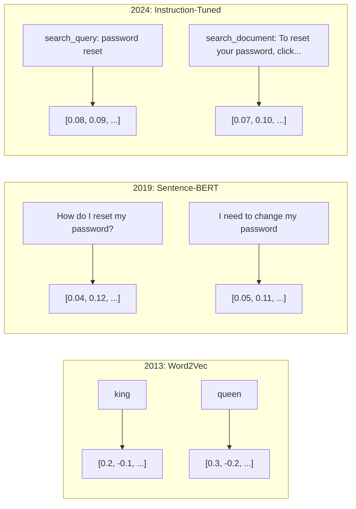
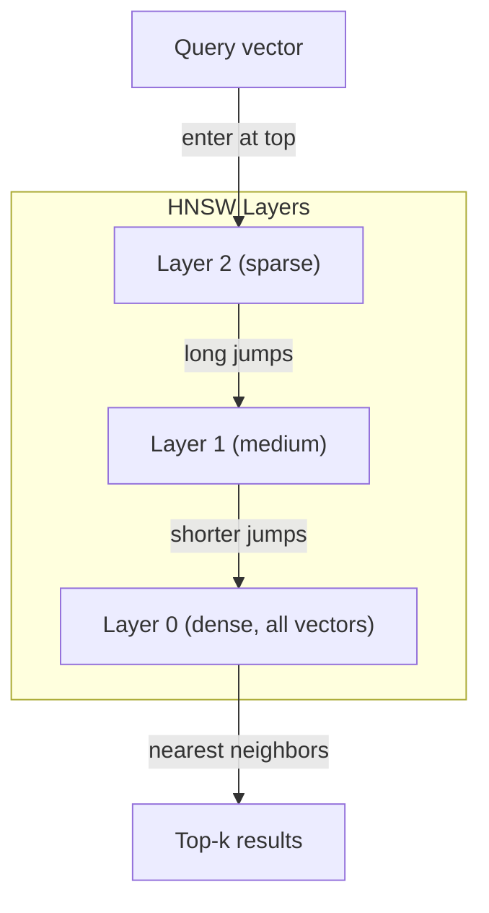

# Embedings & Vector Representations  Embedings y muestra de tamaño

> El texto es discreto. Las matemáticas son continuas. Cada vez que pides a un LLM que encuentre documentos "similares", comparen significados o busquen más allá de palabras clave, estás confiando en un puente entre estos dos mundos. Ese puente es una incorporación. Si no entiendes las incorporaciones, no entiendes la IA moderna. Solo la usas.

> **【中文解读】**El texto es dispersado, la matemática es continuada. Enmembramiento es el puente que conecta estos dos mundos.

> **【拓展：嵌入→RAG与搜索】**嵌入是RAG (R) 检索增强生成) infraestructura central del sistema. 文本转向量后存入向量数据库, a través de la similitud de los yústros, se realiza la búsqueda de significado, es la tecnología de base de todos los sistemas modernos de búsqueda y recomendación de IA.

> ¿ Qué es esto ?**【前置】**学本节前请先掌握:(1) Python 基础(numpy 向量运算、字典、列表推导);(2) 高中向量数学点积、角、模长(不知道这些先看 阶段 01·02 Vektor Matrices);(3) 阶段 05·03(Word Embeddings Word2Vec) 会讲词嵌入基础,本节是其延伸到句子/文档级──本节会用到`numpy`¿Qué es esto?`scikit-learn`、可选 `chromadb`O `qdrant`¿Qué es eso?

**Type:** Build | **类型:** 构建
**Languages:** Python | **语言:** Python
**Prerequisites:** Phase 11, Lesson 01 (Prompt Engineering) | **前置知识:** Phase 11 · 01 (提示工程)
**Time:** ~75 minutes | **时间:** ~75 分钟
**Related:**La fase 5 · 22 (Inmersión profunda de modelos de incorporación) cubre denso vs. escaso vs. multi-vector, truncamiento de Matryoshka y selección de modelos por eje. Esta lección se centra en la línea de producción (vector DBs, HNSW, matemáticas de similitud). Lea la fase 5 · 22 antes de elegir un modelo.**相关:**Fase 5 · 22 (嵌入模型深度解析) comprende密/稀疏/多向量、Matryoshka 截断和分轴模型选择。本课聚焦生产管线(向量库、HNSW、相似度数学)。选模型前先读

## Objetivos de aprendizaje

- Generar embebedidos de texto utilizando proveedores de API y modelos de código abierto, y calcular la similitud cosina entre ellos
  Utiliza API  proveedor y modelo de código abierto para generar texto emplazado, y calcular la similitud de los otros cuerpos entre ellos
- Explica por qué las incorporaciones resuelven el problema de discrepancia de vocabulario que la búsqueda de palabras clave no puede manejar
   Explicar por qué los términos de los términos no coinciden
- Construir un índice de búsqueda semántica que recupere documentos por significado en lugar de coincidencia exacta de palabras clave
  Construir un índice de búsqueda de palabras, en su sentido y no en su significado 
- Evaluar la calidad de la incorporación utilizando los puntos de referencia de recuperación (precision@k, recall) y elegir el modelo de incorporación adecuado para su tarea
  Utilización de la información de la base de datos y de la información de la base de datos.

> **【中文解读】**Este curso tiene como objetivo: comprender los principios y aplicaciones de la inserción de texto. La inserción de texto se transformará en un vector, haciendo que el texto similar al lenguaje se acerque más a un texto en el espacio vectorial.


## El problema es la introducción del problema

Tienes 10.000 boletos de soporte. Un cliente escribe "mi pago no pasó". Necesitas encontrar boletos similares en el pasado. La búsqueda de palabras clave encuentra boletos que contienen "pagamiento" y "no pasó". Se pierde "transacción fallida", "carga fue rechazada", y "error de facturación". Estos boletos describen exactamente el mismo problema con palabras completamente diferentes.

> Usted tiene 10.000 张工单――客户写道"我的付款没有成功"―― necesitas encontrar similares过往工单――关键词搜索找到了包含"pagamiento"和"no pasó" de los trabajos单, pero se perdió"transacción fracasada"、"cargo fue rechazado"和"bible error"―― estos trabajos单 describen el mismo problema, simplemente usando palabras completamente diferentes――

El lenguaje humano tiene docenas de formas de decir lo mismo. La búsqueda de palabras clave trata cada palabra como un símbolo independiente sin significado. No puede saber que "rechazado" y "no pasó" se refieren al mismo concepto.

> Éste es el problema de la falta de correspondencia de los términos. En la lengua humana hay varias formas de expresar lo mismo.

> ¿ Qué es esto ?**【类比】**关键词搜索像用"按拼音查字典""水果"和"果"是两条目,彼此找不到. 嵌入像"按含义分类""水果""果实""果"都被放进"可食用植物产品"这个语义盒里,能跨语言、跨表达方式匹配──这就是为什么ChatGPT 能理解你的提议即使你打错字或使用罕见说法──

Necesitas una representación de texto donde el significado, no la ortografía, determina la similitud. Necesitas una manera de colocar "mi pago no pasó" y "la transacción se negó" cerca de uno en algún espacio matemático, mientras empujas "mi pago llegó a tiempo" lejos a pesar de compartir la palabra "pagamiento".

> Necesitas un método de expresión de texto, en el que el significado y no la escritura decidan la similitud. Necesitas un método, que ponga "mi pago no tiene éxito" y "transacción es rechazada" en un espacio matemático cercano.

Esa representación es una incrustación.

> Esta forma de expresar es la inserción.

## El concepto central.

> **【中文解读】**嵌入(Embeddings) convertirá el texto en alta dimensión, haciendo que el texto similar al lenguaje esté más cerca en el espacio de dimensiones.

> **【拓展：嵌入模型的演进】**嵌入模型 de Word2Vec/GloVe(静态词嵌入) a BERT(上下文嵌入) a modelos de嵌入专用 (como BGE、E5、GTE) ◦ OpenAI de texto-embedding-3-large en MTEB 基准 alcanzar alrededor de 64 分. 嵌入 dimensiones normalmente de 768-3072, puede ser incorporado a través de Matryoshka 嵌入在推理时截断到更短维度以节省存储──


### ¿Qué es un implante?

Una incorporación es un vector denso de números de puntos flotantes que representa el significado del texto. La palabra "densa" importa - cada dimensión lleva información, a diferencia de las representaciones escasas (bolsa de palabras, TF-IDF) donde la mayoría de las dimensiones son cero.

> 嵌入是表示文本含义的浮点数密向量──"密" es importante cada dimensión tiene información,不像稀疏表示(词袋、TF-IDF) de la mayoría de las dimensiones es de cero──

"El gato se sentó en la alfombra" se convierte en algo así como`[0.023, -0.041, 0.087, ..., 0.012]`- una lista de números de 768 a 3072 dependiendo del modelo. Estos números codifican el significado. Nunca los inspeccionas directamente. Los comparas.

> "El gato se sienta en el niño" se vuelve similar`[0.023, -0.041, 0.087, ..., 0.012]`Las cosas que se encuentran en el modelo son diferentes, son una lista de números de 768 a 3072... estos números codifican el significado... nunca los revisas directamente, los comparas...

### El avance de Word2Vec

En 2013, Tomas Mikolov y colegas de Google publicaron Word2Vec. La idea principal: entrenar una red neuronal para predecir una palabra de sus vecinos (o vecinos de una palabra), y los pesos de las capas ocultas se convierten en representaciones vectoriales significativas.

> En 2013, Thomas Mikolov y sus colaboradores en Google publicaron Word2Vec──Centro de Intuición: entrenar la red neuronal de los vecinos predicción de un término (o viceversa), el peso oculto de la capa se convierte en un indicio de velocidad significativo──

El famoso resultado:

> 著名结果:

```
king - man + woman = queen
```

La aritmética vectorial en las incorporaciones de palabras captura relaciones semánticas. La dirección de "hombre" a "mujer" es aproximadamente la misma que la dirección de "rey" a "reina".

> El término "hombre" se basa en la palabra "mujer" y en el término "reina" se basa en el término "hombre" y en el término "mujer".

> ¿ Qué es esto ?**【类比】**El modelo en el entrenamiento descubrió automáticamente estas direcciones, sin que nadie le dijera lo que es el "género", puramente de la estadística de la actualidad.

Word2Vec produjo vectores de 300 dimensiones. Cada palabra obtuvo un vector independientemente del contexto. "Banco" en "banco del río" y "cuenta bancaria" tenían la misma incorporación. Esta limitación impulsó la próxima década de investigación.

> Cada palabra, independientemente de cómo se escriba, obtiene un mismo volumen. En el "banco" de la "junta bancaria" y la "junta bancaria" se encuentra el mismo tipo de inserción.

### De las palabras a las frases

Las incorporaciones de palabras representan tokens únicos. Los sistemas de producción necesitan incorporar oraciones enteras, párrafos o documentos. Surgieron cuatro enfoques:

> 词嵌入表示单个代币――生产系统需要嵌入整个句子、段落或文档―― aparecieron cuatro métodos:

**Averaging**Tome la media de todos los vectores de palabras en la oración. Baratos, perdedores, sorprendentemente decentes para texto corto. pierde el orden de palabras por completo - "perro muerde al hombre" y "hombre muerde al perro" obtienen los mismos embebidos.

> **平均法**En el texto, el nombre de la palabra "perro" se encuentra en el texto de la frase:取句中所有词向量的平均值──廉价、有损,对短文效果出奇地好──完全丢失词序"狗咬人"和"人咬狗" obtienen la misma inserción──

**CLS token**: los modelos de transformadores (BERT, 2018) producen una incorporación especial de token [CLS] que representa toda la entrada.

> **CLS token**:Transformer 模型(BERT, 2018)输出一个特殊的 [CLS] token 嵌入来表示整个输入──比平均法好,但[CLS] token 是为下一句预测任务训练的,不是为相似度任务──

**Contrastive learning**El modelo de seguridad de la aplicación de la aplicación de la aplicación de la aplicación de la aplicación de la aplicación de la aplicación de la aplicación de la aplicación de la aplicación de la aplicación de la aplicación de la aplicación de la aplicación de la aplicación de la aplicación de la aplicación de la aplicación de la aplicación de la aplicación de la aplicación de la aplicación de la aplicación de la aplicación de la aplicación de la aplicación de la aplicación de la aplicación de la aplicación de la aplicación de la aplicación de la aplicación de la aplicación de la aplicación de la aplicación de la aplicación de la aplicación de la aplicación de la aplicación de la aplicación de la aplicación de la aplicación de la aplicación de la aplicación de la aplicación de la aplicación de la aplicación de la aplicación de la aplicación de la aplicación de la aplicación de la aplicación de la aplicación de la aplicación de la aplicación de la aplicación de la aplicación de la aplicación de la aplicación de la aplicación de la aplicación de la aplicación de la aplicación de la aplicación de la aplicación de la aplicación de la aplicación de la aplicación de la aplicación de la aplicación de la aplicación de la aplicación de la aplicación de la aplicación de la aplicación de la aplicación de la aplicación de la aplicación de la aplicación de la aplicación de la aplicación de la aplicación de la aplicación de la aplicación de la aplicación de la aplicación de la aplicación de la aplicación de la aplicación de la aplicación de la aplicación de la aplicación de la aplicación de la aplicación de la aplicación de la aplicación de la aplicación de la aplicación de la aplicación de la aplicación de la aplicación de la aplicación de la aplicación de la aplicación de la aplicación de la aplicación de la aplicación de la aplicación de la aplicación de la aplicación de la aplicación de la aplicación de la aplicación de la aplicación de la aplicación de la aplicación de la aplicación de la aplicación de la aplicación de la aplicación de la aplicación de la aplicación de la aplicación de la aplicación de la aplicación de la aplicación de la aplicación de la aplicación de la aplicación de la aplicación de la aplicación de la aplicación de la aplicación de la aplicación de la aplicación de la aplicación de la aplicación de la ley de la ley de la ley de la ley de la ley de la ley de la ley de la ley de la ley de la ley de la ley de la ley de la ley de la ley de 30 de 30 de 30 de 30 de 30 de junio de junio de junio de junio de junio de junio de de de de de de de de de de de de de de de de de de de de de de de de de de de de de de de

> **对比学习**Reimers & Gurevych, 2019) adoptó este método, convirtiéndose en la base del modelo moderno de embedding.

**Instruction-tuned embeddings**Los modelos como E5 y GTE aceptan un prefijo de tarea ("search_query:", "search_document:") que le dice al modelo qué tipo de incorporación producir. Esto permite que un modelo sirva a múltiples tareas.

> **指令微调嵌入**:最新方法──E5 和 GTE 等模型接受任务前("search_query:"、"search_document:"), diga al modelo qué tipo de inserción debe producirse──This lets a model serve multiple tasks──



### Modelos modernos de incorporación

El mercado se ha dividido en un puñado de opciones de producción (puntuaciones MTEB a principios de 2026, MTEB v2):

> El mercado ya está lleno de escasos proyectos de producción:

| Model | Provider | Dimensions | MTEB | Context | Cost / 1M tokens |
|-------|----------|-----------|------|---------|------------------|
| Gemini Embedding 2 | Google | 3072 (Matryoshka) | 67.7 (retrieval) | 8192 | $0.15 |
| embed-v4 | Cohere | 1024 (Matryoshka) | 65.2 | 128K | $0.12 |
| voyage-4 | Voyage AI | 1024/2048 (Matryoshka) | 66.8 | 32K | $0.12 |
| text-embedding-3-large | OpenAI | 3072 (Matryoshka) | 64.6 | 8192 | $0.13 |
| text-embedding-3-small | OpenAI | 1536 (Matryoshka) | 62.3 | 8192 | $0.02 |
| BGE-M3 | BAAI | 1024 (dense+sparse+ColBERT) | 63.0 multilingual | 8192 | Open-weight |
| Qwen3-Embedding | Alibaba | 4096 (Matryoshka) | 66.9 | 32K | Open-weight |
| Nomic-embed-v2 | Nomic | 768 (Matryoshka) | 63.1 | 8192 | Open-weight |

MTEB (Masivo texto de incorporación de referencia) v2 cubre más de 100 tareas en la recuperación, clasificación, agrupamiento, re-ranking y resumen. Más alto es mejor. Para 2026, los modelos de peso abierto (Qwen3-Embedding, BGE-M3) coinciden o superan a los modelos de alojamiento cerrado en la mayoría de los ejes. Gemini Embedding 2 conduce a la recuperación pura; Voyage/Cohere conduce a dominios específicos (finanzas, derecho, código). Siempre haga referencia a sus propias consultas antes de comprometerse.

> MTEB(Mássive Text Embedding Benchmark) v2 incluye controles, categorías, grupos, recaudaciones y resúmenes etc. 100+ 个任务──分数越高越好── hasta 2026 años, open source权重模型(Qwen3-Embedding、BGE-M3) en la mayoría de las dimensiones, sobre la compatibilidad o sobre la capacidad de gestión de los recursos.

### Metricas de similitud

Dadas dos vectores de incorporación, tres formas de medir su similitud:

> Dado dos dimensiones de inserción, hay tres formas de medir su similitud:

**Cosine similarity**El cosino del ángulo entre dos vectores. Va desde -1 (oposto) hasta 1 (dirección idéntica). Ignora la magnitud - una oración de 10 palabras y un documento de 500 palabras pueden obtener 1,0 si apuntan a la misma dirección.

> **余弦相似度**El valor de los dos movimientos entre las esquinas es de 1.0−0.0−0.0−0.0−0.0−0.0−0.0−0.0−0.0−0.0−0.0−0.0−0.0−0.0−0.0−0.0−0.0−0.0−0.0−0.0−0.0−0.0−0.0−0.0−0.0−0.0−0.0−0.0−0.0−0.0−0.0−0.0−0.0−0.0−0.0−0.0−0.0−0.0−0.0−0.0−0.0−0.0−0.0−0.0−0.0−0.0−0.0−0.0−0.0−0.0−0.0−0.0−0.0−0.0−0.0−0.0−0.0−0.0−0.0−0.0−0.0−0.0−0.0−0.0−0.0−0.0−0.0−0.0−0.0−0.0−0.0−0.0−0.0−0.0−0.0−0.0−0.0−0.

> ¿ Qué es esto ?**【困惑】**P: ¿Por qué la mayoría de los escenarios utilizan la similitud de los cuerpos y no la distancia de O? A: Porque la "lengitud" de la magnitud de los cuerpos de inmutación generalmente no tiene sentido La misma frase con 10 palabras o 100 palabras dice, significando igual pero la longitud de la línea de inmutación puede diferir mucho O. Los cuerpos sólo ven la "dirección", no son sensibles a la longitud, por lo que son más adecuados que la "dirección de significado" O. La distancia de O. hace que el archivo de O. parezca muy lejano pero en realidad habla de la misma cosa

```
cosine_sim(a, b) = dot(a, b) / (||a|| * ||b||)
```

**Dot product**El producto interno bruto de dos vectores. Identico a la similitud cosínica cuando los vectores se normalizan (duración de la unidad). Más rápido para calcular.

> **点积**: el inmejo original de dos vectores. Cuando el vector se reúne, la longitud de unidad es igual a la similaridad de un yuro.

```
dot(a, b) = sum(a_i * b_i)
```

**Euclidean (L2) distance**Es más pequeño = más similar. sensible a las diferencias de magnitud. Se utiliza cuando la posición absoluta en el espacio es importante, no sólo la dirección.

> **欧氏（L2）距离**La posición absoluta en el espacio (no sólo en la dirección) es importante cuando se utiliza.

```
L2(a, b) = sqrt(sum((a_i - b_i)^2))
```

Cuándo utilizar:

> ¿Cuándo usar qué?

| Metric | Use when | Avoid when |
|--------|----------|------------|
| Cosine similarity / 余弦相似度 | Comparing texts of different lengths; most retrieval tasks / 比较不同长度文本；大多数检索任务 | Magnitude carries information / 幅度携带信息 |
| Dot product / 点积 | Embeddings are already normalized; maximum speed / 嵌入已归一化；最大化速度 | Vectors have varying magnitudes / 向量幅度不同 |
| Euclidean distance / 欧氏距离 | Clustering; spatial nearest-neighbor problems / 聚类；空间近邻问题 | Comparing documents of wildly different lengths / 比较长度悬殊的文档 |

### Las bases de datos vectoriales y HNSW

Una búsqueda de similitud de fuerza bruta compara la consulta con cada vector almacenado. En 1 millón de vectores con 1536 dimensiones, eso es 1.5 mil millones de operaciones de multiplicar adición por consulta. Demasiado lento.

> En el caso de la búsqueda de similaridad violenta, la búsqueda se comparará con la velocidad de cada almacenaje. En un caso de 1536 dimensiones, cada consulta requiere 15 mil millones de veces más de cálculo.

Las bases de datos vectoriales resuelven esto con algoritmos de vecino más cercano aproximado (ANN). El algoritmo dominante es HNSW (Hierárquico mundo pequeño navegable):

> Para la base de datos de la cantidad de datos usamos el algoritmo de ANN para resolver este problema. El algoritmo principal es HNSW.

1. Construir un gráfico de múltiples capas de vectores
   Multilayer gráfico de la construcción de la energía
2. Las capas superiores son escasas - conexiones de largo alcance entre grupos distantes
   顶层稀疏远距离之间的长程连接
3. Las capas inferiores son densas - conexiones de granos finos entre vectores cercanos
   Conexión de la gran parte de la superficie entre los niveles inferiores y los de la gran parte de la superficie
4. La búsqueda comienza en la capa superior, descendiendo codiciosamente para refinar
   Buscar desde arriba, descendiendo y refinando
5. Retorna resultados aproximados de top-k en tiempo O(log n) en lugar de O(n)
   En el tiempo regreso de la forma más cercana

HNSW negocia una pequeña pérdida de precisión (generalmente 95-99% de recuperación) por ganancias masivas de velocidad.

> HNSW a menor cantidad de pérdida de precisión (normalmente 95-99% 召回率) a cambio de una enorme velocidad de aumento.

> ¿ Qué es esto ?**【类比】**HNSW 像地图搜索:"全国地图"只画大城市(顶层稀疏),"省地图"画到县城(中层),"街道地图"画到每个建筑物(底层密) ・・・找"北京大学"时,先在全国层跳到北京(一次大跳),再在省层跳到海区(中跳),最后在街道层找到具体位置(小跳) ・・・比一一楼挨个查查快几个数级级.



> ️ **【易错点】**HNSW de 3 个坑:(1) **召回率随参数变化** El`ef_construction`太低(< 100) conducirá a un descenso en la calidad de la estructura, el porcentaje de recomposición caerá hasta el 70% 以下; producción sugerida 200-500──(2) **删除代价高**HNSW es la estructura, eliminación de los puntos de contacto, mayoría de los logros son "soft deleted" (se elimina el código de acceso), necesita reconstrucción periódica (se requiere reconstruirlo).**过滤性能差**Primero hacer búsqueda de volumen re

Opciones de producción:

> Clasificación de producción:

| Database | Type | Best for | Max scale |
|----------|------|----------|-----------|
| Pinecone | Managed SaaS / 托管 SaaS | Zero-ops production / 零运维生产 | Billions / 十亿级 |
| Weaviate | Open source / 开源 | Self-hosted, hybrid search / 自托管、混合搜索 | 100M+ / 一亿+ |
| Qdrant | Open source / 开源 | High performance, filtering / 高性能、过滤 | 100M+ / 一亿+ |
| ChromaDB | Embedded / 嵌入式 | Prototyping, local dev / 原型、本地开发 | 1M / 百万 |
| pgvector | Postgres extension / Postgres 扩展 | Already using Postgres / 已在用 Postgres | 10M / 千万 |
| FAISS | Library / 库 | In-process, research / 进程内、研究 | 1B+ / 十亿+ |

### Estrategias para deshacerse

Los documentos son demasiado largos para incorporarlos como vectores únicos. Un PDF de 50 páginas cubre docenas de temas -- su incorporación se convierte en un promedio de todo, similar a nada específico. Se dividen los documentos en trozos y se incrusta cada uno.

> 文档太长,不能作为单向量嵌入. 50 páginas PDF 涵盖几十主题其嵌入成所有内容的平均,与任何具体内容都不相似.

**Fixed-size chunking**Se puede calcular el valor de los tokens de la moneda de un banco de divisas de 50 tokens.

> **固定大小分块**Cada N 个 token 拆分一次,带 M 个 token 重叠──简单可预测──文档无清晰结构时效果好──512 token 分块加50 token 重叠:块 1 是代币 0-511,块 2 是代币 462-973──

**Sentence-based chunking**Cada pieza es al menos una oración completa. Es mejor que un tamaño fijo porque nunca cortas un pensamiento a la mitad.

> **基于句子的分块**En la frase límite se separa, se dividen, se dividen hasta alcanzar el token límite superior. Cada bloque tiene al menos una frase completa.

**Recursive chunking**Si todavía es demasiado grande, prueba los límites del párrafo. Luego los límites de la oración. Luego los límites de caracteres. Esto es el de LangChain `RecursiveCharacterTextSplitter`y funciona bien para corpora de formato mixto.

> **递归分块**Si todavía es demasiado grande, intenta el límite de la cadena de palabras.`RecursiveCharacterTextSplitter`, para el formato mixto de lenguaje efecto bueno.

**Semantic chunking**Cuando la similitud de incorporación cae por debajo de un umbral, comience un nuevo pedazo.

> **语义分块**Cuando la semejanza entre los elementos es menor que el valor de la entrada, se inicia un nuevo bloque.

| Strategy | Complexity | Quality | Best for |
|----------|-----------|---------|----------|
| Fixed-size / 固定大小 | Low / 低 | Decent / 尚可 | Unstructured text, logs / 非结构化文本、日志 |
| Sentence-based / 基于句子 | Low / 低 | Good / 好 | Articles, emails / 文章、邮件 |
| Recursive / 递归 | Medium / 中 | Good / 好 | Markdown, HTML, mixed docs / Markdown、HTML、混合文档 |
| Semantic / 语义 | High / 高 | Best / 最佳 | Critical retrieval quality / 关键检索质量 |

El punto ideal para la mayoría de los sistemas: 256-512 trozos de tokens con 50 tokens superpuestos.

> La mayoría del sistema mejor punto: 256-512 tokens 块加 50 tokens 重叠──

> ️ **【易错点】**3 crateras de verdad:**块太大**(> 1024 tokens)嵌入被稀释, cada bloque都"既像A 又像B",检索精度暴跌;-regla del dedo:不超过模型 max input的 1/4──(2) **块太小**(< 64 token)上下文丢失, "它"指代的前文消失了,嵌入成无意义的噪音──(3) **重叠设为 0** La frase clave de la frontera se corta, por ejemplo"...**删除**Este archivo puede ser cortado en dos bloques, búsqueda de "eliminar archivos" no puede encontrarse.

### Bi-Encoders vs Cross-Encoders

Un bi-encoder incorpora la consulta y los documentos de forma independiente, luego compara vectores. Rápido - se incrusta la consulta una vez y se compara con los documentos precomputados incrustados. Esto es lo que se utiliza para la recuperación.

> 双编码器独立嵌入查询和文件,然后比较向量──快速你只嵌入查询一次,与预计算的文件嵌入比较──这是检查时使用的方案──

Un codificador cruzado toma la consulta y un documento como una sola entrada y saca una puntuación de relevancia. Lento - procesa cada par de consulta-documento a través del modelo completo. Pero mucho más preciso porque puede participar en todas las preguntas y documentos tokens simultáneamente.

> El codificador de intercambio tratará las consultas y documentos como una sola entrada, salida de correlación porcentaje.

El patrón de producción: el bi-encoder recupera los 100 candidatos más importantes, el cross-encoder los re-rancaliza a los 10 mejores.

> Modo de producción: doble codificador de la lista de los 100 candidatos, tres codificadores de la lista de los 10 candidatos.

> ️ **【易错点】**Performance Catastrophe: Directamente con Cross-Encoder hacer un examen. 100.000 archivos significa que cada consulta debe hacer 100.000 veces Transformer para adelante pasa.**永远用 Bi-Encoder 召回 + Cross-Encoder 重排**◊Cross-Encoder sólo para el top-100 Candidato de ejecución 100 veces, mil segundos de grado completado.


Modelos de recalificación: Cohere Rerank 3.5 ($ 2 por 1000 consultas), BGE-reranker-v2 (libre, de código abierto), Jina Reranker v2 (libre, de código abierto).

> Cohere Rerank 3.5( por 1000 查询 $2) Ь BGE-renanker-v2(免费、开源) Ь Jina Reranker v2(免费、开源) Ь

### Embedings de matryoshka

Los embeddings tradicionales son todo o nada. Un vector de 1536 dimensiones utiliza 1536 flotantes. No se puede truncar a 256 dimensiones sin volver a entrenar.

> 传统嵌入不此即彼的──1536 维向量使用 1536 个浮点数──不重训就无法截截至 256 维──

> ¿ Qué es esto ?**【困惑】**P: Matryoshka 嵌入的"截断"是什么意思?为什么要做? A: 类比俄罗斯套娃 (Matryoshka doll) 大套娃里套小套娃,前 256 维是"最重要的含义" (más adelante: 维是中等细节),加到 1536 维是"完整精细含义" (más adelante: 维是完整精细含义) 最大套娃 (más adelante: 维是完整精细含义) **收益**El sistema de almacenamiento de datos de la RAG es de un tamaño de 256 puntos.

El modelo está entrenado de modo que las primeras dimensiones N capturen la información más importante, como una muñeca de anidación rusa. Truncando una matryoshka de 1536 d incrustada a 256 dimensiones pierde cierta precisión pero sigue siendo funcional.

> Matryoshka muestra aprender ((Kusupati 等人 2022) ha revisado este punto.

La incorporación de texto de OpenAI de 3 pequeños y de texto de 3 grandes soportan la truncada de Matryoshka a través de la `dimensions`Para el sistema de datos, el requisito de 256 dimensiones en lugar de 1536 reduce el almacenamiento en 6 veces con una pérdida de precisión de aproximadamente 3-5% en los puntos de referencia MTEB.

> OpenAI de texto-embedado-3-pequeño 和 texto-embedado-3-gran 通过 `dimensions`参数支持 Matryoshka 截断―― request 256 维而不是 1536 维将储存减少6倍, en MTEB 基准上损失约3-5% 精度──

### Cuantización binaria

Una incorporación de 1536 dimensiones almacenada como float32 utiliza 6.144 bytes. Multiplica por 10 millones de documentos: 61 GB solo para vectores.

> 1536 维嵌以 float32 存储用 6,144字节──乘以1000万文档:仅向量就需要61GB──

La cuantización binaria convierte cada float en un solo bit: los valores positivos se convierten en 1, los valores negativos en 0. El almacenamiento cae de 6.144 bytes a 192 bytes, una reducción de 32 veces. La similitud se calcula utilizando la distancia de Hamming (contar bits diferentes), que las CPUs pueden hacer en una sola instrucción.

> La cuantificación de los valores se convertirá en un solo bit: 0 = 0 = 1, 0 = 0 = 0, y el valor negativo se convertirá en 0 = 1, y el valor negativo se convertirá en 0 = 0, y el valor negativo se convertirá en 0 = 1, y el valor negativo se convertirá en 0 = 1, y el valor negativo se convertirá en 0 = 1, y el valor negativo se convertirá en 0 = 1, y el valor negativo se convertirá en 0 = 1, y el valor negativo se convertirá en 0 = 1, y el valor negativo se convertirá en 0 = 1, y el valor negativo se convertirá en 0 = 1, y el valor negativo se reducirá en 0 = 1, y el valor negativo se reducirá en 0 = 1, y el valor de la cantidad de bits se reducirá a 32 veces.

El golpe de precisión es de alrededor del 5-10% en la recuperación de recuperación. El patrón común: cuantización binaria para la búsqueda de primer paso sobre millones de vectores, luego volver a marcar el top-1000 con vectores de precisión completa. Esto te da un 95% + de precisión completa con 32 veces menos memoria.

> 检索召回率精度损失约5-10%──常见模式: con la quantificación de dos valores hacer una búsqueda de millones de velocidades, y luego con la velocidad de toda la precisión en la clasificación de peso superior-1000── esto te permite obtener una precisión de 95%+ en 32 veces menos memoria―

## Construye y realiza.
```figure
cosine-similarity
```

## Construye el mismo

Construimos un motor de búsqueda semántica desde cero, sin base de datos vectorial, sin API externa de incorporación, Python puro con numpy para las matemáticas.

> Nosotros comenzamos a construir un motor de búsqueda de idiomas desde cero. No necesitamos una base de datos de velocidad, no necesitamos un API externo.

### Paso 1: Descargar el texto

```python
def chunk_text(text, chunk_size=200, overlap=50):
    words = text.split()
    chunks = []
    start = 0
    while start < len(words):
        end = start + chunk_size
        chunk = " ".join(words[start:end])
        chunks.append(chunk)
        start += chunk_size - overlap
    return chunks


def chunk_by_sentences(text, max_chunk_tokens=200):
    sentences = text.replace("\n", " ").split(".")
    sentences = [s.strip() + "." for s in sentences if s.strip()]
    chunks = []
    current_chunk = []
    current_length = 0
    for sentence in sentences:
        sentence_length = len(sentence.split())
        if current_length + sentence_length > max_chunk_tokens and current_chunk:
            chunks.append(" ".join(current_chunk))
            current_chunk = []
            current_length = 0
        current_chunk.append(sentence)
        current_length += sentence_length
    if current_chunk:
        chunks.append(" ".join(current_chunk))
    return chunks
```

### Paso 2: Construir los embeddings desde cero

Implementamos una simple incorporación densa utilizando TF-IDF con normalización L2. Esta no es una incorporación neuronal, pero sigue el mismo contrato: texto en, vector de tamaño fijo hacia fuera, textos similares producen vectores similares.

> Usamos la L2 归化 TF-IDF 实现简单的密嵌入──这不是神经网络嵌入, sino que sigue el mismo acuerdo:文本进,固定大小向量出,相似文本产生相似向量──

```python
import math
import numpy as np
from collections import Counter

class SimpleEmbedder:
    def __init__(self):
        self.vocab = []
        self.idf = []
        self.word_to_idx = {}

    def fit(self, documents):
        vocab_set = set()
        for doc in documents:
            vocab_set.update(doc.lower().split())
        self.vocab = sorted(vocab_set)
        self.word_to_idx = {w: i for i, w in enumerate(self.vocab)}
        n = len(documents)
        self.idf = np.zeros(len(self.vocab))
        for i, word in enumerate(self.vocab):
            doc_count = sum(1 for doc in documents if word in doc.lower().split())
            self.idf[i] = math.log((n + 1) / (doc_count + 1)) + 1

    def embed(self, text):
        words = text.lower().split()
        count = Counter(words)
        total = len(words) if words else 1
        vec = np.zeros(len(self.vocab))
        for word, freq in count.items():
            if word in self.word_to_idx:
                tf = freq / total
                vec[self.word_to_idx[word]] = tf * self.idf[self.word_to_idx[word]]
        norm = np.linalg.norm(vec)
        if norm > 0:
            vec = vec / norm
        return vec
```

### Paso 3: Funciones similares

```python
def cosine_similarity(a, b):
    dot = np.dot(a, b)
    norm_a = np.linalg.norm(a)
    norm_b = np.linalg.norm(b)
    if norm_a == 0 or norm_b == 0:
        return 0.0
    return float(dot / (norm_a * norm_b))


def dot_product(a, b):
    return float(np.dot(a, b))


def euclidean_distance(a, b):
    return float(np.linalg.norm(a - b))
```

### Paso 4: Indicador de vectores con búsqueda de fuerza bruta

```python
class VectorIndex:
    def __init__(self):
        self.vectors = []
        self.texts = []
        self.metadata = []

    def add(self, vector, text, meta=None):
        self.vectors.append(vector)
        self.texts.append(text)
        self.metadata.append(meta or {})

    def search(self, query_vector, top_k=5, metric="cosine"):
        scores = []
        for i, vec in enumerate(self.vectors):
            if metric == "cosine":
                score = cosine_similarity(query_vector, vec)
            elif metric == "dot":
                score = dot_product(query_vector, vec)
            elif metric == "euclidean":
                score = -euclidean_distance(query_vector, vec)
            else:
                raise ValueError(f"Unknown metric: {metric}")
            scores.append((i, score))
        scores.sort(key=lambda x: x[1], reverse=True)
        results = []
        for idx, score in scores[:top_k]:
            results.append({
                "text": self.texts[idx],
                "score": score,
                "metadata": self.metadata[idx],
                "index": idx
            })
        return results

    def size(self):
        return len(self.vectors)
```

### Paso 5: El motor de búsqueda semántica

```python
class SemanticSearchEngine:
    def __init__(self, chunk_size=200, overlap=50):
        self.embedder = SimpleEmbedder()
        self.index = VectorIndex()
        self.chunk_size = chunk_size
        self.overlap = overlap

    def index_documents(self, documents, source_names=None):
        all_chunks = []
        all_sources = []
        for i, doc in enumerate(documents):
            chunks = chunk_text(doc, self.chunk_size, self.overlap)
            all_chunks.extend(chunks)
            name = source_names[i] if source_names else f"doc_{i}"
            all_sources.extend([name] * len(chunks))
        self.embedder.fit(all_chunks)
        for chunk, source in zip(all_chunks, all_sources):
            vec = self.embedder.embed(chunk)
            self.index.add(vec, chunk, {"source": source})
        return len(all_chunks)

    def search(self, query, top_k=5, metric="cosine"):
        query_vec = self.embedder.embed(query)
        return self.index.search(query_vec, top_k, metric)

    def search_with_scores(self, query, top_k=5):
        results = self.search(query, top_k)
        return [
            {
                "text": r["text"][:200],
                "source": r["metadata"].get("source", "unknown"),
                "score": round(r["score"], 4)
            }
            for r in results
        ]
```

### Paso 6: Comparar las métricas de similitud

```python
def compare_metrics(engine, query, top_k=3):
    results = {}
    for metric in ["cosine", "dot", "euclidean"]:
        hits = engine.search(query, top_k=top_k, metric=metric)
        results[metric] = [
            {"score": round(h["score"], 4), "preview": h["text"][:80]}
            for h in hits
        ]
    return results
```

## Usalo con el marco de ejecución

Con una API de producción integrada, la arquitectura se mantiene idéntica. Sólo el embebedder cambia:

> Cuando se utiliza la producción de API de emplazamiento, la arquitectura es completamente la misma. Sólo se han modificado los emplazadores:

```python
from openai import OpenAI

client = OpenAI()

def openai_embed(texts, model="text-embedding-3-small", dimensions=None):
    kwargs = {"model": model, "input": texts}
    if dimensions:
        kwargs["dimensions"] = dimensions
    response = client.embeddings.create(**kwargs)
    return [item.embedding for item in response.data]
```

Truncation de matrioshka con OpenAI - el mismo modelo, menos dimensiones, menor almacenamiento:

> Utiliza Matryoshka de OpenAI 截断同一模型,更少维度,更低存储:

```python
full = openai_embed(["semantic search query"], dimensions=1536)
compact = openai_embed(["semantic search query"], dimensions=256)
```

El vector 256-d utiliza 6 veces menos almacenamiento. Para 10 millones de documentos, eso es 10 GB vs 61 GB. La pérdida de precisión es aproximadamente 3-5% en los puntos de referencia estándar.

> 256 维向量使用6倍少存储――对1000万文档,就是10 GB vs.61 GB――在标准基准上精度损失约3-5%──

Para el reordenamiento con Cohere:

> Uso de la palabra Cohere 重排:

```python
import cohere

co = cohere.ClientV2()

results = co.rerank(
    model="rerank-v3.5",
    query="What is the refund policy?",
    documents=["Full refund within 30 days...", "No refunds after 90 days..."],
    top_n=3
)
```

Para las incorporaciones locales sin dependencia de API:

> En el interior, sin API depende:

```python
from sentence_transformers import SentenceTransformer

model = SentenceTransformer("BAAI/bge-small-en-v1.5")
embeddings = model.encode(["semantic search query", "another document"])
```

La clase VectorIndex de nuestra construcción funciona con cualquiera de estos. Cambiar la función de incorporación, mantener la lógica de búsqueda.

> Nosotros construimos el VectorIndex 类可与上述任意方案配合──换嵌函数,保留搜索逻辑──

## Envíe el producto .

Esta lección produce:
- `outputs/prompt-embedding-advisor.md`-- una instrucción para elegir modelos y estrategias de incorporación para casos de uso específicos
  选择嵌入模型和策略 (sección de ideas y estrategias)
- `outputs/skill-embedding-patterns.md`-- una habilidad que enseña a los agentes cómo usar los incorporados de manera efectiva en la producción
  Teach agent  cómo utilizar eficazmente las habilidades de emplazamiento en la producción

## Los ejercicios.

1. **Metric comparison**Las preguntas que se hacen en el caso de las que se encuentran en el estudio de la información de la información de la información de la información de la información de la información de la información de la información de la información de la información de la información de la información de la información de la información de la información de la información de la información de la información de la información de la información de la información de la información de la información de la información de la información de la información de la información de la información de la información de la información de la información de la información de la información de la información de la información de la información de la información de la información de la información de la información de la información de la información de la información de la información de la información de la información de la información de la información de la información de la información de la información de la información de la información de la información de la información de la información de la información de la información de la información de la información de la información de la información de la información de la información de la información de la información de la información de la información de la información de la información de la información de la información de la información de la información de la información de la información de la información de la información de la información de la información de la información de la información de la información de la información de la información de la información de la información de la información de la información de la información de la información de la información de la información de la información de la información de la información de la información de la información de la información de la información de la información de la información de la información de la información de la información de la información de la información de la información de la información de la información de la información de la información de la información de la información de la información de la que se trata.
   **指标比较**En el caso de los ejemplos de archivo, el número de puntos de comparación entre los extremos de la línea de trabajo y la distancia de trabajo es igual a 5 preguntas.

2. **Chunk size experiment**En el caso de los documentos de muestra, indique los documentos de muestra con un tamaño de piezas de 50, 100, 200 y 500 palabras. Para cada una, ejecuta 5 consultas y registra el puntaje de similitud de primer lugar.
   **分块大小实验**En el caso de los bloques de búsqueda, el tamaño de los bloques se puede calcular en un cuadro de datos de un grupo de datos de datos de un grupo de datos de datos de datos de un grupo de datos de datos de datos de un grupo de datos de datos de datos de un grupo de datos de datos de datos de un grupo de datos de datos de datos de un grupo de datos de datos de datos de un grupo de datos de datos de datos de datos de un grupo de datos de datos de datos de datos de un grupo de datos de datos de datos de datos de un grupo de datos de datos de datos de datos de datos de un grupo de datos de datos de datos de datos de datos de un grupo de datos de datos de datos de datos de datos de un grupo de datos de datos de datos de datos de datos de datos de un grupo de datos de datos de datos de datos de datos de datos de datos de un grupo de datos de datos de datos de datos de datos de datos de datos de datos de datos de datos de datos de datos de datos de datos de datos de datos de datos de datos de datos de datos de datos de datos de datos de datos de datos de datos de datos de datos de datos de datos de datos de datos de datos de datos de datos de datos de datos de datos de datos de datos de datos de datos de datos de datos de datos de datos de datos de datos de datos de datos de datos de datos de datos de datos de datos de datos de datos de datos de datos de datos de datos de datos de datos de datos de datos de datos de datos de datos de datos de datos de datos de datos de datos de datos de datos de datos de datos de datos de datos de datos de datos de datos de datos de datos de datos de datos de datos de datos de datos de datos de datos de datos de datos de datos de datos de datos de datos de datos de datos de datos de datos de datos de datos de datos de datos de datos de datos de datos de datos de datos de datos de datos de datos de datos de datos de datos de datos de datos de datos de datos de datos de datos de datos de datos de datos de datos de datos de datos de datos de datos de datos de datos de datos de datos de datos de datos de datos de datos de datos de datos de datos de datos de datos de datos de datos de datos de datos de datos de datos de datos de datos de datos de datos de datos de datos de datos de datos de

3. **Matryoshka simulation**Se puede medir el rendimiento de la recuperación de recuerdos en cada truncado, simulando el comportamiento de Matryoshka sin necesidad de un truco de entrenamiento real.
   **Matryoshka 模拟**La construcción de un simple embedder de 500 dimensiones de energía. Se puede medir hasta 50、100、200、500 dimensiones.

4. **Binary quantization**: tomar las incorporaciones del motor de búsqueda, convertirlas en binarias (1 si es positivo, 0 si es negativo), y implementar búsqueda de distancia de Hamming. Comparar los 10 primeros resultados con la similitud cosina de precisión completa. Medir el porcentaje de superposición.
   **二值量化**En el caso de los motores de búsqueda, el resultado de la búsqueda es el resultado de la comparación entre los resultados de la búsqueda y los resultados de la búsqueda.

5. **Sentence-based chunking**: sustituir el chunking de tamaño fijo por `chunk_by_sentences`¿Se mejoran los resultados si se respetan los límites de la frase?
   **基于句子的分块**: se fijará un gran tamaño de bloques para reemplazar por `chunk_by_sentences`¿Se ha mejorado el resultado?

## Términos clave .

| Term | What people say | What it actually means | 中文释义 |
|------|----------------|----------------------|---------|
| Embedding | "Text to numbers" | A dense vector where geometric proximity encodes semantic similarity | 嵌入：稠密向量，几何邻近编码语义相似度 |
| Word2Vec | "The OG embedding" | 2013 model that learned word vectors by predicting context words; proved vector arithmetic encodes meaning | Word2Vec：2013 年模型，通过预测上下文词学习词向量；证明向量算术编码含义 |
| Cosine similarity | "How similar are two vectors" | Cosine of the angle between vectors; 1 = identical direction, 0 = orthogonal, -1 = opposite | 余弦相似度：向量夹角余弦；1=同向，0=正交，-1=反向 |
| HNSW | "Fast vector search" | Hierarchical Navigable Small World graph -- multi-layer structure enabling O(log n) approximate nearest neighbor search | HNSW：层次可导航小世界图——多层结构实现 O(log n) 近似最近邻搜索 |
| Bi-encoder | "Embed separately, compare fast" | Encodes query and document independently into vectors; enables pre-computation and fast retrieval | 双编码器：独立编码查询和文档为向量；允许预计算和快速检索 |
| Cross-encoder | "Slow but accurate reranker" | Processes query-document pair jointly through the full model; higher accuracy, no pre-computation | 交叉编码器：联合处理查询-文档对；更高精度，无法预计算 |
| Matryoshka embeddings | "Truncatable vectors" | Embeddings trained so the first N dimensions capture the most important information, enabling variable-size storage | Matryoshka 嵌入：训练使前 N 维捕获最重要信息，支持变维存储 |
| Binary quantization | "1-bit embeddings" | Converting float vectors to binary (sign bit only) for 32x storage reduction with Hamming distance search | 二值量化：将浮点向量转为二进制（仅符号位）实现 32 倍存储压缩配汉明距离搜索 |
| Chunking | "Split docs for embedding" | Breaking documents into 256-512 token segments so each can be independently embedded and retrieved | 分块：将文档拆分为 256-512 token 段以便独立嵌入和检索 |
| Vector database | "Search engine for embeddings" | Data store optimized for storing vectors and performing approximate nearest neighbor search at scale | 向量数据库：为存储向量和大规模近似最近邻搜索优化的数据存储 |
| Contrastive learning | "Train by comparison" | Training approach that pushes similar pair embeddings together and dissimilar pair embeddings apart | 对比学习：将相似对嵌入拉近、不相似对推远的训练方法 |
| MTEB | "The embedding benchmark" | Massive Text Embedding Benchmark -- 56 datasets across 8 tasks; standard for comparing embedding models | MTEB：大规模文本嵌入基准——8 任务 56 数据集；比较嵌入模型的标准 |

## Más Leer más Leer más

- Mikolov et al., "Estimación Eficiente de las Representaciones de Palabras en el Espacio Vectorial" (2013) -- el documento Word2Vec que comenzó la revolución de incorporación con la analogía rey-reina
  Mikolov等, "Eficiente Estimación de las Representaciones de Palabras en el Espacio Vectorial" (en inglés)
- Reimers & Gurevych, "Sentence-BERT: Embeddings of Sentences using Siamese BERT-Networks" (2019) -- cómo entrenar a los bi-encoders para la similitud a nivel de oración, la base de los modelos modernos de incorporación
  Reimers & Gurevych, "Sentence-BERT" (en inglés)  cómo entrenar por la misma manera que los ejemplos de la frase, base de modelos modernos de inserción
- Kusupati et al., "Matryoshka Representation Learning" (2022) -- la técnica detrás de las incorporaciones de dimensiones variables que OpenAI adoptó para la incorporación de texto-3
  Kusupati 等, "Matryoshka Representation Learning" (Matryoshka Representation Learning) 变维嵌入后背的技术,OpenAI 在文本嵌入-3 中采用
- Malkov y Yashunin, "Eficiente y robusto vecino aproximado más cercano utilizando gráficos jerárquicos navegables del mundo pequeño" (2018) -- el documento HNSW, el algoritmo detrás de la mayoría de la búsqueda de vectores de producción
  Malkov y Yashunin, "HNSW" (HNSW 2018) HNSW 论文, la mayoría de la producción
- Guía de incorporación de OpenAI (platform.openai.com/docs/guías/embeddings) -- referencia práctica para modelos de incorporación de texto-3, incluida la reducción de dimensiones Matryoshka
  OpenAI 嵌入指南text-embedding-3 模型的实用参考, incluyendo Matryoshka 降维
- Tabla de referencia MTEB (huggingface.co/spaces/mteb/leaderboard) - referencia en vivo que compara todos los modelos de incorporación en diferentes tareas y idiomas
  MTEB 排行榜跨任务和语言比较所有嵌入模型的实时基准
- [Muennighoff et al., "MTEB: Massive Text Embedding Benchmark" (EACL 2023)](https://arxiv.org/abs/2210.07316)-- el índice de referencia que define las 8 categorías de tareas (clasificación, agrupamiento, clasificación de pares, re-ranqueamiento, recuperación, STS, resumen, minería de texto) que el tablero de clasificación informa; lea antes de confiar en cualquier puntuación de MTEB.
  Muennighoff 等, "MTEB"(EACL 2023)  define 8 个任务类别(分类、聚类、对分类、重排、检索、STS、摘要、双语文本挖掘) de base;
- [Sentence Transformers documentation](https://www.sbert.net/)-- referencia canónica para el bi-encoder vs. el cross-encoder, estrategias de agrupación, y la tubería de ingesta-dividida-entrega integrada RAG esta lección implementa.
  Sentencia Transformers 文档双编码器 vs 交叉编码器、池化策略和本课实现的摄取-拆分-嵌入-存储RAG 管线的权威参考──
