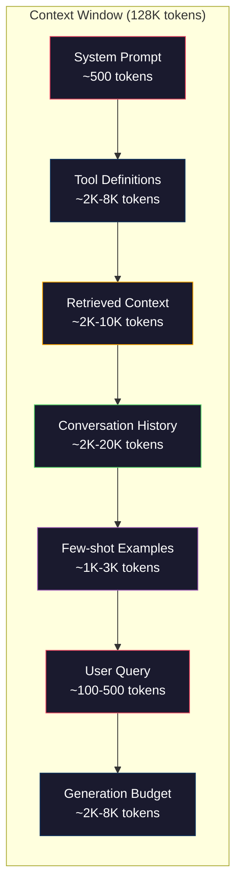
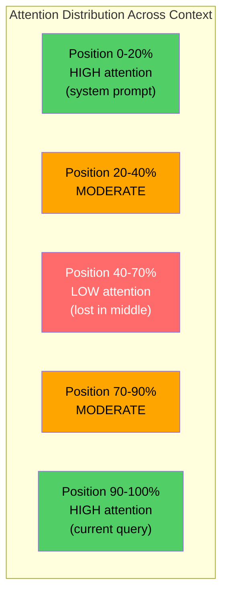
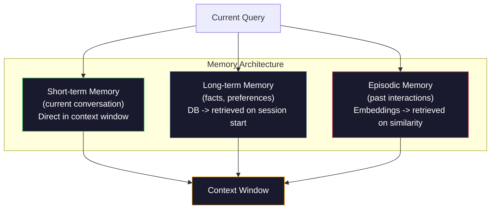

# Ingeniería de contexto: Windows, Presupuestos, Memoria y Recuperación.

> La ingeniería de instancias es un subconjunto. La ingeniería de contexto es todo el juego. Una solicitud es una cadena que escribe. El contexto es todo lo que entra en la ventana del modelo: instrucciones del sistema, documentos recuperados, definiciones de herramientas, historial de conversaciones, ejemplos de pocos disparos y la solicitud en sí misma. Los mejores ingenieros de IA en 2026 son ingenieros de contexto. Deciden lo que entra, lo que queda y en qué orden.

> **【中文解读】**提示工程只是上下文工程的子集──上下文工程管理模型窗口中的一切内容系统指令、检查文档、工具定义、对话历史等──2026年最优秀的AI 工程师就是上下文工程师──

> **【拓展：上下文工程→Claude生态】**El protocolo MCP de Claude es en esencia la implementación de los estándares de la obra de texto siguiente a través del modelo de gestión de protocolo unificado de herramientas, recursos y sugerencias visibles.

> ¿ Qué es esto ?**【前置】**学本节前请先掌握:(1) Fase 11·01-02(Integrinaje rápido、CoT poco disparado);(2) Fase 11·04(Embedidos) y Fase 11·06(RAG) 理解检索如何取文档;(3) token 概念本节重度讨论 token 预算──如果不知道"200K context window" 指什么,先看Fase 10──

**Type:** Build | **类型:** 构建
**Languages:** Python | **语言:** Python
**Prerequisites:** Phase 10 (LLMs from Scratch), Phase 11 Lesson 01-02 | **前置知识:** Phase 10（从零理解 LLM）、Phase 11 Lesson 01-02
**Time:** ~90 minutes | **时间:** ~90 分钟
**Related:**Fase 11 · 15 (Caching de inmediato)  el diseño amigable con la caché es una extensión de la ingeniería de contexto. Fase 5 · 28 (Evaluación de contexto largo) para medir la pérdida en el medio con NIAH / RULER. **相关:**Fase 11 · 15(puestas de caché) 缓存友好布局是上下文工程的延伸──Fase 5 · 28(长上下文评估)介绍如何使用NIAH/RULER 测量"中间丢失"──

## Objetivos de aprendizaje

- Calcular los presupuestos de tokens en todos los componentes de la ventana de contexto (prompt del sistema, herramientas, historial, documentos recuperados, espacio de generación)
  跨所有上下文窗口组件(系统提示、工具、历史、检索文档、生成余量) calcular el token  presupuesto
- Implemente estrategias de gestión de ventanas de contexto: truncamiento, resumen y ventana deslizante para el historial de conversaciones
  实现上下文窗口管理策略: cortar, resumir, mover, gestionar y gestionar las ventanas
- Priorizar y ordenar los componentes del contexto para maximizar la atención del modelo sobre la información más relevante
   según la clasificación de prioridades en los componentes siguientes, maximizar el modelo de atención a la información más relevante
- Construir un conjunto de contexto que asigna dinámicamente tokens basados en el tipo de consulta y el espacio de ventana disponible
   Construir según el tipo de consulta y el espacio disponible de la ventana

> **【中文解读】**El objetivo de este curso es: Más allá de la ingeniería rápida, la gestión sistemática entra en el modelo de la información siguiente.


## El problema es la introducción del problema

Claude Opus 4.7 tiene una ventana de 200K tokens (1M en beta). GPT-5 tiene 400K. Gemini 3 Pro tiene 2M. Llama 4 afirma 10M. Estos números suenan enormes hasta que los llenas.

> Claude Opus 4.7 tiene 200K tokens  Window(beta  versión 1M) ・・・GPT-5 tiene 400K ・・・Gemini 3 Pro tiene 2M ・・・ Estos números suenan muy grandes, hasta que los llenas―

Aquí hay una descomposición real para un asistente de codificación. Informe de sistema: 500 tokens. Definiciones de herramientas para 50 herramientas: 8.000 tokens. Documentación recuperada: 4.000 tokens. Historial de conversaciones (10 vueltas): 6.000 tokens. Cuestión actual del usuario: 200 tokens. Presupuesto de generación (máxima salida): 4.000 tokens. Total: 22.700 tokens. Eso es solo el 18% de una ventana de 128K.

> Este es un programación de ayuda de la verdadera división. Sistema de sugerencias: 500 tokens. 50 个工具定义: 8,000 tokens.

> ¿ Qué es esto ?**【类比】**上下文窗口像书桌面200K token 听起来很大,但放上"教科书(系统提示) "+"参考书(检索文件) "+"草稿纸(历史) "+"计算器(工具) "就快满了──**Lost in the Middle**现象像寻找东西: Cuando hay cosas en la mesa, lo más fácil de ignorar es que en el centro de la pila solo se puede concentrar en el principio de la mesa y en el final de la mesa.

> ️ **【易错点】**上下文管理的 3 个坑: ((1) **历史无限增长** diálogo越长 historia 越大,最终撞窗口;修复:用总结(每 N 轮缩成摘要) o escaparate deslizante((只保留近期 K 轮 + 第一轮) 』2) **工具定义重复发送** Cada vez que se utiliza todo se utiliza 50 esquemas de herramientas 全发一遍;修复: con caching rápido(Fase 11·15),Claude / OpenAI 都支持,省 90% cost。(3) **检索文档全塞** Revoca 50 piezas  Full塞 prompt 模型迷失;修复:top-5 高质量块 + cross-encoder 重排──

Pero la atención no se escala linealmente con la longitud del contexto. Un modelo con 128K tokens de contexto paga el costo de atención cuadrática (O  n ^ 2) en transformadores de vainilla, aunque la mayoría de los modelos de producción utilizan variantes de atención eficientes. Lo más importante es que la precisión de recuperación se degrada. La prueba "Aguila en un haystack" muestra que los modelos luchan por encontrar información colocada en medio de contextos largos. Investigación de Liu et al. (2023) mostró que los LLM recogen información al comienzo y al final de contextos largos con una precisión casi perfecta, pero la precisión disminuye del 10-20% para la información colocada en el medio (posiciones del 40-70% del contexto). Este efecto "perdido en el medio" varía según el modelo, pero afecta a todas las arquitecturas actuales.

> Pero la atención no se expande con la longitud lineal de la siguiente. Más importante aún, la tasa de precisión de la búsqueda se reduce. El "teste de gran mar" muestra que el modelo es difícil de encontrar en la posición media de la información en la siguiente página.

La lección práctica: tener 200K tokens disponibles no significa que usar 200K tokens sea efectivo. Un contexto de 10K de tokens cuidadosamente seleccionado a menudo supera un contexto de 100K de tokens descargados.

>  Lección práctica: hay 200K de tokens.

Cada token que pones en la ventana desplaza un token que podría llevar información más relevante. Cada definición de herramienta irrelevante, cada giro de conversación obsoleto, cada trozo de texto recuperado que no responde a la pregunta - cada uno hace que el modelo sea ligeramente peor en la tarea.

> Cada token que usted pone en la ventana se ha expuesto a un token que podría llevar más información relevante. Cada unidad no relacionada se define, cada una de las conversaciones de la pasada, cada uno no responde a la pregunta.

## El concepto central.

> **【中文解读】**Ingeniería de contexto) es un concepto de ingeniería de contexto que no es sólo escribir un mensaje rápido, sino sistematizando la gestión de toda la información que entra en la ventana de texto del modelo: resultados de búsqueda, historia de diálogo, herramientas de salida, instrucciones de sistema, etc.

> **【拓展：上下文窗口的有效利用】**GPT-4o tiene 128K de tokens en la ventana de abajo, pero los estudios muestran que el modelo se concentra en la información de la posición media.


### La ventana de contexto es un recurso escaso

Piensa en la ventana de contexto como RAM, no como disco. Es rápido y directamente accesible, pero limitado. No puedes caber en todo. Tienes que elegir.

> Ponga la ventana en la memoria RAM, no en el disco.



Cada componente compite por espacio. Agregar más definiciones de herramientas significa menos espacio para el historial de conversaciones. Agregar más contexto recuperado significa menos espacio para ejemplos de pocos disparos.

> Cada componente lucha por espacio. Más herramientas se definen significa espacio histórico de diálogo menos. Más buscas en el texto de abajo significa menos espacio de ejemplos.

### Perdido en el medio

El resultado empírico más importante en la ingeniería de contexto. Los modelos prestan mejor atención a la información al principio y al final del contexto. La información en el medio obtiene menores puntajes de atención y es más probable que sea ignorada.

> En el trabajo de la siguiente página, el resultado es más importante: el modelo tiene una mejor atención a la información del principio y final de la siguiente página.

Liu et al. (2023) probaron esto sistemáticamente. Colocaron un documento relevante entre 20 documentos irrelevantes en varias posiciones y midieron la exactitud de la respuesta. Cuando el documento relevante era el primero o el último, la exactitud era de 85-90%. Cuando estaba en el medio (posición 10 de 20), la exactitud cayó a 60-70%.

> Liu et al. (en 2023) sistematicamente probaron este fenómeno. Colocaron los documentos relacionados en diferentes posiciones de 20 documentos no relacionados, la tasa de precisión de respuesta a la medida.

Esto tiene implicaciones directas de ingeniería:

> Esto tiene un significado directo en ingeniería:

- Ponga en primer lugar la información más importante (instrucciones de sistema, instrucciones críticas)
  Para poner la información más importante en la página anterior
- Colocar la consulta actual y el contexto más relevante en último lugar (el sesgo reciente ayuda)
  Se puede ver en la siguiente página:
- Tratar el centro del contexto como la zona de menor prioridad
  Se considerará el medio medio como la región de menor prioridad
- Si debe incluir información en el medio, duplique el punto clave al final
  Si hay que poner información en el medio, en el final



### Componentes del contexto

**System prompt**Claude Code utiliza aproximadamente 6.000 tokens para su mensaje de sistema, incluyendo las definiciones de herramientas e instrucciones de comportamiento. Manténlo apretado. Cada palabra en el mensaje de sistema se repite en cada llamada de API.

> **系统提示**: establecer persona, restricción y reglas de comportamiento, poner en el primer plano y en la siguiente ronda mantenerse inalterado, introducir un código de código de código de aproximadamente 6.000 tokens, incluyendo herramientas de definición y instrucciones de comportamiento, mantenerse en el punto de vista de cada palabra en cada API.

**Tool definitions**Cada herramienta añade 50-200 tokens (nombre, descripción, esquema de parámetros). 50 herramientas en 150 tokens cada uno es 7.500 tokens antes de que ocurra cualquier conversación. La selección de herramientas dinámicas - sólo incluyendo herramientas relevantes para la consulta actual - puede reducir esto en 60-80%.

> **工具定义**Cada herramienta tiene 50-200 tokens (en inglés): 50 tokens (en inglés): 50 tokens (en inglés): 50 tokens (en inglés): 50 tokens (en inglés): 50 tokens (en inglés): 50 tokens (en inglés): 50 tokens (en inglés): 50 tokens (en inglés): 50 tokens (en inglés): 50 tokens (en inglés): 50 tokens (en inglés): 50 tokens (en inglés): 50 tokens (en inglés): 50 tokens (en inglés): 50 tokens (en inglés): 50 tokens (en inglés): 50 tokens (en inglés): 50 tokens (en inglés): 50 tokens (en inglés): 50 tokens (en inglés): 50 tokens (en inglés): 50 tokens (en inglés) (en inglés): 50 tokens (en inglés) (en inglés): 50 个工具 (en inglés) (en inglés): 50 个) (en inglés) (en inglés) (en inglés) (en inglés) (en inglés) (en inglés) (en inglés) (en inglés) (en inglés) (en inglés) (en inglés) (en inglés) (en inglés) (en inglés) (en inglés) (en inglés) (en inglés) (en inglés) (en inglés) (en inglés) (en inglés) (en inglés) (en inglés) (en inglés) (en inglés) (en inglés) (en inglés) (en inglés) (en inglés) (en inglés) (en inglés) (en inglés) (en inglés) (en inglés) (en inglés) (en inglés) (en inglés) (en inglés) (en inglés) (en) (en) (en) (en) (en) (en) (en) (en) (en) (en) (en) (en) (en) (en) (en) (en) (en) (en)) (en) (en) (en)) (en) (en)) (en) (en)) (en) (en) (en)) (en) (en)) (en) (en) (en)) (en) (en) (en) (en) (en)) (en) (en) (en) (en)) (en) (en) (en) (en) (en) (en) (en)

**Retrieved context**La calidad de la recuperación determina directamente la calidad de la respuesta. La mala recuperación es peor que ninguna recuperación - llena la ventana con ruido y engaña activamente el modelo.

> **检索上下文**El contenido del archivo de la base de datos de velocidad, los resultados de búsqueda, los archivos de archivo, los resultados de búsqueda, los archivos, los archivos, los archivos, los archivos, los archivos, los archivos, los archivos, los archivos, los archivos, los archivos, los archivos, los archivos, los archivos, los archivos, los archivos, los archivos, los archivos, los archivos, los archivos, los archivos, los archivos, los archivos, los archivos, los archivos, los archivos, los archivos, los archivos, los archivos, los archivos, los archivos, los archivos, los archivos, los archivos, los archivos, los archivos, los archivos, los archivos, los archivos, los archivos, los archivos, los archivos, los archivos, los archivos, los archivos, los archivos, los archivos, los archivos, los archivos, los archivos, los archivos, los archivos, los archivos, los archivos, los archivos, los archivos, los archivos, los archivos, los archivos, etc.

**Conversation history**Una conversación de 50 vueltas a 200 tokens por turno es de 10.000 tokens de historia. La mayoría de ellos son irrelevantes para la consulta actual.

> **对话历史**El número de usuarios que han recibido las noticias y las respuestas de los asistentes es de aproximadamente 10.000 tokens.

**Few-shot examples**Los ejemplos bien elegidos a menudo mejoran la calidad de la salida más que miles de tokens de instrucciones. Pero cuestan espacio.

> **少样本示例**Exemplos de ejemplos de 2-3 acciones de espera de entrada/salida de datos seleccionadas con mucha atención suelen ser más capaces de aumentar la calidad de salida de instrucciones de miles de tokens, pero consumen espacio.

**Generation budget**Si se llena la ventana a la capacidad, el modelo no tiene espacio para responder. Reserva al menos 2.000-4.000 tokens para la generación.

> **生成预算**Si la ventana se llena, el modelo no tiene espacio para responder.

### Estrategias de compresión de contexto

**History summarization**En lugar de mantener todos los turnos anteriores en forma literal, resume periódicamente la conversación. "Discutimos X, decidimos Y, y el usuario quiere Z" en 100 tokens reemplaza a 10 turnos que tomaron 2,000 tokens. ejecuta resumen cuando la historia excede un umbral (por ejemplo, 5,000 tokens).

> **历史摘要**En el caso de los usuarios de la red de datos, el número de tokens de la red de datos de la red de datos de la red de datos de la red de datos de la red de datos de la red de datos de la red de datos de la red de datos de la red de datos de la red de datos de la red de datos de la red de datos de la red de datos de la red de datos de la red de datos de la red de datos de la red de datos de la red de datos de la red de datos de la red de datos de la red de datos de la red de datos de la red de datos de la red de datos de la red de datos de la red de datos de la red de datos de la red de datos de la red de datos de la red de datos de datos de la red de datos de datos de la red de datos de datos de la red de datos de datos de la red de datos de datos de la red de datos de datos de datos de la red de datos de datos de datos de datos de la red de datos de datos de datos de datos de la red de datos de datos de datos de datos de datos de la red de datos de datos de datos de datos de datos de datos de la red de datos de datos de datos de datos de datos de la red de datos de datos de datos de datos de la red de datos de datos de datos de datos de datos de la red de datos de datos de datos de datos de datos de datos de la red de datos de datos de datos de datos de datos de datos de datos de la red de datos de datos de datos de datos de datos de datos de la red de datos de datos de datos de datos de datos de datos de datos de la red de datos de datos de datos de datos de datos de datos de datos de datos de datos de datos de datos de datos de datos de datos de datos de datos de datos de datos de datos de datos de datos de datos de datos de datos de datos de datos de datos de datos de datos de datos de datos de datos de datos de datos de datos de datos de datos de datos de datos de datos de datos de datos de datos de datos de datos de datos de datos de datos de datos de datos de datos de datos de datos de datos de datos de datos de datos de datos de datos de datos de datos de datos de datos de datos de datos de datos de datos de datos de datos de datos de datos de datos de datos de datos de datos

**Relevance filtering**Si ha recuperado 10 trozos pero sólo 3 son relevantes, descarte los otros 7. Es mejor tener 3 trozos altamente relevantes que 10 mediocres.

> **相关性过滤**Si se buscan 10 bloques pero sólo 3 están relacionados, se desechan otros 7 o 3 bloques más altos que 10 bloques generales, bueno.

**Tool pruning**Una pregunta de código no necesita herramientas de calendario. Una pregunta de programación no necesita herramientas de sistema de archivos. Esto puede reducir las definiciones de herramientas de 8,000 tokens a 1,000.

> **工具裁剪**Se puede definir la herramienta desde 8,000 tokens  reducido a 1,000 ⋅

**Recursive summarization**En el caso de documentos muy largos, resumen en etapas. primero resumen cada sección, luego resumen los resúmenes. Un documento de 50 páginas se convierte en un resumen de 500 tokens que capta los puntos clave.

> **递归摘要**Se trata de un conjunto de 50 páginas de documentos que se convierten en 500 tokens, capturando puntos clave.

### Sistemas de memoria

La ingeniería de contexto abarca tres horizontes de tiempo.

> La obra se transcende a través de tres medidas de tiempo.

**Short-term memory**Se almacena en la ventana de contexto directamente. crece con cada giro.

> **短期记忆**• presentation dialogue. direct storage in upper down文窗口. • con cada ronda de crecimiento. • con el resumen y el corte de gestión.

**Long-term memory**"El usuario prefiere TypeScript". "El proyecto utiliza PostgreSQL". Almacenado en una base de datos, recuperado al inicio de la sesión. Claude Code almacena esto en archivos CLAUDE.md. ChatGPT lo almacena en su función de memoria.

> **长期记忆**El código de Claude existe en el archivo de CLAUDE.md ⋅ ChatGPT existe en su memoria  función ⋅

**Episodic memory**: interacciones específicas del pasado que podrían ser relevantes. "El martes pasado, desactivamos un problema similar en el módulo auth". Almacenado como embebidos, recuperado cuando la conversación actual coincide con un episodio anterior.

> **情景记忆**Se trata de un proceso de intercambio de datos y de información que se puede realizar en el contexto de la interacción entre los diferentes grupos de datos.



### Asamblea de contexto dinámico

La clave: las diferentes consultas necesitan un contexto diferente. Un sistema estático de instrucción + herramientas estáticas + historial estático es un desperdicio. Los mejores sistemas ensamblan dinámicamente el contexto por consulta.

> 关键洞察: diferentes consultas necesitan diferentes sobre la siguiente.

1. Clasificar la intención de la consulta
   Sección de preguntas
2. Seleccionar las herramientas pertinentes (no todas)
   选择相关工具 (no todas las herramientas)
3. Recoger los documentos pertinentes (no un conjunto fijo)
   检索相关文档(no es un conjunto fijo)
4. Incluir los giros de historia relevantes (no toda la historia)
   包含相关历史轮次(不是全部历史)
5. Añadir ejemplos de algunas tomas que coincidan con el tipo de tarea
   Adición de ejemplos de pequeñas muestras que se ajustan al tipo de tarea
6. Ordenar todo por importancia: crítico primero, importante último, opcional en el medio
   按重要性排序:关键在前,重要在后,可选在中间

Esto es lo que separa una buena aplicación de IA de una gran. El modelo es el mismo. El contexto es el diferenciador.

> Esta es la diferencia entre la aplicación de la IA y la aplicación de la IA superior. El modelo es el mismo.

## Construye y realiza.
```figure
lost-in-the-middle
```

## Construye el mismo

### Paso 1: Contador de tokens

No se puede presupuestar lo que no se puede medir. Construye un contador de tokens simple (aproximación utilizando la división del espacio en blanco, ya que el conteo exacto depende del tokenizer).

> Usted no puede hacer un presupuesto para cosas que no pueden medirse. Construir un simple contador de tokens.

```python
import json
import numpy as np
from collections import OrderedDict

def count_tokens(text):
    if not text:
        return 0
    return int(len(text.split()) * 1.3)

def count_tokens_json(obj):
    return count_tokens(json.dumps(obj))
```

### Paso 2: Gestión de presupuesto de contexto

El eje ejecutivo de presupuesto rastrea cuántos tokens cada componente utiliza y impone límites.

> 核心抽象──预算管理器追踪每个组件使用多少代币 并强限制制──

```python
class ContextBudget:
    def __init__(self, max_tokens=128000, generation_reserve=4000):
        self.max_tokens = max_tokens
        self.generation_reserve = generation_reserve
        self.available = max_tokens - generation_reserve
        self.allocations = OrderedDict()

    def allocate(self, component, content, max_tokens=None):
        tokens = count_tokens(content)
        if max_tokens and tokens > max_tokens:
            words = content.split()
            target_words = int(max_tokens / 1.3)
            content = " ".join(words[:target_words])
            tokens = count_tokens(content)

        used = sum(self.allocations.values())
        if used + tokens > self.available:
            allowed = self.available - used
            if allowed <= 0:
                return None, 0
            words = content.split()
            target_words = int(allowed / 1.3)
            content = " ".join(words[:target_words])
            tokens = count_tokens(content)

        self.allocations[component] = tokens
        return content, tokens

    def remaining(self):
        used = sum(self.allocations.values())
        return self.available - used

    def utilization(self):
        used = sum(self.allocations.values())
        return used / self.max_tokens

    def report(self):
        total_used = sum(self.allocations.values())
        lines = []
        lines.append(f"Context Budget Report ({self.max_tokens:,} token window)")
        lines.append("-" * 50)
        for component, tokens in self.allocations.items():
            pct = tokens / self.max_tokens * 100
            bar = "#" * int(pct / 2)
            lines.append(f"  {component:<25} {tokens:>6} tokens ({pct:>5.1f}%) {bar}")
        lines.append("-" * 50)
        lines.append(f"  {'Used':<25} {total_used:>6} tokens ({total_used/self.max_tokens*100:.1f}%)")
        lines.append(f"  {'Generation reserve':<25} {self.generation_reserve:>6} tokens")
        lines.append(f"  {'Remaining':<25} {self.remaining():>6} tokens")
        return "\n".join(lines)
```

### Paso 3: Reordenamiento perdido en el medio

Implementar la estrategia de reordenamiento: los elementos más importantes se encuentran en primer lugar y en último lugar, los menos importantes en el medio.

> 实现重排策略: los proyectos más importantes, los primeros y los últimos, los menos importantes, los intermedios.

```python
def reorder_lost_in_middle(items, scores):
    paired = sorted(zip(scores, items), reverse=True)
    sorted_items = [item for _, item in paired]

    if len(sorted_items) <= 2:
        return sorted_items

    first_half = sorted_items[::2]
    second_half = sorted_items[1::2]
    second_half.reverse()

    return first_half + second_half

def score_relevance(query, documents):
    query_words = set(query.lower().split())
    scores = []
    for doc in documents:
        doc_words = set(doc.lower().split())
        if not query_words:
            scores.append(0.0)
            continue
        overlap = len(query_words & doc_words) / len(query_words)
        scores.append(round(overlap, 3))
    return scores
```

### Paso 4: Compresor de historial de conversación

Resumiendo una vieja conversación se vuelve a reclamar el presupuesto de los tokens.

> 总结旧对话轮次以收回标志 预算。

```python
class ConversationManager:
    def __init__(self, max_history_tokens=5000):
        self.turns = []
        self.summaries = []
        self.max_history_tokens = max_history_tokens

    def add_turn(self, role, content):
        self.turns.append({"role": role, "content": content})
        self._compress_if_needed()

    def _compress_if_needed(self):
        total = sum(count_tokens(t["content"]) for t in self.turns)
        if total <= self.max_history_tokens:
            return

        while total > self.max_history_tokens and len(self.turns) > 4:
            old_turns = self.turns[:2]
            summary = self._summarize_turns(old_turns)
            self.summaries.append(summary)
            self.turns = self.turns[2:]
            total = sum(count_tokens(t["content"]) for t in self.turns)

    def _summarize_turns(self, turns):
        parts = []
        for t in turns:
            content = t["content"]
            if len(content) > 100:
                content = content[:100] + "..."
            parts.append(f"{t['role']}: {content}")
        return "Previous: " + " | ".join(parts)

    def get_context(self):
        parts = []
        if self.summaries:
            parts.append("[Conversation Summary]")
            for s in self.summaries:
                parts.append(s)
        parts.append("[Recent Conversation]")
        for t in self.turns:
            parts.append(f"{t['role']}: {t['content']}")
        return "\n".join(parts)

    def token_count(self):
        return count_tokens(self.get_context())
```

### Paso 5: Selector de herramientas dinámicas

Sólo incluye herramientas relevantes para la consulta actual. Clasifique la intención, luego filtre.

> Sólo contiene herramientas relacionadas con las consultas actuales.

```python
TOOL_REGISTRY = {
    "read_file": {
        "description": "Read contents of a file",
        "tokens": 120,
        "categories": ["code", "files"],
    },
    "write_file": {
        "description": "Write content to a file",
        "tokens": 150,
        "categories": ["code", "files"],
    },
    "search_code": {
        "description": "Search for patterns in codebase",
        "tokens": 130,
        "categories": ["code"],
    },
    "run_command": {
        "description": "Execute a shell command",
        "tokens": 140,
        "categories": ["code", "system"],
    },
    "create_calendar_event": {
        "description": "Create a new calendar event",
        "tokens": 180,
        "categories": ["calendar"],
    },
    "list_emails": {
        "description": "List recent emails",
        "tokens": 160,
        "categories": ["email"],
    },
    "send_email": {
        "description": "Send an email message",
        "tokens": 200,
        "categories": ["email"],
    },
    "web_search": {
        "description": "Search the web for information",
        "tokens": 140,
        "categories": ["research"],
    },
    "query_database": {
        "description": "Run a SQL query on the database",
        "tokens": 170,
        "categories": ["code", "data"],
    },
    "generate_chart": {
        "description": "Generate a chart from data",
        "tokens": 190,
        "categories": ["data", "visualization"],
    },
}

def classify_intent(query):
    query_lower = query.lower()

    intent_keywords = {
        "code": ["code", "function", "bug", "error", "file", "implement", "refactor", "debug", "test"],
        "calendar": ["meeting", "schedule", "calendar", "appointment", "event"],
        "email": ["email", "mail", "send", "inbox", "message"],
        "research": ["search", "find", "what is", "how does", "explain", "look up"],
        "data": ["data", "query", "database", "chart", "graph", "analytics", "sql"],
    }

    scores = {}
    for intent, keywords in intent_keywords.items():
        score = sum(1 for kw in keywords if kw in query_lower)
        if score > 0:
            scores[intent] = score

    if not scores:
        return ["code"]

    max_score = max(scores.values())
    return [intent for intent, score in scores.items() if score >= max_score * 0.5]

def select_tools(query, token_budget=2000):
    intents = classify_intent(query)
    relevant = {}
    total_tokens = 0

    for name, tool in TOOL_REGISTRY.items():
        if any(cat in intents for cat in tool["categories"]):
            if total_tokens + tool["tokens"] <= token_budget:
                relevant[name] = tool
                total_tokens += tool["tokens"]

    return relevant, total_tokens
```

### Paso 6: Línea de ensamblaje de contexto completo

En una consulta, ensamble dinámicamente el contexto óptimo.

> Encuentra todo. Encuesta, movimiento y mejor montaje.

```python
class ContextEngine:
    def __init__(self, max_tokens=128000, generation_reserve=4000):
        self.budget = ContextBudget(max_tokens, generation_reserve)
        self.conversation = ConversationManager(max_history_tokens=5000)
        self.system_prompt = (
            "You are a helpful AI assistant. You have access to tools for "
            "code editing, file management, web search, and data analysis. "
            "Use the appropriate tools for each task. Be concise and accurate."
        )
        self.knowledge_base = [
            "Python 3.12 introduced type parameter syntax for generic classes using bracket notation.",
            "The project uses PostgreSQL 16 with pgvector for embedding storage.",
            "Authentication is handled by Supabase Auth with JWT tokens.",
            "The frontend is built with Next.js 15 using the App Router.",
            "API rate limits are set to 100 requests per minute per user.",
            "The deployment pipeline uses GitHub Actions with Docker multi-stage builds.",
            "Test coverage must be above 80% for all new modules.",
            "The codebase follows the repository pattern for data access.",
        ]

    def assemble(self, query):
        self.budget = ContextBudget(self.budget.max_tokens, self.budget.generation_reserve)

        system_content, _ = self.budget.allocate("system_prompt", self.system_prompt, max_tokens=1000)

        tools, tool_tokens = select_tools(query, token_budget=2000)
        tool_text = json.dumps(list(tools.keys()))
        tool_content, _ = self.budget.allocate("tools", tool_text, max_tokens=2000)

        relevance = score_relevance(query, self.knowledge_base)
        threshold = 0.1
        relevant_docs = [
            doc for doc, score in zip(self.knowledge_base, relevance)
            if score >= threshold
        ]

        if relevant_docs:
            doc_scores = [s for s in relevance if s >= threshold]
            reordered = reorder_lost_in_middle(relevant_docs, doc_scores)
            doc_text = "\n".join(reordered)
            doc_content, _ = self.budget.allocate("retrieved_context", doc_text, max_tokens=3000)

        history_text = self.conversation.get_context()
        if history_text.strip():
            history_content, _ = self.budget.allocate("conversation_history", history_text, max_tokens=5000)

        query_content, _ = self.budget.allocate("user_query", query, max_tokens=500)

        return self.budget

    def chat(self, query):
        self.conversation.add_turn("user", query)
        budget = self.assemble(query)
        response = f"[Response to: {query[:50]}...]"
        self.conversation.add_turn("assistant", response)
        return budget


def run_demo():
    print("=" * 60)
    print("  Context Engineering Pipeline Demo")
    print("=" * 60)

    engine = ContextEngine(max_tokens=128000, generation_reserve=4000)

    print("\n--- Query 1: Code task ---")
    budget = engine.chat("Fix the bug in the authentication module where JWT tokens expire too early")
    print(budget.report())

    print("\n--- Query 2: Research task ---")
    budget = engine.chat("What is the best approach for implementing vector search in PostgreSQL?")
    print(budget.report())

    print("\n--- Query 3: After conversation history builds up ---")
    for i in range(8):
        engine.conversation.add_turn("user", f"Follow-up question number {i+1} about the implementation details of the system")
        engine.conversation.add_turn("assistant", f"Here is the response to follow-up {i+1} with technical details about the architecture")

    budget = engine.chat("Now implement the changes we discussed")
    print(budget.report())

    print("\n--- Tool Selection Examples ---")
    test_queries = [
        "Fix the bug in auth.py",
        "Schedule a meeting with the team for Tuesday",
        "Show me the database query performance stats",
        "Search for best practices on error handling",
    ]

    for q in test_queries:
        tools, tokens = select_tools(q)
        intents = classify_intent(q)
        print(f"\n  Query: {q}")
        print(f"  Intents: {intents}")
        print(f"  Tools: {list(tools.keys())} ({tokens} tokens)")

    print("\n--- Lost-in-the-Middle Reordering ---")
    docs = ["Doc A (most relevant)", "Doc B (somewhat relevant)", "Doc C (least relevant)",
            "Doc D (relevant)", "Doc E (moderately relevant)"]
    scores = [0.95, 0.60, 0.20, 0.80, 0.50]
    reordered = reorder_lost_in_middle(docs, scores)
    print(f"  Original order: {docs}")
    print(f"  Scores:         {scores}")
    print(f"  Reordered:      {reordered}")
    print(f"  (Most relevant at start and end, least relevant in middle)")
```

## Usalo con el marco de ejecución

### Contexto administrado por el arnés

Claude Code administra el contexto con un enfoque en capas. El prompt del sistema incluye reglas de comportamiento y definiciones de herramientas (~ 6K tokens). Cuando abre un archivo, su contenido se inyecta como contexto. Cuando busca, se agregan resultados. Se resumen los tiempos de conversación antiguos. CLAUDE.md proporciona memoria a largo plazo que persiste a través de las sesiones.

> Claude Code utiliza estrategias de gestión de la siguiente página. Sistema de sugerencias contiene normas y herramientas definidas.

La decisión clave de ingeniería: Claude Code no descarga toda su base de código en el contexto.

> 关键工程决策:Claude Code no hace que toda la base de códigos se incline hacia abajo.

### Carga de contexto dinámico del cursor
### Carga de contexto dinámico

Cursor indexa toda su base de código en embebidos. Cuando escribe una consulta, recupera los archivos y bloques de código más relevantes utilizando similitud vectorial. Sólo esas piezas entran en la ventana de contexto. Una base de código de 500K líneas se comprime en los 5-10 bloques de código más relevantes.

> Cursor incorporará toda la cartera de código para la búsqueda de datos. Cuando se introduzca una consulta, se buscan los bloques de código y documentos más relevantes con la similaridad de velocidad. Sólo estos fragmentos entran en la ventana de abajo. 500 K de la cartera de códigos se comprimen en 5-10 bloques de código más relevantes.

Este es el patrón: incrustar todo, recuperar a pedido, incluir sólo lo que importa.

> Éste es el modelo: todo lo que se necesita, sólo lo importante.

### Memoria de chatGPT
### Asistente de memoria a largo plazo

ChatGPT almacena las preferencias y hechos del usuario como memoria a largo plazo. En cada inicio de conversación, se extraen recuerdos relevantes e incluyen en el aviso del sistema. "El usuario prefiere Python" cuesta 5 tokens pero guarda cientos de tokens de instrucciones repetidas a través de las conversaciones.

> ChatGPT almacenará las preferencias y hechos de los usuarios para la memoria a largo plazo. Cuando cada conversación comienza, las memorias relacionadas se buscan y se incluyen en la sugerencia del sistema.

### RAG como ingeniería de contexto

La generación de recuperación aumentada es la ingeniería de contexto formalizada. En lugar de llenar el conocimiento en los pesos del modelo (entrenamiento) o en el sistema de instrucción (contexto estático), se extraen los documentos relevantes en el momento de la consulta e inyectan en la ventana de contexto. Toda la línea de RAG -- fragmentación, incorporación, recuperación, re-ranqueamiento -- existe para resolver un problema: poner la información correcta en la ventana de contexto.

> 检索增强生成是上下文工程的形式化──不把知识塞进模型权重 (训练) 或系统提示 (提示) ),而在查询时检索相关文档并注入上下文窗口──整个RAG管线分块、嵌入、检索、重排存在就是为了解决一个问题:把正确信息放入上下文窗口──

## Envíe el producto .

Esta lección produce`outputs/prompt-context-optimizer.md`-- un mensaje reutilizable que audita una estrategia de ensamblaje de contexto y recomienda optimizaciones. Alimenta su mensaje de sistema, el número de herramientas, el tiempo promedio del historial y la estrategia de recuperación, y identifica el desperdicio de tokens y sugiere mejoras.

> 本课产 出  `outputs/prompt-context-optimizer.md` Auditoring on the following text                                                                                                                                                                                                                                                           

También produce `outputs/skill-context-engineering.md`-- un marco de decisión para diseñar líneas de ensamblaje de contexto basadas en el tipo de tarea, el tamaño de la ventana de contexto y el presupuesto de latencia.

> Con el tiempo de producción`outputs/skill-context-engineering.md` Marco de decisión basado en el tipo de tarea  en la ventana de la siguiente dimensión y el presupuesto de la siguiente configuración de la línea de diseño 

## Los ejercicios.

1. Añadir un "detektor de desechos de tokens" a la clase ContextBudget. Debe marcar componentes que utilizan más del 30% del presupuesto y sugerir estrategias de compresión específicas para cada tipo de componente (resumir el historial, herramientas de poda, re-ranquear documentos).
   给 ContextBudget 添加"token 浪费检测器"──应标记使用超过30% 预算组件,并建议针对每种组件类型的压缩策略(摘要历史"",剪刀工具"",重排文档) 

2. Implemente deduplicación semántica para el contexto recuperado. Si dos documentos recuperados son más del 80% similares (por superposición de palabras o similitud cosina de sus embebidos), mantenga solo el más alto.
   Si dos archivos de investigación superan el 80% de similaridad, sólo se conservan un porcentaje más alto.

3. Construir una herramienta de "replay de contexto". Dado una transcripción de conversación, replay a través de ContextEngine y visualizar cómo cambia la asignación de presupuesto a su vez. Plot el uso de tokens por componente con el tiempo. Identificar el turno en el que el contexto comienza a comprimirse.
   构建"上下文回放"工具──给定对话转录,通过 ContextEngine 回放并可视化预算分配如何轮次变化──绘制每组件随时间的代号使用──识别上下文开始被压缩的轮次──

4. Implemente un selector de herramientas basado en prioridades. En lugar de incluir/excluir binario, asigne a cada herramienta una puntuación de relevancia a la consulta actual. Incluya herramientas en orden de relevancia descendente hasta que el presupuesto de la herramienta se agote. Compara el rendimiento de la tarea con 5, 10, 20 y 50 herramientas incluidas.
    Ejecutar una selección de herramientas basada en la prioridad.  No incluir/excluir, sino dar a cada herramienta una clasificación de la relevancia de la consulta actual.  Reducir la orden de la relevancia de los herramientas hasta que el presupuesto de los herramientas se agota.  Comparar con 5 ̊10 ̊20 ̊50 ̊

5. Construir un compresor de contexto multiestrategia. Implementar tres estrategias de compresión (truncado, resumen, extracción de oraciones clave) y compararlas en un conjunto de 20 documentos. Medir el compromiso entre la relación de compresión y la retención de información (¿contiene la versión comprimida la respuesta a la consulta?).
   构建多策略上下文压缩机. 实现三种压缩策略. 实现三种压缩策略. 实现三种压缩策略. 实现三种压缩策略. 实现三种压缩策略. 实现三种压缩策略. 实现三种压缩策略. 实现三种压缩策略. 实现三种压缩策略. 实现三种压缩策略. 实现三种压缩策略. 实现三种压缩策略. 实现三种压缩策略. 实现三种压缩策略. 实现三种压缩策略. 实现三种压缩策略. 实现三种压缩策略. 实现三种压缩策略. 实现三种压缩策略. 实现三种压缩策略. 实现三种压缩策略. 实现三种压缩策略.

## Términos clave .

| Term | What people say | What it actually means | 中文释义 |
|------|----------------|----------------------|---------|
| Context window | "How much the model can read" | The maximum number of tokens (input + output) the model processes in a single forward pass -- 400K for GPT-5, 200K (1M beta) for Claude Opus 4.7, 2M for Gemini 3 Pro | 上下文窗口：模型单次前向传播处理的最大 token 数（输入+输出）|
| Context engineering | "Advanced prompt engineering" | The discipline of deciding what goes into the context window, in what order, and at what priority -- encompasses retrieval, compression, tool selection, and memory management | 上下文工程：决定什么进入上下文窗口、什么顺序、什么优先级的学科——包含检索、压缩、工具选择、记忆管理 |
| Lost-in-the-middle | "Models forget stuff in the middle" | Empirical finding that LLMs attend better to the beginning and end of context, with 10-20% accuracy drop for information placed in the middle | 中间丢失：LLM 对上下文开头和结尾注意力更好的实证发现；中间位置准确率下降 10-20% |
| Token budget | "How many tokens you have left" | An explicit allocation of context window capacity across components (system prompt, tools, history, retrieval, generation) with per-component limits | token 预算：跨组件的上下文窗口容量显式分配（系统提示、工具、历史、检索、生成）带每组件限制 |
| Dynamic context | "Loading stuff on the fly" | Assembling the context window differently for each query based on intent classification, relevant tool selection, and retrieval results | 动态上下文：基于意图分类、相关工具选择和检索结果，为每个查询不同地组装上下文窗口 |
| History summarization | "Compressing the conversation" | Replacing verbatim old conversation turns with a concise summary, reducing token cost while preserving key information | 历史摘要：用简洁摘要替代逐字旧对话轮次，减少 token 成本同时保留关键信息 |
| Tool pruning | "Only including relevant tools" | Classifying query intent and only including tool definitions that match, reducing tool token cost by 60-80% | 工具裁剪：分类查询意图只包含匹配的工具定义，减少工具 token 成本 60-80% |
| Long-term memory | "Remembering across sessions" | Facts and preferences stored in a database and retrieved at session start -- CLAUDE.md, ChatGPT Memory, and similar systems | 长期记忆：跨会话存储在数据库并在会话开始时检索的事实和偏好——CLAUDE.md、ChatGPT Memory 等 |
| Episodic memory | "Remembering specific past events" | Past interactions stored as embeddings and retrieved when the current query is similar to a past conversation | 情景记忆：作为嵌入存储的过去交互，当前查询相似时检索 |
| Generation budget | "Room for the answer" | Tokens reserved for the model's output -- if the context fills the window completely, the model has no room to respond | 生成预算：为模型输出保留的 token——若上下文填满窗口，模型没有空间响应 |

## Más Leer más Leer más

- [Liu et al., 2023 -- "Lost in the Middle: How Language Models Use Long Contexts"](https://arxiv.org/abs/2307.03172)-- el estudio definitivo sobre la atención dependiente de la posición, que muestra que los modelos luchan con la información en medio de contextos largos
  Liu等, "Lost in the Middle" (Perdido en el medio)  Posición Relacionada a la investigación de la autoridad de la atención, muestra que el modelo es difícil de tratar
- [Anthropic's Contextual Retrieval blog post](https://www.anthropic.com/news/contextual-retrieval)-- cómo Anthropic se acerca a la recuperación de piezas conscientes del contexto, reduciendo el fracaso de recuperación en un 49%
  Antropic 上下文检索博客Antropic  cómo manejar sobre la siguiente sensación de bloqueo de la búsqueda, el fracaso de la búsqueda se reducirá un 49%
- [Simon Willison's "Context Engineering"](https://simonwillison.net/2025/Jun/27/context-engineering/)-- la publicación del blog que nombró la disciplina y la distinguió de la ingeniería rápida
  La "Ingeniería del contexto" de Simon Willison, que lleva el nombre de este curso, no lo distingue de la ingeniería de sugerencias.
- [LangChain documentation on RAG](https://python.langchain.com/docs/tutorials/rag/)-- implementación práctica de la generación aumentada mediante recuperación como patrón de ingeniería contextual
  LangChain RAG 文档 se va a buscar aumentar la generación como una implementación práctica del modelo de ingeniería de arriba abajo
- [Greg Kamradt's Needle in a Haystack test](https://github.com/gkamradt/LLMTest_NeedleInAHaystack)-- el índice de referencia que reveló fallas de recuperación dependientes de la posición en todos los modelos principales
  Greg Kamradt's Big Sea Claw Test  revela todos los principales modelos de posición relacionados con la búsqueda de la base de la falla
- [Pope et al., "Efficiently Scaling Transformer Inference" (2022)](https://arxiv.org/abs/2211.05102)-- por qué la longitud del contexto impulsa la memoria y la latencia, y cómo KV cache, MQA, y GQA cambian el cálculo del presupuesto.
  Pope等, "Eficientemente escalar la inferencia de transformador" (en 2022) 为何上下文长度驱动内存和延迟, así como KV cache、MQA、GQA 如何改变预算计算──
- [Agrawal et al., "SARATHI: Efficient LLM Inference by Piggybacking Decodes with Chunked Prefills" (2023)](https://arxiv.org/abs/2308.16369)-- las dos fases de inferencia que hacen que las instrucciones largas sean caras en TTFT pero baratas en TPOT; la verdad fundamental detrás de las compensaciones de empaquetado de contexto.
  Agrawal 等, "SARATHI" (en inglés) 推理两阶段使长提示在 TTFT 上昂贵但 TPOT 上便宜;上下文打包权衡背后的真相──
- [Ainslie et al., "GQA: Training Generalized Multi-Query Transformer Models from Multi-Head Checkpoints" (EMNLP 2023)](https://arxiv.org/abs/2305.13245)-- el papel de atención de consulta agrupada que corta memoria KV 8 veces en los decodificadores de producción sin pérdida de calidad.
  En el caso de los sistemas de gestión de los sistemas de gestión de los sistemas de gestión de los sistemas de gestión de los sistemas de gestión de los sistemas de gestión de los sistemas de gestión de los sistemas de gestión de los sistemas de gestión de los sistemas de gestión de los sistemas de gestión de los sistemas de gestión de los sistemas de gestión de los sistemas de gestión de los sistemas de gestión de los sistemas de gestión de los sistemas de gestión de los sistemas de gestión de los sistemas de gestión de los sistemas de gestión de los sistemas de gestión de los sistemas de gestión de los sistemas de gestión de los sistemas de gestión de los sistemas de gestión de los sistemas de gestión de los sistemas de gestión de los sistemas de gestión de los sistemas de gestión de los sistemas de gestión de los sistemas de gestión de los sistemas de gestión de los sistemas de gestión de los sistemas de gestión de los sistemas de gestión de los sistemas de gestión de los sistemas de gestión de los sistemas de gestión de los sistemas de gestión de los sistemas de gestión de los sistemas de gestión de los sistemas de gestión de los sistemas de gestión de los sistemas de gestión de los sistemas de gestión de los sistemas de gestión de los sistemas de gestión de los sistemas de gestión de los sistemas de gestión de los sistemas de gestión de los sistemas de gestión de los sistemas de gestión de los sistemas de gestión de los sistemas de los sistemas de gestión de los sistemas de gestión de los sistemas de gestión de los sistemas de los sistemas de gestión de los sistemas de gestión de los sistemas de los sistemas de gestión de los sistemas de gestión de los sistemas de los sistemas de gestión de los sistemas de los sistemas de gestión de los sistemas de los sistemas de gestión de los sistemas de los sistemas de gestión de los sistemas de los sistemas de gestión de los sistemas de los sistemas de gestión de los sistemas de los sistemas de los sistemas de gestión de los sistemas de los sistemas de gestión de los sistemas de los sistemas de los sistemas de gestión de los sistemas de los sistemas de los sistemas de los sistemas de gestión de los sistemas de los sistemas de los sistemas de los sistemas de los sistemas de gestión de los sistemas de los sistemas de los sistemas de los sistemas de los sistemas de los sistemas de los sistemas de los sistemas de los sistemas de los sistemas de los sistemas de los sistemas de los sistemas de los sistemas de los sistemas de los sistemas de los sistemas de los sistemas de los sistemas de los sistemas de los sistemas de los sistemas de los sistemas de los sistemas de los sistemas de los sistemas de los sistemas de los sistemas de los sistemas de los
