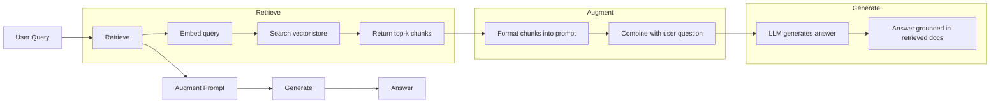
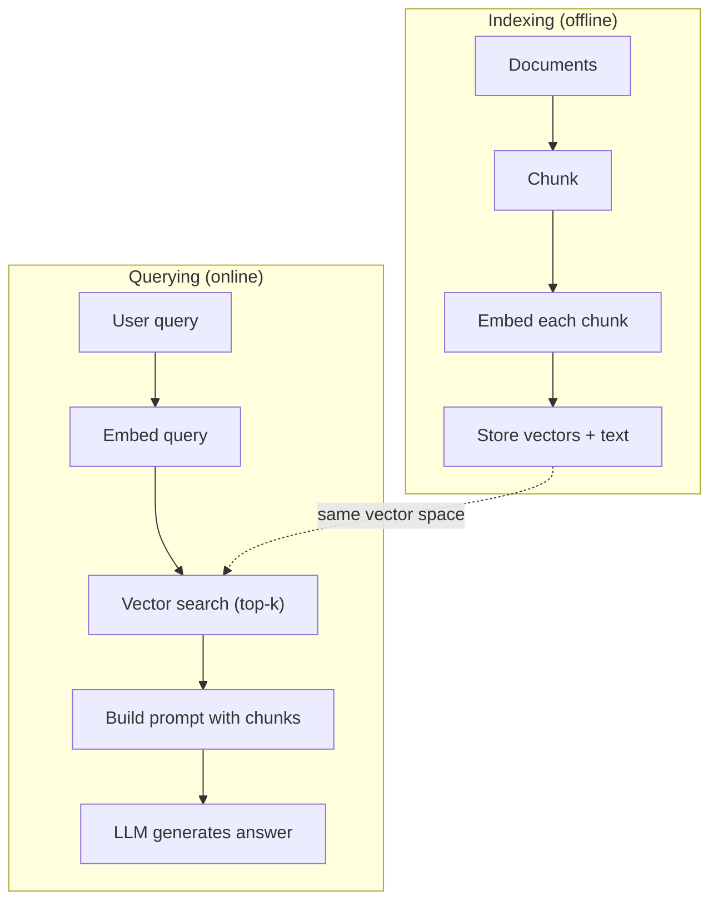

# RAG (Generación Aumentada de Recuperación) 检索增强生成

> Su LLM sabe todo hasta su tiempo de formación. No sabe nada sobre los documentos de su empresa, su base de código o las notas de la reunión de la semana pasada. RAG resuelve esto recuperando documentos relevantes y llenándolos en el prompt. Es el patrón más implementado en la IA de producción. Si construye algo de este curso, construye un oleoducto RAG.

> **【中文解读】**LLM sólo sabe información de entrenamiento hasta fecha anterior. RAG 通过检查相关文档并注入提示来弥补知识缺口. 

> **【拓展：RAG→企业AI应用】**RAG es el primer programa de selección de la IA para las empresas: conocimientos de base, preguntas y respuestas, revisiones de contratos, asistentes de documentos técnicos, análisis de informes financieros y otros casos dependen de la tubería RAG.

> ¿ Qué es esto ?**【前置】**学本节前请先掌握:(1) Fase 11·04(Embedings) 理解向量空间、相似度、HNSW;(2) Fase 05·23(Chunking Strategies) 理解文档切分;(3) Fase 10(LLM desde cero) 理解快速 如何影响生成──本节会用到 `chromadb`O `faiss`¿Qué es esto?`langchain`O `llamaindex`¿Qué es eso?

**Type:** Build | **类型:** 构建
**Languages:** Python | **语言:** Python
**Prerequisites:** Phase 10 (LLMs from Scratch), Phase 11 Lessons 01-05 | **前置知识:** Phase 10（从零理解 LLM）、Phase 11 Lesson 01-05
**Time:** ~90 minutes | **时间:** ~90 分钟
**Related:**Fase 5 · 23 (Estrategias de descomposición para RAG) para los seis algoritmos de descomposición y cuando cada uno gana. Fase 5 · 22 (Diplojación profunda de modelos de incorporación) para elegir el embedder. Fase 11 · 07 (RAG avanzado) para búsqueda híbrida, re-ranqueo y transformación de consultas.**相关:**Fase 5 · 23(RAG 分块策略) Introducción de seis tipos de algoritmos de bloques y sus respectivos escenarios de aplicación.

## Objetivos de aprendizaje

- Construir una línea de RAG completa: carga de documentos, fragmentación, incorporación, almacenamiento vectorial, recuperación y generación
  Construir un tubo RAG completo:文档加载分块,嵌入,向量存储,检索,生成
- Implementar búsqueda semántica utilizando una base de datos vectorial (ChromaDB, FAISS o Pinecone) con una indexación adecuada
  Utilizando la base de datos de la cantidad de datos (ChromaDB, FAISS o Pinecone) realizando la búsqueda de palabras y correctos índices
- Explicar por qué se prefiere el RAG a la ajuste fino para aplicaciones basadas en el conocimiento (costos, frescura, atribución)
  explicar por qué el conocimiento se aplica preferentemente a RAG y no a micro-modución  costo、 novedad、 atribución)
- Evaluar la calidad de los RAG utilizando métricas de recuperación (precisión, recuerdo) y métricas de generación (filialidad, relevancia)
  Us检索指标(precisión,recall) y producción de indicadores(filialidad, relevancia) evaluar RAG 质量

> **【中文解读】**El objetivo de este curso es: lograr un RAG completo (requisitos de aumento de generación) de tubos, archivos, secciones, generaciones, inmersiones, requisitos de velocidades, generaciones de respuestas, etc.


## El problema es la introducción del problema

La política de reembolso de las empresas se encuentra en una wiki interna de 200 páginas, donde se dice que los clientes de las empresas reciben una ventana de 60 días con reembolsos por cuenta propia. La LLM nunca ha visto este documento. No puede saber en qué no fue entrenado.

> Usted construyó un chatbot para la empresa. La pregunta del cliente es "¿Qué es la política de devolución de la versión empresarial?" LLM dio una respuesta general sobre la típica política de devolución de SaaS. La política real se encuentra en un wiki interno de 200 páginas, diciendo que el cliente empresarial tiene 60 días de duración y el reembolso en proporción. LLM nunca ha visto este archivo.

El ajuste fino es una solución. Tome el LLM, entrenarlo en sus documentos internos y despliegue el modelo actualizado. Esto funciona pero tiene serios problemas. El ajuste fino cuesta miles de dólares en cálculo. El modelo se vuelve obsoleto en el momento en que cambia un documento. No tiene manera de saber de qué fuente se extrajo el modelo. Y si la compañía adquiere otra línea de productos el próximo mes, usted ajusta de nuevo.

> 微调 es una solución. Pero la micro调 requiere miles de dólares en costos de cálculo.

RAG es la otra solución. Deja el modelo intacto. Cuando se le presente una pregunta, busque en su archivo de documentos pasajes relevantes, pégalos en el aviso antes de la pregunta y deje que el modelo responda utilizando esos pasajes como contexto. La tienda de documentos se puede actualizar en minutos. Puedes ver exactamente qué documentos fueron recuperados. El modelo en sí nunca cambia. Es por eso que RAG es el patrón dominante en la producción: es más barato, más fresco, más auditable y funciona con cualquier LLM.

> RAG es otra solución. Mantener el modelo invariable. Cuando el problema surja, busque en su archivo de archivos para encontrar los fragmentos relacionados, los ponga en la parte delantera del problema, permita que el modelo use estos fragmentos como el siguiente para responder.

> ¿ Qué es esto ?**【类比】**RAG 像開卷考試: estudiantes(LLM) no tiene que poner todos los libros de clases detrás de los demás, sino que tiene que llevar un libro de notas (en inglés) a la escuela.

## El concepto central.

> **【中文解读】**RAG(Retrieval-Augmented Generation,检索增强生成) combinará la base de conocimientos externa con el LLM: usuario pregunta hasta el archivo de la base de datos de velocidad de la investigación relacionados con el resultado de la investigación inyectado rápido hasta el LLM 基于检索结果生成答案──RAG 解决了LLM's知识时效性和幻觉问题──

> **【拓展：RAG 的生产实践】**典型RAG 管线:文档切分(chunking) hasta emplazamiento generado hasta volumen de almacenamiento(Pinecone/Weaviate/Chroma) hasta similaridad recolección hasta re-排序(re-ranking) hasta inyección de prompt。LlamaIndex 和 LangChain es el marco RAG más popular。Los estudios de Meta muestran que RAG en tareas de tipo de conocimiento intenso aumentará la tasa de precisión del 30-50%。


### El patrón RAG

Todo el patrón se ajusta en cuatro pasos:

> Todo el modo está en cuatro pasos:



Encuesta -> Recuperar -> Aumentar el mensaje -> Generar. Cada sistema RAG sigue este patrón. Las diferencias entre los sistemas RAG de producción están en los detalles de cada paso: cómo se descompone, cómo se incrusta, cómo se busca y cómo se construye el mensaje.

> 查询 -> 检索 -> 增强提示 -> 生成──每一个RAG 系统都遵循这个模式──生产RAG 系统的差异在每个步骤的细节:如何分块──如何嵌入──如何搜索──如何构建提示──

> ¿ Qué es esto ?**【困惑】**P: ¿Por qué no se pone directamente todo el archivo en la lista? Ahora Claude tiene 200K arriba abajo en la ventana, ¿hacerse?**精度下降** estudios muestran que la capacidad de LLM en el tiempo de trabajo para recuperar contenido medio se ha reducido significativamente, superando los 32K 后准确率掉20%+;**成本爆炸**200K tokens 输入约 $3/查询，而 RAG 检索 top-5 块只占 2K tokens（$0,03);(3) **响应慢**长快 推理延迟数倍于短快. Rág 用精准检索换全量加载.

### Por qué RAG es mejor que el ajuste fino

| Concern | Fine-tuning | RAG |
|---------|------------|-----|
| Cost / 成本 | $1,000-$100,000+ per training run / 每训练 1K-100K+ 美元 | $0.01-$0.10 per query (embedding + LLM) / 每查询 0.01-0.10 美元 |
| Freshness / 新鲜度 | Stale until retrained / 重训前都过时 | Updated in minutes by re-indexing docs / 重新索引文档即可在几分钟内更新 |
| Auditability / 可审计性 | Cannot trace answer to source / 无法追溯答案来源 | Can show exact retrieved passages / 可显示精确检索段落 |
| Hallucination / 幻觉 | Still hallucinates freely / 仍自由幻觉 | Grounded in retrieved documents / 基于检索文档接地 |
| Data privacy / 数据隐私 | Training data baked into weights / 训练数据固化在权重中 | Documents stay in your vector store / 文档留在你的向量存储中 |

El ajuste fino cambia los pesos del modelo de forma permanente. RAG cambia el contexto del modelo temporalmente. Para la mayoría de las aplicaciones, el contexto temporal es lo que se desea.

> 微调永久改变模型权重──RAG 临时改变模型上下文── para la mayoría de las aplicaciones,临时上下文就是你要的──

El único caso en el que el ajuste fino gana: cuando se necesita que el modelo adopte un estilo, tono o patrón de razonamiento específico que no se puede lograr solo mediante la solicitud.

> 微调胜出的唯一情况: Cuando necesitas un modelo que adopte un estilo específico, un lenguaje o un modelo de reflexión, esto es imposible de lograr solo por la sugerencia.

> ️ **【易错点】**RAG 落地的 3 个常见坑: ((1) **切分粒度错误**块太大(> 1024 token) emplazado en被稀释召回不到,块太小(< 64 token)丢失上下文;起点:256-512 token + 50 重叠──(2) **没做 query 改写** usuario pregunta "¿cómo se usa?" indicad ignorado, 向量库找不到;修复:先用 LLM 把问题改写成包含上下文的完整查询──(3) **只看召回率不看准确率**top-10 召回90% pero sólo 3 条相关, modelo fue perturbado por el ruido;加交代码重排到前3 高质量块──

### Incluir modelos

Un modelo de incorporación convierte el texto en un vector denso. Texto similar produce vectores que están cerca de uno al otro en este espacio de alta dimensión. "¿Cómo restablezco mi contraseña?" y "Necesito cambiar mi contraseña" producen vectores casi idénticos a pesar de compartir pocas palabras. "El gato se sentó en la alfombra" produce un vector muy diferente.

> 嵌入型将文本转换为密向量──相似文本在这个高维空间产生接近向量──"¿cómo volver a colocar el código?" y "Necesito modificar el código" Aunque comparten pocos términos, pero producen casi el mismo volumen──"El gato se sienta en el cuello" produce un volumen claramente diferente──

Modelos de incorporación comunes (alineación 2026  ver la fase 5 · 22 para un análisis completo):

> 常见嵌入模型(2026年阵容完整分析见 Fase 5 · 22):

| Model | Dimensions | Provider | Notes |
|-------|-----------|----------|-------|
| text-embedding-3-small | 1536 (Matryoshka) | OpenAI | Best price/performance for most use cases / 大多数场景最佳性价比 |
| text-embedding-3-large | 3072 (Matryoshka) | OpenAI | Higher accuracy, truncatable to 256/512/1024 / 更高精度，可截断到 256/512/1024 |
| Gemini Embedding 2 | 3072 (Matryoshka) | Google | Top MTEB retrieval; 8K context / 顶级 MTEB 检索；8K 上下文 |
| voyage-4 | 1024/2048 (Matryoshka) | Voyage AI | Domain variants (code, finance, law) / 领域变体（代码、金融、法律）|
| Cohere embed-v4 | 1024 (Matryoshka) | Cohere | Strong multilingual, 128K context / 强多语言，128K 上下文 |
| BGE-M3 | 1024 (dense + sparse + ColBERT) | BAAI (open-weight) | Three views from one model / 一个模型三种视图 |
| Qwen3-Embedding | 4096 (Matryoshka) | Alibaba (open-weight) | Top open-weight retrieval score / 顶级开源权重检索分数 |
| all-MiniLM-L6-v2 | 384 | Open-weight (Sentence Transformers) | Prototyping baseline / 原型基线 |

Para esta lección, construimos nuestra propia incorporación simple utilizando TF-IDF. No porque TF-IDF sea lo que los sistemas de producción utilizan, sino porque hace concreto el concepto: el texto entra, un vector sale, textos similares producen vectores similares.

> En este curso, utilizamos TF-IDF para construir nuestras propias simples inserciones. No es porque TF-IDF sea un sistema de producción, sino porque hace que el concepto se concretice: texto entra, volumen sale, similar a texto produce similar volumen.

### Similaridad vectorial

Dadas dos vectores, ¿cómo se mide la similitud?

> 给定两个向量, ¿cómo medir la similitud?

**Cosine similarity**El cosino del ángulo entre dos vectores. varía de -1 (oposto) a 1 (identico). Ignora la magnitud, sólo se preocupa por la dirección. Esta es la opción predeterminada para RAG.

> **余弦相似度**El campo de acción de la RAG es el campo de acción de la RAG.

```
cosine_sim(a, b) = dot(a, b) / (||a|| * ||b||)
```

**Dot product**Los vectores más grandes obtienen puntajes más altos.

> **点积**La longitud del archivo puede ser más relevante)

```
dot(a, b) = sum(a_i * b_i)
```

**L2 (Euclidean) distance**Distancia recta en el espacio vectorial. Distancia más pequeña = más similar.

> **L2（欧氏）距离**: distancia de línea recta en el espacio de velocidad.

```
L2(a, b) = sqrt(sum((a_i - b_i)^2))
```

La similitud cosínica es el estándar. maneja documentos de diferentes longitudes con gracia porque se normaliza en magnitud. Cuando alguien dice "busca vectorial", casi siempre se refieren a similitud cosínica.

> 余弦相似度是标准――它优雅处理不同长度文档,因为它按幅度归结――当有人说"向量搜索",几乎总是指余弦相似度――

### Estrategias para deshacerse

Los documentos son demasiado largos para incorporarlos como vectores únicos. Un PDF de 50 páginas puede producir una terrible incorporación porque contiene docenas de temas. En su lugar, se dividen los documentos en trozos y se embebebe cada trozo por separado.

> 文档太长,不能作为单向量嵌入. 50 páginas PDF puede producir una mala puesta en el archivo, ya que contiene varias decenas de temas.

**Fixed-size chunking**Una pieza de 512 tokens con 50 tokens superpuestas significa que la pieza 1 es tokens 0-511, la pieza 2 es tokens 462-973, etc. La superpuesta asegura que no se divide una oración en un límite desafortunado.

> **固定大小分块**: Cada N token 拆分一次──简单可预测──512 token 块加50 token 重叠 significa que el bloque 1 es el token 0-511, el bloque 2 es el token 462-973, según este tipo de sugerencias──重叠 asegura que no te deslijas en el límite de la mala suerte.

**Semantic chunking**El texto de la sección de la sección de referencia es un texto de la sección de referencia, que se divide en límites naturales.

> **语义分块**: en la naturaleza frontera desglosar. 段落、章节或 Markdown 标题. 个块是一个连贯的意义单元. 实现更复杂但产生更好的检索.

**Recursive chunking**Si un apartado es todavía demasiado grande, divide en los límites de la oración. Este es el enfoque de LangChain RecursiveCharacterTextSplitter y funciona bien en la práctica.

> **递归分块**Se trata de un método de separación de caracteres recurrentes de la cadena de langas.

El tamaño de la pieza importa más de lo que la gente piensa:

> 块大小 es más importante que lo que la gente piensa:

- Demasiados pequeños (64-128 tokens): cada pieza carece de contexto. "Aumentó un 15% el trimestre pasado" no significa nada sin saber a qué se refiere "lo".
  太小(64-128 tokens): Cada bloque falta sobre la siguiente página.
- Demasiado grande (2048+ tokens): cada pieza cubre múltiples temas, diluyendo la relevancia. Cuando buscas datos de ingresos, obtienes un pieza que es el 10% sobre ingresos y el 90% sobre el personal.
  太大(2048+ token): cada bloque cubre varios temas, rar释相关性── buscar datos de ingresos cuando obtienes 10%  sobre ingresos 90%  sobre bloques de personas──
- Sweet spot (256-512 tokens): contexto suficiente para ser autónomo, enfocado lo suficiente para ser relevante.
  Lo mejor es que no hay nada que se pueda hacer.

La mayoría de los sistemas RAG de producción utilizan 256-512 trozos de tokens con superposición de 50 tokens.

> La mayoría de la producción RAG 系统 utiliza 256-512 tokens 块加 50 tokens 重叠──Antropic's RAG 指南推这个范围──

### Base de datos de vectores

Una vez que tienes las incorporaciones, necesitas un lugar donde almacenarlas y buscarlas.

> Una vez que hay una embebida, necesitas un lugar de almacenamiento y búsqueda de ellos.

| Database | Type | Best for |
|----------|------|----------|
| FAISS | Library (in-process) / 库（进程内）| Prototyping, small to medium datasets / 原型、中小数据集 |
| Chroma | Lightweight DB / 轻量 DB | Local development, small deployments / 本地开发、小型部署 |
| Pinecone | Managed service / 托管服务 | Production without ops overhead / 无运维开销的生产 |
| Weaviate | Open source DB / 开源 DB | Self-hosted production / 自托管生产 |
| pgvector | Postgres extension / Postgres 扩展 | Already using Postgres / 已在用 Postgres |
| Qdrant | Open source DB / 开源 DB | High-performance self-hosted / 高性能自托管 |

Para esta lección, construimos una simple almacenaje de vectores en memoria. Almacena vectores en una lista y hace búsqueda de similitud cosina de fuerza bruta. Esto es equivalente a FAISS con un índice plano. Escala hasta quizás 100.000 vectores antes de ralentizarse. Los sistemas de producción utilizan algoritmos de vecino más cercanos aproximados (ANN) como HNSW para buscar millones de vectores en milisegundos.

> En este curso construimos un simple almacenamiento de velocidades de memoria en la lista. Se buscará la velocidad en la lista y se buscará la similitud de los cuerpos violentos. Esto es lo mismo que llevará un índice plano de FAISS. Se expande a aproximadamente 100.000 velocidades y luego comienza a ser lento.

### El oleoducto completo



La fase de indexación se ejecuta una vez por documento (o cuando los documentos se actualizan). La fase de consulta se ejecuta en cada solicitud del usuario. En la producción, la indexación puede procesar millones de documentos en horas.

> En la producción, la búsqueda puede llevar un número de horas a tratar millones de documentos. La búsqueda debe responderse en 1 segundo.

### Números reales

La mayoría de los sistemas RAG de producción utilizan estos parámetros:

> La mayoría de la producción de RAG  sistemas utiliza estos parámetros:

- **k = 5 to 10**fragmentos recuperados por consulta
  Cada consulta de 5 a 10 bloques
- **Chunk size = 256 to 512 tokens**con 50 tokens superpuestos
  块大小 256-512 token más 50 token 重叠
- **Context budget**: 2500 a 5.000 tokens de contenido recuperado por consulta
  上下文 presupuesto: por consulta 2.500-5.000 tokens  contenido de la solicitud
- **Total prompt**: ~ 8.000-16.000 tokens (invite del sistema + trozos recuperados + historial de conversaciones + consulta del usuario)
  总提示: aproximadamente 8,000-16,000 tokens(系统提示 + 检索块 + 对话历史 + 用户查询)
- **Embedding dimension**: 384-3072 dependiendo del modelo
  嵌入维度:384-3072  depende del modelo
- **Indexing throughput**: 100-1,000 documentos por segundo con API incrustados
  Indicación de la capacidad: utilizar API 嵌入每秒 100-1,000 文档
- **Query latency**: 50-200 ms para la recuperación, 500-3000 ms para la generación
  查询延迟:检索 50-200ms, generación 500-3000ms

## Construye y realiza.
```figure
rag-chunking
```

## Construye el mismo

### Paso 1: Descomposición de documentos

```python
def chunk_text(text, chunk_size=200, overlap=50):
    words = text.split()
    chunks = []
    start = 0
    while start < len(words):
        end = start + chunk_size
        chunk = " ".join(words[start:end])
        chunks.append(chunk)
        start += chunk_size - overlap
    return chunks
```

### Paso 2: Embedings de TF-IDF

Construimos una función de incorporación simple. TF-IDF (Term Frequency-Inverse Document Frequency) no es una incorporación neuronal, sino que convierte el texto en vectores de una manera que captura la importancia de las palabras. Las palabras frecuentes en un documento obtienen un TF más alto. Las palabras raras en todo el corpus obtienen un IDF más alto. El producto da un vector donde las palabras importantes y distintivas tienen altos valores.

> Nosotros construimos una simple función de inserción. La frecuencia de inserción de los textos no es neuronal, sino que se transforma en un volumen de texto en forma de captura de la importancia de los textos. La frecuencia de los textos en el archivo es mayor que la frecuencia de los textos.

> ¿ Qué es esto ?**【困惑】**P: ¿Por qué el tutorial utiliza TF-IDF y no una verdadera neuro-inmembración (como OpenAI) de texto?**零依赖**本节用纯Python 标准库教学,不要求你注册 API或下模型;(2) **可读**TF-IDF matemática simple hasta que se puede escribir en la tabla negra, el cerebro está en la caja negra;(3) **教学聚焦**本节核心是RAG 流程(chunk→embed→retrieve→prompt→generate),嵌入器换掉流程不变──**生产环境务必换神经嵌入**TF-IDF 不理解语义, "付款失败" y "扣款不成功" en TF-IDF 下完全不匹配, pero los nervios se encuentran en el mismo sentido.

```python
import math
from collections import Counter

def build_vocabulary(documents):
    vocab = set()
    for doc in documents:
        vocab.update(doc.lower().split())
    return sorted(vocab)

def compute_tf(text, vocab):
    words = text.lower().split()
    count = Counter(words)
    total = len(words)
    return [count.get(word, 0) / total for word in vocab]

def compute_idf(documents, vocab):
    n = len(documents)
    idf = []
    for word in vocab:
        doc_count = sum(1 for doc in documents if word in doc.lower().split())
        idf.append(math.log((n + 1) / (doc_count + 1)) + 1)
    return idf

def tfidf_embed(text, vocab, idf):
    tf = compute_tf(text, vocab)
    return [t * i for t, i in zip(tf, idf)]
```

### Paso 3: Buscar similitudes cosinas

```python
def cosine_similarity(a, b):
    dot = sum(x * y for x, y in zip(a, b))
    norm_a = math.sqrt(sum(x * x for x in a))
    norm_b = math.sqrt(sum(x * x for x in b))
    if norm_a == 0 or norm_b == 0:
        return 0.0
    return dot / (norm_a * norm_b)

def search(query_embedding, stored_embeddings, top_k=5):
    scores = []
    for i, emb in enumerate(stored_embeddings):
        sim = cosine_similarity(query_embedding, emb)
        scores.append((i, sim))
    scores.sort(key=lambda x: x[1], reverse=True)
    return scores[:top_k]
```

### Paso 4: Construcción rápida

Aquí es donde ocurre el "aumentado" en RAG. Tome los trozos recuperados, formate los en un prompt, y pida al LLM que responda en función del contexto proporcionado.

> Este es el lugar donde ocurre la "enriquecimiento" en el RAG.

> ️ **【易错点】**Prompt 模板的 3 个坑:(1) **没说"基于上下文回答"**模型会调用自己的参数知识回答(产生幻觉),把 "Respuesta basada SOLO en el siguiente contexto" 加到 prompt 最前;(2) **没给"不知道就说不知道"的退路**模型宁可盲编也不承认无能为力,必须显式写 "Si el contexto no contiene respuesta, diga 'no tengo suficiente información'";(3) **没要求引用来源** Respuesta no se puede rastrear, auditoría fracasa;修复:要求模型在答案末尾加 `[Source N]`标记,让用户能点开看原文.

```python
def build_rag_prompt(query, retrieved_chunks):
    context = "\n\n---\n\n".join(
        f"[Source {i+1}]\n{chunk}"
        for i, chunk in enumerate(retrieved_chunks)
    )
    return f"""Answer the question based ONLY on the following context.
If the context doesn't contain enough information, say "I don't have enough information to answer that."

Context:
{context}

Question: {query}

Answer:"""
```

### Paso 5: El oleoducto RAG completo

```python
class RAGPipeline:
    def __init__(self):
        self.chunks = []
        self.embeddings = []
        self.vocab = []
        self.idf = []

    def index(self, documents):
        all_chunks = []
        for doc in documents:
            all_chunks.extend(chunk_text(doc))
        self.chunks = all_chunks
        self.vocab = build_vocabulary(all_chunks)
        self.idf = compute_idf(all_chunks, self.vocab)
        self.embeddings = [
            tfidf_embed(chunk, self.vocab, self.idf)
            for chunk in all_chunks
        ]

    def query(self, question, top_k=5):
        query_emb = tfidf_embed(question, self.vocab, self.idf)
        results = search(query_emb, self.embeddings, top_k)
        retrieved = [(self.chunks[i], score) for i, score in results]
        prompt = build_rag_prompt(
            question, [chunk for chunk, _ in retrieved]
        )
        return prompt, retrieved
```

### Paso 6: Generación (simulada)

En la producción, aquí es donde se llama la API LLM. Para esta lección, simulamos la generación extrayendo la oración más relevante del contexto recuperado.

> En el curso de educación superior, el profesorado de la Universidad de California, San Diego, se dedica a la enseñanza de la lengua inglesa.

```python
def simple_generate(prompt, retrieved_chunks):
    query_words = set(prompt.lower().split("question:")[-1].split())
    best_sentence = ""
    best_score = 0
    for chunk in retrieved_chunks:
        for sentence in chunk.split("."):
            sentence = sentence.strip()
            if not sentence:
                continue
            words = set(sentence.lower().split())
            overlap = len(query_words & words)
            if overlap > best_score:
                best_score = overlap
                best_sentence = sentence
    return best_sentence if best_sentence else "I don't have enough information."
```

## Usalo con el marco de ejecución

Con un modelo de incorporación real y LLM, el código apenas cambia:

> Usando el modelo real de emblemática y LLM, el código casi no cambia:

```python
from openai import OpenAI

client = OpenAI()

def embed(text):
    response = client.embeddings.create(
        model="text-embedding-3-small",
        input=text
    )
    return response.data[0].embedding

def generate(prompt):
    response = client.chat.completions.create(
        model="gpt-4o-mini",
        messages=[{"role": "user", "content": prompt}],
        temperature=0
    )
    return response.choices[0].message.content
```

O con Anthropic:

> O con Anthropic:

```python
import anthropic

client = anthropic.Anthropic()

def generate(prompt):
    response = client.messages.create(
        model="claude-sonnet-5",
        max_tokens=1024,
        messages=[{"role": "user", "content": prompt}]
    )
    return response.content[0].text
```

El tubo es el mismo. Cambiar la función de incorporación. Cambiar la función de generación. La lógica de recuperación, el desglose, la construcción rápida - todo idéntico sin importar qué modelos utilices.

> 管线相同. 管线相同. 管线相同. 管线相同. 管线相同. 管线相同. 管线相同. 管线相同. 管线相同. 管线相同. 管线相同. 管线相同. 管线相同. 管线相同. 管线相同. 管线相同. 管线相同. 管线相同. 管线相同. 管线相同. 管线相同. 管线相同. 管线相同. 管线相同. 管线相同. 管线相同. 管线相同. 管线相同. 管线相同. 管线相同. 管线. 管线. 管线. 管线. 管线. 管线. 管线. 管线. 管线. 管线. 管线. 管线. 管线. 管. 管. 管. 管. 管. 管. 管. 管. 管. 管. 管. 管. 管. 管. 管. 管. 管. 管. 管. 管. 管. 管. 管. 管. 管. 管. 管. 管.

Para el almacenamiento de vectores a escala, reemplace la búsqueda de fuerza bruta por una base de datos vectorial adecuada:

> Para el almacenamiento de volumen a gran escala, utilizar una base de datos de volumen adecuada para reemplazar la búsqueda violenta:

```python
import chromadb

client = chromadb.Client()
collection = client.create_collection("my_docs")

collection.add(
    documents=chunks,
    ids=[f"chunk_{i}" for i in range(len(chunks))]
)

results = collection.query(
    query_texts=["What is the refund policy?"],
    n_results=5
)
```

Chroma maneja la incorporación internamente (utiliza todo MiniLM-L6-v2 por defecto) y almacena los vectores en una base de datos local.

> Chroma 内部处理嵌入式 (默认使用全MiniLM-L6-v2)并将向量存在本地数据库──相同模式,不同管道──

## Envíe el producto .

Esta lección produce:
- `outputs/prompt-rag-architect.md`-- una solicitud para el diseño de sistemas RAG para casos de uso específicos
  Para un ejemplo específico de diseño RAG 系统的提示
- `outputs/skill-rag-pipeline.md`-- una habilidad que enseña a los agentes cómo construir y deshacerse de las tuberías RAG
  Teach agente  Cómo construir y modificar las habilidades de la RAG 管线

## Los ejercicios.

1. Los documentos de la muestra deben ser comparados con la calidad de recuperación de los documentos. TF-IDF debe tener un mejor rendimiento porque pesa más en palabras raras.
   Usar un método de simple palabra en el bolsillo de la letra de la letra de la letra de la letra de la letra de la letra de la letra de la letra de la letra de la letra de la letra de la letra de la letra de la letra de la letra de la letra de la letra de la letra de la letra de la letra de la letra de la letra de la letra de la letra de la letra de la letra de la letra de la letra de la letra de la letra de la letra de la letra de la letra de la letra de la letra de la letra de la letra de la letra de la letra de la letra de la letra de la letra de la letra de la letra de la letra de la letra de la letra de la letra de la letra de la letra de la letra de la letra de la letra de la letra de la letra de la letra de la letra de la letra de la letra de la letra de la letra de la letra de la letra de la letra de la letra de la letra de la letra de la letra de la letra de la letra de la letra de la letra de la letra de la letra de la letra de la letra de la letra de la letra de la letra de la letra de la letra de la letra de la letra de la letra de la letra de la letra de la letra de la letra de la letra de la letra de la letra de la letra de la letra de la letra de la letra de la letra de la letra de la letra de la letra de la letra de la letra de la letra de la letra de la letra de la letra de la letra de la letra de la letra de la letra de la letra de la letra de la letra de la letra de la letra de la letra de la letra de la letra de la letra de la letra de la letra de la letra de la letra de la letra de la letra de la letra de la letra de la letra de la letra de la letra de la letra de la letra de la letra de la letra de la letra de la letra de la letra de la letra de la letra de la letra de la letra de la letra de la letra de la letra de la letra de la letra de la letra de la letra de la letra de la letra de la letra de la letra de la letra de la letra de la letra de la letra de la letra de la letra de la letra de la letra de la letra de la letra de la letra de la letra de la letra de la letra de la letra

2. Experimenta con los tamaños de los fragmentos: prueba 50, 100, 200 y 500 palabras en el mismo conjunto de documentos. Para cada tamaño, ejecuta las mismas 5 consultas y cuenta cuántas devuelven un fragmento relevante en la parte superior-3.
   实验块大小: en el mismo archivo ensay 50、100、200、500 词── en cada gran número de operaciones 5 consultas, estadística top-3 entre las que regresen el número de bloques relacionados― en busca del mejor punto del máximo de calidad de la búsqueda―

3. Añadir metadatos a cada pieza (nombre del documento fuente, posición del pieza). Modificar la plantilla de solicitud para incluir la atribución de la fuente para que el LLM cite sus fuentes.
   给每块添加元数据(源文档名、块位置)  Modificar提示模板包含源归因,让LLM 引用其来源──

4. Implementar una evaluación simple: dado 10 pares de preguntas y respuestas, ejecutar cada pregunta a través de la tubería RAG, y medir qué porcentaje de trozos recuperados contienen la respuesta.
   实现简单评估:给定 10 问答对,将每问题通过RAG管线运行,测量检索块包含答案的百分比──这是检索 recall@k──

5. Construir un RAG de conversación consciente: mantener un historial de las últimas 3 exchanges e incluirlos en el aviso junto con los trozos recuperados. Prueba con preguntas de seguimiento como "¿Qué pasa con la empresa?" después de preguntar sobre los precios.
   构建对话感知 RAG 管线:维护近期 3次交换历史,与检索块一起包含在提示中──用跟进问题如"企业版吗?"(询问定价后)测试──

## Términos clave .

| Term | What people say | What it actually means | 中文释义 |
|------|----------------|----------------------|---------|
| RAG | "AI that reads your docs" | Retrieve relevant documents, paste them into the prompt, and generate an answer grounded in those documents | RAG：检索相关文档、粘贴进提示、基于这些文档生成接地答案 |
| Embedding | "Convert text to numbers" | A dense vector representation of text where similar meanings produce similar vectors | 嵌入：文本的稠密向量表示，相似含义产生相似向量 |
| Vector database | "Search engine for AI" | A data store optimized for storing vectors and finding the nearest neighbors by similarity | 向量数据库：为存储向量和按相似度找近邻优化的数据存储 |
| Chunking | "Split docs into pieces" | Breaking documents into smaller segments (typically 256-512 tokens) so each can be embedded and retrieved independently | 分块：将文档拆为更小段（通常 256-512 token）以便独立嵌入和检索 |
| Cosine similarity | "How similar are two vectors" | The cosine of the angle between two vectors; 1 = identical direction, 0 = orthogonal, -1 = opposite | 余弦相似度：两向量夹角余弦；1=同向，0=正交，-1=反向 |
| Top-k retrieval | "Get the k best matches" | Return the k most similar chunks to the query from the vector store | Top-k 检索：从向量存储返回与查询最相似的 k 个块 |
| Context window | "How much text the LLM can see" | The maximum number of tokens the LLM can process in a single request; retrieved chunks must fit within this | 上下文窗口：LLM 单次请求能处理的最大 token 数；检索块必须放得下 |
| Augmented generation | "Answer using given context" | Generating a response using retrieved documents as context rather than relying solely on trained knowledge | 增强生成：用检索文档作为上下文生成响应，而非仅依赖训练知识 |
| TF-IDF | "Word importance scoring" | Term Frequency times Inverse Document Frequency; weights words by how distinctive they are within a corpus | TF-IDF：词频乘逆文档频率；按词在语料库中的独特性加权 |
| Indexing | "Preparing docs for search" | The offline process of chunking, embedding, and storing documents so they can be searched at query time | 索引：分块、嵌入、存储文档的离线过程，以便查询时搜索 |

## Más Leer más Leer más

- Lewis et al., "Generación de recuperación aumentada para tareas de PNL intensivas en conocimiento" (2020) -- el documento original de RAG de Facebook AI Research que formalizó el patrón de recuperación y luego generación
  Lewis etc, "Generación de recuperación aumentada para tareas de PNL intensivas en conocimiento" (WEB Facebook AI Research's original RAG 论文, formalized a pre-check-sext-generation mode
- Documentación RAG de Anthropic (docs.anthropic.com) - directrices prácticas para el tamaño de las piezas, la construcción rápida y la evaluación
  Antropic RAG 文档块大小、提示构建和评估的实用指南
- Centro de Aprendizaje Pinecone, "¿Qué es RAG?" - explicaciones visuales claras de la tubería RAG con consideraciones de producción
  Centro de aprendizaje Pinecone RAG 管线的清晰可视化解释,含生产考量
- Sentencia-BERT: Reimers & Gurevych (2019) -- el documento detrás de los modelos de incorporación de MiniLM, que muestra cómo entrenar los bi-encodadores para la similitud semántica
  Sentencia-BERT: Reimers & Gurevych(2019)all-MiniLM 嵌入模型背后的论文, mostrar cómo por la palabra
- [Karpukhin et al., "Dense Passage Retrieval for Open-Domain Question Answering" (EMNLP 2020)](https://arxiv.org/abs/2004.04906)-- el documento de DPR que demostró que la recuperación de bi-encoder denso supera a BM25 en el dominio abierto QA y establece el patrón para los modernos retrievers RAG.
  Karpukhin 等, "DPR"(EMNLP 2020)  prueba 密双编码器检索在开放域 QA 上胜过 BM25 的 DPR 论文,设定了现代RAG 检索器的模式──
- [LlamaIndex High-Level Concepts](https://docs.llamaindex.ai/en/stable/getting_started/concepts.html)-- los conceptos principales que se deben conocer al construir tuberías RAG: cargadores de datos, parseres de nodos, índices, retrievers, sintetizadores de respuesta.
  LlamaIndex Conceptos de alto nivel  Construir RAG 管线需要知的主要概念: datoscarga器、节点解析器、索引、检索器、响应合成器──
- [LangChain RAG tutorial](https://python.langchain.com/docs/tutorials/rag/)-- el orquestrador de sabor opuesto; la visión de cadena de ejecutantes del mismo patrón de recuperación y luego generación.
  LangChain RAG enseñanza  diferentes gustos de ordenador; identico pre-check después de generación de modelos 
