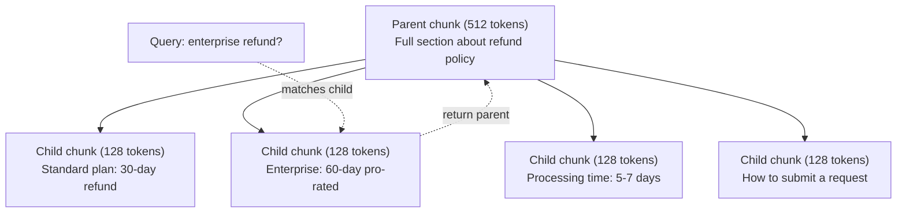
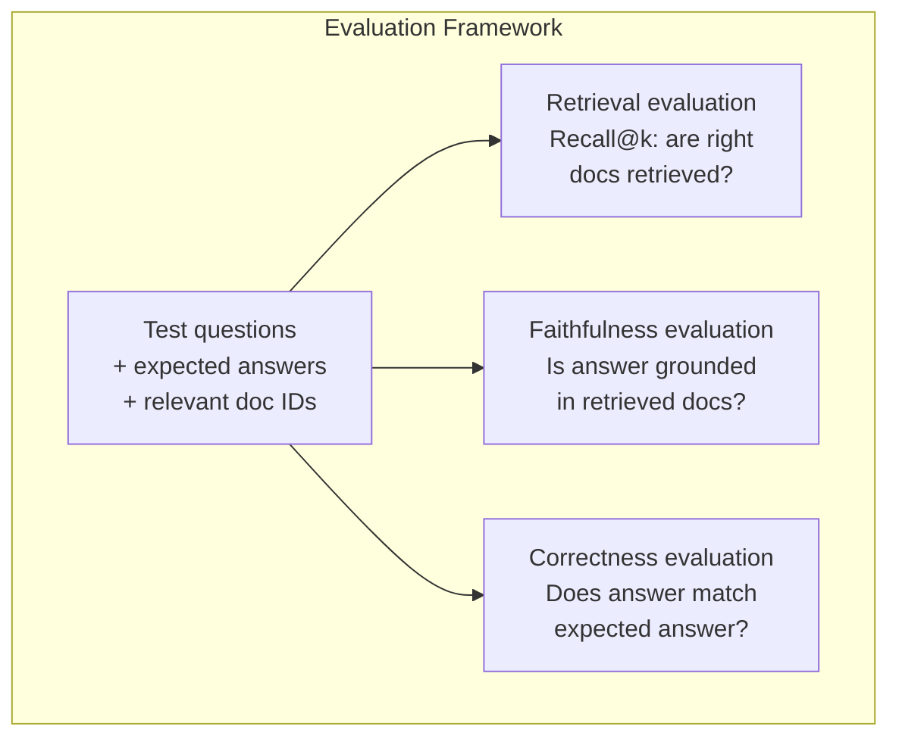

# RAG avanzado (Cumplimiento, Rango, búsqueda híbrida)  Grado alto RAG:分块、重排和混合搜索

> RAG básico recupera los trozos más similares. Eso funciona para preguntas simples. Se desmorona para el razonamiento multi-hop, consultas ambigüas y corpora grandes. RAG avanzado es la diferencia entre una demostración que funciona en 10 documentos y un sistema que funciona en 10 millones.

> **【中文解读】**基础RAG 检索 top-k 相似块, adecuado para preguntas simples, pero en muchos saltos de la idea, la diferencia de la pregunta y el lenguaje de gran escala se pierde en efecto.

> **【拓展：高级RAG→金融场景】**金融研报分析需要多跳推理 (跨文档关联数据),混合搜索 (混合搜索) (también conocido como 金融研报分析) puede aumentar significativamente la tasa de precisión de los datos de los informes financieros.

> ¿ Qué es esto ?**【前置】**学本节前请先掌握:Fase 11·06(RAG) 理解基础RAG 流程──本节是其进阶,假设你已经能写出 chunk→embed→retrieve→prompt→generate 的最小可用RAG──会用 `chromadb`¿Qué es esto?`rank_bm25`¿Qué es esto?`sentence-transformers`O `cohere`Rencontre de la API.

**Type:** Build | **类型:** 构建
**Languages:** Python | **语言:** Python
**Prerequisites:** Phase 11, Lesson 06 (RAG) | **前置知识:** Phase 11 · 06 (RAG)
**Time:** ~90 minutes | **时间:** ~90 分钟
**Related:**La fase 5 · 23 (Estrategias de descomposición para RAG) cubre los seis algoritmos de descomposición  recursiva, semántica, oración, documento parental, descomposición tardía, recuperación contextual  con puntos de referencia Vectara/antrópicos. Esta lección se basa en la parte superior: búsqueda híbrida, re-ranqueo, transformación de consultas.**相关:**Fase 5 · 23(RAG 分块策略) cubre todas las seis clases de algoritmos de segmentos 递归、语义、句子、父文档、晚分块、上下文检索含VECTARA/Antropic基准──本课在其构建:混合搜索、重排、查询转换──

## Objetivos de aprendizaje

- Implementar estrategias avanzadas de fragmentación (semántica, recursiva, padre-hijo) que preserven la estructura y el contexto del documento
  实现 retener el archivo estructuras y estrategias de alto nivel de la siguiente
- Construir una tubería de búsqueda híbrida que combine la combinación de palabras clave BM25 con búsqueda semántica vectorial y un reencoder cross-ranker
  Construir un conjunto de BM25 关键词匹配、语义向量搜索和交叉编码器重排器的混合搜索管线
- Aplicar técnicas de transformación de consultas (HyDE, multi-query, step-back) para mejorar la recuperación de preguntas ambiguas o complejas
  应用查询转换技术(HyDE、多查询、step-back) mejora de la búsqueda de problemas confusos o complejos
- Diagnóstico y reparación de fallas comunes de RAG: se recuperó un pedazo equivocado, respuesta no en contexto, desglose de razonamiento multi-hop
   diagnóstico y reparación  RAG  fracaso:检索错误块、答案不上下文中、多跳推理崩

> **【中文解读】**El objetivo de este curso es: dominar la técnica de RAG  consulta reescribir, mezclar, reordenar, adaptarse a la consulta, hacer más comentarios.

> ¿ Qué es esto ?**【类比】**基础 RAG 像新手图书管理员你说"营收",他按字面找带"营收"的书──高级RAG 像资深管理员:(1) **Query 改写** dices "营收", él traduce en "上一季度财报中的收入数字"再找;**混合搜索**既翻主题目录 (语义) 再翻关键词索引 (BM25),两边结果合并;(3) **重排** Recollecer 100 libros,仔细看每本摘要排序挑出最相关的 5 本(cross-encoder)

> ️ **【易错点】**3 个坑: ((1) **HyDE 用错场景**HyDE(Que el LLM pre-genera hipótesis respuesta reutilice respuesta investigación) en la investigación de hechos en reversa de la investigación errónea; sólo para el problema de apertura es válido―(2) **重排模型选错** Usando bi-encoder cuando el reencoder cross-encoderer(como BGE-M3 auto重排自己), no se logró una verdadera precisión de la codificación cross-enriquecedora; con un BGE-recorder-v2、Cohere Reranker especial―(3) **混合搜索没归一化**BM25 分数 0-30,向量相似度 0-1, directa相加向量永远被淹没; con fusión de rango recíproco (RRF) o min-max 归一化──

> ¿ Qué es esto ?**【困惑】**P: ¿Hay que hacer o hacer una búsqueda? A: 检索. Let the model be prompt 里推理, per jump search once, put the upper one jump result as the next jump query input. Por ejemplo: "¿cuál es el mayor número de resultados de un equipo?"


## El problema es la introducción del problema

Construiste una tubería básica de RAG en la Lección 06. Funciona para preguntas sencillas en un corpus pequeño.

> Usted en la sección 06                                                                                                                                                                                                                                                                                                                                                                                                                                                                                                                         

**Ambiguous query**En la búsqueda semántica se encuentran fragmentos sobre la estrategia de ingresos, las proyecciones de ingresos y los pensamientos del director financiero sobre el crecimiento de los ingresos.$47.2M in Q3 2025" but uses the word "earnings" instead of "revenue." The embedding model thinks "revenue strategy" is closer to the query than "Q3 earnings were $47,2M".

> **模糊查询**:"¿Cuánto fue el ingreso en el último trimestre?" Se busca en el sentido de que el ingreso de la empresa se ha convertido en un segmento similar a la estrategia de ingreso, la previsión de ingresos y el CFO en el sentido de que el ingreso ha crecido, pero no contiene un número real.

**Multi-hop question**En el caso de los equipos de trabajo, el resultado de la evaluación de la satisfacción de los clientes es el siguiente: "¿Qué equipo mejoró más en su calificación de satisfacción de los clientes?" Esto requiere encontrar las calificaciones de satisfacción de cada equipo, compararlas e identificar el máximo.

> **多跳问题**:"¿Qué equipo tiene la mejor calificación de satisfacción de clientes?" Esto necesita encontrar la calificación de satisfacción de cada equipo, compararlos, y identificar el valor máximo.

**Large corpus problem**Tienes 2 millones de trozos. La respuesta correcta es en el trozo #1,847,293. Tu búsqueda de los primeros 5 tira los trozos #14, #89,201, #1,200,000, #44, y #901,333. Casi en el espacio de incorporación, pero ninguno contiene la respuesta. En esta escala, la búsqueda aproximada de vecino más cercano introduce suficiente error que los resultados relevantes se empujan fuera de la parte superior k.

> **大型语料库问题**: tienes 2 millones de fragmentos. En la sección 1,847,293 de la sección 1,847,293 de la sección 2, tu top 5 ha extraído otros fragmentos. En esta escala, la búsqueda de cerca de los vecinos ha introducido suficientes errores.

RAG básico falla porque la similitud vectorial no es lo mismo que la relevancia. Un fragmento puede ser semánticamente similar a una consulta sin ser útil para responderla. Advanced RAG aborda esto con cuatro técnicas: búsqueda híbrida (agrega coincidencia de palabras clave), re-ranqueo (pone candidatos con más cuidado), transformación de consultas (correce la consulta antes de buscar) y mejor fragmentación (recuperar en la granularidad correcta).

> 基础RAG 失败是因为向量相似度不等于相关性──高级RAG 用四种技术解决:混合搜索(添加关键词匹配)、重排序(更仔细评分候选人)、查询转换(搜索前修复查询) 和更好的分块(以正确的粒度检查)──

## El concepto central.

> **【中文解读】**Alta Clasificación RAG 技术解决基础 RAG 局限性:查询重写将模糊问题转为精确查询) 混合检索(向量 + 关键词) 重排序(Utilizando un cross-encoder 精排) 自适应检索(juzgar si se necesita un examen) 多跳推理(分解复杂问题为多次检索) △

> **【拓展：高级 RAG 的工业应用】**Los sistemas RAG de nivel de producción suelen incluir: consulta intentuo分类 hasta consulta expansión/reescribir hasta investigación mixta(BM25 + 向量) hasta Cross-encoder 重排序到上下文压缩到答案生成 + 引用标注。Noción AI、Perplexity 等等产品都使用高级RAG技术──Self-RAG 让模型自己决定何时检索──


### Busca híbrida: Semántica + Palabra clave

La búsqueda semántica (similaridad vectorial) es buena para entender el significado. "¿Cómo cancelar mi suscripción?" coincide con "Pasos para cancelar tu plan" aunque no comparten palabras. Pero se pierde coincidencias exactas. "Código de error E-4021" puede no coincidir con una pieza que contiene "E-4021" si el modelo de incorporación lo trata como ruido.

> 语义搜索(向量相似度)擅长理解含义──"cómo eliminar suscripciones?"匹配"终止计划的步骤"尽管不共享单词──但它错过精确匹配──"错误码 E-4021"可能不匹配包含"E-4021"的块,如果嵌入模型将视为噪音──

La búsqueda de palabras clave (BM25) es lo contrario. Excelente en coincidencias exactas. "E-4021" coincide perfectamente. Pero "cancelar mi suscripción" devuelve resultados cero si el documento dice "terminar su plan".

> 关键词搜索(BM25)相反──它擅长精确匹配──"E-4021"完美匹配──"但是"取消我的订阅"如果文档说"终止你的计划"则返回零结果──

La búsqueda híbrida ejecuta ambas, luego fusiona los resultados.

> 混合搜索同时运行两者,然后合并结果──

**BM25**(Best Matching 25) es el algoritmo estándar de búsqueda de palabras clave. Ha sido la columna vertebral de los motores de búsqueda desde la década de 1990.

> **BM25**(Best Matching 25) es el estándar clave de algoritmos de búsqueda. Desde los años 90 se ha creado el pilar de un motor de búsqueda.

```
BM25(q, d) = sum over terms t in q:
    IDF(t) * (tf(t,d) * (k1 + 1)) / (tf(t,d) + k1 * (1 - b + b * |d| / avgdl))
```

Donde tf(t,d) es la frecuencia térmica de t en el documento d, IDF(t) es la frecuencia inversa del documento, \ \ \ \ \ \ \ \ \ \ \ \ \ \ \ \ \ \ \ \ \ \ \ \ \ \ \ \ \ \ \ \ \ \ \ \ \ \ \ \ \ \ \ \ \ \ \ \ \ \ \ \ \ \ \ \ \ \ \ \ \ \ \ \ \ \ \ \ \ \ \ \ \ \ \ \ \ \ \ \ \ \ \ \ \ \ \ \ \ \ \ \ \ \ \ \ \ \ \ \ \ \ \ \ \ \ \ \ \ \ \ \ \ \ \ \ \ \ \ \ \ \ \ \ \ \ \ \ \ \ \ \ \ \ \ \ \ \ \ \ \ \ \ \ \ \ \ \ \ \ \ \ \ \ \ \ \ \ \ \ \ \ \ \ \ \ \ \ \ \ \ \ \ \ \ \ \ \ \ \ \ \ \ \ \ \ \ \ \ \ \ \ \ \ \ \ \ \ \ \ \ \ \ \ \ \ \ \ \ \ \ \ \ \ \ \ \ \ \ \ \ \ \ \ \ \ \ \ \ \ \ \ \ \ \ \ \ \ \ \ \ \ \ \ \ \ \ \ \ \ \ \ \ \ \ \ \ \ \ \ \ \ \ \ \ \ \ \ \ \ \ \ \ \ \ \ \ \ \ \ \ \ \ \ \ \ \ \ \ \ \ \ \ \ \ \ \ \ \ \ \ \ \ \ \ \ \ \ \ \ \ \ \ \ \ \ \ \ \ \ \ \ \ \ \ \ \ \ \ \ \ \ \ \ \ \ \ \ \ \ \ \ \ \ \ \ \ \ \ \ \ \ \ \ \ \ \ \ \ \ \ \ \ \ \ \ \ \ \ \ \ \ \ \ \ \ \ \ \ \ \ \ \ \ \ \ \ \ \ \ \ \ \ \ \ \ \ \ \ \ \ \ \ \ \ \ \ \ \ \ \ \ \ \ \ \ \ \ \ \ \ \ \ \ \ \ \ \ \ \ \ \ \ \ \ \ \ \ \ \ \ \ \ \ \ \ \ \ \ \ \ \ \ \ \ \ \ \ \ \ \ \ \ \ \ \ \ \ \ \ \ \ \ \ \ \ \

> Entre ellos, tf(t,d) es t, d) es t, d) es contrario a la frecuencia de los documentos, d) es la longitud media de los documentos, k1 控制词频和(默认 1.2), b) es la longitud de los documentos, y b) es la longitud media de los documentos.

En términos simples: BM25 califica más alto a los documentos cuando contienen términos de consulta (especialmente los raros), pero con rendimientos decrecientes para términos repetidos.

> 简而言之:BM25 给含询词 (especialmente rar有词) 文档更高分, pero重复词有递减收益──含"revenue"50 veces 文档不仅含一次的50倍相关──

### Fusión recíproca de rango (RRF)

Hay dos listas clasificadas: una de búsqueda vectorial, otra de BM25. ¿Cómo se combinan?

> Usted tiene dos categorías: uno de búsqueda de velocidad, uno de BM25... ¿cómo combinarlas?

```
RRF_score(d) = sum over rankings R:
    1 / (k + rank_R(d))
```

Donde k es una constante (típicamente 60) que impide que el resultado de primer rango domine.

> Entre ellos k es el número habitual (normalmente 60), para evitar que el resultado de la clasificación sea el primero.

Un documento clasificado #1 en búsqueda vectorial y #5 en BM25 obtiene: 1/(60+1) + 1/(60+5) = 0.0164 + 0.0154 = 0.0318

Un documento clasificado #3 en búsqueda vectorial y #2 en BM25 obtiene: 1/(60+3) + 1/(60+2) = 0.0159 + 0.0161 = 0.0320

> En el grupo de búsquedas de la población en el sector de la información, el número de personas que han recibido la información se encuentra en el grupo de personas que han recibido la información.

RRF equilibra naturalmente las dos señales. Un documento que ocupa un puesto alto en ambas listas obtiene la mejor puntuación. Un documento que ocupa el puesto #1 en una lista pero está ausente de la otra obtiene una puntuación moderada. Esto es robusto porque utiliza rangos, no puntuaciones crudas, por lo que las diferencias en la distribución de puntuaciones entre los dos sistemas no importan.

> RRF balance natural dos señales. En una lista se clasifica primero pero en otra lista se pierde un número de puntos mediano. Esto es muy estable, ya que se utiliza para clasificar y no para clasificar, por lo que la distribución de los dos sistemas no es importante.

### Reincorporación

La recuperación (ya sea vector, palabra clave o híbrido) es rápida pero imprecisa. Utiliza bi-encoders: la consulta y cada documento se incorporan de forma independiente, luego se comparan.

> 检索(无论向量、关键词还是混合)快但不精确──它使用双编码器:查询和每个文档独立嵌入,然后比较──嵌入计算一次并缓存──这可扩展到百万文档──

El ranking utiliza codificadores cruzados: la consulta y un documento candidato se alimentan juntos en un modelo que produce una puntuación de relevancia. El modelo ve ambos textos simultáneamente y puede capturar interacciones de granos finos entre ellos. Un codificador cruzado puede entender que "¿Cuáles fueron los ingresos del tercer trimestre?" es altamente relevante para un trozo que contiene "$47.2 millones en el tercer trimestre", incluso si un bi-encoder no logró la conexión.

> Corazón de código de intercambio: entre los archivos de consulta y candidato, introduzca un modelo de porcentaje de correlación de salida. El modelo puede ver simultáneamente dos fragmentos de texto, captando la gran interrelación entre ellos. El código de intercambio puede entender "cuánto ganancias de Q3?" y el bloque de contenido de "Q3 es de 4720 millones de dólares", incluso si el código de intercambio ha pasado por esta conexión.

El cambio: los codificadores cruzados son 100-1000 veces más lentos que los bi-encodadores porque procesan el par de documentos de consulta conjuntamente. No se pueden calcular previamente los puntajes de codificadores cruzados para un millón de documentos. La solución: recuperar un conjunto de candidatos más grande (top-50 de búsqueda híbrida), luego volver a clasificar con un codificador cruzado para obtener el top-5 final.

> 权衡:交叉编码器比双编码器慢100-1000倍,因为它联合处理查询-文档对──你无法为百万文档预计算交叉编码器分数──解决方案:检索更大候选集(混合搜索 top-50), luego utiliza el交叉编码器重排 para obtener el último top-5──


Modelos comunes de re-ranqueamiento (2026 lineup):

> 常见重排模型(2026 年阵容):

- Cohere Rerank 3.5: API gestionada, multilingüe, mejor ganancia de recuerdo en corpora mixtas
  托管 API、多语言、混合语料 最大召回增益
- Re-ranqueo de viaje-2.5: API administrada, menor latencia de las opciones alojadas
  托管 API、托管选项中最小延迟
- Jina-Reranker-v2 Multilingüe: peso abierto, más de 100 idiomas
  开源权重、100+ 语言
- bge-re-ranquer-v2-m3: peso abierto, línea de base fuerte
  开源权重、强基线
- código cruzado/ms-marco-MiniLM-L-6-v2: peso abierto, se ejecuta con CPU para la creación de prototipos
  Open Source Power ∞ puede funcionar en la CPU
- ColBERTv2 / Jina-ColBERT-v2: retrasos de interacción re-ranqueadores multi-vector  O(tokens) no O(docs) en el momento de marcar
  后期交互多向量重排器评分时 O(tokens) y no O(docs)

### Transformación de la consulta

A veces el problema no es la recuperación sino la consulta misma. "¿Qué fue eso del nuevo cambio de política?" es una terrible consulta de búsqueda. No contiene términos específicos. La incorporación es vaga. Ningún sistema de recuperación puede encontrar los documentos correctos de esto.

> Algunas veces el problema no es la búsqueda sino en la búsqueda en sí misma. "¿Qué es eso de la nueva política?" es una mala búsqueda.

**Query rewriting**El LLM puede hacer esto:

> **查询重写**Se puede hacer esto:

```
User: "What was that thing about the new policy change?"
Rewritten: "Recent policy changes and updates"
```

**HyDE (Hypothetical Document Embeddings)**En lugar de buscar con la consulta, generar una respuesta hipotética, incrustar eso, y buscar documentos reales similares.

> **HyDE（假设文档嵌入）**No es necesario buscar en la búsqueda, sino generar una hipótesis, incrustarla, buscar archivos reales similares.

```
Query: "What is the refund policy for enterprise?"
Hypothetical answer: "Enterprise customers are eligible for a full refund
within 60 days of purchase. Refunds are pro-rated based on the remaining
subscription period and processed within 5-7 business days."
```

Embed la respuesta hipotética y búsqueda de documentos reales similares a ella. La intuición: la respuesta hipotética vive más cerca en el espacio de incorporación de la respuesta real que la pregunta original. Las preguntas y respuestas tienen diferentes estructuras lingüísticas. Al generar una respuesta hipotética, se rompe la brecha entre el "espacio de pregunta" y el "espacio de respuesta" en la incorporación.

> 嵌入假设答案并搜索与它相似的真实文档――直觉: la respuesta de la hipótesis se encuentra más cerca de la respuesta real que el problema original en el espacio de la inserción―― los problemas y las respuestas tienen una estructura lingüística diferente― a través de la generación de la respuesta de la hipótesis, se puede superar la diferencia entre el "espacio de los problemas" y el "espacio de las respuestas" en la inserción―

HyDE agrega una llamada LLM antes de la recuperación. Esto aumenta la latencia en 500-2000ms. Vale la pena cuando la calidad de la recuperación es pobre en las consultas crudas.

> HyDE en la búsqueda anterior añadió una vez LLM 调用── esto aumentó 500-2000ms 延迟── original en la búsqueda de calidad diferencias 时值──

### Los padres y los hijos se deshacen

El desmonte estándar obliga a un trade-off: pequeños trozos para una recuperación precisa, grandes trozos para un contexto suficiente.

> 标准分块强制权衡:小块精确检索,大块足够上下文──父子分块消除这个权衡──

Indice pequeños trozos (128 tokens) para la recuperación. Cuando se recupera un pequeño trozo, devuelve su trozo principal (512 tokens) para el prompt. El pequeño trozo coincide con la consulta con precisión. El trozo principal proporciona suficiente contexto para que el LLM genere una buena respuesta.

> 索引小块(128 token) para la revisión. 检索到小块时,返回其父块. 索引小块.



La consulta "reembolso de la empresa?" coincide con la parte menor C2 con precisión. Pero el prompt recibe la parte principal completa P, que incluye el contexto circundante sobre el tiempo de procesamiento y el proceso de presentación.

> 查询"reembolso de la empresa?" exacto corresponde a la parte C2¬¬¬¬¬¬¬¬¬¬¬¬¬¬¬¬¬¬¬¬¬¬¬¬¬¬¬¬¬¬¬¬¬¬¬¬¬¬¬¬¬¬¬¬¬¬¬¬¬¬¬¬¬¬¬¬¬¬¬¬¬¬¬¬¬¬¬¬¬¬¬¬¬¬¬¬¬¬¬¬¬¬¬¬¬¬¬¬¬¬¬¬¬¬¬¬¬¬¬¬¬¬¬¬¬¬¬¬¬¬¬¬¬¬¬¬¬¬¬¬¬¬¬¬¬¬¬¬¬¬¬¬¬¬¬¬¬¬¬¬¬¬¬¬¬¬¬¬¬¬¬¬¬¬¬¬¬¬¬¬¬¬¬¬¬¬¬¬¬¬¬¬¬¬¬¬¬¬¬¬¬¬¬¬¬¬¬¬¬¬¬¬¬¬¬¬¬¬¬¬¬¬¬¬¬¬¬¬¬¬¬¬¬¬¬¬¬¬¬¬¬¬¬¬¬¬¬¬¬¬¬¬¬¬¬¬¬¬¬¬¬¬¬¬¬¬¬¬¬¬¬¬¬¬¬¬¬¬¬¬¬¬¬¬¬¬¬¬¬¬¬¬¬¬¬¬¬¬¬¬¬¬¬¬¬¬¬¬¬¬¬¬¬¬¬¬¬¬¬¬¬¬¬¬¬¬¬¬¬¬¬¬¬¬¬¬¬¬¬¬¬¬¬¬¬¬¬¬¬¬¬¬¬¬¬¬¬¬¬¬¬¬¬¬¬¬¬¬¬¬¬¬¬¬¬¬¬¬¬¬¬¬¬¬¬¬¬¬¬¬¬¬¬¬¬¬¬¬¬¬¬¬¬¬¬¬¬¬¬¬¬¬¬¬¬¬¬¬¬¬¬¬¬¬¬¬¬¬¬¬¬¬¬¬¬¬¬¬¬¬¬¬¬¬¬¬¬¬¬¬¬¬¬¬¬¬¬¬¬¬¬¬¬¬¬¬¬¬¬¬¬¬¬¬¬¬¬¬¬¬¬¬¬¬¬¬¬¬¬¬¬¬¬¬¬¬¬¬¬¬¬¬¬¬¬¬¬¬¬

### Filtración de metadatos

Antes de ejecutar una búsqueda vectorial, filtre el corpus por metadatos: fecha, fuente, categoría, autor, idioma. Esto reduce el espacio de búsqueda y evita resultados irrelevantes.

> En la búsqueda de datos en el mercado, el número de usuarios de la red se reduce a un número de usuarios de la red.

"Qué cambió en la política de seguridad el mes pasado?" sólo debe buscar documentos de los últimos 30 días en la categoría de seguridad. Sin filtrar metadatos, buscas todo el corpus y puedes recuperar un documento de seguridad de 2 años que resulta semánticamente similar.

> "¿Qué ha cambiado la estrategia de seguridad del pasado mes?" sólo debe buscarse en los últimos 30 días de seguridad de las categorías de archivos.

Los sistemas RAG de producción almacenan metadatos junto a cada pieza: documento fuente, fecha de creación, categoría, autor, versión.

> Produce RAG  sistemas almacenan datos de cada bloque junto a los bloques: fuente de documentos, creación de fecha, categorías, autores, versiones, etc.

### Evaluación

¿Cómo sabes si funciona?

> ¿Has construido un sistema RAG? ¿Cómo sabes que funciona?

**Retrieval relevance (Recall@k)**¿Cuál es el porcentaje de documentos relevantes que aparecen en los resultados de la sección 47?

> **检索相关性（Recall@k）**¿Cuál es el porcentaje de preguntas de prueba que aparecen en los resultados de los archivos relacionados con el grupo de archivos conocidos? ¿Si una pregunta se encuentra en el 47o bloque, el 47o bloque aparece en el 5o?

**Faithfulness**Si los fragmentos recuperados dicen "ventana de reembolso de 60 días" y el modelo dice "ventana de reembolso de 90 días", eso es un fallo de fidelidad.

> **忠实度**Si el bloque de registro dice "60 días de retorno" y el modelo dice "90 días de retorno", entonces la fidelidad ha fracasado.

**Answer correctness**La respuesta generada coincide con la respuesta esperada.

> **答案正确性**¿Es que la respuesta generada coincide con la respuesta esperada? es un indicador de extremo a extremo.

Una simple verificación de fidelidad: tomar cada afirmación en la respuesta generada y verificar que aparece (en sustancia) en los trozos recuperados.

> 简单忠实检查:取生成答案中的每一个声明,验证它(实质上) aparece en el bloque de investigación. Si la respuesta contiene hechos que no están en ningún bloque de investigación, es muy probable que se vea.



## Construye y realiza.
```figure
agentic-rag-loop
```

## Construye el mismo

### Paso 1: Implementación de la BM25

```python
import math
from collections import Counter

class BM25:
    def __init__(self, k1=1.2, b=0.75):
        self.k1 = k1
        self.b = b
        self.docs = []
        self.doc_lengths = []
        self.avg_dl = 0
        self.doc_freqs = {}
        self.n_docs = 0

    def index(self, documents):
        self.docs = documents
        self.n_docs = len(documents)
        self.doc_lengths = []
        self.doc_freqs = {}

        for doc in documents:
            words = doc.lower().split()
            self.doc_lengths.append(len(words))
            unique_words = set(words)
            for word in unique_words:
                self.doc_freqs[word] = self.doc_freqs.get(word, 0) + 1

        self.avg_dl = sum(self.doc_lengths) / self.n_docs if self.n_docs else 1

    def score(self, query, doc_idx):
        query_words = query.lower().split()
        doc_words = self.docs[doc_idx].lower().split()
        doc_len = self.doc_lengths[doc_idx]
        word_counts = Counter(doc_words)
        score = 0.0

        for term in query_words:
            if term not in word_counts:
                continue
            tf = word_counts[term]
            df = self.doc_freqs.get(term, 0)
            idf = math.log((self.n_docs - df + 0.5) / (df + 0.5) + 1)
            numerator = tf * (self.k1 + 1)
            denominator = tf + self.k1 * (1 - self.b + self.b * doc_len / self.avg_dl)
            score += idf * numerator / denominator

        return score

    def search(self, query, top_k=10):
        scores = [(i, self.score(query, i)) for i in range(self.n_docs)]
        scores.sort(key=lambda x: x[1], reverse=True)
        return scores[:top_k]
```

### Paso 2: Fusión recíproca de rango

```python
def reciprocal_rank_fusion(ranked_lists, k=60):
    scores = {}
    for ranked_list in ranked_lists:
        for rank, (doc_id, _) in enumerate(ranked_list):
            if doc_id not in scores:
                scores[doc_id] = 0.0
            scores[doc_id] += 1.0 / (k + rank + 1)
    fused = sorted(scores.items(), key=lambda x: x[1], reverse=True)
    return fused
```

### Paso 3: Pipeline híbrida de búsqueda

```python
def hybrid_search(query, chunks, vector_embeddings, vocab, idf, bm25_index, top_k=5, fusion_k=60):
    query_emb = tfidf_embed(query, vocab, idf)
    vector_results = search(query_emb, vector_embeddings, top_k=top_k * 3)
    bm25_results = bm25_index.search(query, top_k=top_k * 3)
    fused = reciprocal_rank_fusion([vector_results, bm25_results], k=fusion_k)
    return fused[:top_k]
```

### Paso 4: Reencaminar fácilmente

En la producción, usaría un modelo de codificación cruzada. Aquí construimos un reranker que califica la relevancia de la consulta-documento utilizando superposición de palabras, importancia de términos y combinación de frases.

> En el proceso de producción, se utiliza un modelo de codificador de entrelazamiento. Aquí construimos un redirector de información de la información sobre la importancia de los términos y la correlación de los términos para evaluar la información de los archivos.

```python
def rerank(query, candidates, chunks):
    query_words = set(query.lower().split())
    stop_words = {"the", "a", "an", "is", "are", "was", "were", "what", "how",
                  "why", "when", "where", "do", "does", "for", "of", "in", "to",
                  "and", "or", "on", "at", "by", "it", "its", "this", "that",
                  "with", "from", "be", "has", "have", "had", "not", "but"}
    query_terms = query_words - stop_words

    scored = []
    for doc_id, initial_score in candidates:
        chunk = chunks[doc_id].lower()
        chunk_words = set(chunk.split())

        term_overlap = len(query_terms & chunk_words)

        query_bigrams = set()
        q_list = [w for w in query.lower().split() if w not in stop_words]
        for i in range(len(q_list) - 1):
            query_bigrams.add(q_list[i] + " " + q_list[i + 1])
        bigram_matches = sum(1 for bg in query_bigrams if bg in chunk)

        position_boost = 0
        for term in query_terms:
            pos = chunk.find(term)
            if pos != -1 and pos < len(chunk) // 3:
                position_boost += 0.5

        rerank_score = (
            term_overlap * 1.0
            + bigram_matches * 2.0
            + position_boost
            + initial_score * 5.0
        )
        scored.append((doc_id, rerank_score))

    scored.sort(key=lambda x: x[1], reverse=True)
    return scored
```

### Paso 5: HyDE (Inmoblidaciones de documentos hipotéticos)

```python
def hyde_generate_hypothesis(query):
    templates = {
        "what": "The answer to '{query}' is as follows: Based on our documentation, {topic} involves specific policies and procedures that define how the process works.",
        "how": "To address '{query}': The process involves several steps. First, you need to initiate the request. Then, the system processes it according to the defined rules.",
        "default": "Regarding '{query}': Our records indicate specific details and policies related to this topic that provide a comprehensive answer."
    }
    query_lower = query.lower()
    if query_lower.startswith("what"):
        template = templates["what"]
    elif query_lower.startswith("how"):
        template = templates["how"]
    else:
        template = templates["default"]

    topic_words = [w for w in query.lower().split()
                   if w not in {"what", "is", "the", "how", "do", "does", "a", "an",
                                "for", "of", "to", "in", "on", "at", "by", "and", "or"}]
    topic = " ".join(topic_words) if topic_words else "this topic"

    return template.format(query=query, topic=topic)


def hyde_search(query, chunks, vector_embeddings, vocab, idf, top_k=5):
    hypothesis = hyde_generate_hypothesis(query)
    hypothesis_emb = tfidf_embed(hypothesis, vocab, idf)
    results = search(hypothesis_emb, vector_embeddings, top_k)
    return results, hypothesis
```

### Paso 6: Parentes y hijos

```python
def create_parent_child_chunks(text, parent_size=200, child_size=50):
    words = text.split()
    parents = []
    children = []
    child_to_parent = {}

    parent_idx = 0
    start = 0
    while start < len(words):
        parent_end = min(start + parent_size, len(words))
        parent_text = " ".join(words[start:parent_end])
        parents.append(parent_text)

        child_start = start
        while child_start < parent_end:
            child_end = min(child_start + child_size, parent_end)
            child_text = " ".join(words[child_start:child_end])
            child_idx = len(children)
            children.append(child_text)
            child_to_parent[child_idx] = parent_idx
            child_start += child_size

        parent_idx += 1
        start += parent_size

    return parents, children, child_to_parent
```

### Paso 7: Evaluación de la fidelidad

```python
def evaluate_faithfulness(answer, retrieved_chunks):
    answer_sentences = [s.strip() for s in answer.split(".") if len(s.strip()) > 10]
    if not answer_sentences:
        return 1.0, []

    grounded = 0
    ungrounded = []
    context = " ".join(retrieved_chunks).lower()

    for sentence in answer_sentences:
        words = set(sentence.lower().split())
        stop_words = {"the", "a", "an", "is", "are", "was", "were", "and", "or",
                      "to", "of", "in", "for", "on", "at", "by", "it", "this", "that"}
        content_words = words - stop_words
        if not content_words:
            grounded += 1
            continue

        matched = sum(1 for w in content_words if w in context)
        ratio = matched / len(content_words) if content_words else 0

        if ratio >= 0.5:
            grounded += 1
        else:
            ungrounded.append(sentence)

    score = grounded / len(answer_sentences) if answer_sentences else 1.0
    return score, ungrounded


def evaluate_retrieval_recall(queries_with_relevant, retrieval_fn, k=5):
    total_recall = 0.0
    results = []

    for query, relevant_indices in queries_with_relevant:
        retrieved = retrieval_fn(query, k)
        retrieved_indices = set(idx for idx, _ in retrieved)
        relevant_set = set(relevant_indices)
        hits = len(retrieved_indices & relevant_set)
        recall = hits / len(relevant_set) if relevant_set else 1.0
        total_recall += recall
        results.append({
            "query": query,
            "recall": recall,
            "hits": hits,
            "total_relevant": len(relevant_set)
        })

    avg_recall = total_recall / len(queries_with_relevant) if queries_with_relevant else 0
    return avg_recall, results
```

## Usalo con el marco de ejecución

Con un verdadero codificador cruzado para el re-ranqueo:

> Usar el código de trabajo real:

```python
from sentence_transformers import CrossEncoder

reranker = CrossEncoder("cross-encoder/ms-marco-MiniLM-L-6-v2")

def rerank_with_cross_encoder(query, candidates, chunks, top_k=5):
    pairs = [(query, chunks[doc_id]) for doc_id, _ in candidates]
    scores = reranker.predict(pairs)
    scored = list(zip([doc_id for doc_id, _ in candidates], scores))
    scored.sort(key=lambda x: x[1], reverse=True)
    return scored[:top_k]
```

Con el re-ranqueador de Cohere:

> Usado en el equipo de gestión de la carga:

```python
import cohere

co = cohere.Client()

def rerank_with_cohere(query, candidates, chunks, top_k=5):
    docs = [chunks[doc_id] for doc_id, _ in candidates]
    response = co.rerank(
        model="rerank-english-v3.0",
        query=query,
        documents=docs,
        top_n=top_k
    )
    return [(candidates[r.index][0], r.relevance_score) for r in response.results]
```

Para HyDE con una verdadera LLM:

> ¿Qué es eso?

```python
import anthropic

client = anthropic.Anthropic()

def hyde_with_llm(query):
    response = client.messages.create(
        model="claude-sonnet-5",
        max_tokens=256,
        messages=[{
            "role": "user",
            "content": f"Write a short paragraph that would be a good answer to this question. Do not say you don't know. Just write what the answer would look like.\n\nQuestion: {query}"
        }]
    )
    return response.content[0].text
```

Para la búsqueda híbrida de producción con Weaviate:

> Usar Weaviate hacer producción mezclado búsqueda:

```python
import weaviate

client = weaviate.connect_to_local()

collection = client.collections.get("Documents")
response = collection.query.hybrid(
    query="enterprise refund policy",
    alpha=0.5,
    limit=10
)
```

El parámetro alfa controla el equilibrio: 0.0 = palabra clave pura (BM25), 1.0 = vector puro, 0.5 = peso igual.

> Alfa 参数控制平衡:0.0=纯关键词(BM25),1.0=纯向量,0.5=等权重──la mayoría de los sistemas de producción usan alfa entre 0.3 a 0.7 ∼──

## Envíe el producto .

Esta lección produce:
- `outputs/prompt-advanced-rag-debugger.md`-- una solicitud para diagnosticar y solucionar problemas de calidad de RAG
   diagnóstico y reparación RAG  sugerencias de problemas de calidad
- `outputs/skill-advanced-rag.md`-- una habilidad para construir RAG de producción con búsqueda híbrida y recalificación
  Construcción de habilidades de RAG de producción de búsqueda y clasificación mixta

## Los ejercicios.

1. Compare BM25 vs búsqueda vectorial vs búsqueda híbrida en los documentos de muestra. Para cada una de las 5 consultas de prueba, registre cuál enfoque devuelve la pieza más relevante en la posición #1.
   En el ejemplar en el archivo comparar BM25 vs 向量搜索 vs 混合搜索. En el ejemplar, en el ejemplar, comparar BM25 vs 向量搜索 vs 混合搜索. En el ejemplar, en el ejemplar, comparar BM25 vs 向量搜索 vs 混合搜索.

2. Implemente un filtro de metadatos. Añade un campo de "categoría" a cada documento (seguridad, facturación, API, producto). Antes de ejecutar la búsqueda vectorial, filtre los trozos solo a la categoría relevante. Prueba con "¿Qué cifrado se usa?" y verifique que solo busca los trozos de categoría de seguridad.
   实现元数据过器──给每个文档加"category"字段(seguridad、 facturación、api、producto)──运行向量搜索前,过块到相关类别──用"使用什么加密?"测试,验证它只搜索安全 类别块──

3. Construir una línea completa de HyDE utilizando la función generar simple de la lección 06. Comparar la calidad de recuperación (relevancia superior-3) entre la búsqueda de consultas directas y la búsqueda de HyDE en las 5 consultas de prueba. HyDE debe mejorar los resultados para consultas vagas.
   Construir una función de generación simple de la lección 06 completa HyDE 管线―― Compare direct query search y HyDE 搜索在 5 测试查询上的检查质量(top-3 相关性)──HyDE 应改进模糊查询的结果──

4. Implemente la estrategia de fragmentación padre-hijo en los documentos de muestra. Utilice child_size=30 y parent_size=100. Busque con los trozos de niños pero devuelva los trozos de padres en el aviso. Compara las respuestas generadas para el fragmentación estándar con chunk_size=50.
   En el archivo de ejemplos implementar la estrategia de parentesco en el que se utiliza el parentesco en la búsqueda de los parentescos en el parentesco.

5. Crear un conjunto de datos de evaluación: 10 preguntas con fragmentos de respuestas conocidos. Medir Recall@3, Recall@5, y Recall@10 para (a) solo la búsqueda vectorial, (b) solo BM25, (c) búsqueda híbrida, (d) híbrido + re-ranking. Trazar los resultados e identificar dónde re-ranking ayuda más.
   创建评估数据集:10 个带已知答案块问题──为 (a) 仅向量搜索、((b) 仅 BM25、((c) 混合搜索、((d) 混合 + 重排测量 Recall@3、Recall@5、Recall@10──绘制结果并识别重排在哪里帮助最大──

## Términos clave .

| Term | What people say | What it actually means | 中文释义 |
|------|----------------|----------------------|---------|
| BM25 | "Keyword search" | A probabilistic ranking algorithm that scores documents by term frequency, inverse document frequency, and document length normalization | BM25：按词频、逆文档频率和文档长度归一化给文档评分的概率排序算法 |
| Hybrid search | "Best of both worlds" | Running semantic (vector) and keyword (BM25) search in parallel, then merging results with rank fusion | 混合搜索：并行运行语义（向量）和关键词（BM25）搜索，然后用排名融合合并结果 |
| Reciprocal Rank Fusion | "Merge ranked lists" | Combining multiple ranked lists by summing 1/(k + rank) for each document across all lists | 倒数排名融合：通过对每个文档在所有列表中求和 1/(k + rank) 合并多个排序列表 |
| Reranking | "Second pass scoring" | Using a more expensive cross-encoder model to re-score a candidate set from initial retrieval | 重排：用更昂贵的交叉编码器模型对初始检索的候选集重新评分 |
| Cross-encoder | "Joint query-document model" | A model that takes a query and document as a single input, producing a relevance score; more accurate than bi-encoders but too slow for full corpus search | 交叉编码器：将查询和文档作为单一输入的模型，输出相关性分数；比双编码器精确但太慢无法全语料搜索 |
| Bi-encoder | "Independent embedding model" | A model that embeds queries and documents independently; fast because embeddings are precomputed, but less accurate than cross-encoders | 双编码器：独立嵌入查询和文档的模型；快因为嵌入预计算，但比交叉编码器精度低 |
| HyDE | "Search with a fake answer" | Generate a hypothetical answer to the query, embed it, and search for real documents similar to it | HyDE：生成查询的假设答案，嵌入它，搜索相似真实文档 |
| Parent-child chunking | "Small search, big context" | Index small chunks for precise retrieval but return the larger parent chunk to provide sufficient context | 父子分块：索引小块精确检索但返回较大父块提供足够上下文 |
| Metadata filtering | "Narrow before searching" | Filtering documents by attributes (date, source, category) before running vector search to reduce the search space | 元数据过滤：运行向量搜索前按属性（日期、来源、类别）过滤文档以缩小搜索空间 |
| Faithfulness | "Did it stay grounded" | Whether the generated answer is supported by the retrieved documents, as opposed to hallucinated from the model's training data | 忠实度：生成的答案是否被检索文档支持，而非从模型训练数据幻觉 |

## Más Leer más Leer más

- Robertson & Zaragoza, "El marco de relevancia probabilística: BM25 y más allá" (2009) - la referencia definitiva para BM25, explicando los fundamentos probabilísticos detrás de la fórmula
  Robertson & Zaragoza, "El marco de relevancia probabilística: BM25 y más allá" (WEB
- Cormack et al., "Fusión de rango recíproco supera a Condorcet y métodos de aprendizaje de rango individual" (2009) -- el documento original de RRF que muestra que supera a los métodos de fusión más complejos
  Cormack etc, "Fusión de rango recíproco..." (2009) RRF original论文, mostrar que vence más complejo método de fusión
- Gao et al., "Creciso de recuperación densa de cero disparos sin etiquetas de relevancia" (2022) -- el documento de HyDE que demuestra que las incorporaciones de documentos hipotéticas mejoran la recuperación sin ningún dato de capacitación
  Gao 等, "Precise Zero-Shot Dense Retrieval"...(2022) HyDE 论文,展示假设文档嵌入无需训练数据即可改进检索
- Nogueira & Cho, "Re-ranking de pasaje con BERT" (2019) -- mostró que el re-ranking de codificador cruzado en la parte superior de BM25 mejora significativamente la calidad de recuperación
  Nogueira & Cho, "Passage Re-ranking with BERT" (Ranqueamiento del pasaje con BERT)  2019  muestra en BM25 之上的交叉编码器重排
- [Khattab et al., "DSPy: Compiling Declarative Language Model Calls into Self-Improving Pipelines" (2023)](https://arxiv.org/abs/2310.03714)-- trata la construcción rápida y la selección de peso como un problema de optimización sobre las tuberías de recuperación; lea esto para "programas LLM" en lugar de "LLM rápidos".
  Khattab 等, "DSPy" (en inglés) 
- [Edge et al., "From Local to Global: A Graph RAG Approach to Query-Focused Summarization" (Microsoft Research 2024)](https://arxiv.org/abs/2404.16130)-- Papel de GraphRAG: extracción de relaciones entre entidades + detección de la comunidad de Leiden para resumen centrado en la consulta; la distinción entre recuperación global y local.
  Edge等, "De local a global: un enfoque RAG gráfico..."(Microsoft Research 2024) GraphRAG 论文:实体关系抽取 + Leiden 社区检测用于查询聚焦摘摘;全局 vs 局部检索的区别──
- [Asai et al., "Self-RAG: Learning to Retrieve, Generate, and Critique through Self-Reflection" (ICLR 2024)](https://arxiv.org/abs/2310.11511)-- autoevaluación de RAG con tokens de reflexión; la frontera agencial pasado de recuperación estática-entonces-generación.
  Asai 等, "Self-RAG" ((ICLR 2024) 带反思代币 的自评RAG;静态先检索后生成之外的智能体前沿──
- [LangChain Query Construction blog](https://blog.langchain.dev/query-construction/)-- cómo traducir consultas de lenguaje natural en consultas de base de datos estructuradas (Text-to-SQL, Cypher) como un paso previo a la recuperación.
  LangChain 查询构建博客如何将自然语言查询翻译为结构化数据库查询(Text-to-SQL、Cypher) como un paso de pre-check.
