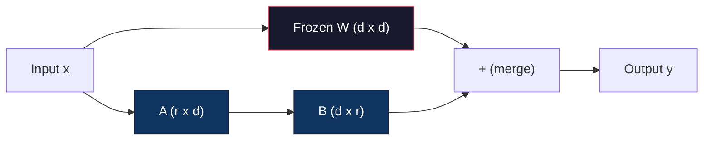
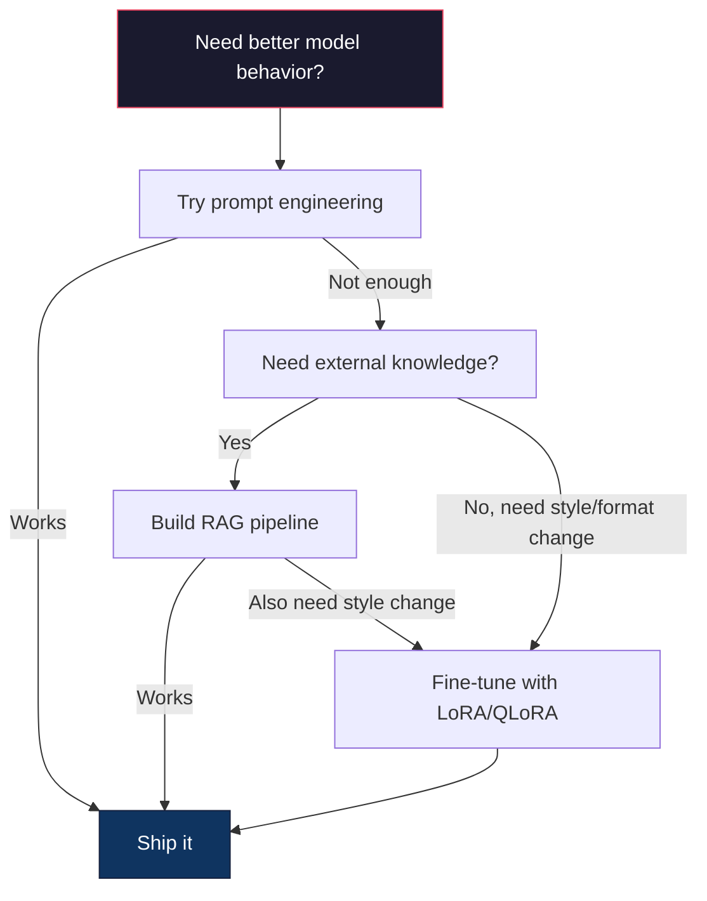

# La combinación de loura y loura se hace bien.

> El ajuste fino completo de un modelo 7B requiere 56 GB de VRAM. Usted no tiene eso. Ni la mayoría de las empresas. LoRA le permite ajustar el mismo modelo en 6 GB entrenando menos del 1% de los parámetros. Esto no es un compromiso - coincide con la calidad de ajuste fino completo en la mayoría de las tareas. Todo el ecosistema de ajuste fino de código abierto se ejecuta con este truco.

> **【中文解读】**El modelo de 7B necesita 56 GB de almacenamiento. LoRA sólo se entraña con un parámetro de menos del 1%. 6 GB de almacenamiento es posible realizar la reducción, y la calidad no pierde la reducción total. Todo el sistema de micro-alimentos abierto se basa en esta tecnología.

> **【拓展：LoRA微调→定制大模型】**LoRA es la tecnología central del modelo de gran medida de la empresa: con una pequeña cantidad de modelos de base de datos en el área, obtener capacidad especializada (como análisis financiero, teorías legales, generación de códigos, etc.)

> ¿ Qué es esto ?**【前置】**学本节前请先掌握:(1) Fase 10·06(Instrucción de sintonización SFT)  comprensión de la supervisión de los procesos básicos;(2) 线性代数基础矩阵乘法、秩、SVD 分解(看 Fase 01·11 SVD);(3) PyTorch 基础`nn.Linear`¿Qué es esto?`backward()`¿Qué es esto?`optimizer.step()`¡ ¡ ¡ 4 ! ¡ Acogida del rostro !`transformers`La ley básica de la biblioteca.`peft`Y `trl`¿Qué es esto?

**Type:** Build | **类型:** 构建
**Languages:** Python | **语言:** Python
**Prerequisites:** Phase 10, Lesson 06 (Instruction Tuning / SFT) | **前置知识:** Phase 10 · 06（指令微调/SFT）
**Time:** ~75 minutes | **时间:** ~75 分钟
**Related:**La fase 10 cubre los bucles SFT/DPO desde cero. Esta lección conecta esos en los kits de herramientas PEFT 2026 (PEFT, TRL, Unsloth, Axolotl, LLaMA-Factory).**相关:**La fase 10 de la fase de desarrollo de la tecnología de la información (SFT/DPO) se desarrollará en el año 2026 en la fábrica de la tecnología de la información (PEFT, TRL, Unsloth, Axolotl, LLaMA).

## Objetivos de aprendizaje

- Implementar LoRA mediante la inyección de matrices de adaptadores de bajo rango (A y B) en las capas de atención de un modelo preentrenado
  通过向预训模型的注意层注入低秩适配矩阵(A 和 B) lograr LoRA
- Calcular los ahorros de parámetros de LoRA vs. ajuste fino completo: r r con dimensiones de d_modelo trenes 2*r*d parámetros en lugar de d^2
  计算 LoRA vs 全量微调的参数节省:秩 r 配 d_model 维度训练 2*r*d 参数而不是 d^2
- Ajustar un modelo utilizando QLoRA (4 bits de base cuantizada + adaptadores LoRA) para que encaje en la memoria de la GPU del consumidor
  Usar QLoRA(4 bits 量化基础模型 + LoRA 适配器)
- Combinar los pesos de LoRA de nuevo en el modelo base para el despliegue y comparar la velocidad de inferencia con y sin adaptadores
  La velocidad de cálculo de los adaptadores de la base de los modelos de carga y carga de carga para la implementación y comparación

> **【中文解读】**Este curso tiene como objetivo: utilizar LoRA/QLoRA para realizar los parámetros de alta eficiencia en la reducción de los niveles de reducción de los parámetros de los niveles de los parámetros de los niveles de los parámetros de los parámetros de los parámetros de los parámetros de los parámetros de los parámetros de los parámetros de los parámetros de los parámetros de los parámetros de los parámetros de los parámetros de los parámetros de los parámetros de los parámetros de los parámetros de los parámetros de los parámetros de los parámetros de los parámetros de los parámetros de los parámetros de los parámetros de los parámetros de los parámetros de los parámetros de los parámetros de los parámetros de los parámetros de los parámetros de los parámetros de los parámetros de los parámetros de los parámetros de los parámetros de los parámetros de los parámetros de los parámetros de los parámetros de los parámetros de los parámetros de los parámetros de los parámetros de los parámetros de los parámetros de los parámetros de los parámetros de los parámetros de los parámetros de los parámetros de los parámetros de los parámetros.


## El problema es la introducción del problema

Tienes un modelo base. Llama 3 8B. Quieres que responda a los boletos de soporte al cliente en la voz de tu empresa. SFT es la respuesta. Pero SFT tiene un problema de costo.

> Tienes un modelo básico. Llama 3 8B. Tú quieres que lo utilice en el lenguaje de tu empresa.

El ajuste fino completo actualiza todos los parámetros del modelo. Llama 3 8B tiene 8 mil millones de parámetros. En fp16, cada parámetro toma 2 bytes. Eso es 16 GB solo para cargar los pesos. Durante el entrenamiento, también necesitas gradientes (16 GB), estados de optimización para Adam (32 GB para impulso + variación) y activaciones. Total: aproximadamente 56 GB de VRAM para un solo modelo 8B.

> Todos los parámetros en el modelo de actualización. Cada parámetro en el modelo de actualización. Llama 3 8B tiene 80 mil millones de parámetros. Fp16.

Un A100 de 80 GB apenas puede caber en esto.$3-4/hour on cloud providers. Training for 3 epochs on 50,000 examples takes 6-10 hours. That's $30-40 por experimento. ejecutar 10 experimentos para obtener los hiperparámetros correctos y usted ha gastado $400 antes de desplegar algo.

> Un A100 de 80 GB 勉强能装下──两张 A100 在云上每小时 $3-4。在 50,000 个样本上训练 3 个 epoch 需要 6-10 小时。每次实验 $30-40:

Hay un problema más profundo también. El ajuste fino completo modifica cada peso del modelo. Si ajustes a los datos de soporte al cliente, podrías degradar las capacidades generales del modelo. Se llama olvido catastrófico. El modelo mejora en tu tarea y empeora en todo lo demás.

> Hay un problema más profundo. Todo el peso de cada uno de los parámetros de modificación del modelo. Si se modifica en los datos de cliente, puede reducir la capacidad general del modelo. Esto se llama desastres de olvido.

Necesitas un método que entrene menos parámetros, use menos memoria y no destruya el conocimiento existente del modelo.

> Necesitas un método de entrenamiento con menos parámetros, usar menos memoria y no destruir el modelo de conocimiento existente.

> ¿ Qué es esto ?**【类比】**La cantidad de trabajo también es fácil de cambiar el contenido original. Cuando se cambia la tarea, se rompe la vieja tarea de la tarea de la tarea de la tarea.

## El concepto central.

> **【中文解读】**LoRA(Low-Rank Adaptation) es el método central de los parámetros de alta eficiencia (PEFT): 结原始权重,仅训低秩分解矩阵 (A*B), se puede entrenar los parámetros de miles de millones de millones de millones de millones de millones de dólares.

> **【拓展：LoRA 的工程实践】**LoRA's ranking (rango) se establece normalmente entre 8 y 64, se utiliza para Q/V 投影矩阵效果最好──QLoRA(4-bit 基础模型 + LoRA) hacerte en un solo张 RTX 4090 上微调 Llama-3-8B──HuggingFace PEFT 库让 LoRA 微调几行代码即可实现──LoRA's cost for all parameters 微调约为 1/10,且效果接近──

> ¿ Qué es esto ?**【困惑】**Q: ¿Qué es QLoRA? y LoRA 区别? A: QLoRA = LoRA cuantizada. Modelo básico con 4 bits de 量化(NF4) almacenamiento, LoRA 适配器 con bf16 训练。 así que los 16GB de Llama-3-8B 权重压缩到4GB,加加LoRA 训练开销(约100MB),总共 6GB 显存就能微调单张 RTX 4090 / 3090 即可──代价:训练速度比纯LoRA 慢约30%(因为需要边反量化边向),但成本可控──


### LoRA: Adaptación de bajo rango

Edward Hu y sus colegas de Microsoft publicaron LoRA en junio de 2021. La información del documento es que las actualizaciones de peso durante el ajuste fino tienen un bajo rango intrínseco. No es necesario actualizar todos los parámetros de 16.7 millones en una matriz de peso 4096x4096. La información útil en la actualización se puede capturar por una matriz de rango 16 o 32.

> Edward Hu y Microsoft fueron publicados en junio de 2021 LoRA──论文洞察:微调期间权重更新具有低内在排序──你不需要更新 4096x4096 权重矩阵中全部1670万参数──更新中的有用信息可被排列16或32的矩阵捕获──

> ¿ Qué es esto ?**【困惑】**P: ¿Por qué el modelo de base ya sabe mucho, el modelo de base sólo tiene que hacer un pequeño ajuste en la dirección de la escritura, no necesita reescribir todo el r=16?

Aquí está la matemática. Una capa lineal estándar calcula:

> Matemáticas como abajo:

```
y = Wx
```

Donde W es una matriz d_out x d_in. para una proyección de atención 4096x4096, eso es 16,777,216 parámetros.

> Entre ellos W es d_out x d_in 矩阵. Para 4096x4096

LoRA congela W y añade una descomposición de bajo rango:

> LoRA 结 W 并添加低序分解:

> ️ **【易错点】**LoRA 微调的 3 个坑:(1) **秩 r 设太大**r=64 起步就太大,参数接近全量微调,省显存优势消失;起点 r=8 或 r=16,效果不够再加倍──(2) **target_modules 选错**Sólo para`q_proj`Además, la aplicación de la Ley de Acción de Seguridad Social (LRA) es limitada.`["q_proj", "v_proj", "k_proj", "o_proj"]`Además, más activas pueden añadir MLP `gate_proj`- ¿ Qué ?`up_proj`- ¿ Qué ?`down_proj`△   **学习率没调高**LoRA 参数 es de nueva inicialización, necesita un mayor peso que el entrenamiento previo; típico lr=1e-4 a 3e-4 ((比全量微调的 2e-5 高 5-10 倍)

```
y = Wx + BAx
```

Donde B es (d_out x r) y A es (r x d_in). La rango r es mucho menor que d -- típicamente 8, 16 o 32.

> Entre ellos B es (d_out x r), A es (r x d_in)  R R R R 比 d 小得多通常 8、16 或 32。

Para r=16 en una capa de 4096x4096:
- Parámetros originales: 4096 x 4096 = 16.777.216
- Parámetros de la LRA: (4096 x 16) + (16 x 4096) = 65,536 + 65,536 = 131,072
- Reducción: 131.072 / 16.777.216 = 0,78%

>  Para 4096x4096 层上的 r=16:
> - El número de elementos: 4996 x 4096 = 16.777.216.
> - LoRA 参数:(4096 x 16) + (16 x 4096) = 65,536 + 65,536 = 131,072
> - 减少:131,072 / 16,777,216 = 0,78%

Estás entrenando el 0,78% de los parámetros y obteniendo el 95-100% de la calidad.

> Tu entrenamiento tiene un porcentaje de 0,78%, obtenemos una calidad del 95-100%.



A se inicia con un gaussiano aleatorio. B se inicia con cero. Esto significa que la contribución de LoRA comienza en cero - el modelo comienza a entrenar a partir de su comportamiento original y gradualmente aprende la adaptación.

> Un uso de los valores de la base de datos de los datos de los datos de los datos de los datos de los datos de los datos de los datos de los datos de los datos de los datos de los datos de los datos de los datos de los datos de los datos de los datos de los datos de los datos de los datos de los datos de los datos de los datos de los datos de los datos de los datos de los datos de los datos de los datos de los datos de los datos de los datos de los datos de los datos de los datos de los datos de los datos de los datos de los datos de los datos de los datos de los datos de los datos de los datos de los datos de los datos de los datos de los datos de los datos de los datos de los datos de los datos de los datos de los datos de los datos de los datos de los datos de los datos de los datos de los datos de los datos de los datos de los datos de los datos de los datos de los datos de los datos de los datos de los datos de los datos de los datos de los datos de los datos de los datos de los datos de los datos de los datos de los datos de los datos de los datos de los datos de los datos de los datos de los datos de los datos de los datos de los datos de los datos de los datos de los datos de los datos de los datos de los datos de los datos de los datos de los datos de los datos de los datos de los datos de los datos de los datos de los datos de los datos de los datos de los datos de los datos de los datos de los datos de los datos de los datos de la entidad.

### El factor de escala: Alfa

LoRA introduce un factor de escalado alfa que controla cuánto la actualización de bajo rango afecta la salida:

> LoRA  introducir el factor alfa de reducción, control bajo rangos actualización sobre el grado de impacto de la salida:

```
y = Wx + (alpha / r) * BAx
```

Cuando alfa = r, la escala es 1x. Cuando alfa = 2r (el estándar común), la escala es 2x. Este hiperparámetro controla la tasa de aprendizaje de la ruta LoRA independientemente de la tasa de aprendizaje base.

> Cuando alfa = r, se acumulará a 1x。 cuando alfa = 2r(conforme a la norma común), se acumulará a 2x。 este superparámetro es independiente del índice de aprendizaje básico que controla el índice de aprendizaje de los caminos LoRA。

Orientación práctica:
- alfa = 2 * rank es una convención común de la comunidad (el papel original utilizado alfa = rank en la mayoría de los experimentos)
  alfa = 2 * rango es habitual comunidad约定(原论文 mayoría de las experiencias con alfa = rango)
- alfa = rango da 1x escala, conservador pero estable
  alfa = rango 给 1x 缩放, conservado pero estable
- Alfa superior significa actualizaciones más grandes por paso, que pueden acelerar la convergencia o causar inestabilidad
  Alto alfa significa cada paso más grande actualización, puede acelerar la recepción o causar inestabilidad

### Dónde aplicar el LORA

Un transformador tiene muchas capas lineales. No es necesario añadir LoRA a todas ellas.

> El transformador tiene muchas capas lineales.

| Target Layers | Trainable Params (7B) | Quality |
|--------------|----------------------|---------|
| q_proj only / 仅 q_proj | 4.7M | Good / 好 |
| q_proj + v_proj | 9.4M | Better / 更好 |
| q_proj + k_proj + v_proj + o_proj | 18.9M | Best for attention / 注意力最佳 |
| All linear (attention + MLP) / 所有线性层 | 37.7M | Marginal gain, 2x params / 边际收益、2 倍参数 |

El punto ideal para la mayoría de las tareas: q_proj + v_proj. Esto se dirige a la consulta y las proyecciones de valor en autoatención, que controlan a qué atende el modelo y qué información extrae. Agregar capas de MLP ayuda para tareas complejas como la generación de código, pero duplica el número de parámetros para disminuir los rendimientos en tareas más simples.

> La mayoría de las tareas tienen un objetivo: Q_proj + v_proj. Esto se aplica a la investigación y proyección de la auto-atención, control de los modelos de atención sobre lo que 提取什么信息.

### Selección de rango

El rango r controla la expresividad de la adaptación:

> 秩 r 控制适应的表现能力:

| Rank | Trainable Params (per layer) | Best For |
|------|---------------------------|----------|
| 4 | 32,768 | Simple classification, sentiment / 简单分类、情感 |
| 8 | 65,536 | Single-domain Q&A, summarization / 单领域问答、摘要 |
| 16 | 131,072 | Multi-domain tasks, instruction following / 多领域任务、指令遵循 |
| 32 | 262,144 | Complex reasoning, code generation / 复杂推理、代码生成 |
| 64 | 524,288 | Diminishing returns for most tasks / 大多数任务回报递减 |
| 128 | 1,048,576 | Rarely justified / 很少合理 |

Hu et al. demostraron que r=4 ya captura la mayor parte de la adaptación para tareas simples. r=8 y r=16 son las opciones más comunes en la práctica. Ir más allá de r=64 rara vez mejora la calidad y comienza a perder la ventaja de memoria de LoRA.

> Hu 等人 muestra que la mayor parte de las tareas simples r=4 ha sido capturada                                                                                                                                                                                                                                                     

### QLoRA: Cuantización de 4 bits + LoRA

Tim Dettmers y sus colegas de la Universidad de Washington publicaron QLoRA en mayo de 2023. La idea: cuantizar el modelo base congelado a una precisión de 4 bits, luego adjuntar adaptadores LoRA en fp16 en la parte superior.

> Tim Dettmers y sus colegas de la Universidad de Washington publicaron en mayo de 2023 QLoRA.

Esto cambia la ecuación de memoria dramáticamente:

> Esto cambió enormemente la fórmula de la memoria:

| Method | Weight Memory (7B) | Training Memory (7B) | GPU Required |
|--------|-------------------|---------------------|-------------|
| Full fine-tune (fp16) | 14GB | ~56GB | 1x A100 80GB |
| LoRA (fp16 base) | 14GB | ~18GB | 1x A100 40GB |
| QLoRA (4-bit base) | 3.5GB | ~6GB | 1x RTX 3090 24GB |

QLoRA hace tres contribuciones técnicas:

> La QLoRA ha realizado tres contribuciones técnicas:

**NF4 (Normal Float 4-bit)**NF4 coloca sus 16 niveles de cuantización en los cuantiles de una distribución normal estándar. Esto es óptimo en teoría de la información para los datos normalmente distribuidos. pierde menos información que la cuantización uniforme de 4 bits (INT4) o float4 estándar.

> **NF4（Normal Float 4-bit）**El poder de la red neuronal se ha adaptado a la distribución normal. NF4 coloca sus 16 grados de cuantificación en el número de unidades de distribución normal. Este es el mejor dato de distribución normal en el análisis de la información.

**Double quantization**Las constantes de cuantificación toman memoria. Cada bloque de 64 pesos necesita un factor de escala fp32 (4 bytes). Para un modelo 7B, eso es un extra de 0.4 GB. La cuantificación doble cuantifica estas constantes a fp8, reduciendo la carga general a 0.1 GB.

> **双重量化**El volumen de la carga de los bloques de carga de carga de carga de carga de carga de carga de carga de carga de carga de carga de carga de carga de carga de carga de carga de carga de carga de carga de carga de carga de carga de carga de carga de carga de carga de carga de carga de carga de carga de carga de carga de carga de carga de carga de carga de carga de carga de carga de carga de carga de carga de carga de carga de carga de carga de carga de carga de carga de carga de carga de carga de carga de carga de carga de carga de carga de carga de carga de carga de carga de carga de carga de carga de carga de carga de carga de carga de carga de carga de carga de carga de carga de carga de carga de carga de carga de carga de carga de carga de carga de carga de carga de carga de carga de carga de carga de carga de carga de carga de carga de carga de carga de carga de carga de carga de carga de carga de carga de carga de carga de carga de carga de carga de carga de carga de carga de carga de carga de carga de carga de carga de carga de carga de carga de carga de carga de carga de carga de carga de carga de carga de carga de carga de carga de carga de carga de carga de carga de carga de carga de carga de carga de carga de carga de carga de carga de carga de carga de carga de carga de carga de carga de carga de carga de carga de carga de carga de carga de carga de carga de carga de carga de carga de carga de carga de carga de carga de carga de carga de carga de carga de carga de carga de carga de carga de carga de carga de carga de carga de carga de carga de carga de carga de carga de carga de carga de carga de carga de carga de carga de carga de carga de carga de carga de carga de carga de carga de carga de carga de carga de carga de carga de carga de carga de carga de carga de carga de carga de carga de carga de carga de carga de carga de carga de carga de carga de carga de carga de carga de carga de carga de carga de carga de carga de carga de carga de carga de carga de carga de carga de carga de carga de carga de carga de carga de carga de carga de carga de carga de carga de carga de carga de carga de carga de carga de carga de carga de carga de carga de carga de carga de carga de carga de carga de carga de carga de carga de carga de carga de carga de

**Paged optimizers**Durante el entrenamiento, los estados de optimización (momento y varianza de Adam) pueden superar la memoria de la GPU en secuencias largas. Los optimizadores de páginas utilizan la memoria unificada de NVIDIA para enlazar automáticamente los estados de optimización a la RAM de la CPU cuando la memoria de la GPU se agota, y volver a enlazarlos cuando sea necesario. Esto evita que OOM se estrella a costa de algún rendimiento.

> **分页优化器**Durante el entrenamiento, el estado del optimizador en la serie larga puede superar el estado de la GPU.

### La cuestión de la calidad

¿La reducción de parámetros o la cuantificación de la base perjudican la calidad?

> ¿Se puede reducir la calidad de la base cuantitativa?

| Method | MMLU (5-shot) | MT-Bench | HumanEval |
|--------|--------------|----------|-----------|
| Full fine-tune (Llama 2 7B) / 全量微调 | 48.3 | 6.72 | 14.6 |
| LoRA r=16 | 47.9 | 6.68 | 14.0 |
| QLoRA r=16 (NF4) | 47.5 | 6.61 | 13.4 |
| QLoRA r=64 (NF4) | 48.1 | 6.70 | 14.2 |

LoRA en r=16 está dentro del 1% del ajuste fino completo en la mayoría de los puntos de referencia. QLoRA en r=16 pierde otra fracción del porcentaje.

> La diferencia entre la cantidad de micro-moduos de la mayoría de los cimientos y la cantidad de micro-moduos de la mayoría de los cimientos es de 1% en el interior.

### Coste real

Llama 3 8B de ajuste fino en 50.000 ejemplos (3 épocas):

> En 50.000 muestra sobre la pequeña modificación de Llama 3 8B ((3 个时代):

| Method | GPU | Time | Cost |
|--------|-----|------|------|
| Full fine-tune / 全量微调 | 2x A100 80GB | 8 hours | ~$32 |
| LoRA r=16 | 1x A100 40GB | 4 hours | ~$8 |
| QLoRA r=16 | 1x RTX 4090 24GB | 6 hours | ~$5 |
| QLoRA r=16 (Unsloth) | 1x RTX 4090 24GB | 2.5 hours | ~$2 |
| QLoRA r=16 | 1x T4 16GB | 12 hours | ~$4 |

La QLoRA en una GPU de consumo único cuesta menos que un almuerzo. Es por eso que la comunidad de ajuste fino de peso abierto explotó en 2023 y por qué cada marco de capacitación inferior a QLoRA en el 2026.

> 单张消费级 GPU 上的QLoRA 成本不到一顿午餐──这是2023开源权微调社区爆发的原因,也是2026所有训练框架默认搭载QLoRA的原因──

### La pila PEFT 2026

| Framework | What it is | Pick when |
|-----------|-----------|-----------|
| **Hugging Face PEFT** | The canonical LoRA/QLoRA/DoRA/IA3 library / 标准 LoRA/QLoRA/DoRA/IA3 库 | You want raw control and your training loop is already on `transformers.Trainer` / 想要原始控制且训练循环已在 `transformers.Trainer` 上 |
| **TRL** | HF's reinforcement-from-feedback trainers (SFT, DPO, GRPO, PPO, ORPO) / HF 反馈强化学习训练器 | You need DPO/GRPO after SFT; built on top of PEFT / SFT 后需要 DPO/GRPO；构建于 PEFT 之上 |
| **Unsloth** | Triton-kernel rewrite of the forward/backward pass / 前向/反向传播的 Triton 内核重写 | You want 2-5x speedup + half the VRAM with no accuracy loss; Llama/Mistral/Qwen family / 想要 2-5 倍加速 + 一半 VRAM 无精度损失；Llama/Mistral/Qwen 家族 |
| **Axolotl** | YAML-config wrapper over PEFT + TRL + DeepSpeed + Unsloth / PEFT + TRL + DeepSpeed + Unsloth 的 YAML 配置封装 | You want reproducible, version-controlled training runs / 想要可重现、版本控制的训练运行 |
| **LLaMA-Factory** | GUI/CLI/API over PEFT + TRL / PEFT + TRL 的 GUI/CLI/API | You want zero-code fine-tuning; 100+ model families supported / 想要零代码微调；支持 100+ 模型家族 |
| **torchtune** | Native PyTorch recipes, no `transformers` dep / 原生 PyTorch 配方，无 `transformers` 依赖 | You want minimal deps and your org already standardizes on PyTorch / 想要最小依赖且组织已标准化于 PyTorch |

Regla de oro: uso de investigación o experimento único → PEFT. Pipeline de producción repetible → Axolotl con núcleos Unsloth habilitados.

> 经验法则:研究或一次性实验 → PEFT──可重复生产管线 → 启用 Unsloth 内核的 Axolotl──抛弃式原型 → LLaMA-Factory──

### Adaptadores de fusión

Después del entrenamiento, tienes dos cosas: el modelo base congelado y un pequeño adaptador LoRA (normalmente 10-100 MB).

> Después del entrenamiento tienes dos cosas: un modelo básico y un pequeño adaptador LoRA (normalmente 10-100MB)

1. **Keep them separate**En el caso de los modelos de base, el modelo de base es el modelo de base, el modelo de base es el modelo de base.

   **保持分离**Por ejemplo, el modelo base de carga, en el cual se carga un adaptador, es la forma en que se transfieren los cambios de un modelo base de varios pequeños cambios.

2. **Merge them permanently**El modelo combinado es del mismo tamaño que el original. No hay gastos generales de inferencia. No hay adaptador para administrar.

   **永久合并**: calcular W' = W + (alpha/r) * BA 并将结果保存为新完整模型──合并后模型与原始相同大小──无推理开销──无适配器需管理──

Para realizar múltiples tareas (adaptor de soporte al cliente, adaptador de código, adaptador de traducción), manténgalos separados.

> 服务多个任务(客服适配器、代码适配器、翻译适配器) mantenerse separado──部署单一专用模型则合并──

Técnicas avanzadas de fusión para combinar múltiples adaptadores:

> 组合多个适配器的高级合并技术:

- **TIES-Merging**(Yadav et al. 2023): Trims parámetros de pequeña magnitud, resuelve conflictos de signos, luego se fusiona. Reduce la interferencia entre los adaptadores.
  修剪小幅度参数, resolver los conflictos, luego合并──减少适配器间干扰──
- **DARE**(Yu et al. 2023): Baja al azar los parámetros del adaptador antes de fusionarse y recalca el resto. Sorprendentemente eficaz en combinar capacidades.
  合并前随机丢弃适配器参数并重新缩放其余参数──组合能力效果惊──
- **Task arithmetic**Si se añade un adaptador de "código" y un adaptador de "matemáticas", a menudo se produce un modelo bueno en ambos.
  简单加或减适配器权重. 加"代码"适配器和"数学"适配器常产生两者都很好的模型.

### Cuando no hay que ajustar

El ajuste fino es la tercera opción, no la primera.

> La pequeña modificación es la tercera opción, no la primera.

**First: prompt engineering.**Escriba un mejor sistema de instrucción. Añade algunos ejemplos de disparos. Utilice la cadena de pensamiento. Esto no cuesta nada y toma minutos. Si la instrucción te lleva el 80% del camino, probablemente no necesites ajustar.

> **第一：提示工程。**写更好的系统提示――加少样本示例――用思维链――这零成本――几分钟―― Si el consejo puede completar el 80%, es posible que no necesite ninguna modificación――

**Second: RAG.**Si el modelo necesita conocer sus datos específicos (documentos, base de conocimientos, catálogo de productos), la recuperación es más barata y más mantenible que la elaboración de pesas.

> **第二：RAG。**Si el modelo necesita saber sus datos específicos, el examen es más barato que el uso de los productos.

**Third: fine-tuning.**Utilice esto cuando necesite que el modelo adopte un estilo, formato o patrón de razonamiento específico que no se puede lograr mediante la solicitud. Cuando necesite una salida estructurada consistente. Cuando necesite destilar un modelo más grande en uno más pequeño. Cuando la latencia importa y no puede permitirse los tokens adicionales de la solicitud de pocos disparos.

> **第三：微调。**Cuando necesitas un modelo que adopte un estilo específico, un formato o un modelo de sugerencia (no puedes llegar a un ejemplo) cuando lo necesitas. Cuando necesitas un resultado estructurado coherente, cuando necesitas convertir un modelo grande en un modelo pequeño, cuando es importante retrasar y cuando no tienes que pagar un poco de ejemplos.



## Construye y realiza.
```figure
lora-params
```

## Construye el mismo

Implementamos LoRA desde cero en PyTorch puro, sin bibliotecas, sin magia, construimos la capa LoRA, la inyectamos en un modelo, la entrenamos y la mezclamos de nuevo.

> Nosotros usamos PyTorch puro desde el zero para lograr LoRA──无库──无魔法── tú construirás la capa LoRA 、 inyectar un modelo、 entrenarlo、合并权重回去──

### Paso 1: La capa de la LORA

```python
import torch
import torch.nn as nn
import math

class LoRALayer(nn.Module):
    def __init__(self, in_features, out_features, rank=8, alpha=16):
        super().__init__()
        self.rank = rank
        self.alpha = alpha
        self.scaling = alpha / rank

        self.A = nn.Parameter(torch.randn(in_features, rank) * (1 / math.sqrt(rank)))
        self.B = nn.Parameter(torch.zeros(rank, out_features))

    def forward(self, x):
        return (x @ self.A @ self.B) * self.scaling
```

A se inicia con valores aleatorios escalados. B se inicia con cero. El producto BA comienza en cero, por lo que el modelo comienza con su comportamiento original.

> Un utilizó reducido a su valor inicial. B inicial.

### Paso 2: Layer lineal envuelto con LORA

```python
class LinearWithLoRA(nn.Module):
    def __init__(self, linear, rank=8, alpha=16):
        super().__init__()
        self.linear = linear
        self.lora = LoRALayer(
            linear.in_features, linear.out_features, rank, alpha
        )

        for param in self.linear.parameters():
            param.requires_grad = False

    def forward(self, x):
        return self.linear(x) + self.lora(x)
```

La capa lineal original está congelada. Sólo los parámetros LoRA (A y B) son entrenables.

> Primero, el nivel de la línea es sólo lo que se puede entrenar.

### Paso 3: Inyectar LoRA en un modelo

```python
def inject_lora(model, target_modules, rank=8, alpha=16):
    for param in model.parameters():
        param.requires_grad = False

    lora_layers = {}
    for name, module in model.named_modules():
        if isinstance(module, nn.Linear):
            if any(t in name for t in target_modules):
                parent_name = ".".join(name.split(".")[:-1])
                child_name = name.split(".")[-1]
                parent = dict(model.named_modules())[parent_name]
                lora_linear = LinearWithLoRA(module, rank, alpha)
                setattr(parent, child_name, lora_linear)
                lora_layers[name] = lora_linear
    return lora_layers
```

Primero, congela cada parámetro del modelo, luego camina por el árbol del modelo, encuentra capas lineales que coincidan con los nombres de tu objetivo y reemplazalas con versiones envueltas en LoRA. Las matrices LoRA A y B son los únicos parámetros entrenables en todo el modelo.

> Primero,结模型中的所有参数──然后遍历模型树,找到匹配目标名称的线性层,用LoRA 包装版本替换它们──LoRA A 和 B矩阵是整个模型中唯一可训练的参数──

### Paso 4: Cuenta los parámetros

```python
def count_parameters(model):
    total = sum(p.numel() for p in model.parameters())
    trainable = sum(p.numel() for p in model.parameters() if p.requires_grad)
    frozen = total - trainable
    return {
        "total": total,
        "trainable": trainable,
        "frozen": frozen,
        "trainable_pct": 100 * trainable / total if total > 0 else 0
    }
```

### Paso 5: Reincorporar los pesos

```python
def merge_lora_weights(model):
    for name, module in model.named_modules():
        if isinstance(module, LinearWithLoRA):
            with torch.no_grad():
                merged = (
                    module.lora.A @ module.lora.B
                ) * module.lora.scaling
                module.linear.weight.data += merged.T
            parent_name = ".".join(name.split(".")[:-1])
            child_name = name.split(".")[-1]
            if parent_name:
                parent = dict(model.named_modules())[parent_name]
            else:
                parent = model
            setattr(parent, child_name, module.linear)
```

Después de la fusión, las capas de LoRA se han ido. El modelo es del mismo tamaño que el original con la adaptación horneada en los pesos.

> 合并后 LoRA 层消失──模型与原始大小相同,适应烤进权重──无推理开销──

### Paso 6: Cuantización QLoRA simulada

```python
def quantize_to_nf4(tensor, block_size=64):
    blocks = tensor.reshape(-1, block_size)
    scales = blocks.abs().max(dim=1, keepdim=True).values / 7.0
    scales = torch.clamp(scales, min=1e-8)
    quantized = torch.round(blocks / scales).clamp(-8, 7).to(torch.int8)
    return quantized, scales

def dequantize_from_nf4(quantized, scales, original_shape):
    dequantized = quantized.float() * scales
    return dequantized.reshape(original_shape)
```

Esto simula la cuantización de 4 bits mediante el mapeo de pesos en 16 niveles discretos dentro de bloques de 64.

> Esto se realizará mediante el poder de la grabación de 64 bloques de 16 niveles separados, que se desarrollan en forma de cuantificación de 4 bits.

### Paso 7: Circuito de entrenamiento

```python
def train_lora(model, data, epochs=5, lr=1e-3, batch_size=4):
    optimizer = torch.optim.AdamW(
        [p for p in model.parameters() if p.requires_grad], lr=lr
    )
    criterion = nn.MSELoss()

    losses = []
    for epoch in range(epochs):
        epoch_loss = 0.0
        n_batches = 0
        indices = torch.randperm(len(data["inputs"]))

        for i in range(0, len(indices), batch_size):
            batch_idx = indices[i:i + batch_size]
            x = data["inputs"][batch_idx]
            y = data["targets"][batch_idx]

            output = model(x)
            loss = criterion(output, y)

            optimizer.zero_grad()
            loss.backward()
            optimizer.step()

            epoch_loss += loss.item()
            n_batches += 1

        avg_loss = epoch_loss / n_batches
        losses.append(avg_loss)

    return losses
```

### Paso 8: Demo completa

```python
def demo():
    torch.manual_seed(42)
    d_model = 256
    n_classes = 10

    model = nn.Sequential(
        nn.Linear(d_model, 512),
        nn.ReLU(),
        nn.Linear(512, 512),
        nn.ReLU(),
        nn.Linear(512, n_classes),
    )

    n_samples = 500
    x = torch.randn(n_samples, d_model)
    y = torch.randint(0, n_classes, (n_samples,))
    y_onehot = torch.zeros(n_samples, n_classes).scatter_(1, y.unsqueeze(1), 1.0)

    data = {"inputs": x, "targets": y_onehot}

    params_before = count_parameters(model)

    lora_layers = inject_lora(
        model, target_modules=["0", "2"], rank=8, alpha=16
    )

    params_after = count_parameters(model)

    losses = train_lora(model, data, epochs=20, lr=1e-3)

    merge_lora_weights(model)
    params_merged = count_parameters(model)

    return {
        "params_before": params_before,
        "params_after": params_after,
        "params_merged": params_merged,
        "losses": losses,
    }
```

La demostración crea un modelo pequeño, inyecta LoRA en dos capas, lo entrena y fusiona los pesos de nuevo. El conteo de parámetros cae de totalmente entrenable a ~1% entrenable durante el entrenamiento LoRA, luego vuelve a la arquitectura original después de la fusión.

> 演示 crear un pequeño modelo ∞ inyectar LoRA hasta dos niveles ∞ entrenarlo ∞ ∞ ∞ ∞ ∞ ∞ ∞ ∞ ∞ ∞ ∞ ∞ ∞ ∞ ∞ ∞ ∞ ∞ ∞ ∞ ∞ ∞ ∞ ∞ ∞ ∞ ∞ ∞ ∞ ∞ ∞ ∞ ∞ ∞ ∞ ∞ ∞ ∞ ∞ ∞ ∞ ∞ ∞ ∞ ∞ ∞ ∞ ∞ ∞ ∞ ∞ ∞ ∞ ∞ ∞ ∞ ∞ ∞ ∞ ∞ ∞ ∞ ∞ ∞ ∞ ∞ ∞ ∞ ∞ ∞ ∞ ∞ ∞ ∞ ∞ ∞ ∞ ∞ ∞ ∞ ∞ ∞ ∞ ∞ ∞ ∞ ∞ ∞ ∞ ∞ ∞ ∞ ∞ ∞ ∞ ∞ ∞ ∞ ∞ ∞ ∞ ∞ ∞ ∞ ∞ ∞ ∞ ∞ ∞ ∞ ∞ ∞ ∞ ∞ ∞ ∞ ∞ ∞ ∞ ∞ ∞ ∞ ∞ ∞ ∞ ∞ ∞ ∞ ∞ ∞ ∞ ∞ ∞ ∞ ∞ ∞ ∞ ∞ ∞ ∞ ∞ ∞ ∞ ∞ ∞ ∞ ∞ ∞ ∞ ∞ ∞ ∞ ∞ ∞ ∞ ∞ ∞ ∞ ∞ ∞ ∞ ∞ ∞ ∞ ∞ ∞ ∞ ∞ ∞ ∞ ∞ ∞ ∞ ∞ ∞ ∞ ∞ ∞ ∞ ∞ ∞ ∞ ∞ ∞ ∞ ∞ ∞ ∞ ∞ ∞ ∞ ∞ ∞ ∞ ∞ ∞ ∞ ∞ ∞ ∞ ∞ ∞ ∞ ∞ ∞ ∞ ∞ ∞ ∞ ∞ ∞ ∞ ∞ ∞ ∞ ∞ ∞ ∞ ∞ ∞ ∞ ∞ ∞ ∞ ∞ ∞ ∞ ∞ ∞ ∞ ∞ ∞ ∞ ∞ ∞ ∞ ∞ ∞ ∞ ∞ ∞ ∞ ∞ ∞ ∞

## Usalo con el marco de ejecución

Con el ecosistema Hugging Face, LoRA en un modelo real toma alrededor de 20 líneas:

> Con el rostro abrazador, el modelo real de LoRA sólo necesita alrededor de 20 行:

```python
from transformers import AutoModelForCausalLM, AutoTokenizer
from peft import LoraConfig, get_peft_model, TaskType

model = AutoModelForCausalLM.from_pretrained("meta-llama/Llama-3.1-8B")
tokenizer = AutoTokenizer.from_pretrained("meta-llama/Llama-3.1-8B")

lora_config = LoraConfig(
    task_type=TaskType.CAUSAL_LM,
    r=16,
    lora_alpha=32,
    lora_dropout=0.05,
    target_modules=["q_proj", "v_proj"],
)

model = get_peft_model(model, lora_config)
model.print_trainable_parameters()
```

Para QLoRA, añadir la cuantización de bits y bytes:

> Para QLoRA, añadir bits y bytes 量化:

```python
from transformers import BitsAndBytesConfig

bnb_config = BitsAndBytesConfig(
    load_in_4bit=True,
    bnb_4bit_quant_type="nf4",
    bnb_4bit_compute_dtype=torch.bfloat16,
    bnb_4bit_use_double_quant=True,
)

model = AutoModelForCausalLM.from_pretrained(
    "meta-llama/Llama-3.1-8B",
    quantization_config=bnb_config,
    device_map="auto",
)

model = get_peft_model(model, lora_config)
```

El modelo base ahora vive en 4 bits, los adaptadores LoRA entrenan en fp16, y todo encaja en 6 GB.

Para el entrenamiento con el entrenador de cara abrazada:

```python
from transformers import TrainingArguments, Trainer
from datasets import load_dataset

dataset = load_dataset("tatsu-lab/alpaca", split="train[:5000]")

training_args = TrainingArguments(
    output_dir="./lora-llama",
    num_train_epochs=3,
    per_device_train_batch_size=4,
    gradient_accumulation_steps=4,
    learning_rate=2e-4,
    fp16=True,
    logging_steps=10,
    save_strategy="epoch",
    optim="paged_adamw_8bit",
)

trainer = Trainer(
    model=model,
    args=training_args,
    train_dataset=dataset,
)

trainer.train()

model.save_pretrained("./lora-adapter")
```

El adaptador guardado es de 10 a 100 MB. El modelo base se mantiene intacto. Puedes compartir adaptadores en el Hub de Cara Encubierta sin redistribuir el modelo completo.

## Envíe el producto .

Esta lección produce:
- `outputs/prompt-lora-advisor.md`-- un prompt que te ayuda a decidir el rango de LoRA, módulos objetivo, e hiperparámetros para tu tarea específica
- `outputs/skill-fine-tuning-guide.md`-- una habilidad que enseña a los agentes el árbol de decisión para cuándo y cómo ajustar

## Los ejercicios.

1. **Rank ablation study.**ejecuta la demostración con los rangos 2, 4, 8, 16, 32 y 64. trama la pérdida final frente al rango. Encuentra el punto de rendimiento decreciente donde duplicar el rango ya no reduce a la mitad la pérdida. Para una simple tarea de clasificación en características de 256 dimensiones, esto debe ser alrededor de r = 8-16.

2. **Target module comparison.**Modifique inject_lora para apuntar solo a la capa "0", sola capa "2", sola capa "4", y todos los tres. Entrenar cada variante durante 20 épocas. Comparar la velocidad de convergencia y la pérdida final. Esto refleja la decisión real de apuntar a q_proj vs v_proj vs todas las capas lineales.

3. **Quantization error analysis.**Tome las matrices de peso del modelo entrenado antes y después de quantize_to_nf4 / dequantize_from_nf4. Computa el error cuadrado medio, el error máximo absoluto y la correlación entre los pesos originales y reconstruidos. Experimenta con valores de tamaño de bloque de 32, 64, 128 y 256.

4. **Multi-adapter serving.**Entrenar dos adaptadores LoRA en diferentes subconjuntos de datos (incluso índices vs índices impares). Guardar ambos adaptadores. Cargar el modelo base una vez, luego cambiar adaptadores y verificar que cada uno produce diferentes salidas en la misma entrada. Así es como los sistemas de producción sirven a múltiples modelos afinados de una base.

5. **Merge vs. unmerged inference.**Compare la salida del modelo LoRA antes y después de que merge_lora_weights en las mismas 100 entradas. Verifique que las salidas son idénticas (dentro de la tolerancia de punto flotante de 1e-5).

## Términos clave .

| Term | What people say | What it actually means | 中文释义 |
|------|----------------|----------------------|---------|
| LoRA | "Efficient fine-tuning" | Low-Rank Adaptation: freeze base weights, train two small matrices A and B whose product approximates the full weight update | |
| QLoRA | "Fine-tune on a laptop" | Quantized LoRA: load the base model in 4-bit NF4, train LoRA adapters in fp16 on top, enabling 7B fine-tuning in 6GB VRAM | |
| Rank (r) | "How much the model can learn" | The inner dimension of the A and B matrices; controls expressiveness vs. parameter count | |
| Alpha | "LoRA learning rate" | Scaling factor applied to the LoRA output; alpha/r scales the adaptation's contribution to the final output | |
| NF4 | "4-bit quantization" | Normal Float 4: a 4-bit data type with quantization levels at normal distribution quantiles, optimal for neural network weights | |
| Adapter | "The small trained part" | The LoRA A and B matrices saved as a separate file (10-100MB), loadable on top of any copy of the base model | |
| Target modules | "Which layers to LoRA" | The specific linear layers (q_proj, v_proj, etc.) where LoRA adapters are injected | |
| Merging | "Bake it in" | Computing W + (alpha/r) * BA and replacing the original weight, eliminating the adapter overhead at inference | |
| Paged optimizers | "Don't OOM during training" | Offloading optimizer states (Adam momentum, variance) to CPU when GPU memory is exhausted | |
| Catastrophic forgetting | "Fine-tuning broke everything else" | When updating all weights causes the model to lose previously learned capabilities | |

## Más Leer más Leer más

- Hu et al., "LoRA: Adaptación de bajo rango de modelos de lenguaje grande" (2021) -- el documento original que introduce el método de descomposición de bajo rango, probado en GPT-3 175B con rango tan bajo como 4
- Dettmers et al., "QLoRA: Eficiente ajuste fino de los modelos de lenguaje cuantizado" (2023) -- introduce NF4, doble cuantización y optimizadores de páginas, permitiendo ajuste fino de 65B en una GPU de 48 GB
- Documentación de la biblioteca PEFT (huggingface.co/docs/peft) - la biblioteca estándar para los métodos de LoRA, QLoRA y otros métodos eficientes en parámetros en el ecosistema Hugging Face
- Yadav et al., "TIES-Merging: Resolving Interference When Merging Models" (2023) -- técnicas para combinar múltiples adaptadores LoRA sin degradación de calidad
- [Rafailov et al., "Direct Preference Optimization: Your Language Model is Secretly a Reward Model" (NeurIPS 2023)](https://arxiv.org/abs/2305.18290)-- Derivación DPO; la etapa de ajuste de preferencias que viene después de SFT, no se necesita un modelo de recompensa.
- [TRL documentation](https://huggingface.co/docs/trl/)-- referencia oficial para `SFTTrainer`¿ Qué ?`DPOTrainer`¿ Qué ?`KTOTrainer`, y la superficie de integración con PEFT/bitsandbytes/Unsloth.
- [Unsloth documentation](https://docs.unsloth.ai/)-- núcleos fusionados que duplican el rendimiento de ajuste fino y reducen a la mitad la memoria; la capa de rendimiento bajo TRL.
- [Axolotl documentation](https://axolotl-ai-cloud.github.io/axolotl/)-- Entrenador multi-GPU SFT/DPO/QLoRA configurado con YAML; la alternativa de configuración como código a los scripts escritos a mano.
