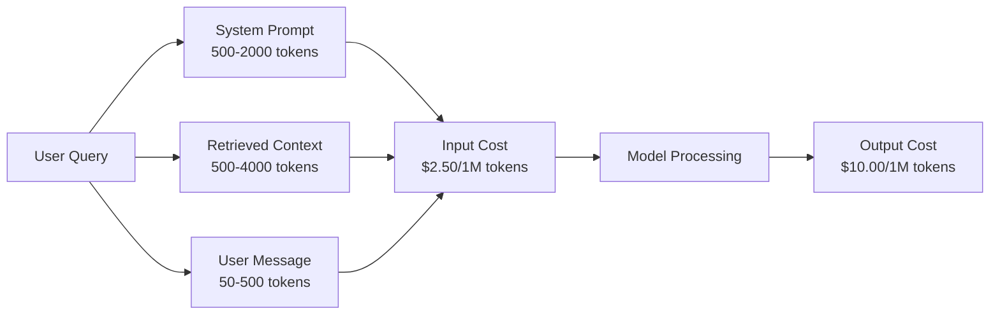
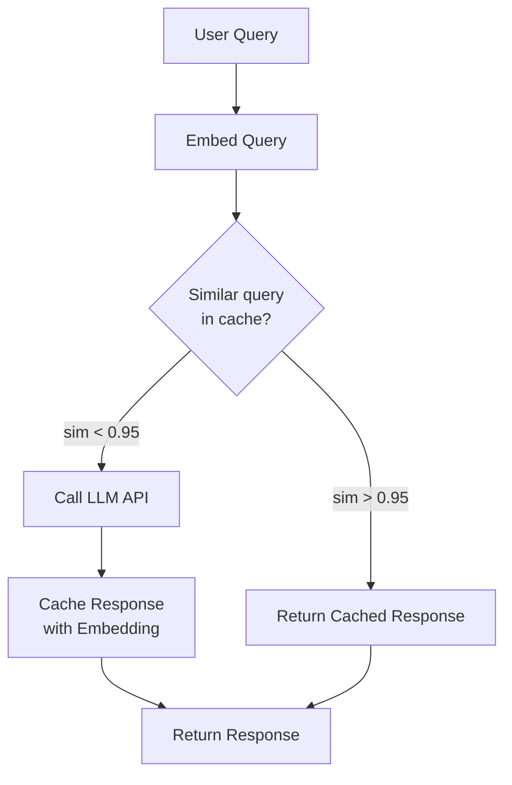
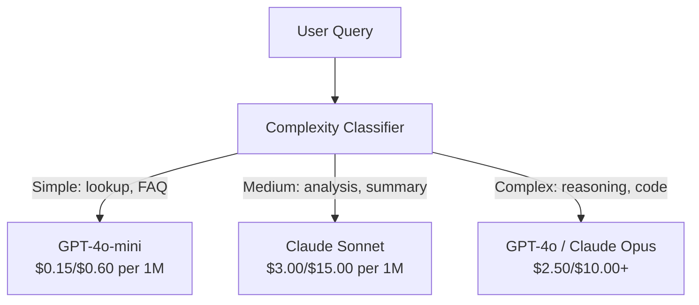

# Caching, limitación de tasas y optimización de costos

> La mayoría de las startups de IA no mueren por malos modelos. Mueren por mala economía de unidades. Una sola llamada GPT-4o cuesta fracciones de un centavo. Diez mil usuarios que hacen diez llamadas al día cuestan $250 en tokens de entrada solo - antes de cobrar un solo dólar. Las empresas que sobreviven son las que tratan cada llamada de API como una transacción financiera, no una llamada de función.

> **【中文解读】**Las empresas de creación de IA mueren en gran medida por un modelo económico unitario malo, no por un modelo malo. 10.000 usuarios usan los tokens de entrada de luz 10 veces al día, y cuestan 250 dólares al día.

> **【拓展：成本优化→AI商业化】**提示缓存(Prompt Caching) puede reducir el 50%-90% del costo de la evaluación,语义缓存(Semantic Cache) puede ser similar a la consulta, es la clave para lograr el beneficio de los productos de IA ──

> ¿ Qué es esto ?**【前置】**学本节前请先掌握:(1) Fase 11·09(Fusión llamada);(2) Fase 11·04(Embeddings)语义缓存依赖嵌入;(3) Redis o Memcached 基础──本节会用 `redis`¿Qué es esto?`fastapi-cache`O `gptcache`¿Qué es eso?

**Type:** Build | **类型:** 构建
**Languages:** Python | **语言:** Python
**Prerequisites:** Phase 11 Lesson 09 (Function Calling) | **前置知识:** Phase 11 · 09 (函数调用)
**Time:** ~45 minutes | **时间:** ~45 分钟
**Related:**Fase 11 · 15 (Cache de inmediato)  esta lección cubre el caché de la capa de aplicación (cache semántica, cache hash exacto, enrutamiento de modelo). La lección 15 cubre el caché de la capa de proveedor (Antropic cache_control, OpenAI automático, Gemini CachedContent). Combine ambos para una reducción de costos del 50-95%. **相关:**Fase 11 · 15 (提示缓存) 本课讲应用层缓存(语义缓存、精确哈希缓存、模型路由)  Lección 15 讲提供商层提示缓存(Antropic cache_control、OpenAI 自动、Gemini CachedContent) 结合两者可降低50-95% 成本。

## Objetivos de aprendizaje

- Implementar caché semántico que sirve consultas repetidas o similares desde la caché en lugar de hacer una nueva llamada de API
  实现语义缓存, de缓存服务重复或相似查询, y no cada nuevo API 调用
- Calcular los costes por solicitud entre los proveedores e implementar alertas de tarifa y presupuestos de restricción de conocimiento de tokens
  跨供应商计算每请求成本,实现感知代币的流量限制和预算告警
- Construir una capa de optimización de costos con compresión rápida, enrutamiento de modelos (caros vs baratos) y almacenamiento en caché de respuesta
  Construcción de costes optimización de niveles, incluyendo sugerencias comprimidas, modelos de viajes (preciosos vs. económicos) y respuesta de almacenamiento
- Diseñar una estrategia de caché en niveles utilizando coincidencia exacta, similitud semántica y caché prefijo para diferentes tipos de consultas
   diseño estrategia de caché de capas, dirigida a diferentes tipos de consultas con una correspondencia precisa, semejanza de lenguaje y caché de antecedentes

> **【中文解读】**El objetivo de este curso es: comprender la estrategia de optimización de costes de la aplicación de LLM Prompt Caching、语义缓存、模型路由、批处理──LLM API 成本是生产部署的主要支出──

> ¿ Qué es esto ?**【类比】**No lleva caché de LLM  aplicación como restaurante por cada cliente se vuelve a cultivar el alimento lento y caro.**精确哈希缓存**冰箱里现成菜((La misma pregunta directamente regresa, mil segundos);(2) **语义缓存** gelado de la cámara similaridad                                                                                                                                                                                                                                                           **prompt caching** Pré-checar buenos alimentos por parte de los proveedores  Sistema rápido                                                                                                                                                                                                                                                                                                                                                                                                                                                                                                           

> ️ **【易错点】**缓存的 3 个坑: ((1) **缓存中毒** usuario pregunta "¿Cuánto es el saldo de mi cuenta?" 语义缓存命中"上次别人问的余额",返回错的数字;修复:带用户身份 hash 进缓存键,PII/个性化查询不缓存――(2) **相似度阈值过高**0.95 太严,命中率 < 5%;降至0.85 +加 LLM 二次验证("¿Estos dos problemas es igual precio?")―(3) **TTL 太长** noticias tipo de consulta缓存 24h,模型答案过时;区分查询类型,事实查询 TTL=1h,聊天 TTL=24h──


## El problema es la introducción del problema

Construye un chatbot RAG, funciona muy bien y a los usuarios les encanta.

Entonces llega la factura.

> Tu construiste un RAG 聊天机器人── funciona muy bien── usuario muy contento── luego el presupuesto llegó──

Los costes del GPT-5 $5 per million input tokens and $15 por millón de producción.$15 input / $75 de salida. Gemini 3 Pro cuesta $1.25 input / $5 de salida. GPT-5-mini es $0.25/$Los precios a continuación son ilustrativos; siempre compruebe la página de precios actual del proveedor.

> GPT-5 por millón de tokens de entrada$5，每百万输出 $15―Claude Opus 4.7 es el resultado de la investigación.$15/$75―Gemini 3 Pro es$1.25/$5 ∞

Aquí está la matemática que mata a las startups:

> Esto es hacer que las empresas empezaran a cerrar matemáticas:

- 10.000 usuarios activos diarios
  10.000 días de uso
- 10 consultas por usuario y día
  Cada usuario 10 veces al día
- 1,000 tokens de entrada por consulta (invite del sistema + contexto + mensaje del usuario)
  Cada consulta 1.000 .
- 500 tokens de salida por respuesta
  500 por respuesta .

**Monthly total:** **$22,500/month**

Eso es sólo el LLM. Añade embebidos, alojamiento de base de datos vectorial, infraestructura. Estás buscando $30,000 al mes para un chatbot.

> Es sólo el costo del LLM. Además de la instalación, la administración de bases de datos, la infraestructura. Un chatbot de $30,000 al mes.

La parte brutal: 40-60% de esas consultas son casi duplicadas. Los usuarios hacen las mismas preguntas en palabras ligeramente diferentes. Su solicitud del sistema - idéntica en todas las solicitudes - se factura cada vez. Los documentos de contexto recuperados por RAG se repiten en los usuarios que preguntan sobre el mismo tema.

> El 40%-60% de las consultas son casi repetidas. Los usuarios usan palabras ligeramente diferentes para hacer las mismas preguntas.

Estás pagando el precio completo por los cálculos redundantes.

> Estás pagando todo el precio por el exceso.

## El concepto central.

> **【中文解读】**La optimización de los costes de la API de LLM es un factor clave de la producción. La estrategia principal es: Caching rápido (缓存不变前) 语义缓存 (缓存相似查询的回复) 模型路由 (简单问题用便宜模型) 批处理 (合并请求减少调用次数) 

> **【拓展：LLM 成本的实际数据】**GPT-4o 定价 $5/$15 por M tokens ((ingresos/salidas),Claude 3.5 Sonnet $3/$15── un día vivo 100.000 usuarios de aplicaciones, por interacción aproximadamente 2K de entrada + 500 tokens de salida, mes costo aproximadamente $15,000-45,000── a través de caché rápido puede bajar aproximadamente 50%, con GPT-4o-mini  sustituyendo simple consulta puede volver a bajar 30%──


### La anatomía de los costes de una convocatoria de LLM

Cada llamada de API tiene cinco componentes de costo.

> Cada API 调用 tiene cinco componentes de costos 



Las instrucciones del sistema son el asesino silencioso.$3.75 per million requests just for that prefix. At 100K requests per day, that is $375 días -- $11,250 al mes -- por un texto que nunca cambia.

> Sistema de sugerencias de 1500 tokens por petición enviada, por millón de peticiones sólo el anterior está en el camino$3.75。每天 10 万请求就是 $375/天$11,250/月为从不改变的文本──

### El caché de los proveedores: descuentos incorporados

Los tres principales proveedores ofrecen caché rápido en el lado del proveedor en 2026, pero las mecánicas difieren.

> Los tres grandes proveedores en 2026 ofrecen todos los proveedores, pero el mecanismo es diferente.

| Provider | Mechanism | Discount | Minimum | Cache Duration |
|----------|-----------|----------|---------|----------------|
| Anthropic | Explicit cache_control markers | 90% on cache hits (pay 25% extra on write) | 1,024 tokens (Sonnet/Opus), 2,048 (Haiku) | 5 min default; 1h extended (2x write premium) |
| OpenAI | Automatic prefix matching | 50% on cache hits | 1,024 tokens | Best-effort up to 1 hour |
| Google Gemini | Explicit CachedContent API | ~75% reduction (plus storage) | 4,096 (Flash) / 32,768 (Pro) | User-configurable TTL |

**Anthropic's approach**Marca las secciones de su mensaje con `cache_control: {"type": "ephemeral"}`. La primera solicitud paga una prima de escritura del 25%. Las solicitudes posteriores con el mismo prefijo obtienen un descuento del 90%.$0.005 normally costs $0.000625 en visitas de caché. Más de 100K solicitudes, que ahorra $437.50 / día.

> **Anthropic 方式**Es evidente que lo utilizan.`cache_control: {"type": "ephemeral"}`标记提示段──首次请求付 25% 写入溢价──后续同前请求获得90% 折扣──2,000 token 系统提示正常$0.005，缓存命中 $0,000625―100.000 solicitudes Provincia $437.50/ día―

**OpenAI's approach**El precio de la aplicación es de un precio de más de $500.00 por año.

> **OpenAI 方式**Es automático. Cualquier ajuste de las solicitudes de la propuesta pre­­­­­­­­­­­­­­­­­­­­­­­­­­­­­­­­­­­­­­­­­­­­­­­­­­­­­­­­­­­­­­­­­­­­­­­­­­­­­­­­­­­­­­­­­­­­­­­­­­­­­­­­­­­­­­­­­­­­­­­­­­­­­­­­­­­­­­­­­­­­­­­­­­­­­­­­­­­­­­­­­­­­­­­­­­­­­­­­­­­­­­­­­­­­­­­­­­­­­­­­­­­­­­­­­­­­­­­­­­­­­­­­­­­­­­­­­­­­­­­­­­­­­­­­­­­­­­­­­­­­­­­­­­­­­­­­­­­­­­­­­­­­­­­­­­­­­­­­­­­­­­­­­­­­­­­­­­­­­­­­­­­­­­­­­­­­­­­­­­­­­­­­­­­­­­­­­­­­­­­­­­­­­­­­­­­­­­­­­­­­­­­­­­­­­­­­­­­­­­­­­­­­­­­­­­­­­­­­­­­­­­­­­­­­­­­­­­­­­­­­­­­­­­­­­­­­­­­­­­­­­­­­­­­­­­­­­­­­­­­­­­­­­­­­­­­­­­

### El caché semántico: su capa personalizada

El caché del proveedor solo funciona para prefijos idénticos. El caché semántico maneja el caso más difícil: diferentes consultas con el mismo significado.

> 供应商缓存只对相同的前生效──语义缓存处理更难的情况:不同查询但相同含义──

"Cuál es la política de devolución?" y "¿Cómo devuelvo un artículo?" son cadenas diferentes pero con la misma intención. Una caché semántica incorpora ambas consultas, calcula la similitud cosina y devuelve la respuesta caché si la similitud supera un umbral (normalmente 0.92-0.95).

> "Cuál es la política de devolución?" y "¿Cómo regreso?" son diferentes caracteres pero tienen el mismo propósito.



Los costos de incorporación son insignificantes. OpenAI de texto de incorporación 3-pequeño cuesta $ 0.02 por millón de tokens.

> 嵌入成本可忽略──OpenAI text-embedding-3-small Cada millón de tokens $0.02──检查缓存相比完整LLM 调用几乎零成本──

### Caching exacto: hash y coincidencia

Para llamadas deterministas (temperatura = 0, mismo modelo, mismo pedido), el caché exacto es más simple y más rápido.

> Para la determinación de la temperatura, el tiempo de almacenamiento es más fácil, el tiempo de almacenamiento es más rápido.

Esto funciona perfectamente para:

> Esto es lo que se debe a:

- Impulso de sistema + contexto fijo + consultas de usuario idénticas
  系统提示 + 固定上下文 + 相同用户查询
- Llamadas de función con definiciones idénticas de herramientas
  Para usar la misma herramienta definido
- Procesamiento en lote donde el mismo documento se procesa varias veces
  En el caso de los documentos de la Comisión, el número de documentos de la Comisión de Asuntos Exteriores es el número de documentos de la Comisión de Asuntos Exteriores.

### Limitación de tasas: Proteger su presupuesto

La limitación de tasas no se trata sólo de justicia, sino de supervivencia.

> La limitación no es sólo un problema de equidad, es un problema de existencia.

**Token bucket algorithm:**Cada usuario recibe un cubo de N tokens que se reponen a una velocidad R por segundo. Una solicitud consume tokens del cubo. Si el cubo está vacío, la solicitud es rechazada. Esto permite estallar (usar el cubo completo a la vez) mientras se aplica una tasa promedio.
**令牌桶算法**Cada usuario tiene un N de tokens en el barril, según R/seconds velocity rate complementar. Requerir consumir en el barril de tokens.

**Per-user quotas:**fijar límites diarios/mensuales de tokens por nivel de usuario.
**每用户配额**: según el nivel de usuario设日/月 token 上限。

| Tier | Daily Token Limit | Max Requests/min | Model Access |
|------|------------------|------------------|-------------|
| Free | 50,000 | 10 | GPT-4o-mini only |
| Pro | 500,000 | 60 | GPT-4o, Claude Sonnet |
| Enterprise | 5,000,000 | 300 | All models |

### Modelo de ruta: modelo adecuado para el trabajo correcto

No todas las consultas necesitan GPT-4o.

> No es que todas las consultas requieran GPT-4o.

"A qué hora cierra la tienda?" no requiere un $10/M-output model. GPT-4o-mini at $La salida de 0.60M la maneja perfectamente. Claude Haiku a $1.25/M la maneja. Un clasificador simple envía consultas baratas a modelos baratos y consultas complejas a modelos caros.

> "¿Tienes que ir a la tienda?"$10/M 输出模型。$0.60/M 输出 GPT-4o-mini 完全胜任。 $1.25/M 输出 Claude Haiku 也可以──简单分类器把便宜查询路由到便宜模型,复杂查询路由到贵模型──



Un router bien ajustado ahorra entre un 40% y un 70% en los costos del modelo.

> 调好的路由器单在模型成本省 40% -70%

### Seguimiento de costos: saber dónde va el dinero

No se puede optimizar lo que no se mide. Registre cada llamada de API con:

> No puedo optimizar la cantidad de cosas que no se pueden medir.

- Estampilla de tiempo
  时间
- Nombre del modelo
  模型名
- Tokens de entrada
  输入 token
- Tokens de salida
  输出 token
- La latencia (ms)
  延迟(毫秒)
- Costo calculado ($)
  计算成本($)
- Identificación de usuario
  Identificación de usuario
- El caché se encuentra/hace falta
  缓存命中/未中
- Categoría de solicitud
  Solicitud de clase

Estos datos revelan qué características son caras, qué usuarios son consumidores pesados y dónde el almacenamiento en caché tiene más impacto.

> Estos datos revelan qué funciones son más costosas, qué usuarios consumen más, cuál es la mayor influencia de la existencia.

### Los lotes: descuentos masivos

La API de lotes de OpenAI procesa las solicitudes de manera asíncrona con un descuento del 50%. Envía un lote de hasta 50.000 solicitudes, y los resultados vuelven dentro de las 24 horas.

> OpenAI Batch API 异步处理请求,50%折――提交最高50.000请求批次,24小时内回复结果――

Utilice el batch para:

>                                                                                                                                                                                                                                                                                                                                                                                                                                                                                                                              

- Tratamiento nocturno de documentos
  Noche de trabajo
- Clasificación en masa
                                                                                                                                                                                                                                                                                                                                                                                                                                                                                                                               
- Las pruebas de evaluación
  评估运行  evaluación
- Línea de enriquecimiento de datos
  Datos de la línea de flujo de agua

No para: consultas en tiempo real dirigidas al usuario (cuestiones de latencia).
No se utiliza: real tiempo face向用户查询 (también conocido como "interrogar")

### Alertas presupuestarias y interrupciones de circuitos

Si no tienes un interruptor de circuito, el gasto se detiene, y si no tienes un interruptor, un error o un abuso pueden quemar tu presupuesto mensual en horas.

> El interruptor se detiene cuando se alcanza el límite máximo.

Establezca tres umbrales:

> 设三个值:

1. **Warning**(70% del presupuesto): enviar una alerta
   **警告**(Budget 70%): El informe de la Comisión
2. **Throttle**(85% del presupuesto): sólo se cambiará a modelos más baratos
   **降速**(Budget 85%): sólo cambiado a modelos más baratos
3. **Stop**(95% del presupuesto): rechazar nuevas solicitudes, devolver respuestas almacenadas en caché solamente
   **停止**(Budget 95%): rechazar nuevas solicitudes, sólo devolver la caché

### La pila de optimización

Aplique estas técnicas en orden. Cada capa se compone con las anteriores.

> 按顺序应用这些技术──每层叠加在前一层之上──

| Layer | Technique | Typical Savings | Implementation Effort |
|-------|-----------|----------------|----------------------|
| 1 | Provider prompt caching | 30-50% | Low (add cache markers) |
| 2 | Exact caching | 10-20% | Low (hash + dict) |
| 3 | Semantic caching | 15-30% | Medium (embeddings + similarity) |
| 4 | Model routing | 40-70% | Medium (classifier) |
| 5 | Rate limiting | Budget protection | Low (token bucket) |
| 6 | Prompt compression | 10-30% | Medium (rewrite prompts) |
| 7 | Batching | 50% on eligible | Low (batch API) |

Una aplicación RAG que aplica capas 1-5 normalmente reduce los costes de $22,500/month to $4000 a 6.000 al mes. Esa es la diferencia entre quemar una pista y construir un negocio.

>  aplicación de 1-5 niveles de RAG  aplicación generalmente reduce el coste mensual de $22,500 降到 $4,000-6,000... es la diferencia entre quemar dinero y hacer negocios.

### Ahorros reales: antes y después

Aquí hay una avería real para un chatbot RAG que sirve 10.000 DAU.

> Esta es la verdadera descomposición de los 10.000 DAU de RAG.

| Metric | Before Optimization | After Optimization | Savings |
|--------|--------------------|--------------------|---------|
| Monthly LLM cost | $22,500 | $5,200 | 77% |
| Avg cost per query | $0.0075 | $0.0017 | 77% |
| Cache hit rate | 0% | 52% | -- |
| Queries routed to mini | 0% | 65% | -- |
| P95 latency | 2,800ms | 900ms (cache hits: 50ms) | 68% |
| Monthly embedding cost | $0 | $180 | (new cost) |
| Total monthly cost | $22,500 | $5,380 | 76% |

El costo de incorporación para el caché semántico ($ 180 / mes) se paga por sí mismo dentro de la primera hora de visitas al caché.

> 语义缓存的嵌入成本 ($180/月) en la primera hora de la vida de缓存

## Construye y realiza.
```figure
semantic-cache
```

## Construye el mismo

### Paso 1: Calculadora de costos

Construye una calculadora de costos de tokens que conozca los precios actuales para los modelos principales.

> 构建代币 成本计算器,知道主要模型当前定价──

```python
import hashlib
import time
import json
import math
from dataclasses import dataclass, field


MODEL_PRICING = {
    "gpt-4o": {"input": 2.50, "output": 10.00, "cached_input": 1.25},
    "gpt-4o-mini": {"input": 0.15, "output": 0.60, "cached_input": 0.075},
    "gpt-4.1": {"input": 2.00, "output": 8.00, "cached_input": 0.50},
    "gpt-4.1-mini": {"input": 0.40, "output": 1.60, "cached_input": 0.10},
    "gpt-4.1-nano": {"input": 0.10, "output": 0.40, "cached_input": 0.025},
    "o3": {"input": 2.00, "output": 8.00, "cached_input": 0.50},
    "o3-mini": {"input": 1.10, "output": 4.40, "cached_input": 0.55},
    "o4-mini": {"input": 1.10, "output": 4.40, "cached_input": 0.275},
    "claude-opus-4": {"input": 15.00, "output": 75.00, "cached_input": 1.50},
    "claude-sonnet-4": {"input": 3.00, "output": 15.00, "cached_input": 0.30},
    "claude-haiku-3.5": {"input": 0.80, "output": 4.00, "cached_input": 0.08},
    "gemini-2.5-pro": {"input": 1.25, "output": 10.00, "cached_input": 0.3125},
    "gemini-2.5-flash": {"input": 0.15, "output": 0.60, "cached_input": 0.0375},
}


def calculate_cost(model, input_tokens, output_tokens, cached_input_tokens=0):
    if model not in MODEL_PRICING:
        return {"error": f"Unknown model: {model}"}
    pricing = MODEL_PRICING[model]
    non_cached = input_tokens - cached_input_tokens
    input_cost = (non_cached / 1_000_000) * pricing["input"]
    cached_cost = (cached_input_tokens / 1_000_000) * pricing["cached_input"]
    output_cost = (output_tokens / 1_000_000) * pricing["output"]
    total = input_cost + cached_cost + output_cost
    return {
        "model": model,
        "input_tokens": input_tokens,
        "output_tokens": output_tokens,
        "cached_input_tokens": cached_input_tokens,
        "input_cost": round(input_cost, 6),
        "cached_input_cost": round(cached_cost, 6),
        "output_cost": round(output_cost, 6),
        "total_cost": round(total, 6),
    }
```

### Paso 2: Cache exacto

Hace hash de la solicitud completa y devuelva las respuestas almacenadas en caché para las mismas solicitudes.

> 哈希完整提示, para la misma solicitud de regreso de la caja de respuestas.

```python
class ExactCache:
    def __init__(self, max_size=1000, ttl_seconds=3600):
        self.cache = {}
        self.max_size = max_size
        self.ttl = ttl_seconds
        self.hits = 0
        self.misses = 0

    def _hash(self, model, messages, temperature):
        key_data = json.dumps({"model": model, "messages": messages, "temperature": temperature}, sort_keys=True)
        return hashlib.sha256(key_data.encode()).hexdigest()

    def get(self, model, messages, temperature=0.0):
        if temperature > 0:
            self.misses += 1
            return None
        key = self._hash(model, messages, temperature)
        if key in self.cache:
            entry = self.cache[key]
            if time.time() - entry["timestamp"] < self.ttl:
                self.hits += 1
                entry["access_count"] += 1
                return entry["response"]
            del self.cache[key]
        self.misses += 1
        return None

    def put(self, model, messages, temperature, response):
        if temperature > 0:
            return
        if len(self.cache) >= self.max_size:
            oldest_key = min(self.cache, key=lambda k: self.cache[k]["timestamp"])
            del self.cache[oldest_key]
        key = self._hash(model, messages, temperature)
        self.cache[key] = {
            "response": response,
            "timestamp": time.time(),
            "access_count": 1,
        }

    def stats(self):
        total = self.hits + self.misses
        return {
            "hits": self.hits,
            "misses": self.misses,
            "hit_rate": round(self.hits / total, 4) if total > 0 else 0,
            "cache_size": len(self.cache),
        }
```

### Paso 3: Cache semántica

Embed las consultas y devuelven las respuestas almacenadas en caché cuando la similitud exceda un umbral.

> 嵌入查询,相似度超值时返回缓存响应──

```python
def simple_embed(text):
    words = text.lower().split()
    vocab = {}
    for w in words:
        vocab[w] = vocab.get(w, 0) + 1
    norm = math.sqrt(sum(v * v for v in vocab.values()))
    if norm == 0:
        return {}
    return {k: v / norm for k, v in vocab.items()}


def cosine_similarity(a, b):
    if not a or not b:
        return 0.0
    all_keys = set(a) | set(b)
    dot = sum(a.get(k, 0) * b.get(k, 0) for k in all_keys)
    return dot


class SemanticCache:
    def __init__(self, similarity_threshold=0.85, max_size=500, ttl_seconds=3600):
        self.entries = []
        self.threshold = similarity_threshold
        self.max_size = max_size
        self.ttl = ttl_seconds
        self.hits = 0
        self.misses = 0

    def get(self, query):
        query_embedding = simple_embed(query)
        now = time.time()
        best_match = None
        best_sim = 0.0
        for entry in self.entries:
            if now - entry["timestamp"] > self.ttl:
                continue
            sim = cosine_similarity(query_embedding, entry["embedding"])
            if sim > best_sim:
                best_sim = sim
                best_match = entry
        if best_match and best_sim >= self.threshold:
            self.hits += 1
            best_match["access_count"] += 1
            return {"response": best_match["response"], "similarity": round(best_sim, 4), "original_query": best_match["query"]}
        self.misses += 1
        return None

    def put(self, query, response):
        if len(self.entries) >= self.max_size:
            self.entries.sort(key=lambda e: e["timestamp"])
            self.entries.pop(0)
        self.entries.append({
            "query": query,
            "embedding": simple_embed(query),
            "response": response,
            "timestamp": time.time(),
            "access_count": 1,
        })

    def stats(self):
        total = self.hits + self.misses
        return {
            "hits": self.hits,
            "misses": self.misses,
            "hit_rate": round(self.hits / total, 4) if total > 0 else 0,
            "cache_size": len(self.entries),
        }
```

### Paso 4: Limitación de tasa

Limitar tasa de token con cuotas por usuario.

> Hacer que el número de usuarios sea limitado.

```python
class TokenBucketRateLimiter:
    def __init__(self):
        self.buckets = {}
        self.tiers = {
            "free": {"capacity": 50_000, "refill_rate": 500, "max_requests_per_min": 10},
            "pro": {"capacity": 500_000, "refill_rate": 5_000, "max_requests_per_min": 60},
            "enterprise": {"capacity": 5_000_000, "refill_rate": 50_000, "max_requests_per_min": 300},
        }

    def _get_bucket(self, user_id, tier="free"):
        if user_id not in self.buckets:
            tier_config = self.tiers.get(tier, self.tiers["free"])
            self.buckets[user_id] = {
                "tokens": tier_config["capacity"],
                "capacity": tier_config["capacity"],
                "refill_rate": tier_config["refill_rate"],
                "last_refill": time.time(),
                "request_timestamps": [],
                "max_rpm": tier_config["max_requests_per_min"],
                "tier": tier,
                "total_tokens_used": 0,
            }
        return self.buckets[user_id]

    def _refill(self, bucket):
        now = time.time()
        elapsed = now - bucket["last_refill"]
        refill = int(elapsed * bucket["refill_rate"])
        if refill > 0:
            bucket["tokens"] = min(bucket["capacity"], bucket["tokens"] + refill)
            bucket["last_refill"] = now

    def check(self, user_id, tokens_needed, tier="free"):
        bucket = self._get_bucket(user_id, tier)
        self._refill(bucket)
        now = time.time()
        bucket["request_timestamps"] = [t for t in bucket["request_timestamps"] if now - t < 60]
        if len(bucket["request_timestamps"]) >= bucket["max_rpm"]:
            return {"allowed": False, "reason": "rate_limit", "retry_after_seconds": 60 - (now - bucket["request_timestamps"][0])}
        if bucket["tokens"] < tokens_needed:
            deficit = tokens_needed - bucket["tokens"]
            wait = deficit / bucket["refill_rate"]
            return {"allowed": False, "reason": "token_limit", "tokens_available": bucket["tokens"], "retry_after_seconds": round(wait, 1)}
        return {"allowed": True, "tokens_available": bucket["tokens"]}

    def consume(self, user_id, tokens_used, tier="free"):
        bucket = self._get_bucket(user_id, tier)
        bucket["tokens"] -= tokens_used
        bucket["request_timestamps"].append(time.time())
        bucket["total_tokens_used"] += tokens_used

    def get_usage(self, user_id):
        if user_id not in self.buckets:
            return {"error": "User not found"}
        b = self.buckets[user_id]
        return {
            "user_id": user_id,
            "tier": b["tier"],
            "tokens_remaining": b["tokens"],
            "capacity": b["capacity"],
            "total_tokens_used": b["total_tokens_used"],
            "utilization": round(b["total_tokens_used"] / b["capacity"], 4) if b["capacity"] else 0,
        }
```

### Paso 5: Seguimiento de costes

Registra todas las llamadas y computa los totales de ejecución.

> 记录每次调用并计算累计总额──

```python
class CostTracker:
    def __init__(self, monthly_budget=1000.0):
        self.logs = []
        self.monthly_budget = monthly_budget
        self.alerts = []

    def log_call(self, model, input_tokens, output_tokens, cached_input_tokens=0, latency_ms=0, user_id="anonymous", cache_status="miss"):
        cost = calculate_cost(model, input_tokens, output_tokens, cached_input_tokens)
        entry = {
            "timestamp": time.time(),
            "model": model,
            "input_tokens": input_tokens,
            "output_tokens": output_tokens,
            "cached_input_tokens": cached_input_tokens,
            "latency_ms": latency_ms,
            "cost": cost["total_cost"],
            "user_id": user_id,
            "cache_status": cache_status,
        }
        self.logs.append(entry)
        self._check_budget()
        return entry

    def _check_budget(self):
        total = self.total_cost()
        pct = total / self.monthly_budget if self.monthly_budget > 0 else 0
        if pct >= 0.95 and not any(a["level"] == "stop" for a in self.alerts):
            self.alerts.append({"level": "stop", "message": f"Budget 95% consumed: ${total:.2f}/${self.monthly_budget:.2f}", "timestamp": time.time()})
        elif pct >= 0.85 and not any(a["level"] == "throttle" for a in self.alerts):
            self.alerts.append({"level": "throttle", "message": f"Budget 85% consumed: ${total:.2f}/${self.monthly_budget:.2f}", "timestamp": time.time()})
        elif pct >= 0.70 and not any(a["level"] == "warning" for a in self.alerts):
            self.alerts.append({"level": "warning", "message": f"Budget 70% consumed: ${total:.2f}/${self.monthly_budget:.2f}", "timestamp": time.time()})

    def total_cost(self):
        return round(sum(e["cost"] for e in self.logs), 6)

    def cost_by_model(self):
        by_model = {}
        for e in self.logs:
            m = e["model"]
            if m not in by_model:
                by_model[m] = {"calls": 0, "cost": 0, "input_tokens": 0, "output_tokens": 0}
            by_model[m]["calls"] += 1
            by_model[m]["cost"] = round(by_model[m]["cost"] + e["cost"], 6)
            by_model[m]["input_tokens"] += e["input_tokens"]
            by_model[m]["output_tokens"] += e["output_tokens"]
        return by_model

    def cache_savings(self):
        cache_hits = [e for e in self.logs if e["cache_status"] == "hit"]
        if not cache_hits:
            return {"saved": 0, "cache_hits": 0}
        saved = 0
        for e in cache_hits:
            full_cost = calculate_cost(e["model"], e["input_tokens"], e["output_tokens"])
            saved += full_cost["total_cost"]
        return {"saved": round(saved, 4), "cache_hits": len(cache_hits)}

    def summary(self):
        if not self.logs:
            return {"total_calls": 0, "total_cost": 0}
        total_latency = sum(e["latency_ms"] for e in self.logs)
        cache_hits = sum(1 for e in self.logs if e["cache_status"] == "hit")
        return {
            "total_calls": len(self.logs),
            "total_cost": self.total_cost(),
            "avg_cost_per_call": round(self.total_cost() / len(self.logs), 6),
            "avg_latency_ms": round(total_latency / len(self.logs), 1),
            "cache_hit_rate": round(cache_hits / len(self.logs), 4),
            "cost_by_model": self.cost_by_model(),
            "cache_savings": self.cache_savings(),
            "budget_remaining": round(self.monthly_budget - self.total_cost(), 2),
            "budget_utilization": round(self.total_cost() / self.monthly_budget, 4) if self.monthly_budget > 0 else 0,
            "alerts": self.alerts,
        }
```

### Paso 6: Modelo de enrutador

Envía las consultas al modelo más barato que pueda manejarlas.

> Encuentra el camino de las consultas para poder tratarlas con el modelo más barato.

```python
SIMPLE_KEYWORDS = ["what time", "hours", "address", "phone", "price", "return policy", "hello", "hi", "thanks", "yes", "no"]
COMPLEX_KEYWORDS = ["analyze", "compare", "explain why", "write code", "debug", "architect", "design", "trade-off", "evaluate"]


def classify_complexity(query):
    q = query.lower()
    if len(q.split()) <= 5 or any(kw in q for kw in SIMPLE_KEYWORDS):
        return "simple"
    if any(kw in q for kw in COMPLEX_KEYWORDS):
        return "complex"
    return "medium"


def route_model(query, tier="pro"):
    complexity = classify_complexity(query)
    routing_table = {
        "simple": {"free": "gpt-4.1-nano", "pro": "gpt-4o-mini", "enterprise": "gpt-4o-mini"},
        "medium": {"free": "gpt-4o-mini", "pro": "claude-sonnet-4", "enterprise": "claude-sonnet-4"},
        "complex": {"free": "gpt-4o-mini", "pro": "gpt-4o", "enterprise": "claude-opus-4"},
    }
    model = routing_table[complexity].get(tier, "gpt-4o-mini")
    return {"query": query, "complexity": complexity, "model": model, "tier": tier}
```

### Paso 7: ejecuta la demostración

> 运行演示──

```python
def simulate_llm_call(model, query):
    input_tokens = len(query.split()) * 4 + 500
    output_tokens = 150 + (len(query.split()) * 2)
    latency = 200 + (output_tokens * 2)
    return {
        "model": model,
        "response": f"[Simulated {model} response to: {query[:50]}...]",
        "input_tokens": input_tokens,
        "output_tokens": output_tokens,
        "latency_ms": latency,
    }


def run_demo():
    print("=" * 60)
    print("  Caching, Rate Limiting & Cost Optimization Demo")
    print("=" * 60)

    print("\n--- Model Pricing ---")
    for model, pricing in list(MODEL_PRICING.items())[:6]:
        cost_1k = calculate_cost(model, 1000, 500)
        print(f"  {model}: ${cost_1k['total_cost']:.6f} per 1K in + 500 out")

    print("\n--- Cost Comparison: 100K Requests ---")
    for model in ["gpt-4o", "gpt-4o-mini", "claude-sonnet-4", "claude-haiku-3.5"]:
        cost = calculate_cost(model, 1000 * 100_000, 500 * 100_000)
        print(f"  {model}: ${cost['total_cost']:.2f}")

    print("\n--- Anthropic Cache Savings ---")
    no_cache = calculate_cost("claude-sonnet-4", 2000, 500, 0)
    with_cache = calculate_cost("claude-sonnet-4", 2000, 500, 1500)
    saving = no_cache["total_cost"] - with_cache["total_cost"]
    print(f"  Without cache: ${no_cache['total_cost']:.6f}")
    print(f"  With 1500 cached tokens: ${with_cache['total_cost']:.6f}")
    print(f"  Savings per call: ${saving:.6f} ({saving/no_cache['total_cost']*100:.1f}%)")

    exact_cache = ExactCache(max_size=100, ttl_seconds=300)
    semantic_cache = SemanticCache(similarity_threshold=0.75, max_size=100)
    rate_limiter = TokenBucketRateLimiter()
    tracker = CostTracker(monthly_budget=100.0)

    print("\n--- Exact Cache ---")
    messages_1 = [{"role": "user", "content": "What is the return policy?"}]
    result = exact_cache.get("gpt-4o-mini", messages_1, 0.0)
    print(f"  First lookup: {'HIT' if result else 'MISS'}")
    exact_cache.put("gpt-4o-mini", messages_1, 0.0, "You can return items within 30 days.")
    result = exact_cache.get("gpt-4o-mini", messages_1, 0.0)
    print(f"  Second lookup: {'HIT' if result else 'MISS'} -> {result}")
    result = exact_cache.get("gpt-4o-mini", messages_1, 0.7)
    print(f"  With temp=0.7: {'HIT' if result else 'MISS (non-deterministic, skip cache)'}")
    print(f"  Stats: {exact_cache.stats()}")

    print("\n--- Semantic Cache ---")
    test_queries = [
        ("What is the return policy?", "Items can be returned within 30 days with receipt."),
        ("How do I return an item?", None),
        ("What are your store hours?", "We are open 9am-9pm Monday through Saturday."),
        ("When does the store open?", None),
        ("Tell me about quantum computing", "Quantum computers use qubits..."),
        ("Explain quantum mechanics", None),
    ]
    for query, response in test_queries:
        cached = semantic_cache.get(query)
        if cached:
            print(f"  '{query[:40]}' -> CACHE HIT (sim={cached['similarity']}, original='{cached['original_query'][:40]}')")
        elif response:
            semantic_cache.put(query, response)
            print(f"  '{query[:40]}' -> MISS (stored)")
        else:
            print(f"  '{query[:40]}' -> MISS (no match)")
    print(f"  Stats: {semantic_cache.stats()}")

    print("\n--- Rate Limiting ---")
    for i in range(12):
        check = rate_limiter.check("user_1", 1000, "free")
        if check["allowed"]:
            rate_limiter.consume("user_1", 1000, "free")
        status = "OK" if check["allowed"] else f"BLOCKED ({check['reason']})"
        if i < 5 or not check["allowed"]:
            print(f"  Request {i+1}: {status}")
    print(f"  Usage: {rate_limiter.get_usage('user_1')}")

    print("\n--- Model Routing ---")
    routing_queries = [
        "What time do you close?",
        "Summarize this quarterly earnings report",
        "Analyze the trade-offs between microservices and monoliths",
        "Hello",
        "Write code for a binary search tree with deletion",
    ]
    for q in routing_queries:
        route = route_model(q, "pro")
        print(f"  '{q[:50]}' -> {route['model']} ({route['complexity']})")

    print("\n--- Full Pipeline: Before vs After Optimization ---")
    queries = [
        "What is the return policy?",
        "How do I return something?",
        "What are your hours?",
        "When do you open?",
        "Explain the difference between TCP and UDP",
        "Compare TCP vs UDP protocols",
        "Hello",
        "What is your phone number?",
        "Write a Python function to sort a list",
        "Analyze the pros and cons of serverless architecture",
    ]

    print("\n  [Before: no caching, single model (gpt-4o)]")
    tracker_before = CostTracker(monthly_budget=1000.0)
    for q in queries:
        result = simulate_llm_call("gpt-4o", q)
        tracker_before.log_call("gpt-4o", result["input_tokens"], result["output_tokens"], latency_ms=result["latency_ms"], cache_status="miss")
    before = tracker_before.summary()
    print(f"  Total cost: ${before['total_cost']:.6f}")
    print(f"  Avg cost/call: ${before['avg_cost_per_call']:.6f}")
    print(f"  Avg latency: {before['avg_latency_ms']}ms")

    print("\n  [After: caching + routing + rate limiting]")
    exact_c = ExactCache()
    semantic_c = SemanticCache(similarity_threshold=0.75)
    tracker_after = CostTracker(monthly_budget=1000.0)

    for q in queries:
        messages = [{"role": "user", "content": q}]
        cached = exact_c.get("gpt-4o", messages, 0.0)
        if cached:
            tracker_after.log_call("gpt-4o-mini", 0, 0, latency_ms=5, cache_status="hit")
            continue
        sem_cached = semantic_c.get(q)
        if sem_cached:
            tracker_after.log_call("gpt-4o-mini", 0, 0, latency_ms=15, cache_status="hit")
            continue
        route = route_model(q)
        result = simulate_llm_call(route["model"], q)
        tracker_after.log_call(route["model"], result["input_tokens"], result["output_tokens"], latency_ms=result["latency_ms"], cache_status="miss")
        exact_c.put(route["model"], messages, 0.0, result["response"])
        semantic_c.put(q, result["response"])

    after = tracker_after.summary()
    print(f"  Total cost: ${after['total_cost']:.6f}")
    print(f"  Avg cost/call: ${after['avg_cost_per_call']:.6f}")
    print(f"  Avg latency: {after['avg_latency_ms']}ms")
    print(f"  Cache hit rate: {after['cache_hit_rate']:.0%}")

    if before["total_cost"] > 0:
        savings_pct = (1 - after["total_cost"] / before["total_cost"]) * 100
        print(f"\n  SAVINGS: {savings_pct:.1f}% cost reduction")
        print(f"  Latency improvement: {(1 - after['avg_latency_ms'] / before['avg_latency_ms']) * 100:.1f}% faster")

    print("\n--- Budget Alerts Demo ---")
    alert_tracker = CostTracker(monthly_budget=0.01)
    for i in range(5):
        alert_tracker.log_call("gpt-4o", 5000, 2000, latency_ms=500)
    print(f"  Total spent: ${alert_tracker.total_cost():.6f} / ${alert_tracker.monthly_budget}")
    for alert in alert_tracker.alerts:
        print(f"  ALERT [{alert['level'].upper()}]: {alert['message']}")

    print("\n--- Cost Breakdown by Model ---")
    multi_tracker = CostTracker(monthly_budget=500.0)
    for _ in range(50):
        multi_tracker.log_call("gpt-4o-mini", 800, 200, latency_ms=150)
    for _ in range(30):
        multi_tracker.log_call("claude-sonnet-4", 1500, 500, latency_ms=400)
    for _ in range(10):
        multi_tracker.log_call("gpt-4o", 2000, 800, latency_ms=600)
    for _ in range(10):
        multi_tracker.log_call("claude-opus-4", 3000, 1000, latency_ms=1200)
    breakdown = multi_tracker.cost_by_model()
    for model, data in sorted(breakdown.items(), key=lambda x: x[1]["cost"], reverse=True):
        print(f"  {model}: {data['calls']} calls, ${data['cost']:.6f}, {data['input_tokens']:,} in / {data['output_tokens']:,} out")
    print(f"  Total: ${multi_tracker.total_cost():.6f}")

    print("\n" + "=" * 60)
    print("  Demo complete.")
    print("=" * 60)


if __name__ == "__main__":
    run_demo()
```

## Usalo con el marco de ejecución

### Caching de datos de la persona

> Antropic 提示缓存──

```python
# import anthropic
#
# client = anthropic.Anthropic()
#
# response = client.messages.create(
#     model="claude-sonnet-5",
#     max_tokens=1024,
#     system=[
#         {
#             "type": "text",
#             "text": "You are a helpful customer support agent for Acme Corp...",
#             "cache_control": {"type": "ephemeral"},
#         }
#     ],
#     messages=[{"role": "user", "content": "What is the return policy?"}],
# )
#
# print(f"Input tokens: {response.usage.input_tokens}")
# print(f"Cache creation tokens: {response.usage.cache_creation_input_tokens}")
# print(f"Cache read tokens: {response.usage.cache_read_input_tokens}")
```

La primera llamada se escribe en la caché (premia del 25%). Cada llamada posterior con el mismo prefijo de pedido del sistema se lee desde la caché (descuento del 90%). La caché dura 5 minutos y se restablece el temporizador en cada golpe.

> 首次调用写缓存(25% 溢价) 』后续同系统提示前的调用读缓存(90% 折扣) 』缓存 5 分钟,每次命中重置计时器──

### OpenAI Caché automático

> Abriendo la memoria automática

```python
# from openai import OpenAI
#
# client = OpenAI()
#
# response = client.chat.completions.create(
#     model="gpt-4o",
#     messages=[
#         {"role": "system", "content": "You are a helpful customer support agent..."},
#         {"role": "user", "content": "What is the return policy?"},
#     ],
# )
#
# print(f"Prompt tokens: {response.usage.prompt_tokens}")
# print(f"Cached tokens: {response.usage.prompt_tokens_details.cached_tokens}")
# print(f"Completion tokens: {response.usage.completion_tokens}")
```

OpenAI se almacena automáticamente. Cualquier prefijo de 1.024+ tokens que coincida con una solicitud reciente obtiene un descuento del 50%. No se necesitan cambios de código - sólo comprobar`prompt_tokens_details.cached_tokens`en la respuesta para verificar que está funcionando.

> OpenAI Automatic Cache  Cualquier 1,024+ tokens 匹配 reciente pedido de sugerencia                                                                                                                                                                                                                                                   `prompt_tokens_details.cached_tokens`验证即可──

### API de lotes de OpenAI

> OpenAI API de lote

```python
# import json
# from openai import OpenAI
#
# client = OpenAI()
#
# requests = []
# for i, query in enumerate(queries):
#     requests.append({
#         "custom_id": f"request-{i}",
#         "method": "POST",
#         "url": "/v1/chat/completions",
#         "body": {
#             "model": "gpt-4o-mini",
#             "messages": [{"role": "user", "content": query}],
#         },
#     })
#
# with open("batch_input.jsonl", "w") as f:
#     for r in requests:
#         f.write(json.dumps(r) + "\n")
#
# batch_file = client.files.create(file=open("batch_input.jsonl", "rb"), purpose="batch")
# batch = client.batches.create(input_file_id=batch_file.id, endpoint="/v1/chat/completions", completion_window="24h")
# print(f"Batch ID: {batch.id}, Status: {batch.status}")
```

La API de lote ofrece un descuento del 50% en todos los tokens. Los resultados llegan dentro de las 24 horas. Perfecto para cargas de trabajo no en tiempo real: evaluaciones, etiquetado de datos, resumen en masa.

> API de lote para todos los tokens 统一 50% 折扣──结果 24 小时内返回──适合非实时工作负载:评估、数据标注、批量摘要──

### Producción Cache semántica con Redis

> ¿Qué es esto?

```python
# import redis
# import numpy as np
# from openai import OpenAI
#
# r = redis.Redis()
# client = OpenAI()
#
# def get_embedding(text):
#     response = client.embeddings.create(model="text-embedding-3-small", input=text)
#     return response.data[0].embedding
#
# def semantic_cache_lookup(query, threshold=0.95):
#     query_emb = np.array(get_embedding(query))
#     keys = r.keys("cache:emb:*")
#     best_sim, best_key = 0, None
#     for key in keys:
#         stored_emb = np.frombuffer(r.get(key), dtype=np.float32)
#         sim = np.dot(query_emb, stored_emb) / (np.linalg.norm(query_emb) * np.linalg.norm(stored_emb))
#         if sim > best_sim:
#             best_sim, best_key = sim, key
#     if best_sim >= threshold and best_key:
#         response_key = best_key.decode().replace("cache:emb:", "cache:resp:")
#         return r.get(response_key).decode()
#     return None
```

En la producción, reemplaza el escaneo lineal con un índice vectorial (Redis Vector Search, Pinecone o pgvector). El escaneo lineal funciona para <1,000 entradas.

> Produce en el mercado de la información sobre la información y la información sobre la información.

## Envíe el producto .

Esta lección produce`outputs/prompt-cost-optimizer.md`-- un mensaje reutilizable que analiza su solicitud de LLM y recomienda optimizaciones específicas de costos con ahorros proyectados.

> 本课产 出  `outputs/prompt-cost-optimizer.md` análisis de LLM 应用并推具体成本优化 (incluyendo previsión de gastos)

También produce `outputs/skill-cost-patterns.md`-- un marco de decisión para elegir la estrategia de almacenamiento en caché adecuada, configuración de limitación de velocidad y reglas de enrutamiento modelo para su caso de uso.

> También producido`outputs/skill-cost-patterns.md` En base a los ejemplos de uso, seleccionar estrategias de caché adecuadas, estructuras de configuración de flujo limitado y normas de ruta de modelos.

## Los ejercicios.

1. **Implement LRU eviction for the semantic cache.**Replace el desalojo más antiguo con el menos recientemente utilizado. Rastrear el último tiempo de acceso para cada entrada y desalojar la entrada con el tiempo de acceso más antiguo cuando la caché esté lleno. Comparar las tasas de impacto entre las dos estrategias más de 100 consultas.
   **为语义缓存实现 LRU 淘汰。**Usado el tiempo más largo no utilizado sustituir el tiempo más temprano de la selección de prioridades.

2. **Build a cost projection tool.**Dado un registro de llamadas de API (los registros de CostTracker), proyecta el costo mensual basado en el promedio de 7 días posteriores.
   **构建成本预测工具。**给定 API 调用日志(CostTracker 日志), según 7 天移动平均预测月成本──考虑工作日/周末模式──若预测月成本超预算 20% 触发告警──

3. **Implement tiered semantic caching.**Utilice dos umbrales de similitud: 0,98 para los hits de alta confianza (retorno inmediato) y 0,90 para los hits de confianza media (retorno con una descarga de responsabilidad: "Basado en una pregunta anterior similar...").
   **实现分层语义缓存。**Utiliza dos niveles de similitud: 0.98 High input return (en inglés) y 0.90 high input return (en inglés) y 0.90 high input return (en inglés).

4. **Build a model routing classifier.**Reemplazar el clasificador basado en palabras clave por uno basado en embebed. Incorporar 50 consultas etiquetadas (simples/medias/complejas), luego clasificar nuevas consultas encontrando el ejemplo etiquetado más cercano. Medir la precisión de clasificación en comparación con un conjunto de pruebas de 20 consultas.
   **构建模型路由分类器。**Usar clasificadores basados en embedded para reemplazarlos en palabras clave. Entablar 50 segmentos de búsqueda de etiquetas.

5. **Implement a circuit breaker with degradation levels.**Con un presupuesto del 70%, registre una advertencia. Con el 85%, cambie automáticamente todo el enrutamiento al modelo más barato (gpt-4o-mini). Con el 95%, solo sirva respuestas almacenadas en caché y rechaza nuevas consultas. Prueba simulado de 1.000 solicitudes contra un presupuesto de $1.00 y verifique cada umbral que se activa correctamente.
   **实现带降级层级的断路器。**El 70% 预算时记日志告警─85% 自动把所有路由切换到最便宜模型(gpt-4o-mini)─95% 只服务缓存响应并拒绝新查询──使用1000 请求模拟 $1.00 预算测试,验证各值正确触发──

## Términos clave .

| Term | What people say | What it actually means | 中文释义 |
|------|----------------|----------------------|---------|
| Prompt caching | "Cache the system prompt" | Provider-level caching where repeated prompt prefixes get a discount (90% Anthropic, 50% OpenAI) -- no code changes for OpenAI, explicit markers for Anthropic | 提示缓存：提供商级缓存，重复提示前缀得折扣（Anthropic 90%，OpenAI 50%）——OpenAI 无需改代码，Anthropic 需显式标记 |
| Semantic caching | "Smart caching" | Embedding the query, computing similarity to past queries, and returning the cached response if similarity exceeds a threshold -- catches paraphrases that exact matching misses | 语义缓存：嵌入查询，与过往查询算相似度，超阈值返回缓存响应——抓住精确匹配漏掉的改写 |
| Exact caching | "Hash caching" | Hashing the full prompt (model + messages + temperature) and returning the cached response for identical inputs -- only works for temperature=0 deterministic calls | 精确缓存：哈希完整提示（模型 + 消息 + 温度），相同输入返回缓存响应——仅 temperature=0 确定性调用可用 |
| Token bucket | "Rate limiter" | An algorithm where each user has a bucket of N tokens that refills at rate R per second -- allows bursts up to N while enforcing an average rate of R | 令牌桶：每用户 N token 桶按 R/秒补充——允许最大 N 突发同时强制平均速率 R |
| Model routing | "Cheapskate routing" | Using a classifier to send simple queries to cheap models (GPT-4o-mini, Haiku) and complex queries to expensive models (GPT-4o, Opus) -- saves 40-70% on model costs | 模型路由：用分类器把简单查询送便宜模型、复杂查询送贵模型——节省 40-70% 模型成本 |
| Cost tracking | "Metering" | Logging every API call with model, tokens, latency, cost, and user ID so you know exactly where money goes and which features are expensive | 成本追踪：每次 API 调用记录模型、token、延迟、成本和用户 ID，精确知道钱花在哪里 |
| Circuit breaker | "Kill switch" | Automatically degrading service (cheaper models, cached-only) or stopping requests entirely when spending approaches the budget limit | 断路器：支出接近预算上限时自动降级（便宜模型、仅缓存）或完全停止请求 |
| Batch API | "Bulk discount" | OpenAI's asynchronous processing at 50% discount -- submit up to 50,000 requests, get results within 24 hours | Batch API：OpenAI 异步处理 50% 折扣——提交最多 5 万请求，24 小时内得结果 |
| Prompt compression | "Token diet" | Rewriting system prompts and context to use fewer tokens while preserving meaning -- shorter prompts cost less and often perform better | 提示压缩：重写系统提示和上下文用更少 token 保含义——更短提示更便宜且常更优 |
| Cache hit rate | "Cache efficiency" | The percentage of requests served from cache instead of calling the LLM -- 40-60% is typical for production chatbots, saves proportionally on cost | 缓存命中率：从缓存而非调用 LLM 服务的请求百分比——生产聊天机器人典型 40-60%，按比例省钱 |

## Más Leer más Leer más

- [Anthropic Prompt Caching Guide](https://docs.anthropic.com/en/docs/build-with-claude/prompt-caching)-- los documentos oficiales para los marcadores de control de caché explícito de Anthropic, precios y comportamiento de vida útil de caché
  Antropic 提示缓存指南Antropic 显式 cache_control 标记、定价和缓存生命周期行为的官方文档
- [OpenAI Prompt Caching](https://platform.openai.com/docs/guides/prompt-caching)-- La caché automática de OpenAI, cómo verificar los caches de acceso a través de campos de uso, y el prefijo mínimo de longitud
  OpenAI 提示缓存OpenAI 自动缓存、如何通过使用 字段验证缓存命中、最小前长度
- [OpenAI Batch API](https://platform.openai.com/docs/guides/batch)-- 50% de descuento para el procesamiento asincrono, formato JSONL, ventana de 24 horas de finalización y límites de solicitudes de 50K
  OpenAI Batch API异步处理 50% descuento JSONL 格式、24小时完成窗口和50,000请求限制
- [GPTCache](https://github.com/zilliztech/GPTCache)-- biblioteca de caché semántico de código abierto que admite múltiples fondos de fondo de incorporación, tiendas vectoriales y políticas de desalojo
  GPTCache open source 语义缓存库, soporte a varias estrategias de almacenamiento y eliminación de velocidades
- [Martian Model Router](https://docs.withmartian.com)-- enrutamiento de modelos de producción que selecciona automáticamente el modelo más barato capaz de manejar cada consulta
  Martian 模型路由器 producción de modelos de clase, automáticamente seleccionar y procesar el modelo más barato de cada consulta
- [Not Diamond](https://www.notdiamond.ai)-- Router modelo basado en ML que aprende de sus patrones de tráfico para optimizar los compromisos de costo / calidad entre los proveedores
  No Diamond basado en el modelo de ML, desde el modelo de circulación para aprender a optimizar el peso de costo/calidad de los proveedores
- [Helicone](https://www.helicone.ai)-- LLM plataforma de observabilidad con el seguimiento de costos, almacenamiento en caché, limitación de tasas y alertas presupuestarias como una capa proxy
  HeliconeLLM plataforma de observación, incluida la aplicación de costes, almacenamiento, limitación de flujo y presupuesto, como agente de la policía
- [Dean & Barroso, "The Tail at Scale" (CACM 2013)](https://research.google/pubs/the-tail-at-scale/)-- latencia, rendimiento, porcentajes TTFT/TPOT, y solicitudes cubiertas; el modelo de costo detrás de "escolle el modelo más barato que todavía cumpla con P95."
  Dean & Barroso "La cola a escala" ((CACM 2013) 延迟、吞吐、TTFT/TPOT 百分位和对冲请求;"sele satisfacer el modelo más barato de P95" detrás del modelo de costes―
- [Kwon et al., "Efficient Memory Management for Large Language Model Serving with PagedAttention" (SOSP 2023)](https://arxiv.org/abs/2309.06180)-- el documento vLLM; por qué el KV-cache paged + batching continuo supera a los servidores ingenuos 24x en rendimiento, la capa infra bajo "caching y costo".
  Kwon 等 "vLLM PagedAttention"(SOSP 2023) vLLM 论文;为何分页 KV 缓存 + 连续批处理吞吐量超朴素服务器 24 倍,"缓存与成本" bajo la infraestructura层。
- [Dao et al., "FlashAttention-2: Faster Attention with Better Parallelism and Work Partitioning" (ICLR 2024)](https://arxiv.org/abs/2307.08691)-- reducción de costos a nivel de núcleo ortogonal para solicitar el almacenamiento en caché; leer junto con la descifrado especulativo y GQA para la imagen completa de la curva de costos.
  Como "FlashAttention-2" (ICLR 2024) Cost de nivel interno de reducción, con la sugerencia de la caché está en contacto; con la inversión y la GQA un comienzo de lectura para comprender la curva de costes completa.
