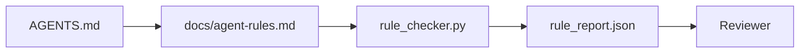

# Las instrucciones del agente son restricciones ejecutables.

> Las instrucciones escritas como prosa son deseos. Las instrucciones escritas como restricciones son pruebas. El banco de trabajo convierte cada regla en algo que un agente puede verificar en el tiempo de ejecución y un revisor puede verificar después del hecho.

**Type:** Build | **类型:** 构建
**Languages:** Python (stdlib) | **语言:** Python (标准库)
**Prerequisites:** Phase 14 · 32 (Minimal Workbench) | **前置知识:** 见原文
**Time:** ~50 minutes | **时间:** 见原文

> ¿ Qué es esto ?**【前置】**Estudiar en el campo de la técnica de la técnica de la técnica de la técnica de la técnica de la técnica de la técnica de la técnica de la técnica de la técnica de la técnica de la técnica de la técnica de la técnica de la técnica de la técnica de la técnica de la técnica de la técnica de la técnica de la técnica de la técnica de la técnica de la técnica de la técnica de la técnica de la técnica de la técnica de la técnica de la técnica de la técnica de la técnica de la técnica de la técnica de la técnica de la técnica de la técnica de la técnica de la técnica de la técnica de la técnica de la técnica de la técnica de la técnica de la técnica de la técnica de la técnica de la técnica de la técnica de la técnica de la técnica de la técnica de la técnica de la técnica de la técnica de la técnica de la técnica de la técnica de la técnica de la técnica de la técnica de la técnica de la técnica de la técnica de la técnica de la técnica de la técnica de la técnica de la técnica de la técnica de la técnica de la técnica de la técnica de la técnica de la técnica de la técnica de la técnica de la técnica de la técnica de la técnica de la técnica de la técnica de la técnica de la técnica de la técnica de la técnica de la técnica de la técnica de la técnica de la técnica de la técnica de la técnica de la técnica de la técnica de la técnica de la técnica de la técnica de la técnica de la técnica de la técnica de la técnica de la técnica de la técnica de la técnica de la técnica de la técnica de la técnica de la técnica de la técnica de la técnica de la técnica de la técnica de la técnica de la técnica de la técnica de la técnica de la técnica de la técnica de la técnica de la técnica de la técnica de la técnica de la técnica de la técnica de la técnica de la técnica de la técnica de la técnica de la técnica de la técnica de la técnica de la técnica de la técnica de la técnica de la técnica de la técnica de la técnica de la técnica de la técnica de la técnica de la técnica de la técnica de la técnica de la técnica de la técnica de la técnica de la técnica de la técnica de la técnica de la técnica de la técnica de la técnica de la técnica de la técnica de la técnica de la técnica de la técnica de la técnica de la técnica de la técnica de la técnica de la técnica de la técnica de la técnica de la técnica de la técnica de la técnica de la técnica de
> ¿ Qué es esto ?**【类比】**散文指示 vs 可执行约束 = "buen hacerse bien" vs "盐 no excede 5 克、油温 180 度、出前味味"──`CLAUDE.md`里写"测试通过才能提交"是散文,写"运行 pytest 必须返回 0 失败"是可执行约束──

## Objetivos de aprendizaje

- Separar la prosa de enrutamiento de las reglas operativas.
- Expresar las reglas de inicio, las acciones prohibidas, la definición de hecho, el manejo de incertidumbres y los límites de aprobación como restricciones controlables por máquina.
- Implementar un controlador de reglas que marque una carrera contra el conjunto de reglas.
- Haga que el conjunto de reglas sea diferente para que la revisión pueda ver qué ha cambiado.

## El problema es la introducción del problema

Un típico .`AGENTS.md`Se lee como una documentación de embarque. le dice al agente que "ten cuidado" y "prueba a fondo" y "pregunta si no estás seguro". Tres días después, el agente envía un cambio sin pruebas, escribe a un directorio prohibido, y nunca pregunta porque nunca supo dónde estaba la línea.

> Un típico .`AGENTS.md`阅读起来像进入职档――它告诉代理要"小心"",彻底测试"",不确定就问"",三天后,Agent 交付了没有测试的更改,写入了一个禁止目录,从不问因为它从不知道界限在哪里――

Las instrucciones son poderosas cuando son operacionales y débiles cuando son aspiracionales.

> En el caso de las instrucciones, las instrucciones son fuertes cuando se pueden operar, las instrucciones son débiles cuando se pueden idealizar.


> **【中文解读】**Para que las instrucciones sean ejecutables, no solo se debe decir a los agentes qué hacer, sino que también se debe codificar las restricciones para que se puedan verificar las reglas. Por ejemplo, el uso de un modelo de tipo de escritura estricto no es sólo un mensaje, sino que también debe ser implementado por un editor de tipo de escritura.

## El concepto central.

Las reglas pertenecen a la`docs/agent-rules.md`Cada regla tiene un nombre, una categoría y un cheque.

>                                                                                                                                                                                                                                                                                                                                                                                                                                                                                                                              `docs/agent-rules.md`En el medio, lejos de la raíz de la ley.

> La conversión de las instrucciones en condiciones de ejecución es un modelo clave para construir un agente confiable.




> **【中文解读】**Para que las instrucciones sean ejecutables, no solo se debe decir a los agentes qué hacer, sino que también se debe codificar las restricciones para que se puedan verificar las reglas. Por ejemplo, el uso de un modelo de tipo de escritura estricto no es sólo un mensaje, sino que también debe ser implementado por un editor de tipo de escritura.

### Cinco categorías que cubren la mayoría de las normas

| Category | Question the rule answers | Example |
|----------|---------------------------|---------|
| Startup | What must be true before work begins? | "state file exists and is fresh" |
| Forbidden | What must never happen? | "do not edit `scripts/release.sh`" |
| Definition of done | What proves the task is complete? | "pytest exits 0 and acceptance line passes" |
| Uncertainty | What does the agent do when unsure? | "open a question note instead of guessing" |
| Approval | What requires human approval? | "any new dependency, any prod write" |

Una regla que no encaja con una de estas cinco reglas suele ser dos reglas.

> La conversión de las instrucciones en condiciones de ejecución es un modelo clave para construir un agente confiable.

### Las reglas son legibles por máquina

Cada regla tiene una bala, una categoría, una descripción de una línea y una`check`campo que nombra una función en `rule_checker.py`Añadir una regla significa añadir un cheque; el checker crece con el banco de trabajo.

> La conversión de las instrucciones en condiciones de ejecución es un modelo clave para construir un agente confiable.

### Las reglas son diferentes

Las reglas viven una por título en un solo archivo de marcado. Los nombres nuevos son visibles en diferencias. Las nuevas reglas se sitúan en la parte superior de su categoría. Las reglas antiguas se eliminan, no se comentan, porque el escritorio de trabajo es la fuente de la verdad, no el registro de chat de cómo se sintió el equipo el trimestre pasado.

> La conversión de las instrucciones en condiciones de ejecución es un modelo clave para construir un agente confiable.

### Reglas frente a barandillas de marco

Las barandillas de marco (OpenAI Agents SDK barandillas, LangGraph interrumpe) hacen cumplir las reglas a nivel de tiempo de ejecución. La regla establecida en esta lección es el contrato legible y revisable por el hombre que implementan esas barandillas. Necesitas ambos: el tiempo de ejecución detecta violaciones durante un turno, el conjunto de reglas demuestra que el tiempo de ejecución está haciendo lo correcto.

> La conversión de las instrucciones en condiciones de ejecución es un modelo clave para construir un agente confiable.

## Construye y realiza.
### Divulgación progresiva: un mapa, no una enciclopedia

La razón .`AGENTS.md`El archivo es de dos mil líneas, y el agente lee la primera pantalla, se queda sin presupuesto de atención, y actúa en una fracción de lo que se le dijo. Un archivo de instrucciones gigantesca falla por la misma razón que un documento de cuarenta páginas de incorporación falla: el lector lo analiza una vez y nunca vuelve a la parte que importó.

El router de raíz se mantiene lo suficientemente pequeño como para leer cada sesión y no contiene nada más que señales. La profundidad vive en los archivos de temas que el agente carga solo cuando la tarea los toca.

```
AGENTS.md                  # router, < 50 lines: what this repo is, where to look, the 5 hard rules
docs/
  agent-rules.md           # the full rule set (this lesson)
  architecture.md          # loaded when the task touches module boundaries
  testing.md               # loaded when the task writes or runs tests
  deploy.md                # loaded only for release work, gated behind an approval rule
feature_list.json          # the backlog (Phase 14 · 36)
```

| Tier | Lives in | Read when | Size budget |
|------|----------|-----------|-------------|
| Router | `AGENTS.md` | Every session, always | Under ~50 lines |
| Rules | `docs/agent-rules.md` | Every session, on startup | One screen per category |
| Topic docs | `docs/<topic>.md` | Only when the task touches that topic | As deep as needed |

Dos pruebas mantienen la capa honesta. La prueba de accesibilidad: un agente debe alcanzar cualquier regla en al menos dos saltos desde el router, por lo que el router debe vincular cada documento de tema por camino, no describirlo en prosa. La prueba de frescura: el router es lo suficientemente corto como para que un revisor lo lea de nuevo en cada PR, lo cual es lo único que impide que vuelva a crecer silenciosamente en la enciclopedia que reemplazó. Un puntero que ya no resuelve es un error peor que una regla que falta, por lo que un enlace roto en el router es en sí mismo una violación de la verificación de inicio.

```figure
wb-rule-checkoff
```

## Construye el mismo

`code/main.py`Naves:

> `code/main.py`提供:

- `agent-rules.md`un parser que carga reglas en una clase de datos.
- `rule_checker.py`Funciones de control de estilo, una por `check`de referencia.
- Un agente de demostración que viola dos reglas y un cheque que los atrapa.

- ¿Qué quieres decir ?

```
python3 code/main.py
```

Resultado: conjunto de reglas analizadas, seguimiento de ejecución, paso/fallo por regla, y un `rule_report.json`guardado junto al guión.

> La conversión de las instrucciones en condiciones de ejecución es un modelo clave para construir un agente confiable.

## Modelos de producción en la naturaleza

Tres patrones separan un conjunto de reglas que dura un cuarto de uno que se descompone en una semana.

> La conversión de las instrucciones en condiciones de ejecución es un modelo clave para construir un agente confiable.

**Severity tagging at write time.**Cada regla tiene un significado .`severity`¿ Qué es esto ?`block`¿ Qué ?`warn`, o`info`El controlador informa de los tres; el tiempo de ejecución sólo se niega a`block`La mayoría de los equipos exageran la gravedad temprano y luego la debilitan silenciosamente bajo presión de fecha límite; etiquetando en el momento de escribir obliga a la calibración hacia adelante.`block`la regla en un `overrides.jsonl`registro de auditoría.

**Rule expiry as a forcing function.**Cada regla tiene un significado .`expires_at`La fecha de la fecha de la publicación (por defecto 90 días a partir de la fecha de publicación).`info`Los datos de la revisión de código de IA de Cloudflare (abril de 2026, 131.246 revisiones se ejecutan en 5.169 repos en 30 días) mostraron que los conjuntos de reglas con vencimiento explícito se mantuvieron bajo 30 reglas por repos; los conjuntos sin crecieron a 80 + con la mayoría nunca disparando.

**Markdown-as-source, JSON-as-cache.** `agent-rules.md`es el archivo autor; `agent-rules.lock.json`El bloqueo se regenera por un gancho precomitado. las diferencias de marcado son revisables; el análisis JSON se mantiene fuera de cada giro. La misma forma que`package.json`- ¿ Qué ?`package-lock.json`y `Cargo.toml`- ¿ Qué ?`Cargo.lock`¿ Qué ?

## Usalo con el marco de ejecución

En producción:

- Claude Code, Codex, Cursor lee las reglas al comienzo de la sesión y las cita cuando se niegan las acciones.
- Los barandillas de OpenAI Agents SDK registran las mismas comprobaciones que los barandillas de entrada y salida.
- LangGraph interrumpe el fuego cuando un nodo en vuelo viola una regla.

El conjunto de reglas es portátil en los tres porque es sólo marcación más nombres de funciones.

> La conversión de las instrucciones en condiciones de ejecución es un modelo clave para construir un agente confiable.

## Envíe el producto .

`outputs/skill-rule-set-builder.md`Entrevistará a un propietario de un proyecto, clasificará sus instrucciones de prosa existentes en las cinco categorías y emitirá una versión `agent-rules.md`Además de un botón de verificación.

> `outputs/skill-rule-set-builder.md`Entrevista a los propietarios de proyectos, que distribuirán las instrucciones existentes en el formato散文式分类到五类中,并输出出版本化的 `agent-rules.md`Y el inspector está en el lugar.

> La conversión de las instrucciones en condiciones de ejecución es un modelo clave para construir un agente confiable.

## Los ejercicios.

1. Añadir una sexta categoría si su producto realmente la necesita.
  En inglés, "pensar y practicar" significa "pensar y practicar".
2. Extensión del control para que una regla pueda tener una severidad (`block`¿ Qué ?`warn`¿ Qué ?`info`) y el informe agregado en consecuencia.
  En inglés, "pensar y practicar" significa "pensar y practicar".
3. Enviar el controlador en CI: fallar la construcción si una regla de severidad de bloque falla en la última ejecución de agente.
  En inglés, "pensar y practicar" significa "pensar y practicar".
4. Añadir un campo "cumplimiento" por regla. Después de 90 días sin un cheque fallido, la regla es para revisión.
  En inglés, "pensar y practicar" significa "pensar y practicar".
5. Encuentra una verdadera .`AGENTS.md`¿Cuántas de sus líneas eran operativas? ¿Cuántas eran aspiracionales?
  En inglés, "pensar y practicar" significa "pensar y practicar".

## Términos clave .

| Term | What people say | What it actually means |
|------|----------------|------------------------|---|
| Operational rule | "A real instruction" | A rule the workbench can check at runtime |  |
| Aspirational rule | "Be careful" | A rule with no check; either delete or upgrade |  |
| Definition of done | "Acceptance" | An objective, file-backed proof the task is complete |  |
| Block severity | "Hard rule" | Violation halts the run; cannot be silenced without an operator |  |
| Rule expiry | "Stale rule sweep" | A rule with no fails in N days is up for retirement |  |

## Más Leer más Leer más

- [OpenAI Agents SDK guardrails](https://platform.openai.com/docs/guides/agents-sdk/guardrails)
  En el caso de los niños, el nombre de la persona que se encuentra en el lugar de residencia es el de la persona que se encuentra en el lugar de residencia.
- [OpenAI Agents SDK guardrails](https://openai.github.io/openai-agents-python/guardrails/)
- [LangGraph interrupts](https://langchain-ai.github.io/langgraph/how-tos/human_in_the_loop/breakpoints/)
  En el caso de los niños, el nombre de la persona que se encuentra en el lugar de residencia es el de la persona que se encuentra en el lugar de residencia.
- [Anthropic, Building Effective Agents](https://www.anthropic.com/research/building-effective-agents)
  En el caso de los niños, el nombre de la persona que se encuentra en el lugar de residencia es el de la persona que se encuentra en el lugar de residencia.
- [Rick Hightower, Agent RuleZ: A Deterministic Policy Engine](https://medium.com/@richardhightower/agent-rulez-a-deterministic-policy-engine-for-ai-coding-agents-9489e0561edf) bloqueo/alerta/información severidad en la producción
  En el caso de los niños, el nombre de la persona que se encuentra en el lugar de residencia es el de la persona que se encuentra en el lugar de residencia.
- [Cloudflare, Orchestrating AI Code Review at Scale](https://blog.cloudflare.com/ai-code-review/) 131k revisiones, lecciones de composición de reglas
  En el caso de los niños, el nombre de la persona que se encuentra en el lugar de residencia es el de la persona que se encuentra en el lugar de residencia.
- [microservices.io, GenAI development platform — part 1: guardrails](https://microservices.io/post/architecture/2026/03/09/genai-development-platform-part-1-development-guardrails.html) defensa en profundidad entre las reglas y la CI
  En el caso de los niños, el nombre de la persona que se encuentra en el lugar de residencia es el de la persona que se encuentra en el lugar de residencia.
- [Type-Checked Compliance: Deterministic Guardrails (arXiv 2604.01483)](https://arxiv.org/pdf/2604.01483) Lean 4 como límite superior en la regla de control
  En el caso de los niños, el nombre de la persona que se encuentra en el lugar de residencia es el de la persona que se encuentra en el lugar de residencia.
- [logi-cmd/agent-guardrails](https://github.com/logi-cmd/agent-guardrails) Implementación de la puerta de fusión: alcance, pruebas de mutación, presupuestos de violación
  En el caso de los niños, el nombre de la persona que se encuentra en el lugar de residencia es el de la persona que se encuentra en el lugar de residencia.
- Fase 14 · 32  el banco de trabajo mínimo de este conjunto de reglas cae en
- Fase 14 · 38  la puerta de verificación que consume el informe de regla
- Fase 14 · 39  el agente revisor que califica el cumplimiento de las reglas
