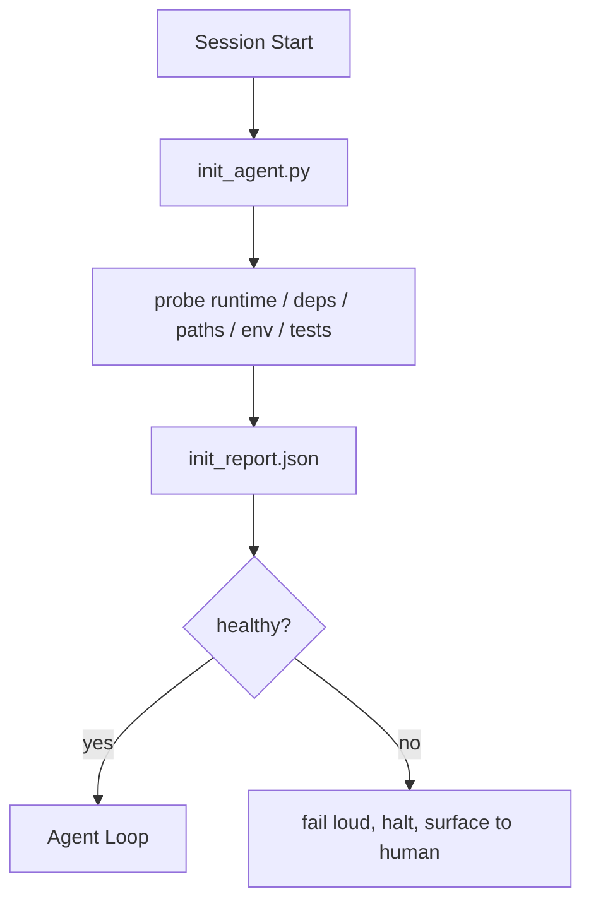

# Inicialización de guiones para agentes

> Cada sesión que comienza en frío paga un impuesto el agente lee los mismos archivos, vuelve a probar las mismas sondas y redescubre los mismos caminos un script init paga el impuesto una vez y escribe las respuestas en estado

**Type:** Build | **类型:** 构建
**Languages:** Python (stdlib) | **语言:** Python (标准库)
**Prerequisites:** Phase 14 · 32 (Minimal Workbench), Phase 14 · 34 (Repo Memory) | **前置知识:** 见原文
**Time:** ~45 minutes | **时间:** 见原文

> ¿ Qué es esto ?**【前置】**学本节前请先掌握:Fase 14·32(Minimal Workbench)、Fase 14·34(Repo Memory)。本节讲"boot脚本"让代理不用每次冷启动重新探索 repo。
> ¿ Qué es esto ?**【类比】**Init script = 项目 README的可执行版──新员工进入职第一天不用摸索自己测试怎么跑、依赖装哪些、环境变量是什么"init script自动做完写到状态文件──Agent Cada vez que se inicia primero, la provincia baja 10-30% de los tokens 预算──

## Objetivos de aprendizaje

- Identificar el trabajo que un agente nunca debería tener que hacer por sesión.
- Construye un script de iniciación determinista que sondee el tiempo de ejecución, las dependencias y la salud de los repos.
- Persiste en el resultado de la sonda para que el agente lo lea en lugar de volver a hacer los cheques.
- Fallar fuerte, rápido, y con un lugar para mirar cuando la inicialización falla.

## El problema es la introducción del problema

Abre una sesión. El agente adivina la versión de Python. Adivina el comando de prueba. Enumera la raíz de repo cinco veces para encontrar el punto de entrada. Trata de importar un paquete que no está instalado. Pregunta al usuario dónde vive el archivo de configuración. Para el momento en que realiza una edición real, diez mil tokens han ido al trabajo de configuración que debería haber sido un solo script.

> Abre una sesión.  Agente  Guess Python 版本── Guess Test order── Enumera el directorio de la base de almacenes cinco veces para encontrar un punto de entrada── Intentar importar un paquete no instalado── Pregunta a un usuario en el archivo de configuración donde─ Cuando realmente se realiza la edición, 10.000 tokens ya se han gastado en la configuración de un guión.

La solución es un script de inicialización que se ejecuta antes de que el agente haga cualquier otra cosa y escribe un`init_report.json`El agente lee en la puesta en marcha.

> 修复 es un guión de inicialización, que se ejecuta antes de que el agente haga cualquier cosa, y se escribe en un agente en el inicio de la lectura `init_report.json`¿Qué es eso?


> **【中文解读】**Iniciación de un proyecto de investigación y desarrollo de proyectos en el marco de la organización de la organización de la organización de la organización de la organización de la organización de la organización de la organización de la organización de la organización de la organización de la organización de la organización de la organización de la organización de la organización de la organización de la organización de la organización de la organización de la organización de la organización de la organización de la organización de la organización de la organización de la organización de la organización de la organización de la organización de la organización de la organización de la organización de la organización de la organización de la organización de la organización de la organización de la organización de la organización de la organización de la organización de la organización de la organización de la organización de la organización de la organización de la organización de la organización de la organización de la organización de la organización de la organización de la organización de la organización de la organización de la organización de la organización de la organización de la organización de la organización de la organización de la organización de la organización de la organización de la organización de la organización de la organización de la organización de la organización de la organización de la organización de la organización de la organización de la organización de la organización de la organización de la organización de la organización de la organización de la organización de la organización de la organización de la organización de la organización de la organización de la organización de la organización de la organización de la organización de la organización de la organización de la organización de la organización de la organización de la organización de la organización de la organización de la organización de la organización de la organización de la organización de la organización de la organización de la organización de la organización de la organización de la organización de la organización de la organización de la organización de la organización de la organización de la organización de la organización de la organización de la organización de la organización de la organización de la organización de la organización de la organización de la organización de la organización de la organización de la organización de la organización de la organización de la organización de la organización de la organización de la organización de la organización de la organización de la organización de la organización de la organización de la organización de la organización de la organización de la organización de la organización de la organización de la organización de la organización de la organización de la organización de la organización de la organización de la organización de la organización de la organización de la organización de la organización de la organización de la organización de la organización de la organización de la organización de la organización de la organización de la organización de la organización de la organización de la organización de

## El concepto central.




> **【中文解读】**Iniciación de un proyecto de investigación y desarrollo de proyectos en el marco de la organización de la organización de la organización de la organización de la organización de la organización de la organización de la organización de la organización de la organización de la organización de la organización de la organización de la organización de la organización de la organización de la organización de la organización de la organización de la organización de la organización de la organización de la organización de la organización de la organización de la organización de la organización de la organización de la organización de la organización de la organización de la organización de la organización de la organización de la organización de la organización de la organización de la organización de la organización de la organización de la organización de la organización de la organización de la organización de la organización de la organización de la organización de la organización de la organización de la organización de la organización de la organización de la organización de la organización de la organización de la organización de la organización de la organización de la organización de la organización de la organización de la organización de la organización de la organización de la organización de la organización de la organización de la organización de la organización de la organización de la organización de la organización de la organización de la organización de la organización de la organización de la organización de la organización de la organización de la organización de la organización de la organización de la organización de la organización de la organización de la organización de la organización de la organización de la organización de la organización de la organización de la organización de la organización de la organización de la organización de la organización de la organización de la organización de la organización de la organización de la organización de la organización de la organización de la organización de la organización de la organización de la organización de la organización de la organización de la organización de la organización de la organización de la organización de la organización de la organización de la organización de la organización de la organización de la organización de la organización de la organización de la organización de la organización de la organización de la organización de la organización de la organización de la organización de la organización de la organización de la organización de la organización de la organización de la organización de la organización de la organización de la organización de la organización de la organización de la organización de la organización de la organización de la organización de la organización de la organización de la organización de la organización de la organización de la organización de la organización de la organización de la organización de la organización de la organización de la organización de la organización de la organización de la organización de la organización de la organización de la organización de la organización de la organización de la organización de la organización de

### Lo que el script init sondea

| Probe | Why it matters |
|-------|----------------|
| Runtime versions | Wrong Python or Node version means silent wrong-version bugs |
| Dependency availability | A missing package later costs ten times the cost of catching it now |
| Test command | The agent must know how to verify; if the command is missing the workbench is broken |
| Repo paths | Hard-coded paths drift; resolve them once and pin |
| Environment variables | Missing `OPENAI_API_KEY` is a failure surface, not a runtime mystery |
| State + board freshness | Stale state from a crashed session is a footgun |
| Last-known-good commit | Anchor for the handoff diff at the end of the session |

### Fallar fuerte, fallar rápido, fallar en un solo lugar

Una falla de la sonda significa detenerse y salir a la superficie del humano. No "el agente lo descubrirá".

> El guión de inicialización se basa en la configuración de condiciones iniciales de la sesión de agentes.

### Idempotente

La segunda vuelta debe ser una no-op excepto para una nueva marca de tiempo. Idempotency es lo que le permite cablear el guión en CI, ganchos, o un pre-task slash comando.

> El guión de inicialización se basa en la configuración de condiciones iniciales de la sesión de agentes.

### Las reglas de inicio

Las reglas (fase 14 · 33) describen lo que debe ser cierto para actuar. Init es el guión que establece que esas reglas pueden ser verificadas. Reglas sin init se vuelven "cuidado".

> El guión de inicialización se basa en la configuración de condiciones iniciales de la sesión de agentes.

## Construye y realiza.
```figure
wb-init-probes
```

## Construye el mismo

`code/main.py`ejecutar `init_agent.py`¿Qué es esto ?

- Cinco sondas: versión Python, dependencias listadas a través de `importlib.util.find_spec`, la resoluciónbilidad de los comandos de prueba, el entorno requerido, la actualidad del archivo del estado.
- Cada sonda regresa .`(name, status, detail)`¿ Qué ?
- El guión dice:`init_report.json`con la sonda completa puesta y sale sin cero si alguna sonda de severidad de bloque falla.

- ¿Qué quieres decir ?

```
python3 code/main.py
```

El guión imprime la tabla de sondas, escribe.`init_report.json`, y sale de cero en el camino feliz o no cero con una lista de sondas fallidas.

> El guión de inicialización se basa en la configuración de condiciones iniciales de la sesión de agentes.

## Modelos de producción en la naturaleza

Tres patrones separan un script de iniciación útil de una ceremonia.

> El guión de inicialización se basa en la configuración de condiciones iniciales de la sesión de agentes.

**Last-known-good commit anchoring.**Prueba el compromiso actual contra un `LKG`Si la diferencia excede un presupuesto (ficheros por defecto 50), se niega a comenzar y requiere que un humano ratifique la nueva línea de base. Esto es lo que la Revisión de Código de IA de Cloudflare utiliza para abarcar a los agentes de revisión: cada sesión de revisión se ancla contra el mismo último bien conocido y nunca se deriva los compuestos entre las sesiones.

**Lock files with TTL.**Escriba un`prereqs.lock`Después de que la primera sonda pase con éxito. Las ejecuciones posteriores confían en la cerradura durante N horas (24h por defecto) y omiten las costosas sondas. El script init lee la cerradura primero; si está fresco y el hash del manifiesto de dependencia coincide, corta el circuito. Este es el mismo patrón que utiliza Docker para las cachées de capas: sonda idempotent + contenido hash = omite.

**No network, no LLM, no surprises in the hot path.**Las sondas init son una tubería determinista. Una sonda que llama a un LLM para clasificar un fallo o que golpea a un servicio externo para verificar una licencia no es una sonda; es un flujo de trabajo. Si una sonda dura más de tres segundos en una carrera seca, trate eso como un olor de banco de trabajo y o lo muevan de init o almacenen en caché su resultado.

## Usalo con el marco de ejecución

En producción:

- **Claude Code hooks.** `pre-task`Hook llama al script de init y se niega a lanzar el agente si falla.
- **GitHub Actions.**¿ Qué es esto ?`setup-agent`El trabajo ejecuta el script init; el trabajo del agente depende de él.
- **Docker entrypoint.**El contenedor de agente ejecuta el script init antes de ejecutar el tiempo de ejecución del agente; registra la superficie en caso de fallo.

El script init es portátil porque no hace llamadas a un marco específico. Bash, Make o un archivo de tareas pueden envolverlo todo.

> El guión de inicialización se basa en la configuración de condiciones iniciales de la sesión de agentes.

## Envíe el producto .

`outputs/skill-init-script.md`Entrevistará el proyecto, clasificará su trabajo de instalación en sondas y emitirá un informe específico del proyecto `init_agent.py`Además de un flujo de trabajo de CI que lo ejecuta antes de cualquier paso del agente.

> El guión de inicialización se basa en la configuración de condiciones iniciales de la sesión de agentes.

## Los ejercicios.

1. Añadir una sonda que diferencia el compromiso actual con el último conocido-bueno compromiso y se niega a iniciar si se cambian más de 50 archivos.
  En inglés, "pensar y practicar" significa "pensar y practicar".
2. Envía el guión para escribir un `prereqs.lock`el registro y rechazar el inicio si la cerradura es mayor de siete días.
  En inglés, "pensar y practicar" significa "pensar y practicar".
3. Añadir un`--fix`bandera que instala automáticamente las dependencias de desarrollo faltantes pero nunca modifica las dependencias de tiempo de ejecución sin aprobación.
  En inglés, "pensar y practicar" significa "pensar y practicar".
4. Mover las sondas de las funciones codificadas en un registro YAML.
  En inglés, "pensar y practicar" significa "pensar y practicar".
5. Una sonda que dure más de tres segundos es un olor de escritorio.
  En inglés, "pensar y practicar" significa "pensar y practicar".

## Términos clave .

| Term | What people say | What it actually means |
|------|----------------|------------------------|---|
| Probe | "A check" | A deterministic function returning `(name, status, detail)` |  |
| Init report | "Setup output" | JSON written next to state with the probe results |  |
| Idempotent | "Safe to re-run" | Two runs in a row produce identical reports modulo timestamp |  |
| Fail loud | "Don't swallow" | Halt and surface to the human; no silent fallback |  |
| Setup tax | "Bootstrap cost" | The tokens the agent spends per session rediscovering the obvious |  |

## Más Leer más Leer más

- [Anthropic, Effective harnesses for long-running agents](https://www.anthropic.com/engineering/effective-harnesses-for-long-running-agents)
  En el caso de los niños, el nombre de la persona que se encuentra en el lugar de residencia es el de la persona que se encuentra en el lugar de residencia.
- [GitHub Actions, composite actions for setup](https://docs.github.com/en/actions/sharing-automations/creating-actions/creating-a-composite-action)
  En el caso de los niños, el nombre de la persona que se encuentra en el lugar de residencia es el de la persona que se encuentra en el lugar de residencia.
- [microservices.io, GenAI dev platform: guardrails](https://microservices.io/post/architecture/2026/03/09/genai-development-platform-part-1-development-guardrails.html) Precompromiso + control de CI como inicial
  En el caso de los niños, el nombre de la persona que se encuentra en el lugar de residencia es el de la persona que se encuentra en el lugar de residencia.
- [Augment Code, How to Build Your AGENTS.md (2026)](https://www.augmentcode.com/guides/how-to-build-agents-md) expectativas iniciales
  En el caso de los niños, el nombre de la persona que se encuentra en el lugar de residencia es el de la persona que se encuentra en el lugar de residencia.
- [Codex Blog, Codex CLI Context Compaction](https://codex.danielvaughan.com/2026/03/31/codex-cli-context-compaction-architecture/) inicio de sesión como compacción consciente init
  En el caso de los niños, el nombre de la persona que se encuentra en el lugar de residencia es el de la persona que se encuentra en el lugar de residencia.
- Fase 14 · 33  la regla establecida en este guión permite
- Fase 14 · 34  el archivo de estado de este script semillas
- Fase 14 · 38  la puerta de verificación el script init alimenta
- Fase 14 · 40  la entrega que consume el último bien conocido del informe init
