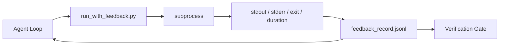

# Los bucles de retroalimentación en tiempo de ejecución

> Los agentes que no ven la salida de la orden real adivinan. Un ejecutor de retroalimentación capta stdout, stderr, código de salida y tiempo en un registro estructurado que la siguiente vuelta puede leer. Entonces el agente reacciona a los hechos en lugar de a su propia predicción de hechos.

**Type:** Build | **类型:** 构建
**Languages:** Python (stdlib) | **语言:** Python (标准库)
**Prerequisites:** Phase 14 · 32 (Minimal Workbench), Phase 14 · 35 (Init Script) | **前置知识:** 见原文
**Time:** ~50 minutes | **时间:** 见原文

> ¿ Qué es esto ?**【前置】**学本节前请先掌握:Fase 14·32(Minimal Workbench) 、Fase 14·35(Init Script)。本节讲"运行时反"让代理看到命令的真实输出而不是自己猜测──
> ¿ Qué es esto ?**【类比】**Contrario ciclo = 闭眼做饭 vs 眼做饭;; 盲猜"煮 5 分钟应该熟了"= 不看输出; 眼看"水还没开"= 看真实反再决定;; Agente 不读 stderr,等于盲改代码; 本节教如何把 stdout/stderr 结构化给 Agent 看。

## Objetivos de aprendizaje

- Distinguir entre la retroalimentación en el tiempo de ejecución y la telemetría de observabilidad.
- Construir un ejecutor de retroalimentación que envuelve los comandos de shell y persiste registros estructurados.
- Truncate grandes salidas deterministicamente para que el bucle permanezca dentro del presupuesto de token.
- Rechazar avanzar en el bucle cuando falta retroalimentación.

## El problema es la introducción del problema

El agente dice "hacer pruebas ahora". El siguiente mensaje dice "todos los tests pasan". La realidad es que no se realizó ninguna prueba. El agente imaginó la salida, o ejecutó el comando y nunca leyó el resultado, o leyó el resultado y silenciosamente corto la línea de falla.

> El agente dijo "ahora se ejecuta el test"......, o leído el resultado pero silenciosamente cortó el error.

Un ejecutor de retroalimentación elimina esa brecha. Cada comando pasa a través del ejecutor. Cada registro lleva el comando, el stdout capturado y stderr, el código de salida, la duración del reloj de la pared y una nota de agente de una línea. El agente lee el registro en el siguiente giro. La puerta de verificación lee los registros al final de la tarea.

> El operador ha eliminado esta brecha. Cada orden pasa por el operador. Cada registro lleva la orden. Captura de la estando y la estando. Retiro.


> **【中文解读】**运行时反循环让代理在执行过程中持续获取反──三种反类型:(1) 工具反命令输出、编译结果、测试结果;(2) 用户反中途断和纠正;(3) 系统反资源使用、误率、超时──反循环是代理自适应调整的基础──

## El concepto central.




> **【中文解读】**运行时反循环让代理在执行过程中持续获取反──三种反类型:(1) 工具反命令输出、编译结果、测试结果;(2) 用户反中途断和纠正;(3) 系统反资源使用、误率、超时──反循环是代理自适应调整的基础──

### Lo que va en un registro de retroalimentación

| Field | Why it matters |
|-------|----------------|
| `command` | Exact argv, no shell expansion surprises |
| `stdout_tail` | Last N lines, deterministic truncation |
| `stderr_tail` | Last N lines, separate from stdout |
| `exit_code` | The unambiguous success signal |
| `duration_ms` | Surfaces slow probes and runaway processes |
| `started_at` | Timestamp for replay |
| `agent_note` | One line the agent writes about what it expected |

### La truncation es determinista

Un registro de 50 MB destruye el bucle.`...truncated N lines...`El resultado de la prueba de la prueba de detección de un error de detección de un factor de detección de un factor de detección de un factor de detección de un factor de detección de un factor de detección de un factor de detección de un factor de detección de un factor de detección de un factor de detección de un factor de detección de un factor de detección de un factor de detección de un factor de detección de detección de un factor de detección de detección de un factor de detección de detección de un factor de detección de detección de un factor de detección de detección de detección de un factor de detección de detección de detección de detección de detección de detección de detección de detección de detección de detección de detección de detección de detección de detección de detección de detección de detección de detección de detección de detección de detección de detección de detección de detección de detección de detección de detección de detección de detección de detección de detección de detección de detección de detección de detección de detección de detección de detección de detección de detección de detección de detección de detección de detección de detección de detección de detección de detección de detección de detección de detección de detección de detección de detección de detección de detección de detección de detección de detección de detección de detección de detección de detección de detección de detección de detección de detección de detección de detección de detección de detección de detección de detección de detección de detección de detección de detección de detección de detección de detección de detección de detección de detección de detección de detección de detección de detección de detección de detección de detección de detección de detección de detección de detección de detección de detección de detección de detección de detección de detección de detección de detección de detección de detección de detección de detección de detección de detección de detección de detección de detección de detección de detección de detección de detección de detección de detección de detección de detección de detección de detección de detección de detección de

> 运行时反循环 执行过程中提供实时纠错――通过监控 行为 行为 行为 行为 行为 行为 行为 行为 行为 行为 行为 行为 行为 行为 行为 行为 行为 行为 行为 行为 行为 行为 行为 行为 行为 行为 行为 行为 行为 行为 行为 行为 行为 行为 行为 行为 行为 行为 行为 行为 行为 行为 行为 行为 行为 行为 行为 行为 行为 行为 行为 行为 行为 行为 行为 行为 行为 行为 行为 行为 行为 行为 行为 行为 行为 行为 行为 行为 行为 行为 行为 行为 行为 行为 行为 行为 行为 行为 行为 行为 行为 行为 行为 行为 行为 行为 行为 行为 行为 行为 行为 行为 行为 行为 行为 行为 行为 行为 行为 行为 行为 行为 行为 行为 行为 行为 行为 行为 行为 行为 行为 行为 行为 行为 行为 行为 行为 行为 行为 行为 行为 行为 行为 行为 行为 行为 行为 行为 行为 行为 行为 行为 行为 行为 行为 行为 行为 行为 行为 行为 行为 行为 行为 行为 行为 行为 行为 行为 行为 行为 行为 行为 行为 行为 行为 行为 行为 行为 行为 行为 行为 行为 行为 行为 行为 行为 行为 行为 行为 行为 行为 行为 行为 行为 行为 行为 行为 行为 行为 行为 行为 行为 行为 行为 行为 行为 行为 行为 行为 行为 行为 行为 行为 行为 行为 行为 行为 行为 行为 行为 行为 行为 行为 行为 行为 行为 行为 行为 行为 行为 行为 行为 行为 行为 行为 行为 行为 行为 行为 行为 行为 行为 行为 行为 行为 行为 行为 行为 行为 行为 行为 行为 行为 行为 行为 行为 行为 行为 行为 行为 行为 行为 行为 行为 

### El retroalimentación frente a la telemetría

La telemetría (fase 14 · 23, OTel GenAI convenciones) es para los operadores humanos que revisan las carreras a través del tiempo.

> 运行时反循环 执行过程中提供实时纠错――通过监控 行为 行为 行为 行为 行为 行为 行为 行为 行为 行为 行为 行为 行为 行为 行为 行为 行为 行为 行为 行为 行为 行为 行为 行为 行为 行为 行为 行为 行为 行为 行为 行为 行为 行为 行为 行为 行为 行为 行为 行为 行为 行为 行为 行为 行为 行为 行为 行为 行为 行为 行为 行为 行为 行为 行为 行为 行为 行为 行为 行为 行为 行为 行为 行为 行为 行为 行为 行为 行为 行为 行为 行为 行为 行为 行为 行为 行为 行为 行为 行为 行为 行为 行为 行为 行为 行为 行为 行为 行为 行为 行为 行为 行为 行为 行为 行为 行为 行为 行为 行为 行为 行为 行为 行为 行为 行为 行为 行为 行为 行为 行为 行为 行为 行为 行为 行为 行为 行为 行为 行为 行为 行为 行为 行为 行为 行为 行为 行为 行为 行为 行为 行为 行为 行为 行为 行为 行为 行为 行为 行为 行为 行为 行为 行为 行为 行为 行为 行为 行为 行为 行为 行为 行为 行为 行为 行为 行为 行为 行为 行为 行为 行为 行为 行为 行为 行为 行为 行为 行为 行为 行为 行为 行为 行为 行为 行为 行为 行为 行为 行为 行为 行为 行为 行为 行为 行为 行为 行为 行为 行为 行为 行为 行为 行为 行为 行为 行为 行为 行为 行为 行为 行为 行为 行为 行为 行为 行为 行为 行为 行为 行为 行为 行为 行为 行为 行为 行为 行为 行为 行为 行为 行为 行为 行为 行为 行为 行为 行为 行为 行为 行为 行为 行为 行为 行为 行为 行为 行为 行为 行为 行为 行为 行为 行为 

### Rechazar avanzar sin comentarios

Si el corredor se equivoca antes de capturar la salida, el registro lleva `exit_code: null`y `error: <reason>`El bucle de agentes debe negarse a reclamar el éxito en una`null`No hay salida, no hay progreso.

> 运行时反循环 执行过程中提供实时纠错――通过监控 行为 行为 行为 行为 行为 行为 行为 行为 行为 行为 行为 行为 行为 行为 行为 行为 行为 行为 行为 行为 行为 行为 行为 行为 行为 行为 行为 行为 行为 行为 行为 行为 行为 行为 行为 行为 行为 行为 行为 行为 行为 行为 行为 行为 行为 行为 行为 行为 行为 行为 行为 行为 行为 行为 行为 行为 行为 行为 行为 行为 行为 行为 行为 行为 行为 行为 行为 行为 行为 行为 行为 行为 行为 行为 行为 行为 行为 行为 行为 行为 行为 行为 行为 行为 行为 行为 行为 行为 行为 行为 行为 行为 行为 行为 行为 行为 行为 行为 行为 行为 行为 行为 行为 行为 行为 行为 行为 行为 行为 行为 行为 行为 行为 行为 行为 行为 行为 行为 行为 行为 行为 行为 行为 行为 行为 行为 行为 行为 行为 行为 行为 行为 行为 行为 行为 行为 行为 行为 行为 行为 行为 行为 行为 行为 行为 行为 行为 行为 行为 行为 行为 行为 行为 行为 行为 行为 行为 行为 行为 行为 行为 行为 行为 行为 行为 行为 行为 行为 行为 行为 行为 行为 行为 行为 行为 行为 行为 行为 行为 行为 行为 行为 行为 行为 行为 行为 行为 行为 行为 行为 行为 行为 行为 行为 行为 行为 行为 行为 行为 行为 行为 行为 行为 行为 行为 行为 行为 行为 行为 行为 行为 行为 行为 行为 行为 行为 行为 行为 行为 行为 行为 行为 行为 行为 行为 行为 行为 行为 行为 行为 行为 行为 行为 行为 行为 行为 行为 行为 行为 行为 行为 行为 行为 行为 

## Construye y realiza.
```figure
wb-feedback-loop
```

## Construye el mismo

`code/main.py`los instrumentos:

- `run_with_feedback(command, agent_note)`que se envuelve .`subprocess.run`, captura el punto de partida/posición/salida/tiempo, truncado deterministicamente, se añade a `feedback_record.jsonl`¿ Qué ?
- Un pequeño cargador que transmite el JSONL a una lista Python.
- Una demostración que ejecuta tres comandos (éxito, fracaso, lento) e imprime el último registro por comando.

- ¿Qué quieres decir ?

```
python3 code/main.py
```

Resultado: tres registros de retroalimentación adjuntos `feedback_record.jsonl`La cola del archivo a través de las re-runs para ver el bucle se acumula.

> 运行时反循环 执行过程中提供实时纠错――通过监控 行为 行为 行为 行为 行为 行为 行为 行为 行为 行为 行为 行为 行为 行为 行为 行为 行为 行为 行为 行为 行为 行为 行为 行为 行为 行为 行为 行为 行为 行为 行为 行为 行为 行为 行为 行为 行为 行为 行为 行为 行为 行为 行为 行为 行为 行为 行为 行为 行为 行为 行为 行为 行为 行为 行为 行为 行为 行为 行为 行为 行为 行为 行为 行为 行为 行为 行为 行为 行为 行为 行为 行为 行为 行为 行为 行为 行为 行为 行为 行为 行为 行为 行为 行为 行为 行为 行为 行为 行为 行为 行为 行为 行为 行为 行为 行为 行为 行为 行为 行为 行为 行为 行为 行为 行为 行为 行为 行为 行为 行为 行为 行为 行为 行为 行为 行为 行为 行为 行为 行为 行为 行为 行为 行为 行为 行为 行为 行为 行为 行为 行为 行为 行为 行为 行为 行为 行为 行为 行为 行为 行为 行为 行为 行为 行为 行为 行为 行为 行为 行为 行为 行为 行为 行为 行为 行为 行为 行为 行为 行为 行为 行为 行为 行为 行为 行为 行为 行为 行为 行为 行为 行为 行为 行为 行为 行为 行为 行为 行为 行为 行为 行为 行为 行为 行为 行为 行为 行为 行为 行为 行为 行为 行为 行为 行为 行为 行为 行为 行为 行为 行为 行为 行为 行为 行为 行为 行为 行为 行为 行为 行为 行为 行为 行为 行为 行为 行为 行为 行为 行为 行为 行为 行为 行为 行为 行为 行为 行为 行为 行为 行为 行为 行为 行为 行为 行为 行为 行为 行为 行为 行为 行为 行为 行为 

## Modelos de producción en la naturaleza

Tres patrones endurecen el corredor lo suficiente como para lanzar.

**Redact at write, not at read.**Cualquier registro que toque stdout o stderr puede filtrar secretos. El corredor envía un pase de redacción antes de la JSONL apéndice: líneas de tira que coinciden `^Bearer `¿ Qué ?`password=`¿ Qué ?`api[_-]?key=`¿ Qué ?`AKIA[0-9A-Z]{16}`(AWS), `xox[baprs]-`La redacción en el momento de la lectura es un arma de fuego; el archivo en el disco es lo que un atacante alcanza. Auditar los patrones de redacción trimestralmente en comparación con los formatos secretos observados en el tiempo de ejecución de la producción.

**Rotation policy, not a single file.**Cap .`feedback_record.jsonl`en 1 MB por archivo; en el desbordamiento girar a `.1`¿ Qué ?`.2`, dejar`.5`El bucle del agente sólo lee el archivo actual, por lo que el costo de tiempo de ejecución está limitado. el almacenamiento de artefactos CI obtiene el conjunto completo girado. sin rotación el archivo se convierte en el cuello de botella en cada llamada de cargador.

**Parent-command id for retry chains.**Cada disco se obtiene`command_id`; retrasos de transporte `parent_command_id`La lista de "intentos fallidos" del revisor (fase 14 · 40) y la auditoría de la puerta de verificación siguen la cadena.

## Usalo con el marco de ejecución

Modelos de producción:

- **Claude Code Bash tool.**La herramienta ya captura stdout, stderr, salida y duración.
- **LangGraph nodes.**Envuelva cualquier nodo de la cáscara en el corredor para que el registro persista fuera del estado del gráfico.
- **CI logs.**Enchufe el JSONL en su almacén de artefactos CI; los revisores pueden reproducir cualquier comando sin volver a ejecutar la sesión.

El corredor es un envoltorio delgado que sobrevive a cada migración de marco porque posee la forma del registro.

> 运行时反循环 执行过程中提供实时纠错――通过监控 行为 行为 行为 行为 行为 行为 行为 行为 行为 行为 行为 行为 行为 行为 行为 行为 行为 行为 行为 行为 行为 行为 行为 行为 行为 行为 行为 行为 行为 行为 行为 行为 行为 行为 行为 行为 行为 行为 行为 行为 行为 行为 行为 行为 行为 行为 行为 行为 行为 行为 行为 行为 行为 行为 行为 行为 行为 行为 行为 行为 行为 行为 行为 行为 行为 行为 行为 行为 行为 行为 行为 行为 行为 行为 行为 行为 行为 行为 行为 行为 行为 行为 行为 行为 行为 行为 行为 行为 行为 行为 行为 行为 行为 行为 行为 行为 行为 行为 行为 行为 行为 行为 行为 行为 行为 行为 行为 行为 行为 行为 行为 行为 行为 行为 行为 行为 行为 行为 行为 行为 行为 行为 行为 行为 行为 行为 行为 行为 行为 行为 行为 行为 行为 行为 行为 行为 行为 行为 行为 行为 行为 行为 行为 行为 行为 行为 行为 行为 行为 行为 行为 行为 行为 行为 行为 行为 行为 行为 行为 行为 行为 行为 行为 行为 行为 行为 行为 行为 行为 行为 行为 行为 行为 行为 行为 行为 行为 行为 行为 行为 行为 行为 行为 行为 行为 行为 行为 行为 行为 行为 行为 行为 行为 行为 行为 行为 行为 行为 行为 行为 行为 行为 行为 行为 行为 行为 行为 行为 行为 行为 行为 行为 行为 行为 行为 行为 行为 行为 行为 行为 行为 行为 行为 行为 行为 行为 行为 行为 行为 行为 行为 行为 行为 行为 行为 行为 行为 行为 行为 行为 行为 行为 行为 行为 

## Envíe el producto .

`outputs/skill-feedback-runner.md`genera un proyecto específico `run_with_feedback.py`con el presupuesto de truncado adecuado, un escritor JSONL cableado al escritorio, y un cargador que el agente lee en cada giro.

> 运行时反循环 执行过程中提供实时纠错――通过监控 行为 行为 行为 行为 行为 行为 行为 行为 行为 行为 行为 行为 行为 行为 行为 行为 行为 行为 行为 行为 行为 行为 行为 行为 行为 行为 行为 行为 行为 行为 行为 行为 行为 行为 行为 行为 行为 行为 行为 行为 行为 行为 行为 行为 行为 行为 行为 行为 行为 行为 行为 行为 行为 行为 行为 行为 行为 行为 行为 行为 行为 行为 行为 行为 行为 行为 行为 行为 行为 行为 行为 行为 行为 行为 行为 行为 行为 行为 行为 行为 行为 行为 行为 行为 行为 行为 行为 行为 行为 行为 行为 行为 行为 行为 行为 行为 行为 行为 行为 行为 行为 行为 行为 行为 行为 行为 行为 行为 行为 行为 行为 行为 行为 行为 行为 行为 行为 行为 行为 行为 行为 行为 行为 行为 行为 行为 行为 行为 行为 行为 行为 行为 行为 行为 行为 行为 行为 行为 行为 行为 行为 行为 行为 行为 行为 行为 行为 行为 行为 行为 行为 行为 行为 行为 行为 行为 行为 行为 行为 行为 行为 行为 行为 行为 行为 行为 行为 行为 行为 行为 行为 行为 行为 行为 行为 行为 行为 行为 行为 行为 行为 行为 行为 行为 行为 行为 行为 行为 行为 行为 行为 行为 行为 行为 行为 行为 行为 行为 行为 行为 行为 行为 行为 行为 行为 行为 行为 行为 行为 行为 行为 行为 行为 行为 行为 行为 行为 行为 行为 行为 行为 行为 行为 行为 行为 行为 行为 行为 行为 行为 行为 行为 行为 行为 行为 行为 行为 行为 行为 行为 行为 行为 行为 行为 

## Los ejercicios.

1. Añadir un`cwd`campo por registro para que el mismo comando ejecutado de diferentes directorios sea distinguible.
  En inglés, "pensar y practicar" significa "pensar y practicar".
2. Añadir un`redaction`paso que tira líneas coinciden `^Bearer `o `password=`Prueba en un registro de fijación.
  En inglés, "pensar y practicar" significa "pensar y practicar".
3. Total de las capas`feedback_record.jsonl`tamaño de 1 MB girando a `.1`¿ Qué ?`.2`Defender la política de rotación.
  En inglés, "pensar y practicar" significa "pensar y practicar".
4. Añadir un`parent_command_id`Así que las cadenas de retraso son visibles: que comando produjo la entrada que el siguiente comando consumió.
  En inglés, "pensar y practicar" significa "pensar y practicar".
5. En el caso de las aplicaciones de la aplicación, el sistema de control de datos de la aplicación de la aplicación de datos de la aplicación de datos de la aplicación de datos de la aplicación de datos de la aplicación de datos de la aplicación de datos de la aplicación de datos de la aplicación de datos de la aplicación de datos de la aplicación de datos de la aplicación de datos de la aplicación de datos de la aplicación de datos de la aplicación de la aplicación de datos de la aplicación de datos de la aplicación de la aplicación de datos de la aplicación de la aplicación de datos de la aplicación de la aplicación de datos de la aplicación de la aplicación de la aplicación de datos de la aplicación de la aplicación de la aplicación de datos de la aplicación de la aplicación de la aplicación de la aplicación de la aplicación de datos de datos de la aplicación de la aplicación de la aplicación de la aplicación de datos de datos de la aplicación de datos de la aplicación de la aplicación de la aplicación de la aplicación de datos de datos de la aplicación de la aplicación de la aplicación de datos de la aplicación de la aplicación de datos de la aplicación de la aplicación de la aplicación de la aplicación de la aplicación de la aplicación de datos de la aplicación de la aplicación de la aplicación de la aplicación de la aplicación de la aplicación de la aplicación de la aplicación de la aplicación de la aplicación de la aplicación de la aplicación de la aplicación de la aplicación de la aplicación de la aplicación de la aplicación de la aplicación de la aplicación de la aplicación de la aplicación de la aplicación de la aplicación de la aplicación de la aplicación de la aplicación de la aplicación de la aplicación de la aplicación de la aplicación de la aplicación de la aplicación de la aplicación de la aplicación de la aplicación de la aplicación de la aplicación de la aplicación de la aplicación de la aplicación de la aplicación de la aplicación de la aplicación de la aplicación de la aplicación de la aplicación de la aplicación de la aplicación de la aplicación de la aplicación de la aplicación de la aplicación de la aplicación de la aplicación de la aplicación de la ley de la ley de la ley de la ley de la ley de la ley de la ley de la ley de la ley de la ley de la ley de la ley de la ley de la ley de la ley de la ley de la ley de que se puede ser.
  En inglés, "pensar y practicar" significa "pensar y practicar".

## Términos clave .

| Term | What people say | What it actually means |
|------|----------------|------------------------|---|
| Feedback record | "Run log" | Structured JSONL entry with command, output, exit, duration |  |
| Tail truncation | "Trim the log" | Deterministic head+tail capture so records fit in token budget |  |
| Refuse-on-null | "Block on missing data" | The loop must not advance when `exit_code` is null |  |
| Agent note | "Expectation tag" | The one-line prediction the agent writes before reading the result |  |
| Telemetry split | "Two log files" | Feedback for the next turn, telemetry for the operator |  |

## Más Leer más Leer más

- [OpenTelemetry GenAI semantic conventions](https://opentelemetry.io/docs/specs/semconv/gen-ai/)
  En el caso de los niños, el nombre de la persona que se encuentra en el lugar de residencia es el de la persona que se encuentra en el lugar de residencia.
- [Anthropic, Effective harnesses for long-running agents](https://www.anthropic.com/engineering/effective-harnesses-for-long-running-agents)
  En el caso de los niños, el nombre de la persona que se encuentra en el lugar de residencia es el de la persona que se encuentra en el lugar de residencia.
- [Guardrails AI x MLflow — deterministic safety, PII, quality validators](https://guardrailsai.com/blog/guardrails-mlflow) patrones de redacción como pruebas de regresión
  En el caso de los niños, el nombre de la persona que se encuentra en el lugar de residencia es el de la persona que se encuentra en el lugar de residencia.
- [Aport.io, Best AI Agent Guardrails 2026: Pre-Action Authorization Compared](https://aport.io/blog/best-ai-agent-guardrails-2026-pre-action-authorization-compared/) Captura previa/post-herramienta
  En el caso de los niños, el nombre de la persona que se encuentra en el lugar de residencia es el de la persona que se encuentra en el lugar de residencia.
- [Andrii Furmanets, AI Agents in 2026: Practical Architecture for Tools, Memory, Evals, Guardrails](https://andriifurmanets.com/blogs/ai-agents-2026-practical-architecture-tools-memory-evals-guardrails) Superficies de observabilidad
  En el caso de los niños, el nombre de la persona que se encuentra en el lugar de residencia es el de la persona que se encuentra en el lugar de residencia.
- Fase 14 · 23  Convenciones OTel GenAI para el sector de la telemetría
- Fase 14 · 24  Plataformas de observación de agentes (Langfuse, Phoenix, Opik)
- Fase 14 · 33  la regla que exige comentarios antes de declarar hecho
- Fase 14 · 38  la puerta de verificación que lee el JSONL
