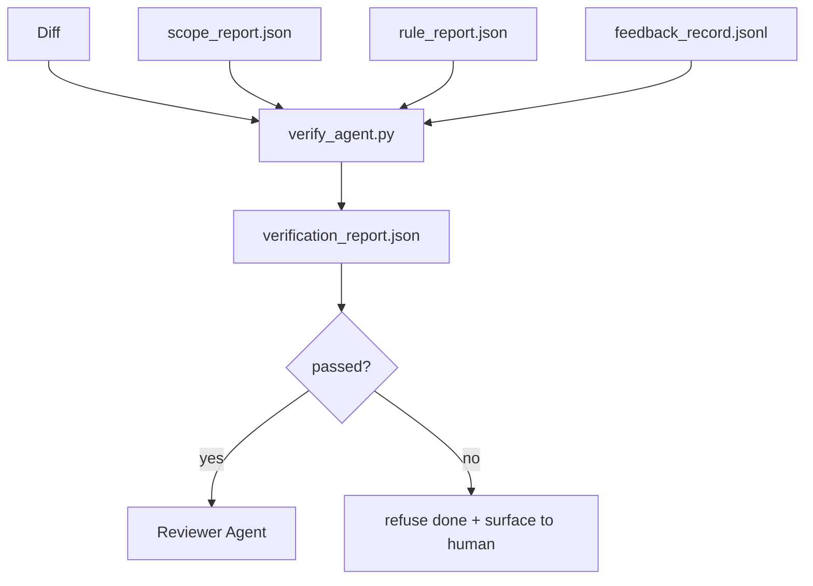

# Puertas de verificación Control

> El agente no puede marcar su propio trabajo como hecho. Una puerta de verificación lee el contrato de alcance, el registro de retroalimentación, el informe de reglas y el dif, y responde a una sola pregunta: ¿está realmente completa esta tarea?

**Type:** Build | **类型:** 构建
**Languages:** Python (stdlib) | **语言:** Python (标准库)
**Prerequisites:** Phase 14 · 33 (Rules), Phase 14 · 36 (Scope), Phase 14 · 37 (Feedback) | **前置知识:** 见原文
**Time:** ~55 minutes | **时间:** 见原文

> ¿ Qué es esto ?**【前置】**學本節前 請先掌握:Fase 14·33(Reglas) 、Fase 14·36(Capa) 、Fase 14·37(Feedback) 3 个前置都做完才能学验证门控。
> ¿ Qué es esto ?**【类比】**Puerta de verificación = 出厂质检.Agent 自己说"我做完了"不算数gate 独立检查"测试是否通过、scope 是否守住、规则是否满足、diff 是否合理"──门控失败,任务不算完成──这是阶段14·39(Reviewer Agent) 简化版gate 是脚本,reviewer 是 LLM──

## Objetivos de aprendizaje

- Definir una puerta de verificación como una función determinista sobre los artefactos de los bancos de trabajo.
- Combine el informe de reglas, el informe de alcance, los registros de retroalimentación y la diferencia en un solo veredicto.
- Emite una`verification_report.json`El agente de la revisión y el informador pueden leer.
- Rechazar avanzar en una tarea en cualquier falla de gravedad de bloque, sin excepción.

## El problema es la introducción del problema

Los agentes declaran el éxito demasiado fácilmente.

> Agente 太容易宣布成功──三种失败形态占主导:

> 验证门(Verificación Gates) en el proceso de trabajo del agente 关键节点设置检查点──每个门验证前一步的输出是否满足要求,不满足则触发修复流程──

- "Se ve bien". El modelo leyó su propia diferencia y decidió que era correcta.
- "Las pruebas pasaron". Dijo con confianza.
- "Aceptación cumplida". Criterios de aceptación interpretados lo suficientemente libremente como para significar "cualquier cosa que se parezca a hecho".


> **【中文解读】**验证门在 Agent 执行的关键节点插入自动检查──常见验证门:(1) 编译检查代码修改后必须通过编译;(2) 测试检查提交前必须通过相关测试;(3) Lint 检查代码必须符合风格规范;(4) 安全检查必须引入已知漏洞──验证门防止错积――

La puerta de control es una puerta de verificación única que lee los artefactos que el agente ya ha producido y hace la llamada. La puerta es determinista. La puerta está en control de versión. La puerta está conectada a CI. El agente no puede sobornarla.

> 工作台的修复是一个单一的验证门控,读取 代理 已产生的工件并做出判断──门控是确定性的──门控在版本控制中──门控连接CI── Agent 无法它──

> 验证门(Verificación Gates) en el proceso de trabajo del agente 关键节点设置检查点──每个门验证前一步的输出是否满足要求,不满足则触发修复流程──

## El concepto central.




> **【中文解读】**验证门在 Agent 执行的关键节点插入自动检查──常见验证门:(1) 编译检查代码修改后必须通过编译;(2) 测试检查提交前必须通过相关测试;(3) Lint 检查代码必须符合风格规范;(4) 安全检查必须引入已知漏洞──验证门防止错积――

### Lo que la puerta comprueba

| Check | Source artifact | Severity |
|-------|-----------------|----------|
| All acceptance commands ran | `feedback_record.jsonl` | block |
| All acceptance commands exited zero | `feedback_record.jsonl` | block |
| Scope check has no forbidden writes | `scope_report.json` | block |
| Scope check has no off-scope writes | `scope_report.json` | block or warn |
| All block-severity rules pass | `rule_report.json` | block |
| No `null` exit codes in feedback | `feedback_record.jsonl` | block |
| Touched files match `scope.allowed_files` | both | warn |

¿ Qué es esto ?`warn`la búsqueda anota el veredicto; a `block`encontrar los obstáculos `passed: true`¿ Qué ?

> 验证门(Verificación Gates) en el proceso de trabajo del agente 关键节点设置检查点──每个门验证前一步的输出是否满足要求,不满足则触发修复流程──

### Determinista, no probabilista

La puerta debe emitir el mismo veredicto para el mismo artefacto establecido cada vez. No hay jueces de LLM. Los jueces de LLM pertenecen al lado del revisor (fase 14 · 39) donde el objetivo es la evaluación cualitativa, no el estatus.

> 验证门(Verificación Gates) en el proceso de trabajo del agente 关键节点设置检查点──每个门验证前一步的输出是否满足要求,不满足则触发修复流程──

### Un informe, un camino

La puerta emite uno .`verification_report.json`por tarea, escrito en el apartado `outputs/verification/<task_id>.json`CI consume el mismo camino, múltiples puertas con diferentes caminos forjan la fuente de la verdad.

> 验证门(Verificación Gates) en el proceso de trabajo del agente 关键节点设置检查点──每个门验证前一步的输出是否满足要求,不满足则触发修复流程──

### Rechazo sin excepción

Los hallazgos de gravedad de bloque no pueden ser anulados por el agente.`override_reason`y un `overridden_by`La anulación es un cambio firmado, no una decisión del agente.

> 验证门(Verificación Gates) en el proceso de trabajo del agente 关键节点设置检查点──每个门验证前一步的输出是否满足要求,不满足则触发修复流程──

## Construye y realiza.
```figure
wb-gate-sequence
```

## Construye el mismo

`code/main.py`los instrumentos:

- Un cargador para cada artefacto de entrada, todo estampado localmente para que la lección sea autosuficiente.
- ¿ Qué es esto ?`verify(task_id, artifacts) -> VerdictReport`La función pura.
- Una impresora que muestra los resultados de cada comprobación y el resultado final.
- Una demostración con tres escenarios de tareas: pase limpio, alcance creep, falta de aceptación.

- ¿Qué quieres decir ?

```
python3 code/main.py
```

Resultado: tres informes de veredicto, cada uno guardado junto al guión.

> 验证门(Verificación Gates) en el proceso de trabajo del agente 关键节点设置检查点──每个门验证前一步的输出是否满足要求,不满足则触发修复流程──

## Modelos de producción en la naturaleza

Cuatro patrones elevan la puerta de "otro trabajo de peludo" a "el borde decisivo".

> 验证门(Verificación Gates) en el proceso de trabajo del agente 关键节点设置检查点──每个门验证前一步的输出是否满足要求,不满足则触发修复流程──

**Defense-in-depth, not single gate.**El gancho precomit → verificación del estado de CI → gancho pre-herramienta authz → gancho pre-merger. Cada capa es determinista por lo que un fallo en una capa es atrapado por la siguiente. el libro de juego de marzo de 2026 de microservices.io es explícito: el gancho precomit es impensable porque, a diferencia de una habilidad del lado del modelo, no depende del agente que sigue las instrucciones.

**Defense by deterministic check, model-judge only for nuance.**El emparejamiento de Normas Híbridas 2026 de Anthropic: recompensas verificables (teses de unidad, comprobaciones de esquemas, códigos de salida) responden "¿el código resolvió el problema?"  Las rúbricas del LLM responden "¿es legible, seguro, en estilo el código?"

**Signed override log, not Slack threads.**Cada revisión emite una fila en`outputs/verification/overrides.jsonl`El tiempo de ejecución rechaza cualquier control que carezca de la firma; el rastro de auditoría está rastreado. Esta es la línea entre una política de control y un teatro de control.

**Coverage floor as a first-class check.**¿ Qué es esto ?`coverage_report.json`alimenta a `coverage_floor`El control de la puerta falla si la cobertura medida cae por debajo del piso o por debajo del piso de la fusión anterior en más de 1 punto porcentuales.

**`--strict` mode promotes warns to blocks.**Para las ramas de liberación, las relaciones públicas de bloqueo de buques o la triaje posterior al incidente, `--strict`La bandera es una opción por rama, no el default global, porque estricto en todo corroye el flujo diario.

## Usalo con el marco de ejecución

Modelos de producción:

- **CI step.**¿ Qué es esto ?`verify_agent`El trabajo ejecuta la puerta contra los artefactos finales del agente.`passed: true`¿ Qué ?
- **Pre-handoff hook.**El agente en tiempo de ejecución llama a la puerta antes de generar el documento de entrega.
- **Manual triage.**Los operadores leen el informe cuando un agente afirma éxito y un humano sospecha de ello.

La puerta es el borde decisivo en el flujo del banco de trabajo.

> 验证门(Verificación Gates) en el proceso de trabajo del agente 关键节点设置检查点──每个门验证前一步的输出是否满足要求,不满足则触发修复流程──

## Envíe el producto .

`outputs/skill-verification-gate.md`El programa de auditoría de la red de control de la red de control de la red de control de la red de control de la red de control de la red de control de la red de control de la red de control de la red de control de la red de control de la red de control de la red de control de la red de control de la red de control de la red de control de la red de control de la red de control de la red de control de la red de control de la red de control de la red de control de la red de control de la red de control de la red de control de la red de control de la red de control de la red de control de la red de control de la red de control de la red de control de la red de control de red de red de red de red de red de red de red de red de red de red de red de red de red de red de red de red de red de red de red de red de red de red de red de red de red de red de red de red de red de red de red de red de red de red de red de red de red de red de red de red de red de red de red de red de red de red de red de red de red de red de red de red de red de red de red de red de red de red de red de red de red de red de red de red de red de red de red de red de red de red de red de red de red de red de red de red de red de red de red de red de red de red de red de red de red de red de red de red de red de red de red de red de red de red de red de red de red de red de red de red de red de red de red de red de red de red de red de red de red de red de red de red de red de red de red de red de red de red de red de red de red de red de red de red de red de red de red de red de red de red de red de red de red de red de red de red de red de red de red de red de red de red de red de red de red de red de red de red de red de red de red de red de red de red de red de red de red de red de red de red de red de red de red de red de red de red de red de red de red de red de red de red de red de red de red

> 验证门(Verificación Gates) en el proceso de trabajo del agente 关键节点设置检查点──每个门验证前一步的输出是否满足要求,不满足则触发修复流程──

## Los ejercicios.

1. Añadir un`coverage_floor`control: el comando de ensayo deberá presentar un informe de cobertura con al menos un 80%. Decidir qué artefacto lleva el suelo.
  En inglés, "pensar y practicar" significa "pensar y practicar".
2. Apoyar a`--strict`modo que promueve cada `warn`¿ Qué ?`block`Documentar los casos en que el modo estricto es el correcto por defecto.
  En inglés, "pensar y practicar" significa "pensar y practicar".
3. Haga que la puerta produzca un resumen de Markdown además de JSON. Defender qué campos pertenecen al resumen.
  En inglés, "pensar y practicar" significa "pensar y practicar".
4. Añadir un`time_since_last_human_touch`verificación: cualquier archivo editado dentro de los 60 segundos de un teclado humano está exento de banderas fuera de alcance.
  En inglés, "pensar y practicar" significa "pensar y practicar".
5. ¿Cuántos hallazgos son reales y cuántos son ruidos? ¿Dónde necesita crecer la puerta?
  En inglés, "pensar y practicar" significa "pensar y practicar".

## Términos clave .

| Term | What people say | What it actually means |
|------|----------------|------------------------|---|
| Verification gate | "The check that stops things" | Deterministic function over workbench artifacts producing a pass/fail verdict |  |
| Block severity | "Hard fail" | A finding that prevents `passed: true` and requires a signed override |  |
| Override log | "Why we let it through" | Signed entries with reason and user id, audited by review |  |
| Acceptance command | "The proof" | A shell command whose zero exit is what `done` means |  |
| One report path | "Source of truth" | `outputs/verification/<task_id>.json`, consumed by CI and humans alike |  |

## Más Leer más Leer más

- [Anthropic, Harness design for long-running application development](https://www.anthropic.com/engineering/harness-design-long-running-apps)
  En el caso de los niños, el nombre de la persona que se encuentra en el lugar de residencia es el de la persona que se encuentra en el lugar de residencia.
- [OpenAI Agents SDK guardrails](https://platform.openai.com/docs/guides/agents-sdk/guardrails)
  En el caso de los niños, el nombre de la persona que se encuentra en el lugar de residencia es el de la persona que se encuentra en el lugar de residencia.
- [OpenAI Agents SDK guardrails](https://openai.github.io/openai-agents-python/guardrails/)
- [microservices.io, GenAI dev platform: guardrails](https://microservices.io/post/architecture/2026/03/09/genai-development-platform-part-1-development-guardrails.html) defensa en profundidad entre el precomit y la CI
  En el caso de los niños, el nombre de la persona que se encuentra en el lugar de residencia es el de la persona que se encuentra en el lugar de residencia.
- [ICMD, The 2026 Playbook for Agentic AI Ops](https://icmd.app/article/the-2026-playbook-for-agentic-ai-ops-guardrails-costs-and-reliability-at-scale-1776661990431) escalera de puertas de aprobación (proyecto → aprobación → auto por debajo de los umbrales)
  En el caso de los niños, el nombre de la persona que se encuentra en el lugar de residencia es el de la persona que se encuentra en el lugar de residencia.
- [Type-Checked Compliance: Deterministic Guardrails (arXiv 2604.01483)](https://arxiv.org/pdf/2604.01483) Lean 4 como el límite superior de la cerradura determinista
  En el caso de los niños, el nombre de la persona que se encuentra en el lugar de residencia es el de la persona que se encuentra en el lugar de residencia.
- [logi-cmd/agent-guardrails — merge gate spec](https://github.com/logi-cmd/agent-guardrails) alcance + puertas de prueba de mutaciones
  En el caso de los niños, el nombre de la persona que se encuentra en el lugar de residencia es el de la persona que se encuentra en el lugar de residencia.
- [Guardrails AI x MLflow](https://guardrailsai.com/blog/guardrails-mlflow) Validadores deterministas como puntuación de CI
  En el caso de los niños, el nombre de la persona que se encuentra en el lugar de residencia es el de la persona que se encuentra en el lugar de residencia.
- [Akira, Real-Time Guardrails for Agentic Systems](https://www.akira.ai/blog/real-time-guardrails-agentic-systems) Puertas de pre-o post-herramienta
  En el caso de los niños, el nombre de la persona que se encuentra en el lugar de residencia es el de la persona que se encuentra en el lugar de residencia.
- Fase 14 · 27  Defensa de inyección rápida (par adversarial de la puerta)
- Fase 14 · 36  el contrato de alcance que esta puerta ejecuta
- Fase 14 · 37  el registro de retroalimentación este portal marca
- Fase 14 · 39  el agente revisor la puerta se entrega a
