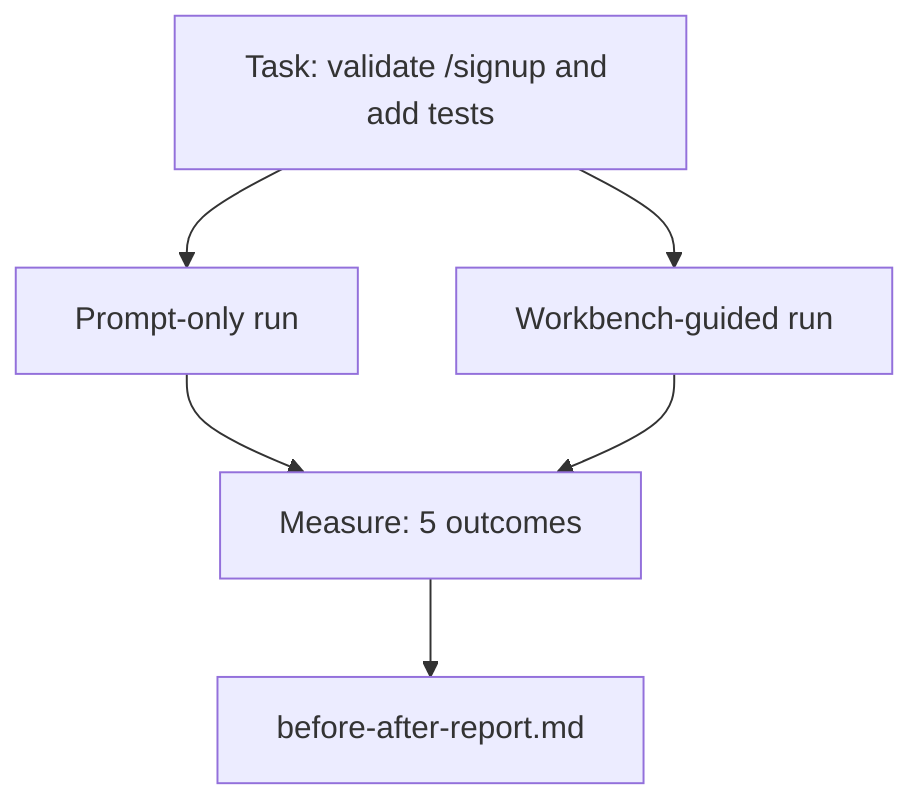

# El escritorio en un Real Repo

> El estudio de las superficies de las computadoras de computadora de computadora de computadora de computadora de computadora de computadora de computadora de computadora de computadora de computadora de computadora de computadora de computadora de computadora de computadora de computadora de computadora de computadora de computadora de computadora de computadora de computadora de computadora de computadora de computadora de computadora de computadora de computadora de computadora de computadora de computadora de computadora de computadora de computadora de computadora de computadora de computadora de computadora de computadora de computadora de computadora de computadora de computadora de computadora de computadora de computadora de computadora de computadora de computadora de computadora de computadora de computadora de computadora de computadora de computadora de computadora de computadora de computadora de computadora de computadora de computadora de computadora de computadora de computadora de computadora de computadora de computadora de computadora de computadora de computadora de computadora de computadora de computadora de computadora de computadora de computadora de computadora de computadora de computadora de computadora de computadora de computadora de computadora de computadora de computadora de computadora de computadora de computadora de computadora de computadora de computadora de computadora de computadora de computadora de computadora de computadora de computadora de computadora de computadora de computadora de computadora de computadora de computadora de computadora de computadora de computadora de computadora de computadora de computadora de computadora de computadora de computadora de computadora de computadora de computadora de computadora de computadora de computadora de computadora de computadora de computadora de computadora de computadora de computadora de computadora de computadora de computadora de computadora de computadora de computadora de computadora de computadora de computadora de computadora de computadora de computadora de computadora de computadora de computadora de computadora de computadora de computadora de computadora de computadora de computadora de computadora de computadora de computadora de computadora de computadora de computadora de computadora de computadora de computadora de computadora de computadora de computadora de computadora de computadora de computadora de computadora de computadora de computadora de computadora de computadora de computadora de

**Type:** Build | **类型:** 构建
**Languages:** Python (stdlib) | **语言:** Python (标准库)
**Prerequisites:** Phases 14 · 32 to 14 · 40 | **前置知识:** 见原文
**Time:** ~60 minutes | **时间:** 见原文

> ¿ Qué es esto ?**【前置】**學本節前请先掌握:Fase 14·32-40 全部(Workbench 系列 9 节)  本节是工作台的实战综合在真实小项目上跑只快速对比
> ¿ Qué es esto ?**【类比】**En el primer capítulo, el libro de la serie de libros de la revista The New York Times, publicado en julio de 2012, se trata de un libro de la revista The New York Times, que se publica en la revista The New York Times, en el que se dice que el libro de la revista The New York Times es un libro de la revista The New York Times.

## Objetivos de aprendizaje

- Reúnese las siete superficies de la mesa de trabajo en una pequeña aplicación.
- Realice la misma tarea dos veces (solo en forma rápida y guiada por el banco de trabajo) y mide cinco resultados.
- Lea el informe antes/después y decide qué superficies han dado mayor influencia.
- Defender el banco de trabajo contra un "pero mi modelo es lo suficientemente bueno" rechazo.

## El problema es la introducción del problema

La prueba de una tarea de juguete no convence a nadie. La prueba para el escritorio se hace cuando una tarea real en un repo real se pone en producción con menos fallos, menos retrocesos y un paquete que la próxima sesión puede usar.

> La presentación de tareas de juguete no convence a nadie. La razón de la plataforma de trabajo es ejecutar una tarea de verdad en un almacén de sentido real, con menos fracasos, menos revueltos y la siguiente sesión en la que se puede utilizar el paquete de producción.

Esta lección hace que el reporte sea real y ejecuta la misma tarea a través de ambas líneas de conducto.

> Esta clase proporciona un almacén de la verdadera sensación, y a través de dos canales de operación de la misma tarea.


> **【中文解读】**Este capítulo presenta las mejores prácticas y estrategias de implementación del medio ambiente de producción.

## El concepto central.




> **【中文解读】**Para ello, el proyecto de trabajo de un agente se utiliza en un almacén de códigos reales. El almacén real trae los siguientes desafíos: 1) la escala de miles de archivos de códigos que superan las ventanas de abajo; 2) la complejidad de varios idiomas; 3) la complejidad de los conjuntos de pruebas y las fragilidades de los CI.

### La aplicación muestra

Un manipulador de estilo FastAPI mínimo en `sample_app/`¿Qué es esto ?

- `app.py`con`/signup`(todavía no se ha validado).
- `test_app.py`con una prueba de camino feliz.
- `README.md`y `scripts/release.sh`como cebo de la zona prohibida.

### La tarea

> Añadir validación de entrada a `/signup`: rechazar las contraseñas más cortas de 8 caracteres, devolver 422 con un sobre de error de tipografía. Añadir una prueba que demuestre el nuevo comportamiento.

### Las dos tuberías

Sólo de inmediato:

1. Lea el README.
2. Leer .`app.py`¿ Qué ?
3. Editar archivos.
4. La reclamación está hecha.

Guía de trabajo en el escritorio:

1. Ejecutar el guión init (lección 35).
2. Leer el alcance del contrato (lección 36).
3. El estado de lectura (lección 34).
4. Sólo se permiten archivos de edición.
5. Ejecutar el comando de aceptación a través de un ejecutor de retroalimentación (lección 37).
6. Ejecutar la puerta de verificación (lección 38).
7. Revisor de ejecuciones (lección 39).
8. Generar la transmisión (lección 40).

### Los cinco resultados medidos

| Outcome | Why it matters |
|---------|----------------|
| `tests_actually_run` | Most "tests passed" claims are unverifiable |
| `acceptance_met` | The test that proves the goal must be the test that ran |
| `files_outside_scope` | Scope creep is the dominant silent failure |
| `handoff_quality` | The next session pays for or benefits from this |
| `reviewer_total` | Qualitative judgment on top of the gate |

## Construye y realiza.
```figure
wb-ab-runs
```

## Construye el mismo

`code/main.py`La aplicación de la muestra de la aplicación de la misma línea de conducción de la red de conducción de la red de conducción de la red de conducción de la red de conducción de la red de conducción de la red de conducción de conducción de conducción de conducción de conducción de conducción de conducción de conducción de conducción de conducción de conducción de conducción de conducción de conducción de conducción de conducción de conducción de conducción de conducción de conducción de conducción de conducción de conducción de conducción de conducción de conducción de conducción de conducción de conducción de conducción de conducción de conducción de conducción de conducción de conducción de conducción de conducción de conducción de conducción de conducción de conducción de conducción de conducción de conducción de conducción de conducción de conducción de conducción de conducción de conducción de conducción de conducción de conducción de conducción de conducción de conducción de conducción de conducción de conducción de conducción de conducción de conducción de conducción de conducción de conducción de conducción de conducción de conducción de conducción de conducción de conducción de conducción de conducción de conducción de conducción de conducción de conducción de conducción de conducción de conducción de conducción de conducción de conducción de conducción de conducción de conducción de conducción de conducción de conducción de conducción de conducción de conducción de conducción de conducción de conducción de conducción de conducción de conducción de conducción de conducción de conducción de conducción de conducción de conducción de conducción de conducción de conducción de conducción de conducción de conducción de conducción de conducción de conducción de conducción de conducción de conducción de conducción de conducción de conducción de conducción de conducción de conducción de conducción de conducción de conducción de conducción de conducción de conducción de conducción de conducción de conducción de conducción de conducción de conducción de conducción de conducción de conducción de conducción de conducción de conducción de conducción de conducción de conducción de conducción de conducción de conducción de conducción de conducción de conducción de conducción de conducción de conducción de conducción de conducción`before-after-report.md`y `comparison.json`¿ Qué ?

> Real Warehouse Workbench colocará a un agente en un almacén real para realizar pruebas y mejoras. Este es el paso clave del entorno de los juguetes al entorno de producción.

- ¿Qué quieres decir ?

```
python3 code/main.py
```

Resultado: una tabla de consola de resultados por pipeline, el informe de marcaje guardado junto al script, y el JSON para quien quiera trazarlo.

> Real Warehouse Workbench colocará a un agente en un almacén real para realizar pruebas y mejoras. Este es el paso clave del entorno de los juguetes al entorno de producción.

## Modelos de producción en la naturaleza

La pregunta del escéptico es "¿en qué medida ayuda realmente el escritorio?" Los números de 2026 dicen mucho más que la explicación.

> Real Warehouse Workbench colocará a un agente en un almacén real para realizar pruebas y mejoras. Este es el paso clave del entorno de los juguetes al entorno de producción.

**Terminal Bench Top-30 to Top-5 on the same model.***Anatomía de un arnés de agente de LangChain* (abril de 2026): un agente de codificación saltó de fuera de los 30 primeros a la posición cinco en Terminal Bench 2.0 cambiando sólo el arnés. El mismo modelo. Superficies diferentes.

**Vercel 80% to 100% by deleting tools.**Vercel informó que eliminó el 80% de las herramientas de su agente movió la tasa de éxito del 80% al 100%.

**Harvey 2x accuracy via harness alone.**Los agentes legales duplicaron su precisión a través de la optimización del arnés, sin cambios en el modelo.

**88% of enterprise AI agent projects fail to reach production.**El artículo preprints.org *Harness Engineering for Language Agents* (marzo 2026) traza los fallos hasta el tiempo de ejecución, no el razonamiento: estado obsoleto, retos frágiles, contexto superado, mala recuperación de errores intermedios.

**Long-context collapse.**El éxito de base de WebAgent del 40-50% cae a menos del 10% en condiciones de contexto largo, principalmente a partir de bucles infinitos y pérdida de objetivos.

**False negatives still exist.**Las tareas de un solo paso, las líneas de una sola línea, las ejecuciones de formatador, cualquier cosa que el modelo haya memorizado literalmente  estas se ejecutan más rápido en el momento de la solicitud.

El resultado no es que el arnés gane para siempre. Los modelos absorben los trucos de arnés con el tiempo. El resultado es que hoy en día, la carga de ingeniería se encuentra en las siete superficies, y los números lo prueban.

> Real Warehouse Workbench colocará a un agente en un almacén real para realizar pruebas y mejoras. Este es el paso clave del entorno de los juguetes al entorno de producción.

## Usalo con el marco de ejecución

Esta lección es el expediente del caso que citas cuando:

- Alguien pregunta por qué cada PR lleva un`agent-rules.md`y un contrato de alcance.
- Un equipo quiere dejar caer la puerta de verificación "solo para este sprint".
- Un nuevo producto de agente se lanza y necesitas un punto de referencia portátil para saber si realmente ahorra tiempo.

Los números van más allá de la explicación.

## Envíe el producto .

`outputs/skill-workbench-benchmark.md`es un arnés portátil de evaluación que ejecuta cualquier producto de agente a través de ambas tuberías contra la propia aplicación de muestra de un proyecto y informa los cinco resultados.

> Real Warehouse Workbench colocará a un agente en un almacén real para realizar pruebas y mejoras. Este es el paso clave del entorno de los juguetes al entorno de producción.

## Los ejercicios.

1. Añadir un sexto resultado: tiempo a primera edición significativa. ¿Cómo lo mide limpio?
  En inglés, "pensar y practicar" significa "pensar y practicar".
2. Haga la comparación de una tarea real del segundo día en su base de códigos. ¿Dónde se deslizan los números del escritorio?
  En inglés, "pensar y practicar" significa "pensar y practicar".
3. Añadir un pase "falso negativo": tareas en las que sólo se podría haber hecho más rápido y el costo de la mesa de trabajo es real.
  En inglés, "pensar y practicar" significa "pensar y practicar".
4. ¿Qué resultados son más ruidosos?
  En inglés, "pensar y practicar" significa "pensar y practicar".
5. Autor de un resumen de una página dirigido a un no ingeniero. ¿Qué sobrevive al corte?
  En inglés, "pensar y practicar" significa "pensar y practicar".

## Términos clave .

| Term | What people say | What it actually means |
|------|----------------|------------------------|---|
| Sample app | "Toy repo" | Small but realistic enough to exercise all seven surfaces |  |
| Pipeline | "Workflow" | Ordered sequence of surface reads/writes the agent follows |  |
| Before/after report | "The receipts" | The artifact you hand to a skeptic |  |
| False negative | "Workbench overkill" | Tasks where prompt-only is faster; useful to enumerate honestly |  |
| Workbench benchmark | "Reliability score" | Portable harness that runs the comparison on your codebase |  |

## Más Leer más Leer más

- [LangChain, The Anatomy of an Agent Harness](https://blog.langchain.com/the-anatomy-of-an-agent-harness/) Recibo de la Terminal Bench Top-30 a Top-5
  En el caso de los niños, el nombre de la persona que se encuentra en el lugar de residencia es el de la persona que se encuentra en el lugar de residencia.
- [MongoDB, The Agent Harness: Why the LLM Is the Smallest Part of Your Agent System](https://www.mongodb.com/company/blog/technical/agent-harness-why-llm-is-smallest-part-of-your-agent-system) Números Vercel + Harvey
  En el caso de los niños, el nombre de la persona que se encuentra en el lugar de residencia es el de la persona que se encuentra en el lugar de residencia.
- [preprints.org, Harness Engineering for Language Agents](https://www.preprints.org/manuscript/202603.1756) 88% de las tasas de fracaso de las empresas, causas raíces del tiempo de ejecución
  En el caso de los niños, el nombre de la persona que se encuentra en el lugar de residencia es el de la persona que se encuentra en el lugar de residencia.
- [HN: Improving 15 LLMs at Coding in One Afternoon. Only the Harness Changed](https://news.ycombinator.com/item?id=46988596) Replicado en 15 modelos
  En el caso de los niños, el nombre de la persona que se encuentra en el lugar de residencia es el de la persona que se encuentra en el lugar de residencia.
- [Cloudflare, Orchestrating AI Code Review at Scale](https://blog.cloudflare.com/ai-code-review/) 131 mil vueltas de revisión / 30 días de producción
  En el caso de los niños, el nombre de la persona que se encuentra en el lugar de residencia es el de la persona que se encuentra en el lugar de residencia.
- [Anthropic, Building Effective Agents](https://www.anthropic.com/research/building-effective-agents)
  En el caso de los niños, el nombre de la persona que se encuentra en el lugar de residencia es el de la persona que se encuentra en el lugar de residencia.
- Fases 14 · 32 a 14 · 40  las superficies de esta lección ejercicios de extremo a extremo
- Fase 14 · 19  SWE-bench, GAIA, AgentBench como los macrolombres de referencia esta lección complementa
- Fase 14 · 30  desarrollo de un agente basado en la evaluación de los mismos enchufes de arnés en
