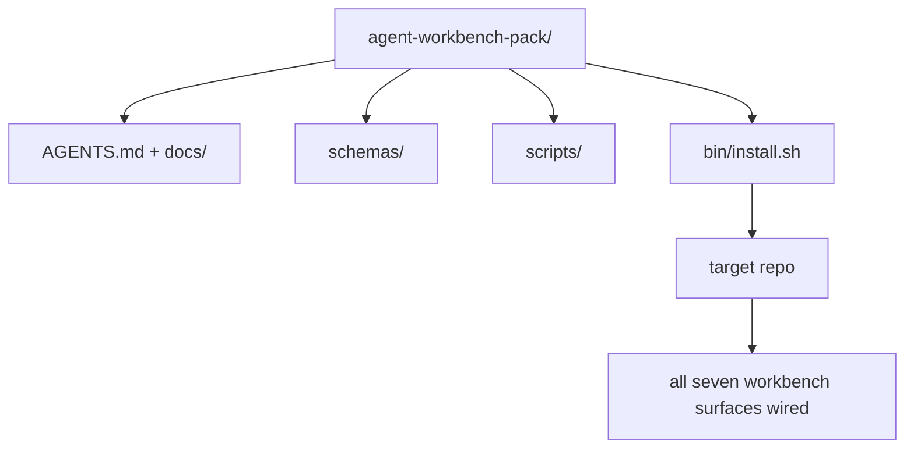

# Envía un paquete de trabajo de agente reutilizable .

> La mini-track termina con un paquete que se deja en cualquier repo. once lecciones de superficies comprimidas en un directorio que se puede`cp -r`La piedra angular es el artefacto del currículo.

**Type:** Build | **类型:** 构建
**Languages:** Python (stdlib) | **语言:** Python (标准库)
**Prerequisites:** Phases 14 · 31 to 14 · 41 | **前置知识:** 见原文
**Time:** ~75 minutes | **时间:** 见原文

> ¿ Qué es esto ?**【前置】**学本节前请先掌握:Fase 14·31-41 全部 11 节 课程. 本节是Fase 14的 Capstone.
> ¿ Qué es esto ?**【类比】**En el caso de los paquetes de piedra, los paquetes de la cocina están en un recipiente.`cp -r`En el día siguiente, el agente puede trabajar con confianza. Así es como se piensa en el "despacho de trabajo" de Claude Code, Cursor, etc.

## Objetivos de aprendizaje

- Envuelve las siete superficies de la mesa de trabajo en un directorio de entrada.
- Enlaza los esquemas, scripts y plantillas para que un nuevo repo obtenga una base conocida.
- Añadir un único script de instalación que coloque el paquete de forma idempotente.
- Deciden qué queda en el paquete y qué queda fuera, defendiendo el corte para cada uno.

## El problema es la introducción del problema

Un banco de trabajo que vive en un Google Doc, un historial de chat y tres scripts medio recordados es un banco de trabajo que se reconstruye cada trimestre. La cura es un paquete de versiones: un repo o directorio con las superficies, los esquemas, los scripts y un instalador de un solo comando.

> Una plataforma de trabajo que existe en Google 文档、聊天历史和三半记忆脚本 es una plataforma de trabajo que debe reconstruirse cada trimestre──修复 es un paquete de versión: una que contiene superficie、 esquema、脚本和一个命令安装器的仓库或目录──

Terminará esta lección con`outputs/agent-workbench-pack/`enviado en disco y un `bin/install.sh`que lo deja en cualquier repo objetivo.

> Te entregaré en disco al final de la clase.`outputs/agent-workbench-pack/`Y uno `bin/install.sh`, puede colocarlo en cualquier almacén objetivo.


> **【中文解读】**Agencia trabajo de banco de trabajo 顶点项目:将将前面 11 课的所有概念整合到一个完整的编码 Agent 中──该 Agent 能够: 1) comprender la estructura y约定 del proyecto; 2) ejecutar las modificaciones limitadas de su alcance; 3) ejecutar la verificación de la prueba; 4) pasar por el examinador Agent 质检; 5) mantener el estado del proyecto.

## El concepto central.




> **【中文解读】**Este capítulo presenta el concepto y el método de realización de un agente de IA. El agente es un sistema autónomo impulsado por el LLM, capaz de observar el medio ambiente, pensar en decisiones, ejecutar acciones y ciclos de generación hasta la finalización de los objetivos.

### El diseño del paquete

```
outputs/agent-workbench-pack/
├── AGENTS.md
├── docs/
│   ├── agent-rules.md
│   ├── reliability-policy.md
│   ├── handoff-protocol.md
│   └── reviewer-rubric.md
├── schemas/
│   ├── agent_state.schema.json
│   ├── task_board.schema.json
│   └── scope_contract.schema.json
├── scripts/
│   ├── init_agent.py
│   ├── run_with_feedback.py
│   ├── verify_agent.py
│   └── generate_handoff.py
├── bin/
│   └── install.sh
└── README.md
```

### Lo que se queda dentro, lo que se queda fuera

En:

- Es el contrato.
- Los cuatro guiones de arriba son el tiempo de ejecución.
- Los cuatro documentos son las reglas y la rúbrica.

Fuera:

- Las tareas pertenecen a la tabla del repo objetivo, no al paquete.
- El paquete es agnóstico.
- La manada vive junto a la manada del equipo, no dentro de ella.

### El instalador

Un corto .`bin/install.sh`(o `bin/install.py`):

1. Se niega a instalar en un paquete existente sin `--force`¿ Qué ?
2. Copia el paquete en el repo objetivo.
3. Los cables de CI si un `.github/workflows/`¿Qué es eso?
4. Imprima los siguientes pasos: rellene el tablero, establece comandos de aceptación, ejecuta el script init.

### La versión

El paquete lleva un`VERSION`Los cambios de esquema y los cambios de guión que requieren migraciones golpean el mayor.`agent_state.json`registros de la versión del paquete contra la que se inició.

> Agencia Workbench 毕业项目综合运用阶段 14 所有知识, construir un agente de producción en un almacén de código real.

## Construye y realiza.
```figure
wb-pack-install
```

## Construye el mismo

`code/main.py`se ensambla el paquete en `outputs/agent-workbench-pack/`junto a la lección, sembrado con los esquemas y guiones de las lecciones anteriores en esta mini-track y los documentos que ya escribió.

> Agencia Workbench 毕业项目综合运用阶段 14 所有知识, construir un agente de producción en un almacén de código real.

- ¿Qué quieres decir ?

```
python3 code/main.py
```

El guión copia y pin las superficies, escribe el README, imprime el árbol de paquete y sale de cero.

> Agencia Workbench 毕业项目综合运用阶段 14 所有知识, construir un agente de producción en un almacén de código real.

## Modelos de producción en la naturaleza

Un paquete sólo es valioso si sobrevive a horquillas, actualizaciones y un poco hostiles aguas arriba.

> Agencia Workbench 毕业项目综合运用阶段 14 所有知识, construir un agente de producción en un almacén de código real.

**`VERSION` is the contract, not the marketing.**Los problemas principales requieren una migración de estado. los problemas menores requieren una revisión de control. los problemas de parche son sólo de doc. el instalador escribe`.workbench-version`en el repo objetivo en cada instalación; `lint_pack.py`se niega a enviar si la cerradura del objetivo no está de acuerdo con la de la manada `VERSION`Así es como ...`npm`¿ Qué ?`Cargo`, y `pyproject.toml`sobrevivir 10 años de trabajo, nada sobre los agentes cambia las reglas.

**Single source for cross-tool distribution.**Nx barcos uno `nx ai-setup`que se establece `AGENTS.md`¿ Qué ?`CLAUDE.md`¿ Qué ?`.cursor/rules/`¿ Qué ?`.github/copilot-instructions.md`El paquete debe hacer lo mismo; el instalador emite los enlaces de signos (`ln -s AGENTS.md CLAUDE.md`La forma en que se puede utilizar un sistema de codificación es de una manera única, por lo que una sola fuente de verdad se expone a cada agente de codificación.

**`uninstall.sh` that refuses on non-trivial state.**Desinstalar el paquete no debe eliminar los datos del usuario `agent_state.json`¿ Qué ?`task_board.json`, o`outputs/`El desinstalador elimina los esquemas, scripts, documentos y...`AGENTS.md`(con `--keep-agents-md`El Estado pertenece al usuario; el paquete no es su propietario.

**Skill-as-publishable. SkillKit-style distribution.**Los paquetes se envían como una habilidad de SkillKit: `skillkit install agent-workbench-pack`La base de datos es la fuente de la verdad, SkillKit es el canal de distribución, el bloqueo de vendedor se derrumba, las siete superficies permanecen iguales.

## Usalo con el marco de ejecución

Tres lugares los barcos de paquete:

- **As a directory you drop into a repo.** `cp -r outputs/agent-workbench-pack /path/to/repo`¿ Qué ?
- **As a public template repo.**Forja y personalización, con `VERSION`control de la deriva.
- **As a SkillKit skill.**Encableado en el producto de tu agente para que un solo comando lo establezca.

El paquete es la receta, cada instalación es una porción.

> Agencia Workbench 毕业项目综合运用阶段 14 所有知识, construir un agente de producción en un almacén de código real.

## Envíe el producto .

`outputs/skill-workbench-pack.md`genera un paquete adaptado al proyecto: reglas ajustadas a la historia del equipo, globos de alcance ajustados al repo, dimensiones de rubrica ampliadas con una entrada específica de dominio.

> Agencia Workbench 毕业项目综合运用阶段 14 所有知识, construir un agente de producción en un almacén de código real.

## Los ejercicios.

1. Decida cuál de los quintos documentos opcionales merece ser ascendido a la lista canónica.
  En inglés, "pensar y practicar" significa "pensar y practicar".
2. Reescribir el instalador como Python con un `--dry-run`Comparar la ergonomía con la de Bash.
  En inglés, "pensar y practicar" significa "pensar y practicar".
3. Añadir un`bin/uninstall.sh`¿Qué es lo que cuenta como no trivial?
  En inglés, "pensar y practicar" significa "pensar y practicar".
4. Añadir un`lint_pack.py`que falla cuando el paquete se deriva de `VERSION`- Envíala a la CI para el propio reporte del paquete.
  En inglés, "pensar y practicar" significa "pensar y practicar".
5. ¿Cuál es el orden de operaciones que minimiza el tiempo de inactividad?
  En inglés, "pensar y practicar" significa "pensar y practicar".

## Términos clave .

| Term | What people say | What it actually means |
|------|----------------|------------------------|---|
| Workbench pack | "The starter kit" | A versioned directory carrying all seven surfaces |  |
| Installer | "Setup script" | `bin/install.sh` that lays the pack down idempotently |  |
| Pack version | "VERSION" | Major bumps for schema/script changes, patch for doc-only |  |
| Drop-in pack | "cp -r and go" | Pack works without per-repo customization on day one |  |
| Forkable template | "GitHub template" | Public repo that GitHub's "Use this template" can clone from |  |

## Más Leer más Leer más

- Fases 14 · 31 a 14 · 41  cada superficie que este paquete envuelve
- [SkillKit](https://github.com/rohitg00/skillkit) instalar esta habilidad en 32 agentes de IA
  En el caso de los niños, el nombre de la persona que se encuentra en el lugar de residencia es el de la persona que se encuentra en el lugar de residencia.
- [Nx Blog, Teach Your AI Agent How to Work in a Monorepo](https://nx.dev/blog/nx-ai-agent-skills) Generador de un solo origen en seis herramientas
  En el caso de los niños, el nombre de la persona que se encuentra en el lugar de residencia es el de la persona que se encuentra en el lugar de residencia.
- [agents.md — the open spec](https://agents.md/) lo que debe implementar el router de su paquete
  En el caso de los niños, el nombre de la persona que se encuentra en el lugar de residencia es el de la persona que se encuentra en el lugar de residencia.
- [HKUDS/OpenHarness](https://github.com/HKUDS/OpenHarness) Implementación de referencia de un equivalente de envasado
  En el caso de los niños, el nombre de la persona que se encuentra en el lugar de residencia es el de la persona que se encuentra en el lugar de residencia.
- [andrewgarst/agentic_harness](https://github.com/andrewgarst/agentic_harness) Referencia respaldada por Redis con suite eval
  En el caso de los niños, el nombre de la persona que se encuentra en el lugar de residencia es el de la persona que se encuentra en el lugar de residencia.
- [Augment Code, A good AGENTS.md is a model upgrade](https://www.augmentcode.com/blog/how-to-write-good-agents-dot-md-files) la barra de calidad de los documentos de empaque
  En el caso de los niños, el nombre de la persona que se encuentra en el lugar de residencia es el de la persona que se encuentra en el lugar de residencia.
- [Anthropic, Effective harnesses for long-running agents](https://www.anthropic.com/engineering/effective-harnesses-for-long-running-agents)
  En el caso de los niños, el nombre de la persona que se encuentra en el lugar de residencia es el de la persona que se encuentra en el lugar de residencia.
- [Anthropic, Harness design for long-running application development](https://www.anthropic.com/engineering/harness-design-long-running-apps)
  En el caso de los niños, el nombre de la persona que se encuentra en el lugar de residencia es el de la persona que se encuentra en el lugar de residencia.
- Fase 14 · 30  Desarrollo de agente basado en la evaluación que consume la puerta de verificación del paquete
- Fase 14 · 41  el índice de referencia antes/después de este paquete mejora en
