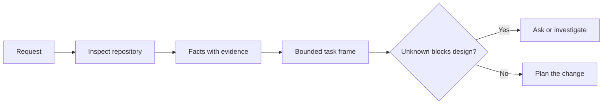

# Enmarca la tarea antes de que el agente escriba el código.

> Un agente de codificación puede implementar una tarea clara rápidamente. También puede implementar una tarea poco clara rápidamente. La velocidad es la misma. El costo no es.

> **【中文解读】**编码代理 实现清晰任务快速,实现模糊任务同样快速度,价格完全不同. 本课讲 写代码前的第一步:把一个模糊请求变成一个由仓库证据支、边界明确的任务框架 (任务框架)  任务框架. 任务框架. 任务框架. 任务框架. 任务框架. 任务框架. 任务框架. 任务框架. 任务框架. 任务框架. 任务框架. 任务框架. 任务框架. 任务框架. 任务框架. 任务框架. 任务框架. 任务框架. 任务框架. 任务框架. 任务框架. 任务框架. 任务框架. 任务框架. 任务框架. 任务框架. 任务框架. 任务框架. 任务框架. 任务框架. 任务框架. 任务框架. 任务框架. 任务框架. 任务框架. 任务框架. 任务. 任务. 任务. 任务. 任务. 任务. 任务. 任务. 任务. 任务. 任务. 任务. 任务. 任务. 任务. 任务. 任务. 任务. 任务. 任务. 任务. 任务. 任务. 任务. 任务. 任务. 任务. 任务. 任务. 任务. 任务. 任务. 任务. 任务. 任务. 任务. 任务. 任务. 任务. 任务. 任务. 任务. 任务. 任务. 任务. 任务. 任务. 任务. 任务. 任务. 任务. 任务. 任务. 任务. 任务. 任务. 任务. 任务. 任务. 任务. 任务. 任务. 任务. 任务. 任务. 任务. 任务. 任务. 任务. 任务. 任务. 任务. 任务. 任务. 任务.      任务.    任务.                                                          

> ¿ Qué es esto ?**【前置】**Se trata de un programa de formación de la clase que se desarrolla en el ámbito de la formación y de la formación profesional.`outputs/task-frame.md`Se convertirá en un plan de ejecución del apoyo de la prueba en el capítulo 44.

**Type:** Learn + Build | **类型:** 学习 + 动手实践
**Languages:** Python (stdlib) | **语言:** Python（标准库）
**Prerequisites:** Phase 14 lessons 31 and 36 | **前置知识:** Phase 14 第 31、36 课
**Time:** ~60 minutes | **时间:** 约 60 分钟

## Objetivos de aprendizaje

- Convierta una solicitud en un marco de tareas limitado antes de editar.
  En inglés, antes de editar una solicitud, se puede traducir en un marco de tareas de bordes.
- Separar los hechos de los repositorios de las suposiciones y las preguntas abiertas.
  Traducción:La situación de la bodega se diferencia entre el hecho y la hipótesis.
- Definir los caminos permitidos, los caminos prohibidos y la evidencia de aceptación.
  China: definición permitir el camino, prohibir el camino y aceptar los testimonios.
- Decida cuándo el reconocimiento es suficiente para comenzar el trabajo.
  En inglés, "Judge what time reconnaissance has sufficiently"", puedo empezar a moverme"".

## El fracaso caro, el fracaso caro.

 Añadir protección de correo electrónico duplicado suena específico. No lo es. ¿Es la singularidad parte de la API, servicio de dominio o base de datos? ¿Es la comparación sensible a los casos? ¿Qué forma de error ya es pública? ¿Es permitida una migración? ¿Qué prueba prueba demuestra el comportamiento?

> "¿Además de la protección de buzones" parece muy específico, en realidad no es específico. ¿La única naturaleza debe colocarse en la API, en el ámbito de los servicios o en la base de datos? ¿Comparar ¿hace distinción entre la escritura? ¿Qué tipo de estructura de error ya es un acuerdo público? ¿No se permite la migración de bases de datos? ¿Qué prueba puede demostrar este comportamiento?

Un agente capaz llenará esos vacíos con opciones plausibles. Ese es el caso peligroso porque la implementación puede ser limpia, probada y aún incompatible con el sistema.

> Un agente capaz utilizará una opción que parezca razonable para llenar estos vacíos. Esta es la situación peligrosa: lograr que pueda hacerse limpio, tener un sistema de pruebas, pero no ser compatible con el sistema entero.

La primera unidad de trabajo de agente de codificación no es, por lo tanto, una edición, sino un marco de tareas respaldado por pruebas de repositorio.

> Por lo tanto, la primera unidad del trabajo de un agente de codificación no es una edición única, sino un marco de tareas que se apoya en el archivo de pruebas.

> **【中文解读】**Costoso fracasoIncluye que no se ha escrito código mal, sino que se ha escrito código mal, pero la tarea se ha entendido mal. Agent no se va a cambiar por el problema de la tarea y se va a cambiar lentamente. El agente se va a tomar decisiones con confianza. Estos cambios son decisiones que usted toma.

## El marco de tareas.

Un marco útil tiene seis campos:

| Field | Question |
|---|---|
| Goal | What observable behavior must change? |
| Repository facts | What did you verify in code, tests, config, or history? |
| Allowed paths | Where may the change land? |
| Forbidden paths | What must remain untouched? |
| Acceptance evidence | Which commands or observations prove the goal? |
| Unknowns | Which decisions still need evidence or human judgment? |

> **【中文解读】**六个字段分别是: objetivos (what can be observed behavior must change) 仓库事实 (what can be observed behavior must change) 仓库事实 (what can be observed behavior must change) 仓库事实 (what can be observed behavior must change) 仓库事实 (what can be observed behavior must change) 仓库事实 (what can be observed behavior must change) 仓库事实 (what can be observed behavior must change) 仓库事实 (what can be observed behavior must change) 仓库事实 (what can be observed behavior must change) 仓库事实 (what can be observed behavior must change) 仓库事实 (what can be observed behavior must change) 仓库事实 (what can be observed behavior must change) 仓库事实 (what can be observed behavior must change) 仓库事事事事 (what can be observed behavior must change) 仓库事事事事 (what can be observed behavior must change) 仓库事事事事事 (what can be observed behavior changed) 仓库事事事事事 (what can be done) 仓库事事事事事) 仓库事事事事事事事 (what can be done) 仓库事 (what can be done) 仓库事) 仓库事 (what can be done done done done) 仓库事 (what can be done) 仓库事) 仓库事 (what can be done done done done) 仓库事) 仓库事 (what can be done done done done) 仓库事 (what can be done done done done) 仓库

Los datos necesitan recibos. La API utiliza 409 para duplicados no es un hecho hasta que puedas señalar la prueba o el procesador existente. Un camino de archivo y una línea son suficientes. Un resultado de comando es mejor cuando el comportamiento importa.

> Los hechos requieren un certificado. "La API para volver a repetir 409" no es un hecho antes de que se dirija a un test o procesador existente.



> ¿ Qué es esto ?**【类比】**任务框架像装修前的墙审批单:哪面墙能动(permitido caminos) 哪面是承重墙绝不能动 (绝不能承重墙绝不能动) 验收入住的标准是什么 (验收入住的标准是什么) 验收入住的标准是什么 (验收入住的标准是什么) 没有这张单子,装修队 (Agent) 动作越快,错墙的概率越大――

## El reconocimiento es una búsqueda de restricciones.

No lea todo el repositorio. Busque las superficies que restringen el cambio:

> No te metas en el almacén... y busca los verdaderos límites de este cambio.

1. El comportamiento actual y su llamador.
   El comportamiento actual y su código de uso.
2. El más cercano de los ensayos existentes.
   En inglés, el nombre de la especie es "Castor".
3. El contrato público o la forma serializada.
   China:                                                                                                                                                                                                                                                              
4. Las instrucciones del proyecto que rigen el camino.
   La ley de los agentes de la sociedad civil se ha extendido hasta el año 2000.
5. Los comandos de construcción y verificación.
   La construcción y la prueba de orden.
6. Cambios similares completados que revelan patrones locales.
   En el caso de los que se han realizado cambios, se revelan las costumbres locales.

Dejar de tomar decisiones cuando cada decisión planeada está respaldada por pruebas, delegada explícitamente o lista como desconocida.

> Cuando cada decisión de un plan tiene una evidencia de que está autorizada o está lista para un proyecto desconocido, se detiene la investigación.

> **【中文解读】**El propósito de la investigación no es comprender toda la biblioteca de código, sino buscar un conjunto: quién lo utiliza, qué tubo de prueba lo hace, cómo se escribe la práctica local.

## Lo desconocido no es un fracaso. Lo desconocido no es un fracaso.

Un desconocido es una brecha controlada. Una suposición es una respuesta no controlada a esa brecha.

> El desconocido es un hueco controlado; la hipótesis es una respuesta a este hueco sin control.

Clasifique cada desconocido:

- **Discoverable:**el repositorio o el sistema de ejecución pueden responderlo.
  En inglés:**可发现：**倉庫或运行中的系统能回答它──
- **Decidable:**el contrato de tarea otorga al agente la autoridad para elegir.
  En inglés:**可决定：**任务契约已授权 Agente 自行选择──
- **Human:**la elección cambia el comportamiento del producto, el costo, el riesgo o la compatibilidad pública.
  En inglés:**需人来定：**Esta opción cambiará el comportamiento del producto, el costo, el riesgo o la compatibilidad pública.
- **Deferred:**La elección está fuera de esta franja y pertenece a los no objetivos.
  En inglés:**可延后：**Esta opción no pertenece a esta pieza, debe ser puesta en su objetivo.

El agente debe continuar a través de los desconocidos descubrebles y delegados.

> Para los proyectos desconocidos que pueden ser descubiertos y autorizados, el agente debe continuar avanzando; para los proyectos desconocidos que necesitan ser determinados, el agente debe suspender su selección antes de que se sepulte en el código.

> **【中文解读】**Cuatro tipos de tratamiento son: análisis de descubrimientos, selección de decisiones, pre-esfuerzos, observaciones y observaciones de los individuos. El más probable es que el tercer tipo de agente oculto tome una decisión de producto en la que se haga una evaluación de la persona.

## Acceptación antes de la implementación.

Escriba la prueba antes del parche.

> Antes de escribir prueba, volver a escribir complemento.

- un comando de ensayo de unidad o integración enfocado;
  Un orden de ensayo de unidad o de ensayo de concentración.
- un viaje en el navegador con un puerto de visión denominado y el estado esperado;
  Traducción: una vez indicando el estado de la página y el estado esperado del navegador de operación;
- una solicitud electrónica y un contrato de respuesta exacta;
  Traducción: una línea sobre la petición y el acuerdo de respuesta exacto;
- una medición de rendimiento con un umbral;
  La calidad de la producción de la máquina de la máquina de la máquina de la máquina de la máquina de la máquina de la máquina de la máquina de la máquina de la máquina de la máquina de la máquina de la máquina de la máquina de la máquina de la máquina de la máquina de la máquina de la máquina de la máquina de la máquina de la máquina de la máquina de la máquina de la máquina de la máquina de la máquina de la máquina de la máquina de la máquina de la máquina de la máquina de la máquina de la máquina de la máquina de la máquina de la máquina de la máquina de la máquina de la máquina de la máquina de la máquina de la máquina de la máquina de la máquina de la máquina de la máquina de la máquina de la máquina de la máquina de la máquina de la máquina de la máquina de la máquina de la máquina de la máquina de la máquina de la máquina de la máquina de la máquina de la máquina de la máquina de la máquina de la máquina de la máquina de la máquina de la máquina de la máquina de la máquina de la máquina de la máquina de la máquina de la máquina de la máquina de la máquina de la máquina de la máquina de la máquina de la máquina de la máquina de la máquina de la máquina de la máquina de la máquina de la máquina de la máquina de la máquina de la máquina de la máquina de la máquina de la máquina de la máquina de la máquina de la máquina de la máquina de la máquina de la máquina de la máquina de la máquina de la máquina de la máquina de la máquina de la máquina de la máquina de la máquina de la máquina de la máquina de la máquina de la máquina de la máquina de la máquina de la máquina de la máquina de la máquina de la máquina de la máquina de la máquina de la máquina de la máquina de la máquina de la máquina de la máquina de la máquina de la máquina de la máquina de la máquina de la máquina de la máquina de la máquina de la máquina de la máquina de la máquina de la máquina de la máquina de la máquina de la máquina de la máquina de la máquina de la máquina de la máquina de la máquina de la máquina de.
- una verificación del alcance que confirme que no se ha modificado ningún archivo no relacionado.
  Un análisis de alcance de la información.

Cumplir las pruebas no es un plan de prueba.

> "El test ha pasado" no es un plan de prueba.

> **【中文解读】**                                                                                                                                                                                                                                                              

## Construye y realiza.

El laboratorio crea una`TaskFrame`, valida sus límites y pruebas, y escribe `outputs/task-frame.md`¿ Qué ?

> 实验部分会创建一个 `TaskFrame`, la prueba de sus fronteras y pruebas,并写出 `outputs/task-frame.md`¿Qué es eso?

Corre desde este directorio de lecciones:

```bash
python3 code/main.py
python3 -m unittest discover code/tests -v
```

Descompone el ejemplo de cuatro maneras: elimine el objetivo, elimine un recibo de hechos, superpone un camino permitido y prohibido y elimine el comando de aceptación. El validador debe rechazar cada marco por una razón diferente.

> Usar cuatro formas de destruir este ejemplo: eliminar el objetivo, eliminar un documento de hecho, permitir que los caminos y prohibir que los caminos se superpongan, eliminar las órdenes de aceptación, por diferentes razones, el examinador debe rechazar cada marco destruido.

## Usalo en un depósito real en un almacén real.

Antes de pedirle a un agente que edite:

> En hacer que el agente se mueva antes:

1. Escribe el objetivo como un comportamiento, no un cambio de archivo.
   Se trata de un documento que se ha escrito en un acto, en lugar de un documento que se ha modificado.
2. Registra dos o tres hechos con pruebas exactas.
   En el caso de los datos de datos, el registro de datos de datos de datos de datos de datos de datos de datos de datos de datos de datos de datos de datos de datos de datos de datos de datos de datos de datos de datos de datos de datos de datos de datos de datos de datos de datos de datos de datos de datos de datos de datos de datos de datos de datos de datos de datos de datos de datos de datos de datos de datos de datos de datos de datos de datos de datos de datos de datos de datos de datos de datos de datos de datos de datos de datos de datos de datos de datos de datos de datos de datos de datos de datos de datos de datos de datos de datos de datos de datos de datos de datos de datos de datos de datos de datos de datos de datos de datos de datos de datos de datos de datos de datos de datos de datos de datos de datos de datos de datos de datos de datos de datos de datos de datos de datos de datos de datos de datos de datos de datos de datos de datos de datos de datos de datos de datos de datos de datos de datos de datos de datos de datos de datos de datos de datos de datos de datos de datos de datos de datos de datos de datos de datos de datos de datos de datos de datos de datos de datos de datos de datos de datos de datos de datos de datos de datos de datos de datos de datos de datos de datos de datos de datos de datos de datos de datos de datos de datos de datos de datos de datos de datos de datos de datos de datos de datos de datos de datos de datos de datos de datos de datos de datos de datos de datos de datos de datos de datos de datos de datos de datos de datos de datos de datos de datos de datos de datos de datos de datos de datos de datos de datos de datos de datos de datos de datos de datos de datos de datos de datos de datos de datos de datos de datos de datos de datos de datos de datos de datos de datos de datos de datos de datos de datos de datos de datos de datos de datos de datos de datos de datos de datos de datos de datos de datos de datos de datos de datos de datos de datos de datos de datos de datos de datos de datos de datos de datos de datos de datos de datos de datos de datos de datos de datos de datos de datos de datos de datos de datos de datos de datos de datos de datos de datos de datos de datos de datos de datos de datos de
3. Nombre el conjunto de rutas más pequeño permitido.
   En inglés, el nombre de la colección mínima permite el camino.
4. Nombre el espacio negativo explícitamente.
   China: China: China: China: China: China: China: China: China: China: China: China: China: China: China: China: China: China: China: China: China: China: China: China: China: China: China: China: China: China: China: China: China: China: China: China: China: China: China: China: China: China: China: China: China: China: China: China: China: China: China: China: China: China: China: China: China: China: China: China: China: China: China: China: China: China: China: China: China: China: China: China: China: China: China: China: China: China: China: China: China: China: China: China: China: China: China: China: China: China: China: China: China: China: China: China: China: China: China: China: China: China: China: China: China: China: China: China: China: China: China: China: China: China: China: China: China: China: China: China: China: China: China: China: China: China: China: China: China: China: China: China: China: China: China: China: China: China: China: China: China: China: China: China: China: China: China: China: China: China: China: China: China: China: China: China: China: China: China: China: China: China: China: China: China: China: China: China: China: China: China: China: China: China: China: China: China: China: China: China: China: China: China: China: China: China: China: China: China: China: China: China: China: China: China: China: China: China: China: China: China: China: China: China: China: China: China: China: China: China: China: China: China: China: China: China: China: China: China: China: China: China: China: China: China: China: China: China: China: China: China: China: China: China: China: China: China: China: China: China: China: China: China: China: China: China: China: China: China: China: China: China: China: China: China:
5. Escriba el comando o observación que cierra la tarea.
   En inglés, "Cancelar" significa "arreglar" o "arreglar".
6. Enumera las decisiones que aún no has tomado.
   China: lista de personas que no tienen pruebas de que están en el país.

El marco debe encajar en una pantalla. Si no puede, la tarea puede contener múltiples cambios verificables de forma independiente.

> 任务框架应一屏放下. Si se deja, esta tarea es muy probable que contenga varios cambios independientes.

> **【中文解读】**Este es un plan de acción de la clase, que puede ser directamente insertado en su flujo de trabajo: objetivos de escritura de comportamiento, hechos con justificantes, permiten el camino de minimización, la manifestación de espacio negativo, la aceptación de órdenes de adelanto, la lista de asuntos indefinidos.

## Los ejercicios.

1. Enmarca un error real de uno de tus repositorios sin proponer una solución.
   China: en el mismo almacenes, escoger un verdadero error, hacer un marco, no puede proponer una solución.
2. Encuentra una afirmación en el marco que sea en realidad una suposición y reemplazala con evidencia.
   En el marco de la investigación, el estudio de la teoría de la realidad se ha desarrollado en el contexto de la teoría de la realidad.
3. Añadir un humano desconocido cuya respuesta cambiaría el contrato público.
   China: añadir un proyecto desconocido que necesite un hombre para determinar, su respuesta cambiará el acuerdo público.
4. Divide un camino amplio permitido en el conjunto de seguridad más pequeño.
   Se puede separar un camino de seguridad en un conjunto de seguridad mínimo.
5. Añadir un recibo de alcance a la prueba de aceptación.
   En inglés, el nombre de la persona que recibe el certificado de reconocimiento es el nombre de la persona que recibe el certificado de reconocimiento.

## Más Leer más Leer más

- [Nuseibeh and Easterbrook, Requirements Engineering: A Roadmap](https://www.cs.toronto.edu/~sme/papers/2000/ICSE2000.pdf), para anclar la aplicación a los objetivos del mundo real y las limitaciones en evolución.
  Nuseibeh y Easterbrook 需求工程:路线图如何实现定在真世界目标和演化中的约束上.
- [Yang et al., SWE-agent: Agent-Computer Interfaces Enable Automated Software Engineering](https://arxiv.org/abs/2405.15793), para demostrar que la interfaz alrededor de un agente codificador cambia su eficacia.
  El diseño de la interfaz alrededor de la agencia cambiará su efecto real.

## Lo que se conserva , se conserva el producto .

Mantenga .`outputs/task-frame.md`Es la entrada a la siguiente lección, donde el marco se convierte en un plan de ejecución respaldado por la evidencia.

> Mantener`outputs/task-frame.md`En la siguiente clase, el marco de tareas se convierte en un plan de ejecución basado en pruebas.
