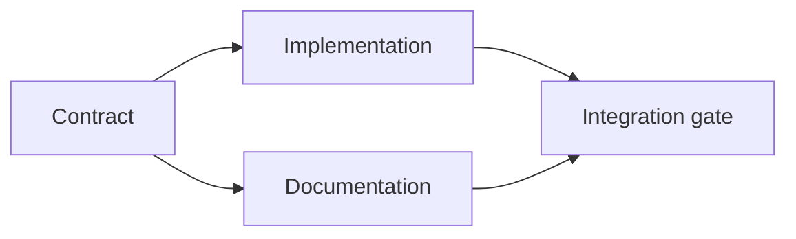

# Construye un plan de ejecución basado en pruebas.

> Un plan no es una lista de tareas más bonita, es un gráfico de dependencia en el que cada cambio tiene una razón y cada nodo terminal tiene una prueba.

> **【中文解读】**计划不是 una "mejor lista de espera", sino una gráfica de dependencia: cada cambio tiene razones, cada nodo terminal tiene pruebas, y cada uno de ellos tiene un marco de tareas.

> ¿ Qué es esto ?**【前置】**Previamente, aprenda la fase 14 del curso.`outputs/task-frame.md`)―本课产出 `outputs/evidence-plan.json`, será en la clase 45 para ser un agente de más de un contrato.

**Type:** Learn + Build | **类型:** 学习 + 动手实践
**Languages:** Python (stdlib) | **语言:** Python（标准库）
**Prerequisites:** Phase 14 lesson 43 | **前置知识:** Phase 14 第 43 课
**Time:** ~65 minutes | **时间:** 约 65 分钟

## Objetivos de aprendizaje

- Convierta un marco de tarea en elementos de trabajo con evidencia y prueba.
  Traducción en chino:把任务框架转化为带证据与证明的工作项.
- El ordenamiento de modelos como dependencias en lugar de secuencia de prosa.
  La traducción china es la siguiente: "Con la base de la historia, la historia se desarrolla".
- Detectar hechos faltantes, dependencias desconocidas y ciclos antes de editar.
  En la actualidad, el estudio de la falta de información y la falta de información se ha desarrollado en el contexto de la investigación y la investigación.
- Específicos que pueden correr juntos y otros que deben esperar.
  Sin embargo, el proceso de ejecución de la ley se puede realizar simultáneamente.

## ¿Por qué los planes de los agentes fracasan?

Los planes débiles repiten la solicitud en el tiempo futuro:

> 弱计划只是把请求复述成未来时:

1. Actualice la API.
   En inglés, el nombre de la API es "API".
2. Añadir pruebas.
   En inglés, "Casa de prueba".
3. Actualizar la documentación.
   En el caso de los niños, el número de niños en edad avanzada es de aproximadamente un millón.

Nada en esa lista dice lo que se encontró, por qué esos archivos son correctos, qué contrato cambia primero, o qué puede suceder simultáneamente.

> En esta lista no hay ninguna frase que explique: Descubra qué, por qué son estos documentos, qué pactos se han hecho, qué pasos pueden seguir.

> **【中文解读】**弱计划的特征是"复述请求"它看起来有序号、有动词,但没有一个仓库证据──强计划对每项工作做五个承诺──见下表:标识符、最小改动、证据、依赖、证明──缺任何一项, 代理都会使用自己的默认假设补位,返工在难免──强计划对每项工作做五个承诺.

Un plan sólido establece cinco compromisos para cada elemento de trabajo:

| Commitment | Purpose |
|---|---|
| Identifier | Stable reference for dependencies and handoff |
| Change | The smallest behavior or contract change |
| Evidence | Repository facts that justify the change |
| Dependencies | Work that must be true first |
| Proof | The exact check that closes the item |

> **【中文解读】**五个承诺分别是:标识符 (标识符) 转变 (转变) 转变 (转变) 转变 (转变) 转变 (转变) 转变 (转变) 转变 (转变) 转变 (转变) 转变 (转变) 转变 (转变) 转变 (转变) 转变 (转变) 转变 (转变) 转变 (转变) 转变 (转变) 转变 (转变) 转变 (转变) 转变 (转变) 转变 (转变) 转变 (转变) 转变 (转变) 转变 (转变) 转变 (转变) 转变 (转变) 转变 (转变) 转变 (转变) 转变 (转变) 转变 (转变) 转变 (转变) 转变 (转变) 转变 (转变) 转变 (转变) 转变 (转变) 转变 (转变) 转变 (转变) 转变) 转变 (转变) 转变 (转变) 转变 (转变) 转变) 转变 (转变) 转变 (转变) 转变) 转变 (转变) 转变 (转变) 转变) 转变 (转变) 转变) 转变 (转变) 转变 (转变) 转变) 转变 (转变) 转变 (转变) 转变) 转变 (转变) 转变)

## Planifica el contrato antes de su implementación.

Cuando varias superficies dependen del mismo comportamiento, definen el comportamiento primero. Las pruebas, la implementación, la documentación y la integración pueden compartir un contrato en lugar de inventar cuatro versiones.

> Cuando varias superficies dependen del mismo comportamiento, primero definen el comportamiento en sí mismo.

> ¿ Qué es esto ?**【类比】**契约先行如先定国标插头再生产电器.插座厂. 插座厂. 插座厂. 插座厂. 插座厂. 插座厂. 插座厂. 插座厂. 插座厂. 插座厂. 插座厂. 插座厂. 插座厂. 插座厂. 插座厂. 插座厂. 插座厂. 插座厂. 插座厂. 插座厂. 插座厂. 插座厂. 插座厂. 插座厂. 插座厂. 插座厂. 插座厂. 插座厂. 插座厂. 插座厂. 插座厂. 插座厂. 插座厂. 插座厂. 插座. 插座. 插座. 插座. 插座. 插座. 插座. 插座. 插座. 插座. 插座. 插座. 插座. 插座. 插座. 插座. 插座. 插座. 插座. 插座. 插座.



El gráfico expone la concurrencia segura. La implementación y la documentación pueden proceder juntos después de que se fije el contrato.

> Esta estrategia revela la seguridad y la seguridad de los puntos de desarrollo.

## La evidencia cambia el plan.

La evidencia de los repositorios no es decoración, debe ser capaz de cambiar la obra:

> DATA DE LA MAGINA no es un adorno. Tiene que tener la capacidad de cambiar el contenido del trabajo:

- Un ayudante existente elimina una nueva abstracción planeada.
  China: una función auxiliar ya existente, cortando los nuevos abstractos en el plan.
- Una prueba de compatibilidad obliga a una migración.
  Un ensayo de adaptación, que se ejecuta en un proceso de mudanza fuera del plan.
- Una restricción de implementación traslada un cambio de esquema a otra tarea.
  Un proyecto de trabajo, un proyecto de trabajo, un proyecto de trabajo, un proyecto de trabajo, un proyecto de trabajo, un proyecto de trabajo, un proyecto de trabajo, un proyecto de trabajo, un proyecto de trabajo, un proyecto de trabajo, un proyecto de trabajo, un proyecto de trabajo, un proyecto de trabajo, un proyecto de trabajo, un proyecto de trabajo, un proyecto de trabajo, un proyecto de trabajo, un proyecto de trabajo, un proyecto de trabajo, un proyecto de trabajo, un proyecto de trabajo, un proyecto de trabajo, un proyecto de trabajo, un proyecto de trabajo, un proyecto de trabajo, un proyecto de trabajo, un proyecto de trabajo, un proyecto de trabajo, un proyecto de trabajo, un proyecto de trabajo, un proyecto de trabajo, un proyecto de trabajo, un proyecto de trabajo, un proyecto de trabajo, un proyecto de trabajo, un proyecto de trabajo, un proyecto de trabajo, un proyecto de trabajo, un proyecto de trabajo, un proyecto de trabajo, un proyecto de trabajo, un proyecto de trabajo, un proyecto de trabajo, un proyecto de trabajo, un proyecto de trabajo, un proyecto de trabajo, un proyecto de trabajo, un proyecto de trabajo, un proyecto de trabajo, un proyecto de trabajo, un proyecto de trabajo, un proyecto de trabajo, un proyecto de trabajo, un proyecto de trabajo, un proyecto de trabajo, un proyecto de trabajo, un proyecto de trabajo, un proyecto de trabajo, un proyecto de trabajo, un proyecto de trabajo, un proyecto de trabajo, un proyecto de trabajo, un proyecto de trabajo, un proyecto de trabajo, un proyecto de trabajo, un proyecto de desarrollo de desarrollo de desarrollo de desarrollo de desarrollo de desarrollo de desarrollo de desarrollo de desarrollo de desarrollo de desarrollo de desarrollo de desarrollo de desarrollo de desarrollo de desarrollo de desarrollo de desarrollo de desarrollo de desarrollo de desarrollo de desarrollo de desarrollo de desarrollo de desarrollo de desarrollo de desarrollo de desarrollo de desarrollo de desarrollo de desarrollo de desarrollo de desarrollo de desarrollo de desarrollo de desarrollo de desarrollo de desarrollo de desarrollo de desarrollo de desarrollo de desarrollo de desarrollo de desarrollo de desarrollo de desarrollo de desarrollo de desarrollo de desarrollo de desarrollo de desarrollo de desarrollo de desarrollo de desarrollo de desarrollo de desarrollo de desarrollo de desarrollo de desarrollo de desarrollo de desarrollo de desarrollo de desarrollo de desarrollo de desarrollo de desarrollo de desarrollo de desarrollo de desarrollo de desarrollo de desarrollo de desarrollo de desarrollo de desarrollo de desarrollo de desarrollo de desarrollo de desarrollo de desarrollo de desarrollo de desarrollo de desarrollo de desarrollo de desarrollo de desarrollo de desarrollo de desarrollo de desarrollo de desarrollo de desarrollo de desarrollo de
- Un tipo de respuesta pública cambia el orden de ejecución y documentación.
  Un tipo de respuesta abierto, que cambia el orden anterior y posterior de la realización de los archivos.

Si la evidencia no puede cambiar el plan, probablemente no sea evidencia para esa decisión.

> Si la evidencia cambia no está planeada, la mayoría no es la evidencia de esta decisión.

> **【中文解读】**Este es un buen estándar de prueba falsa: poner "evidencia" a la decisión junto, preguntando "¿si al contrario, el plan cambiará?"

## Diseño para interrupción.

Las sesiones de agente de codificación terminan inesperadamente.

> 编码 经纪人会话意外结束──可继续运行的计划要求工作项足够小,小到另一个会话能够判断:

- cuál artículo está completo;
  中文翻译:哪个工作项已完成;
- que prueba se ha presentado;
  ¿Qué prueba ha corrido?
- los objetos que hayan cambiado;
  中文翻译: ¿qué han cambiado los productos?
- las dependencias que se desbloquean ahora;
  En español: ¿qué dependen de que se haya desbloqueado?
- ¿Cuál es el próximo elemento seguro?
  China: Next Security Job is what?

No codifique el estado sólo en las casillas de verificación dentro de un chat.

> No coloque el estado sólo codificado en el cuadro de selección del registro de chat.

> **【中文解读】**El programa debe ser colocado en el sistema de archivos como si el juego hubiera sido almacenado en el archivo. El artículo "cuáles pruebas han corrido" es especialmente clave: el programa no debe repetir una prueba demasiado costosa, ni debe saltar para pensar que ha corrido.

## Validación del plan.

Rechazar el plan antes de su ejecución cuando:

> En el caso de:

- se duplicará un identificador;
  En español: "El nombre de la persona que se ha identificado".
- un artículo de trabajo no tiene pruebas;
  Traducción:Tu trabajo no tiene pruebas.
- un artículo de trabajo no tiene prueba;
  Traducción:Un trabajo no tiene prueba.
- una dependencia nombra un elemento desconocido;
  Traducción:Un trabajo que depende de la ausencia de trabajo.
- el gráfico contiene un ciclo;
  Traducción:Depende de la naturaleza.
- la primera acción irreversible se produce antes de que se resuelva la incertidumbre pertinente.
  Primero, la incertidumbre que depende de él se resuelve antes.

Las primeras cinco verificaciones son mecánicas, la última requiere juicio y debe ser expresamente convocada.

> El examen es mecánico. La última se necesita de poder de juicio, debe ser claramente señalado.

> **【中文解读】**六条拒绝规则里藏藏着本课最重要的排序原则:不可逆动作 (transferir, eliminar, publicar, abrir y cerrar) debe ser eliminado después de su incertidumbre.

## Construye y realiza.

`code/main.py`Modela los elementos de trabajo, valida sus recibos, calcula las ondas de ejecución con una clasificación topológica y escribe `outputs/evidence-plan.json`¿ Qué ?

> `code/main.py`建模工作项、校验它们的证据、用拓排序计算执行波次,并写出 `outputs/evidence-plan.json`¿Qué es eso?

- ¿Qué quieres decir ?

> 运行:

```bash
python3 code/main.py
python3 -m unittest discover code/tests -v
```

El ejemplo produce tres ondas. La definición de contrato se ejecuta primero. La implementación y la documentación se ejecutan juntos. La puerta de integración se ejecuta después.

> Muestras de producción surgen en tres fases:

> **【中文解读】**"Boa" es una aplicación directa de la orden de trabajo: cada una de las fases del trabajo no depende de la otra, puede ser dividido entre diferentes agentes y ejecuciones;

## Usalo con un agente de codificación y con un agente de codificación

Pídale al agente que produzca el plan antes de cambiar los archivos.

> Que el agente en el cambio de documentos antes de producirse un plan.

1. Cada reclamo de camino y comportamiento tiene un recibo de depósito.
   China: traducción: Cada uno de los métodos y comportamientos tiene un título de almacén.
2. Cada artículo tiene una prueba clara de finalización.
   Traducción: Cada trabajo tiene una prueba de finalización clara.
3. El gráfico retrasa el trabajo costoso o irreversible hasta que se resuelva la incertidumbre de la que depende.
   Traducción:dependencia de un trabajo costoso o irreversible, retrasado hasta que se resuelva la incertidumbre de su dependencia.

Aprueba el plan, no una vaga promesa de ser cuidadoso.

> ˇ La aprobación de este plan, no es una frase de "Miento pequeño" 

## Los ejercicios.

1. Añadir un elemento de migración que requiera la aprobación humana explícita.
   China: añadir una necesidad de una autorización manifiesta de la migración de trabajo.
2. Crea un ciclo y explica el desacuerdo oculto de producto detrás de él.
   La producción de un ciclo depende de la producción y la producción de un producto.
3. Divide un elemento que tiene dos comandos de prueba.
   Se rompe el trabajo de una tarea de dos órdenes de prueba.
4. Añadir un elemento de trabajo que puede ejecutarse en la segunda ola sin tocar ninguna de las ramas existentes.
   China: añadir una puede en la segunda ola de funcionamiento, y no tocar dos artículos existentes en la división de trabajo.
5. Render el plan como Markdown mientras se mantiene JSON como la fuente de la verdad.
   Se trata de un proyecto de investigación que se ha desarrollado en el marco de la investigación de la investigación.

## Más Leer más Leer más

- [Nuseibeh and Easterbrook, Requirements Engineering: A Roadmap](https://www.cs.toronto.edu/~sme/papers/2000/ICSE2000.pdf), para la relación iterativa entre objetivos, especificaciones, acuerdo y evolución.
  En inglés, el nombre de la empresa es "Nuseibeh" y "Easterbrook".
- [Barry Boehm, A Spiral Model of Software Development and Enhancement](https://dl.acm.org/doi/10.1145/12944.12948), para ordenar el desarrollo en torno a la resolución de riesgos en lugar de una secuencia lineal fija.
  Traducción:Barry Boehm desarrolló un modelo de espiral en torno al desgaste del riesgo en lugar de un orden de desarrollo fijo.

## Lo que se conserva , se conserva el producto .

Mantenga .`outputs/evidence-plan.json`Se convierte en el contrato de delegación en la próxima lección.

> Mantener`outputs/evidence-plan.json`¡En la siguiente clase se convertirá en un convenio de encargo
