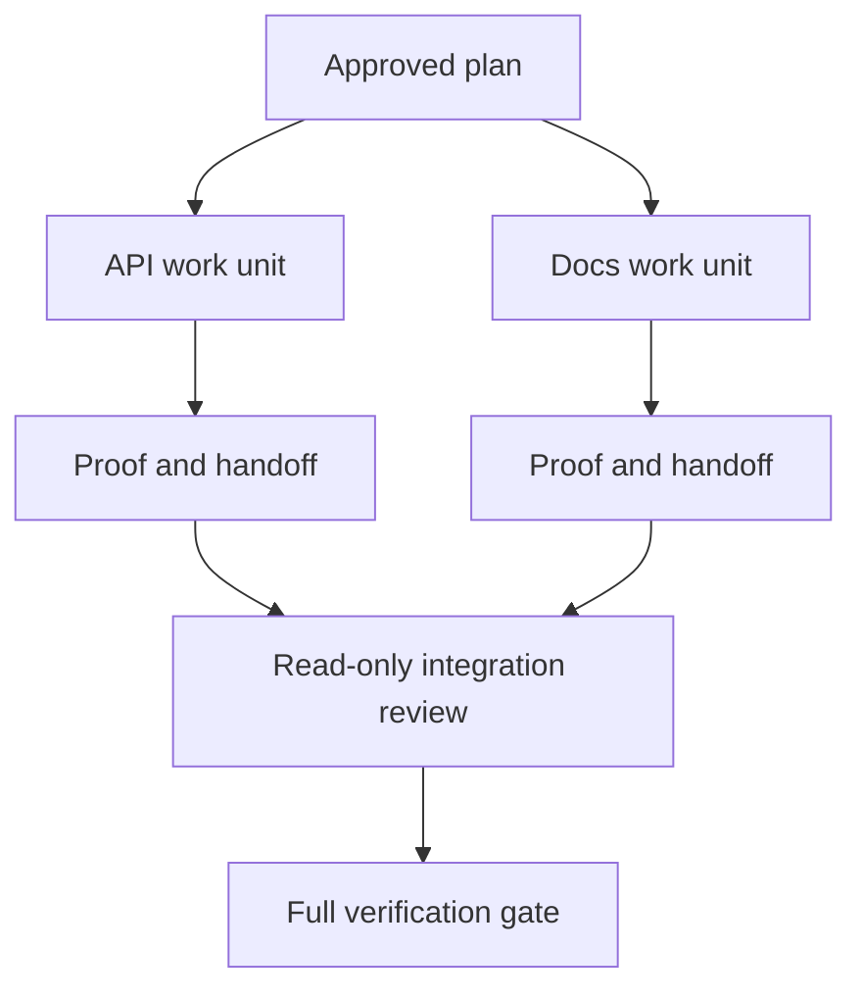

# Agente delegado Trabaja con contratos de aislamiento y fusión

> Los agentes paralelos ahorran tiempo en la pared sólo cuando el trabajo es independiente, de lo contrario convierte una tarea clara en un problema de coordinación con una tasa de fallo más rápida.

> **【中文解读】**En el caso de un agente de la empresa, el tiempo de trabajo es sólo un tiempo de sobra para trabajar de forma independiente; de lo contrario, transforma una tarea clara en un problema de coordinación, y fracasa más rápidamente.

> ¿ Qué es esto ?**【前置】**Previo a la clase, prevé dominar la fase 14 del curso. El examinador Agente. El integrador de este curso es la aplicación de la "separación constructor y marcador" en la fase de combinación.`outputs/evidence-plan.json`, de los cuales la ejecución de la serie de decisiones directas que los trabajadores pueden hacer`outputs/delegation-plan.json`, registro separado por qué es seguro , camino a quién , integración para recibir la prueba .

**Type:** Learn + Build | **类型:** 学习 + 动手实践
**Languages:** Python (stdlib) | **语言:** Python（标准库）
**Prerequisites:** Phase 14 lessons 39 and 44 | **前置知识:** Phase 14 第 39、44 课
**Time:** ~70 minutes | **时间:** 约 70 分钟

## Objetivos de aprendizaje

- Decidir si la delegación está justificada por una independencia real.
  Traducción:¿Jueces encargados de decidir si se han hecho realidad independiencias?
- Dar a cada trabajador la propiedad exclusiva del archivo y la prueba explícita.
  Traducción:Dá a cada trabajador un documento de propiedad y una prueba clara.
- Las ondas de ejecución de la computación de dependencias.
  En inglés, el nombre de la persona que se encuentra en el lugar de la persona que se encuentra en el lugar de la persona que se encuentra en el lugar de la persona que se encuentra en el lugar de la persona que se encuentra en el lugar de la persona que se encuentra en el lugar de la persona que se encuentra en el lugar de la persona que se encuentra en el lugar de la persona que se encuentra en el lugar de la persona que se encuentra en el lugar de la persona que se encuentra en el lugar de la persona que se encuentra en el lugar de la persona que se encuentra en el lugar de la persona que se encuentra en el lugar de la persona que se encuentra en el lugar de la persona.
- Diseñar un contrato de fusión para combinar el trabajo de los agentes de forma segura.
  En inglés, "design a security" significa "confitar a un agente de trabajo".

## La prueba de paralelismo y la prueba de la prueba.

No delegue porque hay más agentes disponibles. Delegue cuando al menos uno de estos es cierto:

> No se debe a que "hay más agentes disponibles" en el puesto de trabajo.

- dos investigaciones pueden responder de forma independiente a diferentes incógnitas;
  中文翻译:两项调查能独立回答不同的未知项;
- dos implementaciones poseen expedientes y contratos distintos;
  Traducción: Dos realizaciones de documentos y convenios que tienen mutuamente incompatibilidad;
- un revisor podrá inspeccionar un artefacto terminado sin modificarlo;
  Un revisor puede inspeccionar el producto terminado sin modificarlo;
- un control externo lento puede ejecutarse mientras se continúa el trabajo local.
  Un control externo de velocidad lenta puede funcionar simultáneamente en el trabajo local.

Mantenga el trabajo en serie cuando los agentes necesitan los mismos archivos, la misma decisión no resuelta o el mismo entorno mutante.

> Cuando varios agentes necesitan los mismos documentos, la misma decisión indecisa o el mismo entorno variable, mantener la línea.

> **【中文解读】**"Equipo de prueba" es la primera línea de este curso: la disponibilidad no es razón, la independencia es sólo. El punto común de los cuatro dictámenes es "no compartir el estado variable"  compartir es el documento  decidir o el ambiente, decidir que la并行 es  es el perjuicio.

## Una unidad de trabajo es un contrato.

Cada unidad delegada necesita:

> Cada unidad encargada necesita:

| Field | Meaning |
|---|---|
| Goal | One observable result |
| Owner | One accountable worker |
| Paths | Exclusive write ownership |
| Dependencies | Completed units required before starting |
| Proof | Exact evidence returned to the integrator |
| Handoff | Files changed, decisions made, remaining risk |

> **【中文解读】**六段里最关键是路径 (Pathes) 和证据 (Proof) 交交交给集成人确切证据) ‖"搞定后端"之所以不合格, es porque ya no tiene un camino de exclusión, ni prueba aceptable  responsabilidad no puede caer sobre un trabajador ‖ ‖ ‖ ‖ ‖ ‖ ‖ ‖ ‖ ‖ ‖ ‖ ‖ ‖ ‖ ‖ ‖ ‖ ‖ ‖ ‖ ‖ ‖ ‖ ‖ ‖ ‖ ‖ ‖ ‖ ‖ ‖ ‖ ‖ ‖ ‖ ‖ ‖ ‖ ‖ ‖ ‖ ‖ ‖ ‖ ‖ ‖ ‖ ‖ ‖ ‖ ‖ ‖ ‖ ‖ ‖ ‖ ‖ ‖ ‖ ‖ ‖ ‖ ‖ ‖ ‖ ‖ ‖ ‖ ‖ ‖ ‖ ‖ ‖ ‖ ‖ ‖ ‖ ‖ ‖ ‖ ‖ ‖ ‖ ‖ ‖ ‖ ‖ ‖ ‖ ‖ ‖ ‖ ‖ ‖ ‖ ‖ ‖ ‖ ‖ ‖ ‖ ‖ ‖ ‖ ‖ ‖ ‖ ‖ ‖ ‖ ‖ ‖ ‖ ‖ ‖ ‖ ‖ ‖ ‖ ‖ ‖ ‖ ‖ ‖ ‖ ‖ ‖ ‖ ‖ ‖ ‖ ‖ ‖ ‖ ‖ ‖ ‖ ‖ ‖ ‖ ‖ ‖ ‖ ‖ ‖ ‖ ‖ ‖ ‖ ‖ ‖ ‖ ‖ ‖ ‖ ‖ ‖ ‖ ‖ ‖ ‖ ‖ ‖ ‖ ‖ ‖ ‖ ‖ ‖ ‖ ‖ ‖ ‖ ‖ ‖ ‖ ‖ ‖ ‖ ‖ ‖ ‖ ‖ ‖ ‖ ‖ ‖ ‖ ‖ ‖ ‖ ‖ ‖ ‖ ‖ ‖ ‖ ‖ ‖ ‖ ‖ ‖ ‖ ‖ ‖ ‖ ‖ ‖ ‖ ‖ ‖ ‖ ‖ ‖ ‖ ‖ ‖

Hermanejar el backend no es una unidad de trabajo. Implementar el control de duplicados `app/accounts.py`y probarlo con la prueba de cuenta enfocada es.

> "Hicen un trabajo en el extremo final" no es una unidad de trabajo.`app/accounts.py`里实现重复检查,并使用聚焦的账户测试证明它"",才是.

## El aislamiento tiene tres capas separadas.

1. **Filesystem isolation:**Los árboles de trabajo o cajas de arena separados impiden las modificaciones compartidas accidentalmente.
   En inglés:**文件系统隔离：**独立工作树或沙箱防止意外的共享编辑──
2. **Ownership isolation:**Los contratos impiden que dos trabajadores editen intencionalmente el mismo camino.
   En inglés:**所有权隔离：**契约 prevenir dos trabajadores tiene intención de editar el mismo camino.
3. **State isolation:**Los registros y las salidas separados impiden que un trabajador sobreescribes la evidencia de otro trabajador.
   En inglés:**状态隔离：**独立日志与输出防止一个工人覆盖另一个工人的证据──

El aislamiento del sistema de archivos no resuelve la propiedad. Dos árboles de trabajo limpios pueden producir diseños contradictorios. El contrato de fusión debe resolver las interfaces compartidas antes de que comience el trabajo.

> 文件系统隔离解决不了所有权问题―― dos árboles de trabajo limpios 仍然可能产生相互冲突的设计――合并契约必须在开工之前就定定共享接口――

> **【中文解读】**Tres niveles de separación se han creído erroneamente "abrió el árbol de trabajo y terminó" pero el árbol de trabajo sólo evita choques accidentados, evita que dos trabajadores de cada tipo de conflicto se encuentren en el mismo nivel de propiedad; el día de la reunión es el nivel de la situación.



> 图解: el plan aprobado se descompone en dos unidades de trabajo, cada una de ellas entre las pruebas y las instrucciones de comunicación; los integrantes primero hacen sólo la evaluación, y finalmente ejecutan la prueba completa.

## El integrador no reconstruye el trabajo.

El integrador deberá:

> 集成者 debería:

1. confirmar que cada entrega coincide con su ámbito de aplicación asignado;
   Traducción: confirmar que cada relación coincide con el alcance de su distribución;
2. leer la prueba de salida, no sólo el resumen del trabajador;
   Traducción:Lea el texto en inglés.
3. combinar cambios en el orden de dependencia;
   Traducción:en la siguiente línea.
4. ejecutar la puerta transversal completa de la unidad;
   Traducción:Cambio de datos y datos de datos
5. rechazar la expansión oculta del alcance;
   La ley de la ley de la ley de la ley de la ley de la ley de la ley de la ley de la ley de la ley de la ley de la ley de la ley de la ley de la ley de la ley de la ley de la ley de la ley de la ley de la ley de la ley de la ley de la ley de la ley de la ley de la ley de la ley de la ley de la ley de la ley de la ley de la ley de la ley de la ley de la ley de la ley de la ley de la ley de la ley de la ley de la ley de la ley de la ley de la ley de la ley de la ley de la ley de la ley de la ley de la ley de la ley de la ley de la ley de la ley de la ley de la ley de la ley de la ley de la ley de la ley de la ley de la ley de la ley de la ley de la ley de la ley de la ley de la ley de la ley de la ley de la ley de la ley de la ley de la ley de la ley de la ley de la ley de la ley de la ley de la ley de la ley de la ley de la ley de la ley de la ley de la ley de la ley de la ley de la ley de la ley de la ley de la ley de la ley de la ley de la ley de la ley de la ley de la ley de la ley de la ley de la ley de la ley de la ley de la ley de la ley de la ley de la ley de la ley de la ley de la ley de la ley de la ley de la ley de la ley de la ley de la ley de la ley de la ley de la ley de la ley de la ley de la ley de la ley de la ley de la ley de la ley de la ley de la ley de la ley de la ley de la ley de la ley de la ley de la ley de la ley de la ley de la ley de la ley de la ley de la ley de la ley de la ley de la ley de la ley de la ley de la ley de los ciencias.
6. registrar conflictos como nuevas decisiones, no como modificaciones silenciosas.
   La historia de conflictos se transforma en nuevas decisiones, en lugar de cambiarlas.

Si la integración requiere reescribir la mayor parte del resultado de un trabajador, la descomposición original fue incorrecta.

> Si la integración requiere reescribir la mayor parte de los resultados del trabajador, la explicación inicial de la descomposición es errónea.

> **【中文解读】**El papel del integrante es "receptor", no "complementar selector"[6]. La segunda parte de su deber es que el trabajador más fácilmente se salta sobre la marcha, es como dar el paquete de recepción al aceptado.

## Role de hombre y agente

La delegación no elimina el juicio humano. El humano todavía posee opciones que cambian el comportamiento público, el riesgo, la autoridad o el costo irreversible.

> El encargo no sustituye a los juicios de los demás. La gente continúa teniendo las opciones que cambiarán el comportamiento público, el riesgo, el poder o el costo irreversible.

Se trata de una autonomía calibrada: el sistema otorga libertad cuando las pruebas y el retroceso son fuertes, y requiere un punto de control cuando las consecuencias son altas.

> Este es el derecho de la calificación de la autonomía: el sistema tiene un poder de control en los procesos de certificación y de capacidad de rotación fuerte, y en los últimos casos, el sistema tiene un control de los procesos de evaluación.

> **【中文解读】**"El derecho a la autonomía de la calificación" es el valor de la tesis de este curso: la autonomía no es más alta que mejor, sino que debe compararse con la "intensidad de la prueba × roletabilidad" en la comparación correcta.

## Construye y realiza.

El laboratorio verifica la superposición de trayectorias, valida las dependencias, calcula ondas de ejecución seguras y escribe `outputs/delegation-plan.json`¿ Qué ?

> 实验部分会检查路径重叠、校验依赖、计算安全的执行波次,并写出 `outputs/delegation-plan.json`¿Qué es eso?

- ¿Qué quieres decir ?

> 运行:

```bash
python3 code/main.py
python3 -m unittest discover code/tests -v
```

Cambiar la unidad de doc para poseer `app/`El plan debe bloquearse porque esa ruta matriz se superpone a la unidad de API.

> ¿Cuál es el número de documentos que se han convertido en posesión?`app/`◊ el plan debe ser interceptado, ya que este camino se superpone a la API 

> **【中文解读】**破坏实验 把 docs 单元所有权改成   destrucción de la experiencia`app/`) se muestra la mecanización de la separación de propiedad: el camino se sobrepone no a sí mismo, se rechaza directamente por el examinador.

## Los ejercicios.

1. Descompone un cambio real en dos unidades de trabajo independientes y un integrador.
   Traducción:把一个真实改动分解 into two independent工作单元和一个集成者.
2. Encuentra una división paralela propuesta que sólo parezca independiente.
   En la actualidad, el sistema de distribución de las acciones de la empresa es un sistema de distribución de las acciones de la empresa.
3. Añadir un trabajador de investigación que sólo pueda leer y cuya salida sea una tabla de hechos.
   China: China: China: China: China: China: China: China: China: China: China: China: China: China: China: China: China: China: China: China: China: China: China: China: China: China: China: China: China: China: China: China: China: China: China: China: China: China: China: China: China: China: China: China: China: China: China: China: China: China: China: China: China: China: China: China: China: China: China: China: China: China: China: China: China: China: China: China: China: China: China: China: China: China: China: China: China: China: China: China: China: China: China: China: China: China: China: China: China: China: China: China: China: China: China: China: China: China: China: China: China: China: China: China: China: China: China: China: China: China: China: China: China: China: China: China: China: China: China: China: China: China: China: China: China: China: China: China: China: China: China: China: China: China: China: China: China: China: China: China: China: China: China: China: China: China: China: China: China: China: China: China: China: China: China: China: China: China: China: China: China: China: China: China: China: China: China: China: China: China: China: China: China: China: China: China: China: China: China: China: China: China: China: China: China: China: China: China: China: China: China: China: China: China: China: China: China: China: China: China: China: China: China: China: China: China: China: China: China: China: China: China: China: China: China: China: China: China: China: China: China: China: China: China: China: China: China: China: China: China: China: China: China: China: China: China: China: China: China: China: China: China: China: China: China: China: China: China: China: China: China: China: China: China: China:
4. Añadir una puerta de fusión que compruebe el conjunto final de archivos cambiados contra todos los contratos unitarios.
   China:加一个合并门:把最终改动文件集合与所有单元契约逐一核对.
5. Define una regla de cancelación para un trabajador cuya dependencia se vuelve inválida.
   La definición de la regla de la falta de eficacia.

## Más Leer más Leer más

- [Reid Smith, The Contract Net Protocol](https://doi.org/10.1109/TC.1980.1675516), para un tratamiento formal temprano de la asignación de tareas distribuidas y la presentación de informes de resultados.
  Reid Smith 契约网协议分布式任务分配与结果汇报的早期形式化处理,本课"工作单元即契约"的思想源头──
- [Eric Horvitz, Principles of Mixed-Initiative User Interfaces](https://dl.acm.org/doi/10.1145/302979.303030), para decidir cuándo la automatización debe actuar y cuándo debe devolver el control a una persona.
  El principio de la interfaz de la interacción mixta de Eric Horvitz determina la automatización de cuándo se debe actuar, cuándo se debe devolver el control a la persona, es decir, la salida de la "autonomía de la calificación".

## Lo que se conserva , se conserva el producto .

Mantenga .`outputs/delegation-plan.json`En él se registra por qué la división es segura, quién es el dueño de cada camino y qué pruebas debe recibir la integración.

> Mantener`outputs/delegation-plan.json` Registra por qué esta separación es segura, cada camino a quien pertenece, y la integración debe recibir pruebas
