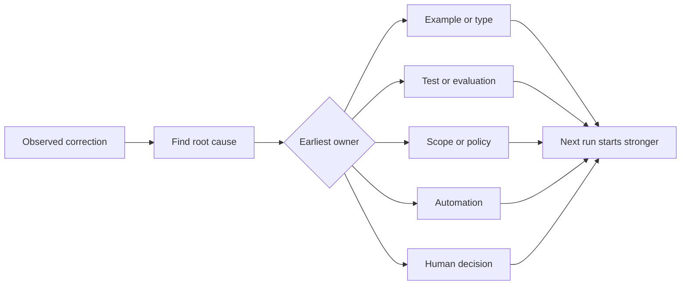

# Convierte cada corrección de agente en una mejora del sistema.

> Una corrección que sólo se encuentra en el chat corrige una ejecución. Una corrección promovida a una prueba, límite, ejemplo o herramienta mejora cada ejecución posterior.

> **【中文解读】**Sólo vive en el registro de chat, sólo repara una vez la ejecución; se actualiza a prueba, límite, ejemplo o herramienta de la corrección, cada una de las correcciones después de la mejora.

> ¿ Qué es esto ?**【前置】**Previo a la clase, prevé dominar la fase 14 Sección 37-41                                                                                                                                                                                                                                                                                                                                                                                                                                                                                                            `outputs/feedback-ratchet.json`, es un futuro trabajo de la entrada de la plataforma de cambio.

**Type:** Learn + Build | **类型:** 学习 + 动手实践
**Languages:** Python (stdlib) | **语言:** Python（标准库）
**Prerequisites:** Phase 14 lessons 37 to 41 | **前置知识:** Phase 14 第 37-41 课
**Time:** ~65 minutes | **时间:** 约 65 分钟

## Objetivos de aprendizaje

- Convierta las correcciones de agente en controles duraderos.
  Traducción:La corrección del agente se transforma en un medio de control permanente.
- Coloque cada control en la capa más temprana que pueda prevenir la recurrencia.
  En inglés, "Cuidado con el control" se dice "Cuidado con el control".
- Desdobla las lecciones repetidas con huellas dactilares estables.
  En inglés, el lenguaje de la lengua china es "la lengua de la lengua" (en inglés, "la lengua de la lengua inglesa").
- Retirar controles que ya no protegen un riesgo real.
  El gobierno de los países de la Unión Soviética ha dejado de proteger el control de los riesgos reales.

## Las correcciones son pruebas.

Cuando le dices a un agente que no edite ese archivo, has aprendido que el límite de alcance no era ejecutable. Cuando dices que esta forma de salida está equivocada, has aprendido que faltó un ejemplo o prueba. Cuando la configuración falla de nuevo, has aprendido que el conocimiento del entorno pertenece a la automatización.

> Cuando le dices a un agente que "Beij modificar ese documento"", lo que aprendes es que el alcance de los límites es imparable"."" Cuando dices que "esta forma de salida no es correcta"", lo que aprendes es que falta un ejemplo o un ensayo"."" Cuando el medio ambiente se construye de nuevo, lo que aprendes es que el conocimiento ambiental debe automatizarse".""

Trata la corrección como una observación sobre el sistema de trabajo, no como un error de escritura.

> En el caso de los escritos, el texto es un texto que se escribe en forma rápida.

> **【中文解读】**Este capítulo ha cambiado de perspectiva: cada vez que se correcta es un sistema que informa de sus propios fallos  "limitadas improbables"  "exemplos inexorables"  "no hay conocimiento en el mercado"                                                                                                                                                                                                                                   

## Promover a la capa efectiva más temprana.

Utilice este orden:

> 按这个顺序升级:

| Recurring failure | Durable destination |
|---|---|
| Wrong result or regression | Test or evaluation |
| Off-scope or unsafe action | Scope or permission policy |
| Repeated setup or command mistake | Automation or tool |
| Repeated output-format mistake | Canonical example plus validator |
| Ambiguous local convention | Instruction with a scenario check |
| Product disagreement | Human decision record |

Un tipo que evita un estado inválido es más fuerte que un comentario de revisión que lo capta después. Una prueba enfocada es más fuerte que un párrafo que pide al agente que recuerde.

> 越早的控制越便宜── un tipo de prevención de la aparición de estados ilegales,强过一条事后才抓住它评审评论── un examen enfocado,强过一段求代理的文字:"记住"",

> **【中文解读】**Este cuadro es el cuadro de decisiones centrales de este curso: resultados erroneamente mejorados para probar/avalorar; estrategias de control de límites; repetidas medidas de control de ambiente; formaciones erroneamente mejoradas para especificar ejemplos y compositores; instrucciones de control de escenarios; productos discriminados mejorados para determinar la manera de hacer las cosas.



> 图解: observar al corrijo → 找根因 → 判定最早的责任层(exemplos/ tipos、测试/ evaluación、 alcance/ estrategia、 automatización、 decisión artificial)→ La próxima operación comienza desde un punto de partida más fuerte.

## El registro de Ratchet.

Captura:

> 记录这些字段:

- síntoma;
  En inglés: symptôme;
- la causa raíz;
  En inglés: root因;
- consecuencia;
  En español:
- el número de recurrencias;
  Traducción:La cantidad de veces que se produce
- el control elegido;
  En inglés: "Control".
- la verificación para el control;
  Traducción:Control de su propio método de prueba.
- el propietario;
  Traducción: responsable;
- fecha para revisarlo o retirarlo.
  En inglés, el nombre de la fecha de publicación de la publicación de la publicación de la publicación de la publicación de la publicación de la publicación de la publicación de la publicación de la publicación de la publicación de la publicación de la publicación de la publicación de la publicación de la publicación de la publicación de la publicación de la publicación de la publicación de la publicación de la publicación de la publicación de la publicación de la publicación de la publicación de la publicación de la publicación de la publicación de la publicación de la publicación de la publicación de la publicación de la publicación de la publicación de la publicación de la publicación de la publicación de la publicación de la publicación de la publicación de la publicación de la revista.

No promueva cada preferencia única, sino que se promueve una corrección cuando la recurrencia o la consecuencia justifiquen una complejidad permanente.

> No se debe mejorar cada preferencia de una vez. Sólo cuando la cantidad de veces que se repiten o los resultados sean graves hasta que valga la pena introducir una complejidad permanente, se puede mejorar esta corrección.

> **【中文解读】**八段里, "controlar su propio método de verificación" y "día de retiro" son los más fáciles de omitir. Los primeros aseguran que este control realmente se detiene.

> ¿ Qué es esto ?**【类比】**Antes: cada vez que se correcta es desde cero, y después: cada vez que se correcta es para avanzar y controlar, el sistema sólo se vuelve fuerte y no regresa.

## Separar Causa de síntoma .

El agente editado README es un síntoma.

> "El agente ha cambiado la lectura" es un síntoma.

- la tarea permitió la raíz del repositorio;
  La tarea permitió el registro de la base de almacenes.
- los documentos se consideraron implícitamente seguros;
  El documento fue aceptado como un área de seguridad.
- la ejecución y documentación del plan en conjunto;
  Planar y Arquivo en un conjunto.
- dos trabajadores tenían propiedad superpuesta.
  China: dos trabajadores tienen la propiedad sobre la otra.

Cada causa pertenece a un control diferente, y una regla que simplemente repite el síntoma fallará en el siguiente caso ligeramente diferente.

> Cada causa tiene un control diferente. Sólo repite las reglas de los síntomas, en la próxima vez que haya una situación diferente, se fallará.

> **【中文解读】**Es el paso más fácil de robar: escribir "BÉRAR ALLEJAR" en reglas es fácil, encontrar "por qué se cambiará" es difícil. Pero cuatro posibles razones apuntan a cuatro diferentes formas de modificación: estrechar los permisos de ruta, claramente plantear los permisos de ruta, desglosar los planes, reparar los derechos de propiedad, todo el mundo y "README" no tiene relación.

## Los controles también se deterioran.

Los controles antiguos pueden entrar en conflicto, inflar el contexto y codificar un sistema que ya no existe.

> 旧控制会相互冲突、大上下文、并固化一个已经不存在的系统──每条升级过的规则都需要退役检查── Cuando se produzca la siguiente situación, eliminar o volver a escribirlo:

- la arquitectura subyacente cambió;
  La estructura de la base ya ha cambiado.
- se sustituye por un control ejecutable más fuerte;
  China: más fuerte de control ejecutable sustituyó a él;
- el fallo no se ha repetido en una ventana significativa;
  En la lengua china, el tiempo es un tiempo de crisis.
- El control crea más fricción que el riesgo que evita.
  El control de la fricción de la fabricación ya ha superado el riesgo de que se mantenga en ella.

El objetivo no es el archivo de instrucciones más largo, sino el sistema más pequeño que preserva el juicio ganado con dificultad.

> El objetivo no es el documento de instrucciones más largo, sino el sistema más pequeño de poder de juicio para conservarlo.

> **【中文解读】**棘轮只进不退,但控制会过期──"Cada regla tiene que tener un examen de retirada" y el mantenimiento de los proyectos de ordenamiento de archivos (como AGENTS.md) está directamente relacionado: no se agrega la cantidad de reglas de la resolución, finalmente se contradicen entre sí, se inundan los puntos de gravedad, describen un sistema inexistente── el objetivo es "el sistema mínimo de poder de juicio de conservación", no es el más largo de los directorios──

## Construye y realiza.

El laboratorio clasifica las correcciones, las promueve en controles, duplica las huellas dactilares y escribe.`outputs/feedback-ratchet.json`¿ Qué ?

> La parte experimental se encargará de reparar las clases, mejorarlas para controlar, usar los dedos para recargar y escribir.`outputs/feedback-ratchet.json`¿Qué es eso?

- ¿Qué quieres decir ?

> 运行:

```bash
python3 code/main.py
python3 -m unittest discover code/tests -v
```

Añadir dos correcciones con diferentes formulaciones con la misma causa. Mejorar la normalización hasta que se desmoronan en un control sin colapsar fallas no relacionadas.

> 加入两条措辞不同但根因相同的纠正──改进归化逻辑,直到它们合并成一个控制,同时不让无关的失败被错合并──

> **【中文解读】**破坏实验演示指纹去重的关键张力:归一化太松,同一根因的两条纠正各立一条控制;太紧,无关失败被错合并;错伤) ⋅ el punto de de de重点是根因,不是措辞

## Los ejercicios.

1. Toma cinco correcciones de una sesión reciente de codificación y clasifica sus verdaderos propietarios.
   Sin embargo, el gobierno de China ha hecho un esfuerzo por mejorar la calidad de la vida de los ciudadanos.
2. Sustituye una regla en prosa por una prueba ejecutable.
   Se trata de un ensayo que se puede realizar en el idioma chino.
3. Añadir una ponderación de consecuencias para que una primera aparición grave pueda ser promovida inmediatamente.
   China: 加后果权重,让严重的第一次发生可以立即升级──
4. Añadir un propietario y fecha de jubilación a la salida del laboratorio.
   Traducción:Encuentra a los expertos y los encargados de la prueba.
5. Revise una instrucción de agente existente y borra sólo después de demostrar que existe un control más fuerte.
   En la actualidad, el gobierno de China ha estado en manos de los agentes de la CIA.

## Más Leer más Leer más

- [Basili, Caldiera, and Rombach, The Goal Question Metric Approach](https://www.cs.toronto.edu/~sme/CSC444F/handouts/GQM-paper.pdf), para convertir los objetivos en preguntas y mediciones operativas.
  El objetivo de la escala de los problemas de Rombach se transforma en el problema y la escala de los objetivos operables.
- [Shinn et al., Reflexion](https://arxiv.org/abs/2303.11366), para utilizar rastros de retroalimentación para mejorar las decisiones posteriores sin cambiar los pesos del modelo.
  Sin embargo, el proceso de desarrollo de la economía se ha convertido en un proceso de desarrollo de la economía.
- [Madaan et al., Self-Refine](https://arxiv.org/abs/2303.17651), para la retroalimentación iterativa y revisión dentro de un bucle de tareas.
  En la actualidad, el sistema de control de la información se ha desarrollado de manera automática.

## Lo que se conserva , se conserva el producto .

Mantenga .`outputs/feedback-ratchet.json`Es el final duradero del camino de la ingeniería asistida por agentes y la entrada a futuras modificaciones en el banco de trabajo.

> Mantener`outputs/feedback-ratchet.json` es el punto final de la ruta de "Agencia Audiencia Ingeniería" y también el punto de entrada de la futura plataforma de trabajo.
