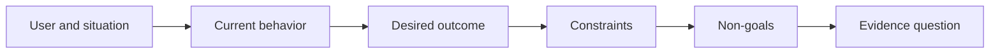

# Definir el resultado antes de elegir la salida.

> La aplicación rápida aumenta la pena por elegir el problema equivocado.

> **【中文解读】**"producción" (output) es algo que usted decide construir  un ayudante  una página  un modelo  "resultados" (output) es el cambio observáble en el mundo  quien en qué situación ha cambiado algo  logro cada vez más rápido, el costo de la elección de un problema es cada vez más alto  本课教你先写"结果框架" (output framework): usuario  情境  现今行为 期望结果  约束 非目标  整程不提任何具体解法 

> ¿ Qué es esto ?**【前置】**无硬性前置课程──本课是 47-54 课程『塑造构建』路径(结果定义 → 工作流发现 → 假设与风险 → 最小切片 → 规格 → 指标 → 分阶段发布 → 反所有权)

**Type:** Learn + Build | **类型:** 学习 + 动手实践
**Languages:** Python (stdlib) | **语言:** Python（标准库）
**Prerequisites:** None | **前置知识:** 无
**Time:** ~60 minutes | **时间:** 约 60 分钟

## Objetivos de aprendizaje

- Escriba un marco de resultado sin nombrar una solución.
  Traducción:Escribe un marco de resultados de cualquier solución.
- Identifique al usuario, la situación, el comportamiento actual y el cambio deseado.
  China: Identificar el usuario, la situación, el comportamiento y las expectativas de cambio.
- Hacer explícitas las restricciones y los no objetivos.
  Traducción:把约束和非目标写明确──
- Detectar una fuga de solución antes de que se endurezca en el alcance.
  Traducción:En solución que se desprende de la dureza hasta que se inspecte hasta que se dure.

## La salida no es resultado. La salida no es igual al resultado.

Construir un asistente de incidentes nombra una salida. No dice quién la necesita, qué mejora o qué debe permanecer seguro.

> "Haz un ayudante de accidente" se llama una salida. No dice quién lo necesita, qué va a cambiar, qué debe mantenerse seguro.

Un marco de resultados dice:

> 结果框架 así dice:

> Cuando llega una alerta de producción, el ingeniero en llamada identifica el servicio fallido y una próxima acción segura en un plazo de dos minutos, mientras que el diagnóstico permanece solo de lectura y auditable.

> Cuando llegue la denuncia de producción, el ingeniero de trabajo puede localizar el servicio de fallas en dos minutos y encontrar un movimiento de seguridad, al mismo tiempo que el diagnóstico del proceso completo se mantiene solo legible y auditable.

Esa frase puede ser satisfecha por un software, un libro de ejecución, una reparación de datos o un cambio más pequeño de interfaz.

> Esta frase puede ser utilizada por un software, un manual de trabajo, una revisión de datos o un cambio de interfaz más pequeño para satisfacerla. Permite que el equipo se fije en el resultado, en lugar de en el producto que alguien primero imagina.

> **【中文解读】**La diferencia entre el resultado y el resultado es la base de este curso: el resultado es sólo una entrada al espacio, el resultado es el final de la llegada. En este ejemplar, no hay ninguna "asistente" de "AI" de "interfaz", sólo se escribe quién, cuándo, qué, qué, qué no puede cambiar.

## El marco de seis partes.

| Part | Question |
|---|---|
| User | Who experiences the problem directly? |
| Situation | When and where does it occur? |
| Current behavior | What happens today, including workarounds? |
| Desired outcome | What observable state should improve? |
| Constraints | Which safety, policy, cost, or compatibility limits are fixed? |
| Non-goals | What tempting adjacent work is excluded? |



> 图解: usuario与情境 → 当前行为 → 期望结果 → 约束 → 非目标 → 证据问题,六段依序收紧──

> **【中文解读】**六段是有序的: primero alguien y situación,才谈到行为; primero看清现状 (incluyendo el modo de eludir el presente),才谈到改变;约束收紧解空间, non-goal 住顺手的诱惑,最后落到"qué observar puede demostrar resultados alcanzados" (en inglés: "observancia") .

## Busca una solución a la fuga de datos.

Las declaraciones de resultados filtran soluciones cuando contienen una forma de producto, interfaz, elección de modelo, marco o arquitectura que no se ha obtenido por evidencia.

> Cuando el resultado de la declaración contiene una forma de producto, interfaz, modelo de selección, marco o estructura que no ha sido probada, la solución se ha filtrado.

- Los usuarios reciben un resumen semanal de IA filtra el resumen y la cadencia.
  China: "El usuario recibe un resumen de IA cada semana" y se desprende de este tipo de resumen y ritmo de "cada semana".
- Los usuarios entienden los cambios de cuentas antes de que la aprobación indique el resultado.
  El resultado es el resultado.
- Deploye una base de datos vectorial filtraciones de infraestructura.
  China: "La implementación de una base de datos de velocidad" ha provocado una fuga de infraestructura.
- La evidencia de políticas pertinentes está disponible durante la revisión afirma una capacidad.
  China: "La evaluación puede obtener pruebas de políticas relacionadas".

Las restricciones pueden nombrar la tecnología cuando la compatibilidad realmente la arregla.

> Cuando la compatibilidad está realmente bloqueada en el tipo de tecnología, se puede poner en el nombre de la tecnología.

> **【中文解读】**漏洞检测的判定: en la frase aparece "productoformato/界面/模型/框架/架构" (la palabra de la categoría "productoforma/interfaz/ modelo/ marco/ estructura") de la IA 摘要、向量库、App), mientras que todavía no se ha comprobado, es la fuga.

## Las restricciones protegen el resultado.

Las restricciones no son detalles de implementación, son parte del objetivo del mundo real:

> 约束不是实现细节──它们 son parte de los objetivos del mundo real:

- No hay producción que escriba durante el diagnóstico;
  Traducción:El diagnóstico durante el período no se escribe producción库;
- la respuesta dentro del presupuesto de tiempo de incidente;
  Traducción:En respuesta al presupuesto del tiempo de accidente;
- los eventos de auditoría existentes siguen siendo autorizados;
  China: el gobierno de China ha aprobado el proyecto de ley de la ley de fiscalización de activos de la Unión Europea.
- no hay nueva dependencia del tiempo de ejecución;
  No introducir nuevos cambios en el desarrollo de la economía.
- El comportamiento de accesibilidad se mantiene intacto.
  El comportamiento de los niños no tiene obstáculos para mantenerse perfecto.

Una construcción que alcanza el resultado violando una restricción no ha alcanzado el resultado.

> Una construcción que se ha construido en contra de la obligación no ha tenido resultados reales.

> **【中文解读】**束写在结果框架里而不是 PR 描述里, la razón es la última frase: "sucesso" de la violación de la obligación no es un éxito. Estos artículos suelen codificar la seguridad, la conformidad o la compatibilidad.

## No metas Crear un límite no metas marcar límites

Los objetivos no útiles impiden que una pieza útil se convierta en una plataforma.

> No se pretende evitar que una pieza útil se expande en una plataforma.

- no se realizará ninguna reparación automática;
  No hace nada automático.
- no hay nuevo sistema de enrutamiento de alerta;
  No construye nuevo sistema de policía.
- no sustituir al comandante incidente;
  No hay ningún problema en el sistema de control de la seguridad.
- No hay análisis históricos en esta rebanada.
  En español: "Benece"

> **【中文解读】**La definición de un "no objetivo" es una forma de "rehabilitación automática" que se puede utilizar para rechazar una tentación específica.

## Construye y realiza.

El laboratorio valida una`OutcomeFrame`y escribe.`outputs/outcome-frame.json`¿ Qué ?

> 实验部分会校验一个 `OutcomeFrame`Y no lo escribieron.`outputs/outcome-frame.json`¿Qué es eso?

```bash
python3 code/main.py
python3 -m unittest discover code/tests -v
```

Reemplazar el resultado deseado con utilizar el asistente de incidente. El validador debe señalar que la salida propuesta se filtró en el resultado.

> En el caso de los resultados de la evaluación, el resultado de la evaluación se puede considerar como un resultado de la evaluación de los resultados.

> **【中文解读】**破坏实验把"泄漏检测"变成一条机械规则:期望结果一 una vez que surja una forma de desformar la forma de usar/construir/deployar加产品名), el examinador se rechaza.

## Los ejercicios.

1. Reescriba una solicitud de características de su backlog como un marco de resultado.
   Un artículo de la solicitud de funciones se vuelve a escribir en el marco de resultados.
2. Añadir una restricción que cambie las soluciones que siguen siendo posibles.
   China: 加一条能改变"¿Qué soluciones todavía pueden hacerse?"
3. Añadir dos no objetivos que mantengan la primera rebanada pequeña.
   China: 加两条非目标,让第一切片保持小──
4. Identifique la observación más temprana que contradija el resultado deseado.
   China: señalando los primeros resultados esperados.
5. Escriba tres resultados diferentes que podrían satisfacer el mismo resultado.
   Traducción:Escrito tres diferentes producciones, todas pueden satisfacer el mismo resultado.

## Más Leer más Leer más

- [Nuseibeh and Easterbrook, Requirements Engineering: A Roadmap](https://www.cs.toronto.edu/~sme/papers/2000/ICSE2000.pdf), para tratar los objetivos del mundo real como el anclaje para el trabajo del software.
  Traducción:Nuseibeh y Easterbrook 需求工程:路线图把真实世界目标当作软件工作的点──
- [Dardenne, van Lamsweerde, and Fickas, Goal-Directed Requirements Acquisition](https://doi.org/10.1016/0167-6423(93)90021-G), para refinar los objetivos de alto nivel en restricciones y requisitos operativos.
  La necesidad de lograr objetivos de alto nivel se ha refinado en un vínculo con la necesidad de operar.

## Lo que se conserva , se conserva el producto .

Mantenga .`outputs/outcome-frame.json`La siguiente lección lo prueba con el flujo de trabajo que la gente realiza.

> Mantener`outputs/outcome-frame.json`下一课将取它对照人们实际执行工作流来检查
