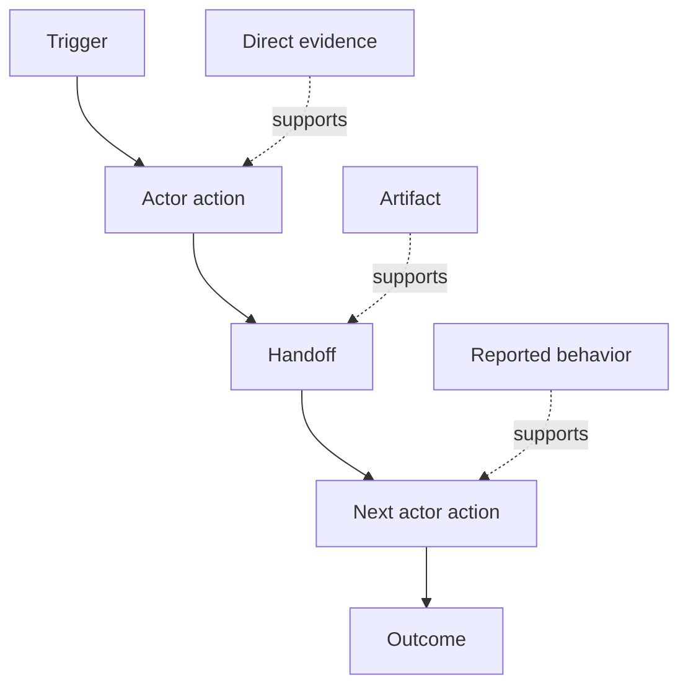

# Descubra el flujo de trabajo que la gente realmente realiza .

> Los requisitos no están esperando en una reunión para ser recogidos, sino que están dispersos en acciones, soluciones, registros y desacuerdos.

> **【中文解读】**La necesidad no está en las reuniones, sino en la movilidad, el contorno, el registro y las diferencias. Este curso te enseña a salir de "lo que realmente sucede ahora" y a hacer un trabajo en el que descubras: dar a cada paso de la construcción de los actores, los impulsos, las movilidades, las entradas, las salidas, los frottes, los derechos, las pruebas, las categorías de pruebas, y mantener las diferencias en lugar de ponerlas en promedio.

> ¿ Qué es esto ?**【前置】**Previo a la clase, primero aprenda la fase 14 del ensayo. El resultado de este ensayo es el marco de resultados: los resultados esperados deben depender del flujo de trabajo real de la gente, no del flujo de trabajo imaginario.`outputs/workflow-evidence.json`, la siguiente clase transformará el fricción y la incertidumbre observadas en un mapa hipotético.

**Type:** Learn + Build | **类型:** 学习 + 动手实践
**Languages:** Python (stdlib) | **语言:** Python（标准库）
**Prerequisites:** Phase 14 lesson 47 | **前置知识:** Phase 14 第 47 课
**Time:** ~70 minutes | **时间:** 约 70 分钟

## Objetivos de aprendizaje

- Modela el flujo de trabajo actual como acciones ordenadas con evidencia.
  Traducción:La obra actual se desarrolla con la evidencia de su movimiento.
- Separar la observación directa del comportamiento informado o inferido.
  La lengua china es la lengua china, la lengua china, la lengua china, la lengua china, la lengua china, la lengua china, la lengua china, la lengua china, la lengua china, la lengua china, la lengua china, la lengua china, la lengua china, la lengua china, la lengua china, la lengua china, la lengua china, la lengua china, la lengua china, la lengua china, la lengua china, la lengua china, la lengua china, la lengua china, la lengua china, la lengua china, la lengua china, la lengua china, la lengua china, la lengua china, la lengua china, la lengua china, la lengua china.
- Busca fricción, entregues, autoridad y estado oculto.
  En inglés, "Movimiento de la posición", "Movimiento de la posición", "Movimiento de la posición" o "Movimiento de la posición".
- Mantenga visibles las afirmaciones inciertas en lugar de convertirlas en requisitos.
  En la actualidad, el gobierno de China ha estado en la situación de que el gobierno de China no puede hacer nada.

## Comience con el sistema actual.

No empieces preguntando qué características quieren las personas, comienza reconstruyendo lo que sucede ahora.

> No te metas en preguntar a la gente qué es lo que quieren hacer.

Para cada paso, registra:

> Para cada paso, el registro:

| Field | Example |
|---|---|
| Actor | On-call engineer |
| Trigger | Production alert arrives |
| Action | Opens alert, then searches dashboards |
| Input | Alert payload and deployment record |
| Output | Candidate service and owner |
| Friction | Context switching across three tools |
| Authority | Incident commander approves a write |
| Evidence | Screen recording, incident log, runbook |

El flujo de trabajo es más grande que la pantalla, incluye la espera, copiar y pegar, canales laterales, aprobación, recuperación de errores y los pasos que la gente ha dejado de notar.

> 工作流比屏幕大──incluye esperar, copiar, clicar, darse una pequeña noticia, aprobar, recuperar errores, y los pasos que la gente ya no ha tomado en cuenta―.

> **【中文解读】**起点决定质量: de "qué quieres" se desprende la lista de deseos, de "ahora cómo hacer" se desprende lo que se obtiene es sólo约束清单。八段里摩擦) 权威权限) 证据) 易被漏漏漏摩擦是改进机会所在,权威是AI 无法动手的边界,证据决定这条记录可信到何程度──最后一句点破常见盲区:屏幕外等等等,粘贴,群聊,救火才是工作流的血肉──

## La evidencia tiene fuerza. La evidencia es débil.

Utilice una escalera de pruebas simple:

> Con una simple escalera de pruebas:

1. **Direct behavior:**observación, rastreo, registro o evento del sistema.
   En inglés:**直接行为：** observar 、 rastrear 、录屏或系统事件──
2. **Artifact:**billete, libreta de ejecución, registro, formulario o salida completada.
   En inglés:**产物：**工单、运维手册、日志、表单或已完成的作品──
3. **Reported behavior:**una persona describe lo que hacen.
   En inglés:**口述行为：**Alguien describe cómo se hace.
4. **Inference:**El equipo concluye lo que probablemente sucederá.
   En inglés:**推断：**El equipo concluyó que había ocurrido algo.

Los cuatro pueden ser útiles. Sólo los dos primeros prueban el comportamiento actual directamente. Etiquetar el resto para que la confianza no se infle silenciosamente.

> Los cuatro niveles pueden ser útiles, pero sólo los dos primeros pueden demostrar directamente el comportamiento actual.

> **【中文解读】**La prueba es la medida de este curso: la misma frase "el ingeniero de trabajo primero revisó el arsenal de instrumentos", directamente observado, el trabajo solo dejó huellas, los comentarios del equipo, la confiabilidad de los diferentes ejemplos.

> ¿ Qué es esto ?**【类比】**证据阶梯像新闻信源分级级──之前:会议纪要里"todos todos así hacen" y录屏观察写作如理直气壮;后:每条记录带等级标签直接观察是第一手信源,口述是当事人回忆,推断是编辑推测,信度不再膨胀──



> 图解:触发 → 行动者动作 → 交接 → 下一个行动者动作 → 结果;不同强度的证据(直接证据、产物、口述) 分别支不同的步骤。

## Busca cuatro cosas. Busca cuatro cosas.

- **Friction:**esfuerzo repetido, retraso, reingreso o recuperación.
  En inglés:**摩擦：**Reacción de trabajo, retraso, reingreso o recuperación de la ayuda.
- **Hidden state:**hechos que se llevan en memoria, en conversación o en notas personales.
  En inglés:**隐藏状态：** Por recuerdos  聊天记录 o personal notas llevar hechos
- **Authority:**la persona o sistema que permitió efectuar un cambio consecuente.
  En inglés:**权限：**Se permite hacer cambios en la persona o sistema que tengan consecuencias.
- **Exceptions:**el caso en que el flujo de trabajo normal deje de ser normal.
  En inglés:**例外：**El flujo de trabajo normal ya no es normal.

Las características de la IA a menudo fallan en las ofertas y excepciones porque el camino feliz era el único camino que se formaba.

> La IA funciona siempre en la interacción y excepción, ya que al principio sólo se ha formado un camino feliz.

> **【中文解读】**Así es el objetivo de alto valor en el flujo de trabajo: el abrasivo indica un punto de mejora; el estado oculto es el mayor obstáculo a la automatización; el poder decide en qué lugar debe dejarse un punto de control artificial; la excepción es la raíz común de "la demostración de un ambiente normal"", la producción de un ambiente de transformación"". La última frase que vale la pena copiar es sólo según el camino feliz de la función de IA diseñada, que se exponga en la primera conexión o en la primera excepción.

## No promedies el desacuerdo. No promedies las diferencias.

Los usuarios pueden realizar diferentes flujos de trabajo por buenas razones.

>  dos usuarios pueden estar ejecutando diferentes flujos de trabajo, y cada uno tiene una razón válida― retener estos cambios hasta que entiendas que representan:

- diferentes funciones;
  Traducción: Diferentes papeles.
- diferentes niveles de riesgo;
  Traducción: diferentes风险等级;
- el proceso existente y actual;
  Traducción:Old flow with new flow并存;
- las diferencias de conocimientos;
  Traducción:El lenguaje de la lengua.
- Un verdadero desacuerdo político.
  Un verdadero cambio de política.

Un flujo de trabajo promedio no puede describir a nadie.

> Un flujo de trabajo promedio puede ser descrito por alguien.

> **【中文解读】**Combinar dos variables en una "flujo de trabajo medio" es la práctica más provinciana y también la más peligrosa: describe un usuario inexistente.

## Construye y realiza.

El laboratorio almacena evidencia en cada paso del flujo de trabajo, valida orden y confianza, calcula la relación entre evidencia directa y escribe `outputs/workflow-evidence.json`¿ Qué ?

> La parte experimental dará a cada proceso de trabajo un testimonio de la secuencia de pruebas y de la confianza, calcula la proporción de pruebas directas, y escribe.`outputs/workflow-evidence.json`¿Qué es eso?

```bash
python3 code/main.py
python3 -m unittest discover code/tests -v
```

Añadir un camino excepcional en el que el registro de despliegue está ausente. Mantenga el orden principal intacto y registra dónde comienza la rama.

> Además de "la falta de registros de la implementación" de los medios de comunicación, los registros se dividen en los siguientes aspectos:

> **【中文解读】**破坏实验练习是例外建模: el proceso principal mantiene la linearidad, la excepción como una rama de la propia evidencia que se apunta, en lugar de estar dentro de un paso principal de la observación.

## Los ejercicios.

1. Reconstruir un flujo de trabajo de un registro sin entrevistar a nadie.
   No se habla de nadie, sólo de un 日志重建工作流.
2. Entrevistar a un usuario y marcar cada afirmación que aún carezca de pruebas directas.
   China: entrevista de un usuario, señalando que cada artículo todavía carece de evidencia directa de las afirmaciones.
3. Añadir un límite de autoridad y un paso de recuperación de fallas.
   China: añadir un límite de poder y un fracaso de recuperación.
4. Modelo de dos variantes de flujo de trabajo sin fusionarlas.
   China: 建模两条工作流变体,不合并它们──
5. Identifique una característica propuesta que elimine un paso visible pero deje el trabajo oculto intacto.
   En inglés, "Cortar los pasos vistos, pero no encontrar el trabajo oculto" se puede decir como "cortar los pasos vistos, pero no encontrar el trabajo oculto".

## Más Leer más Leer más

- [Nuseibeh and Easterbrook, Requirements Engineering: A Roadmap](https://www.cs.toronto.edu/~sme/papers/2000/ICSE2000.pdf), especialmente su tratamiento de la elicitación como interpretación, modelado y validación en lugar de una simple captura.
  En el caso de la construcción de una fábrica de cerveza, el proyecto de construcción de cerveza de cerveza de cerveza de cerveza de cerveza de cerveza de cerveza de cerveza de cerveza de cerveza de cerveza de cerveza de cerveza de cerveza de cerveza de cerveza de cerveza de cerveza de cerveza de cerveza de cerveza de cerveza de cerveza de cerveza de cerveza de cerveza de cerveza de cerveza de cerveza de cerveza de cerveza de cerveza de cerveza de cerveza de cerveza de cerveza de cerveza de cerveza de cerveza de cerveza de cerveza de cerveza de cerveza de cerveza de cerveza de cerveza de cerveza de cerveza de cerveza de cerveza de cerveza de cerveza de cerveza de cerveza de cerveza de cerveza de cerveza de cerveza de cerveza de cerveza de cerveza de cerveza de cerveza de cerveza de cerveza de cerveza de cerveza de cerveza de cerveza de cerveza de cerveza de cerveza de cerveza de cerveza de cerveza de cerveza de cerveza de cerveza de cerveza de cerveza de cerveza de cerveza de cerveza de cerveza de cerveza de cerveza de cerveza de cerveza de cerveza de cerveza de cerveza de cerveza de cerveza de cerveza de cerveza de cerveza de cerveza de cerveza de cerveza de cerveza de cerveza de cerveza de cerveza de cerveza de cerveza de cerveza de cerveza de cerveza de cerveza de cerveza de cerveza de cerveza de cerveza de cerveza de cerveza de cerveza de cerveza de cerveza de cerveza de cerveza de cerveza de cerveza de cerveza.
- [Gotel and Finkelstein, An Analysis of the Requirements Traceability Problem](https://doi.org/10.1109/ICRE.1994.292398), por la dificultad de preservar la relación entre los requisitos y sus fuentes.
  Traducción:Gotel y Finkelstein 需求可追踪性问题分析 需求保留与其来源之间的关系困难──

## Lo que se conserva , se conserva el producto .

Mantenga .`outputs/workflow-evidence.json`Convierte la fricción y la incertidumbre observadas en un mapa de suposiciones en la siguiente lección.

> Mantener`outputs/workflow-evidence.json`◊ Next Class transformará el fricción y la incertidumbre observadas en un mapa hipotético.
