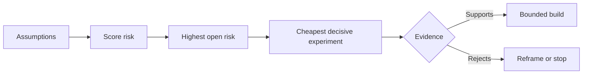

# Mapa de suposiciones y resolver el más arriesgado primero.

> Un mapa de ruta oculta la incertidumbre dentro de las características.

> **【中文解读】**路线图把不确定性藏在一个个"功能"里;假设地图把"这些功能值得存在的前提"摊在桌面上. 本课是代理工程方法论系列 (Phase 14 · 43-54) 里承承起上下一环: 第48课发现人们实际执行的工作流,本课把"这件事值得做"本身分解成一组可证据的假设,根据影响,不确定性,不可逆性三维排行风险,然后先确定最不便宜,最能活死的实验,然后先做最令人兴奋的功能.

> ¿ Qué es esto ?**【前置】**Se trata de un estudio de la evolución de la economía de la región, que se desarrolla en el contexto de la economía de la región.`outputs/assumption-map.json`En la sección 50 se utiliza para seleccionar "el más pequeño pedazo de evidencia decisiva".

**Type:** Learn + Build | **类型:** 学习 + 动手实践
**Languages:** Python (stdlib) | **语言:** Python（标准库）
**Prerequisites:** Phase 14 lesson 48 | **前置知识:** Phase 14 第 48 课
**Time:** ~65 minutes | **时间:** 约 65 分钟

## Objetivos de aprendizaje

- Convierta el trabajo propuesto en suposiciones explícitas.
  Traducción:把提议的工作转化为显式的假设.
- El impacto, la incertidumbre e irreversibilidad de la puntuación por separado.
  Traducción:Unidad de la información y la información.
- Elige el siguiente experimento por riesgo, no por entusiasmo.
  En la actualidad, el grupo de expertos de la Universidad de Chicago (U.S.) ha estado trabajando en el campo de la investigación.
- Replace las suposiciones probadas por pruebas y decisiones.
  China: en sustitución de las hipótesis de la prueba con pruebas y decisiones.

## Cada edificio contiene apuestas.

Una herramienta de incidente puede depender de que todas estas cosas sean ciertas:

> Una herramienta de tratamiento de accidentes puede depender de cada una de las siguientes:

- el contexto de la alerta contiene suficiente información para identificar un servicio;
  China: la policía de la información que contiene suficiente para identificar el servicio;
- los ingenieros confían en una recomendación que no se derivan ellos mismos;
  Ingenieros se han comprometido a hacer una política de seguridad.
- el tiempo de respuesta deseado es importante para el funcionamiento;
  El tiempo de respuesta de la expectativa es realmente importante en el desarrollo.
- los datos requeridos podrán ser accesibles sin autoridad insegura;
  Traducción:El acceso a datos es necesario.
- el flujo de trabajo ocurre con suficiente frecuencia como para justificar el mantenimiento.
  Este trabajo ha ocurrido lo suficiente frecuentemente, vale la pena mantenerlo durante mucho tiempo.

Estas no son tareas de implementación, sino condiciones para que la construcción sea valiosa, utilizable, viable y segura.

> Estos no son objetivos de realización, sino los prerequisitos de la construcción de "valor, disponibilidad, viabilidad, seguridad".

> **【中文解读】**Cada línea de la lista de funciones tiene varias características: ¿Usuario puede usarlo?, ¿se obtiene los datos?, ¿se puede mantener la organización?, ¿El mapa de ruta nunca muestra estas características, sólo se manifiestan en forma de uso o abandono después de su finalización?

## Las clases de suposiciones

| Class | Question |
|---|---|
| Value | Will the outcome matter enough? |
| Usability | Can the user understand and act on it? |
| Feasibility | Can the system produce it with available data and constraints? |
| Viability | Can the organization sustain cost, ownership, and operation? |
| Safety | Can it fail without unacceptable consequence? |

> **【中文解读】**五类假设各问一个问题:¿¿valor?¿resultados son suficientes importantes??、可用性?¿usuario sabe y puede basarse en esta acción?、可用性?¿con datos y restricciones existentes, ¿puede obtenerse el sistema?),、sobrevivencia?

Escriba suposiciones como declaraciones falsificables. La característica es útil no puede ser probada. Ocho de cada diez ingenieros en llamada identifican el servicio correcto más rápido con el resultado de sólo lectura puede.

> "Esta función es útil" no es un examen; "ocho de los diez ingenieros de trabajo de valor sólo pueden leer los resultados más rápido para ubicarse en el servicio correcto".

## El riesgo no es un número.

El laboratorio utiliza tres dimensiones de uno a cinco:

> 实验代码 con tres dimensiones de 1 a 5:

- **Impact:**daños si la suposición es falsa.
  En inglés:**影响：**假设为假时的损失──
- **Uncertainty:**debilidad de las pruebas actuales.
  En inglés:**不确定性：** Hay pruebas de que hay más debilidad
- **Irreversibility:**el coste del aprendizaje después del compromiso.
  En inglés:**不可逆性：**押上承诺后再学习的代价──

El resultado de la prueba multiplica el impacto y la incertidumbre, luego añade irreversibilidad. La fórmula no es universal. Su propósito es obligar al equipo a declarar por qué un desconocido debe resolverse antes que otro.

> Ejemplo: El resultado de la evaluación se multiplica por la incertidumbre, se suma a la irreversibilidad. Esta fórmula no es general, su objetivo es que el equipo de trabajo diga claramente: por qué este proyecto desconocido debe ser resuelto antes que el otro.

> ¿ Qué es esto ?**【类比】**假设排雷像拆迁前的房屋检查:每面墙(假设) 分别量三数将崩多大面积(影响) 结构判断有多拿不准(不确定性) 错了还能不能回去(不可逆性) 首处理"塌了最疼 + 最拿不准 + 不回去" en la pared, no en la mejor 面──



> **【中文解读】**Este esquema de procesos es el motor de este curso: Figuración → Figuración → Figuración → Figuración → Figuración → Figuración → Figuración → Figuración → Figuración → Figuración → Figuración → Figuración → Figuración → Figuración → Figuración → Figuración → Figuración → Figuración → Figuración → Figuración → Figuración → Figuración → Figuración → Figuración → Figuración → Figuración → Figuración → Figuración → Figuración → Figuración → Figuración → Figuración → Figuración → Figuración → Figuración → Figuración → Figuración → Figuración → Figuración → Figuración → Figuración → Figuración → Figuración → Figuración → Figuración → Figuración → Figuración → Figuración → Figuración → Figuración → Figuración → Figuración → Figuración → Figuración → Figuración → Figuración → Figuración → Figuración → Figuración → Figuración → Figuración → Figuración → Figura → Figuración → Figuración → Figura → Figuración → Figura → Figuración → Figura → Figuración → Figura → Figuración → Figura → Figuración → Figura → Figura → Figura → Figuración → Figura → Figura → Figura → Figura → Figura → Figuración → Figura → Figura → Figura → Figura → Figura → Figura → Figura → Figura → Figura → Figura → Figura → Figura → Figura → Figura → Figura → Figura → Figura → Figura → Figura → Figura → Figura → Figura → Figura → Figura → Figura → Figura → Figura → Figura → Figura → Figura → Figura → Figura → Figura → Figura → Figura → Figura → Figura → Figura → Figura → Figura → Figura → Figura → Figura → Figura → Figura → Figura → Figura → Figura → Figura → Figura → Figura → Figura → Figura → Figura → Figura → Figura → Figura → F

## Diseñar un experimento, no un ritual de confirmación. Diseñar un experimento, no un ritual de confirmación.

Una prueba útil tiene:

> Un test útil equipado:

- una afirmación que pueda ser falsa;
  Un posible hecho falso.
- una población o una muestra realista;
  Traducción:Un verdadero cuerpo o un ejemplo real.
- un resultado observable;
  Traducción:Un resultado observable;
- un umbral decidido antes del resultado;
  Un buen valor está determinado antes de ver el resultado.
- una decisión siguiente por el paso, el fracaso y pruebas ambigüas.
  Por el contrario, el proceso de la decisión de la empresa es un proceso de decisión.

Evite las pruebas que sólo demuestren que el equipo puede construir la idea.

> Evita los ensayos que demuestren que el equipo puede hacer esto.

> **【中文解读】**"Ritual de confirmación" se refiere a aquellos que sin importar cómo los resultados se seguirán haciendo demostracionesdemo ha tenido éxito en la línea, ha fracasado en la revisión de la revisión de la revisión de la revisión de la revisión de la prueba real tiene tres signos duros: afirmación puede ser falsa valor antes de que el resultado se determine  cada tipo de evidencia se enfrenta a diferentes pasos  menos de cualquiera, no es un experimento, es un ejercicio

## La reversibilidad cambia el orden.

Las opciones de alta consecuencia e irreversibles necesitan pruebas anteriores. Una reproducción de sólo lectura puede preceder a una integración de producción. Un adaptador temporal puede preceder a una migración de datos. Una recomendación aprobada por el hombre puede preceder a una acción automática.

> Las consecuencias de la selección importante e irreversible requieren pruebas más tempranas. Sólo se puede leer y liberar antes de la integración de la producción; los adaptadores temporales pueden ir antes de la migración de datos; las recomendaciones de aprobación artificial pueden ir antes de la ejecución automática.

La forma de la construcción debe seguir la forma de la incertidumbre.

> La forma de la construcción debe seguir la forma de la incertidumbre.

> **【中文解读】**El principio de la clasificación sólo tiene una frase: cuanto más difícil sea la decisión de regresar, más antes se debe obtener evidencia en forma alternativa y económica.

## Construye y realiza.

El laboratorio clasifica las suposiciones, distingue las pruebas de las afirmaciones abiertas, selecciona el riesgo abierto más alto y escribe `outputs/assumption-map.json`¿ Qué ?

> √ Código de experimento para la hipótesis de clasificación √ Diferenciar entre las afirmaciones probadas y aún abiertas √ Seleccionar los proyectos abiertos con mayor riesgo y escribir √`outputs/assumption-map.json`¿Qué es eso?

```bash
python3 code/main.py
python3 -m unittest discover code/tests -v
```

Cambia la evidencia sobre la suposición de mayor riesgo y observa cómo cambia el próximo experimento.

> 修改风险最高那条假设的证据 字段, observar"下一个实验" cómo se cambia con ello

> **【中文解读】** `risk_score = impact * uncertainty + irreversibility`Es un cálculo intencionalmente simple que no tiene el significado de existir con precisión, sino convertir "primero hacer qué experimento" en un problema evidente discutable, replicable. Dado que una suposición suplementa la evidencia, su estado de apertura se transforma en prueba, el siguiente experimento automáticamente cae a un nuevo máximo riesgo: esto es "con evidencia impulsar la prioridad", no con la conferencia impulsar.

## Los ejercicios.

1. Escribe cinco suposiciones para una característica que quieres construir.
   Por lo que no es un trabajo, no es un trabajo.
2. Añadir una suposición de seguridad que la lista de características omitió.
   Traducción:Púntate tu función
3. Definir un umbral que le haga detener la construcción.
   Definir una que te dejará parar este valor de construcción.
4. Sustituye un experimento grande por un test decisivo más barato.
   Traducción:En sustitución de un gran experimento a un más barato pero también tiene un test decisivo.
5. Comparar el ranking de riesgos con la prioridad de la hoja de ruta y explicar la discrepancia.
   China:                                                                                                                                                                                                                                                              

## Más Leer más Leer más

- [Barry Boehm, A Spiral Model of Software Development and Enhancement](https://dl.acm.org/doi/10.1145/12944.12948), para un ciclo de desarrollo basado en el riesgo que resuelva la incertidumbre antes de un compromiso más profundo.
  En la actualidad, el desarrollo de la tecnología de la información es un proceso de desarrollo de la tecnología de la información.
- [Dardenne, van Lamsweerde, and Fickas, Goal-Directed Requirements Acquisition](https://doi.org/10.1016/0167-6423(93)90021-G), para refinar los objetivos y superar los obstáculos y las limitaciones.
  La necesidad de obtener la orientación de los objetivos en la actualidad se encuentra en el mismo tiempo que la obstrucción y la limitación.

## Lo que se conserva , se conserva el producto .

Mantenga .`outputs/assumption-map.json`La siguiente lección la utiliza para elegir la parte más pequeña que pueda producir pruebas decisivas.

> Mantener`outputs/assumption-map.json` Next Class utilizará para seleccionar los fragmentos más pequeños de la evidencia decisiva
