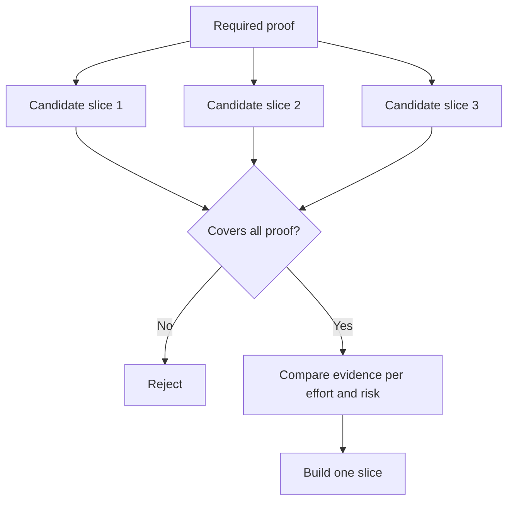

# Elige la parte más pequeña que pueda cambiar la decisión.

> Una pequeña construcción que no puede cambiar la próxima decisión es simplemente incompleta.

> **【中文解读】**"Hacer pequeño" sólo tiene valor en la capacidad de demostrar que hay que hacer cosas importantes para que una pequeña construcción no pueda cambiar el siguiente paso de la decisión, no es la pequeña pieza mínima que se puede hacer, sino que no se completa.

> ¿ Qué es esto ?**【前置】**Previo curso Previo curso Previo curso Previo curso:Fase 14 第 49 课                                                                                                                                                                                                                                                     `outputs/slice-decision.json`Se convertirá en una entrada en el Artículo 51 del Reglamento de Documentación.

**Type:** Learn + Build | **类型:** 学习 + 动手实践
**Languages:** Python (stdlib) | **语言:** Python（标准库）
**Prerequisites:** Phase 14 lesson 49 | **前置知识:** Phase 14 第 49 课
**Time:** ~65 minutes | **时间:** 约 65 分钟

## Objetivos de aprendizaje

- Defina una rebanada por las suposiciones que prueba.
  Chinem: "Cápice puede probar qué hipótesis" para definir la parte de la pieza.
- Equilibrar el valor de los resultados, la reducción de la incertidumbre, el esfuerzo y la consecuencia.
  En la traducción japonesa, el valor de los resultados es el valor de la incertidumbre, el valor de los resultados, el valor de los resultados, el valor de los resultados, el valor de los resultados, el valor de los resultados, el valor de los resultados, el valor de los resultados, el valor de los resultados, el valor de los resultados, el valor de los resultados, el valor de los resultados, el valor de los resultados, el valor de los resultados, el valor de los resultados, el valor de los resultados, el valor de los resultados, el valor de los resultados, el valor de los resultados, el valor de los resultados, el valor de los resultados, el valor de los resultados, el valor de los resultados, el valor de los resultados, el valor de los resultados, el valor de los resultados, el valor de los resultados, etc.
- Prefiero pruebas revertibles a la producción prematura.
  China: preferencia a la elección de pruebas de la controversia, en lugar de la prematura promesa de producción.
- Rechazar las recetas que omiten la parte arriesgada del flujo de trabajo.
  Rechazar los pedazos de los que están en el trabajo.

## Vertical Means Evidence End to End. El tiempo es el tiempo.

Una parte útil cruza el flujo de trabajo real mínimo necesario para observar un resultado. Puede ser estrecho en usuarios, datos, duración y capacidad. No debe ser estrecho eliminando la incertidumbre exacta que necesita para probar.

> Un pedazo útil para atravesar "podría observar un resultado" del mínimo flujo de trabajo real necesario. Puede ser reducido en el usuario, datos, tiempo, capacidad, pero no puede cortar "la incertidumbre que estás probando" para reducirlo.

Ejemplos:

> Ejemplo:

- Una repetición de sólo lectura en diez incidentes reales prueba la identificación del servicio y la confianza del operador.
  Traducción:Transn10 veces verdadero accidente de sólo read-back,能检验服务识别和操作者信任──
- Un panel pulido sobre datos sintéticos puede comprobar la comprensión, pero no la viabilidad de los datos.
  Traducción:El equipo de análisis de datos basado en datos de sintesis puede ser capaz de "ver bien", pero no puede examinar la disponibilidad de datos.
- Un automediador de producción prueba todo a la vez con consecuencias inaceptables.
  Traducción:La auto-reforma de la producción ambiental una vez revisó todo, pero los resultados fueron inaceptables.

> **【中文解读】**" longitud " significa extremo a extremo para hacer uso del verdadero flujo de trabajo: la entrada es verdadera, el camino de decisión es real, puede observar un resultado. La dirección estrecha sólo puede ser el alcance de la gente, los datos, los datos, los datos, los datos, los datos, los datos, los datos, los datos, los datos, los datos, los datos, los datos, los datos, los datos, los datos, los datos, los datos, los datos, los datos, los datos, los datos, los datos, los datos, los datos, los datos, los datos, los datos, los datos, los datos, los datos, los datos, los datos, los datos, los datos, los datos, los datos, los datos, los datos, los datos, los datos, los datos, los datos, los datos, los datos, los datos, los datos, los datos, los datos, los datos, los datos, los datos, los datos, etc.

> ¿ Qué es esto ?**【类比】**Último pedazo de la obra de la obra de la obra de la obra de la obra de la obra de la obra de la obra de la obra de la obra de la obra de la obra de la obra de la obra de la obra de la obra de la obra de la obra de la obra de la obra de la obra de la obra de la obra de la obra de la obra de la obra de la obra de la obra de la obra de la obra de la obra de la obra de la obra de la obra de la obra de la obra de la obra de la obra de la obra de la obra de la obra de la obra de la obra de la obra de la obra de la obra de la obra de la obra de la obra de la obra de la obra de la obra de la obra de la obra de la obra de la obra de la obra de la obra de la obra de la obra de la obra de la obra de la obra de la obra de la obra de la obra de la obra de la obra de la obra de la obra de la obra de la obra de la obra de la obra de la obra de la obra de la obra de la obra de la obra de la obra de la obra de la obra de la obra de la obra de la obra de la obra de la obra de la obra de la obra de la obra de la obra de la obra de la obra de la obra de la obra de la obra de la obra de la obra de la obra de la obra de la obra de la obra de la obra de la obra de la obra de la obra de la obra de la obra de la obra de la obra de la obra de la obra de la obra de la obra de la obra de la obra de la obra de la obra de la obra de la obra de la obra de la obra de la obra de la obra de la obra de la obra de la obra de la obra de la obra de la obra de la obra de la obra de la obra de la obra de la obra de la obra de la obra de la obra de la obra de la obra de la obra de la obra de la obra de la obra de la obra de la obra de la obra de la obra de la obra de la obra de la obra de la obra de la obra de la obra de la obra de la obra de la obra de la obra de la obra de la obra de la obra de la obra de la obra de la obra de la obra.

## Define la prueba requerida Primero, define la prueba necesaria.

Tomar los supuestos abiertos de mayor riesgo y convertirlos en un conjunto de pruebas requeridos.

> 取出风险最高的开放假设, convertirlos en un "necessary proof collection"― 候选片只覆盖这个集合,才有评价资格―

Luego, comparar las rebanas elegibles en:

> Luego comparamos entre los pedazos de la película:

| Dimension | Direction |
|---|---|
| Outcome value | More is better |
| Uncertainty reduced | More is better |
| Effort | Less is better |
| Consequence | Less is better |
| Reversibility | More is better |

La puntuación del laboratorio es intencionalmente simple. La puerta de elegibilidad importa más que la aritmética.

> 实验代码的评分故意简单――资格门比算术更重要――



> **【中文解读】**El orden de la siguiente es el núcleo de la clase: "Hace un tiempo, los resultados son más pequeños" y "reversibilidad es más grande" son los más fáciles de ignorar, pero en realidad determinan el costo de la pérdida de los experimentos cuando fallan.

## Los mínimos falsos comunes                                                                                                                                                                                                                                                            

- **The UI-only minimum:**elimina los datos y la incertidumbre operativa.
  En inglés:**只有 UI 的最小：**Se ha eliminado la incertidumbre de los niveles de datos y de gestión.
- **The infrastructure-only minimum:**prueba una posibilidad técnica sin valor para el usuario.
  En inglés:**只有基础设施的最小：**☐ no se ha logrado de forma técnica, pero no se ha logrado de manera técnica.
- **The happy-path minimum:**omite la excepción que genera más riesgos.
  En inglés:**只有正常路径的最小：**perdió la mayor parte del riesgo de fabricación 
- **The demo minimum:**produce un artefacto persuasivo pero no una medición repetible.
  En inglés:**演示级最小：**Se produjeron demostraciones convincentes, pero no hay medidas repetibles.
- **The platform minimum:**construye maquinaria reutilizable antes de que un flujo de trabajo lo gane.
  En inglés:**平台级最小：**Antes de que se produzca un valor de prueba de flujo de trabajo, se debe fabricar máquinas de repetición.

> **【中文解读】**五种假最小的各有各种诱惑:UI 最小出图快, infraestructura mínima para el apetito de los ingenieros, demostración mínima para el liderazgo. Su común punto es el de "mínimo" significa hacer que el riesgo se exponga temprano.

## Añadir una regla de parada.

Antes de la implementación, escriba lo que sucede si la rodaja falla:

> Antes de que se realice, primero escriba "Ciepie fracaso ha sido como":

- abandonar el resultado;
  La traducción de la traducción de la traducción de la traducción de la traducción de la traducción de la traducción de la traducción de la traducción de la traducción de la traducción de la traducción de la traducción de la traducción de la traducción de la traducción de la traducción de la traducción de la traducción de la traducción de la traducción de la traducción de la traducción de la traducción de la traducción de la traducción de la traducción de la traducción de la traducción de la traducción de la traducción de la traducción de la traducción de la traducción de la traducción de la traducción de la traducción de la traducción de la traducción de la traducción de la traducción de la traducción de la traducción de la traducción de la traducción de la traducción de la traducción de la traducción de la traducción de la traducción de la traducción de la traducción de la traducción de la traducción de la traducción de la lengua inglesa de la lengua inglesa de la lengua inglesa de la lengua inglesa de inglés de inglés de inglés de inglés de inglés de inglés de inglés de inglés de inglés de inglés de inglés de inglés de inglés de inglés de inglés de inglés de inglés de inglés de inglés de inglés de inglés de inglés de inglés de inglés de inglés de inglés de inglés de inglés de inglés de inglés de inglés de inglés de inglés de inglés de inglés de inglés de inglés de inglés de inglés de inglés de inglés de inglés de inglés de inglés de inglés de inglés de inglés de inglés de inglés de inglés de inglés de inglés de inglés de inglés de inglés de inglés de inglés de inglés de inglés de inglés de inglés de inglés de inglés de inglés de inglés de inglés de inglés de inglés de inglés de inglés de inglés de inglés de inglés de inglés de inglés de inglés de inglés de inglés de inglés de inglés de inglés de inglés de inglés de inglés de inglés de inglés de inglés de inglés de inglés de inglés de inglés de inglés de inglés de inglés de inglés de inglés de inglés de inglés de inglés de inglés de inglés de inglés de inglés de inglés de inglés de inglés de inglés de inglés de inglés de inglés de inglés de inglés de inglés de inglés de inglés de inglés de inglés de inglés de inglés de inglés de inglés de inglés de inglés de inglés de inglés de inglés de inglés de inglés de inglés de inglés de inglés de inglés de inglés de inglés de inglés de inglés de inglés de
- cambiar el usuario objetivo o la situación;
  Traducción: cambios de objetivo usuario o uso de escena;
- probar un mecanismo diferente;
  Traducción:El nuevo mecanismo
- recoger mejores pruebas;
  Primero recoger mejores pruebas;
- más estrecha autoridad.
  En español: "La autoridad es más pequeña".

Si cada resultado conduce a la construcción, la rebanada no es un experimento.

> Si cada resultado va hacia "continuar haciendo abajo", entonces este pedazo no es un experimento.

> **【中文解读】**停止规则是实验的"诚实检查": una conclusión es que todos los resultados son "continuos de construcción", simplemente se usan en el plan establecido de la experiencia. 停止规则 debe ser escrito antes de la realización, porque los datos salen y se vuelven a determinar, el equipo casi siempre da el trabajo que se ha dedicado a encontrar una razón para continuar.

## Construye y realiza.

El laboratorio filtra a los candidatos por la prueba requerida, califica las rebanadas elegibles y escribe `outputs/slice-decision.json`¿ Qué ?

> 实验代码根据必需证明过候选人、给有资格的切片打分,并写出 `outputs/slice-decision.json`¿Qué es eso?

```bash
python3 code/main.py
python3 -m unittest discover code/tests -v
```

Añadir un candidato más barato que demuestre una sola suposición requerida.

> Además de una prueba de una hipótesis necesaria, pero más barato de la candidatura. Incluso si su calificación es muy alta, también debería seguir sin ser elegible para participar.

> **【中文解读】** `score = (结果价值 + 不确定性消减) / (投入 + 后果 × 不可逆系数)`只是 ordenamiento herramienta; verdadero guardián es el conjunto que contiene los controles `required_proof <= set(item.proves)`                                                                                                                                                                                                                                                              

## Los ejercicios.

1. Diseñar tres rodajas para el mismo resultado en diferentes niveles de consecuencia.
   Traducción: para el mismo resultado diseñar tres diferentes niveles de resultados.
2. Indique la prueba requerida antes de marcarlas.
   En español, traducción: en el idioma chino, traducción: en el idioma chino, traducción: en el idioma chino, traducción: en el idioma chino: en el idioma chino: en el idioma chino: en el idioma chino: en el idioma chino: en el idioma chino: en el idioma chino: en el idioma chino: en el idioma chino: en el idioma chino: en el idioma chino: en el idioma chino: en el idioma chino: en el idioma chino: en el idioma chino: en el idioma chino: en el idioma chino: en el idioma chino: en el idioma chino: en el idioma: en el idioma: en el idioma: en el idioma: en el idioma: en el idioma: en el idioma: en el idioma: en el idioma: en el idioma: en el idioma: en el idioma: en el idioma: en el idioma: en el idioma: en el idioma: en el idioma: en idioma: en idioma: en idioma: en idioma: en idioma: en idioma: en idioma: en idioma: en idioma: en idioma: en idioma: en idioma: en idioma: en idioma: en idioma: en idioma: en idioma: en idioma: en idioma: en idioma: en idioma: en idioma: en idioma: en idioma: en idioma: en idioma: en idioma: en idioma: en idioma: en idioma: en idioma: en idioma: en idioma: en idioma: en idioma: en idioma: en idioma: en idioma: en idioma: en idioma: en idioma: en idioma: en idioma: en idioma: en idioma: en idioma: en idioma: en idioma: en idioma: en idioma: en idioma: en idioma: en idioma: en idioma: en idioma: en idioma: en idioma: en idioma: en idioma: en idioma: en idioma: en idioma: en idioma: en idioma: en idioma: en idioma: en idioma: en idioma: en idioma: en idioma: en idioma: en idioma: en idioma: en idioma: en idioma: en idioma del inglés
3. Eliminar una capacidad mientras se conservan las pruebas decisivas.
   China: Cut off abilities, al mismo tiempo que mantiene pruebas decisivas.
4. Añade una regla de parada para un piloto fallido.
   Por lo tanto, el gobierno de China ha adoptado una política de suspensión.
5. Identifique un componente de plataforma reutilizable que deba esperar hasta que haya terminado la roda.
   China: en el caso de los equipos de la plataforma, el equipo de la plataforma debe ser utilizado de nuevo.

## Más Leer más Leer más

- [Barry Boehm, A Spiral Model of Software Development and Enhancement](https://dl.acm.org/doi/10.1145/12944.12948), para adaptar cada ciclo de desarrollo a los riesgos que debe resolver.
  En la actualidad, el modelo de la espiral de Bohm permite que cada ciclo de desarrollo se enfrente a un riesgo que debe ser resuelto.
- [Lenarduzzi and Taibi, MVP Explained: A Systematic Mapping Study on the Definitions of Minimal Viable Product](https://arxiv.org/abs/1609.07592), por la ambigüedad en torno a minimum y viable en la práctica de productos de software.
  En el contexto de la práctica de los productos de software, "minimum" y "可行" se usan dos palabras:

## Lo que se conserva , se conserva el producto .

Mantenga .`outputs/slice-decision.json`Registra por qué esta rebanada es la más pequeña que puede cambiar la decisión.

> Mantener`outputs/slice-decision.json` Recordó por qué este pedazo es "el pedazo más pequeño que puede cambiar una decisión"
