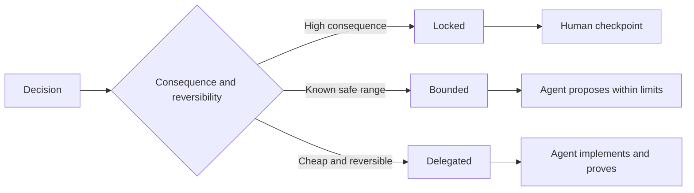

# Escriba especificaciones que preserven el juicio.

> Una especificación útil fija invariantes y pruebas dejando abiertas opciones de implementación reversibles. Es un límite de decisión, no un guión.

> **【中文解读】**Una buena regla bloquea "invariables y pruebas", deja la opción de ejecución de la implementación inversa al ejecutor es el límite de la decisión, no un guión.

> ¿ Qué es esto ?**【前置】**Se trata de un proceso de aprendizaje que se desarrolla en el curso de la escuela. Se trata de un proceso de aprendizaje que se desarrolla en el curso de la escuela.`outputs/executable-specification.json`Es un agente codificador y un acuerdo compartido de evaluación humana.

**Type:** Learn + Build | **类型:** 学习 + 动手实践
**Languages:** Python (stdlib) | **语言:** Python（标准库）
**Prerequisites:** Phase 14 lesson 50 | **前置知识:** Phase 14 第 50 课
**Time:** ~75 minutes | **时间:** 约 75 分钟

## Objetivos de aprendizaje

- Resultados separados, invariantes, ejemplos, no objetivos y prueba.
  En inglés, el resultado es diferente, pero no se puede comprobar.
- Marque las decisiones como cerradas, limitadas o delegadas.
  Traducción:把每个决定标注为锁定、受限或委托──
- Preserva el juicio de los agentes donde las opciones son baratas y reversibles.
  En el lugar de elegir barato y oposicional, mantener el poder de juicio del agente.
- Requerir puestos de control humanos donde las consecuencias o el comportamiento público cambie.
  En el lugar donde se produzcan cambios significativos o de comportamiento público, se impone un control artificial.

## Dos extremos malos. Dos extremos malos.

Una tarea subespecificada le pide a un agente que adivine el sistema.

> 规格不足的任务让代理去猜系统;规格过度的任务让它抄抄一条可能就就错的设计.

El medio útil es un contrato ejecutable:

> El formato intermedio útil es un contrato ejecutable:

| Surface | Purpose |
|---|---|
| Outcome | The observable result |
| Invariants | Conditions that must always remain true |
| Examples | Concrete cases that reveal intent |
| Non-goals | Adjacent behavior intentionally excluded |
| Decision policy | Which choices are locked, bounded, or delegated |
| Proof | Evidence required before completion |

> **【中文解读】**两个极端对应两种浪费:规格不足浪费在返工上 (Agencia 猜错了重做),规格过度浪费在翻译上 (Persona ha escrito el diseño en falso código,Agencia ha vuelto a transcribir en código, en medio no hay aumento de inteligencia) 六面契约是中间路:结果说清"要什么"、不变量说清"任何时候不能破坏什么"、 ejemplos transmisión意图、非目标划边界、决策政策声明授权、证明定义"完成" cada aspecto deja lugar a la ejecución de juicio―

## Tres modos de decisión.

- **Locked:**El agente no debe elegir: uso para la compatibilidad pública, autoridad, seguridad, coste irreversible o compromiso de producto.
  En inglés:**锁定（Locked）：**El agente no tiene que ser elegido por sí mismo.
- **Bounded:**El agente puede elegir dentro de límites explícitos. Uso para presupuestos de búsqueda, recuentos de retemplaje, dependencias permitidas, o una familia de interfaz conocida.
  En inglés:**受限（Bounded）：**El agente puede elegir dentro de límites definidos. Para buscar el presupuesto, volver a probar el número de veces, permitir la dependencia, conocidos de la familia de contactos.
- **Delegated:**El agente es dueño de la elección y debe explicarla.
  En inglés:**委托（Delegated）：**El agente tiene esta opción, pero debe ser capaz de explicarla.



> **【中文解读】**Tres tipos de patrones de clasificación sólo tienen un problema: los resultados y la capacidad de contrarrestar. Los resultados son grandes e irreversibles. Los resultados son limitados y se fijan en un punto de control artificial. Los resultados son controlados pero tienen un alcance seguro. Los resultados son limitados. Los agentes se configuran en un marco de libertad.

> ¿ Qué es esto ?**【类比】**Tres tipos de decisiones como los contratos de adquisición de edificios: la construcción de edificios y la construcción de edificios, la construcción de edificios, la construcción de edificios, la construcción de edificios, la construcción de edificios, la construcción de edificios, la construcción de edificios, la construcción de edificios, la construcción de edificios, la construcción de edificios, la construcción de edificios, la construcción de edificios, la construcción de edificios, etc.

## Especifique el comportamiento a través de ejemplos.

Los ejemplos comprimen mejor la intención que los adjetivos. Helpful, robust, y production-ready no son ejecutables. Un pequeño conjunto de ejemplos normales, ventajas, fallas y prohibidos da algo concreto tanto al constructor como al verificador.

> Ejemplos de un conjunto de ejemplos que cubren escenarios normales, fronterizos, fracasados y prohibidos, dan a los constructores y verificadores cosas concretas que pueden captar.

Los ejemplos no reemplazan a las invariantes.

> Ejemplo no puede sustituir la constante. Un ejemplo aprobado no es una regla de seguridad.

> **【中文解读】**Esta sección resolvió la "形容词陷": escribir "输出要干净" es como todo lo que no se ha escrito, escribir "advertir a un responsable de servicio con ID de depósito" sólo transmitió intenciones. Cuatro ejemplos de cada uno tienen un proceso normal de transmisión de intenciones, la precisión de transmisión de los límites, la fallida transmisión de la transmisión, la línea roja prohibida. Pero el ejemplo es un ejemplo no una regla: correr a través de un caso de uso ≠ satisfacer la invariabilidad, el conjunto de adaptaciones sigue dependiendo de la declaración de invariabilidad.

## La prueba debe coincidir con la afirmación la prueba debe coincidir con la afirmación

- Una prueba de unidad demuestra un contrato de función local.
  La función de prueba de prueba local fue la de la prueba de prueba de un solo año.
- Una prueba de cable prueba la serialización y el comportamiento de transporte.
  En inglés, el método de prueba de prueba de prueba de transmisión y procesamiento de datos es el método de prueba de prueba de transmisión.
- Un viaje en el navegador demuestra una ruta de interfaz.
  En el contexto de la historia de la historia, el viaje de los visitantes a China se ha convertido en un viaje de la historia de la historia de China.
- Un conjunto de repeticiones prueba el comportamiento sobre casos representativos.
  China: Reproducción de la muestra de la muestra de la muestra de la muestra de la muestra de la muestra de la muestra de la muestra.
- Un registro de auditoría prueba que se cumplen los límites de autoridad.
  China: 审计日志证明 El límite de derechos de la gente está en el límite de la libertad de expresión.

No acepte una capa inferior como prueba de una afirmación de capa superior.

> No acepte las afirmaciones de los altos cargos con pruebas de nivel inferior.

> **【中文解读】**Cada prueba tiene su ámbito de jurisdicción: función de tubo de prueba de un solo elemento, protocolo de tubo de prueba de un solo elemento, interfaz de proceso de viaje de un navegador, comportamiento integral de la caja de datos de auditoría, y la prueba de un solo elemento de prueba de un solo elemento de prueba de un conjunto de luces de luz verde para declarar la seguridad de un límite de tiempo, nivel de seguridad, igual a la prueba de temperatura de un cuerpo.

## Preserva lo desconocido deliberadamente.

Una especificación puede decir que la aplicación puede elegir cualquier fuente de lectura única que recaiga dentro del presupuesto temporal. Eso no es vaguedad.

> 规格 puede escribir:" Realizar cualquier fuente de datos sólo leída que pueda ser elegida dentro del presupuesto de tiempo"". Esto no es un claro, sino una vez que hay una probabilidad de que haya un compromiso.

Las especificaciones deben evolucionar cuando las pruebas cambian. Preserva la razón detrás de las opciones bloqueadas y limitadas para que equipos posteriores puedan revisarlas sin arqueología.

>  Evidencia de cambios en el tiempo de las normas también debe evolucionar                                                                                                                                                                                                                                                       

> **【中文解读】**La diferencia entre "hacerse con el tiempo" y "no pensarlo" está en el límite y la prueba: el primero escribe el espacio de selección (en inglés) y el presupuesto (en inglés) y la prueba de recepción (en inglés), el segundo nada escribe (en inglés).

## Construye y realiza.

El laboratorio valida cada superficie del contrato, verifica los modos de decisión y escribe.`outputs/executable-specification.json`¿ Qué ?

> 实验代码校验契约的每面、检查决策模式,并写出 `outputs/executable-specification.json`¿Qué es eso?

```bash
python3 code/main.py
python3 -m unittest discover code/tests -v
```

Mover la decisión de escribir la producción de bloqueado a delegado. Explicar por qué el esquema acepta el valor pero el riesgo del producto no.

> Para poner en práctica la "producción escrita" esta decisión de bloquear la información en un modelo delegado, pero el producto no es aceptado.

> **【中文解读】**Las dos reglas de la prueba son: los seis aspectos imperativos y los modelos no encargados deben tener razones para ser considerados incompletos. Los experimentos de destrucción de los últimos años son un buen tema de pensamiento: poner la producción escrita en el cambio delegado en la lenguaje.

## Los ejercicios.

1. Convierta un boleto de atrasos en las seis superficies de especificaciones.
   Traducción:把一张后载 工单转写成六面的规格──
2. Reemplazar las tres instrucciones de implementación por una invariante y dos ejemplos.
   Se trata de un ejemplo de la aplicación de la instrucción de implementación de una serie de ejemplos.
3. Marque cada decisión y justifique cada elección bloqueada o limitada.
   Traducción:Dá a cada decisión un modelo de marca, y da razones para cada opción de bloqueo o restricción.
4. Añadir un recibo de prueba para cada invariante.
   Traducción:Por cada una de las veces que se hace una prueba de la respuesta.
5. Eliminar una restricción que no tenga evidencia o razonamiento para el riesgo.
   Traducción:Sorriendo un artículo ya no hay pruebas y no hay razones para pagar.

## Más Leer más Leer más

- [Nuseibeh and Easterbrook, Requirements Engineering: A Roadmap](https://www.cs.toronto.edu/~sme/papers/2000/ICSE2000.pdf), para la relación entre objetivos, especificaciones precisas, validación, acuerdo y evolución.
  En inglés, el nombre de la empresa es "Nuseibeh" y "Easterbrook" (en inglés: Easterbrook).
- [Zave and Jackson, Four Dark Corners of Requirements Engineering](https://doi.org/10.1145/267895.267896), para la separación de supuestos, requisitos y especificaciones ambientales.
  Zave y Jackson  necesidades del proyecto  cuatro esquinas oscuras 区分环境假设、需求与规格──
- [Gotel and Finkelstein, An Analysis of the Requirements Traceability Problem](https://doi.org/10.1109/ICRE.1994.292398), para preservar por qué existe un requisito y de dónde proviene.
  Traducción:Gotel y Finkelstein 需求追溯性问题分析 保留"necesidad por qué existe 〜 de dónde"―

## Lo que se conserva , se conserva el producto .

Mantenga .`outputs/executable-specification.json`Se convierte en el contrato que comparten los agentes de codificación y los revisores humanos.

> Mantener`outputs/executable-specification.json` Será un acuerdo compartido entre el agente codificador y el comité de evaluación humana
