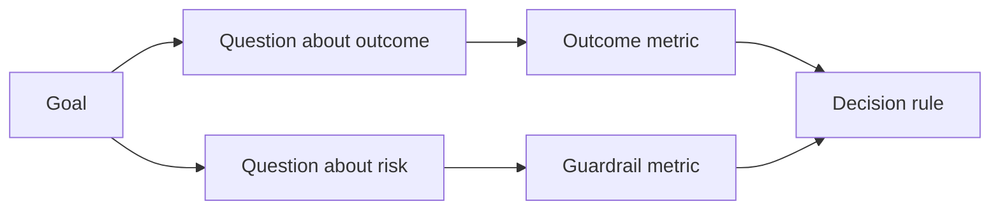

# Diseño métricas de éxito antes de que el resultado exista  resultados salieron

> La medición debe responder a una decisión, no decorar un tablero.

> **【中文解读】** La medición debe responder a una decisión, en lugar de un conjunto de instrumentos.                                                                                                                                                                                                                                                      

> ¿ Qué es esto ?**【前置】**Previo a la clase, prevé que aprenda:Fase 14 47 课程 (成果先于产出本课的"目标"从那里) y 51 课程 (写保留判断力规则规格里的"证明"面在此展开成测计划) ⋅ 本课产`outputs/measurement-report.json`Es la primera de las tres clases de investigación que se desarrolla en el mundo.

**Type:** Learn + Build | **类型:** 学习 + 动手实践
**Languages:** Python (stdlib) | **语言:** Python（标准库）
**Prerequisites:** Phase 14 lessons 47 and 51 | **前置知识:** Phase 14 第 47、51 课
**Time:** ~70 minutes | **时间:** 约 70 分钟

## Objetivos de aprendizaje

- Derivar preguntas y métricas de un objetivo final.
  Traducción:from the result objetivos推导出问题和标标.
- Definir los umbrales, ventanas, fuentes y direcciones antes de observar los resultados.
  En la traducción japonesa, el resultado es el resultado de la observación.
- Combine las métricas de resultado con barandillas y contra-metricas.
  Traducción:En la actualidad, el resultado es un resultado de la evolución de las relaciones entre la sociedad civil y la sociedad civil.
- La prueba de evaluación coincide con la decisión que debe apoyar la construcción.
  La evaluación de los datos de la construcción debe ser compatible con la decisión de la construcción.

## Objetivo, pregunta, métrica objetivos problemas índice

Comience con un objetivo:

> Desde un objetivo:

> Reducir el tiempo para identificar el servicio afectado sin aumentar las acciones inseguras.
>
> En el supuesto de no aumentar la seguridad de la operación, reducir el tiempo necesario para el servicio de localización afectada.

Las preguntas derivadas:

> 推导出问题:

- ¿Cuán rápido se identifica el servicio correcto?
  ¿Tiene un servicio de servicio en línea?
- ¿Con qué frecuencia es correcto el servicio identificado?
  Traducción:¿Cuál es la probabilidad de que el servicio de ubicación sea correcto?
- ¿El diagnóstico sigue siendo sólo para lectura?
  ¿Se mantiene el proceso de diagnóstico sólo para leer?
- ¿Aumenta el flujo de trabajo la descarga de alertas o la carga de trabajo del operador?
  ¿Acaso este flujo de trabajo ha aumentado la tasa de negligencia de la policía o la carga del operador?

Luego elija métricas que funcionen esas preguntas.

> Luego, elegir para convertir estos problemas en indicadores de números verificables.



> **【中文解读】**La orientación de GQM es irreversible: objetivo → 问题 → 指标──目标是决策语言(快而不险),问题是研究语言(多快?多准?只读吗?),指标才是数字语言(中位秒数、正确率、写次数) ⋅ Saltando la mitad de la capa directamente desde el objetivo de hacer los indicadores, se obtendrá "hora de respuesta media" de este tipo ya no responde a las decisiones ni se expone al riesgo de los instrumentos de la caja de adornamiento.

## Un métrico necesita un contrato.

Cada métrica necesita:

> Cada indicador necesita:

| Field | Example |
|---|---|
| Name | `median_identification_seconds` |
| Direction | at most |
| Threshold | 120 |
| Window | ten incident replays |
| Source | replay event log |
| Population | on-call engineers in the pilot |
| Kind | outcome or guardrail |

Sin fuente y ventana, un número no puede reproducirse.

> 没有来源和窗口, un número no puede ser reproducido; no hay 值, no puede impulsar decisiones.

> **【中文解读】**契约的七字段回答四个问题:叫什么 (Nombre) 朝哪边好 (Dirección) 、多好算好 (Trojo) 、在哪测 (Pablo) 、在哪测 (Pablo) 、 pertenece a qué clase (Casa) ٬缺" (Kind) ٬缺" (En donde测) 的, idéntico número de cambios en el ambiente es irrecuperable;缺"多好算好", (Nombre) 标标永远只会"看起来在变好" (Nombre) 朝哪边好 (Dirección) 、多好算好 (Dirección) 、多好算好 (Trojo) 、在哪测 (Pablo) 、在哪测 (Venestra/Fuente/Población) 、 pertenecepe de ), (También en el número de cambios en el ambiente es irrecuperable;缺" (多好算好) ), (Nombre) 标标永远只会"看起来在变好" (Veriendo en buena forma) ٬ (Nombre) ٬ (Nombre) ∞ (Nombre) ∞ (Nombre) ∞ (Nombre) ∞ (Nombre) ∞ (Nombre) ∞ (Nombre) ∞) ∞ (Nombre) ∞ (Nombre) ∞ (Nombre) ∞) ∞ (Nombre) ∞ (Nombre) ∞ (Nombre) ∞) ∞ (Nombre) ∞ (Nombre) ∞ (Nombre) ∞) ∞ (Nombre) ∞ (Nombre) ∞ (Nombre) ∞ (Nombre) ∞) ∞ (Nombre) ∞ (Nombre) ∞) ∞ (Nombre) ∞) ∞ (N) (N) ∞) (N) (N) (N) (N) (N) (N) (N) (N) (N) (N) (N) (N) (N) (N) (N) (N) (N) (N) (N) (N) (N) (N) (N) (N) (N) (N) (N) (N

> ¿ Qué es esto ?**【类比】**No hay ninguna referencia a la prueba de la prueba de la prueba de sangre. Sólo hay una serie de números que no se sabe si 450 es para celebrar o para colgar.

## Resultado, Guardrail y contramedráfico

- **Outcome metric:**¿ mejoró el estado deseado?
  En inglés:**结果指标：**¿Se ha mejorado el estado esperado?
- **Guardrail:**¿se mantiene una restricción fija?
  En inglés:**护栏指标：**¿Se mantiene un vínculo fijo?
- **Counter-metric:**¿El cambio de mejoras local costó o dañó en otro lugar?
  En inglés:**反指标：**¿Se ha transferido el coste o daño a otro lugar?

La precisión, las escrituras de producción, la carga de trabajo del operador y las alertas perdidas protegen contra un resultado rápido pero inseguro.

> En cuanto al flujo de trabajo de accidentes, sólo la velocidad es insuficiente. La tasa de exactidumbre, el número de copias de producción, la carga y la falta de informes de los operadores, son los resultados de "rápidos pero inseguros".

> **【中文解读】**Tres tipos de indicadores constituyen un triángulo: resultados indicadores demostración "cambió bien",护 indicadores guardados "no cambió mal" (((como la producción escribe en恒为零),反标住"坏处是不是被挪走了" ((本团队快了,是不是把负担给下游值班) ⋅ AI 系统最经典的反标例:客服机器人优化"平均处理时间"至极低,同时"人工转接户率"和"客户二次来电率"升.

## Evidencia fuera de línea y en línea.

Una repetición fuera de línea es útil para la repetibilidad y la cobertura de bordes. Un piloto limitado es útil para el comportamiento real, la confianza y los efectos del flujo de trabajo. Ninguno de los dos sustituye al otro.

> El valor de la descarga de datos en línea se basa en la repetibilidad y la cobertura de fronteras; el valor de los puntos de prueba en línea se basa en el comportamiento real, la confianza y el flujo de trabajo.

Utilice la evidencia más barata que pueda responder a la decisión actual.

> Usable responder a la evidencia más conveniente de la decisión actual. No sólo porque la realización se ha completado, sino que exponer al usuario real.

> **【中文解读】**离线/在线的取舍标准是"当前决策需要什么",不是"实现进步到哪里了"──回放集答"算法对不对",试点答"人信不信、用不用"── el error más común es usar un indicador de离线 para responder a una pregunta solo para intentar responderla.

## Decide antes de medir, pre-decisión, recaptación de datos

Escriba el paso, el fracaso y los caminos ambigüos antes de ver los resultados.

> En ver el resultado antes de escribir bien, pasar, fracasar y confundir tres caminos.

Ejemplo:

> Ejemplo:

- Pasar: velocidad de servicio correcta de al menos 0,9 y tiempo medio de 120 segundos como máximo;
  Por el contrario , el tiempo de servicio no es inferior a 0,9 ̊ y el tiempo de consumo medio no supera los 120 ̊ segundos .
- fallas: cualquier tasa de corrección o de escritura de producción inferior a 0,75;
  China: fracaso: aparece cualquier producción escrita, o el porcentaje de corrección inferior a 0,75;
- ambiguo: pequeña mejora con amplia variación, que requiere un conjunto de reproducción más grande.
  China: 模糊: mejorar la amplitud de la pequeña y la pequeña, necesita ampliar la recolección de la nueva.

> **【中文解读】**"Predecisión" es una defensa contra la humanidad: después de que los datos salen, casi todo el mundo determina el valor en su propio dato.

## Construye y realiza.

El laboratorio valida un plan de medición, evalúa los umbrales inclusivos, registra los valores faltantes y escribe `outputs/measurement-report.json`¿ Qué ?

> 实验代码校验 一个测量计划 根据含边界值的值求值 记录缺失值,并写出 `outputs/measurement-report.json`¿Qué es eso?

```bash
python3 code/main.py
python3 -m unittest discover code/tests -v
```

Elimine la métrica de barandillas y observa por qué el plan se vuelve inválido incluso cuando las métricas de resultado permanecen.

>  eliminar los indicadores, observar por qué incluso si los resultados de los indicadores están presentes, todo el plan también será juzgado inefficaz

> **【中文解读】**Las reglas del examinador son la codificación de este curso: falta de objetivo, falta de problemas, falta de indicadores, falta de resultados, falta de cuidados, dirección ilegal, falta de origen o ventana, cualquier artículo hará que el estado se vuelva inválido, los valores posteriores perderán todo su significado.

## Los ejercicios.

1. Derivar tres preguntas de un objetivo final.
   Traducción:De un resultado objetivo, se presentan tres problemas.
2. Añadir una contra-metrica que captura el costo trasladado a otro papel.
   China:加一个能抓住" costes fueron transferidos a otro papel"
3. Defina la fuente, población y ventana para cada métrica.
   Traducción:Para cada indicio definido origen, grupo y ventana.
4. Escriba decisiones pasadas, fallidas y ambigüas antes de generar valores.
   Traducción:En la generación de valores antes de escribir bien pasando 、失败和模糊三条决策。
5. Identifique una métrica que sea fácil de recoger pero que no pueda cambiar la decisión.
   En inglés, "Creo que es fácil recoger pero no cambiar" significa eliminarlo.

## Más Leer más Leer más

- [Basili, Software Modeling and Measurement: The Goal/Question/Metric Paradigm](https://drum.lib.umd.edu/items/8119803a-362b-42ec-b6ce-2311713e7236), para derivar las mediciones operativas de objetivos explícitos.
  En inglés, el método de cálculo de la cantidad de datos de datos de datos de datos de datos de datos de datos de datos de datos de datos de datos de datos de datos de datos de datos de datos de datos de datos de datos de datos de datos de datos de datos de datos de datos de datos de datos de datos de datos de datos de datos de datos de datos de datos de datos de datos de datos de datos de datos de datos de datos de datos de datos de datos de datos de datos de datos de datos de datos de datos de datos de datos de datos de datos de datos de datos de datos de datos de datos de datos de datos de datos de datos de datos de datos de datos de datos de datos de datos de datos de datos de datos de datos de datos de datos de datos de datos de datos de datos de datos de datos de datos de datos de datos de datos de datos de datos de datos de datos de datos de datos de datos de datos de datos de datos de datos de datos de datos de datos de datos de datos de datos de datos de datos de datos de datos de datos de datos de datos de datos de datos de datos de datos de datos de datos de datos de datos de datos de datos de datos de datos de datos de datos de datos de datos de datos de datos de datos de datos de datos de datos de datos de datos de datos de datos de datos de datos de datos de datos de datos de datos de datos de datos de datos de datos de datos de datos de datos de datos de datos de datos de datos de datos de datos de datos de datos de datos de datos de datos de datos de datos de datos de datos de datos de datos de datos de datos de datos de datos de datos de datos de datos de datos de datos de datos de datos de datos de datos de datos de datos de datos de datos de datos de datos de datos de datos de datos de datos de datos de datos de datos de datos de datos de datos de datos de datos de datos de datos de datos de datos de datos de datos de datos de datos de datos de datos de datos de datos de datos de datos de datos de datos de datos de datos de datos de datos de datos de datos de datos de datos de datos de datos de datos de datos de datos de datos de datos de datos de datos de datos de datos de datos de datos de datos de datos de datos de datos de datos de datos de datos de datos de datos de datos de datos de datos de datos de datos de datos de datos de datos
- [Basili, Caldiera, and Rombach, The Goal Question Metric Approach](https://www.cs.toronto.edu/~sme/CSC444F/handouts/GQM-paper.pdf), para la aplicación del método como sistema de retroalimentación y mejora.
  El método de la Cáldea y Rombach GQM 把该方法用作反与改进系统──

## Lo que se conserva , se conserva el producto .

Mantenga .`outputs/measurement-report.json`. Definirá la puerta de prueba para el prototipo, piloto o etapa de producción.

> Mantener`outputs/measurement-report.json`■ define la prueba del tipo original, el punto de prueba o la etapa de producción■■
