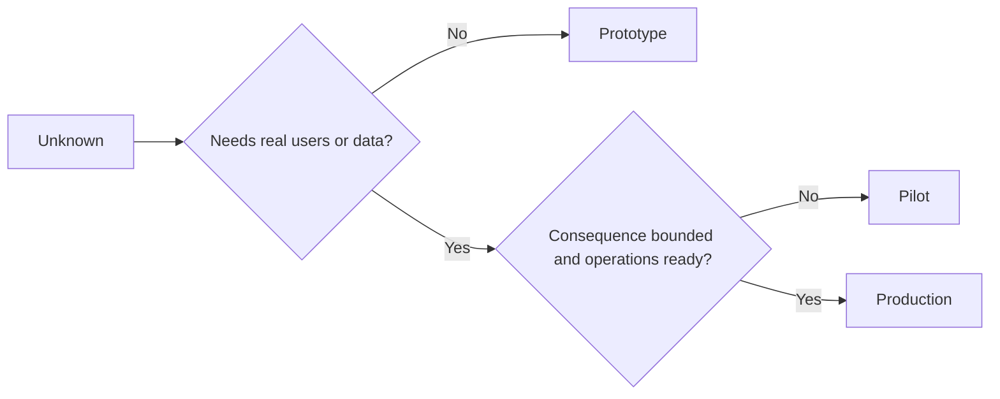

# Elige prototipo, piloto o producción deliberadamente.

> Esos son diferentes entornos de aprendizaje, no niveles de pulido. Elige la etapa que responda a la corriente desconocida con la menor consecuencia innecesaria.

> **【中文解读】**El prototip, el prototip, el prototip, el prototip, el prototip, el prototip, el prototip, el prototip, el prototip, el prototip, el prototip, el prototip, el prototip, el prototip, el prototip, el prototip, el prototip, el prototip, el prototip, el prototip, el prototip, el prototip, el prototip, el prototip, el prototip, el prototip, el prototip, el prototip, el prototip, el prototip, el prototip, el prototip, el prototip, el prototip, el prototip, el prototip, el prototip, el prototip, el prototip, el prototip, el prototip, el prototip, el prototip, el prototip, el prototip, el prototip, el prototip, el prototip, el prototip, el prototip, el prototip, el prototip, el prototip, el prototip, el prototip, el prototip, el prototip, el prototip, el prototip, el prototip, el prototip, el prototip, el prototip, el prototip, el prototip, el prototip, el prototip, el prototip, el prototip, el prototip, el proto, el proto, el proto, el proto, el proto, el proto, el proto, el proto, el proto, el proto, el proto, el proto, el proto, el proto, el proto, el proto, el proto, el proto, el proto, el proto, el proto, el proto, el proto, el proto, el, el, el, el, el, el, el, el, el, el, el, el, el, el, el, el, el, el, el, el, el, el, el, el, el, el, el, el, el, el, el, el, el, el, el, el, el, el, el, el, el, el, el, el, el, el, el, el, el, el, el, el, el, el, el, y el, el, el, el, el, el, el, el, y el, el, y el, el, el, el, y el, el, el, y el, el, el, el, y

> ¿ Qué es esto ?**【前置】**Se trata de un estudio de la enseñanza de la escuela de la escuela de la escuela de la escuela de la escuela de la escuela de la escuela de la escuela de la escuela de la escuela de la escuela de la escuela de la escuela de la escuela de la escuela de la escuela de la escuela de la escuela de la escuela de la escuela de la escuela de la escuela de la escuela de la escuela de la escuela de la escuela de la escuela de la escuela de la escuela de la escuela de la escuela de la escuela de la escuela de la escuela de la escuela de la escuela de la escuela de la escuela de la escuela de la escuela de la escuela de la escuela de la escuela de la escuela de la escuela de la escuela de la escuela de la escuela de la escuela de la escuela de la escuela de la escuela de la escuela de la escuela de la escuela de la escuela de la escuela de la escuela de la escuela de la escuela de la escuela de la escuela de la escuela de la escuela de la escuela de la escuela de la escuela de la escuela de la escuela de la escuela de la escuela de la escuela de la escuela de la escuela de la escuela de la escuela de la escuela de la escuela de la escuela de la escuela de la escuela de la escuela de la escuela de la escuela de la escuela de la escuela de la escuela de la escuela de la escuela de la escuela de la escuela de la escuela de la escuela de la escuela de la escuela de la escuela de la escuela de la escuela de la escuela de la escuela de la escuela de la escuela de la escuela de la escuela de la escuela de la escuela de la escuela de la escuela de la escuela de la escuela de la escuela de la escuela de la escuela de la escuela de la escuela de la escuela de la escuela de la escuela de la escuela de la escuela de la escuela de la escuela de la escuela de la escuela de la escuela de la escuela de la escuela de la escuela de la escuela de la escuela de la escuela de la escuela de la escuela de la escuela de la escuela de la escuela de la escuela de la escuela de la escuela de la escuela de la escuela de la escuela de la escuela de la escuela de la escuela de la escuela de la escuela de la escuela de la escuela de la escuela de la escuela de la escuela de la escuela de la escuela de la escuela de la escuela de la escuela de la escuela de la escuela de la escuela de la escuela de la escuela de la escuela de la escuela de la escuela de la escuela de la escuela`outputs/stage-decisions.json`Es la 54a clase de la línea de operaciones de la trituradora.

**Type:** Learn + Build | **类型:** 学习 + 动手实践
**Languages:** Python (stdlib) | **语言:** Python（标准库）
**Prerequisites:** Phase 14 lessons 50 to 52 | **前置知识:** Phase 14 第 50-52 课
**Time:** ~70 minutes | **时间:** 约 70 分钟

## Objetivos de aprendizaje

- Elige una etapa de construcción de lo desconocido, audiencia, datos, consecuencia y preparación.
  Según el desconocido, el público, los datos, los resultados y la disponibilidad de la elección de un arquivado.
- Definir los controles específicos de cada etapa y los criterios de salida.
  China: definición de los niveles de dominio y de los niveles de abandono.
- Prevenir que los prototipos se conviertan en sistemas de producción.
  Prevenir el tipo original a convertirse en sistema de producción.
- Retrasar la autoridad real hasta que la evidencia y las operaciones la justifiquen.
  Traducción:La verdadera autoridad se retrasa hasta que la prueba y la capacidad de transporte se apliquen a ella.

## Tres preguntas diferentes.

| Stage | Primary question |
|---|---|
| Prototype | Can this mechanism produce the evidence at all? |
| Pilot | Does it work safely with a bounded real audience and real conditions? |
| Production | Can we own it continuously at the promised reliability and risk level? |

Un prototipo puede ser técnicamente completo y aún desechable. Un piloto puede utilizar los datos de producción sin dejar de tener una audiencia y autoridad limitadas.

> **【中文解读】**Tres tipos de preguntas son tres diferentes: el modelo original: "¿qué prueba puede producir este mecanismo?", el punto de prueba: "¿es seguro en un grupo de personas con un público real y en condiciones reales?", el punto de producción: "¿podemos continuar poseyéndolo con un nivel de confianza y riesgo prometido"― la finalidad técnica no tiene relación con el grado.

## Protótipo original.

Utilice un prototipo cuando lo desconocido no requiera usuarios reales o datos reales.

> Cuando los datos desconocidos no necesitan usuarios reales o datos reales, utilice el modelo original.

- Discardable;
  Traducción:Cualquier vez que se le pueda tirar.
- aislados;
  En español: separarse.
- comportamiento limitado;
  En español: comportamiento.
- explícito sobre la cuestión de aprendizaje;
  Se trata de un proyecto de investigación que se desarrolla en el ámbito de la educación.
- libre de falsas garantías operativas.
  No tiene ningún falso cumplimiento de garantía.

No optimice la arquitectura antes de que el mecanismo gane otro paso.

> En este mecanismo ganar el siguiente ranking, no optimice la arquitectura.

> **【中文解读】**El más duro de los cinco artículos originales es "isolamento" y "no llevar falso transporte维保证": "isolamento garantiza que no sea posible cuando no sea posible; no se compromete a que nadie comience a depender de él".

## Pilot , prueba

Utilice un piloto cuando lo desconocido requiere un comportamiento real, datos realistas o un flujo de trabajo real, pero la consecuencia o la preparación aún no es compatible con la liberación general.

> Cuando los proyectos desconocidos requieren un comportamiento real, datos de un sentido real o un flujo de trabajo real, pero los resultados o la disponibilidad no son compatibles con la publicación de un amplio alcance, se utiliza el punto de prueba.

Un piloto necesita:

> 试点需要:

- un público designado;
  En el caso de los pueblos de la región de la isla de la isla de Guanajuato, el nombre de la población es el nombre de la población.
- un propietario humano;
  Un hombre responsable de la humanidad.
- duración y autoridad limitadas;
  Traducción:El tiempo y el poder de los límites.
- auditoría y retroceso;
  Traducción:El análisis y la revisión.
- los umbrales de salida y de barandillas de protección;
  En la traducción de la lengua inglesa, el resultado es el significado de la palabra "ser" (del inglés: resultados con el significado de "ser")
- criterios de salida para expandir, revisar o detener.
  Traducción:Expansion、修订或停止的退出标准──

> **【中文解读】**La característica definitiva del piloto es "real pero tiene límites": con datos reales, pero el nombre de público, tiempo de cobertura, restricción de derechos.

## Producción Producción

La producción necesita más que el despliegue:

> Producción de necesidades por depósito:

- objetivo de nivel de servicio;
  El objetivo de la organización es el de la organización.
- la propiedad en caso de llamada e incidencia;
  Traducción:La valoración de los accidentes;
- la revisión de la seguridad y la privacidad;
  Traducción:Seguridad y privacidad
- controles de costes y capacidad;
  Traducción:Cost & Capacity Control
- el retroceso y la recuperación;
  Traducción:Volver con el regreso.
- vigilancia continua;
  Traducción:continuante control;
- un camino de retiro.
  En inglés, el nombre de la familia de los "Crucifixionistas" es "Crucifixionistas".



> **【中文解读】**七项中最反直觉是最后一个"退役路径": entrar en producción antes de escribir cómo se va a salir. Esto no es una tristeza, sino reconocer que cada sistema tiene un ciclo de vida.

> ¿ Qué es esto ?**【类比】**Tres fases del proyecto: conducir un simulador de la escuela (en inglés: Driver's Training Center) (en inglés: Driver's Training Center) (en inglés: Driver's Training Center) (en inglés: Driver's Training Center) (en inglés: Driver's Training Center) (en inglés: Driver's Training Center) (en inglés: Driver's Training Center) (en inglés: Driver's Training Center) (en inglés: Driver's Training Center) (en inglés: Driver's Training Center) (en inglés: Driver's Training Center) (en inglés: Driver's Training Center) (en inglés: Driver's Training Center) (en inglés: Driver's Training Center) (en inglés: Driver's Training Center) (en inglés: Driver's Training Center) (en inglés: Driver's Training Center) (en inglés: Driver's Training Center) (en inglés: Driver's Training Center) (en inglés: Driver's Training Center) (en inglés: Driver's Training Center) (en inglés: Driver's Training Center) (en inglés: Driver's Training Center) (en inglés: Driver's Training Center) (en inglés: Driver's Training Center) (en inglés: Driver's Training Center) (en inglés: Driver's Training Center) (en inglés: Driver's Training Center) (en inglés: Driver's Training Center) (en inglés: Training Center) (en inglés: Training Center) (en inglés: en inglés: Training) (en inglés: en inglés) (en inglés: en inglés) (en inglés: en inglés) (en inglés: en inglés) (en inglés: en inglés: en inglés) (en inglés: en inglés: en inglés) (en inglés: en inglés: en inglés: en inglés: en inglés) (en inglés: en inglés: en inglés) (en inglés) (en inglés: en inglés) (en inglés: en inglés) (en inglés) (en inglés) (en inglés) (en inglés) (en inglés) (en inglés) (en inglés) (es), inglés) (en inglés) (es), inglés) (es), inglés) (en inglés) (es), inglés) (es), inglés) (es), ma sig sig sig sig sig sig sig sig sig sig sig sig sig sig sig sig sig sig sig sig sig sig sig sig sig sig sig

## La Drift de la etapa

El código prototipo se vuelve peligroso cuando adquiere usuarios, datos o autoridad sin adquirir propiedad. Marque los límites del prototipo y del piloto en la configuración, control de acceso, telemetría y documentación.

> Cuando el código original se obtiene de un usuario, datos o permisos sin ser atribuido, se vuelve peligroso. Escribir el límite entre el protocolo y el piloto en la configuración, el control de acceso, el remete y el archivo.

La etapa debe ser observable desde el propio sistema.

> 档位应能从系统本身被观察出来──

> **【中文解读】**阶段漂移(stade drift) es el incidente de silencio más común: "temporar running一下" del guión original entró en el flujo real, tres meses después se convirtió en un camino clave para que nadie se atreviera a reiniciar. La defensa debe caer en el control técnico sobre el control de la configuración, los derechos de acceso a los controles, los marcos de la distancia en lugar de la UI.

## Construye y realiza.

El laboratorio elige una etapa del contexto de la decisión, devuelve los controles requeridos y escribe `outputs/stage-decisions.json`¿ Qué ?

> Experiment code desde la decisión de la siguiente sección seleccionar el ranking  Return to the necessary control list, y escribir `outputs/stage-decisions.json`¿Qué es eso?

```bash
python3 code/main.py
python3 -m unittest discover code/tests -v
```

Cambiar el ejemplo piloto a una consecuencia baja con preparación para la operación.

> En el caso de los experimentos, el resultado es un resultado negativo y el desarrollo es un resultado negativo.

> **【中文解读】** `choose_stage`La respuesta de la experimentación posterior no está en el código: incluso si se determina que se produzca, todavía falta evidencia, como por ejemplo, la performance real de un periodo de tiempo en SLO, la revisión de seguridad, el establecimiento de un mecanismo de evaluación, el establecimiento de un grado de evaluación, es el "arredero mínimo", no el "través".

## Los ejercicios.

1. Clasificar tres proyectos actuales por etapa de aprendizaje, no por estado de despliegue.
   En el caso de los estudiantes, el programa de aprendizaje es un programa de aprendizaje.
2. Escriba criterios de salida del piloto que incluyan una decisión de parada.
   Traducción:Nuevo idioma: "Retour standard"
3. Añadir un control técnico que impida que un prototipo llegue a los datos de producción.
   China:加一条技术控制, impedir que el tipo original se encuentre en la producción de datos.
4. Identificar la primera responsabilidad operativa que hace que la producción de construcción.
   China: señalando la primera "接下它,构建就成了生产" de la responsabilidad de operación.
5. Diseñe un recibo de regreso para el piloto de bordo.
   Por ejemplo, el proyecto de investigación de la Universidad de San Francisco, en el estado de California, fue diseñado para la investigación de la investigación de la investigación de la Universidad de San Francisco.

## Más Leer más Leer más

- [Barry Boehm, A Spiral Model of Software Development and Enhancement](https://dl.acm.org/doi/10.1145/12944.12948), para la combinación de cada iteración con el compromiso de resolver el riesgo.
  Traducción:Boehm  espiral modelo  hacer que cada ronda  generación de compromisos con el riesgo resuelto 
- [Fagerholm et al., Building Blocks for Continuous Experimentation](https://doi.org/10.1145/2601248.2601276), para las condiciones organizativas y técnicas necesarias para la realización continua de los experimentos.
  China:Fagerholm等 Continuous experimentation  Continuous implementation of experimentation  Continuous carrying out the necessary organization and technical conditions 

## Lo que se conserva , se conserva el producto .

Mantenga .`outputs/stage-decisions.json`En él se registra por qué cada etapa es justificada y qué controles deben existir antes de la siguiente.

> Mantener`outputs/stage-decisions.json` Registra por qué se creó cada grado, así como los controles que deben existir antes de entrar en el siguiente grado
