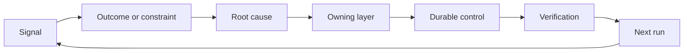

# Construye un Ratchet de Feedback con la propiedad y la jubilación.

> La navegación cierra un bucle de construcción y abre el bucle de aprendizaje.

> **【中文解读】**关上一个构建循环,同时开启学习循环. La evidencia debe cambiar el sistema, de lo contrario se convierte en datos de remoción no reconocidos por nadie.  本课是 Agent 工程方法论系列 (Phase 14 · 43-54)                                                                                                                                                                                                                                  

> ¿ Qué es esto ?**【前置】**Se trata de un proceso de investigación y desarrollo de la tecnología de la información y de la información, que se desarrolla en el ámbito de la información y de la información.

**Type:** Learn + Build | **类型:** 学习 + 动手实践
**Languages:** Python (stdlib) | **语言:** Python（标准库）
**Prerequisites:** Phase 14 lessons 46 and 53 | **前置知识:** Phase 14 第 46、53 课
**Time:** ~75 minutes | **时间:** 约 75 分钟

## Objetivos de aprendizaje

- Convierta incidentes, evaluaciones, comportamiento de los usuarios y correcciones en acciones propias.
  Traducción:把事故、评估、用户行为和纠正转化为有主人的行动──
- Enrutar cada señal al contexto, evaluación, política, tiempo de ejecución o atrasos.
  Traducción:把每类信号路由到上下文、评估、策略、运行时或等待列表──
- Priorizar la recurrencia por gravedad y frecuencia.
  Traducción:en la categoría de prioridad.
- Dar a todos los controles una condición de jubilación.
  Traducción:En el caso de los Estados Unidos, el gobierno de China ha adoptado medidas de control para cada uno de ellos.

## La retroalimentación es infraestructura.

Un equipo puede recopilar rastros, evaluaciones, boletos de apoyo y registros de incidentes sin aprender de ninguno de ellos.

> Un equipo puede recoger un registro, evaluación, trabajo y registro de accidentes, pero no puede aprender nada de cualquier cosa. El mecanismo de falta es "promoción": un artículo de observación a un camino claro de cambios duraderos, y los cambios con el propietario y la prueba.

El bucle es:

> Este ciclo es:

1. observar una señal concreta;
   En español: observar un mensaje específico.
2. conectarlo a un resultado, una restricción o una suposición;
   La traducción de la lengua china es: "La traducción de la lengua china es la traducción de la lengua china".
3. identificar la capa de sistema más temprana que posee la causa;
   En el primer sistema de la lengua chino, el sistema de la lengua chino se basa en la lengua china.
4. crear un cambio limitado;
   Traducción:Crear un cambio de una frontera;
5. verificar que la recurrencia es menos probable;
   La probabilidad de que el proceso de recuperación se produzca de nuevo en el país se ha reducido.
6. evaluar si el control debe permanecer.
   En la actualidad, el gobierno de la República de China ha mantenido su control en el país.

> **【中文解读】**"反是基础设施" significa: aprender no depende de la actitud de los mecanismos.

## Ruta a la capa de propiedad.

| Signal | Destination |
|---|---|
| False positive, regression, wrong result | Evaluation or test |
| Missing context, duplicate work, stale fact | Context source or retrieval route |
| Unsafe action or authority gap | Policy or permission boundary |
| Timeout, retry storm, unavailable dependency | Runtime control |
| New product need or unresolved tradeoff | Shaped backlog item |

No agregue otro párrafo inmediato cuando una prueba o permiso pueda hacer imposible el fallo.

> Cuando una prueba o un poder sobre hacer que algún tipo de fracaso se vuelva imposible, no vuelva a volver a la rapidez 里加一段话.



> **【中文解读】**路由表把"qué señal va donde" convertir en la operación de la búsqueda: err err errores resultados evaluar 缺上下文搜索 越权策略 超时运行时、新产品诉求待办. 核心纪律是"earliest valid layer"prompt es la posición de reparación más cara.

## La propiedad es parte del control.

Cada acción de ratchet necesita:

> Cada tramo de ruedas necesita:

- un propietario;
  En español: "Master".
- una prioridad basada en la consecuencia y la recurrencia;
  Traducción: basado en la prioridad de los resultados y la frecuencia de repetición;
- el artefacto a cambiar;
  En inglés, "La obra que hay que cambiar".
- la verificación que compruebe el cambio;
  Traducción:probar que el cambio de vida es efectivo;
- una ventana de revisión o de vencimiento;
  Traducción:Un revés o una ventana de espera;
- una condición de jubilación.
  Un término de la historia de la historia.

Una mejora no adquirida es una observación con mejor formato.

> No hay mejoras de los dueños, sólo un mejor registro de observación.

> **【中文解读】**六段里"恰好一个主人" y"退役条件" constituyen dos direcciones del giro de la trina: "主人保证变更真实落地(观察→行动), "退役条件保证控制不会无限堆积(行动→清理) 最后那句话值得贴在工单系统门口把"建议改成X"写得更漂亮不会让它发生,签署上一个名和一条验证命令才会.

## Retiro de los controles permanentes.

Los sistemas de retroalimentación acumulan políticas. Esa política puede volverse contradictoria y costosa.

> Contrarreloj de sistemas, y estas estrategias pueden llegar a ser contradictorias.

- cambios en la arquitectura o en el flujo de trabajo;
  Traducción:Arquitectura o trabajo fluye en cambio.
- una invariante de nivel inferior sustituye una instrucción de nivel superior;
  China: una constante de un nivel más bajo sustituye a una instrucción de nivel más alto.
- la falla protegida no se ha mostrado en la ventana elegida;
  China: en el pasado, el gobierno de China había estado en el control de la seguridad de la población.
- El control bloquea más a menudo el trabajo legítimo que evita el daño.
  Este control impide el trabajo normal más veces que lo hace.

La jubilación también necesita pruebas.

> No te pierdas el control porque "sientes que ya es hora".

> **【中文解读】**Este es el "trino de rueda" de la instalación de la botella: sólo dentro de la rotora de la rotora de la rotora de la rotora de la rotora de la rotora de la rotora de la rotora de la rotora de la rotora de la rotora de la rotora de la rotora de la rotora de la rotora de la rotora de la rotora de la rotora de la rotora de la rotora de la rotora de la rotora de la rotora de la rotora de la rotora de la rotora de la rotora de la rotora de la rotora de la rotora de la rotora de la rotora de la rotora de la rotora de la rotora de la rotora de la rotora de la rotora de la rotora de la rotora de la rotora de la rotora de la rotora de la rotora de la rotora de la rotora de la rotora de la rotora de la rotora de la rotora de la rotora de la rotora de la rotora de la rotora de la rotora de la rotora de la rotora de la rotora de la rotora de la rotora de la rotora de la rotora de la rotora de la rotora de la rotora de la rotora de la rotora de la rotora de la rotora de la rotora de la rotora de la rotora de la rotora de la rotora de la rotora de la rotora de la rotora de la rotora de la rotora de la rotora de la rotora de la rotora de la rotora de la rotora de la rotora de la rotora de la rotora de la rotora de la rotora de la rotora de la rotora de la rotora de la rotora de la rotora de la rotora de la rotora de la rotora de la rotora de la rotora de la rotora de la rotora de la rotora de la rotora de la rotora de la rotora de la rotora de la rotora de la rotora de la rotora de la rotora de la rotora de la rotora de la rotora de la rotora de la rotora de la rotora de la rotora de la rotora de la de la rotora de la de la de la rotora de la de

## Conectar Construir y codificar-Agencia Feedback.

El mismo ratchet sirve a ambas pistas:

> Con un servicio de trincillos.

- La evidencia del producto cambia el marco de resultados, las suposiciones, la rebanada o el plan de medición.
  En inglés, el método de cálculo de la cantidad de datos obtenidos en el proceso de cálculo de la cantidad de datos obtenidos en el proceso de cálculo de la cantidad de datos obtenidos en el proceso de cálculo de la cantidad de datos obtenidos en el proceso de cálculo de la cantidad de datos obtenidos en el proceso de cálculo de la cantidad de datos obtenidos en el proceso de cálculo de la cantidad de datos obtenidos en el proceso de cálculo de la cantidad de datos obtenidos en el proceso de cálculo de la cantidad de datos obtenidos en el proceso de cálculo de la cantidad de datos obtenidos en el proceso de cálculo de cálculo de la cantidad de datos obtenidos en el proceso de cálculo de cálculo de datos.
- Las correcciones de agentes de codificación cambian las pruebas, el contexto, el alcance, la automatización o la entrega.
  En inglés, el código de código de agente es el código de código de código de código de código de código de código de código de código de código de código de código de código de código de código de código de código de código de código de código de código de código de código de código de código de código de código de código de código de código de código de código de código de código de código de código de código de código de código de código de código de código de código de código de código de código de código de código de código de código de código de código de código de código de código de código de código de código de código de código de código de código de código de código de código de código de código de código de código de código de código de código de código de código de código de código de código de código de código de código de código de código de código de código de código de código de código de código de código de código de código de código de código de código de código de código de código de código de código de código de código de código de código de código de código de código de código de código de código de código de código de código de código de código de código de código de código de código de código de código de código de código de código de código de código de código de código de código de código de código de código de código de código de código de código de código de código de código de código de código de código de código de código de código de código de código de código de código de código de código de código de código de código de código de código de código de código de código de código de código de código de código de código de código de código de código de código de código de código de código de código de código de código de código de código de código de código de código de código de código de código de código de código de código de código de código de código de código de código de código de código de código de código de código de código de código de código de código de código de código de código de código de código de código de código de código de código de código de código de código de código de código de código de código de código de código de código de código de código de código de código de código de código de código de código de código de código de código de código de código de código de código de código de código de código de código de código de código de código de código de código de código de código de código de código de código de código de código de código de código
- Los incidentes pueden cambiar tanto el límite del producto como el banco de trabajo del agente.
  Accident can both change product boundaries, also can change Agent 工作台── también puede cambiar el producto.

Por eso la configuración de la construcción no es una fase que termina antes de codificar.

> Es por eso que "la forma de construir" no es una etapa en la que el código comienza antes de terminar, que pasa por cada cambio aceptado.

> **【中文解读】**Esta sección se cierra en la serie 43-54                                                                                                                                                                                                                                                                                                                                                                                                                                                                                                                   

## Construye y realiza.

El laboratorio clasifica las señales, crea acciones de ratchet propias, las prioriza y escribe.`outputs/feedback-backlog.json`¿ Qué ?

>                                                                                                                                                                                                                                                                                                                                                                                                                                                                                                                              `outputs/feedback-backlog.json`¿Qué es eso?

```bash
python3 code/main.py
python3 -m unittest discover code/tests -v
```

Añadir una señal de tiempo de espera de tiempo de ejecución y confirmar que se dirige a la hora de ejecución en lugar de la cartera general.

> Además de una señal de tiempo de ejecución, confirma que se ha encaminado al tiempo de ejecución en lugar de entrar en el sistema de espera general.

> **【中文解读】** `destination()`Con palabras clave: "Primero, el sistema real puede cambiar de componente o de división artificial".`promote()`则把六字段动作象化: prioridad = gravedad × frecuencia, para cada propósito fijar un determinado trabajo permanente, como`evaluations/regression-suite.json`)、 Certificado de validación fijo y condiciones de retiro de los números de datos.`expires_after_days`El significado de la palabra "adultado" no es "adultado" sino "adultado" es "adultado" o "adultado".

## Los ejercicios.

1. Convierta un incidente y una queja de usuario en acciones de ratchet.
   Traducción:把一次事故和一条用户投诉转写成棘轮动作
2. Nombre la capa más temprana que puede evitar cada repetición.
   China: señalando que puede detener el primer nivel de cada reaparición.
3. Añadir comandos de verificación o observaciones a la salida del laboratorio.
   Traducción:En la práctica, el experimento se realiza con un orden de prueba o observación.
4. Definir una condición de jubilación para una regla de póliza.
   Por ejemplo, el gobierno de la República de China ha establecido una política de retiro de las tropas de los Estados Unidos.
5. Trace uno aceptó la corrección de vuelta en el siguiente marco de tarea.
   Traducción:把一条被接受的纠正追溯到下一个任务框架里去.

## Más Leer más Leer más

- [Basili, Caldiera, and Rombach, The Goal Question Metric Approach](https://www.cs.toronto.edu/~sme/CSC444F/handouts/GQM-paper.pdf), para el aprendizaje organizacional a través de la medición orientada a objetivos.
  El método de la Misión de la organización se ha desarrollado en el campo de la Misión de la organización.
- [Fagerholm et al., Building Blocks for Continuous Experimentation](https://doi.org/10.1145/2601248.2601276), para el ciclo técnico y organizativo que conecta la evidencia con el desarrollo continuo del producto.
  China:Fagerholm, etc. Bloques de construcción de experiencias continuas, y los procesos de desarrollo de productos continuos, en el ciclo de la tecnología y la organización.
- [Nuseibeh and Easterbrook, Requirements Engineering: A Roadmap](https://www.cs.toronto.edu/~sme/papers/2000/ICSE2000.pdf), para tratar los requisitos como evolucionando a través del ciclo de vida del sistema.
  Nuevebeh y Easterbrook 需求工程:路线图把需求视为在系统生命周期中持续演化.

## Lo que se conserva , se conserva el producto .

Mantenga .`outputs/feedback-backlog.json`. Es el artefacto final del camino de evaluación y entrega del producto y la entrada al siguiente marco de resultados.

> Mantener`outputs/feedback-backlog.json` es la última pieza del camino de "producto de juicio y entrega", también es la entrada del siguiente resultado marco
