# Protocolo de comunicación .

> Los agentes que no hablan el mismo idioma no son un equipo, son extraños que gritan en el vacío.

> **【中文解读】**Este artículo presenta el protocolo de comunicación entre agentes y el método de estandarización de intercambio de información.

> **【拓展：communication protocols→具体应用】**现代多 Agent 通信协议的三个层次:(1) 传输层A2A (HTTP+JSON)、MCP (JSON-RPC)、gRPC;(2) 语义层Agent Card 描述能力,任务描述意图;(3) 协调层发言人选择、投票、协商──2026年的实践表明, la elección del protocolo de comunicación depende principalmente de las exigencias de retraso y de si se necesita colaboración entre organizaciones──


**Type:** Build | **类型:** 构建
**Languages:** TypeScript | **语言:** TypeScript
**Prerequisites:** Phase 14 (Agent Engineering), Lesson 16.01 (Why Multi-Agent) | **前置知识:** Phase 14 (Agent 工程), Lesson 16.01 (为什么需要多 Agent)
**Time:** ~120 minutes | **时间:** ~120 分钟

> ¿ Qué es esto ?**【前置】**学本节前请先掌握:Fase 14 Agent 工程基础) Fase 16·01-02 多 Agent 动机与FIPA 历史) Fase 13 MCP 协议) 本节动手实现多 Agent 通信选协议应按延迟和协作范围权衡──
> ¿ Qué es esto ?**【类比】**Más agentes 通信 = "herramienta de comunicación del equipo"──HTTP+JSON(A2A) = 邮件(异步、跨组织); JSON-RPC(MCP) = Slack(工具调用); gRPC = 内部电话(低延迟、强类型)──选错协议 = 团队效率灾难──

## Objetivos de aprendizaje

- Implementar la detección y la invocación de herramientas de MCP para que los agentes puedan utilizar herramientas expuestas por servidores externos
  Traducción: implementar MCP  herramienta de descubrimiento y调用, para permitir que el agente  pueda utilizar herramientas de exposición de servidores externos
- Construir una tarjeta de agente A2A y un punto final de tarea que permita a un agente delegar trabajo a otro a través de HTTP
  Construir A2A Agente 卡片和任务端点, permitir que un Agente a través de HTTP a otro Agente 委派工作
- Comparar el MCP (acceso a herramientas), el A2A (agente a agente), el ACP (auditoria empresarial) y el ANP (confianza descentralizada) y explicar qué protocolo resuelve qué problema
  China Translation: Comparación MCP (MCP) 工具访问 (MCP)  A2A (Agencia)  AACP (Agencia) 企业审计 (Auditoria de Empresas) y ANP (ANP)  去中心化信任), explicar qué acuerdo resolver qué problema
- Conectar múltiples protocolos juntos en un solo sistema donde los agentes descubren herramientas a través de MCP y delegan tareas a través de A2A
  Enlace en el sistema único de múltiples protocolos, Agente                                                                                                                                                                                                                                                                                                                                                                                                                                                                                                                 

## El problema es la introducción del problema

Se divide el sistema en múltiples agentes, un investigador, un codificador, un revisor, son excelentes en sus trabajos individuales, pero ahora se necesita que realmente hablen entre sí.

> Usted dividirá el sistema en varios agentes: un investigador, un codificador, un revisor. Ellos se desempeñan bien en sus propias tareas. Pero ahora necesitas que realmente se comuniquen entre sí.

El primer intento es obvio: pasar cadenas. El investigador devuelve un fragmento de texto, el codificador lo analiza de la manera que puede. Funciona hasta que el codificador malinterpreta un resumen de la investigación, o dos agentes se quedan en un punto muerto esperando el uno al otro, o necesitas agentes construidos por diferentes equipos para colaborar. De repente "sólo pasar cadenas" se desmorona.

> Su primer intento es evidente: transmite una cadena de trabajo. El investigador regresa a un bloque de texto, el codificador hace todo lo posible para resolverlo. Esto es un error en el codificador de resumen de estudio. Dos agentes esperan mutuamente para morir en la cerradura.

Sin un contrato compartido para cómo los agentes intercambian información, los sistemas multiagentes son frágiles, inaudibles e imposibles de escalar más allá de un puñado de agentes que usted personalmente escribió.

> Este es el problema del protocolo de comunicación. Sin agente, el acuerdo de intercambio de información, el sistema multiagente es frágil e inaudible y no puede extenderse a una minoría de agentes que usted mismo redacta.

El ecosistema de IA ha respondido con cuatro protocolos, cada uno resolviendo una parte diferente del problema:

- **MCP**para el acceso a las herramientas
  En inglés:**MCP**Usó para herramientas de acceso
- **A2A**para la colaboración entre agentes
  En inglés:**A2A**Para el agente 间协作
- **ACP**para la auditabilidad de las empresas
  En inglés:**ACP**Para la auditoría empresarial
- **ANP**para la identidad y la confianza descentralizadas
  En inglés:**ANP**Para descentrarse en la identidad y la confianza

Esta lección va en profundidad. Leerás formatos reales de cada especificación, construirás implementaciones de trabajo y conectarás los cuatro en un sistema unificado.

> En este curso se le dará una explicación profunda. Usted leerá el formato real de cada regla, la implementación construible y operativa, y conectará todos los cuatro protocolos en un sistema unificado.

## El concepto central.

### El panorama del protocolo

Piensa en estos cuatro protocolos como capas, cada una abordando una pregunta diferente:

> Considerar estos cuatro protocolos en diferentes niveles, cada uno para resolver diferentes problemas:

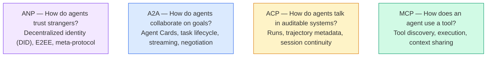

No son competidores, resuelven diferentes problemas a diferentes niveles.

> No son una competencia. En diferentes niveles resuelven diferentes problemas.

Un sistema de producción real utiliza múltiples protocolos juntos: MCP para herramientas dentro de su órgano, A2A para la colaboración con agentes, registro de trayectorias al estilo ACP para el cumplimiento, ANP para la identidad transorgánica.

> El verdadero conjunto de sistemas de producción utiliza varios protocolos: MCP utiliza herramientas dentro de la organización, A2A utiliza agentes, colaboración, etc.

### MCP (recap)

El MCP se cubre en profundidad en la Fase 13. Resumen rápido: MCP estandariza cómo un LLM se conecta con herramientas externas y fuentes de datos.**client-server**protocolo en el que el agente (cliente) descubre y llama a las herramientas expuestas por un servidor.

> MCP en la Fase 13 tiene una explicación profunda.**客户端-服务器**协议,Agent (客户端) encontró y utilizó el servidor para exponer los instrumentos.

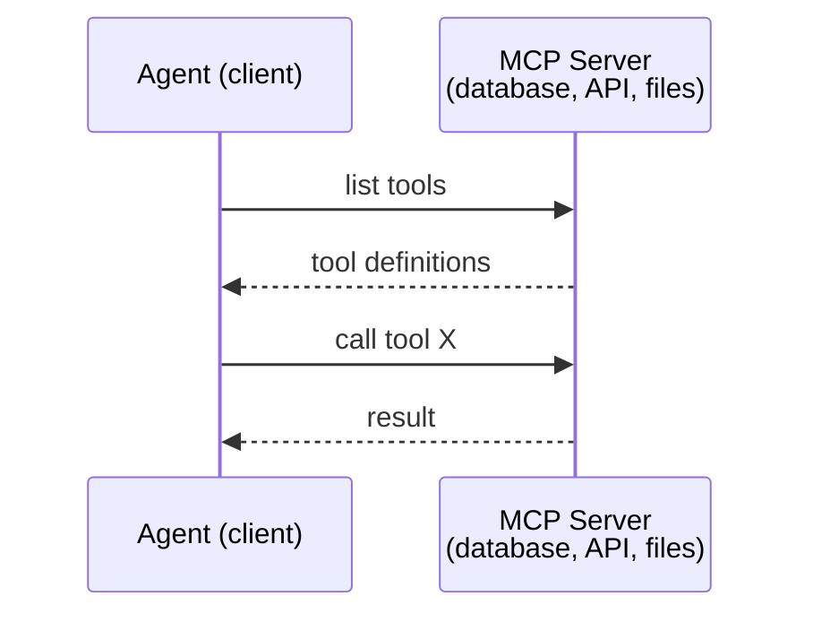

El MCP es **agent-to-tool**No ayuda a los agentes a hablar entre sí.

> MCP es**Agent 到工具**La comunicación... no puede ayudar a los agentes a comunicarse entre sí.

La división vertical/horizontal es limpia: MCP es el cable vertical (el agente llega hasta las herramientas/datos); A2A es el cable horizontal (el agente llega a través de los agentes pares).

> 垂直/水平分离清晰:MCP es vertical line;;Agencia hacia abajo hasta el instrumento/datos);A2A es horizontal line;;Agencia 横向到等等 Agent);; Producción sistemas necesita dos dos dos:

### A2A (Protocolo sobre agentes2agentes)

**Created by:**Google (ahora bajo la Fundación Linux como `lf.a2a.v1`(en inglés)
**Spec version:**1.0.0
**Problem:**¿Cómo colaboran, negocian y se delegan tareas los agentes autónomos?

> **创建者：**Google(现由 Linux Foundation 管理为 `lf.a2a.v1`(en inglés)
> **规范版本：**1.0.0
> **问题：**¿Cómo se puede coordinar, negociar y encargarse mutuamente?

A2A es el protocolo para **peer-to-peer agent collaboration**. Cuando MCP conecta a un agente a herramientas, A2A conecta a un agente a otros agentes.**Agent Card**en una URL conocida, y otros agentes descubren, negocian y delegan tareas a ella.

> A2A es**点对点 Agent 协作**协议──MCP 连接代理到工具,A2A 连接代理到其他代理──每一个代理在已知URL 发布一个**Agent 卡片**, otro agente puede encontrar, consultar y enviar tareas a su comisión.

#### Cómo funciona A2A

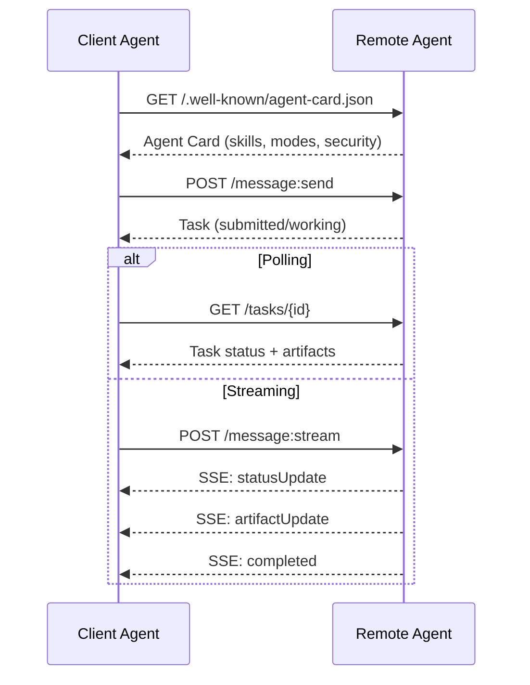

#### La tarjeta de agente real

Así es como se ve una tarjeta de agente A2A en la naturaleza.`GET /.well-known/agent-card.json`¿Qué es esto ?

```json
{
  "name": "Research Agent",
  "description": "Searches documentation and summarizes findings",
  "version": "1.0.0",
  "supportedInterfaces": [
    {
      "url": "https://research-agent.example.com/a2a/v1",
      "protocolBinding": "JSONRPC",
      "protocolVersion": "1.0"
    },
    {
      "url": "https://research-agent.example.com/a2a/rest",
      "protocolBinding": "HTTP+JSON",
      "protocolVersion": "1.0"
    }
  ],
  "provider": {
    "organization": "Your Company",
    "url": "https://example.com"
  },
  "capabilities": {
    "streaming": true,
    "pushNotifications": false
  },
  "defaultInputModes": ["text/plain", "application/json"],
  "defaultOutputModes": ["text/plain", "application/json"],
  "skills": [
    {
      "id": "web-research",
      "name": "Web Research",
      "description": "Searches the web and synthesizes findings",
      "tags": ["research", "search", "summarization"],
      "examples": ["Research the latest changes in React 19"]
    },
    {
      "id": "doc-analysis",
      "name": "Documentation Analysis",
      "description": "Reads and analyzes technical documentation",
      "tags": ["docs", "analysis"],
      "inputModes": ["text/plain", "application/pdf"],
      "outputModes": ["application/json"]
    }
  ],
  "securitySchemes": {
    "bearer": {
      "httpAuthSecurityScheme": {
        "scheme": "Bearer",
        "bearerFormat": "JWT"
      }
    }
  },
  "security": [{ "bearer": [] }]
}
```

Las cosas clave que hay que notar:
- **Skills**Cada uno tiene un ID, etiquetas y tipos MIME de entrada/salida compatibles. Así es como un agente cliente decide si este agente remoto puede manejar su solicitud.
  En inglés:**技能**Es algo que el agente puede hacer. Cada uno tiene un ID, etiquetado y soporte de entrada/salida de MIME tipo.
- **supportedInterfaces**Una sola agente puede hablar JSON-RPC, REST y gRPC simultáneamente.
  En inglés:**supportedInterfaces**列出多个协议绑定──单个代理可以同时使用JSON-RPC、REST 和 gRPC──
- **Security**El cliente sabe qué autor necesita antes de hacer una sola solicitud.
  En inglés:**安全性**En el caso de los clientes, el cliente necesita un certificado antes de enviar una sola solicitud.

#### Ciclo de vida de las tareas

Las tareas son la unidad central de trabajo en A2A. Se mueven a través de estados definidos:

> 任务是 A2A central de trabajo unidades.

La máquina de estado es lo que hace que A2A sea diferente de un simple RPC. Una tarea puede pausar (requiere entrada), reanudar (el cliente proporciona entrada), fallar o cancelarse. El cliente no necesita bloquear; hace encuestas o se suscribe a las actualizaciones.

> 状态机是 A2A y simple RPC. La tarea puede suspenderse (input-required) 恢复 (input-required) 客户端提供输入) 失败或取消.

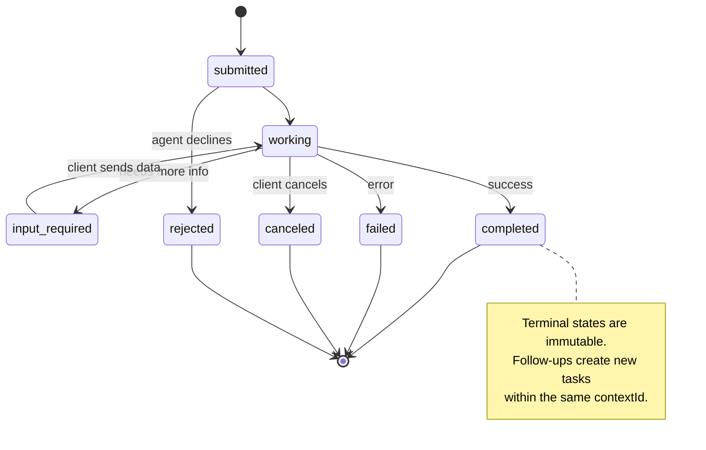

Los 8 estados (la especificación también define `UNSPECIFIED`como sentinela, omitido aquí):

> Todos los 8 estados están definidos.`UNSPECIFIED`作为哨兵, aquí en la provincia):

| State | Terminal? | Meaning / 含义 |
|---|---|---|
| `TASK_STATE_SUBMITTED` | No | Acknowledged, not yet processing / 已确认，尚未处理 |
| `TASK_STATE_WORKING` | No | Actively being processed / 正在处理 |
| `TASK_STATE_INPUT_REQUIRED` | No | Agent needs more info from client / Agent 需要客户端更多信息 |
| `TASK_STATE_AUTH_REQUIRED` | No | Authentication needed / 需要认证 |
| `TASK_STATE_COMPLETED` | Yes | Finished successfully / 成功完成 |
| `TASK_STATE_FAILED` | Yes | Finished with error / 出错完成 |
| `TASK_STATE_CANCELED` | Yes | Canceled before completion / 完成前取消 |
| `TASK_STATE_REJECTED` | Yes | Agent declined the task / Agent 拒绝任务 |

Los estados terminales (completados, fallidos, cancelados, rechazados) son inmutables  una vez que una tarea alcanza una, no se permiten más actualizaciones.`contextId`para preservar la continuidad de la sesión.

> 终态 (completado, fallido, cancelado, rechazado) es invariable una vez que la tarea llega al final, no permite una actualización adicional.`contextId`En la actualidad, el gobierno de China ha creado nuevas tareas para mantener la continuidad de la reunión.

Una vez que una tarea alcanza un estado terminal, es inmutable. No más mensajes. Seguimiento crea una nueva tarea dentro de la misma.`contextId`¿ Qué ?

> Una vez que la misión llega a su final, es inmutable. No puede volver a enviar mensajes.`contextId`Increar nuevas tareas.

#### Formatos de cable

A2A utiliza JSON-RPC 2.0. Esto es lo que un intercambio de mensajes real se ve:

**Client sends a task:**
```json
{
  "jsonrpc": "2.0",
  "id": 1,
  "method": "SendMessage",
  "params": {
    "message": {
      "messageId": "msg-001",
      "role": "ROLE_USER",
      "parts": [{ "text": "Research React 19 compiler features" }]
    },
    "configuration": {
      "acceptedOutputModes": ["text/plain", "application/json"],
      "historyLength": 10
    }
  }
}
```

**Agent responds with a task:**
```json
{
  "jsonrpc": "2.0",
  "id": 1,
  "result": {
    "task": {
      "id": "task-abc-123",
      "contextId": "ctx-xyz-789",
      "status": {
        "state": "TASK_STATE_COMPLETED",
        "timestamp": "2026-03-27T10:30:00Z"
      },
      "artifacts": [
        {
          "artifactId": "art-001",
          "name": "research-results",
          "parts": [{
            "data": {
              "findings": [
                "React 19 compiler auto-memoizes components",
                "No more manual useMemo/useCallback needed",
                "Compiler runs at build time, not runtime"
              ]
            },
            "mediaType": "application/json"
          }]
        }
      ]
    }
  }
}
```

**Streaming via SSE:**
```text
POST /message:stream HTTP/1.1
Content-Type: application/json
A2A-Version: 1.0

data: {"task":{"id":"task-123","status":{"state":"TASK_STATE_WORKING"}}}

data: {"statusUpdate":{"taskId":"task-123","status":{"state":"TASK_STATE_WORKING","message":{"role":"ROLE_AGENT","parts":[{"text":"Searching documentation..."}]}}}}

data: {"artifactUpdate":{"taskId":"task-123","artifact":{"artifactId":"art-1","parts":[{"text":"partial findings..."}]},"append":true,"lastChunk":false}}

data: {"statusUpdate":{"taskId":"task-123","status":{"state":"TASK_STATE_COMPLETED"}}}
```

### ACP (Protocolo de comunicación de los agentes)

**Created by:**IBM / BeeAI
**Spec version:**0.2.0 (OpenAPI 3.1.1)
**Status:**Fusión en A2A bajo la Fundación Linux
**Problem:**¿Cómo se comunican los agentes con plena auditabilidad, continuidad de la sesión y seguimiento de trayectoria?

> **创建者：**IBM / BeeAI
> **规范版本：**0.2.0 (OpenAPI 3.1.1)
> **状态：**Está en la A2A de la Fundación Linux
> **问题：**¿Cómo se comunica el agente en condiciones de seguimiento de trayectoria y de continuidad de conversaciones?

ACP es el **enterprise protocol**.A diferencia de lo que afirman muchos resúmenes, ACP hace **not**Es una API REST/JSON sencilla definida a través de OpenAPI. Lo que la hace especial es que**TrajectoryMetadata**: cada respuesta del agente puede llevar un registro detallado de los pasos de razonamiento y las llamadas de herramientas que la produjeron.

> ACP es**企业协议** Diferente de muchas afirmaciones de ACP **不**Utiliza JSON-LD. Es una API simple REST/JSON definida por OpenAPI. Su particularidad es que**TrajectoryMetadata**Cada agente puede llevar consigo sus pasos de evaluación y herramientas de consulta.

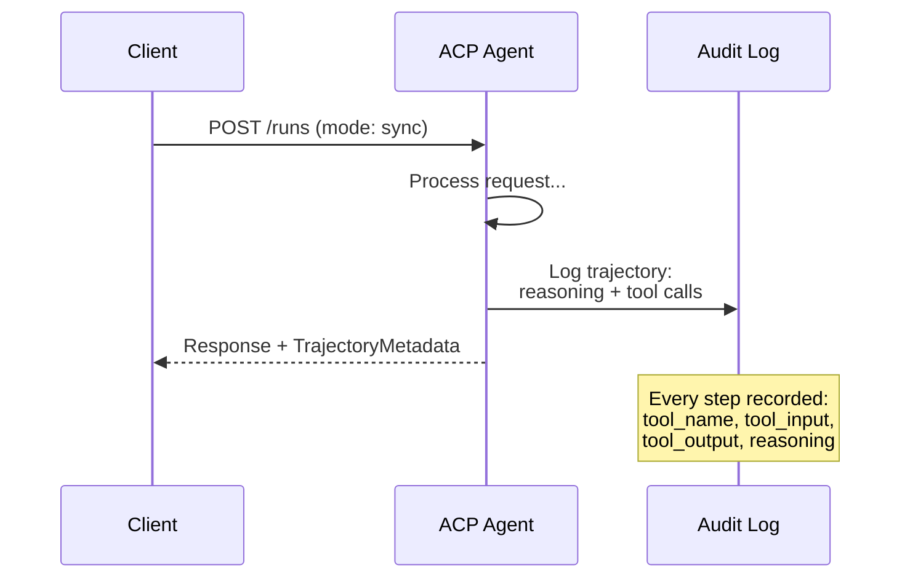

#### Agente Discovery en ACP

ACP define cuatro métodos de descubrimiento:

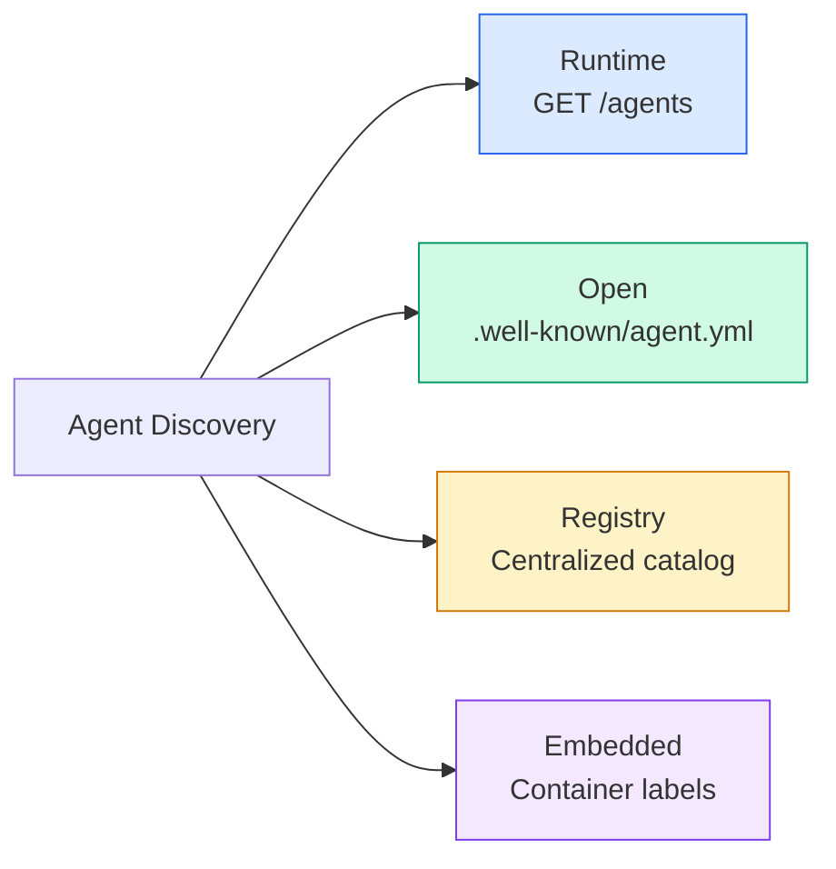

El **AgentManifest**Es más simple que la tarjeta de agente de A2A:

> **AgentManifest**Más sencillo que la tarjeta de agente de A2A:

```json
{
  "name": "summarizer",
  "description": "Summarizes documents with source citations",
  "input_content_types": ["text/plain", "application/pdf"],
  "output_content_types": ["text/plain", "application/json"],
  "metadata": {
    "tags": ["summarization", "RAG"],
    "framework": "BeeAI",
    "capabilities": [
      {
        "name": "Document Summarization",
        "description": "Condenses long documents into key points"
      }
    ],
    "recommended_models": ["llama3.3:70b-instruct-fp16"],
    "license": "Apache-2.0",
    "programming_language": "Python"
  }
}
```

No hay vínculos de protocolo (API REST única), no hay esquemas de seguridad (delegados al nivel del servidor), no hay lista de habilidades (las capacidades son metadatos planos).

> 没有协议绑定(单一 REST API) 没有安全方案(委托给服务器级别) 没有技能列表(能力是平元数据) 权衡:部署更简单,自描述性较差──

#### Ejecutar el ciclo de vida

ACP utiliza "Runs" en lugar de "Tasks".

> Utiliza ACP "Runs" en lugar de "Tasks"―Run es un agente de ejecución con tres modalidades:

| Mode | Behavior |
|---|---|
| `sync` | Blocking. Response contains the complete result. |
| `async` | Returns 202 immediately. Poll `GET /runs/{id}` for status. |
| `stream` | SSE stream. Events fire as the agent works. |

> # El modelo #
> ¿Qué es eso?
> ¿ Qué es eso ?`sync`# El bloqueo # La respuesta contiene el resultado completo #
> ¿ Qué es eso ?`async` Regresar inmediatamente a 202    `GET /runs/{id}`Obtenga el estado.
> ¿ Qué es eso ?`stream`♬ SSE 流──事件随随随随随随随随随随随随随随随随随随随随随随随随随随随随随随随随随随随随随随随随随随随随随随随随随随随随随随随随随随随随随随随随随随随随随随随随随随随随随随随随随随随随随随随随随随随随随随随随随随随随随随随随随随随随随随随随随随随随随随随随随随随随随随随随随随随随随随随随随随随随随随随随随随随随随随随随随随随随随随随随随随随随随随随随随随随随随随随随随随随随随随随随随随随随随随随随随随随随随随随随随随随随随随随随随随随随随随随随随随随随随随随随随随随随随随随随随随随随随随随随随随随随随随随随随随随随随随随随随随随随随随随随随随随随随随随随随随随随随随随随随随随随随随随随随随随随随随随随随随随随随随随随随随随随随随随随随随随随随随随随随随随随随随随随随随随随随随随随随随随随随随随随随随随随随随随随随随随随随随随随随随随随随随随随随随随随随随随随随随随随随随随随随随随随随随随随随随随随随随随随随随随随随随随随随随随随随随随随随随随随随随随随随随随随随随随随随随随随随随随随随随随随随随随随随随随随随随随随随随随随随随随随随随随随随随随随随随随随随随随.

La opción de modo hace mapas a los requisitos de experiencia del usuario: sincronización para consultas rápidas, asíncrono para trabajos de fondo, transmisión para tareas de larga duración donde el usuario desea indicadores de progreso.

> 模式选择映射到用户体验需求:sync 用于快速查询,async 用于后台作业,流 用于用户想要进度指示的长时间运行任务──

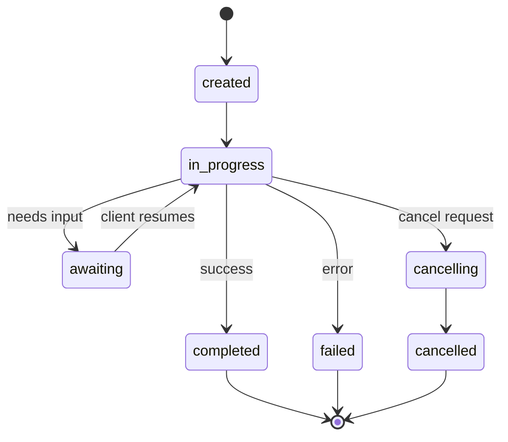

#### TrajectoriaMetadatos (El camino de la auditoría)

Este es el diferenciador clave de ACP. Cada parte del mensaje puede incluir metadatos que muestran exactamente lo que hizo el agente:

```json
{
  "role": "agent/researcher",
  "parts": [
    {
      "content_type": "text/plain",
      "content": "The weather in San Francisco is 72F and sunny.",
      "metadata": {
        "kind": "trajectory",
        "message": "I need to check the weather for this location",
        "tool_name": "weather_api",
        "tool_input": { "location": "San Francisco, CA" },
        "tool_output": { "temperature": 72, "condition": "sunny" }
      }
    }
  ]
}
```

Para las industrias reguladas, esto es oro. Cada respuesta viene con una cadena de razonamiento demostrable: qué herramientas se llamaron, qué entradas se utilizaron, qué salidas se recibieron.

> Para el sector regulado, es un tesoro invaluable. Cada respuesta tiene una cadena de discusión demostrable: ¿qué herramientas usaste?, qué entradas usaste?, qué salidas recibíaste?, no hay caja negra.

Los bancos, la salud y los servicios de gobierno requieren este tipo de auditoría.Los metadatos de trayectoria de ACP son lo que hace que los agentes de LLM sean aceptables en esos entornos.

> La banca, la salud y el gobierno necesitan esta auditoría.

ACP también apoya **CitationMetadata**para la atribución de origen:

> ACP también apoya**CitationMetadata**Utilizado para la categoría:

```json
{
  "kind": "citation",
  "start_index": 0,
  "end_index": 47,
  "url": "https://weather.gov/sf",
  "title": "NWS San Francisco Forecast"
}
```

### ANP (Protocolo de red de agentes)

**Created by:**Comunidad de código abierto (fundada por GaoWei Chang)
**Repo:** [github.com/agent-network-protocol/AgentNetworkProtocol](https://github.com/agent-network-protocol/AgentNetworkProtocol)
**Problem:**¿Cómo pueden los agentes de diferentes organizaciones confiar entre sí sin una autoridad central?

> **创建者：**开源社区(由 GaoWei Chang 创立)
> **代码库：** [github.com/agent-network-protocol/AgentNetworkProtocol](https://github.com/agent-network-protocol/AgentNetworkProtocol)
> **问题：**¿Cómo pueden confiar entre sí agentes de diferentes organizaciones sin autoridad central?

La ANP es la **decentralized identity protocol**. Construye confianza utilizando identificadores descentralizados (DID) de W3C y cifrado de extremo a extremo. A diferencia de A2A, donde descubres agentes a través de puntos finales conocidos, ANP permite a los agentes probar su identidad criptográficamente.

> ANP es**去中心化身份协议** utiliza el W3C 去中心化标识符 (DID) y el terminal hasta el terminal de cifrado para establecer confianza.

El ANP tiene tres capas:

> La ANP tiene tres niveles:

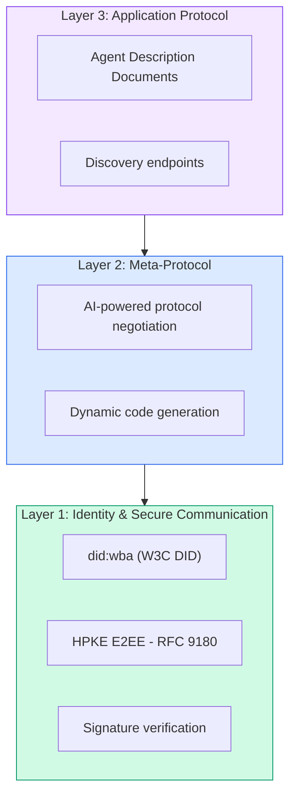

#### Documentación del DID (estructura real)

ANP utiliza un método personalizado llamado DID `did:wba`El DID .`did:wba:example.com:user:alice`se resuelve a `https://example.com/user/alice/did.json`¿Qué es esto ?

```json
{
  "@context": [
    "https://www.w3.org/ns/did/v1",
    "https://w3id.org/security/suites/jws-2020/v1",
    "https://w3id.org/security/suites/secp256k1-2019/v1"
  ],
  "id": "did:wba:example.com:user:alice",
  "verificationMethod": [
    {
      "id": "did:wba:example.com:user:alice#key-1",
      "type": "EcdsaSecp256k1VerificationKey2019",
      "controller": "did:wba:example.com:user:alice",
      "publicKeyJwk": {
        "crv": "secp256k1",
        "x": "NtngWpJUr-rlNNbs0u-Aa8e16OwSJu6UiFf0Rdo1oJ4",
        "y": "qN1jKupJlFsPFc1UkWinqljv4YE0mq_Ickwnjgasvmo",
        "kty": "EC"
      }
    },
    {
      "id": "did:wba:example.com:user:alice#key-x25519-1",
      "type": "X25519KeyAgreementKey2019",
      "controller": "did:wba:example.com:user:alice",
      "publicKeyMultibase": "z9hFgmPVfmBZwRvFEyniQDBkz9LmV7gDEqytWyGZLmDXE"
    }
  ],
  "authentication": [
    "did:wba:example.com:user:alice#key-1"
  ],
  "keyAgreement": [
    "did:wba:example.com:user:alice#key-x25519-1"
  ],
  "humanAuthorization": [
    "did:wba:example.com:user:alice#key-1"
  ],
  "service": [
    {
      "id": "did:wba:example.com:user:alice#agent-description",
      "type": "AgentDescription",
      "serviceEndpoint": "https://example.com/agents/alice/ad.json"
    }
  ]
}
```

Las cosas clave que hay que notar:
- **Key separation**Las claves de firma (secp256k1) están separadas de las claves de cifrado (X25519).
  En inglés:**密钥分离**Es obligatorio. Es un secreto.
- **`humanAuthorization`**Las claves de acceso a los datos de acceso a Internet son las claves de acceso a Internet que son únicas a la ANP. Estas claves requieren la aprobación humana explícita (biométrica, contraseña, HSM) antes de su uso.
  En inglés:**`humanAuthorization`**Es un ANP único. Estas claves están en uso antes de necesitarse una aprobación de la persona.
- **`keyAgreement`**las claves se utilizan para el cifrado de extremo a extremo HPKE (RFC 9180).
  En inglés:**`keyAgreement`**密钥用于HPKE 端到端加密(RFC 9180)。
- El **service**Enlaces a la sección del documento de descripción del agente.
  En inglés:**service**部分链接到 Agente 描述文档──

El patrón de separación de claves es lo que requieren los sistemas criptográficos del mundo real pero los protocolos JSON a menudo se saltan. ANP lo impone porque los agentes trans-organizacionales manejan dinero, contratos y PII  una sola clave comprometida no debe desbloquear todas las capacidades.

> El modelo de separación de llaves es requerido por los sistemas de cifrado real, pero el protocolo JSON se saltó a menudo.

#### Cómo funciona la confianza en la ANP

La ANP lo hace.**not**El uso de una web de confianza o un gráfico de aprobación.

> ANP **不**La confianza es bilateral, cada vez que se hace una interacción se verifica:

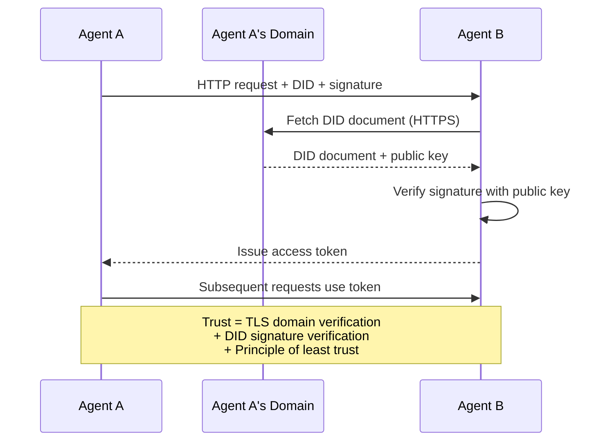

La confianza proviene de tres fuentes:
1. **Domain-level TLS**verifica el host del documento DID
   En inglés:**域级 TLS**验证 DID 文档主机 验证 DID 文档主机
2. **DID cryptographic signatures**verificar la identidad del agente
   En inglés:**DID 加密签名**验证 Agent's身份 (la identidad del agente)
3. **Principle of least trust**otorga sólo permisos mínimos
   En inglés:**最小信任原则** Sólo otorgar el mínimo de derechos

El diseño de tres fuentes evita puntos únicos de falla. TLS por sí solo es insuficiente (cualquiera con un certificado puede alojar un DID). DID por sí solo es insuficiente (una clave robada falsifica identidad).

> Sólo TLS no es suficiente (Todo el que tenga un certificado puede administrar DID) Sólo DID no es suficiente (Todo el que tenga un certificado puede administrar DID) Con el mínimo de confianza, obtienes una defensa y no necesitas un poder central.

No hay propagación de confianza basada en chismes o puntuación de PageRank.

> 没有基于八的信任传播或 PageRank 评分──你直接通过 DID 验证每个代理──

#### Negociación del meta-protocolo

Esta es la característica más novedosa de ANP. Cuando dos agentes de ecosistemas diferentes se encuentran, no necesitan formatos de datos previamente acordados. Negocian en lenguaje natural:

> Esta es la última función de la ANP. Cuando dos agentes de diferentes ecosistemas se encuentran, no necesitan un formato de datos predeterminado.

```json
{
  "action": "protocolNegotiation",
  "sequenceId": 0,
  "candidateProtocols": "I can communicate using:\n1. JSON-RPC with hotel booking schema\n2. REST with OpenAPI 3.1 spec\n3. Natural language over HTTP",
  "modificationSummary": "Initial proposal",
  "status": "negotiating"
}
```

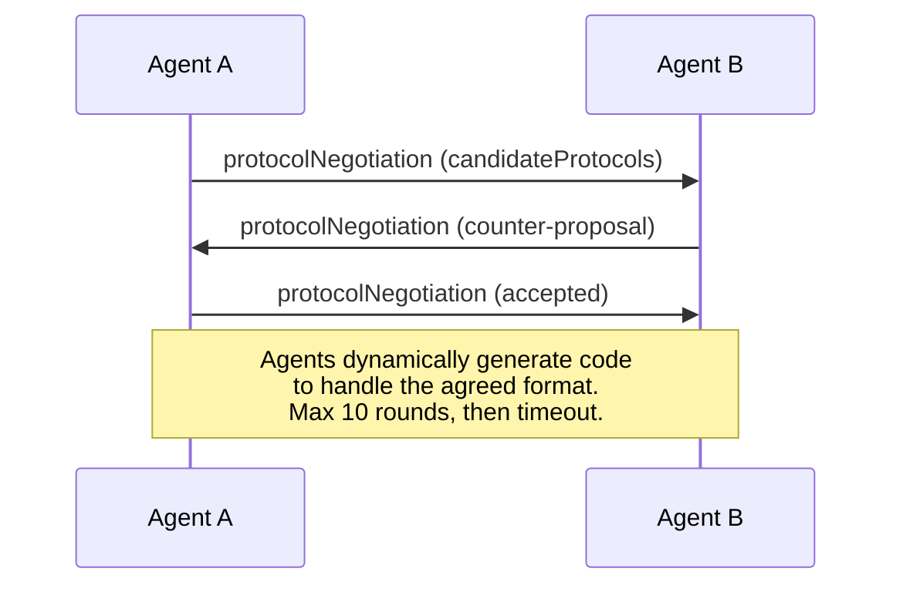

Los agentes van y van (máximo 10 disparos) hasta que se acuerdan en un formato, luego generan dinámicamente código para manejarlo.`negotiating`¿ Qué ?`rejected`¿ Qué ?`accepted`¿ Qué ?`timeout`¿ Qué ?

> Agente volver a consultar (no más de 10 rutas) hasta que el formato se acuerde, luego se genera un código para procesarlo.`negotiating`(协商中)`rejected`(rechazado)`accepted`(acceptado)`timeout`(超时)

Esto significa que dos agentes que nunca se han visto pueden descubrir cómo comunicarse sin que nadie pre-definir un esquema compartido.

> Esto significa que dos agentes nunca vistos pueden encontrar una forma de comunicarse sin que nadie pre-definiera el modelo de compartir.

La visión: una web de agentes abiertos donde cualquier agente puede hablar con cualquier otro agente, ad-hoc, sin trabajo de integración previo. Si esta escala más allá de las demostraciones de juguetes es una pregunta abierta de 2026.

> 愿景: Open Agent 网络中的任何 Agent可以与任何其他 Agent 临时对话,无需前期集成工作──这是否能扩展到玩具演示之外是2026年开放问题──后备总是"Usar A2A并预先就模式达成"",

### Comparación (corregida)

| | MCP | A2A | ACP | ANP |
|---|---|---|---|---|
| **Created by** | Anthropic | Google / Linux Foundation | IBM / BeeAI | Community |
| **Spec format** | JSON-RPC | JSON-RPC / REST / gRPC | OpenAPI 3.1 (REST) | JSON-RPC |
| **Primary use** | Agent to Tool | Agent to Agent | Agent to Agent | Agent to Agent |
| **Discovery** | Tool listing | `/.well-known/agent-card.json` | `GET /agents`, `/.well-known/agent.yml` | `/.well-known/agent-descriptions`, DID service endpoints |
| **Identity** | Implicit (local) | Security schemes (OAuth, mTLS) | Server-level | W3C DID (`did:wba`) with E2EE |
| **Audit trail** | N/A | Basic (task history) | TrajectoryMetadata (tool calls, reasoning) | Not formally specified |
| **State machine** | N/A | 9 task states | 7 run states | N/A |
| **Streaming** | N/A | SSE | SSE | Transport-agnostic |
| **Unique feature** | Tool schemas | Agent Cards + Skills | Trajectory audit trail | Meta-protocol negotiation |
| **Best for** | Tools & data | Dynamic collaboration | Regulated industries | Cross-org trust |
| **Status** | Stable | Stable (v1.0) | Merging into A2A | Active development |

### Cómo trabajan juntos

Estos protocolos no se excluyen mutuamente.

> Estos acuerdos no se reúnen entre sí.

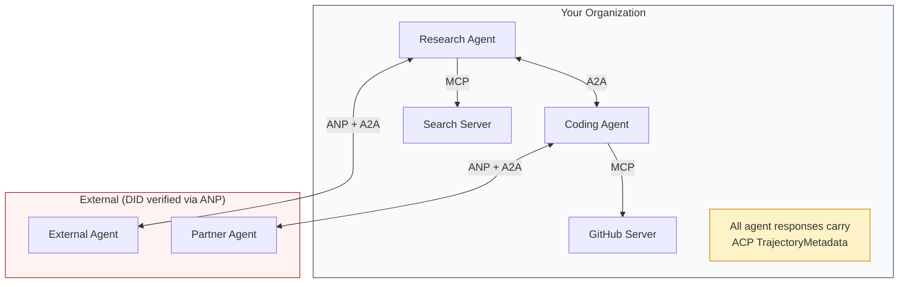

- **MCP**conecta cada agente a sus herramientas
  En inglés:**MCP**Para que cada agente se conecte a sus herramientas
- **A2A**maneja la colaboración entre agentes (internos y externos)
  En inglés:**A2A**处理 Agent 之间的协作( interno y externo)
- **ACP**Envuelve las respuestas en metadatos de trayectoria para su auditabilidad
  En inglés:**ACP**Utilizando el paquete de datos de la trayectoria para lograr la auditoría
- **ANP**provee verificación de identidad para agentes que no controlas
  En inglés:**ANP**Por qué no tienes control de un agente que provee un certificado de identidad

## Construye y realiza.
```figure
swarm-message-bus
```

## Construye el mismo

### Paso 1: Tipos de mensajes esenciales

Cada sistema multi-agente comienza con un formato de mensaje. Definimos tipos que se corresponden a lo que usan los protocolos reales:

> Cada sistema de múltiples agentes comienza en formato de mensajes. Hemos definido el tipo de uso de mapas a protocolo real:

```typescript
import crypto from "node:crypto";

type MessageRole = "user" | "agent";

type MessagePart =
  | { kind: "text"; text: string }
  | { kind: "data"; data: unknown; mediaType: string }
  | { kind: "file"; name: string; url: string; mediaType: string };

type TrajectoryEntry = {
  reasoning: string;
  toolName?: string;
  toolInput?: unknown;
  toolOutput?: unknown;
  timestamp: number;
};

type AgentMessage = {
  id: string;
  role: MessageRole;
  parts: MessagePart[];
  trajectory?: TrajectoryEntry[];
  replyTo?: string;
  timestamp: number;
};

function createMessage(
  role: MessageRole,
  parts: MessagePart[],
  replyTo?: string
): AgentMessage {
  return {
    id: crypto.randomUUID(),
    role,
    parts,
    replyTo,
    timestamp: Date.now(),
  };
}

function textMessage(role: MessageRole, text: string): AgentMessage {
  return createMessage(role, [{ kind: "text", text }]);
}
```

Nota: `MessagePart`Es multimodal (texto, datos estructurados, archivos) al igual que las especificaciones reales A2A y ACP. `TrajectoryEntry`El método de cálculo de la meta-datas de la trayectoria de los ACP es el método de cálculo de la meta-datas de la trayectoria de los ACP.

> Nota:`MessagePart`Es un modelo de texto estructurado, como en el caso de las normas A2A y ACP.`TrajectoryEntry` capturar la cadena de cálculo, adaptarse a la trayectoria de los ACP

### Paso 2: Tarjeta de agente A2A y registro

Construir un agente de descubrimiento que coincida con la especificación real de A2A:

> 构建匹配真实A2A 规范的代理 发现:

```typescript
type Skill = {
  id: string;
  name: string;
  description: string;
  tags: string[];
  inputModes: string[];
  outputModes: string[];
};

type AgentCard = {
  name: string;
  description: string;
  version: string;
  url: string;
  capabilities: {
    streaming: boolean;
    pushNotifications: boolean;
  };
  defaultInputModes: string[];
  defaultOutputModes: string[];
  skills: Skill[];
};

class AgentRegistry {
  private cards: Map<string, AgentCard> = new Map();

  register(card: AgentCard) {
    this.cards.set(card.name, card);
  }

  discoverBySkillTag(tag: string): AgentCard[] {
    return [...this.cards.values()].filter((card) =>
      card.skills.some((skill) => skill.tags.includes(tag))
    );
  }

  discoverByInputMode(mimeType: string): AgentCard[] {
    return [...this.cards.values()].filter(
      (card) =>
        card.defaultInputModes.includes(mimeType) ||
        card.skills.some((skill) => skill.inputModes.includes(mimeType))
    );
  }

  resolve(name: string): AgentCard | undefined {
    return this.cards.get(name);
  }

  listAll(): AgentCard[] {
    return [...this.cards.values()];
  }
}
```

Esto es mucho más rico que un simple mapa de nombre a capacidad. Puedes descubrir agentes por etiquetas de habilidad, por tipos de entrada MIME, o por nombre, tal como lo soporta la especificación real A2A.

> Esto es mucho más rico que el simple nombre a la capacidad de mapeo. Puedes ingresar a través de etiquetas de habilidades, tipo MIME o nombre de encuentro de agente, como en el caso de la verdadera A2A.

### Paso 3: Ciclo de vida de las tareas A2A

Construir la máquina de estado de tarea completa:

> 构建完整的任务状态机:

```typescript
type TaskState =
  | "submitted"
  | "working"
  | "input-required"
  | "auth-required"
  | "completed"
  | "failed"
  | "canceled"
  | "rejected";

const TERMINAL_STATES: TaskState[] = [
  "completed",
  "failed",
  "canceled",
  "rejected",
];

type TaskStatus = {
  state: TaskState;
  message?: AgentMessage;
  timestamp: number;
};

type Artifact = {
  id: string;
  name: string;
  parts: MessagePart[];
};

type Task = {
  id: string;
  contextId: string;
  status: TaskStatus;
  artifacts: Artifact[];
  history: AgentMessage[];
};

type TaskEvent =
  | { kind: "statusUpdate"; taskId: string; status: TaskStatus }
  | {
      kind: "artifactUpdate";
      taskId: string;
      artifact: Artifact;
      append: boolean;
      lastChunk: boolean;
    };

type TaskHandler = (
  task: Task,
  message: AgentMessage
) => AsyncGenerator<TaskEvent>;

class TaskManager {
  private tasks: Map<string, Task> = new Map();
  private handlers: Map<string, TaskHandler> = new Map();
  private listeners: Map<string, ((event: TaskEvent) => void)[]> = new Map();

  registerHandler(agentName: string, handler: TaskHandler) {
    this.handlers.set(agentName, handler);
  }

  subscribe(taskId: string, listener: (event: TaskEvent) => void) {
    const existing = this.listeners.get(taskId) ?? [];
    existing.push(listener);
    this.listeners.set(taskId, existing);
  }

  async sendMessage(
    agentName: string,
    message: AgentMessage,
    contextId?: string
  ): Promise<Task> {
    const handler = this.handlers.get(agentName);
    if (!handler) {
      const task = this.createTask(contextId);
      task.status = {
        state: "rejected",
        timestamp: Date.now(),
        message: textMessage("agent", `No handler for ${agentName}`),
      };
      return task;
    }

    const task = this.createTask(contextId);
    task.history.push(message);
    task.status = { state: "submitted", timestamp: Date.now() };

    this.processTask(task, handler, message).catch((err) => {
      task.status = {
        state: "failed",
        timestamp: Date.now(),
        message: textMessage("agent", String(err)),
      };
    });
    return task;
  }

  getTask(taskId: string): Task | undefined {
    return this.tasks.get(taskId);
  }

  cancelTask(taskId: string): boolean {
    const task = this.tasks.get(taskId);
    if (!task || TERMINAL_STATES.includes(task.status.state)) return false;
    task.status = { state: "canceled", timestamp: Date.now() };
    this.emit(taskId, {
      kind: "statusUpdate",
      taskId,
      status: task.status,
    });
    return true;
  }

  private createTask(contextId?: string): Task {
    const task: Task = {
      id: crypto.randomUUID(),
      contextId: contextId ?? crypto.randomUUID(),
      status: { state: "submitted", timestamp: Date.now() },
      artifacts: [],
      history: [],
    };
    this.tasks.set(task.id, task);
    return task;
  }

  private async processTask(
    task: Task,
    handler: TaskHandler,
    message: AgentMessage
  ) {
    task.status = { state: "working", timestamp: Date.now() };
    this.emit(task.id, {
      kind: "statusUpdate",
      taskId: task.id,
      status: task.status,
    });

    try {
      for await (const event of handler(task, message)) {
        if (TERMINAL_STATES.includes(task.status.state)) break;

        if (event.kind === "statusUpdate") {
          task.status = event.status;
        }
        if (event.kind === "artifactUpdate") {
          const existing = task.artifacts.find(
            (a) => a.id === event.artifact.id
          );
          if (existing && event.append) {
            existing.parts.push(...event.artifact.parts);
          } else {
            task.artifacts.push(event.artifact);
          }
        }
        this.emit(task.id, event);
      }
    } catch (err) {
      task.status = {
        state: "failed",
        timestamp: Date.now(),
        message: textMessage("agent", String(err)),
      };
      this.emit(task.id, {
        kind: "statusUpdate",
        taskId: task.id,
        status: task.status,
      });
    }
  }

  private emit(taskId: string, event: TaskEvent) {
    for (const listener of this.listeners.get(taskId) ?? []) {
      listener(event);
    }
  }
}
```

Esto implementa el ciclo de vida real de las tareas A2A: presentadas, trabajadas, requeridas de entrada, estados terminales. Los manipuladores son generadores de sincronización que producen eventos (actualizaciones de estado y fragmentos de artefactos) que coinciden con el modelo de transmisión SSE.

> Esto logró un verdadero ciclo de vida de la misión A2A:sendido, trabajando, requerido, final.

### Paso 4: Camino de auditoría de estilo ACP

Comunicación con seguimiento de trayectoria:

> Usar el siguiente código de acceso:

```typescript
type AuditEntry = {
  runId: string;
  agentName: string;
  input: AgentMessage[];
  output: AgentMessage[];
  trajectory: TrajectoryEntry[];
  status: "created" | "in-progress" | "completed" | "failed" | "awaiting";
  startedAt: number;
  completedAt?: number;
  sessionId?: string;
};

class AuditableRunner {
  private log: AuditEntry[] = [];
  private handlers: Map<
    string,
    (input: AgentMessage[]) => Promise<{
      output: AgentMessage[];
      trajectory: TrajectoryEntry[];
    }>
  > = new Map();

  registerAgent(
    name: string,
    handler: (input: AgentMessage[]) => Promise<{
      output: AgentMessage[];
      trajectory: TrajectoryEntry[];
    }>
  ) {
    this.handlers.set(name, handler);
  }

  async run(
    agentName: string,
    input: AgentMessage[],
    sessionId?: string
  ): Promise<AuditEntry> {
    const entry: AuditEntry = {
      runId: crypto.randomUUID(),
      agentName,
      input: structuredClone(input),
      output: [],
      trajectory: [],
      status: "created",
      startedAt: Date.now(),
      sessionId,
    };
    this.log.push(entry);

    const handler = this.handlers.get(agentName);
    if (!handler) {
      entry.status = "failed";
      return entry;
    }

    entry.status = "in-progress";
    try {
      const result = await handler(input);
      entry.output = structuredClone(result.output);
      entry.trajectory = structuredClone(result.trajectory);
      entry.status = "completed";
      entry.completedAt = Date.now();
    } catch (err) {
      entry.status = "failed";
      entry.trajectory.push({
        reasoning: `Error: ${String(err)}`,
        timestamp: Date.now(),
      });
      entry.completedAt = Date.now();
    }
    return entry;
  }

  getFullAuditLog(): AuditEntry[] {
    return structuredClone(this.log);
  }

  getAuditLogForAgent(agentName: string): AuditEntry[] {
    return structuredClone(
      this.log.filter((e) => e.agentName === agentName)
    );
  }

  getAuditLogForSession(sessionId: string): AuditEntry[] {
    return structuredClone(
      this.log.filter((e) => e.sessionId === sessionId)
    );
  }

  getTrajectoryForRun(runId: string): TrajectoryEntry[] {
    const entry = this.log.find((e) => e.runId === runId);
    return entry ? structuredClone(entry.trajectory) : [];
  }
}
```

Cada ejecución de un agente produce una entrada de auditoría completa: lo que entró, lo que salió, y la trayectoria completa de las llamadas de herramientas y los pasos de razonamiento entre ellos.

> Cada vez que el agente ejecuta, se produce un artículo de auditoría completo: lo que se ha introducido, lo que se ha producido, y la trayectoria completa de los pasos de la utilización y la formulación de las herramientas.

### Paso 5: Verificación de identidad de estilo ANP

Construir identidad y verificación basadas en DID:

> Construcción basada en la identidad y la verificación de DID:

```typescript
type VerificationMethod = {
  id: string;
  type: string;
  controller: string;
  publicKeyDer: string;
};

type DIDDocument = {
  id: string;
  verificationMethod: VerificationMethod[];
  authentication: string[];
  keyAgreement: string[];
  humanAuthorization: string[];
  service: { id: string; type: string; serviceEndpoint: string }[];
};

type AgentIdentity = {
  did: string;
  document: DIDDocument;
  privateKey: crypto.KeyObject;
  publicKey: crypto.KeyObject;
};

class IdentityRegistry {
  private documents: Map<string, DIDDocument> = new Map();

  publish(doc: DIDDocument) {
    this.documents.set(doc.id, doc);
  }

  resolve(did: string): DIDDocument | undefined {
    return this.documents.get(did);
  }

  verify(did: string, signature: string, payload: string): boolean {
    const doc = this.documents.get(did);
    if (!doc) return false;

    const authKeyIds = doc.authentication;
    const authKeys = doc.verificationMethod.filter((vm) =>
      authKeyIds.includes(vm.id)
    );

    for (const key of authKeys) {
      const publicKey = crypto.createPublicKey({
        key: Buffer.from(key.publicKeyDer, "base64"),
        format: "der",
        type: "spki",
      });
      const isValid = crypto.verify(
        null,
        Buffer.from(payload),
        publicKey,
        Buffer.from(signature, "hex")
      );
      if (isValid) return true;
    }
    return false;
  }

  requiresHumanAuth(did: string, operationKeyId: string): boolean {
    const doc = this.documents.get(did);
    if (!doc) return false;
    return doc.humanAuthorization.includes(operationKeyId);
  }
}

function createIdentity(domain: string, agentName: string): AgentIdentity {
  const did = `did:wba:${domain}:agent:${agentName}`;
  const { publicKey, privateKey } = crypto.generateKeyPairSync("ed25519");

  const publicKeyDer = publicKey
    .export({ format: "der", type: "spki" })
    .toString("base64");

  const keyId = `${did}#key-1`;
  const encKeyId = `${did}#key-x25519-1`;

  const document: DIDDocument = {
    id: did,
    verificationMethod: [
      {
        id: keyId,
        type: "Ed25519VerificationKey2020",
        controller: did,
        publicKeyDer,
      },
      {
        id: encKeyId,
        type: "X25519KeyAgreementKey2019",
        controller: did,
        publicKeyDer,
      },
    ],
    authentication: [keyId],
    keyAgreement: [encKeyId],
    humanAuthorization: [],
    service: [
      {
        id: `${did}#agent-description`,
        type: "AgentDescription",
        serviceEndpoint: `https://${domain}/agents/${agentName}/ad.json`,
      },
    ],
  };

  return { did, document, privateKey, publicKey };
}

function signPayload(identity: AgentIdentity, payload: string): string {
  return crypto
    .sign(null, Buffer.from(payload), identity.privateKey)
    .toString("hex");
}
```

Esto refleja el modelo de identidad real de la ANP: los agentes tienen documentos DID con autenticación separada, acuerdo clave y claves de autorización humana.`IdentityRegistry`simula la resolución DID (en producción esto sería HTTP travesías al dominio del agente).

> Esto refleja el modelo de identidad real de ANP: Agente con un documento de DID con un certificado independiente, un protocolo de clave y una clave de autorización artificial.`IdentityRegistry`模拟 DID 解析 (en el entorno de producción, esto será obtenido por el HTTP del dominio del agente)

### Paso 6: Puerta de entrada del protocolo

Conecta los cuatro protocolos en un sistema unificado:

> Se conectarán todos los cuatro protocolos a un sistema unificado:

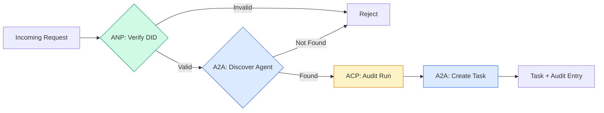

```typescript
class ProtocolGateway {
  private registry: AgentRegistry;
  private taskManager: TaskManager;
  private auditRunner: AuditableRunner;
  private identityRegistry: IdentityRegistry;

  constructor(
    registry: AgentRegistry,
    taskManager: TaskManager,
    auditRunner: AuditableRunner,
    identityRegistry: IdentityRegistry
  ) {
    this.registry = registry;
    this.taskManager = taskManager;
    this.auditRunner = auditRunner;
    this.identityRegistry = identityRegistry;
  }

  async delegateTask(
    fromDid: string,
    signature: string,
    targetAgent: string,
    message: AgentMessage,
    sessionId?: string
  ): Promise<{ task: Task; audit: AuditEntry } | { error: string }> {
    if (!this.identityRegistry.verify(fromDid, signature, message.id)) {
      return { error: "Identity verification failed" };
    }

    const card = this.registry.resolve(targetAgent);
    if (!card) {
      return { error: `Agent ${targetAgent} not found in registry` };
    }

    const audit = await this.auditRunner.run(
      targetAgent,
      [message],
      sessionId
    );
    const task = await this.taskManager.sendMessage(targetAgent, message);

    return { task, audit };
  }

  discoverAndDelegate(
    fromDid: string,
    signature: string,
    skillTag: string,
    message: AgentMessage
  ): Promise<{ task: Task; audit: AuditEntry } | { error: string }> {
    const candidates = this.registry.discoverBySkillTag(skillTag);
    if (candidates.length === 0) {
      return Promise.resolve({
        error: `No agents found with skill tag: ${skillTag}`,
      });
    }
    return this.delegateTask(
      fromDid,
      signature,
      candidates[0].name,
      message
    );
  }
}
```

La puerta de entrada hace cuatro cosas en una llamada:
1. **ANP**: Verifica la identidad del solicitante mediante la firma DID
   En inglés:**ANP**: a través de DID 签名验证调用者身份
2. **A2A**: Descubre el agente objetivo y verifica las capacidades
   En inglés:**A2A**: Detección del objetivo agente y capacidad de inspección
3. **ACP**: Envuelve la ejecución en una trayectoria de auditoría
   En inglés:**ACP**: con el trámites de auditoría, seguimiento y ejecución de paquetes
4. **A2A**: Crea una tarea con seguimiento completo del ciclo de vida
   En inglés:**A2A**: Crear tareas de seguimiento de ciclo de vida completo

### Paso 7: Conectadlo todo

```typescript
async function protocolDemo() {
  const registry = new AgentRegistry();
  registry.register({
    name: "researcher",
    description: "Searches and summarizes findings",
    version: "1.0.0",
    url: "https://researcher.local/a2a/v1",
    capabilities: { streaming: true, pushNotifications: false },
    defaultInputModes: ["text/plain"],
    defaultOutputModes: ["text/plain", "application/json"],
    skills: [
      {
        id: "web-research",
        name: "Web Research",
        description: "Searches the web",
        tags: ["research", "search", "summarization"],
        inputModes: ["text/plain"],
        outputModes: ["application/json"],
      },
    ],
  });
  registry.register({
    name: "coder",
    description: "Writes code from specs",
    version: "1.0.0",
    url: "https://coder.local/a2a/v1",
    capabilities: { streaming: false, pushNotifications: false },
    defaultInputModes: ["text/plain", "application/json"],
    defaultOutputModes: ["text/plain"],
    skills: [
      {
        id: "code-gen",
        name: "Code Generation",
        description: "Generates code",
        tags: ["coding", "generation"],
        inputModes: ["text/plain", "application/json"],
        outputModes: ["text/plain"],
      },
    ],
  });

  const taskManager = new TaskManager();
  const auditRunner = new AuditableRunner();

  const researchTrajectory: TrajectoryEntry[] = [];

  taskManager.registerHandler(
    "researcher",
    async function* (task, message) {
      yield {
        kind: "statusUpdate" as const,
        taskId: task.id,
        status: { state: "working" as const, timestamp: Date.now() },
      };

      researchTrajectory.push({
        reasoning: "Searching for React 19 documentation",
        toolName: "web_search",
        toolInput: { query: "React 19 compiler features" },
        toolOutput: {
          results: ["react.dev/blog/react-19", "github.com/react/react"],
        },
        timestamp: Date.now(),
      });

      researchTrajectory.push({
        reasoning: "Extracting key findings from search results",
        toolName: "doc_analysis",
        toolInput: { url: "react.dev/blog/react-19" },
        toolOutput: {
          summary:
            "React 19 compiler auto-memoizes, no manual useMemo needed",
        },
        timestamp: Date.now(),
      });

      yield {
        kind: "artifactUpdate" as const,
        taskId: task.id,
        artifact: {
          id: crypto.randomUUID(),
          name: "research-results",
          parts: [
            {
              kind: "data" as const,
              data: {
                findings: [
                  "React 19 compiler auto-memoizes components",
                  "No more manual useMemo/useCallback needed",
                  "Compiler runs at build time, not runtime",
                ],
                sources: ["react.dev/blog/react-19"],
              },
              mediaType: "application/json",
            },
          ],
        },
        append: false,
        lastChunk: true,
      };

      yield {
        kind: "statusUpdate" as const,
        taskId: task.id,
        status: { state: "completed" as const, timestamp: Date.now() },
      };
    }
  );

  auditRunner.registerAgent("researcher", async () => ({
    output: [
      textMessage("agent", "React 19 compiler auto-memoizes components"),
    ],
    trajectory: researchTrajectory,
  }));

  const identityRegistry = new IdentityRegistry();

  const coderIdentity = createIdentity("coder.local", "coder");
  const researcherIdentity = createIdentity("researcher.local", "researcher");

  identityRegistry.publish(coderIdentity.document);
  identityRegistry.publish(researcherIdentity.document);

  const gateway = new ProtocolGateway(
    registry,
    taskManager,
    auditRunner,
    identityRegistry
  );

  console.log("=== Protocol Demo ===\n");

  console.log("1. Agent Discovery (A2A)");
  const researchAgents = registry.discoverBySkillTag("research");
  console.log(
    `   Found ${researchAgents.length} agent(s):`,
    researchAgents.map((a) => a.name)
  );

  console.log("\n2. Identity Verification (ANP)");
  const message = textMessage("user", "Research React 19 compiler features");
  const signature = signPayload(coderIdentity, message.id);
  const verified = identityRegistry.verify(
    coderIdentity.did,
    signature,
    message.id
  );
  console.log(`   Coder DID: ${coderIdentity.did}`);
  console.log(`   Signature verified: ${verified}`);

  console.log("\n3. Task Delegation (A2A + ACP + ANP)");
  const result = await gateway.delegateTask(
    coderIdentity.did,
    signature,
    "researcher",
    message,
    "session-001"
  );

  if ("error" in result) {
    console.log(`   Error: ${result.error}`);
    return;
  }

  console.log(`   Task ID: ${result.task.id}`);
  console.log(`   Task state: ${result.task.status.state}`);
  console.log(`   Artifacts: ${result.task.artifacts.length}`);

  console.log("\n4. Audit Trail (ACP)");
  console.log(`   Run ID: ${result.audit.runId}`);
  console.log(`   Status: ${result.audit.status}`);
  console.log(`   Trajectory steps: ${result.audit.trajectory.length}`);
  for (const step of result.audit.trajectory) {
    console.log(`     - ${step.reasoning}`);
    if (step.toolName) {
      console.log(`       Tool: ${step.toolName}`);
    }
  }

  console.log("\n5. Full Audit Log");
  const fullLog = auditRunner.getFullAuditLog();
  console.log(`   Total runs: ${fullLog.length}`);
  for (const entry of fullLog) {
    const duration = entry.completedAt
      ? `${entry.completedAt - entry.startedAt}ms`
      : "in-progress";
    console.log(`   ${entry.agentName}: ${entry.status} (${duration})`);
  }
}

protocolDemo().catch((err) => {
  console.error("Protocol demo failed:", err);
  process.exitCode = 1;
});
```

## ¿Qué es lo que va mal?

Los protocolos resuelven el camino feliz.

> 协议 resolver el camino normal.

**Schema drift.**El agente A publica una publicidad de la tarjeta de agente .`application/json`En el caso de los modelos de producción, el modelo de producción de JSON cambia entre versiones.`version`en el agente Cards por esta razón.

> **模式漂移。**El agente A publicó una declaración .`application/json`输出 卡片代理――但 JSON 模式在版本之间发生变化――Agent B 解析旧格式并得到垃圾数据――修复:版本化你的技能和输出模式――A2A 规范为此支持 卡片代理`version`¿Qué es eso?

**State machine violations.**Un agente de manipulación produce un `completed`El código de la aplicación de la aplicación de la aplicación de la aplicación de la aplicación de la aplicación de la aplicación de la aplicación de la aplicación de la aplicación de la aplicación de la aplicación de la aplicación de la aplicación de la aplicación de la aplicación de la aplicación de la aplicación de la aplicación de la aplicación de la aplicación de la aplicación de la aplicación de la aplicación de la aplicación de la aplicación de la aplicación de la aplicación de la aplicación de la aplicación de la aplicación de la aplicación de la aplicación de la aplicación de la aplicación de la aplicación de la aplicación de la aplicación de la aplicación de la aplicación de la aplicación de la aplicación de la aplicación de la aplicación de la aplicación de la aplicación de la aplicación de la aplicación de la aplicación de la aplicación de la aplicación de la aplicación de la aplicación de la aplicación de la aplicación de la aplicación de la aplicación de la aplicación de la aplicación de la aplicación de la aplicación de la aplicación de la aplicación de la aplicación de la aplicación de la aplicación de la aplicación de la aplicación de la aplicación de la aplicación de la aplicación de la aplicación de la aplicación de la aplicación de la aplicación de la aplicación de la aplicación de la aplicación de la aplicación de la aplicación de la aplicación de la aplicación de la aplicación de la aplicación de la aplicación de la aplicación de la aplicación de la aplicación de la aplicación de la aplicación de la aplicación de la aplicación de la aplicación de la aplicación de la aplicación de la aplicación de la aplicación de la aplicación de la aplicación de la aplicación de la aplicación de la aplicación de la aplicación de la aplicación de la aplicación de la aplicación de la aplicación de la aplicación de la aplicación de la aplicación de la aplicación de la aplicación de la aplicación de la aplicación de la aplicación de la aplicación de la aplicación de la aplicación de la aplicación de la aplicación de la aplicación de la aplicación de la aplicación de la aplicación de la aplicación de la aplicación de la aplicación de la aplicación de la aplicación de la aplicación de la aplicación de la aplicación de la aplicación de la aplicación de la aplicación de la aplicación de la aplicación de la aplicación de la aplicación de la aplicación de la aplicación de la aplicación de la aplicación de la aplicación de la aplicación de la aplicación de la aplicación de la aplicación de la aplicación de la aplicación de la aplicación de la aplicación de la aplicación de la ley de la ley de la ley de la ley de la ley de la ley de la ley de la ley de la ley de la ley de la ley de la ley de la ley de la ley de la ley de la ley de`TaskManager`lo hace cumplir con el `break`después de los estados terminales.

> **状态机违规。**Agente  procesamiento proceso producir un `completed`事件, then try to produce more workpieces──task is unchangeable──tu código será silencioso dejando actualizar o lanzar anormalidades──修复:`TaskManager`                                                                                                                                                                                                                                                                                                                                                                                                                                                                                                                             `break`Para hacer cumplirlo.

**Trust resolution failures.**El agente A intenta verificar el DID del agente B, pero el dominio del agente B está apagado. El documento DID no se puede recoger. ¿No se abre (acepta agentes no verificados) o no se cierra (rechaza todo)? ANP recomienda que se cierre con el principio de menor confianza.

> **信任解析失败。**Agente A 试试验证 Agente B's DID, pero el dominio de Agente B 机已──DID 文档无法获取──你是开放失败 (también conocido como Agente no verificado) ¿Accepta o cierra el fracaso (también conocido como Agente B)?

**Trajectory bloat.**El registro de trayectorias ACP es poderoso pero costoso. Un agente complejo que hace 200 llamadas de herramientas por ejecución produce entradas masivas de auditoría.

> **轨迹膨胀。**Un agente complejo para cada operación de 200 veces de la red de instrumentos genera una gran cantidad de artículos de auditoría.

**Discovery thundering herd.**50 agentes todos en busca .`GET /agents`Corrección: Cachar las tarjetas de agente con TTL, intervalo de descubrimiento escalonado o usar registro basado en push en lugar de encuestas.

> **发现惊群。**50 agentes en el inicio de la investigación .`GET /agents` Modificación: utilizar TTL 缓存 Agent 卡片,交错发现间隔, o utilizar basado en la presentación de registros y no en la consulta.

## Usalo con el marco de ejecución

### Implementaciones reales

**A2A**es la más madura.[official spec](https://github.com/google/A2A)Es un software de código abierto bajo la Fundación Linux. SDKs para Python y TypeScript. Si sus agentes necesitan descubrimiento dinámico y colaboración, comience aquí.

> **A2A**Es el más maduro de Google.[官方规范](https://github.com/google/A2A)En Linux Foundation, hay Python y TypeScript SDK. Si tu agente necesita un proceso de descubrimiento y colaboración, empieza aquí.

**ACP**Se está fusionando en A2A. IBM [BeeAI project](https://github.com/i-am-bee/acp)El sistema de transporte de datos de la trayectoria se ha convertido en un sistema de transporte de datos de la trayectoria de la trayectoria de la trayectoria de la trayectoria de la trayectoria de la trayectoria de la trayectoria de la trayectoria de la trayectoria de la trayectoria de la trayectoria de la trayectoria de la trayectoria de la trayectoria de la trayectoria de la trayectoria de la trayectoria de la trayectoria de la trayectoria de la trayectoria de la trayectoria de la trayectoria de la trayectoria de la trayectoria de la trayectoria de la trayectoria de la trayectoria de la trayectoria de la trayectoria de la trayectoria de la trayectoria de la trayectoria de la trayectoria de la trayectoria de la trayectoria de la trayectoria de la trayectoria de la trayectoria de la trayectoria de la trayectoria de la trayectoria de la trayectoria de la trayectoria de la trayectoria de la trayectoria de la trayectoria de la trayectoria de la trayectoria de la trayectoria de la trayectoria de la trayectoria de la trayectoria de la trayectoria de la trayectoria de la trayectoria de la trayectoria de la trayectoria de la trayectoria de trayectoria de la trayectoria de trayectoria de trayectoria de trayectoria de trayectoria de trayectoria de la trayectoria de trayectoria de trayectoria de trayectoria de trayectoria de trayectoria de trayectoria de trayectoria de trayectoria.

> **ACP**Está en proceso de fusionarse con A2A. IBM.[BeeAI 项目](https://github.com/i-am-bee/acp) se creó ACP como alternativa prioritaria a REST, pero el concepto de datos de trayectoria se está adoptando en el ecosistema A2A.

**ANP**Es el más experimental.[community repo](https://github.com/agent-network-protocol/AgentNetworkProtocol)El concepto de negociación de meta-protocol es realmente nuevo. vale la pena mirar para el despliegue de agentes trans-organizacionales.

> **ANP**Es el más experimental.[社区仓库](https://github.com/agent-network-protocol/AgentNetworkProtocol)Hay un SDK Python (AgentConnect) ⋅元协议协商概念确实新──值跨组织 Agent 部署关注──

**MCP**Si quieres que los agentes usen herramientas, MCP es el estándar.

> **MCP**已在第13阶段中涵盖──如果你 quieres hacer que el agente utiliza herramientas, MCP es el estándar──

### Elegir el protocolo correcto

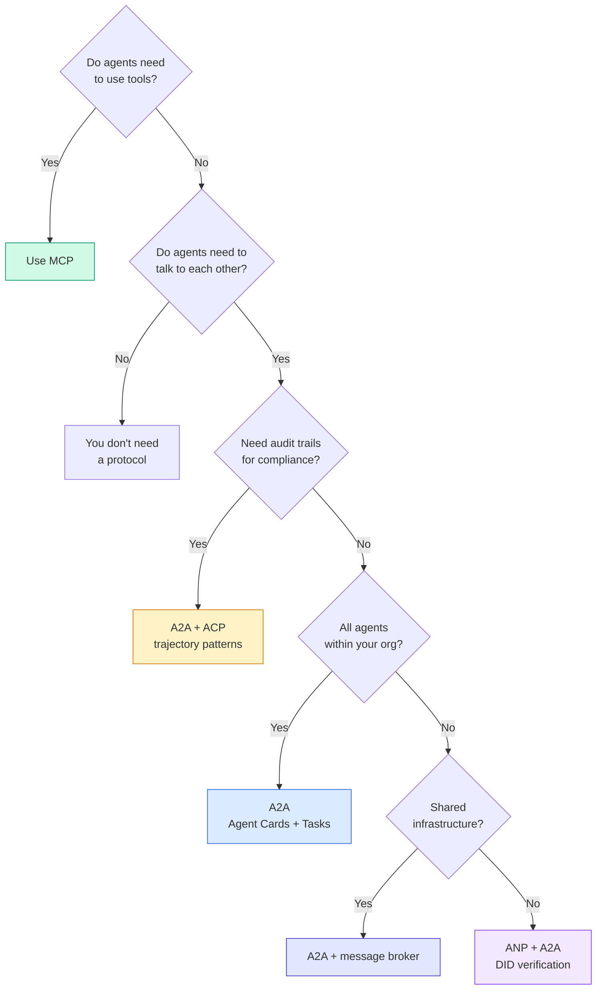

## Envíe el producto .

Esta lección produce:
- `code/main.ts`-- la implementación completa de los cuatro patrones de protocolo
  En inglés:`code/main.ts` Implementación completa de los cuatro protocolos
- `outputs/prompt-protocol-selector.md`-- una solicitud que le ayuda a elegir los protocolos para su sistema
  En inglés:`outputs/prompt-protocol-selector.md`  ayudar a usted para el sistema de selección de acuerdo de sugerencias

## Los ejercicios.

1. **Multi-hop task delegation.**Extender el `TaskManager`El investigador recibe una tarea, delega "busca" y "resumen" las subtareas a dos agentes especializados, espera que ambos completen, luego fusiona los resultados en sus propios artefactos.
   En inglés:**多跳任务委派。**扩展 `TaskManager`, para que el proceso de procesamiento del agente pueda dirigirse a otras tareas del agente encargado.

2. **Streaming audit trail.**Modificar el `AuditableRunner`En lugar de esperar el resultado completo, rendir `AuditEntry`Se puede utilizar un generador de sincronización que produce instantáneas de auditoría.
   En inglés:**流式审计跟踪。**修改                                                                                                                                                                                                                                                                                                                                                                                                                                                                                                                           `AuditableRunner`Es decir, no se espera el resultado completo, sino que se produce en el tiempo real.`AuditEntry`更新── utilizar para producir auditoría rápida照的异步生成器──

3. **DID rotation.**Añadir la rotación de la llave a la `IdentityRegistry`. Un agente debe poder publicar un nuevo documento DID con claves actualizadas mientras mantiene un `previousDid`Los verificadores deben aceptar firmas de la clave actual y anterior durante un período de gracia.
   En inglés:**DID 轮换。**¿ Qué ?`IdentityRegistry`Añadir la clave de cambio. El agente debe poder publicar un nuevo documento de DID con una nueva clave, al mismo tiempo que mantiene el archivo.`previousDid`引用── verificador en el plazo de tiempo libre debe aceptar la firma de la clave actual y anterior──

4. **Protocol negotiation.**Implementar el concepto de meta-protocolo de ANP.`protocolNegotiation`Los mensajes con formatos candidatos (por ejemplo, "Puedo hablar JSON-RPC" vs. "Prefiero REST"). Después de un máximo de 3 rondas, se acuerdan de un formato o tiempo de espera.`TaskManager`o `AuditableRunner`que usan.
   En inglés:**协议协商。**实现 ANP's元协议概念── dos agentes 交换带有候选人格式 `protocolNegotiation`消息(如"我可以说 JSON-RPC"对比"我更喜欢 REST") ⋅ Más de 3 radas después, se encuentran en formato acordado o super tiempo¬¬¬¬¬¬¬¬¬¬¬¬¬¬¬¬¬¬¬¬¬¬¬¬¬¬¬¬¬¬¬¬¬¬¬¬¬¬¬¬¬¬¬¬¬¬¬¬¬¬¬¬¬¬¬¬¬¬¬¬¬¬¬¬¬¬¬¬¬¬¬¬¬¬¬¬¬¬¬¬¬¬¬¬¬¬¬¬¬¬¬¬¬¬¬¬¬¬¬¬¬¬¬¬¬¬¬¬¬¬¬¬¬¬¬¬¬¬¬¬¬¬¬¬¬¬¬¬¬¬¬¬¬¬¬¬¬¬¬¬¬¬¬¬¬¬¬¬¬¬¬¬¬¬¬¬¬¬¬¬¬¬¬¬¬¬¬¬¬¬¬¬¬¬¬¬¬¬¬¬¬¬¬¬¬¬¬¬¬¬¬¬¬¬¬¬¬¬¬¬¬¬¬¬¬¬¬¬¬¬¬¬¬¬¬¬¬¬¬¬¬¬¬¬¬¬¬¬¬¬¬¬¬¬¬¬¬¬¬¬¬¬¬¬¬¬¬¬¬¬¬¬¬¬¬¬¬¬¬¬¬¬¬¬¬¬¬¬¬¬¬¬¬¬¬¬¬¬¬¬¬¬¬¬¬¬¬¬¬¬¬¬¬¬¬¬¬¬¬¬¬¬¬¬¬¬¬¬¬¬¬¬¬¬¬¬¬¬¬¬¬¬¬¬¬¬¬¬¬¬¬¬¬¬¬¬¬¬¬¬¬¬¬¬¬¬¬¬¬¬¬¬¬¬¬¬¬¬¬¬¬¬¬¬¬¬¬¬¬¬¬¬¬¬¬¬¬¬¬¬¬¬¬¬¬¬¬¬¬¬¬¬¬¬¬¬¬¬¬¬¬¬¬¬¬¬¬¬¬¬¬¬¬¬¬¬¬¬¬¬¬¬¬¬¬¬¬¬¬¬¬¬¬¬¬¬¬¬¬¬¬¬¬¬¬¬¬¬¬¬¬¬¬¬¬¬¬¬¬¬¬¬¬¬¬¬

5. **Rate-limited discovery.**Añadir un`RateLimitedRegistry`Envase que almacena las búsquedas de la tarjeta de agente con un TTL configurable y limita las consultas de descubrimiento por agente por segundo. Simula una manada de 100 agentes que se descubren entre sí en el inicio y mide la diferencia.
   En inglés:**限速发现。**Añade uno.`RateLimitedRegistry` empaquetador, con TTL 缓存 de configuración  Agente 卡片查找,并限制每秒每位 代理的发现查询──模拟100 代理 启动时互相发现的惊群效应并测量差异──

## Términos clave .

| Term | What people say | What it actually means |
|------|----------------|----------------------|
| MCP | "The protocol for AI tools" / "AI 工具协议" | A client-server protocol for agents to discover and use tools. Agent-to-tool, not agent-to-agent. / 用于 Agent 发现和使用工具的客户端-服务器协议。Agent 到工具，不是 Agent 到 Agent。 |
| A2A | "Google's agent protocol" / "Google 的 Agent 协议" | A peer-to-peer protocol for agent collaboration under the Linux Foundation. Discovery via Agent Cards, 9-state task lifecycle, streaming via SSE. Supports JSON-RPC, REST, and gRPC bindings. / Linux Foundation 下的 Agent 协作点对点协议。通过 Agent 卡片发现，9 状态任务生命周期，SSE 流。支持 JSON-RPC、REST 和 gRPC 绑定。 |
| ACP | "Enterprise agent messaging" / "企业 Agent 消息" | IBM/BeeAI's REST API for agent runs with TrajectoryMetadata: every response carries the full chain of reasoning and tool calls. Merging into A2A. / IBM/BeeAI 的 Agent 运行 REST API，带轨迹元数据：每个响应携带完整的推理链和工具调用。正在合并到 A2A。 |
| ANP | "Decentralized agent identity" / "去中心化 Agent 身份" | A community protocol using `did:wba` (DID) for cryptographic identity, HPKE for E2EE, and AI-powered meta-protocol negotiation for agents that have never seen each other. / 使用 `did:wba` (DID) 进行加密身份、HPKE 进行端到端加密、AI 驱动的元协议协商的社区协议。 |
| Agent Card / Agent 卡片 | "An agent's business card" / "Agent 的名片" | A JSON document at `/.well-known/agent-card.json` describing skills, supported MIME types, security schemes, and protocol bindings. / 描述技能、支持的 MIME 类型、安全方案和协议绑定的 JSON 文档。 |
| DID | "Decentralized ID" / "去中心化 ID" | W3C standard for cryptographically verifiable identities hosted on the agent's own domain. ANP uses `did:wba` method. / W3C 标准，用于托管在 Agent 自己域上的加密可验证身份。ANP 使用 `did:wba` 方法。 |
| TrajectoryMetadata / 轨迹元数据 | "The audit receipt" / "审计收据" | ACP's mechanism for attaching reasoning steps, tool calls, and their inputs/outputs to every agent response. / ACP 的机制，将推理步骤、工具调用及其输入/输出附加到每个 Agent 响应。 |
| Meta-protocol / 元协议 | "Agents negotiating how to talk" / "Agent 协商如何对话" | ANP's approach where agents use natural language to dynamically agree on data formats, then generate code to handle them. / ANP 的方法，Agent 使用自然语言动态就数据格式达成一致，然后生成代码处理。 |
| Task / 任务 | "A unit of work" / "工作单元" | A2A's stateful object tracking work from submission through completion. Immutable once terminal. / A2A 的有状态对象，跟踪从提交到完成的工作。一旦终态则不可变。 |

## Más Leer más Leer más

- [Google A2A specification](https://github.com/google/A2A)-- especificaciones oficiales y SDKs (v1.0.0, Fundación Linux)
  China: Google A2A 规范  官方规范和 SDK(v1.0.0, Fundación Linux)
- [IBM/BeeAI ACP specification](https://github.com/i-am-bee/acp)-- Específicación de OpenAPI 3.1 para las operaciones de agentes y los metadatos de trayectoria
  China  运行和轨迹元数据的 OpenAPI 3.1 规范
- [Agent Network Protocol](https://github.com/agent-network-protocol/AgentNetworkProtocol)-- Identidad basada en DID, E2EE, negociación de meta-protocol
  Protocolo de red de agentes  基于 DID的身份、端到端加密、元协议协商
- [Model Context Protocol docs](https://modelcontextprotocol.io/)-- Especificación del MCP de Anthropic (incluida en la Fase 13)
  中文翻译:Modelo Protocolo Contextual 文档  Antropic 的 MCP 规范(在阶段13 中涵盖)
- [W3C Decentralized Identifiers](https://www.w3.org/TR/did-core/)-- el estándar de identidad que sustenta la ANP
  Chino 支 ANP 的身份标准
- [RFC 9180 (HPKE)](https://www.rfc-editor.org/rfc/rfc9180)-- el esquema de cifrado que utiliza ANP para E2EE
  RFC 9180 (HPKE)  ANP utilizado para el proceso de cifrado de extremo a extremo
- [FIPA Agent Communication Language](http://www.fipa.org/specs/fipa00061/SC00061G.html)-- el precursor académico de los protocolos de agentes modernos
  中文翻译:FIPA Agent 通信语言  现代 Agent 协议的学术前身
