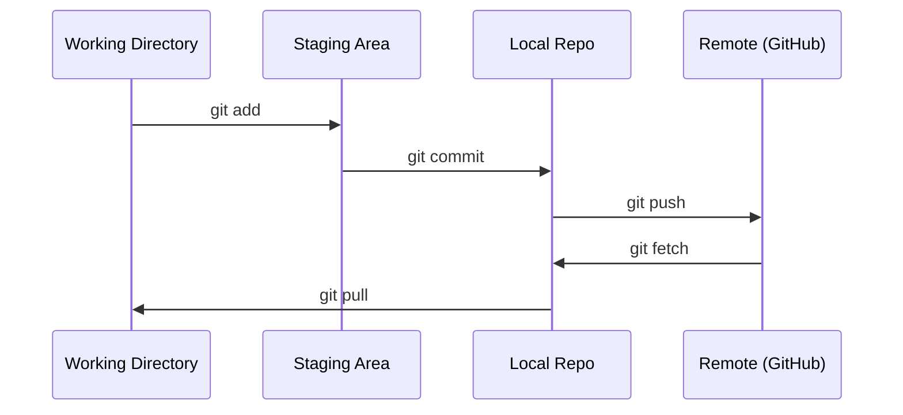

# Git et Collaboration

> Chaque expérience, chaque modèle, chaque leçon construite ici est suivi.
> Le contrôle de la version n'est pas facultatif. Chaque expérience, chaque modèle, chaque épisode de la classe sera suivi.

**Type:** Learn | **类型:** 学习
**Languages:** -- | **语言:** 无
**Prerequisites:** Phase 0, Lesson 01 | **前置知识:** Phase 0, 第 01 课
**Time:** ~30 minutes | **时间:** ~30 分钟

## Objectifs d'apprentissage

- Configurer l'identité git et utiliser le flux de travail quotidien d'ajouter, d'engager et de pousser
  Configuration Git 身份信息, maîtrise de l'ajout, de l'engagement, du poussé du flux de travail quotidien
- Créer et fusionner des branches pour des expériences isolées sans se défaire
  Traduction anglaise: créer et associer des branches, réaliser des expériences séparées sans détruire des branches principales
- Écrivez une`.gitignore`qui exclut les points de contrôle modèles et les grands fichiers binaires
  Le nom de la ville est le nom de la ville de la ville de la ville de la ville de la ville de la ville de la ville de la ville de la ville de la ville de la ville de la ville de la ville de la ville de la ville de la ville de la ville de la ville de la ville de la ville de la ville de la ville de la ville de la ville de la ville de la ville de la ville de la ville de la ville de la ville de la ville de la ville de la ville de la ville de la ville de la ville de la ville de la ville de la ville de la ville de la ville de la ville de la ville de la ville de la ville de la ville de la ville de la ville de la ville de la ville de la ville de la ville de la ville de la ville de la ville de la ville de la ville de la ville de la ville de la ville de la ville.`.gitignore`文件, exclusion模型检查点和大文件
- Naviguez dans l' historique des engagements avec `git log`comprendre l'évolution du projet
  Le mot " " " " " " " " " " " " " " " " " " " " " " " " " " " " " " " " " " " " " " " " " " " " " " " " " " " " " " " " " " " " " " " " " " " " " " " " " " " " " " " " " " " " " " " " " " " " " " " " " " " " " " " " " " " " " " " " " " " " " " " " " " " " " " " " " " " " " " " " " " " " " " " " " " " " " " " " " " " " " " " " " " " " " " " " " " " " " " " " " " " " " " " " " " " " " " " " " " " " " " " " " " " " " " " " " " " " " " " " " " " " " " " " " " " " " " " " " " " " " " " " " " " " " " " " " " " " " " " " " " " " " " " " " " " " " " " " " " " " " " " " " " " " " " " " " " " " " " " " " " " " " " " " " " " " " " " " " " " " " " " " " " " " " " " " " " " " " " " " " " " " " " " " " " " " " " " " " " " " " " " " " " " " " " " " " " " " " " " " " " " " " " " " " " " " " " " " " " " " " " " " " " " " " " " " " " " " " " " " " " " " " " " " " " " " " " " " " " " " " " " " " " " " " " " " " " " " " " " " " " " " " " " " " " " " " " " " " " " " " " " " " " " " " " " " " " " " " " " " " " " " " " " " " " " "`git log`浏览提交历史, comprendre le processus de développement du projet

> **【中文解读】**
> Git est un outil de contrôle de version, utilisé pour suivre chaque modification du code. Dans les projets d'IA, vous modiferez fréquemment les paramètres et le code du modèle pendant l'expérience. Git vous permet de revenir à tout moment à n'importe quel état précédent.

> **【拓展：Git 在 AI 工程中的角色】**L'IA 工程和传统软件开发不同每次实验(超参数调整、数据集变更) sont toutes une " version "──Une expérience de suivi Git signifie: les résultats de l'entraînement ont changé, vous pouvez `git diff`Trouver ce qui a changé, déployer le problème, c'est bon.`git revert`Le processus de collaboration de Big Model Team (comme Hugging Face) est entièrement basé sur Git.

## Le problème .

Vous êtes sur le point d'écrire des centaines de fichiers de code sur 20 phases. Sans contrôle de version, vous perdrez du travail, vous casserez des choses que vous ne pouvez pas annuler, et vous n'aurez aucun moyen de collaborer avec les autres.

> Vous allez écrire des centaines de fichiers de code en 20 étapes. Sans contrôle de version, vous perdrez le travail, détruirez des choses qui ne peuvent pas être récupérées, et ne pourrez pas travailler avec les autres.

Git est l'outil. GitHub est où le code vit. Cette leçon couvre ce dont vous avez besoin pour ce cours et rien de plus.

> Git est un outil, GitHub est un lieu de gestion de code.

> **【中文解读】**
> Vous allez écrire plusieurs centaines de fichiers de code, sans contrôle de version = 随时可能失去工作成果、无法回归、无法合作──Git 解决的就是这个问题──

## Le concept de base.



Trois choses à retenir:
1. Économiser souvent (`git commit`)
2. Poussez à la télécommande (`git push`)
3. Branche des expériences (`git checkout -b experiment`)

> Il faut se rappeler trois choses:
> 1. 经常保存(`git commit`)
> 2. 推送到远程(`git push`)
> 3. Avec des expériences`git checkout -b experiment`)

> **【中文解读】**
> Le processus central de Git: travailcatégorie → 暂存区(git add)→ 本地仓库(git commit)→ 远程仓库(git push)。记住三件事:经常提交、推送到远程、用分支做实验。

> **【拓展：分支策略与 AI 实验】**La stratégie de l'AI  projet proposé " chaque expérience est une branche ":`experiment/lr-0.001`- Je suis là.`experiment/add-dropout`Également, chaque fois que le code de l'expérience change, il est isolé, l'expérience échoue, elle est supprimée, elle réussit.`v1.0-baseline`), faciliter la mise en œuvre et la mise en œuvre de la version de code spécifiée.

## Construisez-le et mettez-le en œuvre.
```figure
s0-commit-dag
```

## Faites-le

### Étape 1: Configurer git

> 第1 étape: Configuration Git

```bash
git config --global user.name "Your Name"
git config --global user.email "you@example.com"
```

### Étape 2: Le flux de travail quotidien

```bash
git status                              # 查看哪些文件有改动
git add file.py                         # 把改动加入暂存区
git commit -m "Add perceptron implementation"  # 提交到本地仓库
git push origin main                    # 推送到 GitHub 远程仓库
```

### Étape 3: Brancher pour les expériences avec des branches pour faire des expériences.

```bash
git checkout -b experiment/new-optimizer  # 创建并切换到新分支

# ... make changes, commit ...  # 在新分支上修改和提交，不影响主分支

git checkout main                         # 切回主分支
git merge experiment/new-optimizer        # 把实验分支的改动合并到主分支
```

### Étape 4: Travailler avec ce référentiel de cours.

> **【拓展：Fork vs Clone】**Si vous voulez préserver votre apprentissage sans affecter l'entrepôt d'origine, utilisez `fork`(en GitHub) au lieu de cloner directement. Après la fourchette, vous avez votre propre copie complète, vous pouvez soumettre librement.

Vous ne pouvez pas pousser à la repo de cours elle-même  seulement les entretiens ont accès à écrire.`origin`points dans votre propre exemplaire:

```bash
git clone https://github.com/YOUR-USERNAME/ai-engineering-from-scratch.git
cd ai-engineering-from-scratch

git checkout -b my-progress
# work through lessons, commit your code
git push origin my-progress
```

## Utilisez-le avec un guide.

> **【拓展：.gitignore 在 AI 项目中至关重要】**AI  projets vont générer une quantité importante de non-commissionner gros fichiers:模型权重`.pt`- Je suis là.`.safetensors`Capacité de conservation de données`__pycache__`- Je suis là.`.venv`Une bonne .`.gitignore`能防止您意外把10GB de fichiers de modèle envoyé sur GitHub.`gitignore.io`生成 Python/ML 项目的模板──

Pour ce cours, vous avez besoin de ces commandes:

> Dans ce cours, vous avez besoin de ces ordres:

| Command | When |
|---------|------|
| `git clone` | Get the course repo |
| `git add` + `git commit` | Save your work |
| `git push` | Back it up to GitHub |
| `git checkout -b` | Try something without breaking main |
| `git log --oneline` | See what you've done |

| 命令 | 什么时候用 |
|------|-----------|
| `git clone` | 下载课程仓库 |
| `git add` + `git commit` | 保存你的工作 |
| `git push` | 备份到 GitHub |
| `git checkout -b` | 安全地尝试新想法 |
| `git log --oneline` | 查看你做了什么 |

Vous n'avez pas besoin de base, de sélection de cerises ou de sous-modules pour ce cours.

> Pour les cours, il n'y a pas besoin de base, de sélection ou de sous-modules.

## Les exercices

1. Clonez ce repo, créez une branche appelée `my-progress`, faire un dossier, l'engager, pousser
   克隆仓库,创建 `my-progress`分支, nouveaux projets, soumission et présentation
1. Faites une fourchette, clonnez votre fourchette, créez une branche appelée`my-progress`, faire un dossier, l'engager, pousser
2. Créer une`.gitignore`qui exclut les dossiers de contrôle modèles (`.pt`- Je suis là .`.pth`- Je suis là .`.safetensors`)
    Création `.gitignore`文件, excluer le modèle
3. Regardez l' histoire de ces références avec `git log --oneline`et lire comment les leçons ont été ajoutées
   - Je veux le faire .`git log --oneline`查看提交历史, comprendre comment le cours est construit progressivement

## Les termes clés

> **【中文解读】**Commitment (commitment) = 项目快照, Branch (分支) = 独立开发线, Merge (merge) = 把分支改动合回来,Remote (remote) = 库副本 (副本) de GitHub (Référence)

| Term | What people say | What it actually means |
|------|----------------|----------------------|
| Commit | "Saving" | A snapshot of your entire project at a point in time |
| Branch | "A copy" | A pointer to a commit that moves forward as you work |
| Merge | "Combining code" | Taking changes from one branch and applying them to another |
| Remote | "The cloud" | A copy of your repo hosted somewhere else (GitHub, GitLab) |

| 术语 | 俗称 | 实际含义 |
|------|------|---------|
| Commit | "保存" | 项目在某一时刻的完整快照 |
| Branch | "副本" | 指向某个提交的可移动指针，随工作向前推进 |
| Merge | "合并代码" | 将一个分支的改动应用到另一个分支 |
| Remote | "云端" | 托管在其他地方的仓库副本（如 GitHub、GitLab） |
