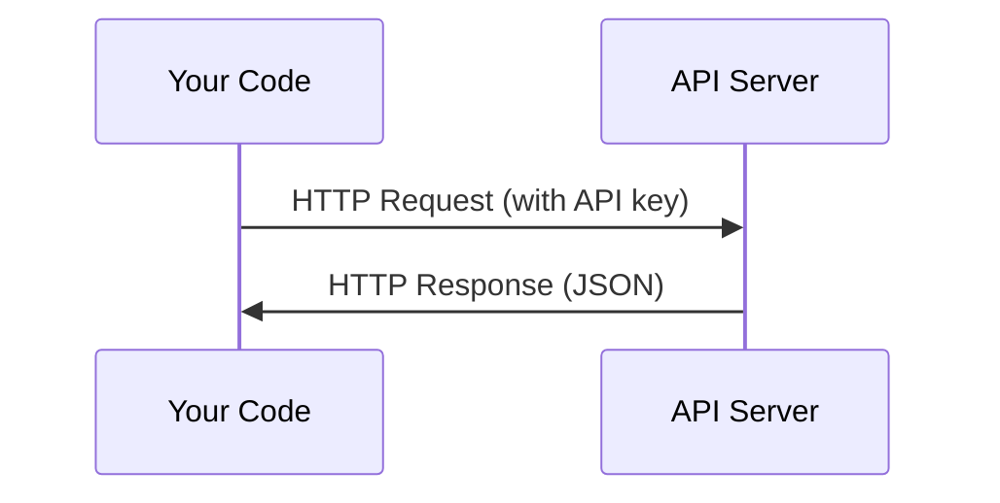

# API et clés . API et gestion des clés

> Chaque API d'IA fonctionne de la même manière: envoyer une demande, obtenir une réponse. Les détails changent, le schéma ne le fait pas.
> Toutes les API de l'IA fonctionnent de la même manière: envoyer une demande, obtenir une réponse, différer le mode.

**Type:** Build | **类型:** 构建
**Languages:** Python, TypeScript | **语言:** Python, TypeScript
**Prerequisites:** Phase 0, Lesson 01 | **前置知识:** Phase 0, 第 01 课
**Time:** ~30 minutes | **时间:** ~30 分钟

## Objectifs d'apprentissage

- Conserver les clés API en toute sécurité en utilisant les variables de l' environnement et `.env`fichiers
  Le changement climatique`.env`文件安全存储 API 密钥
- Faites un appel à l'API LLM en utilisant à la fois le SDK Python Anthropic et HTTP brut
  Le protocole de développement de Python est utilisé pour la création de l'API de LLM.
- Comparer les formats HTTP de requête/réponse basés sur le SDK et les formats HTTP de réponse brut pour le débogage
  Le format de requête/réponse de SDK et HTTP original, afin de调试
- Identifier et gérer les erreurs d'API communes, y compris les limites d'authentification et de taux
  L'utilisation de l'API est une pratique de gestion de la gestion de la gestion de la gestion de la gestion de la gestion de la gestion de la gestion de la gestion de la gestion de la gestion de la gestion de la gestion de la gestion de la gestion de la gestion de la gestion de la gestion de la gestion de la gestion de la gestion de la gestion de la gestion de la gestion de la gestion de la gestion de la gestion de la gestion de la gestion de la gestion de la gestion de la gestion de la gestion de la gestion de la gestion de la gestion de la gestion de la gestion de la gestion de la gestion de la gestion de la gestion de la gestion de la gestion de la gestion de la gestion de la gestion de la gestion de la gestion de la gestion de la gestion de la gestion de la gestion de la gestion de la gestion de la gestion de la gestion de la gestion de la gestion de la gestion de la gestion de la gestion de la gestion de la gestion de la gestion de la gestion de la gestion de la gestion de la gestion de la gestion de la gestion de la gestion de la gestion de la gestion de la gestion de la gestion de la gestion de la gestion de la gestion de la gestion de la gestion de la gestion de la gestion de la gestion de la gestion de la gestion de la gestion de la gestion de la gestion de la gestion de la gestion de la gestion de la gestion de la gestion de la gestion de la gestion de la gestion de la gestion de la gestion de la gestion de la gestion de la gestion de la gestion de la gestion de la gestion de la gestion de la gestion de la gestion de la gestion de la gestion de la gestion de la gestion de la gestion de la gestion de la gestion de la gestion de la gestion de la gestion de la gestion de la gestion de la gestion de la gestion de la gestion de la gestion de la gestion de la gestion de la gestion de la gestion de la gestion de la gestion de la gestion de la gestion de la gestion de la gestion de la gestion de la gestion de la gestion de la gestion de la gestion de la gestion de la gestion de la gestion de la gestion de la gestion de la gestion de la gestion de la gestion de la gestion de la gestion de la gestion de la gestion de la gestion de la gestion de la gestion de la gestion de la gestion de la gestion de la gestion de la gestion de la gestion de la gestion de la gestion de la gestion de la gestion de la gestion de la gestion de la gestion

> **【中文解读】**
> Tous les modes de travail de l'API sont les mêmes: envoyer des demandes, obtenir des réponses, et vous apprendre à gérer la sécurité de l'API, la clé, l'API LLM, ainsi que la différence entre l'utilisation du SDK et les demandes HTTP originales.

## Le problème .

À partir de la phase 11, vous allez appeler les API LLM (Anthropic, OpenAI, Google). Dans la phase 13-16 vous allez créer des agents qui utilisent ces API en boucles. Vous devez savoir comment fonctionnent les clés API, comment les stocker en toute sécurité, et comment faire votre premier appel API.

> À partir de la phase 11, vous allez utiliser l'API LLM ((Anthropic、OpenAI、Google) ◦ Dans la phase 13-16, vous allez créer un cycle de référencement de ces API ◦ Vous devez comprendre le fonctionnement de l'API key  Comment le stockage est sécurisé, ainsi que la façon de terminer la première API  référencement♦

> **【中文解读】**
> À partir de la phase 11, vous allez utiliser l'API LLM; à partir de la phase 13-16 vous devrez d'abord maîtriser l'API en gestion des clés et en mode de mise en œuvre de base.

## Le concept de base.



Chaque appel à l' API a:
1. Un point d'extrémité (URL)
2. Une clé API (authentification)
3. Un organisme de demande (ce que vous voulez)
4. Un corps de réponse (ce que vous obtenez en retour)

> Chaque API 调用 contient quatre éléments:
> 1. 端点(URL)
> 2. API 密钥(身份认证)
> 3. Vous voulez quoi ?
> 4. Je suis en train de vous dire:

> **【中文解读】**
> Chaque fois que l'API est utilisée, elle contient quatre éléments: URL de l'adresse de destination, API clé, ID, requête, requête, requête, requête, requête, requête, requête, requête, requête, requête, requête, requête, requête, requête, requête, requête, requête, requête, requête, requête, requête, requête, requête, requête, requête, requête, requête, requête, requête, requête, requête, requête, requête, requête, requête, requête, requête, requête, requête, requête, requête, requête, requête, requête, requête, requête, requête, requête, requête, requête, requête, requête, requête, requête, requête, requête, requête, requête, requête, requête, requête, requête, requête, requête, requête, requête, requête, requête, requête, requête, requête, requête, requête, requête, requête, requête, requête, requête, requête, requête, requête, requête, requête, requête, requête, requête, requête, requête, requête, requête, requête, requête, requête, requête, requête, requête, requête, requête, requête, requête, requête, requête, requête, requête, requête, requête, requête, requête, requête, requête, requête, requête, requête, requête, requête, requête, requête, requête, requête, requête, requête, requête, requête, requête, requête, requête, requête, requête, requête, requête, requête, requête, requête, requête, requête, requête, requête, requête, requête, requête, requête, requête, requête, requête, requête, requête, requête, requête, requête, requête, requête, requête, requête, requête, requête, requête, requête, requête, requête, requête,

> **【拓展：API 在 AI Agent 中的角色】**
> Le cycle central de l'agent de l'IA est: construire des suggestions → utiliser l'API de l'AML → résoudre des réponses → exécuter des actions → réutiliser l'API.
```figure
s0-secret-inject
```

## Faites-le

## Construisez-le et mettez-le en œuvre.

> **【拓展：API 密钥安全的铁律】**绝不把API key 硬编码在代码里──一旦推到GitHub, crawler会在几秒内发现并滥用你的密钥(真实案例: Quelqu'un a écrit une clé OpenAI dans le code, en quelques heures a été broché sur des milliers de dollars)──使用`.env`文件 + `python-dotenv`Ou le changement de l'environnement du système d'exploitation.

### Étape 1: Conservez les clés API en toute sécurité

Ne mettez jamais de clés API dans le code. Utilisez des variables d'environnement.

> Ne jamais mettre la clé API dans le code.

```bash
export ANTHROPIC_API_KEY="sk-ant-..."  # 设置环境变量（密钥永远不要写在代码里！）
export OPENAI_API_KEY="sk-..."
```

Ou utiliser un`.env`fichier (ajouter à `.gitignore`):

> Ou utiliser `.env`文件(Remembered ajouté à `.gitignore`):

```
ANTHROPIC_API_KEY=sk-ant-...  # .env 文件（确保加入 .gitignore）
OPENAI_API_KEY=sk-...
```

### Étape 2: Première appel API (Python)

```python
import os

import anthropic

client = anthropic.Anthropic()  # 自动从环境变量读取密钥

MODEL = os.environ.get("LLM_MODEL", "claude-sonnet-5")

response = client.messages.create(
    model="claude-sonnet-4-20250514",  # 指定模型
    max_tokens=256,  # 最大输出长度
    messages=[{"role": "user", "content": "What is a neural network in one sentence?"}]  # 用户消息
    model=MODEL,
    max_tokens=256,
    messages=[{"role": "user", "content": "What is a neural network in one sentence?"}]
)

print(response.content[0].text)  # 打印模型回复
```

### Étape 3: Première appel API (TypeScript)

> **【拓展：Token 计费机制】**L' API de la LLM 按token计费: Claude Sonnet 约 $3/百万输入 token、$15/million de tokens de sortie. Un mot anglais est d'environ 1,3 tokens, un mot chinois est d'environ 2-3 tokens.`max_tokens=256`Signifie que le modèle a le plus de 256 tokens sortis (environ 200 mots en anglais) ― contrôle`max_tokens`C'est un moyen clé pour économiser les coûts.
`LLM_MODEL`Les autres fournisseurs (OpenAI, Google, et autres) suivent le même schéma d'une clé plus un id modèle, mais chacun a son propre SDK, son propre point d'extrémité et son propre schéma de requête / réponse.

### Étape 3: Première appel API (TypeScript)

```typescript
import Anthropic from "@anthropic-ai/sdk";

const client = new Anthropic();

const MODEL = process.env.LLM_MODEL ?? "claude-sonnet-5";

const response = await client.messages.create({
  model: MODEL,
  max_tokens: 256,
  messages: [{ role: "user", content: "What is a neural network in one sentence?" }],
});

console.log(response.content[0].text);
```

### Étape 4: HTTP brut (pas de SDK)

```python
import os
import urllib.request
import json

url = "https://api.anthropic.com/v1/messages"  # API 端点
headers = {
    "Content-Type": "application/json",  # 请求格式为 JSON
    "x-api-key": os.environ["ANTHROPIC_API_KEY"],  # 从环境变量读取密钥
    "anthropic-version": "2023-06-01",  # API 版本号
}
body = json.dumps({
    "model": "claude-sonnet-4-20250514",  # 模型名称
    "max_tokens": 256,  # 最大输出 token 数
    "model": os.environ.get("LLM_MODEL", "claude-sonnet-5"),
    "max_tokens": 256,
    "messages": [{"role": "user", "content": "What is a neural network in one sentence?"}],
}).encode()

req = urllib.request.Request(url, data=body, headers=headers, method="POST")  # 构造 POST 请求
with urllib.request.urlopen(req) as resp:
    result = json.loads(resp.read())  # 解析 JSON 响应
    print(result["content"][0]["text"])  # 提取并打印回复文本
```

C'est ce que font les SDK sous le capot. Comprendre l'appel HTTP brut aide lors du débogage.

> C'est ce que fait le SDK.

> **【中文解读】**
> Le SDK                                                                                                                                                                                                                                                                                                                                                                                                                                                                                                                           

## Utilisez-le avec un guide.

> **【中文解读】**现在不需要注册所有API──Phase 4-10 用 Hugging Face(免费),Phase 11-16 需要人类或OpenAI──等课程用到时再注册即可──

Pour ce cours:

> Dans le cours:

| API | When you need it | Free tier |
|-----|-----------------|-----------|
| Anthropic (Claude) | Phases 11-16 (agents, tools) | $5 credit on signup |
| OpenAI | Phase 11 (comparison) | $5 credit on signup |
| Hugging Face | Phases 4-10 (models, datasets) | Free |

| API | 何时需要 | 免费额度 |
|-----|---------|---------|
| Anthropic (Claude) | 阶段 11-16（Agent、工具） | 注册送 $5 额度 |
| OpenAI | 阶段 11（对比实验） | 注册送 $5 额度 |
| Hugging Face | 阶段 4-10（模型、数据集） | 免费 |

Vous n'en avez pas besoin tout de suite, mettez-les en place quand la leçon le demandera.

> Vous n'avez pas besoin d'enregistrer toutes les API... et d'utiliser les cours jusqu'à ce que vous puissiez les réinitialiser.

## Envoyez-le . Produit .

> **【拓展：429 限流处理】**调用 LLM API 时最常见的错误是429 Rate Limit──处理方式:指数退避重试(等 1s → 2s → 4s → 8s)──Anthropic SDK 内置自动重试,但理解原理很重要在实际代理系统中,你可能需要自己实现限流逻辑来控制成本和避免被封锁──

Cette leçon donne:
- `outputs/prompt-api-troubleshooter.md`- diagnostiquer les erreurs d' API courantes

> Le programme de formation
> - `outputs/prompt-api-troubleshooter.md`- 诊断常见 API 错误的提示

## Les exercices

1. Obtenez une clé API Anthropic et faites votre premier appel API
   obtenir API anthropic  clé, terminer votre première API 调用
2. Essayez la version HTTP brute et comparez le format de réponse à la version SDK
   尝试原始 HTTP 方式调用, par rapport au format de réponse du SDK 方式
3. Utilisez intentionnellement une mauvaise clé API et lisez le message d'erreur
   故意使用错误的API 密钥, lire l'erreur de l'information

## Les termes clés

| Term | What people say | What it actually means |
|------|----------------|----------------------|
| API key | "Password for the API" | A unique string that identifies your account and authorizes requests |
| Rate limit | "They're throttling me" | Maximum requests per minute/hour to prevent abuse and ensure fair usage |
| Token | "A word" (in API context) | A billing unit: input and output tokens are counted and charged separately |
| Streaming | "Real-time responses" | Getting the response word by word instead of waiting for the full response |

| 术语 | 俗称 | 实际含义 |
|------|------|---------|
| API key | "API 密码" | 标识你账户并授权请求的唯一字符串 |
| Rate limit | "被限流了" | 每分钟/小时的请求上限，防止滥用 |
| Token | "词"（API 语境） | 计费单位：输入和输出 token 分别计费 |
| Streaming | "实时响应" | 逐词返回响应，而非等待完整响应 |
