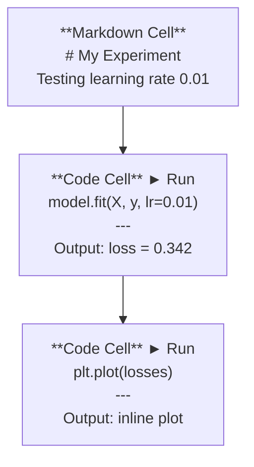
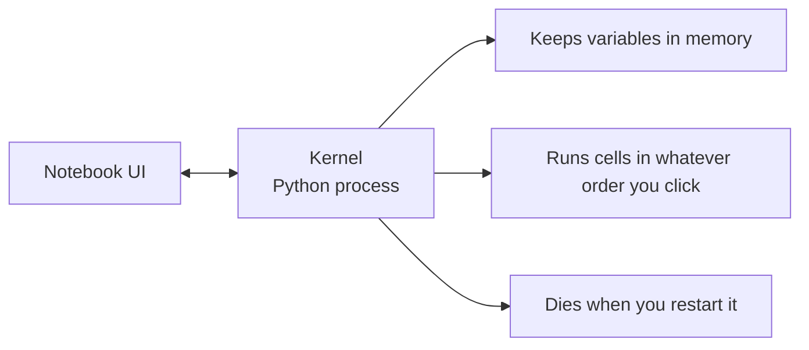

# Les livres de notes de Jupiter

> Les ordinateurs portables sont le banc de laboratoire de l'ingénierie de l'IA. Vous prototypez ici, puis vous transferez ce qui fonctionne en production.
> Le notebook est une base de travail d'expérimentation en ingénierie artificielle.

**Type:** Build | **类型:** 构建
**Languages:** Python | **语言:** Python
**Prerequisites:** Phase 0, Lesson 01 | **前置知识:** Phase 0, 第 01 课
**Time:** ~30 minutes | **时间:** ~30 分钟

## Objectifs d'apprentissage

- Installez et lancez le code JupyterLab, le notebook Jupyter ou VS avec l'extension Jupyter
  Le code VS est également utilisé pour les modèles de navigation en ligne.
- Utilisez des commandes magiques (`%timeit`- Je suis là .`%%time`- Je suis là .`%matplotlib inline`) pour comparer et visualiser en ligne
  Le mot "je suis" est traduit en français par "je suis"`%timeit`- Je suis là.`%%time`- Je suis là.`%matplotlib inline`) effectuer des tests de base et des visibilisations intégrées
- Distinguer entre les périphériques de notes et les scripts et appliquer le flux de travail "explorer dans les notes, expédier dans les scripts"
  Traduction anglaise: distinctions entre les modes de travail et les modes de travail
- Identifier et éviter les pièges courants des ordinateurs portables: exécution hors ordre, état caché et fuites de mémoire
  Le mot grec traduit par "réfléchir" signifie "réfléchir" ou "réfléchir".

> **【中文解读】**
> Le Jupyter Notebook est un " laboratoire de laboratoire " d'ingénieurs en IA. Vous pouvez y mettre en œuvre des codes à la fois, en cliquant sur les résultats, en cliquant sur les instructions et les graphiques.`.py`Le gouvernement a décidé de le faire.

## Le problème .

Chaque article sur l'IA, chaque tutoriel et chaque compétition Kaggle utilise des carnets de notes Jupyter. Ils vous permettent d'exécuter du code en morceaux, de voir les sorties en ligne, de mélanger le code avec les explications et d'itérer rapidement. Si vous essayez d'apprendre l'IA sans carnets, vous faites vos devoirs mathématiques sans graver le papier.

> La plupart des essais d'IA, les cours et les Kaggle utilisent le Jupyter Notebook. Il vous permet de partager les codes de fonctionnement, de voir les sorties, de voir les codes mixtes et les instructions de caractères.

Mais les carnets ont de vrais pièges. Les gens les utilisent pour tout, y compris pour les choses auxquelles ils sont terribles. Savoir quand utiliser un carnets et quand utiliser un script vous épargnera de déboguer les cauchemars plus tard.

> Mais le journal a aussi de véritables pièges. Les gens l'utilisent pour tout, y compris pour ce qu'il ne fait pas bien.

> **【中文解读】**
> Notebook est un outil standard dans le domaine de l'IA, presque tous les articles et les conflits sont utilisés par lui. Mais il a aussi des pièges: désordre d'exécution, état caché, fuites de mémoire.

## Le concept de base.

Un carnet est une liste de cellules. Chaque cellule est soit un code, soit un texte.

> 笔记本由一系列"单元格"组成, chaque单元格要么是代码,要么是文本──



Le noyau est un processus Python exécuté en arrière-plan. Lorsque vous exécutez une cellule, elle envoie le code au noyau, qui l'exécute et renvoie le résultat. Toutes les cellules partagent le même noyau, de sorte que les variables persistent entre les cellules.

> Le noyau est un processus Python qui fonctionne à l'arrière-plan. Lorsque vous exécutez une unité, le code est envoyé au noyau, et le résultat est de retour.



Cette partie "quel que soit l'ordre que vous cliquez" est à la fois la superpuissance et le pistolet.

> " selon le bon ordre de l'exécution " est à la fois super-capacité et grand puits.
```figure
s0-cell-order
```

## Faites-le

> **【中文解读】**
> Notebook composé de plusieurs "单元格" (cellules), chaque单元格 peut être un code ou un marquage. Tous les单元格 partagent le même noyau.

## Construisez-le à la main.

> **【拓展：Jupyter 在 AI 行业中的地位】**La plupart des projets d'IA sont en ligne avec le format du Notebook de Jupyter.`.ipynb`- Je suis un homme.

### Étape 1: Choisissez votre interface.

Trois options, un format:

> 三种界面选择, dans le même format de fichier:

| Interface | Install | Best for |
|-----------|---------|----------|
| JupyterLab | `pip install jupyterlab` then `jupyter lab` | Full IDE experience, multiple tabs, file browser, terminal |
| Jupyter Notebook | `pip install notebook` then `jupyter notebook` | Simple, lightweight, one notebook at a time |
| VS Code | Install "Jupyter" extension | Already in your editor, git integration, debugging |

| 界面 | 安装方式 | 最适合 |
|------|---------|--------|
| JupyterLab | `pip install jupyterlab` 后运行 `jupyter lab` | 完整 IDE 体验、多标签、文件浏览器 |
| Jupyter Notebook | `pip install notebook` 后运行 `jupyter notebook` | 简洁轻量、一次一个笔记本 |
| VS Code | 安装 "Jupyter" 扩展 | 集成在编辑器中、Git 整合、可调试 |

Les trois lisent et écrivent la même chose .`.ipynb`JupyterLab est le plus courant dans le travail d'IA.

> Trois interfaces de même.`.ipynb`文件格式──选你喜欢的即可──JupyterLab dans le travail de l'IA le plus courant──

```bash
pip install jupyterlab
jupyter lab
```

### Étape 2: Les raccourcis de clavier qui comptent

Vous opérez en deux modes.`Escape`pour le mode de commande (barre bleue à gauche), `Enter`pour le mode de modification (barre verte).

> Vous êtes en deux modes de fonctionnement.`Escape`进入命令模式(左侧蓝色条), selon `Enter`进入编辑模式(绿色条) 』

**Command mode (most used):**

> **命令模式（最常用的）：**

| Key | Action |
|-----|--------|
| `Shift+Enter` | Run cell, move to next |
| `A` | Insert cell above |
| `B` | Insert cell below |
| `DD` | Delete cell |
| `M` | Convert to markdown |
| `Y` | Convert to code |
| `Z` | Undo cell operation |
| `Ctrl+Shift+H` | Show all shortcuts |

**Edit mode:**

> **编辑模式：**

| Key | Action |
|-----|--------|
| `Tab` | Autocomplete |
| `Shift+Tab` | Show function signature |
| `Ctrl+/` | Toggle comment |

`Shift+Enter`C'est celui que vous utiliserez mille fois par jour.

> `Shift+Enter`C'est que tu fais ça tous les jours.

### Étape 3: Types de cellules

**Code cells**exécuter Python et afficher la sortie:

> **代码单元格**运行 Python 并显示输出:

```python
import numpy as np
data = np.random.randn(1000)
data.mean(), data.std()
```

Résultats: `(0.0032, 0.9987)`

**Markdown cells**Les textes sont formatés en format. Utilisez-les pour documenter ce que vous faites et pourquoi.`$E = mc^2$`), des tableaux et des images.

> **Markdown 单元格**染格式化文本── Utilisez-les pour enregistrer ce que vous faites et pourquoi── support title、粗体、斜体、LaTeX 数学公式(`$E = mc^2$`)、表格和图片──

### Étape 4: Les commandes magiques.

Ce ne sont pas Python, mais des commandes spécifiques à Jupiter qui commencent par`%`(magie de ligne) ou `%%`Je suis en train de faire une magie cellulaire.

> Ce ne sont pas Python.`%`(行魔术) ou `%%`(单元格魔术) Le Jupiter est ouvert

**Time your code:**

> **计时你的代码：**

```python
%timeit np.random.randn(10000)  # 多次运行取平均，适合微基准测试
```

Résultats: `45.2 us +/- 1.3 us per loop`

```python
%%time  # 单次运行，测量总耗时，适合训练耗时测试
model.fit(X_train, y_train, epochs=10)
```

Résultats: `Wall time: 2.34 s`

`%timeit`Il fait plusieurs fois le code et en moyenne. `%%time`- Il le fait une fois.`%timeit`pour les microbesques, `%%time`pour les courses d'entraînement.

> `%timeit`Plusieurs opérations à la moyenne.`%%time`Je ne fais que faire une fois.`%timeit`, entraînement à temps test usage `%%time`Il y a une autre.

**Enable inline plots:**

> **启用内嵌图表：**

```python
%matplotlib inline  # 让图表直接显示在笔记本中
```

Chaque .`plt.plot()`ou `plt.show()`Maintenant, il rend directement dans le carnet.

>  après chaque `plt.plot()`Ou `plt.show()`La ville sera directement dans le journal.

**Install packages without leaving the notebook:**

> **不离开笔记本就能安装包：**

```python
!pip install scikit-learn  # ! 前缀可以在笔记本中执行 shell 命令
```

Le `!`Le préfixe exécute toute commande de shell.

> `!`Je peux exécuter n'importe quel commandement.

**Check environment variables:**

> **检查环境变量：**

```python
%env CUDA_VISIBLE_DEVICES  # 查看环境变量
```

### Étape 5: Afficher la richesse de la sortie en ligne.

> **【拓展：Notebook 是最佳 AI 实验记录工具】**Notebook Placez le code, les sorties, les diagrammes, les formules intégrées dans un document, formant un "record d'expérience" complet. Dans les études d'IA, cela signifie que d'autres personnes peuvent reproduire directement vos expériences.

Les ordinateurs d'ordinateur affichent automatiquement la dernière expression dans une cellule.

> Le journal affichera automatiquement la dernière expression du code, mais vous pouvez le contrôler:

```python
import pandas as pd

df = pd.DataFrame({
    "model": ["Linear", "Random Forest", "Neural Net"],
    "accuracy": [0.72, 0.89, 0.94],
    "training_time": [0.1, 2.3, 45.6]
})
df
```

Cela rend une table HTML formatée, pas un dépôt de texte.

> Il s'agit d'un format HTML formatisé, plutôt que de texte de sortie.

```python
import matplotlib.pyplot as plt

plt.figure(figsize=(8, 4))
plt.plot([1, 2, 3, 4], [1, 4, 2, 3])
plt.title("Inline Plot")
plt.show()
```

Le diagramme apparaît juste en dessous de la cellule. C'est pourquoi les ordinateurs dominent le travail de l'IA. Vous voyez les données, le diagramme et le code ensemble.

> Le graphique est directement affiché dans le tableau ci-dessous. C'est la raison pour laquelle les ordinateurs de bureau occupent une position dominante dans le travail de l'IA.

Pour les images:

> Pour les images:

```python
from IPython.display import Image, display
display(Image(filename="architecture.png"))
```

### Étape 6: Google Colab

Colab est un ordinateur portable Jupyter gratuit dans le cloud. Il vous donne un GPU, des bibliothèques prédéfinies et l'intégration de Google Drive. Aucune configuration nécessaire.

> Colab est un logiciel de cloud-end gratuit de Jupyter. Il fournit des GPU, des préconisations et des intégrations de Google Drive.

1. Allez à la[colab.research.google.com](https://colab.research.google.com)
2. Téléchargez tout `.ipynb`fichier de ce cours
3. Temps d'exécution > Modifier le type d'exécution > T4 GPU (gratuit)

Différences entre les collages et les Jupyter locaux:

> Différence entre Colab et Jupiter:

- Les fichiers ne persistent pas entre les sessions (sauf dans Drive ou téléchargement)
  Le document ne sera pas conservé pendant une réunion.
- Préinstallés: numpy, pandas, matplotlib, torche, tensorflow, sklearn
  Je suis en train de faire une petite histoire.
- `from google.colab import files`pour télécharger/charger des fichiers
  Le mot grec traduit par " le mot grec "`from google.colab import files`Utilisé pour la téléchargement
- `from google.colab import drive; drive.mount('/content/drive')`pour un stockage persistant
  Le mot grec traduit par " le mot grec "`from google.colab import drive; drive.mount('/content/drive')`Utilisé pour le stockage à long terme
- Temps de pause des séances après 90 minutes d'inactivité (niveau gratuit)
  Le film est sorti en français en version française.

## Utilisez-le avec un guide.

### Les carnets de notes contre les scripts: quand utiliser lequel ?

| Use notebooks for | Use scripts for |
|-------------------|-----------------|
| Exploring a dataset | Training pipelines |
| Prototyping a model | Reusable utilities |
| Visualizing results | Anything with `if __name__` |
| Explaining your work | Code that runs on a schedule |
| Quick experiments | Production code |
| Course exercises | Packages and libraries |

| 用 Notebook | 用脚本 |
|-----------|-------|
| 探索数据集 | 训练管线 |
| 原型开发模型 | 可复用的工具函数 |
| 可视化结果 | 带 `if __name__` 的正式代码 |
| 解释你的工作 | 定时运行的代码 |
| 快速实验 | 生产环境代码 |
| 课程练习 | 包和库 |

La règle:**explore in notebooks, ship in scripts**- Je suis désolé .

> La loi de l'or:**在笔记本中探索，在脚本中部署**Il y a une autre.

> **【中文解读】**
> La loi de l'or:**在 Notebook 中探索，在脚本中部署**❖ D'abord dans le Notebook 里实验思想,验证可行后再将代码迁移到 `.py`- Je suis en train de le faire.

Un flux de travail commun en IA:
1. Explorer les données dans un carnet
2. Prototype de votre modèle dans le carnet
3. Une fois que cela fonctionne, déplacez le code à `.py`fichiers
4. Importez ces`.py`les fichiers retournés dans le carnet pour de nouvelles expériences

> Travail de travail:
> 1. Dans le journal explorer les données
> 2. Dans le journal, faire un modèle original
> 3. Après validation, le code sera transféré à `.py`文件
> 4. Je ne sais pas .`.py`文件导入笔记本 faire des expériences supplémentaires

### Des pièges communs.

> **【拓展：Notebook 反模式】**Trois notes les plus courantes: 1) 乱序执行 vous sautez dans une cellule, d'autres personnes sont suspendues; 2) 隐藏状态 vous avez supprimé une cellule, mais la variante qu'elle a créée est toujours dans la mémoire; 3) 内存泄漏加载 4GB 数据集、训练模型、再加载另一个,内存不断增长──解法:定期`Kernel > Restart & Run All`, ou utilisé après l' entraînement `del model; gc.collect()`Je suis en train de vous parler.

**Out-of-order execution.**Vous exécutez la cellule 5, puis la cellule 2, puis la cellule 7. Le bloc-notes fonctionne sur votre machine mais se casse quand quelqu'un le fait monter vers le bas.

> **乱序执行。**Vous avez d'abord couru le 5ème élément, puis le 2ème, puis le 7ème. Le journal peut être utilisé sur votre machine, mais les autres ont fait une erreur de tête à tête.

**Hidden state.**Vous supprimez une cellule mais la variable créée est toujours dans la mémoire. Le bloc-notes semble propre mais dépend d'une cellule fantôme. Correction: redémarrer le noyau régulièrement.

> **隐藏状态。**Vous avez supprimé un seul élément, mais la variation qu'il a créée est toujours en mémoire.

**Memory leaks.**Charger un ensemble de données de 4 Go, entraîner un modèle, charger un autre ensemble de données. Rien ne se libère.`del variable_name`et `gc.collect()`, ou redémarrer le noyau.

> **内存泄漏。**Charger un nouveau ensemble de données de 4 Go, la mémoire continue de croître sans être libérée.`del variable_name`et `gc.collect()`, ou redémarrer le noyau.

## Envoyez-le . Produit .

> **【拓展：从 Notebook 到生产代码】**Réaliser un projet d'IA: un manuel d'essai`.py`模块 → 编写测试 → 部署。Notebook est un "rédact papier", pas un "produit final"。养成习惯:`.py`Dans les dossiers, le carnet de notes est conservé.

Cette leçon donne:
- `outputs/prompt-notebook-helper.md`pour débogage des problèmes de bloc-notes

> Le programme de formation
> - `outputs/prompt-notebook-helper.md`Pour le problème de la note

## Les exercices

1. Ouvrez JupyterLab, créez un carnet et utilisez `%timeit`pour comparer la compréhension de la liste contre numpy pour créer un tableau de 100 000 nombres aléatoires
   打开 JupyterLab, créer un journal, utiliser `%timeit`Par rapport à la liste de la propulsion et NumPy générer des 100 000 de vitesse de nombre aléatoire
2. Créez un bloc-notes avec des cellules de marquage et de code qui chargent un CSV, affichent un cadre de données et dessinent un graphique. Puis exécutez Kernel > Restarter & Exécuter tous pour vérifier qu'il fonctionne de haut en bas
   Créer contenant Markdown et code un seul élément de billet, charger CSV, afficher DataFrame, dessiner, puis "retourner et tout fonctionner" vérification
3. Prenez le code de `code/notebook_tips.py`, le coller dans un ordinateur portable Colab, et l'exécuter avec un GPU gratuit
   Il va`code/notebook_tips.py`Le code est collé à Colab 笔记本中, avec un GPU gratuit 运行

## Les termes clés

| Term | What people say | What it actually means |
|------|----------------|----------------------|
| Kernel | "The thing running my code" | A separate Python process that executes cells and keeps variables in memory |
| Cell | "A code block" | An independently runnable unit in a notebook, either code or markdown |
| Magic command | "Jupyter tricks" | Special commands prefixed with `%` or `%%` that control the notebook environment |
| `.ipynb` | "Notebook file" | A JSON file containing cells, outputs, and metadata. Stands for IPython Notebook |

| 术语 | 俗称 | 实际含义 |
|------|------|---------|
| Kernel | "运行代码的那个东西" | 独立的 Python 进程，执行单元格并维护变量状态 |
| Cell | "代码块" | 笔记本中可独立运行的单元，可以是代码或 Markdown |
| Magic command | "Jupyter 魔法" | 以 `%` 或 `%%` 开头的特殊命令，控制笔记本环境 |
| `.ipynb` | "笔记本文件" | 包含单元格、输出和元数据的 JSON 文件 |

## Encore une lecture

- [JupyterLab Docs](https://jupyterlab.readthedocs.io/)pour l'ensemble complet de fonctionnalités
  Le projet de loi de l'État de l'Afrique du Sud
- [Google Colab FAQ](https://research.google.com/colaboratory/faq.html)pour les limites et les caractéristiques spécifiques à Colab
  Le code de Google Colab 常见问题与限制说明
- [28 Jupyter Notebook Tips](https://www.dataquest.io/blog/jupyter-notebook-tips-tricks-shortcuts/)pour les raccourcis utilisateurs d'alimentation
  Le livre de notes de Jupiter, le notebook de Jupiter, le notebook de Jupiter, le notebook de Jupiter, le notebook de Jupiter, le notebook de Jupiter, le notebook de Jupiter, le notebook de Jupiter, le notebook de Jupiter, le notebook de Jupiter, le notebook de Jupiter, le notebook de Jupiter, le notebook de Jupiter, le notebook de Jupiter, le notebook de Jupiter, le notebook de Jupiter, le notebook de Jupiter, le notebook de Jupiter, le notebook de Jupiter, le notebook de Jupiter, le notebook de Jupiter, le notebook de Jupiter, le notebook de Jupiter, le notebook de Jupiter, le notebook de Jupiter, le notebook de Jupiter, le notebook de Jupiter, le notebook de Jupiter, le notebook de Jupiter, le notebook de Jupiter, le notebook de Jupiter, le notebook de Jupiter, le notebook de Jupiter, le notebook de Jupiter, le notebook de Jupiter, le notebook de la notebook de Jupiter, le notebook de la notebook de Jupiter, le notebook de la notebook de Jupiter.
