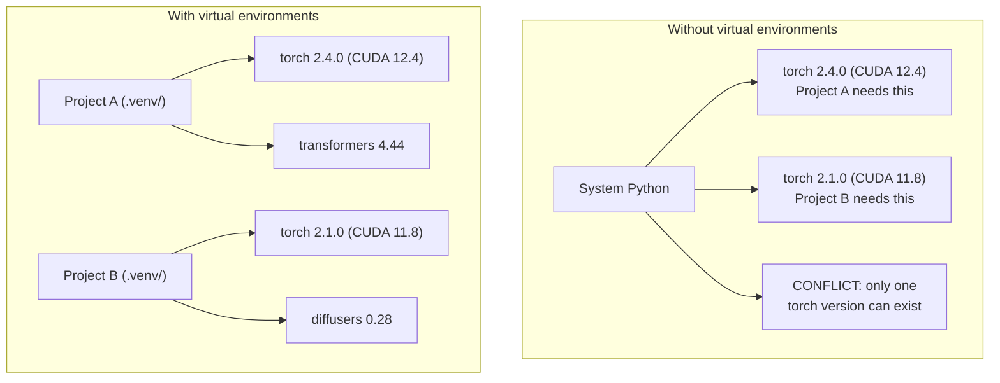

# Python Environnements

> L'enfer de la dépendance est réel.
> L'enfer est une réalité.

**Type:** Build | **类型:** 构建
**Languages:** Shell | **语言:** Shell
**Prerequisites:** Phase 0, Lesson 01 | **前置知识:** Phase 0, 第 01 课
**Time:** ~30 minutes | **时间:** ~30 分钟

## Objectifs d'apprentissage

- Créer des environnements virtuels isolés en utilisant `uv`- Je suis là .`venv`ou `conda`
  Le mot " usage " est traduit par " usage "`uv`- Je suis là.`venv`Ou `conda` Créer un environnement virtuel séparé
- Écrivez une`pyproject.toml`avec des groupes de dépendance facultatifs et générer des fichiers verrouillés pour la reproductibilité
  Le nom de la ville est le nom de la ville de la ville de la ville de la ville de la ville de la ville de la ville de la ville de la ville de la ville de la ville de la ville de la ville de la ville de la ville de la ville de la ville de la ville de la ville de la ville de la ville de la ville de la ville de la ville de la ville de la ville de la ville de la ville de la ville de la ville de la ville de la ville de la ville de la ville de la ville de la ville de la ville de la ville de la ville de la ville de la ville de la ville de la ville de la ville de la ville de la ville de la ville de la ville de la ville de la ville de la ville de la ville de la ville de la ville de la ville de la ville de la ville de la ville de la ville de la ville de la ville de la ville de la ville de la ville de la ville de la ville de la ville de la ville de la ville de la ville de la ville.`pyproject.toml`, générer un fichier verrouillé  assurer la réactivité
- Diagnostication et réparation des pièges communs: installations globales, mélange pip/conda, incompatibilités de version CUDA
  Le problème de la répartition de l'information est que le contenu de la communication est un contenu de référence.
- Mettre en œuvre une stratégie environnementale à chaque étape pour les projets ayant des dépendances en conflit
  Traduction anglaise: Stratégie environnementale pour la mise en œuvre de projets dépendants du conflit

> **【中文解读】**
> Python  projet dépendance conflit est l'un des problèmes les plus courants dans le développement de l'IA. Ce projet nécessite PyTorch 2.4, ce projet nécessite 2.1  L'installation globale peut seulement avoir une version.

## Le problème .

Vous installez PyTorch 2.4 pour un projet de réglage. La semaine prochaine, un autre projet a besoin de PyTorch 2.1 parce que sa mise en place CUDA est fixée. Vous mettez à niveau mondial, et le premier projet se casse. Vous dégradez, et le second se casse.

> Vous avez installé PyTorch 2.4 pour un petit projet.

C'est l'enfer de la dépendance. Cela arrive constamment dans le travail AI/ML parce que:

> C'est ce qui arrive souvent dans le travail de l'IA/ML, parce que:

- PyTorch, JAX et TensorFlow envoient chacun leurs propres liens CUDA
  Le débit de tension est de 3 à 5 fois plus long.
- Les bibliothèques de modèle sont des versions de cadres spécifiques
  Le modèle de la société est un modèle de la société.
- Une organisation mondiale `pip install`Il écris ce qui était là avant.
  Le tout est en train de bouger.`pip install`会覆盖之前安装的任何版本
- Les constructions CUDA 11.8 ne fonctionnent pas avec les pilotes CUDA 12.x (et vice versa)
  Le code de conduite est un code de conduite qui est utilisé pour la mise en service de la machine.

Le problème: chaque projet a son propre environnement isolé avec ses propres forfaits.

> solution: chaque projet a son propre environnement isolé, possède un cadre de dépendance indépendant.

> **【中文解读】**
> "Dépendance à l'enfer" est particulièrement fréquent dans les projets d'IA, car PyTorch/JAX/TensorFlow est lié à CUDA, version entre versions incompatibles.

## Le concept de base.

> **【中文解读】**Le tableau ci-dessous montre la différence entre un environnement virtuel et un environnement virtuel: sans environnement virtuel, le système Python ne peut installer qu'une seule version de PyTorch, des projets entre eux se conflit; il existe un environnement virtuel, chaque projet possède une dépendance indépendante, ne s'interrompt pas.



## Construisez-le et mettez-le en œuvre.

> **【拓展：uv vs pip vs conda — 该选哪个？】**(1) **uv**(推):Rust 写的,比 pip 快 10-100 倍, automatisément gérer l'environnement virtuel,一行命令搞定 `uv venv && uv pip install`◊ 2) **venv**:Python est installé, sans installation, mais la vitesse est lente et la fonction est faible.**conda**Les projets d'IA proposés en 2026 sont en principe un choix.
```figure
s0-env-isolation
```

## Faites-le

### Option 1: uv venv (recommandé)

`uv`est le gestionnaire de paquets Python le plus rapide (10-100 fois plus rapide que pip). Il gère des environnements virtuels, des versions Python et une résolution de dépendance dans un seul outil.

> `uv`Il est le plus rapide Python 包管理器 (environ 10 à 100 fois plus rapide que pip) ⋅ il est utilisé dans un outil pour traiter l'environnement virtuel ⋅ Python 版本和依赖解析⋅

```bash
curl -LsSf https://astral.sh/uv/install.sh | sh

uv python install 3.12

cd your-project
uv venv
source .venv/bin/activate
```

Des paquets d'installation:

> Pour le coup:

```bash
uv pip install torch numpy
```

Créer un projet avec `pyproject.toml`en une seule étape:

> Un pas en avant`pyproject.toml`∙ Les projets:

```bash
uv init my-ai-project
cd my-ai-project
uv add torch numpy matplotlib
```

### Option 2: Venv (intégré) 选项2:venv(Python

> **【中文解读】**venv est un outil d'environnement virtuel Python, qui ne nécessite pas d'installation supplémentaire. Mais par rapport à uv, il ne gère pas automatiquement la version Python, ni ne génère de fichiers verrouillés.

Si vous ne pouvez pas installer `uv`, les navires Python avec `venv`- Le numéro de la liste:

> Si vous ne pouvez pas l' installer `uv`,Python lui-même`venv`- Le numéro de la liste:

```bash
python3 -m venv .venv
source .venv/bin/activate  # Linux/macOS
.venv\Scripts\activate     # Windows

pip install torch numpy
```

Plus lent que `uv`, mais fonctionne partout où Python est installé.

> - Je ne sais pas .`uv`Lentement, mais dans n'importe quel endroit installé de Python, on peut utiliser.

### Option 3: conda (lorsque vous en avez besoin)

Conda gère des dépendances non Python comme les kits d'outils CUDA, cuDNN et les bibliothèques C. Utilisez-le lorsque:

> Conda 管理非 Python dépend, par exemple, de CUDA 工具包、cuDNN 和 C 库── dans les cas suivants:

- Vous avez besoin d'une version spécifique de la trousse d' outils CUDA sans l' installer dans tout le système
  Néo-latin: besoin de CUDA spécifique 工具包版本, mais non souhaiter l'installation de la totalité
- Vous êtes sur un cluster partagé où vous ne pouvez pas installer des paquets système
  En français, dans un groupe de travail, impossible à installer
- Les instructions d'installation d'une bibliothèque disent "utiliser conda"
  Le livre de la vie est un livre de la vie.

```bash
# Install miniconda (not the full Anaconda)
curl -LsSf https://repo.anaconda.com/miniconda/Miniconda3-latest-Linux-x86_64.sh -o miniconda.sh
bash miniconda.sh -b

conda create -n myproject python=3.12
conda activate myproject

conda install pytorch torchvision torchaudio pytorch-cuda=12.4 -c pytorch -c nvidia
```

Une règle: si vous utilisez conda pour un environnement, utilisez conda pour tous les emballages de cet environnement.`pip install`dans un conda env provoque des conflits de dépendance qui sont douloureux à déboguer.

> Un article de règlement: si vous utilisez le condo  gestion de l'environnement, utilisez le condo  gestion de l'environnement propriétaire.`pip install`Il sera difficile de régler les conflits de dépendance.

### Pour ce cours: stratégie par phase

Vous pouvez créer un environnement pour tout le cours. Ne le faites pas. Différentes phases ont besoin de dépendances différentes (parfois contradictoires).

> Vous pouvez créer un environnement pour tout le cours. Ne le faites pas.

Stratégie:

> 策略:

```
ai-engineering-from-scratch/
├── .venv/                    <-- shared lightweight env for phases 0-3
├── phases/
│   ├── 04-neural-networks/
│   │   └── .venv/            <-- PyTorch env
│   ├── 05-cnns/
│   │   └── .venv/            <-- same PyTorch env (symlink or shared)
│   ├── 08-transformers/
│   │   └── .venv/            <-- might need different transformer versions
│   └── 11-llm-apis/
│       └── .venv/            <-- API SDKs, no torch needed
```

Le scénario en `code/env_setup.sh`crée l'environnement de base pour ce cours.

> `code/env_setup.sh`Le scénario central créera le cadre de base du cours.

## pyproject.toml Basics pyproject.toml base

> **【拓展：pyproject.toml 是现代 Python 项目的标准配置】**Il a remplacé la tradition.`setup.py`et `requirements.txt` Un document définit les données de projet  dépendance  outils de développement`[train]`) et la confiance dans la confiance`[serve]`), éviter l'installation inutile de GPU dans l'environnement de production ⋅

Chaque projet Python devrait avoir un`pyproject.toml`Il remplace ...`setup.py`- Je suis là .`setup.cfg`, et `requirements.txt`dans un seul dossier.

> Chaque projet Python devrait avoir`pyproject.toml`Il a été remplacé par un dossier.`setup.py`- Je suis là.`setup.cfg`et `requirements.txt`Il y a une autre.

```toml
[project]
name = "ai-engineering-from-scratch"
version = "0.1.0"
requires-python = ">=3.11"
dependencies = [
    "numpy>=1.26",
    "matplotlib>=3.8",
    "jupyter>=1.0",
    "scikit-learn>=1.4",
]

[project.optional-dependencies]
torch = ["torch>=2.3", "torchvision>=0.18"]
llm = ["anthropic>=0.39", "openai>=1.50"]
```

Puis installez:

> Puis on y met:

```bash
uv pip install -e ".[torch]"    # base + PyTorch
uv pip install -e ".[llm]"     # base + LLM SDKs
uv pip install -e ".[torch,llm]" # everything
```

## Fichiers de verrouillage

Un fichier de verrouillage pinne toutes les dépendances (y compris les transitives) vers des versions exactes. Cela garantit la reproductibilité: toute personne installant à partir du fichier de verrouillage obtient exactement les mêmes paquets.

> Chaque fichier verrouillé sera verrouillé jusqu'à une version précise. Cela garantit la réétablissement: toute personne installée dans le fichier verrouillé peut obtenir le même package.

```bash
# uv generates uv.lock automatically when using uv add
uv add numpy

# pip-tools approach
uv pip compile pyproject.toml -o requirements.lock
uv pip install -r requirements.lock
```

Quand quelqu'un clone le repo, il installe à partir du fichier de verrouillage et obtient des versions identiques.

> Lorsque quelqu'un a installé le stockage, ils ont installé et obtenu la même version.

## Les erreurs courantes

> **【中文解读】**Python 环境管理中最常见的 5 个错误:  1) L'ensemble de l'installation `pip install`Il est également possible de faire des changements dans la situation actuelle.`.venv`Le texte est soumis à la suite de la publication.

### 1. Installation à l'échelle mondiale

```bash
pip install torch  # BAD: installs to system Python

source .venv/bin/activate
pip install torch  # GOOD: installs to virtual environment
```

Vérifiez où vont vos colis:

> 检查你的包装在哪里:

```bash
which python       # should show .venv/bin/python, not /usr/bin/python
which pip           # should show .venv/bin/pip
```

### 2. mélange de pip et de conda

```bash
conda create -n myenv python=3.12
conda activate myenv
conda install pytorch -c pytorch
pip install some-other-package   # BAD: can break conda's dependency tracking
conda install some-other-package # GOOD: let conda manage everything
```

Si vous devez utiliser pip à l'intérieur de conda (certains paquets sont uniquement pip), installez d'abord tous les paquets conda, puis les paquets pip durent.

> Si vous devez utiliser des pipes dans un condo, vous devez d'abord installer toutes les pipes, puis les installer à nouveau.

### 3. Oublier d'activer

```bash
python train.py           # uses system Python, missing packages
source .venv/bin/activate
python train.py           # uses project Python, packages found
```

Votre requête de coque doit afficher le nom de l'environnement:

> Votre shell 提示符 devrait montrer le nom de l'environnement:

```
(.venv) $ python train.py
```

### 4. Compromettre .venv à git

```bash
echo ".venv/" >> .gitignore
```

Les environnements virtuels sont de 200 Mo à 2 Go. Ils sont locaux, pas portables entre les machines.`pyproject.toml`et le fichier de verrouillage à la place.

> L'environnement virtuel est de 200 Mo à 2 Go. Ils sont locaux, ne peuvent pas être transférés entre les appareils.`pyproject.toml`Et le dossier de verrouillage.

### 5. La version de CUDA ne correspond pas.

> **【拓展：CUDA 版本地狱】**PyTorch Chaque version est liée à une CUDA spécifique  version(comme PyTorch 2.4 → CUDA 12.4) ~~Encaser une erreur de version apparaît " trouver pas jusqu'à la GPU" ou une erreur de fonctionnement étrange ~~`nvidia-smi`确认驱动版本,再去 [pytorch.org](https://pytorch.org)- Je suis en train de faire une demande.`uv pip install torch --index-url URL`指定 CUDA 版本──

```bash
nvidia-smi                # shows driver CUDA version (e.g., 12.4)
python -c "import torch; print(torch.version.cuda)"  # shows PyTorch CUDA version

# These must be compatible.
# PyTorch CUDA version must be <= driver CUDA version.
```

## Utilisez-le avec un guide.

> **【中文解读】**Résumé du cours: Chaque phase  Créer un environnement virtuel `.venv-phase04`), afin d'éviter les conflits de dépendance à différents stades.

Exécutez le script de configuration pour créer votre environnement de cours:

> 运行安装脚本 Création de cours environnement:

```bash
bash phases/00-setup-and-tooling/06-python-environments/code/env_setup.sh
```

Cela crée une`.venv`à la racine repo avec des dépendances de base installées et vérifiées.

> Il créera un répertoire de stockage.`.venv`,并安装和验证核心依赖──

## Les exercices

1. On court .`env_setup.sh`et vérifier le passage de tous les contrôles
   运行环境安装脚本, confirmer tous les contrôles
2. Créez un deuxième environnement virtuel, installez une version différente de numpy et confirmez que les deux environnements sont isolés
   Créer un deuxième environnement virtuel, installer différentes versions de NumPy, confirmer deux environnements isolés
3. Écrivez une`pyproject.toml`pour un projet qui a besoin de PyTorch et de l'SDK Anthropic
   Pour une fois, il faut écrire des projets de PyTorch et de SDK anthropic.`pyproject.toml`
4. Installez délibérément un package à l'échelle mondiale (sans activer un venv), notez où il va, puis désinstallez-le
   Donc, tout le monde veut installer un pack, voir où il est installé, puis le décharger.

## Les termes clés

| Term | What people say | What it actually means |
|------|----------------|----------------------|
| Virtual environment | "A venv" | An isolated directory containing a Python interpreter and packages, separate from the system Python |
| Lockfile | "Pinned dependencies" | A file listing every package and its exact version, guaranteeing identical installs across machines |
| pyproject.toml | "The new setup.py" | The standard Python project configuration file, replacing setup.py/setup.cfg/requirements.txt |
| Transitive dependency | "A dependency of a dependency" | Package B depends on C; if you install A which depends on B, C is a transitive dependency of A |
| CUDA mismatch | "My GPU isn't working" | PyTorch was compiled for a different CUDA version than what your GPU driver supports |

| 术语 | 俗称 | 实际含义 |
|------|------|---------|
| Virtual environment | "venv" | 包含独立 Python 解释器和包的隔离目录 |
| Lockfile | "锁定依赖" | 记录每个包精确版本的文件，确保跨机器安装一致 |
| pyproject.toml | "新版 setup.py" | Python 项目标准配置文件，替代 setup.py 和 requirements.txt |
| Transitive dependency | "依赖的依赖" | A 依赖 B，B 依赖 C，C 就是 A 的传递依赖 |
| CUDA mismatch | "GPU 不工作" | PyTorch 编译时的 CUDA 版本与 GPU 驱动不匹配 |
