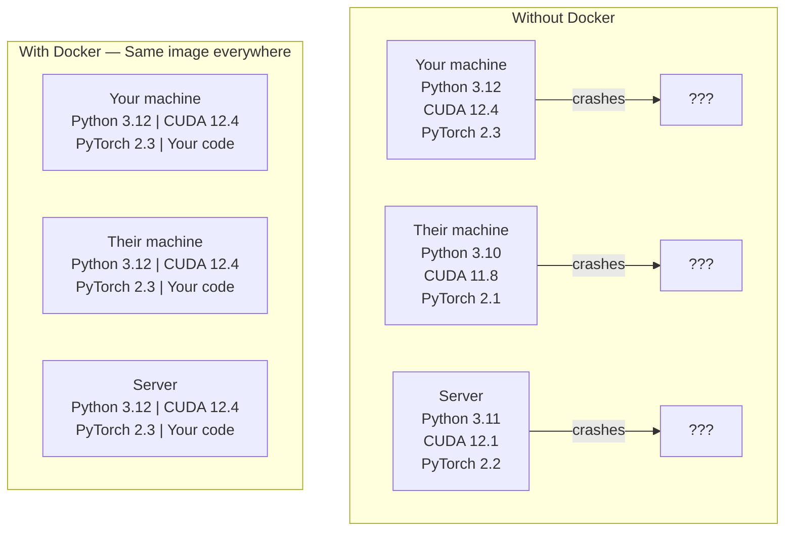

# Docker pour l' IA  Docker pour les récipients d' IA  Application

> Les conteneurs font du "travail sur ma machine" une chose du passé.
> Le contenant fait de mon appareil une histoire.

**Type:** Build | **类型:** 构建
**Languages:** Docker | **语言:** Docker
**Prerequisites:** Phase 0, Lessons 01 and 03 | **前置知识:** Phase 0, 第 01 课和第 03 课
**Time:** ~60 minutes | **时间:** ~60 分钟

## Objectifs d'apprentissage

- Construire une image Docker fonctionnant avec GPU avec des bibliothèques CUDA, PyTorch et IA à partir d'un fichier Docker
  Le Docker est une image de Docker, contenant CUDA、PyTorch 和 AI 库.
- Montez les annuaires hôtes en tant que volumes pour persister dans les modèles, les ensembles de données et le code à travers les reconstructions de conteneurs
  Traduction anglaise: hanging on host host registros for卷, conserver le modèle, le ensemble de données et le code après la reconstruction du contenant
- Configurer le kit d'outils NVIDIA Container pour exposer les GPU à l'intérieur des conteneurs
  Configuration du kit de contenant NVIDIA, dans le contenant exposé GPU
- Orchestration des applications d'IA multi-service (serveur d'inférence + base de données vectorielle) à l'aide de Docker Compose
  Le code de données est le code de données de la base de données.

> **【中文解读】**
> Docker met le code, le temps de fonctionnement, la bibliothèque et les outils système en un "contenu", assurez-vous que les résultats de fonctionnement sur n'importe quel appareil sont cohérents.

## Le problème .

Vous avez formé un modèle sur votre ordinateur portable avec PyTorch 2.3, CUDA 12.4 et Python 3.12. Votre collègue a PyTorch 2.1, CUDA 11.8 et Python 3.10. Votre modèle s'écrase sur leur machine. Votre fichier Docker fonctionne sur les deux.

> Vous avez utilisé PyTorch 2.3 ̊CUDA 12.4 ̊Python 3.12 ̊ sur votre ordinateur portable. Vous avez utilisé PyTorch 2.1 ̊CUDA 11.8 ̊Python 3.10 ̊PyTorch 2.3.

Les projets d'IA sont des cauchemars de dépendance. Une pile typique comprend Python, PyTorch, pilotes CUDA, cuDNN, bibliothèques C au niveau du système et des packages spécialisés comme flash-attn qui nécessitent des versions de compilateur exactes. Docker emballe tout cela en une seule image qui fonctionne de manière identique partout.

> Les projets d'IA sont basés sur la gestion de rêve. Les techniques typiques comprennent Python, PyTorch, CUDA, Drive, cuDNN, C-Key, ainsi que des packages spéciaux de versions spécifiques de l'éditeur, tels que Flash-attn.

> **【中文解读】**
> Le projet AI  projet est l'un des types de projets qui nécessitent le plus de Docker. CUDA  version incompétente  PyTorch  version conflit  cuDNN  absence                                                                                                                                                                                                                                                                                                                                                                                                                                                                                

## Le concept de base.

> **【拓展：Docker 在 AI 中的三大用途】**(1) **环境一致性**: un bon modèle entraîné sur son propre ordinateur, déployé sur le serveur ne sera pas évoqué en raison de versions différentes de la bibliothèque;**GPU 隔离**:多人共享一台 GPU 服务器, chacun d'eux un contenant interférent;**一键部署**- Le numéro de la liste:`docker run`Un ordre pour lancer un service complet d'IA (Model + API + 前端), sans avoir besoin de configuration manuelle.

Docker enveloppe votre code, votre temps d'exécution, vos bibliothèques et vos outils système dans une unité isolée appelée un conteneur.

> Docker va mettre votre code, le temps de fonctionnement, la bibliothèque et les outils du système en unité isolée appelée "contenu". Vous pouvez l'imaginer comme une machine virtuelle à petite quantité, mais elle partage le noyau interne du système d'exploitation hôte plutôt que de fonctionner son propre noyau, donc le démarrage ne prend que quelques secondes au lieu de quelques minutes.



### Pourquoi les projets d' IA ont besoin de Docker plus que la plupart ?

> **【中文解读】**La base de données de l'AI  projet dépend particulièrement: Python → PyTorch → CUDA → cuDNN → Système de niveau C 库。 toute version de niveau ne correspond pas entraînera l'effondrement de l'entraînement ou des conclusions non conformes。Docker Place tous les niveaux en un miroir, assurez-vous que " mon appareil peut courir " devient " où que vous puissiez courir "。

1. **GPU drivers are fragile.**Le code CUDA 12.4 n'est pas exécuté sur CUDA 11.8. Docker isole le kit d'outils CUDA à l'intérieur du conteneur tout en partageant le pilote GPU hôte via le kit d'outils NVIDIA Container.

> 1. **GPU 驱动很脆弱。**Le code CUDA 12.4 ne peut pas être utilisé dans CUDA 11.8 ⋅ Docker ⋅ NVIDIA Container Toolkit ⋅ CUDA ⋅ Toolkit ⋅ Container ⋅ Container ⋅ Container ⋅ Container ⋅ Container ⋅ Container ⋅ Container ⋅ Container ⋅ Container ⋅ Container ⋅ Container ⋅ Container ⋅ Container ⋅ Container ⋅ Container ⋅ Container ⋅ Container ⋅ Container ⋅ Container ⋅ Container ⋅ Container ⋅ Container ⋅ Container ⋅ Container ⋅ Container ⋅ Container ⋅ Container ⋅ Container ⋅ Container ⋅ Container ⋅ Container ⋅ Container ⋅ Container ⋅ Container ⋅ Container ⋅ Container ⋅ Container ⋅ Container ⋅ Container ⋅ Container ⋅ Container ⋅ Container ⋅ Container ⋅ Container ⋅ Container ⋅ Container ⋅ Container ⋅ Container ⋅ Container ⋅ Container ⋅ Container ⋅ Container ⋅ Container ⋅ Container ⋅ Container ⋅ Container ⋅ Container ⋅

2. **Model weights are large.**Un modèle de paramètre 7B est de 14 Go en fp16. Vous ne voulez pas le télécharger à chaque fois que vous le reconstruisez.

> 2. **模型权重很大。**7B 参数的模型在fp16 下有14GB──你不想每次重建容器都重新下载──Docker卷让你从主机上载模型目录──

3. **Multi-service architectures are common.**Une application d'IA réelle n'est pas seulement un script Python. C'est un serveur d'inférence, une base de données vectorielle pour RAG, peut-être un frontend Web. Docker Compose orchestre tout cela avec une seule commande.

> 3. **多服务架构很常见。**La vraie IA n'est pas seulement un script Python. Elle contient un serveur de calcul, un RAG à la base de données, et peut-être un Web.

### Le vocabulaire clé

| Term | What it means |
|------|---------------|
| Image | A read-only template. Your recipe. Built from a Dockerfile. |
| Container | A running instance of an image. Your kitchen. |
| Dockerfile | Instructions to build an image. Layer by layer. |
| Volume | Persistent storage that survives container restarts. |
| docker-compose | A tool for defining multi-container applications in YAML. |

| 术语 | 含义 |
|------|------|
| Image（镜像） | 只读模板，相当于菜谱。由 Dockerfile 构建。 |
| Container（容器） | 镜像的运行实例，相当于厨房。 |
| Dockerfile | 构建镜像的指令文件，逐层定义。 |
| Volume（卷） | 持久化存储，容器重启后数据不丢失。 |
| docker-compose | 用 YAML 定义多容器应用的编排工具。 |

### Des modèles de conteneurs communs dans l'IA

> **【拓展：AI 部署的标准模式】**Le modèle de contenant de l'IA:**训练容器**挂载数据集目录, training完完输出模型权重;**推理容器**加载模型权重, fournir API REST;(3) **Jupyter 容器** pré-construction de tous les archives de Notebook 环境──Hugging Face、NVIDIA NGC  fournit une grande quantité de pré-construction de l'IA 基础镜像──

```
Dev Container
  Full toolkit. Editor support. Jupyter. Debugging tools.
  Used during development and experimentation.

Training Container
  Minimal. Just the training script and dependencies.
  Runs on GPU clusters. No editor, no Jupyter.

Inference Container
  Optimized for serving. Small image. Fast cold start.
  Runs behind a load balancer in production.
```

## Construisez-le et mettez-le en œuvre.
```figure
s0-image-layers
```

## Faites-le

### Étape 1: Installez Docker

```bash
# macOS
brew install --cask docker
open /Applications/Docker.app

# Ubuntu
curl -fsSL https://get.docker.com | sh
sudo usermod -aG docker $USER
# Log out and back in for group change to take effect
```

Vérifiez:

> 验证安装:

```bash
docker --version
docker run hello-world
```

### Étape 2: Installez le kit d'outils NVIDIA Container (Linux avec GPU NVIDIA)

Cela permet aux conteneurs Docker d'accéder à votre GPU. Les utilisateurs de macOS et Windows (WSL2) peuvent sauter cela; Docker Desktop gère les GPU différemment sur ces plateformes.

> Cela permet à Docker 容器 de visiter votre GPU ⋅ macOS et Windows (WSL2) utilisateur peut sauter cette étape; Docker Desktop sur ces plateformes de différentes manières de traiter la GPU directement ⋅

```bash
distribution=$(. /etc/os-release;echo $ID$VERSION_ID)
curl -fsSL https://nvidia.github.io/libnvidia-container/gpgkey | sudo gpg --dearmor -o /usr/share/keyrings/nvidia-container-toolkit-keyring.gpg
curl -s -L https://nvidia.github.io/libnvidia-container/$distribution/libnvidia-container.list | \
    sed 's#deb https://#deb [signed-by=/usr/share/keyrings/nvidia-container-toolkit-keyring.gpg] https://#g' | \
    sudo tee /etc/apt/sources.list.d/nvidia-container-toolkit.list

sudo apt-get update
sudo apt-get install -y nvidia-container-toolkit
sudo nvidia-ctk runtime configure --runtime=docker
sudo systemctl restart docker
```

Testez l'accès GPU à l'intérieur d'un conteneur:

> 测试容器内 GPU 访问:

```bash
docker run --rm --gpus all nvidia/cuda:12.4.1-base-ubuntu22.04 nvidia-smi
```

Si vous voyez vos informations sur le GPU, le kit d'outils fonctionne.

> Si vous pouvez voir le GPU, expliquez que le travail est normal.

### Étape 3: Comprendre les images de base.

> **【中文解读】**基础镜像是 Dockerfile's starting point。AI 项目推使用NVIDIA 官方的CUDA 镜像(`nvidia/cuda:12.4.0-devel-ubuntu22.04`) ou PyTorch 官方镜像(`pytorch/pytorch:2.4.0-cuda12.4`), elles sont préinstallées dans les bases de données de la CPU et de la profondeur de l'apprentissage.

Choisir la bonne image de base permet d'économiser des heures de débogage.

> 选择正确的基础镜像能节省几个小时的调试时间──

```
nvidia/cuda:12.4.1-devel-ubuntu22.04
  Full CUDA toolkit. Compilers included.
  Use for: building packages that need nvcc (flash-attn, bitsandbytes)
  Size: ~4 GB

nvidia/cuda:12.4.1-runtime-ubuntu22.04
  CUDA runtime only. No compilers.
  Use for: running pre-built code
  Size: ~1.5 GB

pytorch/pytorch:2.6.0-cuda12.4-cudnn9-runtime
  PyTorch pre-installed on top of CUDA.
  Use for: skipping the PyTorch install step
  Size: ~6 GB

python:3.12-slim
  No CUDA. CPU only.
  Use for: inference on CPU, lightweight tools
  Size: ~150 MB
```

### Étape 4: Écrire un fichier Docker pour le développement de l'IA

Voici le fichier Docker dans `code/Dockerfile`- Parcourez-le .

> C' est ça .`code/Dockerfile`Le fichier Docker du milieu.

```dockerfile
FROM nvidia/cuda:12.4.1-devel-ubuntu22.04

ENV DEBIAN_FRONTEND=noninteractive
ENV PYTHONUNBUFFERED=1

RUN apt-get update && apt-get install -y --no-install-recommends \
    software-properties-common \
    git \
    curl \
    build-essential \
    && add-apt-repository -y ppa:deadsnakes/ppa \
    && apt-get update && apt-get install -y --no-install-recommends \
    python3.12 \
    python3.12-venv \
    python3.12-dev \
    && rm -rf /var/lib/apt/lists/*

RUN update-alternatives --install /usr/bin/python python /usr/bin/python3.12 1

RUN curl -sSL https://raw.githubusercontent.com/pypa/get-pip/3b73145063be545b649ad9ca83ea8da5fc915a4f/public/get-pip.py -o /tmp/get-pip.py \
    && echo "a341e1a43e38001c551a1508a73ff23636a11970b61d901d9a1cad2a18f57055  /tmp/get-pip.py" | sha256sum -c - \
    && python /tmp/get-pip.py \
    && rm /tmp/get-pip.py \
    && update-alternatives --install /usr/bin/pip pip /usr/local/bin/pip3.12 1

RUN python -m pip install --no-cache-dir --upgrade pip setuptools wheel

RUN python -m pip install --no-cache-dir \
    torch==2.6.0+cu124 \
    torchvision==0.21.0+cu124 \
    torchaudio==2.6.0+cu124 \
    --index-url https://download.pytorch.org/whl/cu124

RUN python -m pip install --no-cache-dir \
    numpy \
    pandas \
    scikit-learn \
    matplotlib \
    jupyter \
    transformers \
    datasets \
    accelerate \
    safetensors

WORKDIR /workspace

VOLUME ["/workspace", "/models"]

EXPOSE 8888

CMD ["python"]
```

- Faites-le !

> 构建镜像:

```bash
docker build -t ai-dev -f phases/00-setup-and-tooling/07-docker-for-ai/code/Dockerfile .
```

Cela prend un certain temps la première fois (téléchargement de l'image de base CUDA + PyTorch).

> 首次构建需要一些时间(下载 CUDA 基础镜像 + PyTorch) ⋅后续构建会使用缓存的层──

- Je vais le faire.

> 运行容器:

```bash
docker run --rm -it --gpus all \
    -v $(pwd):/workspace \
    -v ~/models:/models \
    ai-dev python -c "import torch; print(f'PyTorch {torch.__version__}, CUDA: {torch.cuda.is_available()}')"
```

Exécuter Jupyter à l'intérieur du conteneur:

> Dans le contenant, le système de navigation de Jupiter:

```bash
docker run --rm -it --gpus all \
    -v $(pwd):/workspace \
    -v ~/models:/models \
    -p 8888:8888 \
    ai-dev jupyter notebook --ip=0.0.0.0 --port=8888 --no-browser --allow-root
```

### Étape 5: Montage de volume pour les données et les modèles

Les montage de volume sont essentiels pour le travail de l'IA. Sans eux, vos téléchargements de modèle de 14 Go disparaissent lorsque le conteneur s'arrête.

> Il est important de travailler avec l'IA. Sans eux, le modèle de 14 Go que vous téléchargez disparaîtra lorsque le conteneur s'arrêtera.

```bash
# Mount your code
-v $(pwd):/workspace

# Mount a shared models directory
-v ~/models:/models

# Mount datasets
-v ~/datasets:/data
```

Dans votre script d'entraînement, chargez-vous du chemin monté:

> Dans le livre d'entraînement, de la route de chargement:

```python
from transformers import AutoModel

model = AutoModel.from_pretrained("/models/llama-7b")
```

Le modèle est installé sur votre système de fichiers hôte.

> 模型存储在宿主文件系统中. Vous pouvez reconstruire le récipient à volonté, sans avoir à le télécharger à nouveau.

### Étape 6: Docker Composer pour les applications d'IA multi-service

Une application RAG réelle a besoin d'un serveur d'inférence et d'une base de données vectorielle.

> L'application RAG réelle doit être basée sur le serveur et la base de données de données de données.

Regardez !`code/docker-compose.yml`- Le numéro de la liste:

```yaml
services:
  ai-dev:
    build:
      context: .
      dockerfile: Dockerfile
    deploy:
      resources:
        reservations:
          devices:
            - driver: nvidia
              count: all
              capabilities: [gpu]
    volumes:
      - ../../../:/workspace
      - ~/models:/models
      - ~/datasets:/data
    ports:
      - "8888:8888"
    stdin_open: true
    tty: true
    command: jupyter notebook --ip=0.0.0.0 --port=8888 --no-browser --allow-root

  qdrant:
    image: qdrant/qdrant:v1.12.5
    ports:
      - "6333:6333"
      - "6334:6334"
    volumes:
      - qdrant_data:/qdrant/storage

volumes:
  qdrant_data:
```

Commencez tout:

> 启动所有服务:

```bash
cd phases/00-setup-and-tooling/07-docker-for-ai/code
docker compose up -d
```

Maintenant votre conteneur de développement d' IA peut atteindre la base de données vectorielle à `http://qdrant:6333`Docker Compose crée automatiquement un réseau partagé.

> Maintenant, l'IA peut développer des contenants par le biais de services.`http://qdrant:6333`访问量数据库──Docker Composer  自动创建共享网络──

Testez la connexion à l'intérieur du conteneur d'IA:

> Depuis l'IA 容器内部测试连接:

```python
from qdrant_client import QdrantClient

client = QdrantClient(host="qdrant", port=6333)
print(client.get_collections())
```

Arrêtez tout !

> 停止所有服务:

```bash
docker compose down
```

Ajouter `-v`pour supprimer également le volume de qdrant:

>  `-v`Avec le temps de supprimer le code:

```bash
docker compose down -v
```

### Étape 7: Commandes Docker utiles pour le travail d'IA

> 第7步:AI 工作中常用Docker 命令

```bash
# List running containers
docker ps

# List all images and their sizes
docker images

# Remove unused images (reclaim disk space)
docker system prune -a

# Check GPU usage inside a running container
docker exec -it <container_id> nvidia-smi

# Copy a file from container to host
docker cp <container_id>:/workspace/results.csv ./results.csv

# View container logs
docker logs -f <container_id>
```

## Utilisez-le avec un guide.

> **【拓展：Docker vs Conda 选择指南】**简单项目用Conda/uv 即可;需要部署或多人协作时使用Docker。Législation d'expérience: si vous dites "Mon appareil peut fonctionner", indiquez que vous devriez utiliserDocker 了── La plupart des cours de ce cours ne nécessitent pas Docker, mais la phase 17 (Infrastructure and Production Deployment) sera largement utilisée──

Vous avez maintenant un environnement de développement d'IA reproduisable.

> Vous avez maintenant un environnement de développement d'IA réalisable.

- Utilisation `docker compose up`pour démarrer votre environnement de développement et vecteur de base de données ensemble
  Le mot " usage " est traduit par " usage "`docker compose up`En même temps, le développement de la base de données environnementale et de volumes
- Montez votre code, vos modèles et vos données en volumes afin que rien ne soit perdu entre les reconstructions
  Le code, le modèle et les données sont chargés pour le volume, ne seront pas perdus après la reconstruction.
- Lorsque la leçon nécessite un nouveau paquet Python, ajoutez-le au fichier Docker et reconstruisez
  Le cours doit être complété par un nouveau Python.
- Partagez votre dossier avec vos coéquipiers.
  Ils ont obtenu le même environnement.

### Pas de GPU ?

Retirez le `--gpus all`Le contenant fonctionne toujours pour les leçons basées sur le processeur PyTorch détecte l'absence de CUDA et revient automatiquement sur le processeur.

>                                                                                                                                                                                                                                                                                                                                                                                                                                                                                                                              `--gpus all`标志和 NVIDIA déployer 配置块──容器 encore peut être utilisé en cours basés sur la CPU──PyTorch 会自动检测 CUDA 不存在并回归到CPU──

## Les exercices

1. Construisez le fichier Docker et courez `python -c "import torch; print(torch.__version__)"`à l'intérieur du conteneur
   Construire Docker 镜像, dans le contenant
2. Démarrez la pile composée de docker et vérifiez que Qdrant est accessible depuis le conteneur d' IA à `http://qdrant:6333/collections`
   Initialement docker-composer ,验证 Qdrant 向量数据库可访问
3. Ajouter `flask`Pour le fichier Docker, reconstruire et exécuter un serveur API simple sur le port 5000.`-p 5000:5000`
   Dans le fichier Docker, ajoutez la bouteille, reconstruisez l'image, exploitez l'API  serveur
4. Mesurer la taille de l' image avec `docker images`Essayez de changer l' image de base de `devel`à `runtime`et comparer les tailles
    mesure du miroir en taille, par rapport au dével et au temps de fonctionnement  base de l'image de la différence de taille

## Les termes clés

| Term | What people say | What it actually means |
|------|----------------|----------------------|
| Container | "Lightweight VM" | An isolated process using the host kernel, with its own filesystem and network |
| Image layer | "Cached step" | Each Dockerfile instruction creates a layer. Unchanged layers are cached, so rebuilds are fast. |
| NVIDIA Container Toolkit | "GPU in Docker" | A runtime hook that exposes host GPUs to containers via `--gpus` flag |
| Volume mount | "Shared folder" | A directory on the host mapped into the container. Changes persist after the container stops. |
| Base image | "Starting point" | The `FROM` image your Dockerfile builds on top of. Determines what is pre-installed. |

| 术语 | 俗称 | 实际含义 |
|------|------|---------|
| Container | "轻量虚拟机" | 使用宿主内核的隔离进程，拥有独立文件系统和网络 |
| Image layer | "缓存层" | 每条 Dockerfile 指令创建一层，未修改的层会被缓存 |
| NVIDIA Container Toolkit | "Docker 中的 GPU" | 通过 `--gpus` 标志将宿主 GPU 暴露给容器的运行时钩子 |
| Volume mount | "共享文件夹" | 宿主目录映射到容器内，容器停止后数据保留 |
| Base image | "起点" | Dockerfile 的 FROM 镜像，决定了预装内容 |
