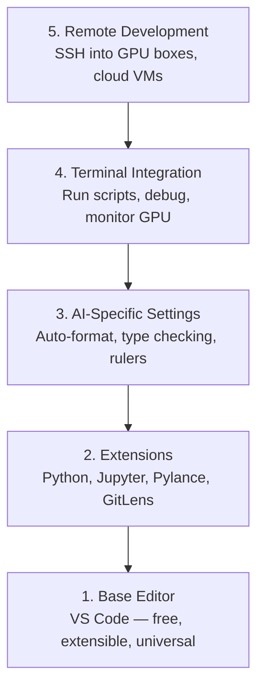

# Configuration de l' éditeur

> Votre éditeur est votre co-pilot, configurez-le une fois pour qu'il reste hors de votre chemin et commence à tirer son poids.
> L'éditeur est ton adjoint. Réglez-le une fois, que ce ne soit plus un problème, mais un vrai rôle.

**Type:** Build | **类型:** 构建
**Languages:** -- | **语言:** 无
**Prerequisites:** Phase 0, Lesson 01 | **前置知识:** Phase 0, 第 01 课
**Time:** ~20 minutes | **时间:** ~20 分钟

## Objectifs d'apprentissage

- Installez le code VS avec des extensions essentielles pour Python, Jupyter, linting et SSH à distance
  En français, le code est utilisé pour la mise en place de l'application.
- Configurer le format-on-sauvage, la vérification du type et le défilement de sortie du bloc-notes pour les flux de travail d'IA
  Configuration de la sauvegarde, de la mise en forme, du type de contrôle et du bloc-notes, etc.
- Configurer le Remote SSH pour modifier et débogager le code sur les machines GPU distantes comme s' elles étaient locales
  Le code de la GPU est utilisé pour la configuration de la commande à distance.
- Évaluer les alternatives d'édition (Cursor, Windsurf, Neovim) et leurs compromis pour le travail de l'IA
  Le programme de révision de l'information et de la communication est un outil de révision de la communication.

> **【中文解读】**
> L'éditeur est un outil de main-d'œuvre pour la rédaction de code.

## Le problème .

Vous passerez des milliers d'heures à l'intérieur de votre éditeur à écrire Python, à exécuter des carnets de notes, à déboguer les boucles d'entraînement et à intégrer SSH dans les boîtes GPU. Un éditeur mal configuré transforme chaque session en friction: pas de complément automatique, pas de suggestions de type, pas d'erreurs en ligne, de formatage manuel et un flux de travail terminal maladroit.

> Vous passerez des milliers d'heures dans un éditeur à rédiger Python, à gérer un Notebook, à modifier un cycle de formation, à connecter un serveur GPU, à un SSH. Un éditeur mal configuré fera que chaque édition se transforme en douleur: pas de complément automatique, pas de type de suggestion, pas d'erreur interne, pas de formalisation manuelle, pas de travail final.

La bonne configuration prend 20 minutes, mais sauter ça vous coûte 20 minutes par jour.

> Une configuration correcte ne prend que 20 minutes.

> **【中文解读】**
> L'éditeur de configuration ne prend que 20 minutes, mais le non-configuration vous fera perdre plus de 20 minutes par jour.

## Le concept de base.

Une configuration d'éditeur d'ingénierie AI a besoin de cinq choses:

> L'éditeur d'ingénierie AI a besoin de cinq niveaux de configuration:



> **【中文解读】**
> L'IA  développer l'éditeur nécessite cinq niveaux de configuration: l'éditeur de base → l'élargissement des plugins → l'IA  spécialisation de l'établissement → l'intégration du terminal → le développement à distance.
```figure
s0-lsp-roundtrip
```

## Faites-le

## Construisez-le et mettez-le en œuvre.

> **【拓展：VS Code 为什么是 AI 开发的首选编辑器】**Le code VS occupe une position dominante dans le développement de l'IA: 1) gratuit et léger; 2) le Notebook Jupyter; 3) le code de gestion de la connexion directe à la GPU; 4) le Python/Jupyter/Python Débugger; 5) le programme d'aide à l'IA:

### Étape 1: Installez le code VS.

VS Code est l'éditeur recommandé. Il est gratuit, fonctionne sur tous les systèmes d'exploitation, dispose d'une prise en charge notebook Jupyter de première classe, et l'écosystème d'extension couvre tout ce dont vous avez besoin pour le travail d'IA.

> VS Code est un éditeur recommandé. Il est gratuit.

Téléchargez-le à partir de [code.visualstudio.com](https://code.visualstudio.com/)- Je suis désolé .

> De [code.visualstudio.com](https://code.visualstudio.com/)Je suis en train de vous dire...

Vérifiez depuis le terminal:

> Dans le cadre de l'essai:

```bash
code --version
```

Si vous`code`n'est pas disponible sur macOS, ouvrez le code VS, appuyez `Cmd+Shift+P`, tapez "Command de coque", puis sélectionnez "Installer la commande "code" dans PATH".

> Si macOS 上找不到 `code`- Je vous en prie.`Cmd+Shift+P`,输入 "Shell Command", choisir "Installer la commande "code" dans le PATH"。

### Étape 2: Installez les extensions essentielles.

> **【中文解读】**L'utilisation de la technologie est un facteur important dans la gestion de la gestion de la gestion des données.

Ouvrez le terminal intégré dans le code VS (`` Ctrl+``` sur toutes les plateformes) et installer les extensions qui comptent pour le travail de l'IA:

> 打开 VS Code 的集成终端(`Ctrl+`` `Ou `` Cmd+```), installer AI 工作所需的关键扩展:

```bash
code --install-extension ms-python.python
code --install-extension ms-python.vscode-pylance
code --install-extension ms-toolsai.jupyter
code --install-extension eamodio.gitlens
code --install-extension ms-vscode-remote.remote-ssh
code --install-extension ms-python.debugpy
code --install-extension ms-python.black-formatter
code --install-extension charliermarsh.ruff
```

Ce que chacun fait:

> Chaque action est de:

| Extension | Why |
|-----------|-----|
| Python | Language support, virtual env detection, run/debug |
| Pylance | Fast type checking, autocomplete, import resolution |
| Jupyter | Run notebooks inside VS Code, variable explorer |
| GitLens | See who changed what, inline git blame |
| Remote SSH | Open a folder on a remote GPU box as if it were local |
| Debugpy | Step-through debugging for Python |
| Black Formatter | Auto-format on save, consistent style |
| Ruff | Fast linting, catches common mistakes |

Le dossier `code/.vscode/extensions.json`Lorsque vous ouvrez le dossier du projet, VS Code vous demandera de les installer.

> Dans le cours`code/.vscode/extensions.json`包含完整的推列表──当你打开项目文件时,VS Code 会提示你安装──

### Étape 3: Configurer les paramètres

Copiez les paramètres à partir de `code/.vscode/settings.json`Dans cette leçon, ou les appliquer manuellement à travers `Settings > Open Settings (JSON)`- Je suis désolé .

> De la classe`code/.vscode/settings.json`复制设置, ou par`Settings > Open Settings (JSON)`Application manuelle

Les paramètres clés pour le travail de l'IA:

> Réglage de l'IA 工作:

```jsonc
{
    "python.analysis.typeCheckingMode": "basic",
    "editor.formatOnSave": true,
    "editor.rulers": [88, 120],
    "notebook.output.scrolling": true,
    "files.autoSave": "afterDelay"
}
```

Pourquoi ces questions sont importantes:

> Pourquoi ces paramètres sont importants:

- **Type checking on basic**: Capture de mauvais types d'arguments avant d'exécuter. Économise du temps de débogage sur les déséquilibres de forme tensor et les paramètres API incorrects.
  Le mot grec traduit par " le mot grec "**基础类型检查**: en cours de fonctionnement de capturer des paramètres de type erroné, économiser des temps de sélection des paramètres d'API erronés et de changement de forme.
- **Format on save**Ne pensez plus à la mise en forme.
  Le mot grec traduit par " le mot grec "**保存时格式化**Il n'est pas nécessaire de penser à la mise en forme.
- **Rulers at 88 and 120**Le marqueur 120 montre quand les chaînes de documents et les commentaires deviennent trop longs.
  Le mot grec traduit par " le mot grec "**88 和 120 标尺**:Noir dans 88 pages 换行──120 标尺显示文档字符串和注释是否过长──
- **Notebook output scrolling**Les boucles d'entraînement impriment des milliers de lignes.
  Le mot grec traduit par " le mot grec "**Notebook 输出滚动**Il y a des milliers de pages imprimées sans roulement, et il y a des milliers de pages de roulements imprimés sans roulement.
- **Auto-save**Vous oublierez de sauvegarder. Votre script d'entraînement exécutera un code obsolète.
  Le mot grec traduit par " le mot grec "**自动保存**Vous oublierez de conserver.

### Étape 4: Intégration du terminal

Le terminal intégré de VS Code est où vous exécutez des scripts de formation, surveillez les GPU et gérez les environnements.

> L'intégration du code VS est l'endroit où vous utilisez le script d'entraînement, la surveillance de la GPU et l'environnement de gestion.

Mettez-le correctement.

> L'arrêt de la mise en page:

```jsonc
{
    "terminal.integrated.defaultProfile.osx": "zsh",
    "terminal.integrated.defaultProfile.linux": "bash",
    "terminal.integrated.fontSize": 13,
    "terminal.integrated.scrollback": 10000
}
```

Des raccourcis utiles:

> 常用快捷键:

| Action | macOS | Linux/Windows |
|--------|-------|---------------|
| Toggle terminal | `` Ctrl+` `` | `` Ctrl+` `` |
| New terminal | `` Ctrl+Shift+` `` | `` Ctrl+Shift+` `` |
| Split terminal | `Cmd+\` | `Ctrl+Shift+5` |

Les terminaux séparés sont utiles: un pour exécuter votre script, un pour surveiller la GPU avec `nvidia-smi -l 1`ou `watch -n 1 nvidia-smi`- Je suis désolé .

> Un terminal est très utile: un script, un us`nvidia-smi -l 1`Ou `watch -n 1 nvidia-smi`- Je suis en train de surveiller la GPU.

### Étape 5: Développement à distance (SSH dans les boîtes GPU)

> **【拓展：Remote SSH 是 AI 开发的杀手级功能】**La plupart des gens n'ont pas de GPU locale, ils ont besoin de SSH pour suivre un modèle de formation de serveur de GPU à distance.

C'est l'extension la plus importante pour le travail de l'IA. Vous exécuterez une formation sur des machines distantes (VM cloud, serveurs de laboratoire, Lambda, Vast.ai).

> C'est l'expansion la plus importante de l'IA. Vous allez vous entraîner à fonctionner sur des machines à distance.

- Le réglage:

> 设置步骤:

1. Installez l'extension SSH à distance (faire à l'étape 2).
2. La presse `Ctrl+Shift+P`(ou `Cmd+Shift+P`), de type "Remote-SSH: Connectez-vous à l'hôte".
3. Entrez .`user@your-gpu-box-ip`- Je suis désolé .
4. VS Code installe automatiquement son composant serveur sur la machine à distance.

> 1. Installation à distance SSH 扩展(已在步骤 2 完成)
> 2. 按 `Ctrl+Shift+P`(ou `Cmd+Shift+P`),输入 "Remote-SSH: Connectez-vous à l'hôte"―
> 3. 输入 `user@your-gpu-box-ip`Il y a une autre.
> 4. VS Code automatiquement installé sur un appareil à distance ses composants serveurs.

Pour un accès sans mot de passe, configurer les clés SSH:

> Pour réaliser une accès sans mot de passe, définissez la clé SSH:

```bash
ssh-keygen -t ed25519 -C "your-email@example.com"
ssh-copy-id user@your-gpu-box-ip
```

Ajoutez l' hôte à `~/.ssh/config`Pour plus de commodité:

> Pour faciliter la mise en place, le maître d'hôtel s'est ajouté.`~/.ssh/config`- Le numéro de la liste:

```
Host gpu-box
    HostName 203.0.113.50
    User ubuntu
    IdentityFile ~/.ssh/id_ed25519
    ForwardAgent yes
```

- Je suis désolé .`Remote-SSH: Connect to Host > gpu-box`se connecte instantanément.

> Je suis là.`Remote-SSH: Connect to Host > gpu-box`Il y a une connexion instantanée.

## Les alternatives sont des alternatives.

> **【拓展：AI 增强编辑器对比】**Cursor (basé sur VS Code, intégré AI  programmer assistant, $ 20/月) et Windsurf (Codeium 出品,免费层可用) sont les principaux avantages de l'AI natif de l'équipe de rédaction de 2024-2026: utiliser la langue naturelle, créer des codes automatiques.

### Le curseur

[cursor.com](https://cursor.com)est un fourchette VS Code avec génération de code intégré AI. Il utilise le même écosystème d'extension et le même format de paramètres. Si vous utilisez Cursor, tout ce qui est dans cette leçon s'applique toujours. Importer la même `settings.json`et `extensions.json`- Je suis désolé .

> [cursor.com](https://cursor.com)Il utilise le même mode d'expansion et de configuration. Si vous utilisez Cursor, tout le contenu de ce cours reste applicable.`settings.json`et `extensions.json`Je suis là.

### Surf à vent

[windsurf.com](https://windsurf.com)C'est une autre fourchette de code VS d'IA. La même histoire: les mêmes extensions, le même format de paramètres, le même support SSH à distance.

> [windsurf.com](https://windsurf.com)Il s'agit d'un autre code VS prioritaire par AI, divisé en branches.

### Vim/Neovim

Si vous utilisez déjà Vim ou Neovim et que vous êtes productif, restez là.

> Si vous utilisez déjà Vim ou Neovim et que l'efficacité n'est pas mauvaise, continuez à utiliser l'IA Python.

- **pyright**ou **pylsp**pour la vérification du type (via la maçonnerie ou l'installation manuelle)
  Le mot grec traduit par " le mot grec "**pyright**Ou **pylsp**Utilisé pour le type de contrôle (à travers la maçonnerie ou l'installation manuelle)
- **nvim-lspconfig**pour l'intégration du serveur de langue
  Le mot grec traduit par " le mot grec "**nvim-lspconfig**Utilisé dans les services de langue
- **jupyter-vim**ou **molten-nvim**pour une exécution similaire à un ordinateur portable
  Le mot grec traduit par " le mot grec "**jupyter-vim**Ou **molten-nvim**Utilisé pour exécuter comme Notebook
- **telescope.nvim**pour la recherche de fichiers/symbols
  Le mot grec traduit par " le mot grec "**telescope.nvim**Utilisé pour la recherche de fichiers / symboles
- **none-ls.nvim**avec noir et roux pour le formatage/lintage
  Le mot grec traduit par " le mot grec "**none-ls.nvim**配合 noir et ruff utilisé pour la mise en forme / lin

Si vous n'utilisez pas Vim, ne commencez pas maintenant. La courbe d'apprentissage va rivaliser avec l'apprentissage de l'ingénierie de l'IA. Utilisez VS Code.

> Si vous n'utilisez pas encore Vim, ne commencez pas à apprendre à utiliser le code VS.

## Utilisez-le avec un guide.

> **【中文解读】** Configuration:VS Code + Python + Jupyter + SSH à distance。 Si vous utilisez un serveur GPU à distance, le SSH à distance est nécessaire。

Avec cette configuration, votre flux de travail quotidien ressemble à:

> Avec cette configuration, votre travail quotidien est comme suit:

1. Ouvrez le dossier du projet dans VS Code (ou connectez-vous via SSH à distance à une boîte GPU).
   Le code VS est utilisé pour la mise à jour de projets.
2. Écrivez Python dans l'éditeur avec autocomplete, astuces de tactile et erreurs en ligne.
   En anglais, le type de commentaire est le type de commentaire.
3. Exécutez des ordinateurs Jupyter en ligne avec l'extension Jupyter.
   Le livre de notes de l'équipe de l'équipe de l'équipe de l'équipe de l'équipe de l'équipe de l'équipe de l'équipe de l'équipe de l'équipe de l'équipe de l'équipe de l'équipe de l'équipe de l'équipe de l'équipe de l'équipe de l'équipe de l'équipe de l'équipe de l'équipe de l'équipe de l'équipe de l'équipe de l'équipe de l'équipe de l'équipe de l'équipe de l'équipe de l'équipe de l'équipe de l'équipe de l'équipe de l'équipe de l'équipe de l'équipe de l'équipe de l'équipe de l'équipe de l'équipe de l'équipe de l'équipe de l'équipe de l'équipe de l'équipe de l'équipe de l'équipe de l'équipe de l'équipe de l'équipe de l'équipe de l'équipe de l'équipe de l'équipe de l'équipe de l'équipe de l'équipe de la championnant.
4. Utilisez le terminal intégré pour les scripts de formation, `uv pip install`, et la surveillance par GPU.
   Le mot d'ordre est "trainage"`uv pip install`Et le GPU est en contrôle.
5. Révisez les modifications avec GitLens avant de s'engager.
   Nom de fichier: "GitLens"

## Les exercices

1. Installez le code VS et toutes les extensions énumérées à l'étape 2
   Installation VS Code 和步骤 2 Toutes les extensions de la liste
2. - Copier le `settings.json`de cette leçon dans votre configuration de code VS
   Le cours sera suivi`settings.json` Répondre à votre VS Code  Configuration
3. Ouvrez un fichier Python et vérifiez que Pylance affiche des indices de type et des formats Noirs sur sauvegarde
   打开一个Python文件,验证Pylance 显示类型提示、Black 保存时自动格式化
4. Si vous avez accès à une machine à distance, configurez Remote SSH et ouvrez un dossier dessus
   Si vous avez un appareil à distance, la configuration de la téléphonie à distance SSH et ouvrir les fichiers à distance

## Les termes clés

| Term | What people say | What it actually means |
|------|----------------|----------------------|
| LSP | "Autocomplete engine" | Language Server Protocol: a standard for editors to get type info, completions, and diagnostics from a language-specific server |
| Pylance | "The Python plugin" | Microsoft's Python language server using Pyright for type checking and IntelliSense |
| Remote SSH | "Working on the server" | VS Code extension that runs a lightweight server on a remote machine and streams the UI to your local editor |
| Format on save | "Auto-prettier" | The editor runs a formatter (Black, Ruff) every time you save, so code style is always consistent |

| 术语 | 俗称 | 实际含义 |
|------|------|---------|
| LSP | "自动补全引擎" | 语言服务器协议：编辑器获取类型信息、补全和诊断的标准 |
| Pylance | "Python 插件" | 微软的 Python 语言服务器，提供类型检查和智能提示 |
| Remote SSH | "在服务器上开发" | VS Code 在远程机器上运行轻量服务器，将 UI 传输到本地编辑器 |
| Format on save | "保存时自动格式化" | 每次保存时自动运行格式化工具，保持代码风格一致 |
