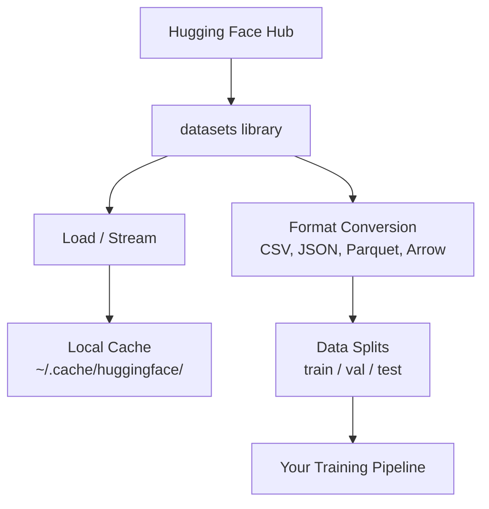

# Gestion des données

> Les données sont le carburant, et la façon dont vous les gérez détermine votre vitesse.
> Les données sont le carburant. La façon dont vous gérez les données détermine si vous pouvez courir plus vite.

**Type:** Build | **类型:** 构建
**Language:**Je suis un Python .**语言:**Python
**Prerequisites:** Phase 0, Lesson 01 | **前置知识:** Phase 0, 第 01 课
**Time:** ~45 minutes | **时间:** ~45 分钟

## Objectifs d'apprentissage

- Charger, diffuser et mettre en cache des ensembles de données à l'aide du Face embrasé `datasets`bibliothèque
  中文翻译:使用 Hugging Face `datasets`库加载、流式处理和缓存数据集
- Convertir entre les formats CSV, JSON, Parquet et Arrow et expliquer leurs compromis
  Transformation entre le format CSV、JSON、Parquet 和 Arrow, et expliquer leurs propres défauts
- Créer des divisions de train/validation/essai reproduisables avec des graines aléatoires fixes
  Traduction anglaise: avec un séquence fixe créer un séquence de formation / test / test
- Gérer les fichiers de grands modèles et ensembles de données en utilisant `.gitignore`, Git LFS ou DVC
  Le mot " usage " est traduit par " usage "`.gitignore`、Git LFS ou DVC 管理大型模型和数据文件

> **【中文解读】**
> Les données sont le combustible de l'IA.`datasets`La gestion des données est la condition préalable au début de l'expérience d'apprentissage automatique.

## Le problème .

Chaque projet d'IA commence par des données. Vous devez trouver des ensembles de données, les télécharger, les convertir entre formats, les diviser pour la formation et l'évaluation, et les modifier pour que les expériences soient reproduisibles. Faire cela manuellement à chaque fois est lent et sujet à erreurs. Vous avez besoin d'un flux de travail répétitif.

> Chaque projet d'IA commence par des données. Vous devez trouver des ensembles de données, télécharger des formats de transformation, les diviser en ensembles de formation et d'évaluation, et effectuer une gestion de version pour assurer la répétitivité de l'expérience.

> **【中文解读】**
> Chaque projet d'IA commence par les données. Vous devez télécharger des ensembles de données, les transformer en format, les décomposer, les entraîner/ vérifier/ tester, et gérer des versions pour assurer la répétition des expériences.

> **【拓展：Hugging Face 在 AI 生态中的地位】**
> Hugging Face est un "GitHub" de l'IA, qui a géré des centaines de milliers de collections de données et de modèles de formation préalable.`datasets`La base de données est un outil standard de chargement et de traitement de données, similaire à Pandas, mais spécialisé dans l'optimisation par l'IA, qui prend en charge le chargement de supergrandes données.

## Le concept de base.



Le visage qui s' embrasse`datasets`La bibliothèque est la façon standard de charger des données pour le travail de l'IA. Elle gère le téléchargement, le caching, la conversion de format et le streaming hors boîte.

> Une face en train de s' embrasser`datasets`La base de données est le mode standard de chargement de données par l'IA.

> **【中文解读】**
> Une face en train de s' embrasser`datasets`Il traite automatiquement les téléchargements, les archives, les formats de conversion et les flux de chargement. Vous n'avez pas besoin de gérer manuellement les fichiers de données, la bibliothèque vous aidera à effectuer tous les travaux de base.

> **【拓展：数据格式对训练速度的影响】**
> Dans le travail réel de l'IA, le format de données affecte directement l'efficacité de l'entraînement. Le format de parc est de 60 à 80% plus rapide que le CSV.

## Construisez-le et mettez-le en œuvre.
```figure
s0-data-pipeline
```

## Faites-le

### Étape 1: Installez la bibliothèque des ensembles de données

```bash
pip install datasets huggingface_hub  # 安装 Hugging Face 数据集库和模型仓库工具
```

### Étape 2: Charger un ensemble de données

```python
from datasets import load_dataset

dataset = load_dataset("imdb")  # 加载 IMDB 电影评论数据集（首次下载，之后从缓存读取）
dataset = load_dataset("stanfordnlp/imdb")
print(dataset)
print(dataset["train"][0])  # 查看训练集第一条样本
```

Ceci télécharge le jeu de données de critique de film IMDB. Après le premier téléchargement, il se charge à partir du cache à `~/.cache/huggingface/datasets/`- Je suis désolé .

> Ceci sera téléchargé sur IMDB 电影评论数据集.`~/.cache/huggingface/datasets/`Le contenu de l'article est en cours de chargement.

### Étape 3: Transférer des ensembles de données de grande taille

Certains ensembles de données sont trop grands pour être mis sur disque.

> Certains ensembles de données sont trop grands pour être entièrement téléchargés sur disque.

```python
dataset = load_dataset("wikimedia/wikipedia", "20220301.en", split="train", streaming=True)  # 流式加载：不下载完整数据集

for i, example in enumerate(dataset):
    print(example["title"])  # 逐条处理，内存占用恒定
    if i >= 4:
        break
```

Le streaming vous donne un`IterableDataset`L'utilisation de la mémoire reste constante indépendamment de la taille du jeu de données.

> Retour à la charge`IterableDataset` Vous traitez chaque fois les données à votre arrivée.

> **【拓展：流式加载在大模型训练中的应用】**
> Le roulement de données est une technique essentielle du modèle de formation. Le roulement de données est d'environ 250 To, impossible à télécharger en entier.`streaming=True`Les paramètres vous permettent de traiter les supergrandes données de la même manière, même si seulement un ordinateur portable de 8 Go de stockage interne peut traiter les données de la catégorie TB.

### Étape 4: Format des ensembles de données

Le `datasets`La bibliothèque utilise Apache Arrow sous le capot. Vous pouvez convertir à d'autres formats selon ce dont votre pipeline a besoin.

> `datasets`库底层使用Apache Arrow──你可以根据管线需要转换为其他格式──

```python
dataset = load_dataset("stanfordnlp/imdb", split="train")

dataset.to_csv("imdb_train.csv")  # 导出为 CSV 格式（通用但体积大）
dataset.to_json("imdb_train.json")  # 导出为 JSON 格式（适合 API 交换）
dataset.to_parquet("imdb_train.parquet")  # 导出为 Parquet 格式（压缩率高、读取快）
```

Comparaison de format:

> 格式对比:

| Format | Size | Read Speed | Best For |
|--------|------|-----------|----------|
| CSV | Large | Slow | Human readability, spreadsheets |
| JSON | Large | Slow | APIs, nested data |
| Parquet | Small | Fast | Analytics, columnar queries |
| Arrow | Small | Fastest | In-memory processing (what `datasets` uses internally) |

| 格式 | 体积 | 读取速度 | 最适合 |
|------|------|---------|--------|
| CSV | 大 | 慢 | 人类阅读、电子表格 |
| JSON | 大 | 慢 | API、嵌套数据 |
| Parquet | 小 | 快 | 分析查询、列式存储 |
| Arrow | 小 | 最快 | 内存中处理（datasets 库内部使用） |

Pour le travail de l'IA, Parquet est le meilleur format de stockage. Arrow est ce que vous travaillez avec dans la mémoire. CSV et JSON sont pour l'échange.

> Pour l'IA, le parquet est le meilleur format de stockage. Arrow est le format utilisé dans l'inventaire. CSV et JSON sont utilisés pour l'échange de données.

### Étape 5: Divisions de données

> **【中文解读】**
> Les données décomposées sont les principes fondamentaux de l'apprentissage automatique. Les essais sont utilisés pour l'apprentissage, les essais sont utilisés pour la modification, les essais sont utilisés pour l'évaluation finale.

Chaque projet ML a besoin de trois divisions:

> Chaque projet de développement doit être divisé en trois parties:

- **Train**Le modèle en tire des leçons (typiquement 80%)
  Le mot grec traduit par " le mot grec "**训练集**Modèle de l'apprentissage ici:
- **Validation**: Vous vérifiez les progrès réalisés pendant la formation (généralement 10%)
  Le mot grec traduit par " le mot grec "**验证集**: le processus de formation de l'inspection de progression (généralement 10%)
- **Test**: Évaluation finale après la formation (généralement 10%)
  Le mot grec traduit par " le mot grec "**测试集**: évaluation finale de la formation après la fin de l'entraînement (habituellement 10%)

Certains ensembles de données sont pré-divisés, et quand ils ne le sont pas, divisez-les vous-même.

> Certains collections de données sont déjà divisées.

```python
dataset = load_dataset("stanfordnlp/imdb", split="train")

split = dataset.train_test_split(test_size=0.2, seed=42)  # 80% 训练+验证，20% 测试
train_val = split["train"].train_test_split(test_size=0.125, seed=42)  # 从 80% 中取 12.5% 作为验证集

train_ds = train_val["train"]  # 最终：70% 训练集
val_ds = train_val["test"]  # 最终：10% 验证集
test_ds = split["test"]  # 最终：20% 测试集

print(f"Train: {len(train_ds)}, Val: {len(val_ds)}, Test: {len(test_ds)}")
```

Toujours fixer une graine pour la reproductibilité.

> Il est nécessaire de mettre en place des semences pour assurer la répétabilité.

### Étape 6: Modèles de téléchargement et de mise en cache

Les modèles sont de grands fichiers.`huggingface_hub`Les bibliothèques gèrent le téléchargement et le caching.

> Le modèle est un gros dossier.`huggingface_hub`库负责下载和缓存──

```python
from huggingface_hub import hf_hub_download, snapshot_download

model_path = hf_hub_download(  # 下载单个文件
    repo_id="sentence-transformers/all-MiniLM-L6-v2",
    filename="config.json"
)
print(f"Cached at: {model_path}")

model_dir = snapshot_download("sentence-transformers/all-MiniLM-L6-v2")  # 下载整个模型仓库
print(f"Full model at: {model_dir}")
```

> **【拓展：模型缓存机制】**
> Le mécanisme de cache de Hugging Face est très intelligent .`~/.cache/huggingface/hub/`, ultérieurement chargement directement lire en ligne de cache de site. Un modèle commun de gestion de projet comme Llama-2-7B est d'environ 14 Go, le premier téléchargement prend quelques minutes, puis le second téléchargement. Dans les scénarios d'entreprise, un modèle partagé par une équipe peut économiser des centaines de Go de téléchargement répété.

Modèles en cache à `~/.cache/huggingface/hub/`Une fois téléchargés, ils se chargent instantanément sur les circuits suivants.

> 模型缓存到 `~/.cache/huggingface/hub/`                                                                                                                                                                                                                                                              

### Étape 7: Gérer les fichiers de taille

> **【中文解读】**
> L'AI 模型文件动数 GB(GPT-2 约500MB,Llama-2-70B 约140GB), ne peut pas être utilisé en général 管理──三种方案各有适用场景:`.gitignore`Le plus simple est de ne pas oublier le grand document, le plus simple est de ne pas oublier le plus grand document, le plus simple est de ne pas oublier le plus grand document, le plus simple est de ne pas oublier le plus grand document, le plus simple est de ne pas oublier le plus grand document, le plus simple est de ne pas oublier le plus grand document, le plus simple est de ne pas oublier le plus grand document, le plus simple est de ne pas oublier le plus grand document, le plus simple est de ne pas oublier le plus grand document, le plus simple est de ne pas oublier le plus grand document, le plus important est de ne pas se faire de la même chose.

Les poids des modèles et les grands ensembles de données ne doivent pas être inclus dans git.

> 模型权重和大型数据集不应放入 git──三种选择:

**Option A: .gitignore (simplest)**

> **选项 A：.gitignore（最简单）**

```
*.bin
*.safetensors
*.pt
*.onnx
data/*.parquet
data/*.csv
models/
```

**Option B: Git LFS (track large files in git)**

> **选项 B：Git LFS（在 git 中追踪大文件）**

```bash
git lfs install
git lfs track "*.bin"
git lfs track "*.safetensors"
git add .gitattributes
```

Git LFS stocke les pointeurs dans votre repo et les fichiers réels sur un serveur séparé. GitHub vous donne 1 Go gratuitement.

> Git LFS dans l'indice de stockage de stockage dans le stockage, le stockage de fichiers réels sur un serveur séparé. GitHub fournit 1 Go de libre-service.

**Option C: DVC (data version control)**

> **选项 C：DVC（数据版本控制）**

```bash
pip install dvc
dvc init
dvc add data/training_set.parquet
git add data/training_set.parquet.dvc data/.gitignore
git commit -m "Track training data with DVC"
```

Le DVC crée de petites`.dvc`Les données elles-mêmes sont dans S3, GCS ou un autre backend de stockage à distance.

> DVC 创建小的 `.dvc`文件指向你的数据── données elles-mêmes stockées dans S3、GCS ou d'autres terminaux de stockage à distance──

> **【拓展：工业级数据版本管理】**
> Dans Google et Meta, la gestion de la version de données est plus compliquée que la gestion de la version de code. Un système recommandé peut impliquer des dizaines de collections de données, des milliards d'échantillons.

| Approach | Complexity | Best For |
|----------|-----------|----------|
| .gitignore | Low | Personal projects, downloaded data you can re-fetch |
| Git LFS | Medium | Teams sharing model weights via git |
| DVC | High | Reproducible experiments, large datasets, teams |

| 方案 | 复杂度 | 最适合 |
|------|--------|--------|
| .gitignore | 低 | 个人项目、可重新下载的数据 |
| Git LFS | 中 | 通过 git 共享模型权重的团队 |
| DVC | 高 | 需要严格复现的实验、大数据集、团队协作 |

Pour ce cours,`.gitignore`Utilisez le DVC quand vous devez reproduire des expériences exactes sur des machines.

> Le cours est utilisé`.gitignore`Il suffit de refaire l'expérience lorsque vous avez besoin de passer à travers le système.

### Étape 8: Modèles de stockage

> **【中文解读】**
> Le stockage local est adapté à 10 Go et à l'intérieur des données, Hugging Face 缓存自动管理── lorsque le stockage est plus grand ou doit être partagé entre plusieurs appareils, il faut utiliser le stockage cloud (S3、GCS)──DVC peut être directement intégré avec le stockage cloud, réaliser la gestion de la version de données──

**Local storage**fonctionne pour les ensembles de données de moins de 10 Go. Le cache HF traite cela automatiquement.

> **本地存储** Appliqué à environ 10 Go et au-dessous de données. HF  Cache stockage automatique.

**Cloud storage**est pour tout ce qui est plus grand ou partagé entre les machines:

> **云存储**Pour une utilisation de plus grands ensembles de données ou nécessitant une partage entre machines:

```python
import os

local_path = os.path.expanduser("~/.cache/huggingface/datasets/")

# s3_path = "s3://my-bucket/datasets/"
# gcs_path = "gs://my-bucket/datasets/"
```

Le DVC s'intègre directement avec le S3 et le GCS:

> DVC 直接与 S3 和 GCS 集成:

```bash
dvc remote add -d myremote s3://my-bucket/dvc-store
dvc push
```

Pour ce cours, le stockage local est suffisant.

> Le stockage local est suffisant dans ce cours.

## Les ensembles de données utilisés dans ce cours

| Dataset | Lessons | Size | What It Teaches |
|---------|---------|------|----------------|
| IMDB | Tokenization, classification | 84 MB | Text classification basics |
| WikiText | Language modeling | 181 MB | Next-token prediction |
| SQuAD | QA systems | 35 MB | Question answering, spans |
| Common Crawl (subset) | Embeddings | Varies | Large-scale text processing |
| MNIST | Vision basics | 21 MB | Image classification fundamentals |
| COCO (subset) | Multimodal | Varies | Image-text pairs |

| 数据集 | 涉及课程 | 体积 | 教你什么 |
|--------|---------|------|---------|
| IMDB | 分词、分类 | 84 MB | 文本分类基础 |
| WikiText | 语言建模 | 181 MB | 下一个 token 预测 |
| SQuAD | 问答系统 | 35 MB | 问答与区间选择 |
| Common Crawl（子集） | 嵌入 | 不定 | 大规模文本处理 |
| MNIST | 视觉基础 | 21 MB | 图像分类入门 |
| COCO（子集） | 多模态 | 不定 | 图像-文本对 |

Vous n'avez pas besoin de télécharger toutes ces leçons maintenant.

> Vous n'avez pas besoin de télécharger ces données. Chaque épisode expliquera ce dont il a besoin.

## Utilisez-le avec le cadre de réalisation

> **【中文解读】**
> 实践环节:运行 `data_utils.py`验证所有数据管理功能正常工作── Ce script téléchargera automatiquement un petit ensemble de données、 effectuer un format de transfert、 décomposer un ensemble de formation/验证/测试集, et imprimer un résumé de l'information── assurez-vous que votre environnement est correctement configuré puis re-entrez dans le cours suivant──

Exécutez le script utilitaire pour vérifier que tout fonctionne:

> 运行工具脚本验证一切正常:

```bash
python code/data_utils.py
```

Il télécharge un petit ensemble de données, le convertit, le divise et imprime un résumé.

> Il téléchargera un petit ensemble de données, transformera le format, décompose et imprimera le résumé.

## Envoyez-le . Produit .

Cette leçon donne:
- `code/data_utils.py`- l'utilité de chargement et de mise en cache de données réutilisables
- `outputs/prompt-data-helper.md`- de trouver le bon ensemble de données pour une tâche

> Le programme de formation
> - `code/data_utils.py`- outils de chargement et de stockage de données réutilisables
> - `outputs/prompt-data-helper.md`- Pour trouver des données adaptées

## Les exercices

1. Chargez le `glue`l' ensemble de données avec le `mrpc`configurer et inspecter les cinq premiers exemples
   - Je suis là .`glue`Les données`mrpc`配置,查看前 5 条数据
2. - Je suis en train de passer .`c4`un ensemble de données et compter combien d'exemples vous pouvez traiter en 10 secondes
   - Je suis en train de vous dire .`c4`Les données sont données en 10 secondes.
3. Convertir un ensemble de données en Parquet et comparer la taille du fichier à CSV
   Convertir les données en format parquet, par rapport à la taille des fichiers CSV
4. Créer une séparation de train/val/essai 70/15/15 avec une semence fixe et vérifier les tailles
   Avec des graines fixes et à la fois créées 70/15/15

## Les termes clés

| Term | What people say | What it actually means |
|------|----------------|----------------------|
| Dataset split | "Training data" | A named subset (train/val/test) used at different stages of the ML lifecycle |
| Streaming | "Load it lazily" | Processing data row by row from a remote source without downloading the full dataset |
| Parquet | "Compressed CSV" | A columnar file format optimized for analytical queries and storage efficiency |
| Arrow | "Fast dataframe" | An in-memory columnar format used internally by the datasets library for zero-copy reads |
| Git LFS | "Git for big files" | An extension that stores large files outside the git repo while keeping pointers in version control |
| DVC | "Git for data" | A version control system for datasets and models that integrates with cloud storage |
| Cache | "Already downloaded" | A local copy of previously fetched data, stored at ~/.cache/huggingface/ by default |

| 术语 | 俗称 | 实际含义 |
|------|------|---------|
| Dataset split | "训练数据" | 数据集的命名子集（训练/验证/测试），用于 ML 生命周期的不同阶段 |
| Streaming | "懒加载" | 逐行处理远程数据，不下载完整数据集 |
| Parquet | "压缩 CSV" | 为分析查询和存储效率优化的列式文件格式 |
| Arrow | "快速数据帧" | datasets 库内部使用的内存列式格式，支持零拷贝读取 |
| Git LFS | "大文件 Git" | 将大文件存储在 git 仓库之外的扩展 |
| DVC | "数据版控" | 数据集和模型的版本控制系统，集成云存储 |
| Cache | "已下载" | 默认存储在 ~/.cache/huggingface/ 的本地缓存 |
