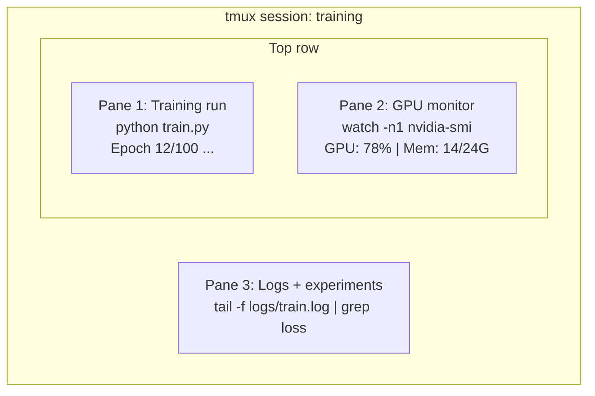

# Terminal et Shell, terminal et Shell.

> Le terminal est où vivent les ingénieurs de l'IA.
> C'est la maison de l'ingénieur de l'IA.

**Type:** Learn | **类型:** 学习
**Languages:** -- | **语言:** 无
**Prerequisites:** Phase 0, Lesson 01 | **前置知识:** Phase 0, 第 01 课
**Time:** ~35 minutes | **时间:** ~35 分钟

## Objectifs d'apprentissage

- Utilisez des tuyaux, des redirections et `grep`pour filtrer et traiter les journaux d'entraînement à partir de la ligne de commande
  Le texte de la lettre de la première lettre est écrit en français.`grep`De l'ordre de la ligne de travail et de traitement
- Créer des sessions de tmux persistantes avec plusieurs panneaux pour la formation simultanée et la surveillance de la GPU
  Création avec plusieurs tableaux de tmux 会话, utilisé pour entraîner et surveiller simultanément la GPU
- Surveiller les ressources du système et de la GPU avec `htop`- Je suis là .`nvtop`, et `nvidia-smi`
  Le mot " usage " est traduit par " usage "`htop`- Je suis là.`nvtop`et `nvidia-smi` Systèmes de surveillance et GPU  ressources
- Transfert de fichiers entre machines locales et distantes à l'aide de SSH, `scp`, et `rsync`
  Le mot "S" est traduit par "S".`scp`et `rsync`Dans les locaux et à distance entre les machines de transmission des fichiers

> **【中文解读】**
> Le terminal est l'outil le plus utilisé par les ingénieurs en IA. Il est utilisé pour former les modèles de contrôle de la GPU.

## Le problème .

Vous passerez plus de temps dans le terminal que dans n'importe quel éditeur. Exercices de formation, surveillance de GPU, suivi de journaux, sessions SSH à distance, gestion de l'environnement. Chaque flux de travail d'IA touche la coquille. Si vous êtes lent ici, vous êtes lent partout.

> Vous avez passé plus de temps au terminal que n'importe quel éditeur. Vous avez suivi des journaux, suivi des journaux, suivi des activités de l'AI.

Cette leçon couvre les compétences terminales qui comptent pour le travail de l'IA. Pas d'histoire d'Unix. Pas de plongée profonde dans le script Bash.

> Ce cours ne parle que des compétences de terminal vraiment nécessaires dans le travail de l'IA.

> **【中文解读】**
> Les ingénieurs d'IA sont plus nombreux que n'importe quel éditeur à la fin du temps. Ils ont besoin de formation, de modèles de surveillance, de GPU, de SSH à distance.

## Le concept de base.



Trois choses fonctionnent à la fois, un terminal, vous pouvez vous détacher, rentrer chez vous, revenir à la SSH, et vous vous attacher.

> Trois tâches sont en cours de fonctionnement, une fenêtre de terminaison. Vous pouvez vous séparer de la réunion.

> **【中文解读】**
> 终端复用是AI 工程师的核心技能――上图展示了一个典型的 tmux 会话: un tableau de bord running training、一个板监控 GPU、一个板查看日志──三个任务同时运行在一个终端窗口──断开SSH 后训练继续,第二天重新连接即可恢复──

> **【拓展：tmux 在 GPU 训练中的重要性】**
> Dans le cas d'AWS, il faut refaire des exercices de formation en utilisant des GPU 8x A100, environ 32,77/小时) et, si le blocage du journal entraîne une interruption de la formation, non seulement le gaspillage de tout le calcul effectué, mais aussi le retrait de la formation.

## Construisez-le et mettez-le en œuvre.
```figure
s0-shell-pipeline
```

## Faites-le

### Étape 1: Connaître votre coquille

Vérifiez quel obus vous utilisez:

> 检查你正在使用哪个 shell:

```bash
echo $SHELL
```

La plupart des systèmes utilisent `bash`ou `zsh`Les commandes de ce cours fonctionnent dans les deux.

> La plupart des systèmes utilisent`bash`Ou `zsh`Les deux sont possibles. Les instructions du cours sont applicables entre les deux.

Les choses essentielles à savoir:

> 关键知识:

```bash
# Move around
cd ~/projects/ai-engineering-from-scratch
pwd
ls -la

# History search (most useful shortcut you'll learn)
# Ctrl+R then type part of a previous command
# Press Ctrl+R again to cycle through matches

# Clear terminal
clear   # or Ctrl+L

# Cancel a running command
# Ctrl+C

# Suspend a running command (resume with fg)
# Ctrl+Z
```

### Étape 2: Piping et redirection

Le piping relie les commandes ensemble. C'est ainsi que vous traitez les journaux, la sortie des filtres et les outils de chaîne. Vous utiliserez cela constamment.

> Le tube va commander de se connecter ensemble. C'est la façon dont vous traitez le journal, les sorties et les outils de connexion.

> **【中文解读】**
> Le pipeline est le cœur de la philosophie Unix: chaque outil ne fait qu'une chose, en passant par le pipeline.`cat train.log | grep "loss" | wc -l`Cet article a pour but de vous faire comprendre que vous avez perdu des livres.`>`- Je suis là.`>>`- Je suis là.`2>`) contrôler la sortie et le déploiement du fichier ou de l'écran.

```bash
# Count how many times "loss" appears in a log  统计日志中 "loss" 出现的次数
cat train.log | grep "loss" | wc -l

# Extract just the loss values from training output  提取训练输出中的 loss 值
grep "loss:" train.log | awk '{print $NF}' > losses.txt

# Watch a log file update in real time, filtering for errors  实时过滤错误日志
tail -f train.log | grep --line-buffered "ERROR"

# Sort experiments by final accuracy  按最终准确率排序实验结果
grep "final_accuracy" results/*.log | sort -t= -k2 -n -r

# Redirect stdout and stderr to separate files  分别重定向标准输出和标准错误
python train.py > output.log 2> errors.log

# Redirect both to the same file  将所有输出合并到同一文件
python train.py > train_full.log 2>&1
```

Les trois redirections dont vous avez besoin:

> Il faut que tu maîtres trois choses:

| Symbol | What it does |
|--------|-------------|
| `>` | Write stdout to file (overwrite) |
| `>>` | Append stdout to file |
| `2>` | Write stderr to file |
| `2>&1` | Send stderr to same place as stdout |
| `\|` | Send stdout of one command as stdin to the next |

| 符号 | 作用 |
|------|------|
| `>` | 将标准输出写入文件（覆盖） |
| `>>` | 将标准输出追加到文件 |
| `2>` | 将标准错误写入文件 |
| `2>&1` | 将标准错误合并到标准输出 |
| `\|` | 将一个命令的输出传给下一个命令 |

### Étape 3: processus de fond

Les entraînements prennent des heures, mais on ne veut pas garder le terminal ouvert tout le temps.

> La formation prend quelques heures. Tu ne veux pas continuer à travailler.

```bash
# Run in background (output still goes to terminal)
python train.py &

# Run in background, immune to hangup (closing terminal won't kill it)
nohup python train.py > train.log 2>&1 &

# Check what's running in background
jobs
ps aux | grep train.py

# Bring a background job to foreground
fg %1

# Kill a background process
kill %1
# or find its PID and kill that
kill $(pgrep -f "train.py")
```

La différence entre `&`- Je suis là .`nohup`, et `screen`- Je suis là.`tmux`- Le numéro de la liste:

> `&`- Je suis là.`nohup`et `screen`- Je suis là.`tmux`Les différences:

| Method | Survives terminal close? | Can reattach? |
|--------|-------------------------|---------------|
| `command &` | No | No |
| `nohup command &` | Yes | No (check log file) |
| `screen` / `tmux` | Yes | Yes |

| 方式 | 关闭终端后存活？ | 可重新连接？ |
|------|---------------|-------------|
| `command &` | 否 | 否 |
| `nohup command &` | 是 | 否（查看日志文件） |
| `screen` / `tmux` | 是 | 是 |

Pour plus de quelques minutes, utilisez tmux.

> Pour plus de quelques minutes de tâches, utilisez votre tmux.

### Étape 4:

Tmux vous permet de créer des sessions terminales persistantes avec plusieurs panneaux.

> Tmux 让你创建带多面板的持久终端会话── c'est l'outil le plus utile pour gérer la formation.

> **【中文解读】**
> tmux est un terminal réutilisateur, capable de créer plusieurs tablettes (pane) et plusieurs fenêtres (fenêtre), de se déconnecter de la SSH 后会话仍然在后台运行── c'est l'outil le plus important pour gérer les tâches de formation de la GPU── le code ci-dessus montre l'opération centrale de tmux:

```bash
# Install
# macOS
brew install tmux
# Ubuntu
sudo apt install tmux

# Start a named session
tmux new -s training

# Split horizontally
# Ctrl+B then "

# Split vertically
# Ctrl+B then %

# Navigate between panes
# Ctrl+B then arrow keys

# Detach (session keeps running)
# Ctrl+B then d

# Reattach
tmux attach -t training

# List sessions
tmux ls

# Kill a session
tmux kill-session -t training
```

Une session typique de flux de travail d'IA:

> 典型 AI 工作流会话:

```bash
tmux new -s train

# Pane 1: start training
python train.py --epochs 100 --lr 1e-4

# Ctrl+B, " to split, then run GPU monitor
watch -n1 nvidia-smi

# Ctrl+B, % to split vertically, tail the logs
tail -f logs/experiment.log

# Now detach with Ctrl+B, d
# SSH out, go get coffee, come back
# tmux attach -t train
```

### Étape 5: Surveillance avec htop et nvtop

```bash
# System processes (better than top)  系统进程监控（比 top 更好用）
htop

# GPU processes (if you have NVIDIA GPU)  GPU 进程监控
# Install: sudo apt install nvtop (Ubuntu) or brew install nvtop (macOS)
nvtop

# Quick GPU check without nvtop  快速查看 GPU 状态
nvidia-smi

# Watch GPU usage update every second  每秒刷新 GPU 使用情况
watch -n1 nvidia-smi

# See which processes are using the GPU  查看占用 GPU 的进程
nvidia-smi --query-compute-apps=pid,name,used_memory --format=csv
```

> **【拓展：GPU 监控在实际训练中的价值】**
> Dans la formation multi-GPU, le taux d'utilisation de la GPU est inférieur à 80% et signifie généralement que le chargement de données est un boîtier de données.`nvidia-smi`Il est possible de trouver rapidement: une faible réserve de données.`--query-compute-apps`Le paramètre peut précisément trouver quel processus occupe le GPU 显存

`htop`Les liens de clé que vous utiliserez:

> `htop`常用快捷键:

- `F6`ou `>`pour trier par colonne (trier par mémoire pour trouver des fuites de mémoire)
  Le mot grec traduit par " le mot grec "`F6`Ou `>`按列排序(按内存排序找到内存泄漏)
- `F5`pour changer la vue d'arbre (voir processus enfant)
  Le mot grec traduit par " le mot grec "`F5`切换树形视图(查看子进程)
- `F9`pour tuer un processus
  Le mot grec traduit par " le mot grec "`F9`终止进程
- `/`pour rechercher un nom de processus
  Le mot grec traduit par " le mot grec "`/`搜索进程名

### Étape 6: SSH pour les boîtes de GPU à distance

Lorsque vous louez un GPU en nuage (Lambda, RunPod, Vast.ai), vous vous connectez via SSH.

> Quand vous utilisez le GPU de cloud, vous pouvez utiliser le système de connexion.

```bash
# Basic connection  基本 SSH 连接
ssh user@gpu-box-ip

# With a specific key  使用指定密钥连接
ssh -i ~/.ssh/my_gpu_key user@gpu-box-ip

# Copy files to remote  复制文件到远程服务器
scp model.pt user@gpu-box-ip:~/models/

# Copy files from remote  从远程服务器复制文件
scp user@gpu-box-ip:~/results/metrics.json ./

# Sync a whole directory (faster for many files)  同步整个目录（比 scp 更快）
rsync -avz ./data/ user@gpu-box-ip:~/data/

# Port forward (access remote Jupyter/TensorBoard locally)  端口转发（本地访问远程服务）
ssh -L 8888:localhost:8888 user@gpu-box-ip
# Now open localhost:8888 in your browser
```

# Configuration SSH pour la commodité
# Ajouter à ~/.ssh/config:
# Gpu hôte
#     Nom d'hôte 192.168.1.100
#     Utilisateur Ubuntu
#     Fichier d'identité ~/.ssh/gpu_key
Je suis là.
# Alors, juste:
# le système de gestion des ressources
```

### Step 7: Useful aliases for AI work

> **【中文解读】**
> Shell 别名（alias）是将常用长命令缩短为短命令的方式。AI 工程中，`gpu` 查看 GPU 状态、`killtraining` 终止所有训练进程、`watchloss` 实时监控 loss——这些别名每天要用几十次。将它们加入 `~/.bashrc` 或 `~/.zshrc` 后，每次打开终端自动生效。

Add these to your `~/.bashrc` or `~/.zshrc`:

> 将这些添加到你的 `~/.bashrc` 或 `~/.zshrc`：

```bash
phases source/00-configuration et outillage/10-terminal-et-shell/code/shell_aliases.sh
```

Or copy the ones you want. The key aliases:

> 或者复制你想要的。关键别名：

```bash
# L' état de la GPU à un coup d' œil
alias gpu='nvidia-smi --query-gpu=index,nom,utilisation.gpu, mémoire.utilisé,mémoire.total,température.gpu --format=csv,noheader'

# Éliminer tous les processus de formation Python 终止所有训练进程
alias "killetraining" = "pkill -f "python.*train"

# Environnement virtuel rapide activé 快速激活虚拟环境
alias ae='source .venv/bin/activate'

# Réservation de formation 实时监控
- Je suis en train de faire une petite histoire.
```

See `code/shell_aliases.sh` for the full set.

> 完整的别名列表参见 `code/shell_aliases.sh`。

> **【拓展：管道与重定向在 AI 日志分析中的威力】**
> 在 Google Brain 和 DeepMind，研究员用管道链处理实验日志：`grep "loss" train.log | awk '{print $3}' | sort -n | head -5` 可以在一秒内从百万行日志中找出 loss 最低的 5 个 epoch。这种技能不依赖任何 IDE 或 GUI 工具，在远程 GPU 服务器上尤其有用——那里只有终端可用。

### Step 8: Common AI terminal patterns

These come up repeatedly in practice:

> 这些模式在实践中反复出现：

> **【中文解读】**
> 这些是 AI 工程中反复出现的终端模式：用 `tee` 同时输出到终端和日志文件、用 `diff` 对比实验结果、用 `find` 找到最大的模型文件清理磁盘、用 `tar` 解压数据集。掌握这些命令组合能大幅提升日常效率。

```bash
# Faites des entraînements, enregistrez tout, avisez quand c'est fait
python train.py 2>&1 ✓ tee train.log; écho "DONE" ✓ mail -s "Training complete" you@email.com

# Comparer deux journaux d'expérimentation côte à côte
diff <(grep "exactitude" exp1.log) <(grep "exactitude" exp2.log)

# Trouver les plus grands fichiers de modèle (nettoyer l'espace disque)
Je suis en train de trouver un " *pt " -o -nom " *safetensors "

# Téléchargez un modèle de Hugging Face
Je suis là .https://huggingface.co/model/resolve/main/model.safetensors

# Décomposer un ensemble de données
tar xzf ensemble de données.tar.gz -C./data/

# Comptez les lignes dans tous les fichiers Python (voir la taille de votre projet)
Je suis là pour trouver.

# Vérifiez l'espace disque (les données de formation remplissent rapidement les disques)
df -h
du -sh./ données/*

# Vérifie des variables environnementales avant la formation
Je sais que c' est vrai.
Env je sais que la torche
```

## Use It | 用框架实现

Here's when each tool comes into play during this course:

> 以下是每个工具在本课程中的使用场景：

| Tool | When you use it |
|------|----------------|
| tmux | Every training run (Phases 3+) |
| `tail -f` + `grep` | Monitoring training logs |
| `nohup` / `&` | Quick background tasks |
| `htop` / `nvtop` | Debugging slow training, OOM errors |
| SSH + `rsync` | Working on cloud GPUs |
| Piping + redirects | Processing experiment results |
| Aliases | Saving time on repetitive commands |

| 工具 | 使用场景 |
|------|---------|
| tmux | 所有训练任务（Phase 3+） |
| `tail -f` + `grep` | 监控训练日志 |
| `nohup` / `&` | 快速后台任务 |
| `htop` / `nvtop` | 排查训练慢、OOM 错误 |
| SSH + `rsync` | 云 GPU 工作 |
| 管道 + 重定向 | 处理实验结果 |
| 别名 | 节省重复命令时间 |

> **【拓展：AI 工程师的终端工作流】**
> 一个高效的 AI 工程师通常同时维护 2-3 个 tmux 会话：一个用于训练（长时间运行）、一个用于数据处理和调试、一个用于监控。SSH config 文件可以简化连接——配置好后只需 `ssh gpu` 就能连上远程服务器。rsync 是传输大数据集的最佳选择，它只传输变化的字节，支持断点续传，比 scp 快 10 倍以上。

## Exercises | 练习题

1. Install tmux, create a session with three panes, and run `htop` in one, `watch -n1 date` in another, and a Python script in the third. Detach and reattach.
   安装 tmux，创建包含三个面板的会话，分别运行 htop、定时命令和 Python 脚本，然后分离并重新连接。
2. Add the aliases from `code/shell_aliases.sh` to your shell config and reload with `source ~/.zshrc` (or `~/.bashrc`).
   将 `code/shell_aliases.sh` 中的别名添加到你的 shell 配置中并重载。
3. Create a fake training log with `for i in $(seq 1 100); do echo "epoch $i loss: $(echo "scale=4; 1/$i" | bc)"; sleep 0.1; done > fake_train.log` and then use `grep`, `tail`, and `awk` to extract just the loss values.
   创建模拟训练日志，用 `grep`、`tail` 和 `awk` 提取 loss 值。
4. Set up an SSH config entry for a server you have access to (or use `localhost` to practice the syntax).
   为你有权限的服务器设置 SSH config 条目。

## Key Terms | 关键术语

| Term | What people say | What it actually means |
|------|----------------|----------------------|
| Shell | "The terminal" | The program that interprets your commands (bash, zsh, fish) |
| tmux | "Terminal multiplexer" | A program that lets you run multiple terminal sessions inside one window, and detach/reattach |
| Pipe | "The bar thing" | The `\|` operator that sends one command's output as input to another |
| PID | "Process ID" | A unique number assigned to every running process, used to monitor or kill it |
| nohup | "No hangup" | Runs a command immune to the hangup signal, so closing the terminal won't kill it |
| SSH | "Connecting to the server" | Secure Shell, an encrypted protocol for running commands on a remote machine |

| 术语 | 俗称 | 实际含义 |
|------|------|---------|
| Shell | "终端" | 解释执行命令的程序（bash、zsh、fish） |
| tmux | "终端复用器" | 在一个窗口中运行多个终端会话，支持分离/重连 |
| Pipe（管道） | "竖线那个" | `\|` 操作符，将一个命令的输出传给另一个命令 |
| PID | "进程号" | 每个运行进程的唯一编号，用于监控或终止 |
| nohup | "不挂断" | 关闭终端也不会终止命令 |
| SSH | "连服务器" | 安全外壳协议，用于远程执行命令 |
