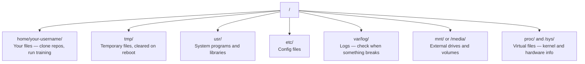

# Linux pour l'IA. Linux base.

> La plupart des IA fonctionnent sur Linux. Vous devez en savoir assez pour ne pas être coincé.
> La plupart des IA fonctionnent sur Linux. Vous devez avoir suffisamment de connaissances, pas seulement pour être installé.

**Type:** Learn | **类型:** 学习
**Languages:** -- | **语言:** 无
**Prerequisites:** Phase 0, Lesson 01 | **前置知识:** Phase 0, 第 01 课
**Time:** ~30 minutes | **时间:** ~30 分钟

## Objectifs d'apprentissage

- Naviguez le système de fichiers Linux et effectuez des opérations de fichiers essentielles à partir de la ligne de commande
  Traduction anglaise: dans Linux 文件系统中导航, de commandes à commandes à opérations de base de fichiers
- Gérer les autorisations de fichier avec `chmod`et `chown`pour résoudre les erreurs "Permission refusée"
  Le mot " usage " est traduit par " usage "`chmod`et `chown`管理文件权限, résoudre "Permission refusée" erreur
- Installez des paquets système avec `apt`et mettre en place une nouvelle boîte de GPU pour le travail de l'IA
  Le mot " usage " est traduit par " usage "`apt`Installation du système, pour un nouveau GPU  Configuration du serveur AI  travail environnement
- Identifier les différences entre macOS et Linux qui font souvent trébucher les développeurs travaillant sur des machines distantes
  Reconnaissance de la transition de macOS à Linux

> **【中文解读】**
> La plupart des entraînements d'IA se déroulent sur des serveurs Linux. Lorsque vous utilisez SSH pour le cloud GPU, vous n'avez que la interface du terminal.

## Le problème .

Vous développez sur macOS ou Windows. Mais dès que vous mettez un SSH dans une boîte de GPU en nuage, louez une instance Lambda, ou mettez en place une machine EC2, vous atterrissez dans Ubuntu. Le terminal est votre seule interface. Il n'y a pas de Finder, pas d'Explorateur, pas d'interface graphique. Si vous ne pouvez pas naviguer dans le système de fichiers, installer des paquets et gérer les processus à partir de la ligne de commande, vous êtes bloqué à payer pour des heures de GPU en déstabilisation pendant que vous recherchez "comment déchiffrer un fichier dans Linux".

> Vous êtes sur macOS ou Windows. Mais une fois que vous avez accès à un serveur GPU cloud, loué un Lambda ou lancé une machine EC2, vous êtes entré dans Ubuntu. Le terminal est votre seule interface.

Ceci est un guide de survie. Il couvre exactement ce dont vous avez besoin pour fonctionner sur une machine Linux distante pour le travail de l'IA.

> Ceci est un guide de survie. Il ne couvre que les connaissances nécessaires pour effectuer des travaux d'IA sur des machines Linux éloignées.

> **【中文解读】**
> Vous avez l'habitude de développer avec macOS ou Windows, mais un serveur de GPU SSH vers le cloud est entré dans le monde Linux. Il n'y a pas de gestionnaire de fichiers, seulement le terminal.

## L' organisation du système de fichiers

Linux organise tout sous une seule racine `/`Il n' y en a pas .`C:\`ou `/Volumes`Les annuaires que vous toucherez:

> Linux organisera tout le contenu dans un seul répertoire.`/`Il n'y a pas de`C:\`Ou `/Volumes`你实际会接触的目录:

> **【中文解读】**
> Linux 文件系统是单树状结构,根目录是 `/`Il y a une autre.`/home/用户名/`(简写 `~`) est votre dossier de travail, presque toutes les opérations sont effectuées ici.`/tmp/`存临时文件, réécrire`/var/log/`Il y a des problèmes, il faut les voir.`/mnt/`                                                                                                                                                                                                                                                              



Votre répertoire de domicile est `~`ou `/home/your-username`Presque tout ce que vous faites se passe ici.

> Votre répertoire principal est `~`Ou `/home/your-username`La plupart des opérations sont en cours.

## Commandes essentielles.

Ce sont les 15 commandes qui couvrent 95% de ce que vous ferez sur une boîte de GPU à distance.

> Ces 15 commandes couvrent 95% de votre fonctionnement sur un serveur GPU distant.

> **【中文解读】**
> Vous n'avez qu'à maîtriser environ 15 commandes pour pouvoir effectuer 95% du travail sur un serveur Linux distant. Ces commandes sont divisées en quatre catégories:

### Je me déplace.

```bash
pwd                         # Where am I?  当前在哪个目录？
ls                          # What's here?  列出当前目录内容
ls -la                      # What's here, including hidden files with details?  详细列出所有文件（含隐藏文件）
cd /path/to/dir             # Go there  切换到指定目录
cd ~                        # Go home  回到主目录
cd ..                       # Go up one level  返回上一级目录
```

### Fichiers et annuaires

```bash
mkdir my-project            # Create a directory  创建目录
mkdir -p a/b/c              # Create nested directories in one shot  递归创建多级目录

cp file.txt backup.txt      # Copy a file  复制文件
cp -r src/ src-backup/      # Copy a directory (recursive)  递归复制目录

mv old.txt new.txt          # Rename a file  重命名文件
mv file.txt /tmp/           # Move a file  移动文件

rm file.txt                 # Delete a file (no trash, it's gone)  删除文件（无法恢复！）
rm -rf my-dir/              # Delete a directory and everything inside  递归删除目录（危险操作！）
```

`rm -rf`Il n'y a pas de révocation.

> `rm -rf`Il n'y a pas de retrait.

### Je lis des fichiers .

```bash
cat file.txt                # Print entire file  打印整个文件内容
head -20 file.txt           # First 20 lines  查看前 20 行
tail -20 file.txt           # Last 20 lines  查看后 20 行
tail -f log.txt             # Follow a log file in real time (Ctrl+C to stop)  实时跟踪日志文件
less file.txt               # Scroll through a file (q to quit)  分页浏览文件
```

### Chercher et trouver

```bash
grep "error" training.log           # Find lines containing "error"  搜索包含 "error" 的行
grep -r "learning_rate" .           # Search all files in current directory  递归搜索所有文件
grep -i "cuda" config.yaml          # Case-insensitive search  不区分大小写搜索

find . -name "*.py"                 # Find all Python files under current dir  查找所有 Python 文件
find . -name "*.ckpt" -size +1G     # Find checkpoint files larger than 1GB  查找大于 1GB 的检查点文件
```

## Permissions de documentation

Chaque fichier de Linux a un propriétaire et des permissions, vous allez vous retrouver là-bas quand les scripts ne s'exécutent pas ou vous ne pouvez pas écrire dans un répertoire.

> Chaque fichier de Linux a un propriétaire et des autorisations. Lorsque le script est incapable d'exécuter ou d'écrire dans le répertoire, vous rencontrez ce problème.

> **【中文解读】**
> Linux 权限分为三组:文件所有者 (propriétaire) 、同组用户 (utilisateur) 、其他用户 (utilisateur) 、其他用户 (utilisateur) 、每组有读 (读) 、写 (写) 、执行 (exécuter) 、x) 三种权限──`chmod +x`让脚本可执行,`chmod 644`setting files for owners can read write 、 others only read ‖ "Permission refusé"  errore presque tout est possible `chmod`Ou `sudo`- Je veux le résoudre.

```bash
ls -l train.py
# -rwxr-xr-- 1 user group 2048 Mar 19 10:00 train.py
#  ^^^             owner permissions: read, write, execute
#     ^^^          group permissions: read, execute
#        ^^        everyone else: read only
```

Réparations communes:

> 常见修复方法:

```bash
chmod +x train.sh           # Make a script executable  让脚本可执行
chmod 755 deploy.sh         # Owner: full, others: read+execute  所有者全部权限，其他人可读可执行
chmod 644 config.yaml       # Owner: read+write, others: read only  所有者可读写，其他人只读

chown user:group file.txt   # Change who owns a file (needs sudo)  修改文件所有者（需要 sudo）
```

Quand quelque chose dit "permission refusée", c'est presque toujours une question de permissions. `chmod +x`ou `sudo`Il va régler la plupart des affaires.

> Quand il y a une "permission refusée", il y a presque toujours des problèmes de droits.`chmod +x`Ou `sudo`能解决 la plupart des situations.

## Gestion des colis (apt) 包管理

Ubuntu utilise `apt`C'est comme ça que l'on installe un logiciel au niveau du système.

> Ubuntu 使用 `apt`C'est la façon dont le logiciel est installé.

```bash
sudo apt update             # Refresh the package list (always do this first)  更新软件包列表（首先执行）
sudo apt install -y htop    # Install a package (-y skips confirmation)  安装软件包（-y 跳过确认）
sudo apt install -y build-essential  # C compiler, make, etc. Needed by many Python packages  C 编译器和构建工具
sudo apt install -y tmux    # Terminal multiplexer (keep sessions alive after disconnect)  终端复用器

apt list --installed        # What's installed?  查看已安装的软件包
sudo apt remove htop        # Uninstall  卸载软件包
```

> **【中文解读】**
> `apt`C'est le gestionnaire de paquets d'Ubuntu.`apt update`刷新列表──`build-essential`提供 C 编译器, beaucoup de Python 包(如numpy、torch) ont besoin de cela pour compiler。`tmux`C'est un outil indispensable pour maintenir une conversation à distance.

> **【拓展：新 GPU 服务器的初始化清单】**
> Après avoir obtenu un nouveau serveur GPU, il faut généralement exécuter:`apt update && apt install -y build-essential git curl wget tmux htop unzip python3-venv` puis installer NVIDIA 驱动和 CUDA Toolkit, réinstaller conda/uv──AWS EC2 Deep Learning AMI 已预装大部分工具, mais les exemples de Lambda Labs 和 Vast.ai nécessitent généralement une démarrage manuel──

Les paquets communs que vous installeriez sur une boîte de GPU fraîche:

> Les paquets généralement installés sur le nouveau serveur GPU:

```bash
sudo apt update && sudo apt install -y \
    build-essential \
    git \
    curl \
    wget \
    tmux \
    htop \
    unzip \
    python3-venv
```

## Utilisateurs et sudo. Utilisateurs et autorisations augmentées

Vous êtes habituellement connecté en tant qu'utilisateur régulier. Certaines opérations nécessitent un accès root (admin).

> Vous êtes habituellement un utilisateur ordinaire. Certaines opérations nécessitent des limites de contrôle.

```bash
whoami                      # What user am I?  查看当前用户名
sudo command                # Run a single command as root  以 root 权限执行命令
sudo su                     # Become root (exit to go back, use sparingly)  切换为 root 用户（谨慎使用）
```

> **【中文解读】**
> Linux a des niveaux de permissions strictes. L'utilisateur ordinaire ne peut gérer que ses propres fichiers, il a besoin d'un niveau d'opération systémique.`sudo`(superutilisateur fait)  La meilleure pratique est seulement l'utilisation en cas de besoin `sudo`Ne pas utiliser de longue durée pour supprimer les fichiers du système.

Dans les instances de GPU cloud, vous êtes généralement le seul utilisateur et avez déjà accès à sudo. Ne pas tout exécuter comme root. Utilisez sudo seulement lorsque nécessaire.

> Dans l'exemple du cloud GPU, vous êtes généralement le seul utilisateur et avez déjà des autorisations de sudo.

## Les processus et le système sont gérés.

Quand votre entraînement est suspendu, ou vous devez vérifier ce qui se passe:

> Lorsque vous êtes en train de travailler ou lorsque vous avez besoin de vérifier le processus en cours:

```bash
htop                        # Interactive process viewer (q to quit)  交互式进程查看器
ps aux | grep python        # Find running Python processes  查找 Python 进程
kill 12345                  # Gracefully stop process with PID 12345  优雅终止进程
kill -9 12345               # Force kill (use when graceful doesn't work)  强制终止进程
nvidia-smi                  # GPU processes and memory usage  查看 GPU 进程和显存
```

> **【中文解读】**
> Quand on s'entraîne, on est là.`htop`查看哪个进程占用资源,用 `kill`- Le processus de mise en œuvre`kill -9`C'est une fin obligatoire, juste en général.`kill`无效时使用──`nvidia-smi`C'est l'ordre central de la gestion des processus de la GPU, pour voir quels processus utilisent la GPU.

systèmed gère les services (daimons de fond). Vous l'utiliserez si vous exécutez des serveurs d'inférence:

> Si vous utilisez le serveur, vous pouvez utiliser:

```bash
sudo systemctl start nginx          # Start a service  启动服务
sudo systemctl stop nginx           # Stop it  停止服务
sudo systemctl restart nginx        # Restart it  重启服务
sudo systemctl status nginx         # Check if it's running  查看服务状态
sudo systemctl enable nginx         # Start automatically on boot  设置开机自启
```

## Espace disque

Les boîtes GPU ont souvent un espace disque limité.

> L'espace disque du serveur GPU est généralement limité.

```bash
df -h                       # Disk usage for all mounted drives  查看所有磁盘使用情况
df -h /home                 # Disk usage for /home specifically  查看 /home 分区使用情况

du -sh *                    # Size of each item in current directory  查看当前目录各项大小
du -sh ~/.cache             # Size of your cache (pip, huggingface models land here)  缓存目录大小
du -sh /data/checkpoints/   # Check how big your checkpoints are  检查检查点文件大小

# Find the biggest space hogs  找出最大的空间占用
du -h --max-depth=1 / 2>/dev/null | sort -hr | head -20
```

> **【中文解读】**
> L'espace disque du serveur GPU est souvent insuffisant.`df -h`查看整体磁盘使用,用 `du -sh *`找到具体哪个目录占占地最多── régulièrement nettoyé `~/.cache/huggingface/`Et les anciens documents de contrôle.

Économiseurs d'espace communs:

> 常见的空间清理方法:

```bash
# Clear pip cache  清理 pip 缓存
pip cache purge

# Clear apt cache  清理 apt 缓存
sudo apt clean

# Remove old checkpoints you don't need  删除不需要的旧检查点
rm -rf checkpoints/epoch_01/ checkpoints/epoch_02/
```

## Réseau d'exploitation

Vous téléchargerez des modèles, transférerez des fichiers et saisirez les API à partir de la ligne de commande.

> Vous allez télécharger des modèles, des fichiers de transfert et modifier l'API.

```bash
# Download files  下载文件
wget https://example.com/model.bin                   # Download a file  下载文件
curl -O https://example.com/data.tar.gz              # Same thing with curl  用 curl 下载
curl -s https://api.example.com/health | python3 -m json.tool  # Hit an API, pretty-print JSON  调用 API 并格式化输出

# Transfer files between machines  在机器间传输文件
scp model.bin user@remote:/data/                     # Copy file to remote machine  复制文件到远程机器
scp user@remote:/data/results.csv .                  # Copy file from remote to local  从远程复制到本地
scp -r user@remote:/data/checkpoints/ ./local-dir/   # Copy directory  复制整个目录

# Sync directories (faster than scp for large transfers, resumes on failure)  同步目录（比 scp 快，支持断点续传）
rsync -avz --progress ./data/ user@remote:/data/
rsync -avz --progress user@remote:/results/ ./results/
```

> **【中文解读】**
> Les ordres de réseau sont des outils quotidiens de l'ingénieur en IA.`wget`et `curl`Télécharger le modèle et le ensemble de données.`scp`Dans les archives locales et éloignées.`rsync`Il ne permet de transmettre que des caractères modifiés, de maintenir des flux de données plus rapides que le scp.

> **【拓展：rsync 在 AI 工作流中的关键作用】**
> Lorsque vous avez terminé un LLM sur AWS p4d, vous devez transférer 50 Go de points de contrôle en local. Avec scp  transmissionn environ 30 minutes, si vous êtes en train de refaire le processus, vous pouvez refaire le processus en rsync.

Utilisation `rsync`- Je suis passé .`scp`Il ne transfère que des octets modifiés et gère les connexions interrompues.

>  Pour le grand dossier, utilisation prioritaire `rsync`Il n'y a pas de`scp`Il ne peut traiter que les caractères de la transmission, et il ne peut traiter les interruptions de connexion.

## Gardez les sessions en vie

Quand vous mettez votre ordinateur portable dans une boîte à distance, fermer votre ordinateur portable tue votre course d'entraînement.

> Lorsque vous êtes sur un serveur à distance, fermez votre ordinateur.

```bash
tmux new -s train           # Start a new session named "train"  创建名为 "train" 的新会话
# ... start your training, then:
# Ctrl+B, then D            # Detach (training keeps running)  分离会话（训练继续运行）

tmux ls                     # List sessions  列出所有会话
tmux attach -t train        # Reattach to session  重新连接到会话

# Inside tmux:  tmux 内操作：
# Ctrl+B, then %            # Split pane vertically  垂直分割面板
# Ctrl+B, then "            # Split pane horizontally  水平分割面板
# Ctrl+B, then arrow keys   # Switch between panes  切换面板
```

> **【中文解读】**
> Tmux est un outil de sécurité de l'entraînement de la GPU à distance.`Ctrl+B, D`Je suis parti, l'entraînement a commencé.`tmux attach`Les tâches de formation doivent être effectuées avec le temps.

Il y a toujours des longs trains à l'intérieur de la machine.

> 长时间训练任务务必在tmux 中运行──务必如此──

> **【拓展：Linux 在 AI 基础设施中的统治地位】**
> Plus de 99% de la formation AI dans le monde fonctionne sur Linux. AWS, GCP, Azure, GPU, etc. fonctionne principalement sur Linux.

## WSL2 pour les utilisateurs Windows

> **【中文解读】**
> WSL2  Faire en sorte que les utilisateurs de Windows puissent obtenir un véritable Linux  Environnement, sans avoir besoin de deux systèmes. GPU Direct est pris en charge.`/mnt/c/Users/用户名/`访问── c'est la meilleure solution pour les utilisateurs de Windows pour apprendre Linux et développer l'IA──

Si vous utilisez Windows, WSL2 vous donne un véritable environnement Linux sans double démarrage.

> Si vous utilisez Windows, WSL2 无需双系统就能给您真正的Linux 环境──

```bash
# In PowerShell (admin)
wsl --install -d Ubuntu-24.04

# After restart, open Ubuntu from Start menu
sudo apt update && sudo apt upgrade -y
```

WSL2 fonctionne avec un véritable noyau Linux. Tout ce qui est dans cette leçon fonctionne à l'intérieur.`/mnt/c/Users/YourName/`de l'intérieur de la WSL.

> WSL2 运行真正的Linux内核──本课件所有内容都可在其中使用──Windows 文件在 WSL内通过 `/mnt/c/Users/YourName/`访问 💚

Le GPU passe par le biais de fonctionne avec les pilotes NVIDIA installés sur le côté Windows. Installez le pilote NVIDIA Windows (pas le Linux), et CUDA sera disponible à l'intérieur de WSL2.

> GPU directement à travers Windows 侧安装的NVIDIA 驱动工作──安装 Windows 版NVIDIA 驱动(不是Linux 版),CUDA 就能在 WSL2 内使用──

> **【拓展：WSL2 GPU 支持的实际表现】**
> Les performances directes du GPU de WSL2 sont proches des performances de Linux, PyTorch et TensorFlow.`nvidia-smi`Vous pouvez voir la GPU de Windows.`/mnt/c/`) est de 3 à 5 fois plus lent que le système de fichiers WSL2`~/`Actuellement, pour obtenir les meilleures performances.

## MacOS à Linux

Des choses qui vous étonneront si vous venez de macOS:

> Si vous êtes passé de macOS à macOS, ces choses vous feront piéger:

| macOS | Linux | Notes |
|-------|-------|-------|
| `brew install` | `sudo apt install` | Different package names sometimes. `brew install htop` vs `sudo apt install htop` works the same, but `brew install readline` vs `sudo apt install libreadline-dev` does not. |
| `open file.txt` | `xdg-open file.txt` | But you won't have a GUI on a remote box. Use `cat` or `less`. |
| `pbcopy` / `pbpaste` | Not available | Pipe to/from clipboard doesn't exist over SSH. |
| `~/.zshrc` | `~/.bashrc` | macOS defaults to zsh. Most Linux servers use bash. |
| `/opt/homebrew/` | `/usr/bin/`, `/usr/local/bin/` | Binaries live in different places. |
| `sed -i '' 's/a/b/' file` | `sed -i 's/a/b/' file` | macOS sed needs an empty string after `-i`. Linux does not. |
| Case-insensitive filesystem | Case-sensitive filesystem | `Model.py` and `model.py` are two different files on Linux. |
| Line endings `\n` | Line endings `\n` | Same. But Windows uses `\r\n`, which breaks bash scripts. Run `dos2unix` to fix. |

| macOS | Linux | 注意事项 |
|------|------|---------|
| `brew install` | `sudo apt install` | 包名有时不同，如 readline vs libreadline-dev |
| `open file.txt` | `xdg-open file.txt` | 远程服务器无 GUI，用 `cat` 或 `less` |
| `pbcopy` / `pbpaste` | 不可用 | SSH 下无法操作剪贴板 |
| `~/.zshrc` | `~/.bashrc` | macOS 默认 zsh，Linux 服务器多用 bash |
| `/opt/homebrew/` | `/usr/bin/`, `/usr/local/bin/` | 可执行文件路径不同 |
| `sed -i '' 's/a/b/' file` | `sed -i 's/a/b/' file` | macOS sed 的 `-i` 后需要空字符串 |
| 大小写不敏感 | 大小写敏感 | `Model.py` 和 `model.py` 是两个不同文件 |
| 换行符 `\n` | 换行符 `\n` | 相同，但 Windows 的 `\r\n` 会破坏 bash 脚本 |

## Une carte de référence rapide.

```
Navigation:     pwd, ls, cd, find
Files:          cp, mv, rm, mkdir, cat, head, tail, less
Search:         grep, find
Permissions:    chmod, chown, sudo
Packages:       apt update, apt install
Processes:      htop, ps, kill, nvidia-smi
Services:       systemctl start/stop/restart/status
Disk:           df -h, du -sh
Network:        curl, wget, scp, rsync
Sessions:       tmux new/attach/detach
```

## Les exercices
```figure
s0-process-fork
```

## Exercices

1. SSH dans n'importe quelle machine Linux (ou ouvrir WSL2) et naviguer vers votre répertoire d'accueil.`touch`, puis lister avec `ls -la`- Je suis désolé .
   SSH vers Linux 机器, créer des projets 文件和空文件,用 `ls -la`列出
2. Installez`htop`avec apt, l'exécuter, et identifier le processus qui utilise le plus de mémoire.
   Utiliser apt install htop, trouver le plus de processus qui occupent la mémoire
3. Commencez une séance de tmux, courez `sleep 300`à l'intérieur, détachement, liste des sessions, et reattacher.
   创建 tmux 会话,运行睡眠 命令,分离后重新连接
4. Utilisation `df -h`pour vérifier l'espace disque disponible, puis utiliser `du -sh ~/.cache/*`pour trouver ce qui occupe de l'espace dans votre cache.
   Check disk space, trouver le contenu le plus important dans le cache
5. Transférer un fichier de votre machine locale à une machine à distance en utilisant `scp`, puis faites le même transfert avec `rsync`et comparer l'expérience.
   Utilisation de scp et rsync, séparation de fichiers de transmission, par rapport à deux façons
